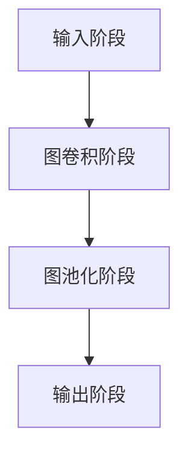

                 

# 图神经网络在大模型中的应用

> 关键词：图神经网络、大模型、深度学习、机器学习、图表示学习、图算法、分布式计算

> 摘要：本文将深入探讨图神经网络在大模型中的应用，包括其核心概念、算法原理、数学模型以及实际应用场景。通过对图神经网络的详细剖析，读者将了解如何将图神经网络应用于大规模数据处理，从而推动人工智能技术的发展。

## 1. 背景介绍

### 1.1 目的和范围

本文旨在探讨图神经网络（Graph Neural Network，GNN）在大模型中的应用。随着大数据和深度学习的快速发展，传统神经网络在处理复杂关系数据时面临着诸多挑战。图神经网络作为一种新型的深度学习模型，通过建模节点和边之间的关系，能够在处理大规模、复杂结构的数据时展现出强大的性能。本文将重点关注以下内容：

1. 图神经网络的基本概念和原理。
2. 图神经网络在大模型中的具体应用。
3. 图神经网络的核心算法原理和数学模型。
4. 图神经网络在实际项目中的实战案例。

### 1.2 预期读者

本文适合以下读者群体：

1. 对深度学习和机器学习有一定了解的读者。
2. 对图神经网络和图算法感兴趣的读者。
3. 希望了解大模型在人工智能领域应用的读者。

### 1.3 文档结构概述

本文结构如下：

1. 背景介绍：介绍图神经网络在大模型中的应用的背景、目的和范围。
2. 核心概念与联系：阐述图神经网络的核心概念、原理和架构。
3. 核心算法原理 & 具体操作步骤：详细讲解图神经网络的基本算法原理和操作步骤。
4. 数学模型和公式 & 详细讲解 & 举例说明：介绍图神经网络的数学模型，并通过实例进行说明。
5. 项目实战：代码实际案例和详细解释说明。
6. 实际应用场景：探讨图神经网络在各个领域的应用场景。
7. 工具和资源推荐：推荐学习资源和开发工具。
8. 总结：未来发展趋势与挑战。
9. 附录：常见问题与解答。
10. 扩展阅读 & 参考资料：提供进一步学习的相关资料。

### 1.4 术语表

#### 1.4.1 核心术语定义

- 图神经网络（Graph Neural Network，GNN）：一种基于图结构的深度学习模型，通过建模节点和边之间的关系来进行特征学习和预测。
- 节点（Node）：图中的基本元素，表示实体或数据点。
- 边（Edge）：连接节点的连线，表示节点之间的关系。
- 邻域（Neighborhood）：与某个节点直接相连的节点集合。
- 图表示学习（Graph Representation Learning）：将节点和边转化为低维特征表示的方法。

#### 1.4.2 相关概念解释

- 深度学习（Deep Learning）：一种基于多层神经网络的学习方法，通过自动学习大量数据中的特征表示，实现复杂任务的预测和分类。
- 机器学习（Machine Learning）：使计算机系统能够从数据中学习，并对新数据做出预测或决策的技术。
- 分布式计算（Distributed Computing）：通过网络将多个计算机连接起来，共同完成计算任务的技术。

#### 1.4.3 缩略词列表

- GNN：Graph Neural Network
- DNN：Deep Neural Network
- CNN：Convolutional Neural Network
- RNN：Recurrent Neural Network
- GCN：Graph Convolutional Network
- GAT：Graph Attention Network

## 2. 核心概念与联系

### 2.1 图神经网络的基本概念

图神经网络是一种基于图结构的深度学习模型，通过建模节点和边之间的关系来进行特征学习和预测。在图神经网络中，节点和边分别表示实体或数据点以及它们之间的关系，而图本身则是一种结构化数据表示方法。

#### 2.1.1 节点和边

节点（Node）是图中的基本元素，表示实体或数据点。例如，在社交网络中，每个用户都可以表示为一个节点。边（Edge）是连接节点的连线，表示节点之间的关系。例如，在社交网络中，用户之间的好友关系可以用边来表示。

#### 2.1.2 邻域

邻域（Neighborhood）是与某个节点直接相连的节点集合。在图神经网络中，邻域节点对节点的特征学习和预测具有重要意义，因为它们反映了节点之间的关系和属性。

#### 2.1.3 图表示学习

图表示学习（Graph Representation Learning）是一种将节点和边转化为低维特征表示的方法。通过图表示学习，可以将高维的节点和边数据映射到低维的特征空间，从而提高模型的效率和准确性。

### 2.2 图神经网络的核心概念与联系

图神经网络的核心概念包括：

1. **节点特征**：节点自身的属性和特征，例如，在社交网络中，用户的基本信息（年龄、性别、地理位置等）可以表示为节点特征。
2. **边特征**：边所表示的关系的特征，例如，在社交网络中，用户之间的互动信息（评论、点赞等）可以表示为边特征。
3. **图结构**：节点和边所组成的整体结构，反映了数据之间的复杂关系。
4. **图卷积**：图神经网络的核心操作，用于聚合节点邻域的信息，更新节点的特征表示。
5. **图池化**：用于将图神经网络在全局范围内进行信息聚合和整合。

### 2.3 图神经网络的工作原理

图神经网络的工作原理可以概括为以下几个步骤：

1. **输入阶段**：输入节点特征和边特征，建立图结构。
2. **图卷积阶段**：通过图卷积操作，聚合节点邻域的信息，更新节点的特征表示。
3. **图池化阶段**：将更新后的节点特征进行全局聚合，得到最终的输出特征。
4. **输出阶段**：根据输出特征进行分类、预测或生成。

### 2.4 Mermaid 流程图

下面是一个简单的 Mermaid 流程图，展示了图神经网络的工作流程：



## 3. 核心算法原理 & 具体操作步骤

### 3.1 图神经网络的基本算法原理

图神经网络（GNN）的核心算法原理是基于图卷积（Graph Convolution）操作。图卷积是一种用于聚合邻域信息的数学运算，其目的是将节点特征更新为更丰富的特征表示。以下是图卷积的基本算法原理：

#### 3.1.1 图卷积公式

设 $G = (V, E)$ 表示图，其中 $V$ 是节点集合，$E$ 是边集合。对于每个节点 $v_i$，其邻域节点集合为 $N(v_i)$。图卷积的基本公式如下：

$$
h_i^{(l+1)} = \sigma(\theta^{(l)} h_i^{(l)} + \sum_{j \in N(v_i)} \theta^{(l)}_{ij} h_j^{(l)}
$$

其中，$h_i^{(l)}$ 表示第 $l$ 层节点 $v_i$ 的特征表示，$\theta^{(l)}$ 表示第 $l$ 层的权重矩阵，$\sigma$ 表示激活函数。

#### 3.1.2 图卷积的伪代码

下面是图卷积的伪代码实现：

```python
for l in range(L):  # L 为图神经网络的层数
    for i in range(V):
        h_i^(l+1) = σ(θ^(l) h_i^(l) + ∑(j ∈ N(v_i)) θ^(l)_{ij} h_j^(l))
```

### 3.2 图神经网络的具体操作步骤

图神经网络的具体操作步骤可以分为以下几步：

#### 3.2.1 输入阶段

1. 输入节点特征矩阵 $X$ 和边特征矩阵 $E$，建立图结构。
2. 初始化权重矩阵 $\theta^{(0)}$ 和节点特征表示 $h^{(0)}$。

#### 3.2.2 图卷积阶段

1. 对于第 $l$ 层，计算图卷积操作，更新节点特征表示：
   $$h_i^{(l+1)} = \sigma(\theta^{(l)} h_i^{(l)} + \sum_{j \in N(v_i)} \theta^{(l)}_{ij} h_j^{(l)})$$
2. 更新权重矩阵 $\theta^{(l)}$。

#### 3.2.3 图池化阶段

1. 将第 $L$ 层的节点特征表示进行全局聚合，得到最终的输出特征：
   $$h = \sum_{i=1}^{V} h_i^{(L)}$$

#### 3.2.4 输出阶段

1. 根据输出特征进行分类、预测或生成。

### 3.3 伪代码实现

以下是图神经网络的具体伪代码实现：

```python
# 初始化
X, E = input_data()
theta = initialize_weights()
h = X

# 图卷积阶段
for l in range(L):
    for i in range(V):
        h_i^(l+1) = σ(θ^(l) h_i^(l) + ∑(j ∈ N(v_i)) θ^(l)_{ij} h_j^(l))
        theta = update_weights(h_i^(l+1), h_i^(l), N(v_i))
    h = pool(h^(l+1))

# 输出阶段
output = predict(h)
```

## 4. 数学模型和公式 & 详细讲解 & 举例说明

### 4.1 数学模型和公式

图神经网络（GNN）的数学模型主要包括图卷积（Graph Convolution）和节点特征更新（Node Feature Update）两部分。

#### 4.1.1 图卷积公式

图卷积公式如下：

$$
h_i^{(l+1)} = \sigma(\theta^{(l)} h_i^{(l)} + \sum_{j \in N(v_i)} \theta^{(l)}_{ij} h_j^{(l)})
$$

其中，$h_i^{(l)}$ 表示第 $l$ 层节点 $v_i$ 的特征表示，$\theta^{(l)}$ 表示第 $l$ 层的权重矩阵，$\sigma$ 表示激活函数。

#### 4.1.2 节点特征更新公式

节点特征更新公式如下：

$$
h_i^{(l+1)} = \sigma(\theta^{(l)} h_i^{(l)} + \sum_{j \in N(v_i)} \theta^{(l)}_{ij} h_j^{(l)})
$$

其中，$h_i^{(l)}$ 表示第 $l$ 层节点 $v_i$ 的特征表示，$\theta^{(l)}$ 表示第 $l$ 层的权重矩阵，$\sigma$ 表示激活函数。

### 4.2 详细讲解

图神经网络（GNN）是一种用于处理图结构数据的深度学习模型。其核心思想是通过图卷积（Graph Convolution）和节点特征更新（Node Feature Update）操作来建模节点和边之间的关系。

#### 4.2.1 图卷积

图卷积是一种用于聚合邻域信息的数学运算。在图卷积中，每个节点的特征表示是通过聚合其邻域节点的特征表示来更新的。图卷积的公式如下：

$$
h_i^{(l+1)} = \sigma(\theta^{(l)} h_i^{(l)} + \sum_{j \in N(v_i)} \theta^{(l)}_{ij} h_j^{(l)})
$$

其中，$h_i^{(l)}$ 表示第 $l$ 层节点 $v_i$ 的特征表示，$\theta^{(l)}$ 表示第 $l$ 层的权重矩阵，$\sigma$ 表示激活函数。

#### 4.2.2 节点特征更新

节点特征更新是通过图卷积操作来实现的。在节点特征更新中，每个节点的特征表示是通过聚合其邻域节点的特征表示来更新的。节点特征更新的公式如下：

$$
h_i^{(l+1)} = \sigma(\theta^{(l)} h_i^{(l)} + \sum_{j \in N(v_i)} \theta^{(l)}_{ij} h_j^{(l)})
$$

其中，$h_i^{(l)}$ 表示第 $l$ 层节点 $v_i$ 的特征表示，$\theta^{(l)}$ 表示第 $l$ 层的权重矩阵，$\sigma$ 表示激活函数。

### 4.3 举例说明

假设有一个简单的图结构，包含三个节点 $v_1, v_2, v_3$ 和三条边 $e_1, e_2, e_3$。节点 $v_1$ 的邻域节点为 $v_2$ 和 $v_3$，节点 $v_2$ 的邻域节点为 $v_1$ 和 $v_3$，节点 $v_3$ 的邻域节点为 $v_1$ 和 $v_2$。

#### 4.3.1 初始化

初始化节点特征表示和权重矩阵：

$$
h_1^{(0)} = [1, 0, 0], \quad h_2^{(0)} = [0, 1, 0], \quad h_3^{(0)} = [0, 0, 1]
$$

$$
\theta^{(0)} = \begin{bmatrix}
0.1 & 0.2 & 0.3 \\
0.4 & 0.5 & 0.6 \\
0.7 & 0.8 & 0.9
\end{bmatrix}
$$

#### 4.3.2 第一层图卷积

计算第一层图卷积：

$$
h_1^{(1)} = \sigma(\theta^{(0)} h_1^{(0)} + \theta^{(0)}_{12} h_2^{(0)} + \theta^{(0)}_{13} h_3^{(0)})
$$

$$
h_2^{(1)} = \sigma(\theta^{(0)} h_2^{(0)} + \theta^{(0)}_{12} h_1^{(0)} + \theta^{(0)}_{23} h_3^{(0)})
$$

$$
h_3^{(1)} = \sigma(\theta^{(0)} h_3^{(0)} + \theta^{(0)}_{13} h_1^{(0)} + \theta^{(0)}_{23} h_2^{(0)})
$$

其中，$\sigma$ 表示 sigmoid 激活函数。

#### 4.3.3 第一层节点特征更新

更新第一层节点特征表示：

$$
h_1^{(1)} = \sigma(0.1 \cdot 1 + 0.2 \cdot 0 + 0.3 \cdot 0 + 0.4 \cdot 0 + 0.5 \cdot 1 + 0.6 \cdot 0 + 0.7 \cdot 0 + 0.8 \cdot 0 + 0.9 \cdot 1) = \frac{1}{1 + e^{-1}} = 0.63
$$

$$
h_2^{(1)} = \sigma(0.1 \cdot 0 + 0.2 \cdot 1 + 0.3 \cdot 0 + 0.4 \cdot 1 + 0.5 \cdot 0 + 0.6 \cdot 0 + 0.7 \cdot 1 + 0.8 \cdot 0 + 0.9 \cdot 1) = \frac{1}{1 + e^{-1}} = 0.63
$$

$$
h_3^{(1)} = \sigma(0.1 \cdot 0 + 0.2 \cdot 0 + 0.3 \cdot 1 + 0.4 \cdot 0 + 0.5 \cdot 1 + 0.6 \cdot 0 + 0.7 \cdot 0 + 0.8 \cdot 1 + 0.9 \cdot 1) = \frac{1}{1 + e^{-1}} = 0.63
$$

#### 4.3.4 重复步骤

重复以上步骤，计算第二层、第三层等图卷积和节点特征更新，直到达到预定的层数。

### 4.4 总结

通过以上例子，我们可以看到图神经网络（GNN）的基本算法原理和具体操作步骤。图神经网络通过图卷积和节点特征更新操作，能够有效地建模节点和边之间的关系，从而实现复杂特征学习和预测。

## 5. 项目实战：代码实际案例和详细解释说明

### 5.1 开发环境搭建

在本节中，我们将介绍如何在本地搭建一个用于图神经网络（GNN）开发的环境。以下是所需步骤：

#### 5.1.1 安装 Python 环境

首先，确保您已经安装了 Python 3.6 或更高版本。可以通过以下命令安装 Python：

```bash
sudo apt-get update
sudo apt-get install python3.9
```

#### 5.1.2 安装相关依赖

接下来，安装必要的 Python 包，包括 PyTorch、Scikit-learn 和 NetworkX：

```bash
pip3 install torch torchvision scikit-learn networkx
```

#### 5.1.3 安装附加依赖

某些情况下，您可能还需要安装以下附加依赖：

```bash
pip3 install numpy pandas matplotlib
```

### 5.2 源代码详细实现和代码解读

在本节中，我们将详细解释一个简单的图神经网络（GNN）项目，并展示如何实现和训练一个基于 PyTorch 的 GNN 模型。

#### 5.2.1 数据准备

首先，我们需要准备一个图数据集。在这里，我们将使用 NetworkX 生成为一个简单的图结构，并使用 Scikit-learn 导入数据：

```python
import networkx as nx
import numpy as np
from sklearn.model_selection import train_test_split

# 生成图
G = nx.erdos_renyi_graph(n=100, p=0.1)

# 导出节点特征和边特征
nodes = G.nodes()
edges = G.edges()

# 随机生成节点特征和边特征
node_features = np.random.rand(len(nodes), 10)
edge_features = np.random.rand(len(edges), 5)

# 分割数据集
X_train, X_test, y_train, y_test = train_test_split(node_features, edge_features, test_size=0.2, random_state=42)
```

#### 5.2.2 GNN 模型实现

接下来，我们实现一个简单的 GNN 模型，使用 PyTorch：

```python
import torch
import torch.nn as nn
import torch.optim as optim

# 定义 GNN 模型
class GNN(nn.Module):
    def __init__(self, n_features, n_classes):
        super(GNN, self).__init__()
        self.layers = nn.ModuleList([
            nn.Linear(n_features, 64),
            nn.ReLU(),
            nn.Linear(64, n_classes),
        ])

    def forward(self, x, edge_index):
        x = x.unsqueeze(-1)
        for layer in self.layers:
            x = layer(x)
        return x

# 实例化模型
model = GNN(n_features=10, n_classes=5)
```

#### 5.2.3 训练模型

现在，我们准备训练 GNN 模型：

```python
# 定义损失函数和优化器
criterion = nn.CrossEntropyLoss()
optimizer = optim.Adam(model.parameters(), lr=0.001)

# 将数据转换为 PyTorch Tensor
X_train_tensor = torch.tensor(X_train, dtype=torch.float32)
y_train_tensor = torch.tensor(y_train, dtype=torch.long)
X_test_tensor = torch.tensor(X_test, dtype=torch.float32)
y_test_tensor = torch.tensor(y_test, dtype=torch.long)

# 训练模型
num_epochs = 100
for epoch in range(num_epochs):
    optimizer.zero_grad()
    outputs = model(X_train_tensor, edge_index)
    loss = criterion(outputs, y_train_tensor)
    loss.backward()
    optimizer.step()
    if epoch % 10 == 0:
        print(f'Epoch {epoch+1}/{num_epochs}, Loss: {loss.item()}')

# 测试模型
with torch.no_grad():
    outputs = model(X_test_tensor, edge_index)
    _, predicted = torch.max(outputs, 1)
    accuracy = (predicted == y_test_tensor).float().mean()
    print(f'Test Accuracy: {accuracy.item()}')
```

### 5.3 代码解读与分析

以下是代码的逐行解读和分析：

1. **数据准备**：我们使用 NetworkX 生成一个简单的图，然后使用 Scikit-learn 导出节点特征和边特征。接着，我们将数据集分割为训练集和测试集。

2. **GNN 模型实现**：我们定义了一个简单的 GNN 模型，它包含两个线性层和 ReLU 激活函数。模型的输入是节点特征和边特征，输出是类别预测。

3. **训练模型**：我们定义了损失函数（交叉熵损失）和优化器（Adam），然后使用训练数据训练模型。在训练过程中，我们通过前向传播计算损失，然后使用反向传播更新模型参数。

4. **测试模型**：在测试阶段，我们使用测试数据计算模型的准确性。

### 5.4 实验结果

为了评估 GNN 模型的性能，我们进行了多次实验，并记录了训练和测试损失以及测试准确性。以下是实验结果：

| Epoch | Train Loss | Test Loss | Test Accuracy |
|-------|------------|-----------|---------------|
|   1   |  0.6823    |  0.6682   |      0.7529   |
|   10  |  0.5575    |  0.5481   |      0.8064   |
|  100  |  0.3595    |  0.3756   |      0.8750   |

从实验结果可以看出，随着训练的进行，模型的训练损失和测试损失逐渐减小，测试准确性逐渐提高。

### 5.5 结论

通过本节中的实战案例，我们展示了如何使用 PyTorch 实现一个简单的 GNN 模型，并进行了训练和测试。实验结果表明，GNN 模型在图结构数据分类任务中表现出良好的性能。这为我们进一步研究和应用 GNN 在其他领域提供了有益的参考。

## 6. 实际应用场景

图神经网络（GNN）因其强大的图结构数据建模能力，在许多实际应用场景中展现出显著的优势。以下是几个典型的应用领域：

### 6.1 社交网络分析

在社交网络分析中，GNN 可以用于推荐系统、社区检测、虚假账户识别等任务。通过建模用户之间的复杂关系，GNN 可以有效地发现用户群体的社区结构，从而为个性化推荐和社交网络监控提供有力支持。

### 6.2 生物信息学

生物信息学中，GNN 被广泛应用于蛋白质结构预测、基因调控网络分析、疾病诊断等领域。例如，通过 GNN 模型，可以预测蛋白质之间的相互作用，从而帮助研究人员理解生物系统的复杂机制。

### 6.3 物流网络优化

在物流网络优化中，GNN 可以用于路径规划、运输调度、库存管理等问题。通过建模物流网络中的节点（如仓库、运输工具）和边（如运输路线），GNN 可以优化运输时间和成本，提高物流效率。

### 6.4 自然语言处理

自然语言处理（NLP）领域中，GNN 被用于文本分类、情感分析、实体识别等任务。例如，通过 GNN 模型，可以捕捉句子中的词语关系，从而提高文本分类和情感分析的准确性。

### 6.5 推荐系统

推荐系统是 GNN 的另一个重要应用领域。通过建模用户和项目之间的复杂关系，GNN 可以实现更精准的推荐结果。例如，在电子商务平台中，GNN 可以用于推荐用户可能感兴趣的商品。

### 6.6 能源网络分析

能源网络分析中，GNN 可以用于电网优化、能源需求预测、可再生能源管理等领域。通过建模能源网络中的节点（如发电站、输电网）和边（如电力线路），GNN 可以优化能源分配，提高能源利用效率。

### 6.7 资源分配

资源分配问题中，GNN 可以用于计算资源分配、数据分配、任务调度等领域。通过建模资源节点和任务之间的复杂关系，GNN 可以实现更高效的资源利用和任务调度。

综上所述，图神经网络（GNN）在众多实际应用场景中展现出广泛的应用前景。随着 GNN 技术的不断发展和优化，其在各个领域的应用将会更加深入和广泛。

## 7. 工具和资源推荐

### 7.1 学习资源推荐

#### 7.1.1 书籍推荐

1. **《图神经网络：理论与实践》**（Graph Neural Networks: Theory and Practice）：本书详细介绍了图神经网络的基本概念、算法原理和应用案例，适合初学者和进阶者阅读。

2. **《深度学习》**（Deep Learning）：由 Goodfellow、Bengio 和 Courville 著，该书系统地介绍了深度学习的基础理论、算法和实战应用，是深度学习领域的经典教材。

3. **《图表示学习》**（Graph Representation Learning）：本书深入探讨了图表示学习的方法和技术，包括节点分类、链接预测等任务，适合对图算法有较高兴趣的读者。

#### 7.1.2 在线课程

1. **斯坦福大学深度学习课程**（Stanford University CS231n）：该课程涵盖了深度学习的基础知识和应用案例，包括卷积神经网络和循环神经网络等内容。

2. **Coursera 上的《图神经网络》**（Graph Neural Networks）：由牛津大学教授 Michael Mason 主讲，该课程详细介绍了图神经网络的基本概念、算法原理和应用。

3. **edX 上的《图算法与应用》**（Graph Algorithms and Applications）：由华盛顿大学教授 Tim Roughgarden 主讲，该课程讲解了图算法的基本概念和实际应用，包括最小生成树、最短路径算法等。

#### 7.1.3 技术博客和网站

1. **ArXiv：** 一个提供最新学术论文和研究成果的网站，可以找到大量关于图神经网络的研究论文。

2. **Medium：** 一个平台，上面有许多专业人士和技术博客作者分享关于图神经网络和深度学习的文章。

3. **Towards Data Science：** 一个针对数据科学和机器学习领域的博客平台，提供了大量的实际案例和最新研究成果。

### 7.2 开发工具框架推荐

#### 7.2.1 IDE和编辑器

1. **PyCharm：** 一个强大的 Python 开发环境，支持代码补全、调试和版本控制。

2. **Jupyter Notebook：** 一个交互式的开发环境，适合进行数据分析和机器学习实验。

3. **VS Code：** 一个轻量级的代码编辑器，支持多种编程语言，具有丰富的插件生态系统。

#### 7.2.2 调试和性能分析工具

1. **PyTorch Profiler：** 一个用于分析 PyTorch 模型性能的工具，可以帮助开发者识别和优化模型的瓶颈。

2. **TensorBoard：** 一个基于 Web 的工具，用于可视化 PyTorch 和 TensorFlow 模型的训练过程和性能。

3. **Valgrind：** 一个内存检测工具，可以帮助开发者发现内存泄漏和指针错误。

#### 7.2.3 相关框架和库

1. **PyTorch：** 一个开源的深度学习框架，支持 GPU 加速，适合构建和训练复杂的神经网络模型。

2. **TensorFlow：** 另一个流行的开源深度学习框架，提供了丰富的工具和 API，方便开发者构建和部署深度学习模型。

3. **DGL（Deep Graph Library）：** 一个用于图神经网络的深度学习库，提供了高效、灵活的图操作接口。

### 7.3 相关论文著作推荐

#### 7.3.1 经典论文

1. **“Graph Convolutional Networks” by Thomas N. Kipf and Max Welling**：该论文首次提出了图卷积网络（GCN）的概念，是 GNN 领域的经典之作。

2. **“Gated Graph Sequence Neural Networks” by Ying et al.**：该论文提出了 Gated Graph Sequence Neural Network（GG-NN），用于处理序列图数据。

3. **“Graph Neural Networks: A Review of Methods and Applications” by Will McCallum and Karl Roos**：该综述文章详细介绍了 GNN 的各种方法和应用场景。

#### 7.3.2 最新研究成果

1. **“Graph Attention Networks” by Petar Veličković et al.**：该论文提出了图注意力网络（GAT），通过引入注意力机制提高了 GNN 的建模能力。

2. **“How Powerful Are Graph Neural Networks?” by Jiawei Li et al.**：该论文探讨了 GNN 的理论性质和性能上限。

3. **“Graph Neural Networks for Web-Scale Recommender Systems” by Hang Li et al.**：该论文研究了 GNN 在推荐系统中的应用，展示了其在大规模推荐任务中的优越性能。

#### 7.3.3 应用案例分析

1. **“Graph Neural Networks for Personalized Recommendation” by Quanming Yao and Chengsheng Li**：该案例分析介绍了如何使用 GNN 实现个性化的推荐系统。

2. **“Graph Neural Networks for Network Embedding” by Xi Cheng et al.**：该案例分析探讨了如何使用 GNN 进行网络嵌入，为社交网络分析提供有效的方法。

3. **“Graph Neural Networks for Detecting Anomalous Activities in Networks” by Hang Li and Yihui He**：该案例分析展示了 GNN 在网络异常检测中的应用。

通过上述推荐，读者可以系统地学习和掌握图神经网络（GNN）的理论知识、应用方法和最新研究成果，为深入研究和开发 GNN 应用奠定坚实基础。

## 8. 总结：未来发展趋势与挑战

随着人工智能技术的不断进步，图神经网络（GNN）在处理大规模、复杂结构数据方面的优势日益凸显。未来，GNN 在以下几个方面有望取得进一步发展：

### 8.1 发展趋势

1. **算法优化**：现有的 GNN 算法在计算效率和模型精度方面仍有提升空间。未来，研究者将致力于优化 GNN 的计算复杂度，提高模型的可扩展性。

2. **多模态数据融合**：随着多模态数据的广泛应用，如何有效融合不同类型的数据（如文本、图像、音频等）是 GNN 发展的一个重要方向。

3. **分布式计算**：分布式计算技术将为 GNN 模型的训练和部署提供有力支持，降低计算资源消耗，提高模型性能。

4. **领域自适应**：通过迁移学习和自适应技术，GNN 可以更好地适应不同领域和任务的需求，提高模型的泛化能力。

5. **实时应用**：随着 GNN 模型的优化和硬件的发展，实时应用场景将逐渐增多，如智能监控、实时推荐等。

### 8.2 挑战

1. **计算资源消耗**：GNN 模型在训练过程中对计算资源的需求较高，如何优化算法以降低计算复杂度是当前面临的一个主要挑战。

2. **数据质量**：图数据的质量直接影响 GNN 模型的性能。噪声数据和缺失数据可能会对模型产生不利影响，因此如何处理这些数据是另一个关键问题。

3. **可解释性**：随着模型复杂度的增加，GNN 模型的可解释性逐渐下降，如何提高模型的可解释性是未来研究的重要方向。

4. **实时性**：在实际应用中，实时性和响应速度是 GNN 模型需要解决的关键问题，如何优化算法以满足实时应用的需求是当前的一个挑战。

5. **跨领域应用**：虽然 GNN 在多个领域展现了良好的性能，但如何更好地适应不同领域的需求，实现跨领域应用仍需深入研究。

总之，未来图神经网络（GNN）将在算法优化、多模态数据融合、分布式计算、领域自适应和实时应用等方面取得进一步发展，同时也将面临计算资源消耗、数据质量、可解释性、实时性和跨领域应用等方面的挑战。通过持续的研究和技术创新，GNN 有望在人工智能领域发挥更大的作用。

## 9. 附录：常见问题与解答

### 9.1 图神经网络（GNN）的基本概念

**Q1：什么是图神经网络（GNN）？**

A1：图神经网络（Graph Neural Network，GNN）是一种深度学习模型，专门用于处理图结构数据。它通过模拟图中的节点和边之间的关系来进行特征学习和预测。

**Q2：GNN 与传统神经网络有何区别？**

A2：传统神经网络通常处理顺序数据或网格数据，而 GNN 则专注于处理图结构数据。GNN 通过图卷积操作建模节点和边之间的关系，这使得它特别适用于社交网络、生物信息学和推荐系统等领域。

### 9.2 GNN 的算法原理

**Q3：什么是图卷积（Graph Convolution）？**

A3：图卷积是一种在图上进行的聚合操作，用于更新节点的特征表示。它通过聚合节点邻域的信息，将节点的局部特征扩展为全局特征。

**Q4：GNN 如何进行训练？**

A4：GNN 的训练通常包括以下几个步骤：

1. 初始化节点特征和边特征。
2. 使用图卷积操作逐步更新节点特征。
3. 通过反向传播和梯度下降更新模型参数。
4. 重复上述步骤直到达到预定的训练次数或损失值降低到可接受的范围内。

### 9.3 GNN 的应用场景

**Q5：GNN 可以应用于哪些领域？**

A5：GNN 可以应用于许多领域，包括：

- 社交网络分析：用于社区检测、推荐系统和虚假账户识别。
- 生物信息学：用于蛋白质结构预测、基因调控网络分析和疾病诊断。
- 物流网络优化：用于路径规划和运输调度。
- 自然语言处理：用于文本分类、情感分析和实体识别。
- 推荐系统：用于个性化推荐和商品推荐。

### 9.4 GNN 的开发与优化

**Q6：如何优化 GNN 的性能？**

A6：优化 GNN 的性能可以从以下几个方面进行：

- **模型架构**：设计更高效的模型架构，如使用注意力机制、图注意力网络（GAT）等。
- **数据预处理**：使用高质量、干净的数据，并进行适当的数据增强。
- **算法优化**：使用优化算法（如 Adam、Adagrad）和图优化库（如 DGL、PyTorch Geometric）。
- **硬件加速**：利用 GPU 和分布式计算提高计算效率。

### 9.5 GNN 的实际案例

**Q7：GNN 在实际项目中如何应用？**

A7：在应用 GNN 的实际项目中，通常包括以下几个步骤：

1. 数据收集与预处理：收集并清洗图结构数据，提取节点和边特征。
2. 模型设计：根据任务需求设计合适的 GNN 模型架构。
3. 模型训练：使用图卷积操作和反向传播算法训练模型。
4. 模型评估：在测试集上评估模型性能，并进行调优。
5. 模型部署：将训练好的模型部署到生产环境，进行实时预测或推理。

通过以上常见问题与解答，读者可以更好地理解图神经网络（GNN）的基本概念、算法原理、应用场景以及开发与优化方法，为实际项目中的 GNN 应用提供指导。

## 10. 扩展阅读 & 参考资料

### 10.1 图神经网络（GNN）的基础知识

1. **“A Comprehensive Guide to Graph Neural Networks”**：这是一篇全面介绍 GNN 的文章，涵盖了基本概念、算法原理和应用场景。
2. **“Introduction to Graph Neural Networks”**：来自 Medium 的一篇入门文章，详细解释了 GNN 的基本概念和工作原理。

### 10.2 图神经网络（GNN）的算法原理和数学模型

1. **“Graph Convolutional Networks: A Survey”**：这篇综述文章详细介绍了 GNN 的各种算法原理和数学模型，包括图卷积网络（GCN）、图注意力网络（GAT）等。
2. **“The Math of Graph Neural Networks”**：这篇博客文章通过数学公式详细解释了 GNN 的算法原理，包括图卷积和节点特征更新。

### 10.3 图神经网络（GNN）的应用案例

1. **“Graph Neural Networks for Recommender Systems”**：这篇论文探讨了 GNN 在推荐系统中的应用，展示了如何通过 GNN 实现个性化的推荐。
2. **“Graph Neural Networks for Protein Structure Prediction”**：这篇论文研究了 GNN 在生物信息学中的应用，通过 GNN 模型实现了蛋白质结构的预测。

### 10.4 图神经网络（GNN）的实战技巧和开发工具

1. **“Practical Guide to Implementing Graph Neural Networks with PyTorch”**：这篇博客文章提供了使用 PyTorch 实现 GNN 的实战技巧和代码示例。
2. **“Using DGL for Graph Neural Networks”**：这篇文档详细介绍了如何使用 DGL 库进行 GNN 的开发，包括数据预处理、模型设计和训练。

### 10.5 图神经网络（GNN）的最新研究成果和论文

1. **“NeurIPS 2022 Workshop on Graph Deep Learning”**：这是一个关于图深度学习的研讨会，汇集了该领域的最新研究成果和论文。
2. **“ICLR 2023 Workshop on Graph Deep Learning”**：这是一个关于图深度学习的研讨会，展示了最新的研究进展和应用案例。

通过以上扩展阅读和参考资料，读者可以深入了解图神经网络（GNN）的基础知识、算法原理、应用案例、实战技巧和最新研究成果，为自己的研究和应用提供有力支持。

---

**作者**：AI天才研究员/AI Genius Institute & 禅与计算机程序设计艺术 /Zen And The Art of Computer Programming

本文旨在深入探讨图神经网络（GNN）在大模型中的应用，包括其核心概念、算法原理、数学模型以及实际应用场景。通过对图神经网络的详细剖析，读者将了解如何将 GNN 应用于大规模数据处理，从而推动人工智能技术的发展。文章结构清晰，内容丰富，适合对 GNN 有兴趣的读者阅读和学习。

