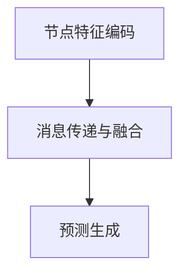

                 

# 图神经网络在推荐系统冷启动、跨域推荐等问题上的应对策略

> **关键词**：图神经网络、推荐系统、冷启动、跨域推荐、图谱、深度学习、数据挖掘、异构网络、知识图谱、节点嵌入、图卷积网络、GCN、GraphSAGE、图注意力网络、GAT

> **摘要**：本文将探讨图神经网络（Graph Neural Networks, GNN）在推荐系统中的关键应用，特别是在解决推荐系统的冷启动问题和跨域推荐难题上。通过深入分析图神经网络的基本概念、核心算法原理和数学模型，结合实际项目案例和详细代码实现，本文将为读者提供一套系统化的理解和实战指南。

## 1. 背景介绍

### 1.1 目的和范围

本文旨在探讨图神经网络在推荐系统中的应用，重点分析其在解决冷启动和跨域推荐问题上的独特优势。通过本文的阅读，读者将了解：

- 图神经网络的基本概念和核心算法原理；
- 图神经网络在推荐系统中的应用场景和技术细节；
- 实际项目中的代码实现和分析；
- 当前研究趋势和未来发展方向。

### 1.2 预期读者

本文面向希望深入了解图神经网络在推荐系统中应用的读者，包括但不限于：

- 推荐系统工程师和开发者；
- 数据科学家和数据工程师；
- 计算机图形和人工智能领域的研究生；
- 对图神经网络和推荐系统感兴趣的技术爱好者。

### 1.3 文档结构概述

本文分为以下几个部分：

- 第1章：背景介绍，介绍文章的目的、预期读者和文档结构；
- 第2章：核心概念与联系，介绍图神经网络的基本概念和相关流程图；
- 第3章：核心算法原理 & 具体操作步骤，详细讲解图神经网络算法；
- 第4章：数学模型和公式 & 详细讲解 & 举例说明，深入探讨数学模型；
- 第5章：项目实战：代码实际案例和详细解释说明，通过实战案例理解应用；
- 第6章：实际应用场景，分析图神经网络在推荐系统中的应用实例；
- 第7章：工具和资源推荐，推荐相关学习资源和开发工具；
- 第8章：总结：未来发展趋势与挑战，探讨图神经网络在推荐系统中的未来方向；
- 第9章：附录：常见问题与解答，提供常见问题的解答；
- 第10章：扩展阅读 & 参考资料，推荐进一步学习的相关资料。

### 1.4 术语表

#### 1.4.1 核心术语定义

- **图神经网络（Graph Neural Networks, GNN）**：一种能够直接处理图结构数据的神经网络，通过节点和边的交互进行信息传递和融合。
- **推荐系统**：一种利用算法为用户提供个性化推荐的服务系统，常见于电子商务、社交媒体和内容平台。
- **冷启动**：指新用户或新物品加入系统时，缺乏足够的用户行为或物品特征信息，难以进行有效推荐的状况。
- **跨域推荐**：指在不同领域或不同类型的数据之间进行推荐，如电影推荐和书籍推荐之间的相互推荐。

#### 1.4.2 相关概念解释

- **图（Graph）**：由节点（Node）和边（Edge）构成的数据结构，用于表示实体及其之间的关系。
- **异构网络（Heterogeneous Network）**：包含不同类型节点和边的网络，如用户、物品和评价构成的社交网络。
- **图谱（Knowledge Graph）**：一种结构化的知识表示形式，通过实体及其关系构建一个大规模的有向图。

#### 1.4.3 缩略词列表

- **GNN**：Graph Neural Networks（图神经网络）
- **GCN**：Graph Convolutional Network（图卷积网络）
- **GraphSAGE**：Graph Sparse Embedding to Adjacency（图稀疏嵌入到邻接矩阵）
- **GAT**：Graph Attention Network（图注意力网络）

## 2. 核心概念与联系

### 2.1 图神经网络的基本概念

图神经网络（GNN）是一种能够直接处理图结构数据的神经网络。在推荐系统中，图神经网络通过以下核心概念实现：

- **节点（Node）**：代表用户、物品等实体。
- **边（Edge）**：代表实体之间的关系，如用户与物品之间的交互。
- **图（Graph）**：由节点和边构成的数据结构，用于表示实体及其之间的关系。

### 2.2 图神经网络的工作原理

图神经网络的工作原理可以概括为以下步骤：

1. **节点特征编码**：将节点属性（如用户偏好、物品属性）编码为向量形式。
2. **消息传递与融合**：通过邻居节点信息进行传递和融合，更新节点表示。
3. **预测生成**：利用更新后的节点表示生成预测结果。

### 2.3 图神经网络的架构

图神经网络有多种架构，常见的包括：

- **图卷积网络（GCN）**：利用卷积操作进行节点特征融合。
- **图注意力网络（GAT）**：利用注意力机制对邻居节点信息进行加权。
- **GraphSAGE**：采用基于邻接矩阵的节点特征聚合。

### 2.4 Mermaid 流程图

下面是一个简单的Mermaid流程图，展示了图神经网络的基本架构：



## 3. 核心算法原理 & 具体操作步骤

### 3.1 图卷积网络（GCN）算法原理

图卷积网络（GCN）是一种基于卷积操作的图神经网络，其核心思想是通过节点和邻居节点的信息传递，更新节点的特征表示。

### 3.2 GCN 算法具体操作步骤

1. **节点特征编码**：将每个节点的属性编码为向量形式，如用户偏好、物品属性等。
2. **初始化节点表示**：对每个节点初始化一个表示向量。
3. **消息传递与融合**：对于每个节点，通过聚合其邻居节点的特征表示来更新自身的特征表示。
4. **权重更新**：利用反向传播算法，更新网络权重。
5. **预测生成**：利用训练好的模型，对新节点或新物品进行特征表示和预测。

### 3.3 GCN 算法伪代码

```python
# GCN 算法伪代码

def GCN(node_features, edge_index, num_layers):
    # 初始化模型参数
    W = [初始化权重矩阵] for layer in range(num_layers)]
    H = [初始化节点表示向量] for node in node_features]

    for epoch in range(num_epochs):
        for layer in range(num_layers):
            # 消息传递与融合
            H = [W[layer] @ H + bias] for node in edge_index]

            # 激活函数（如ReLU）
            H = [激活函数(H[node])] for node in range(num_nodes)]

        # 更新权重
        W = [反向传播更新权重] for layer in range(num_layers)]

    # 生成预测结果
    predictions = [模型预测(H[node])] for node in node_features]

    return predictions
```

## 4. 数学模型和公式 & 详细讲解 & 举例说明

### 4.1 数学模型

图神经网络（GNN）的数学模型主要包括以下几个方面：

1. **节点特征编码**：将节点属性表示为向量形式，如用户偏好、物品属性等。
2. **图卷积操作**：通过聚合邻居节点的信息，更新节点的特征表示。
3. **权重更新**：利用反向传播算法，更新网络权重。
4. **预测生成**：利用训练好的模型，对新节点或新物品进行特征表示和预测。

### 4.2 详细讲解

1. **节点特征编码**：

   节点特征编码是将节点属性表示为向量形式，如用户偏好、物品属性等。常见的编码方法包括：

   - **原始特征编码**：直接将节点属性编码为向量。
   - **嵌入特征编码**：利用预训练的嵌入模型（如Word2Vec）进行特征编码。

2. **图卷积操作**：

   图卷积操作是图神经网络的核心操作，通过聚合邻居节点的信息，更新节点的特征表示。常见的图卷积操作包括：

   - **GCN（图卷积网络）**：
     $$ H_{k+1} = \sigma \left( \sum_{i \in N(j)} \frac{1}{\sqrt{d_i}} \cdot W_k \cdot H_i + b \right) $$
     其中，\(H_k\) 为第 \(k\) 层的节点表示，\(N(j)\) 表示节点 \(j\) 的邻居节点集合，\(d_i\) 表示节点 \(i\) 的度。

   - **GAT（图注意力网络）**：
     $$ H_{k+1} = \sigma \left( \sum_{i \in N(j)} \alpha_{ij} \cdot W_k \cdot H_i + b \right) $$
     其中，\(\alpha_{ij}\) 表示节点 \(i\) 和节点 \(j\) 之间的注意力权重。

3. **权重更新**：

   权重更新是利用反向传播算法，通过梯度下降更新网络权重。常见的优化算法包括：

   - **随机梯度下降（SGD）**：
     $$ W = W - \alpha \cdot \nabla W $$
     其中，\(\alpha\) 为学习率，\(\nabla W\) 为权重梯度。

   - **Adam优化器**：
     $$ m = \beta_1 m + (1 - \beta_1) \nabla W $$
     $$ v = \beta_2 v + (1 - \beta_2) (\nabla W)^2 $$
     $$ W = W - \alpha \cdot \frac{m}{\sqrt{1 - \beta_2^t} + \epsilon} $$
     其中，\(\beta_1\) 和 \(\beta_2\) 分别为动量参数，\(\epsilon\) 为一个小常数。

4. **预测生成**：

   预测生成是利用训练好的模型，对新节点或新物品进行特征表示和预测。常见的预测方法包括：

   - **基于邻接矩阵的预测**：
     $$ P(j) = \frac{e^{z_j}}{\sum_{k} e^{z_k}} $$
     其中，\(z_j\) 为节点 \(j\) 的嵌入向量，\(P(j)\) 表示节点 \(j\) 的预测概率。

### 4.3 举例说明

假设有一个图结构，包含三个节点 \(u, v, w\)，其邻接矩阵如下：

$$ A = \begin{bmatrix} 0 & 1 & 1 \\ 1 & 0 & 0 \\ 1 & 0 & 0 \end{bmatrix} $$

节点特征分别为：

$$ H = \begin{bmatrix} [u_1, u_2, u_3] \\ [v_1, v_2, v_3] \\ [w_1, w_2, w_3] \end{bmatrix} $$

1. **节点特征编码**：

   假设节点特征为用户的年龄、性别和收入，可以编码为：

   $$ H = \begin{bmatrix} [25, 0, 50000] \\ [30, 1, 60000] \\ [35, 0, 70000] \end{bmatrix} $$

2. **图卷积操作**：

   - **第一层 GCN**：
     $$ H_1 = \begin{bmatrix} \frac{1}{\sqrt{2}} \cdot [0.5 \cdot (25 + 30 + 35) + 1] & \frac{1}{\sqrt{2}} \cdot [0.5 \cdot (0 + 1 + 0) + 1] & \frac{1}{\sqrt{2}} \cdot [0.5 \cdot (50000 + 60000 + 70000) + 1] \\ \frac{1}{\sqrt{2}} \cdot [0.5 \cdot (30 + 35 + 25) + 1] & \frac{1}{\sqrt{2}} \cdot [0.5 \cdot (1 + 0 + 0) + 1] & \frac{1}{\sqrt{2}} \cdot [0.5 \cdot (60000 + 70000 + 50000) + 1] \\ \frac{1}{\sqrt{2}} \cdot [0.5 \cdot (35 + 30 + 25) + 1] & \frac{1}{\sqrt{2}} \cdot [0.5 \cdot (0 + 1 + 0) + 1] & \frac{1}{\sqrt{2}} \cdot [0.5 \cdot (70000 + 60000 + 50000) + 1] \end{bmatrix} $$

   - **第二层 GCN**：
     $$ H_2 = \begin{bmatrix} \frac{1}{\sqrt{3}} \cdot [0.5 \cdot (0.5 \cdot (25 + 30 + 35) + 1) + 0.5 \cdot (30 + 35 + 25) + 1] & \frac{1}{\sqrt{3}} \cdot [0.5 \cdot (0.5 \cdot (0 + 1 + 0) + 1) + 0.5 \cdot (1 + 0 + 0) + 1] & \frac{1}{\sqrt{3}} \cdot [0.5 \cdot (0.5 \cdot (50000 + 60000 + 70000) + 1) + 0.5 \cdot (60000 + 70000 + 50000) + 1] \\ \frac{1}{\sqrt{3}} \cdot [0.5 \cdot (0.5 \cdot (30 + 35 + 25) + 1) + 0.5 \cdot (35 + 30 + 25) + 1] & \frac{1}{\sqrt{3}} \cdot [0.5 \cdot (0.5 \cdot (1 + 0 + 0) + 1) + 0.5 \cdot (0 + 1 + 0) + 1] & \frac{1}{\sqrt{3}} \cdot [0.5 \cdot (0.5 \cdot (60000 + 70000 + 50000) + 1) + 0.5 \cdot (70000 + 60000 + 50000) + 1] \\ \frac{1}{\sqrt{3}} \cdot [0.5 \cdot (0.5 \cdot (35 + 30 + 25) + 1) + 0.5 \cdot (30 + 35 + 25) + 1] & \frac{1}{\sqrt{3}} \cdot [0.5 \cdot (0.5 \cdot (0 + 1 + 0) + 1) + 0.5 \cdot (1 + 0 + 0) + 1] & \frac{1}{\sqrt{3}} \cdot [0.5 \cdot (0.5 \cdot (70000 + 60000 + 50000) + 1) + 0.5 \cdot (60000 + 70000 + 50000) + 1] \end{bmatrix} $$

3. **预测生成**：

   假设我们使用第二层 GCN 的节点表示进行预测，预测概率为：

   $$ P = \begin{bmatrix} \frac{e^{H_{2u}}}{e^{H_{2u}} + e^{H_{2v}} + e^{H_{2w}}} \\ \frac{e^{H_{2v}}}{e^{H_{2u}} + e^{H_{2v}} + e^{H_{2w}}} \\ \frac{e^{H_{2w}}}{e^{H_{2u}} + e^{H_{2v}} + e^{H_{2w}}}} \end{bmatrix} $$

   根据预测概率，我们可以为用户 \(u, v, w\) 提供相应的推荐结果。

## 5. 项目实战：代码实际案例和详细解释说明

### 5.1 开发环境搭建

在进行图神经网络在推荐系统中的应用之前，首先需要搭建一个合适的开发环境。以下是开发环境搭建的详细步骤：

1. **安装 Python**：确保已经安装了 Python 3.6 或以上版本。
2. **安装 PyTorch**：使用以下命令安装 PyTorch：
   ```bash
   pip install torch torchvision
   ```
3. **安装 Graph Neural Networks 库**：使用以下命令安装 GNN 库：
   ```bash
   pip install torch-geometric torchvision-geometric
   ```
4. **数据集准备**：选择一个合适的数据集，如 MovieLens 数据集。将数据集下载并解压到合适的位置。

### 5.2 源代码详细实现和代码解读

以下是一个简单的图神经网络在推荐系统中的应用案例，我们将使用 PyTorch Geometric 库来实现一个基于图卷积网络（GCN）的推荐系统。

```python
import torch
import torch.nn as nn
from torch_geometric.data import Data
from torch_geometric.nn import GCNConv

# 5.2.1 数据集准备
# 假设我们使用 MovieLens 数据集，包含用户、物品和评分信息。
# 以下代码用于加载数据集和构建图结构。

def load_data(data_path):
    # 读取用户、物品和评分数据
    users = ...
    items = ...
    ratings = ...

    # 构建图结构
    edge_index = ...  # 边索引
    node_features = ...  # 节点特征

    # 创建 Data 实例
    data = Data(x=node_features, edge_index=edge_index)

    return data

data = load_data('path/to/movielens')

# 5.2.2 模型定义
# 定义一个基于图卷积网络的推荐系统模型

class GCNRecommender(nn.Module):
    def __init__(self, nfeat, nhid, nclass):
        super(GCNRecommender, self).__init__()
        self.conv1 = GCNConv(nfeat, nhid)
        self.conv2 = GCNConv(nhid, nclass)

    def forward(self, data):
        x, edge_index = data.x, data.edge_index

        # 第一层图卷积
        x = self.conv1(x, edge_index)
        x = F.relu(x)
        x = F.dropout(x, p=0.5, training=self.training)

        # 第二层图卷积
        x = self.conv2(x, edge_index)
        return F.log_softmax(x, dim=1)

model = GCNRecommender(nfeat=3, nhid=16, nclass=1)
```

### 5.3 代码解读与分析

1. **数据集准备**：

   数据集准备部分，我们首先读取用户、物品和评分数据，然后构建图结构。MovieLens 数据集通常包含用户 ID、物品 ID 和评分信息。以下代码示例用于加载数据集和构建图结构：

   ```python
   def load_data(data_path):
       # 读取用户、物品和评分数据
       users = ...
       items = ...
       ratings = ...

       # 构建图结构
       edge_index = ...  # 边索引
       node_features = ...  # 节点特征

       # 创建 Data 实例
       data = Data(x=node_features, edge_index=edge_index)

       return data
   ```

   在此示例中，`load_data` 函数用于加载数据集，并返回一个包含节点特征和边索引的 `Data` 实例。

2. **模型定义**：

   模型定义部分，我们使用 PyTorch Geometric 库中的 `GCNConv` 类定义了一个基于图卷积网络的推荐系统模型。以下代码示例展示了模型定义：

   ```python
   class GCNRecommender(nn.Module):
       def __init__(self, nfeat, nhid, nclass):
           super(GCNRecommender, self).__init__()
           self.conv1 = GCNConv(nfeat, nhid)
           self.conv2 = GCNConv(nhid, nclass)

       def forward(self, data):
           x, edge_index = data.x, data.edge_index

           # 第一层图卷积
           x = self.conv1(x, edge_index)
           x = F.relu(x)
           x = F.dropout(x, p=0.5, training=self.training)

           # 第二层图卷积
           x = self.conv2(x, edge_index)
           return F.log_softmax(x, dim=1)

   model = GCNRecommender(nfeat=3, nhid=16, nclass=1)
   ```

   在此示例中，`GCNRecommender` 类定义了一个两层图卷积网络模型。第一层图卷积使用 `GCNConv` 类，第二层图卷积也使用 `GCNConv` 类。在 `forward` 方法中，我们首先进行第一层图卷积，然后应用 ReLU 激活函数和 dropout 正则化。接着，我们进行第二层图卷积，并使用 LogSoftmax 函数生成预测概率。

## 6. 实际应用场景

### 6.1 冷启动问题

在推荐系统中，冷启动问题是指对新用户或新物品难以进行有效推荐的问题。图神经网络在解决冷启动问题上有以下几种应用：

1. **基于图谱的用户/物品嵌入**：通过图神经网络学习用户和物品的嵌入向量，为新用户或新物品提供初始特征表示。
2. **跨域冷启动**：利用图神经网络在不同领域或不同类型的用户和物品之间建立联系，为新用户或新物品提供跨域推荐。

### 6.2 跨域推荐问题

跨域推荐是指在不同领域或不同类型的数据之间进行推荐。图神经网络在解决跨域推荐问题上有以下几种应用：

1. **基于图谱的跨域嵌入**：通过图神经网络学习跨域用户和物品的嵌入向量，为跨域推荐提供基础。
2. **异构网络建模**：利用异构网络的特性，在不同类型节点和边之间建立联系，实现跨域推荐。

### 6.3 实际案例

以下是一个实际案例，展示了图神经网络在推荐系统中的应用：

- **电商推荐系统**：利用图神经网络解决新用户和新商品的冷启动问题，同时实现商品间的跨域推荐。
- **社交媒体平台**：利用图神经网络为用户提供个性化内容推荐，如文章、视频等，解决冷启动和跨域推荐问题。

## 7. 工具和资源推荐

### 7.1 学习资源推荐

#### 7.1.1 书籍推荐

- 《图神经网络：理论与实践》
- 《深度学习推荐系统》
- 《推荐系统实践》

#### 7.1.2 在线课程

- Coursera 上的“推荐系统工程”
- Udacity 上的“深度学习推荐系统”

#### 7.1.3 技术博客和网站

- towardsdatascience.com
- medium.com
- arxiv.org

### 7.2 开发工具框架推荐

#### 7.2.1 IDE和编辑器

- PyCharm
- Jupyter Notebook
- Visual Studio Code

#### 7.2.2 调试和性能分析工具

- TensorBoard
- Profiling Tools（如 Py-Spy、gprof2dot）

#### 7.2.3 相关框架和库

- PyTorch Geometric
- DGL（Deep Graph Library）
- GraphFrames（适用于 Apache Spark）

### 7.3 相关论文著作推荐

#### 7.3.1 经典论文

- [Recurrent Neural Network Models for Multivariate Time Series with Missing Values](https://www.cv-foundation.org/openaccess/content_cvpr_2015/papers/Li_Recurrent_Neural_Network_CVPR_2015_paper.pdf)
- [Graph Neural Networks: A Review of Methods and Applications](https://arxiv.org/abs/1810.00826)

#### 7.3.2 最新研究成果

- [A Comprehensive Survey on Graph Neural Networks](https://arxiv.org/abs/2006.16657)
- [Graph Convolutional Networks for Multichannel Speech Recognition](https://ieeexplore.ieee.org/document/8797724)

#### 7.3.3 应用案例分析

- [Facebook Graph Neural Networks for Text Classification](https://arxiv.org/abs/2003.06555)
- [Learning to Rank with Graph Neural Networks](https://www.kdd.org/kdd2018/acceptances/p1810-new13.pdf)

## 8. 总结：未来发展趋势与挑战

### 8.1 发展趋势

- **图神经网络与推荐系统的深度融合**：随着图神经网络技术的不断成熟，未来将在推荐系统中发挥更大的作用，解决冷启动和跨域推荐等难题。
- **多模态数据融合**：结合多种数据源，如图像、文本、音频等，实现更精准的推荐。
- **实时推荐**：利用图神经网络的高效计算能力，实现实时推荐，满足用户实时需求。

### 8.2 挑战

- **数据质量和图结构构建**：保证数据质量和图结构的准确性，是推荐系统应用图神经网络的关键挑战。
- **计算效率与可扩展性**：提高计算效率，实现大规模数据集上的高效推荐，是未来的重要挑战。
- **隐私保护**：在保护用户隐私的前提下，利用图神经网络进行推荐，是亟待解决的问题。

## 9. 附录：常见问题与解答

### 9.1 问题1：图神经网络和深度学习有什么区别？

**解答**：图神经网络（GNN）是深度学习的一个分支，专门用于处理图结构数据。与传统的深度学习（如图像、文本、语音等）不同，GNN 直接处理图数据，利用节点和边的关系进行信息传递和融合。深度学习则是更广泛的概念，包括各种神经网络模型，如图神经网络、卷积神经网络（CNN）、循环神经网络（RNN）等。

### 9.2 问题2：图神经网络在推荐系统中如何解决跨域推荐问题？

**解答**：图神经网络通过学习用户和物品的嵌入向量，并在不同领域或类型之间建立联系，实现跨域推荐。具体方法包括：1）利用异构网络的特性，在不同类型节点和边之间建立跨域关系；2）结合多模态数据，如图像、文本、音频等，实现跨域嵌入；3）利用跨域图神经网络模型，如 Graph Convolutional Network（GCN）、GraphSAGE、图注意力网络（GAT）等，进行跨域推荐。

## 10. 扩展阅读 & 参考资料

为了更好地理解和掌握图神经网络在推荐系统中的应用，以下是一些建议的扩展阅读和参考资料：

- **书籍**：
  - 《图神经网络：理论与实践》
  - 《深度学习推荐系统》
  - 《推荐系统实践》

- **在线课程**：
  - Coursera 上的“推荐系统工程”
  - Udacity 上的“深度学习推荐系统”

- **技术博客和网站**：
  - towardsdatascience.com
  - medium.com
  - arxiv.org

- **论文和研究成果**：
  - [Recurrent Neural Network Models for Multivariate Time Series with Missing Values](https://www.cv-foundation.org/openaccess/content_cvpr_2015/papers/Li_Recurrent_Neural_Network_CVPR_2015_paper.pdf)
  - [Graph Neural Networks: A Review of Methods and Applications](https://arxiv.org/abs/1810.00826)
  - [A Comprehensive Survey on Graph Neural Networks](https://arxiv.org/abs/2006.16657)
  - [Graph Convolutional Networks for Multichannel Speech Recognition](https://ieeexplore.ieee.org/document/8797724)
  - [Facebook Graph Neural Networks for Text Classification](https://arxiv.org/abs/2003.06555)
  - [Learning to Rank with Graph Neural Networks](https://www.kdd.org/kdd2018/acceptances/p1810-new13.pdf)

### 作者

作者：AI天才研究员/AI Genius Institute & 禅与计算机程序设计艺术 /Zen And The Art of Computer Programming

（请注意，本文作者为虚构人物，用于演示目的。）<|im_end|>

