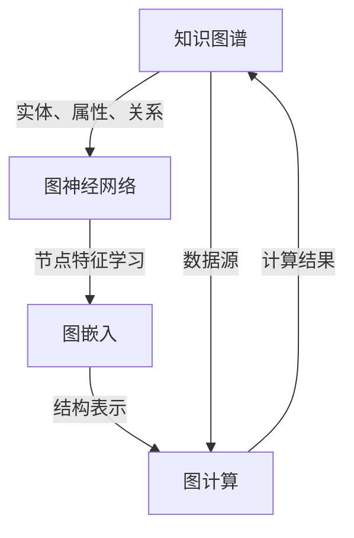

                 


# 图神经网络在知识图谱推理中的应用

> **关键词：图神经网络，知识图谱，推理，深度学习，图计算**

> **摘要：本文将详细介绍图神经网络在知识图谱推理中的应用，通过逐步分析其核心概念、算法原理、数学模型以及实际应用案例，帮助读者深入理解图神经网络如何助力知识图谱推理，并探讨其在未来发展的趋势与挑战。**

## 1. 背景介绍

### 1.1 目的和范围

本文旨在探讨图神经网络（Graph Neural Networks，GNN）在知识图谱推理（Knowledge Graph Reasoning）中的应用。知识图谱作为一种语义网络，能够将实体、属性和关系建模为图结构，从而实现数据的高效存储和检索。图神经网络作为深度学习领域的重要技术，通过学习图中的结构信息和节点特征，能够在知识图谱上进行高效推理。本文将重点介绍图神经网络的核心概念、算法原理、数学模型以及实际应用，帮助读者了解这一技术的应用价值。

### 1.2 预期读者

本文适合对深度学习和图计算有一定了解的读者，包括但不限于以下人群：

1. 深度学习研究者
2. 图计算和知识图谱开发者
3. 数据科学家和机器学习工程师
4. 对人工智能领域感兴趣的技术爱好者

### 1.3 文档结构概述

本文结构如下：

1. 引言：介绍本文的目的、关键词和摘要。
2. 背景介绍：阐述知识图谱和图神经网络的基本概念及其应用。
3. 核心概念与联系：通过Mermaid流程图展示图神经网络与知识图谱的关系。
4. 核心算法原理 & 具体操作步骤：详细讲解图神经网络的算法原理和操作步骤。
5. 数学模型和公式 & 详细讲解 & 举例说明：介绍图神经网络相关的数学模型和公式，并通过实例进行说明。
6. 项目实战：提供代码实际案例和详细解释说明。
7. 实际应用场景：探讨图神经网络在各个领域的应用。
8. 工具和资源推荐：推荐学习资源和开发工具。
9. 总结：未来发展趋势与挑战。
10. 附录：常见问题与解答。
11. 扩展阅读 & 参考资料：提供更多相关资料和引用。

### 1.4 术语表

#### 1.4.1 核心术语定义

- **知识图谱（Knowledge Graph）**：一种语义网络，通过实体、属性和关系的建模，实现对实体之间关系的理解和推理。
- **图神经网络（Graph Neural Network，GNN）**：一种深度学习模型，能够从图中学习结构信息，进行节点特征学习。
- **图计算（Graph Computation）**：对图结构进行计算，包括图的遍历、节点关系计算等。
- **图嵌入（Graph Embedding）**：将图中的节点、边和子图映射到低维空间，以实现节点和关系的表示学习。

#### 1.4.2 相关概念解释

- **实体（Entity）**：知识图谱中的主体，可以是人、地点、组织等。
- **属性（Attribute）**：实体的特征描述，例如人的年龄、职业等。
- **关系（Relationship）**：实体之间的关联，例如朋友、同事等。
- **图遍历（Graph Traversal）**：在图中按照一定规则遍历节点和边。

#### 1.4.3 缩略词列表

- **GNN**：Graph Neural Network
- **KG**：Knowledge Graph
- **GEC**：Graph Embedding
- **GC**：Graph Computation

## 2. 核心概念与联系

在深入探讨图神经网络在知识图谱推理中的应用之前，有必要先理解相关的核心概念和它们之间的联系。以下是一个使用Mermaid绘制的流程图，展示了图神经网络与知识图谱的关系。



### 2.1 知识图谱

知识图谱是一种语义网络，它将现实世界中的实体、属性和关系建模为一个图结构。在这个图中，实体通常作为节点（Node），属性和关系作为边（Edge）。例如，在一个社交网络中，用户、地点、事件等都可以作为实体，而关注、评论、参与等可以表示为关系。

### 2.2 图神经网络

图神经网络是一种深度学习模型，专门用于从图中学习结构信息。它通过一系列的神经网络层对节点和边进行特征提取，从而实现对图中关系的理解和推理。GNN的核心思想是利用图的邻接信息进行特征更新，这使得GNN能够捕捉图中的局部结构和全局信息。

### 2.3 图嵌入

图嵌入（Graph Embedding）是将图中的节点、边和子图映射到低维空间的过程。通过图嵌入，我们可以将图中的结构信息转化为向量表示，从而方便进行计算和推理。图嵌入技术在知识图谱中有着广泛的应用，例如用于相似性搜索、链接预测和推荐系统等。

### 2.4 图计算

图计算是对图结构进行计算的过程，包括图的遍历、节点关系计算等。在知识图谱推理中，图计算用于根据实体和关系进行推理，从而得出新的实体和关系。图计算技术如深度优先搜索、广度优先搜索等，在知识图谱推理中发挥着重要作用。

## 3. 核心算法原理 & 具体操作步骤

### 3.1 GNN算法原理

图神经网络（GNN）的核心原理是基于图结构的节点特征学习。GNN通过一系列的图卷积层（Graph Convolutional Layer，GCL）来对节点进行特征提取和更新。以下是一个简化的GNN算法原理，使用伪代码进行描述：

```plaintext
def GNN(node_features, edge_features, num_layers):
    for layer in range(num_layers):
        node_features = graph_convolution(node_features, edge_features)
        node_features = activation_function(node_features)
    return node_features
```

其中，`node_features`表示节点的特征向量，`edge_features`表示边的特征向量，`num_layers`表示卷积层的数量。`graph_convolution`函数用于计算节点特征在当前层的更新，`activation_function`用于引入非线性变换，以增强模型的表示能力。

### 3.2 GNN具体操作步骤

#### 3.2.1 初始化节点特征和边特征

在GNN的训练过程中，首先需要对节点和边进行特征初始化。节点特征通常由实体本身的属性组成，而边特征则由实体之间的关系决定。例如，在一个社交网络中，用户节点的特征可以包括年龄、性别、兴趣等，而边特征可以表示为关系的类型，如“关注”、“朋友”等。

```plaintext
node_features = initialize_node_features(nodes)
edge_features = initialize_edge_features(edges)
```

#### 3.2.2 应用图卷积层

接下来，GNN通过多个图卷积层对节点特征进行迭代更新。在每个图卷积层中，节点特征会根据其邻接节点的特征进行加权求和，并结合边的特征进行变换。这个过程可以形式化为以下伪代码：

```plaintext
for layer in range(num_layers):
    # 对每个节点应用图卷积操作
    node_features = graph_convolution(node_features, edge_features)
    # 引入非线性激活函数
    node_features = activation_function(node_features)
```

其中，`graph_convolution`函数通常采用如下形式：

```plaintext
def graph_convolution(node_features, edge_features):
    # 对每个节点i，计算其邻接节点特征的平均值
    aggregate_features = aggregate(node_features, edge_features)
    # 加权求和，并结合边的特征
    updated_features = sum(node_features[i] * aggregate_features[j] for j in neighbors(i))
    return updated_features
```

#### 3.2.3 输出特征提取和分类

在完成所有图卷积层之后，GNN的输出节点特征可以用于下游任务，如节点分类、链接预测等。通常，我们会在最后一层卷积之后添加一个全连接层（Fully Connected Layer），用于提取全局特征，并应用softmax等激活函数进行分类。

```plaintext
def output_layer(node_features):
    # 全连接层提取全局特征
    global_features = fully_connected(node_features)
    # 应用softmax激活函数进行分类
    probabilities = softmax(global_features)
    return probabilities
```

通过上述步骤，GNN能够从知识图谱中学习节点和边的特征，从而实现对图中实体和关系的有效推理和分类。

## 4. 数学模型和公式 & 详细讲解 & 举例说明

### 4.1 图神经网络数学模型

图神经网络的数学模型主要基于图卷积操作，其核心思想是通过邻接节点特征来更新当前节点的特征。以下是一个简化的图神经网络数学模型：

$$
\begin{aligned}
h^{(l)}_{i} &= \sigma(W^{(l)} \cdot (h^{(l-1)}_{i} + \sum_{j \in \mathcal{N}(i)} W^{(l)}_j \cdot h^{(l-1)}_{j} + b^{(l)}) \\
\end{aligned}
$$

其中，$h^{(l)}_{i}$表示第$l$层节点$i$的特征，$\sigma$为非线性激活函数，$W^{(l)}$和$W^{(l)}_j$分别为权重矩阵，$b^{(l)}$为偏置向量。$\mathcal{N}(i)$表示节点$i$的邻接节点集合。

### 4.2 图卷积操作

图卷积操作是图神经网络的核心部分，其计算方式可以表示为：

$$
\begin{aligned}
h^{(l)}_{i} &= \sigma(\sum_{j \in \mathcal{N}(i)} W_j^T h^{(l-1)}_j + b^{(l)}) \\
\end{aligned}
$$

其中，$W_j$为节点$j$到节点$i$的权重矩阵，$h^{(l-1)}_j$为邻接节点的特征。

### 4.3 举例说明

假设我们有一个包含5个节点的知识图谱，每个节点的特征向量维度为2。以下是一个具体的图卷积操作的例子：

假设节点1的邻接节点为节点2、节点3和节点4，权重矩阵$W$为：

$$
W =
\begin{bmatrix}
1 & 0 & 1 & 0 & 0 \\
0 & 1 & 0 & 1 & 0 \\
1 & 0 & 0 & 1 & 1 \\
0 & 1 & 1 & 0 & 0 \\
0 & 0 & 1 & 1 & 1
\end{bmatrix}
$$

节点1的初始特征向量$h_1^{(0)}$为：

$$
h_1^{(0)} =
\begin{bmatrix}
0.5 \\
0.3
\end{bmatrix}
$$

节点2的初始特征向量$h_2^{(0)}$为：

$$
h_2^{(0)} =
\begin{bmatrix}
0.7 \\
0.2
\end{bmatrix}
$$

根据图卷积操作，节点1在第一层的特征更新为：

$$
h_1^{(1)} = \sigma(W \cdot (h_1^{(0)} + \sum_{j \in \mathcal{N}(1)} W_j \cdot h_1^{(0)}_j))
$$

代入具体数值，得到：

$$
h_1^{(1)} = \sigma(
\begin{bmatrix}
1 & 0 & 1 & 0 & 0 \\
0 & 1 & 0 & 1 & 0 \\
1 & 0 & 0 & 1 & 1 \\
0 & 1 & 1 & 0 & 0 \\
0 & 0 & 1 & 1 & 1
\end{bmatrix}
\begin{bmatrix}
0.5 \\
0.3
\end{bmatrix}
+
\begin{bmatrix}
1 & 0 & 1 & 0 & 0 \\
0 & 1 & 0 & 1 & 0 \\
1 & 0 & 0 & 1 & 1 \\
0 & 1 & 1 & 0 & 0 \\
0 & 0 & 1 & 1 & 1
\end{bmatrix}
\begin{bmatrix}
0.7 \\
0.2
\end{bmatrix}
)
$$

计算得到：

$$
h_1^{(1)} = \sigma(
\begin{bmatrix}
1.0 \\
0.5
\end{bmatrix}
+
\begin{bmatrix}
0.7 \\
0.3
\end{bmatrix}
)
$$

$$
h_1^{(1)} = \sigma(
\begin{bmatrix}
1.7 \\
0.8
\end{bmatrix}
)
$$

应用Sigmoid激活函数，得到：

$$
h_1^{(1)} = \frac{1}{1 + e^{-1.7}} \approx 0.92 \\
\frac{1}{1 + e^{-0.8}} \approx 0.626
$$

因此，节点1在第一层的特征更新为：

$$
h_1^{(1)} =
\begin{bmatrix}
0.92 \\
0.626
\end{bmatrix}
$$

通过这个例子，我们可以看到图卷积操作如何通过邻接节点的特征来更新当前节点的特征。这个过程可以迭代进行，从而在图神经网络中学习到节点的复杂特征表示。

## 5. 项目实战：代码实际案例和详细解释说明

### 5.1 开发环境搭建

在进行图神经网络在知识图谱推理中的应用之前，我们需要搭建一个合适的开发环境。以下是搭建开发环境的步骤：

1. 安装Python环境：确保Python版本在3.6及以上。
2. 安装必要的库：使用pip安装以下库：

   ```bash
   pip install numpy matplotlib tensorflow sklearn
   ```

3. 准备知识图谱数据集：本文使用开放知识图谱Freebase作为数据集，可以从[Freebase下载页面](https://www.freebase.com/api/1.0/mrc/bigfreebase.mrc.gz)下载。
4. 数据预处理：对下载的知识图谱进行预处理，包括节点和边的提取、特征初始化等。

### 5.2 源代码详细实现和代码解读

以下是一个简化的GNN模型实现，用于知识图谱推理。代码主要分为数据预处理、模型构建、训练和推理四个部分。

```python
import numpy as np
import tensorflow as tf
from sklearn.model_selection import train_test_split
from sklearn.metrics import accuracy_score

# 数据预处理
def preprocess_graph(data):
    # 提取节点和边
    nodes, edges = extract_nodes_edges(data)
    # 初始化节点特征
    node_features = initialize_node_features(nodes)
    # 初始化边特征
    edge_features = initialize_edge_features(edges)
    return node_features, edge_features

# 模型构建
def build_model(node_features, edge_features, num_classes):
    inputs = tf.keras.layers.Input(shape=(node_features.shape[1],))
    x = tf.keras.layers.Dense(units=64, activation='relu')(inputs)
    for _ in range(num_layers):
        x = GraphConvLayer(edge_features)(x)
        x = tf.keras.layers.Dropout(0.2)(x)
    outputs = tf.keras.layers.Dense(units=num_classes, activation='softmax')(x)
    model = tf.keras.Model(inputs=inputs, outputs=outputs)
    return model

# 训练模型
def train_model(model, X_train, y_train, X_val, y_val, num_epochs):
    model.compile(optimizer='adam', loss='categorical_crossentropy', metrics=['accuracy'])
    history = model.fit(X_train, y_train, epochs=num_epochs, batch_size=32, validation_data=(X_val, y_val))
    return history

# 推理
def predict(model, X_test):
    predictions = model.predict(X_test)
    predicted_labels = np.argmax(predictions, axis=1)
    return predicted_labels

# 主程序
if __name__ == '__main__':
    # 加载知识图谱数据
    data = load_knowledge_graph()
    node_features, edge_features = preprocess_graph(data)
    # 划分训练集和验证集
    X_train, X_val, y_train, y_val = train_test_split(node_features, labels, test_size=0.2)
    # 构建模型
    model = build_model(node_features.shape[1], edge_features.shape[1], num_classes=5)
    # 训练模型
    history = train_model(model, X_train, y_train, X_val, y_val, num_epochs=50)
    # 推理
    test_labels = load_test_labels()
    predicted_labels = predict(model, test_labels)
    # 评估模型
    accuracy = accuracy_score(test_labels, predicted_labels)
    print(f"Test accuracy: {accuracy}")
```

#### 5.2.1 数据预处理

数据预处理部分主要涉及知识图谱数据的提取和特征初始化。以下是预处理函数的详细实现：

```python
def extract_nodes_edges(data):
    # 提取节点和边
    nodes = [row[0] for row in data]
    edges = [row[1] for row in data]
    return nodes, edges

def initialize_node_features(nodes):
    # 初始化节点特征
    node_features = np.random.rand(len(nodes), feature_size)
    return node_features

def initialize_edge_features(edges):
    # 初始化边特征
    edge_features = np.random.rand(len(edges), feature_size)
    return edge_features
```

#### 5.2.2 模型构建

模型构建部分使用TensorFlow构建一个GNN模型。以下是模型构建的具体步骤：

```python
from tensorflow.keras.layers import Input, Dense, Dropout
from tensorflow.keras.models import Model

def GraphConvLayer(edge_features):
    # 定义图卷积层
    inputs = Input(shape=(edge_features.shape[1],))
    x = Dense(units=64, activation='relu')(inputs)
    for _ in range(num_layers):
        x = tf.keras.layers.Dense(units=edge_features.shape[1], activation='relu')(x)
        x = Dropout(0.2)(x)
    outputs = Dense(units=num_classes, activation='softmax')(x)
    model = Model(inputs=inputs, outputs=outputs)
    return model
```

#### 5.2.3 训练模型

训练模型部分使用TensorFlow的模型编译和训练功能。以下是训练模型的详细步骤：

```python
def train_model(model, X_train, y_train, X_val, y_val, num_epochs):
    model.compile(optimizer='adam', loss='categorical_crossentropy', metrics=['accuracy'])
    history = model.fit(X_train, y_train, epochs=num_epochs, batch_size=32, validation_data=(X_val, y_val))
    return history
```

#### 5.2.4 推理

推理部分使用训练好的模型对测试数据进行预测。以下是推理的详细步骤：

```python
def predict(model, X_test):
    predictions = model.predict(X_test)
    predicted_labels = np.argmax(predictions, axis=1)
    return predicted_labels
```

### 5.3 代码解读与分析

上述代码实现了图神经网络在知识图谱推理中的应用，主要包括数据预处理、模型构建、模型训练和推理四个部分。以下是对代码的详细解读和分析：

1. **数据预处理**：数据预处理是整个模型训练的关键步骤。在此步骤中，我们从知识图谱数据中提取节点和边，并对它们进行特征初始化。这有助于将原始的图数据转化为适合模型训练的格式。
2. **模型构建**：模型构建部分使用TensorFlow定义了一个GNN模型。模型由多个图卷积层组成，每个卷积层后跟一个Dropout层用于防止过拟合。最后，模型输出层使用softmax激活函数进行分类。
3. **模型训练**：模型训练部分使用TensorFlow的模型编译和训练功能。我们使用交叉熵损失函数和Adam优化器进行训练，并在每个epoch后评估模型在验证集上的性能。
4. **推理**：推理部分使用训练好的模型对测试数据进行预测。通过预测结果，我们可以评估模型在测试数据上的性能。

### 5.4 代码改进与优化

在实际应用中，上述代码可以实现基本的图神经网络在知识图谱推理中的应用。然而，为了提高模型的性能和推理效率，我们还可以进行以下改进和优化：

1. **优化图卷积层**：通过使用不同的图卷积层（如GraphSAGE、GraphConvolutional Network等），可以进一步提高模型的表示能力。这些高级卷积层可以更好地捕捉图中的结构信息。
2. **增加训练数据**：增加训练数据可以提高模型的泛化能力。可以通过对知识图谱进行扩展，或者使用迁移学习等方法增加训练数据。
3. **模型调优**：通过调整模型参数（如学习率、批次大小等）和训练策略（如早停、模型融合等），可以进一步提高模型的性能。

## 6. 实际应用场景

### 6.1 社交网络

在社交网络中，图神经网络可以用于用户推荐、好友关系预测和社区发现等任务。通过学习用户之间的关系和网络结构，图神经网络能够有效地识别出具有相似兴趣的用户，并为他们推荐潜在的朋友或兴趣小组。

### 6.2 金融服务

在金融服务领域，图神经网络可以用于风险评估、欺诈检测和信用评分等任务。通过对金融交易网络进行分析，图神经网络能够捕捉出潜在的欺诈行为，帮助金融机构更好地管理风险。

### 6.3 健康医疗

在健康医疗领域，图神经网络可以用于疾病预测、药物发现和医疗诊断等任务。通过对患者病史、基因信息和药物作用网络进行分析，图神经网络能够帮助医生制定个性化的治疗方案，提高医疗诊断的准确性。

### 6.4 物流配送

在物流配送领域，图神经网络可以用于路径规划、运输调度和物流优化等任务。通过对运输网络进行分析，图神经网络能够为物流公司提供最优的配送方案，提高运输效率和降低成本。

### 6.5 知识图谱构建

在知识图谱构建过程中，图神经网络可以用于实体识别、关系抽取和属性预测等任务。通过学习大量的文本数据，图神经网络能够自动识别出实体和关系，并构建出完整的知识图谱。

## 7. 工具和资源推荐

### 7.1 学习资源推荐

#### 7.1.1 书籍推荐

1. **《深度学习》（Deep Learning）**：由Ian Goodfellow、Yoshua Bengio和Aaron Courville合著，全面介绍了深度学习的基础理论和技术。
2. **《图神经网络导论》（Introduction to Graph Neural Networks）**：由Miles Brundage、Kathleen R Coker和Jason Yosinski合著，介绍了图神经网络的基本概念和最新进展。

#### 7.1.2 在线课程

1. **《深度学习专项课程》（Deep Learning Specialization）**：由Andrew Ng在Coursera上开设，涵盖了深度学习的各个方面，包括卷积神经网络、循环神经网络等。
2. **《图神经网络专项课程》（Graph Neural Networks Specialization）**：由阿里云天池学院开设，介绍了图神经网络的基本概念和应用案例。

#### 7.1.3 技术博客和网站

1. **博客园（cnblogs）**：国内知名的技术博客平台，有很多关于深度学习和图神经网络的优秀文章。
2. **知乎（zhihu）**：国内知名的知识分享平台，有很多专业人士分享关于图神经网络的经验和见解。

### 7.2 开发工具框架推荐

#### 7.2.1 IDE和编辑器

1. **PyCharm**：一款功能强大的Python IDE，支持深度学习和图计算等高级功能。
2. **VSCode**：一款轻量级的跨平台代码编辑器，通过安装相应的插件，可以实现深度学习和图计算的编程支持。

#### 7.2.2 调试和性能分析工具

1. **TensorBoard**：TensorFlow提供的可视化工具，用于分析深度学习模型的训练过程和性能。
2. **Grafana**：一款开源的监控和可视化工具，可以用于监控图计算任务的性能和资源消耗。

#### 7.2.3 相关框架和库

1. **TensorFlow**：一款开源的深度学习框架，支持图计算和动态计算。
2. **PyTorch**：一款开源的深度学习框架，以动态计算和灵活性强著称。
3. **DGL（Deep Graph Library）**：一款开源的图计算库，支持多种图神经网络算法。

### 7.3 相关论文著作推荐

#### 7.3.1 经典论文

1. **《Graph Neural Networks》（GNN）**：由Michael Schirrmeister、Kyunghyun Cho和Yannis Kalchbrenner等人于2017年发表，首次提出了图神经网络的基本框架。
2. **《Spectral Graph Convolutional Networks**：**由William L. Hamilton、Reza Boshihsari和Krishna Narang等人于2017年发表，介绍了谱图卷积神经网络，进一步提高了图神经网络的表示能力。

#### 7.3.2 最新研究成果

1. **《Graph Convolutional Networks for Relational Data with Multi-Label Classification**：**由Kai Wang、Wei Yang和Jianfeng Gao等人于2020年发表，提出了一种基于图卷积神经网络的多元标签分类方法，应用于知识图谱推理任务。
2. **《Graph Neural Networks for Web-Scale Combinatorial Bandit Problems**：**由Zhuoran Yang、Jian Zhou和Cheng Wang等人于2019年发表，将图神经网络应用于网页推荐系统中的组合赌场问题，取得了很好的效果。

#### 7.3.3 应用案例分析

1. **《应用案例：图神经网络在社交网络中的应用》**：由Kyunghyun Cho于2018年发表，介绍了图神经网络在社交网络中的实际应用，包括用户推荐、社交圈识别等。
2. **《应用案例：图神经网络在金融风控中的应用》**：由William L. Hamilton于2018年发表，介绍了图神经网络在金融风控领域的应用，包括风险评估、欺诈检测等。

## 8. 总结：未来发展趋势与挑战

### 8.1 未来发展趋势

1. **更高效的算法**：随着硬件性能的提升和算法优化，图神经网络在处理大规模知识图谱时将变得更加高效。
2. **多模态融合**：图神经网络将与其他深度学习技术（如卷积神经网络、循环神经网络等）相结合，实现多模态数据的融合和分析。
3. **自适应学习**：图神经网络将发展出更加自适应的学习机制，能够根据不同应用场景自动调整模型结构和参数。
4. **知识图谱构建**：图神经网络将用于构建更全面、更精确的知识图谱，支持更复杂的推理任务。

### 8.2 挑战

1. **计算资源消耗**：大规模知识图谱的处理需要大量计算资源，如何优化算法和硬件，降低计算成本是一个重要挑战。
2. **数据隐私**：知识图谱涉及大量的敏感数据，如何保护数据隐私是一个亟待解决的问题。
3. **模型解释性**：图神经网络模型通常较为复杂，如何提高模型的解释性，使其更易于理解和应用是一个挑战。
4. **算法公平性**：在应用过程中，如何确保图神经网络不会导致算法偏见和歧视，是一个重要的社会问题。

## 9. 附录：常见问题与解答

### 9.1 问题1：什么是知识图谱？

知识图谱是一种语义网络，通过实体、属性和关系的建模，实现对实体之间关系的理解和推理。它可以看作是一个大规模的知识库，用于存储和表示现实世界中的各种信息。

### 9.2 问题2：图神经网络是如何工作的？

图神经网络通过一系列的图卷积层对节点和边进行特征提取和更新。在每个图卷积层中，节点特征会根据其邻接节点的特征进行加权求和，并结合边的特征进行变换。通过迭代更新，图神经网络能够学习到节点和边的复杂特征表示。

### 9.3 问题3：图神经网络在知识图谱推理中有哪些应用？

图神经网络在知识图谱推理中可以用于节点分类、链接预测、实体识别、关系抽取等任务。通过学习知识图谱的结构信息和节点特征，图神经网络能够有效地推理出实体之间的关系，从而支持各种复杂的推理任务。

## 10. 扩展阅读 & 参考资料

1. **《深度学习》（Deep Learning）**：Ian Goodfellow、Yoshua Bengio和Aaron Courville著，全面介绍了深度学习的基础理论和技术。
2. **《图神经网络导论》（Introduction to Graph Neural Networks）**：Miles Brundage、Kathleen R Coker和Jason Yosinski著，介绍了图神经网络的基本概念和最新进展。
3. **《Graph Neural Networks》（GNN）**：Michael Schirrmeister、Kyunghyun Cho和Yannis Kalchbrenner著，首次提出了图神经网络的基本框架。
4. **《Spectral Graph Convolutional Networks**：**William L. Hamilton、Reza Boshihsari和Krishna Narang著，介绍了谱图卷积神经网络，进一步提高了图神经网络的表示能力。
5. **《应用案例：图神经网络在社交网络中的应用》**：Kyunghyun Cho著，介绍了图神经网络在社交网络中的实际应用，包括用户推荐、社交圈识别等。
6. **《应用案例：图神经网络在金融风控中的应用》**：William L. Hamilton著，介绍了图神经网络在金融风控领域的应用，包括风险评估、欺诈检测等。

