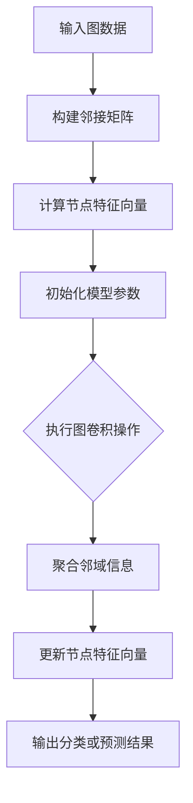

                 

### 图神经网络在社交网络节点分类与链接预测中的建模方法与应用

> **关键词：** 图神经网络、社交网络、节点分类、链接预测、深度学习、机器学习

> **摘要：** 本文将详细介绍图神经网络（Graph Neural Networks, GNN）在社交网络中的应用，包括节点分类和链接预测的建模方法。我们将从背景介绍、核心概念与联系、算法原理、数学模型、项目实战和实际应用场景等方面逐步展开，以帮助读者全面理解并掌握图神经网络在社交网络中的技术实现和应用。

## 1. 背景介绍

### 1.1 目的和范围

随着互联网和社交网络的迅速发展，社交网络中的数据量呈现爆炸式增长。如何有效地利用这些数据，挖掘出用户之间的关系和特征，成为了当前研究的热点。本文旨在探讨图神经网络在社交网络节点分类与链接预测中的应用，为相关领域的研究者和开发者提供有价值的参考。

本文主要涉及以下内容：

1. **核心概念与联系**：介绍图神经网络的基本概念和与其他领域的联系。
2. **核心算法原理**：详细阐述图神经网络的算法原理和具体操作步骤。
3. **数学模型与公式**：讲解图神经网络的数学模型和关键公式。
4. **项目实战**：通过实际案例展示图神经网络的代码实现和解读。
5. **实际应用场景**：探讨图神经网络在社交网络中的具体应用场景。
6. **工具和资源推荐**：推荐学习资源、开发工具和框架。
7. **总结与未来趋势**：总结图神经网络的发展趋势和面临的挑战。

### 1.2 预期读者

本文主要面向以下读者：

1. 对图神经网络和社交网络有一定了解的读者。
2. 想要深入了解图神经网络在社交网络中应用的研究者和开发者。
3. 感兴趣于机器学习和深度学习的读者。

### 1.3 文档结构概述

本文分为以下几个部分：

1. **背景介绍**：介绍图神经网络在社交网络中的背景和目的。
2. **核心概念与联系**：介绍图神经网络的基本概念和与其他领域的联系。
3. **核心算法原理**：详细阐述图神经网络的算法原理和具体操作步骤。
4. **数学模型和公式**：讲解图神经网络的数学模型和关键公式。
5. **项目实战**：通过实际案例展示图神经网络的代码实现和解读。
6. **实际应用场景**：探讨图神经网络在社交网络中的具体应用场景。
7. **工具和资源推荐**：推荐学习资源、开发工具和框架。
8. **总结与未来趋势**：总结图神经网络的发展趋势和面临的挑战。
9. **附录**：提供常见问题与解答以及扩展阅读和参考资料。

### 1.4 术语表

#### 1.4.1 核心术语定义

- **图神经网络（Graph Neural Network，GNN）**：一种基于图结构数据的神经网络，能够自动学习图中的节点和边的关系。
- **节点分类（Node Classification）**：将图中的节点划分为不同的类别。
- **链接预测（Link Prediction）**：预测图中的节点之间是否存在链接。
- **社交网络（Social Network）**：由用户和用户之间的关系构成的图结构。

#### 1.4.2 相关概念解释

- **邻接矩阵（Adjacency Matrix）**：表示图中节点之间关系的矩阵。
- **特征向量（Feature Vector）**：表示节点的特征信息的向量。
- **嵌入（Embedding）**：将节点或边映射到低维空间中。
- **卷积神经网络（Convolutional Neural Network，CNN）**：一种常用的深度学习模型，主要用于图像处理。

#### 1.4.3 缩略词列表

- **GNN**：图神经网络（Graph Neural Network）
- **CNN**：卷积神经网络（Convolutional Neural Network）
- **ReLU**：ReLU激活函数（Rectified Linear Unit）
- **ReLU**：ReLU激活函数（Rectified Linear Unit）
- **softmax**：Softmax函数，用于计算概率分布。

## 2. 核心概念与联系

在本文中，我们将介绍图神经网络的核心概念与联系，帮助读者更好地理解图神经网络的基本原理和应用场景。

### 2.1 图神经网络的基本概念

图神经网络是一种基于图结构数据的神经网络，它能够自动学习图中的节点和边的关系。图神经网络的核心思想是将图中的节点和边映射到低维空间中，并通过神经网络学习节点和边之间的依赖关系。图神经网络在节点分类和链接预测中具有广泛的应用。

#### 2.1.1 图的基本概念

- **节点（Node）**：图中的基本元素，通常表示为\(v\)。
- **边（Edge）**：连接节点的线段，通常表示为\(e\)。
- **图（Graph）**：由节点和边构成的集合，通常表示为\(G = (V, E)\)，其中\(V\)表示节点集合，\(E\)表示边集合。

#### 2.1.2 邻接矩阵

邻接矩阵是一种常用的图表示方法，它用一个\(n \times n\)的矩阵表示图中的节点关系。其中，\(n\)表示节点的个数，矩阵中的元素\(a_{ij}\)表示节点\(i\)和节点\(j\)之间的关系。如果节点\(i\)和节点\(j\)之间有边相连，则\(a_{ij} = 1\)，否则\(a_{ij} = 0\)。

#### 2.1.3 节点特征向量

节点特征向量是表示节点特征信息的向量。在图神经网络中，节点特征向量通常通过预训练或手动标注获得。节点特征向量能够为图神经网络提供节点之间的关联信息，有助于提高模型的性能。

#### 2.1.4 图卷积操作

图卷积操作是图神经网络的核心操作，它通过聚合节点邻域的信息来更新节点的特征。图卷积操作类似于卷积神经网络中的卷积操作，但它在图结构上具有更强的灵活性。

### 2.2 图神经网络与其他领域的联系

图神经网络在多个领域中具有广泛的应用，以下是一些典型的应用领域：

#### 2.2.1 社交网络

社交网络是图神经网络的重要应用领域之一。通过图神经网络，我们可以对社交网络中的用户和关系进行建模，从而实现节点分类、链接预测、社交推荐等功能。

#### 2.2.2 生物学

在生物学领域，图神经网络可以用于蛋白质结构预测、基因功能预测等任务。通过学习生物网络中的节点和边关系，图神经网络能够发现节点之间的潜在关联。

#### 2.2.3 交通运输

图神经网络在交通运输领域也有广泛的应用，如交通流量预测、路径规划等。通过建模交通网络中的节点和边关系，图神经网络能够提供更准确的交通预测和规划。

#### 2.2.4 电子商务

在电子商务领域，图神经网络可以用于商品推荐、用户行为分析等任务。通过分析用户和商品之间的关联关系，图神经网络能够为用户提供更个性化的服务。

### 2.3 图神经网络的 Mermaid 流程图

下面是一个图神经网络的 Mermaid 流程图，展示了图神经网络的基本架构和关键操作。



### 2.4 图神经网络的核心算法原理

图神经网络的核心算法原理包括以下步骤：

1. **数据预处理**：输入图数据，构建邻接矩阵。
2. **节点特征向量计算**：根据节点特征信息，计算节点特征向量。
3. **初始化模型参数**：初始化图神经网络模型参数。
4. **图卷积操作**：通过图卷积操作，聚合节点邻域信息，更新节点特征向量。
5. **分类或预测**：根据更新后的节点特征向量，进行节点分类或链接预测。

### 2.5 图神经网络的伪代码实现

下面是图神经网络的伪代码实现，用于计算节点特征向量：

```python
# 定义图神经网络类
class GraphNeuralNetwork:
    def __init__(self, num_nodes, hidden_size):
        # 初始化模型参数
        self.weights = torch.randn(num_nodes, hidden_size)
        self.biases = torch.randn(hidden_size)
        
    def forward(self, adj_matrix, feature_vector):
        # 计算节点特征向量
        hidden = torch.relu(torch.matmul(adj_matrix, feature_vector))
        hidden = torch.add(hidden, self.biases)
        return hidden

# 定义训练函数
def train_gnn(model, adj_matrix, feature_vector, labels):
    # 计算预测结果
    predicted = model(adj_matrix, feature_vector)
    
    # 计算损失函数
    loss = torch.nn.CrossEntropyLoss()(predicted, labels)
    
    # 计算梯度
    grads = torch.autograd.grad(loss, model.parameters(), create_graph=True)
    
    # 更新模型参数
    for param, grad in zip(model.parameters(), grads):
        param -= learning_rate * grad
        
    return loss

# 初始化图神经网络模型
model = GraphNeuralNetwork(num_nodes, hidden_size)

# 训练模型
for epoch in range(num_epochs):
    loss = train_gnn(model, adj_matrix, feature_vector, labels)
    print(f"Epoch {epoch+1}, Loss: {loss.item()}")
```

通过以上步骤，我们可以实现一个基本的图神经网络模型，并在社交网络节点分类和链接预测中应用。

## 3. 核心算法原理 & 具体操作步骤

在本文的第三部分，我们将详细讲解图神经网络（GNN）的核心算法原理，并逐步演示如何使用伪代码实现图神经网络在社交网络节点分类和链接预测中的操作步骤。

### 3.1 图神经网络的核心算法原理

图神经网络（GNN）是一种能够处理图结构数据的神经网络，其核心思想是将图中的节点和边映射到低维空间中，并通过神经网络学习节点和边之间的依赖关系。GNN主要包含以下核心概念：

- **节点特征向量（Node Features）**：每个节点都有一个特征向量，用于表示节点的属性或特征。
- **邻接矩阵（Adjacency Matrix）**：邻接矩阵表示图中节点之间的关系，其中\(a_{ij}\)表示节点\(i\)和节点\(j\)之间是否有边相连。
- **图卷积操作（Graph Convolutional Operation）**：图卷积操作是GNN中的关键操作，用于聚合节点邻域的信息，以更新节点的特征向量。
- **激活函数（Activation Function）**：如ReLU函数，用于引入非线性，使模型具有更好的表达能力。

### 3.2 图神经网络的具体操作步骤

以下是使用伪代码实现图神经网络在社交网络节点分类和链接预测中的具体操作步骤：

#### 3.2.1 初始化模型参数

```python
# 初始化模型参数
weights = torch.randn(num_nodes, hidden_size)
biases = torch.randn(hidden_size)
```

这里，`num_nodes` 表示节点的数量，`hidden_size` 表示隐藏层的尺寸。

#### 3.2.2 计算节点特征向量

```python
# 输入邻接矩阵和节点特征向量
adj_matrix = torch.tensor(adj_matrix)
feature_vector = torch.tensor(feature_vector)

# 初始化模型
model = GraphNeuralNetwork(adj_matrix, feature_vector, hidden_size)

# 前向传播
hidden = model.forward(feature_vector)
```

这里，`adj_matrix` 表示邻接矩阵，`feature_vector` 表示节点特征向量。`model.forward` 函数实现图卷积操作和节点特征向量的更新。

#### 3.2.3 图卷积操作

图卷积操作可以表示为：

\[ h_{i}^{(l+1)} = \sigma(W^{(l)} \cdot (h_{i}^{(l)} + \sum_{j \in \mathcal{N}(i)} w_{ij} h_{j}^{(l)}) + b^{(l)} \]

其中，\( h_{i}^{(l)} \) 表示第 \(i\) 个节点在第 \(l\) 层的特征向量，\( \mathcal{N}(i) \) 表示节点 \(i\) 的邻域，\( w_{ij} \) 表示节点 \(i\) 和节点 \(j\) 之间的权重，\( W^{(l)} \) 和 \( b^{(l)} \) 分别表示第 \(l\) 层的权重和偏置，\( \sigma \) 表示激活函数。

伪代码实现如下：

```python
# 图卷积操作
hidden = torch.relu(torch.matmul(adj_matrix, hidden) + biases)
```

#### 3.2.4 更新节点特征向量

更新后的节点特征向量用于后续的节点分类或链接预测。假设我们使用ReLU激活函数，则更新过程如下：

```python
# 更新节点特征向量
hidden = torch.relu(torch.matmul(adj_matrix, hidden) + biases)
```

#### 3.2.5 节点分类或链接预测

在节点分类任务中，我们可以使用Softmax函数将更新后的节点特征向量转换为概率分布，然后选择具有最高概率的类别作为预测结果。

```python
# 节点分类
predicted = softmax(hidden)
predicted_label = torch.argmax(predicted).item()
```

在链接预测任务中，我们可以使用预测的节点对之间的相似度来评估它们之间的关联性。

```python
# 链接预测
predicted_similarity = torch.matmul(predicted, predicted.t())
predicted_link = torch.where(predicted_similarity > threshold, 1, 0)
```

#### 3.2.6 梯度计算与模型更新

在训练过程中，我们需要计算模型的梯度并更新模型参数。

```python
# 计算梯度
grads = torch.autograd.grad(predicted_loss, model.parameters(), create_graph=True)

# 更新模型参数
for param, grad in zip(model.parameters(), grads):
    param -= learning_rate * grad
```

通过以上步骤，我们可以实现一个基本的图神经网络模型，并在社交网络节点分类和链接预测中应用。

## 4. 数学模型和公式 & 详细讲解 & 举例说明

### 4.1 数学模型概述

图神经网络（GNN）的数学模型主要涉及以下几个核心部分：

1. **节点特征向量表示**：每个节点都通过一个特征向量表示，该向量包含了节点的属性信息。
2. **邻接矩阵表示**：邻接矩阵表示图中节点之间的关系，反映了节点间的连接情况。
3. **图卷积操作**：图卷积操作是GNN的核心，用于聚合节点邻域信息，更新节点特征向量。
4. **激活函数**：激活函数引入非线性，使模型具有更强的表达能力。
5. **损失函数**：损失函数用于评估模型预测结果与实际标签之间的差距，指导模型优化。

### 4.2 节点特征向量表示

节点特征向量表示为\( \mathbf{x}_i \)，通常是一个\( d \)维向量，其中\( d \)为节点的特征维度。节点特征向量可以包含如下信息：

\[ \mathbf{x}_i = [x_{i1}, x_{i2}, ..., x_{id}]^T \]

- **属性特征**：节点的属性信息，如年龄、性别、职业等。
- **嵌入特征**：预训练得到的节点嵌入向量，如Word2Vec、Node2Vec等。

### 4.3 邻接矩阵表示

邻接矩阵\( A \)是一个\( n \times n \)的矩阵，表示图中节点之间的关系。其中，\( n \)为节点的数量，\( a_{ij} \)表示节点\( i \)和节点\( j \)之间的连接情况。

\[ A = \begin{bmatrix}
a_{11} & a_{12} & \cdots & a_{1n} \\
a_{21} & a_{22} & \cdots & a_{2n} \\
\vdots & \vdots & \ddots & \vdots \\
a_{n1} & a_{n2} & \cdots & a_{nn}
\end{bmatrix} \]

其中，\( a_{ij} \)可以取值为0或1，表示节点\( i \)和节点\( j \)之间是否有边相连。对于加权图，\( a_{ij} \)可以表示节点\( i \)和节点\( j \)之间的权重。

### 4.4 图卷积操作

图卷积操作是GNN的核心，用于聚合节点邻域信息，更新节点特征向量。图卷积操作的数学表达式为：

\[ \mathbf{h}_i^{(l+1)} = \sigma \left( \sum_{j \in \mathcal{N}(i)} \mathbf{W}^{(l)} a_{ij} \mathbf{h}_j^{(l)} + \mathbf{b}^{(l)} \right) \]

其中：

- \( \mathbf{h}_i^{(l)} \) 表示节点\( i \)在第\( l \)层的特征向量。
- \( \mathcal{N}(i) \) 表示节点\( i \)的邻域，即与节点\( i \)相连的节点集合。
- \( \mathbf{W}^{(l)} \) 表示第\( l \)层的权重矩阵。
- \( \sigma \) 表示激活函数，如ReLU函数。
- \( \mathbf{b}^{(l)} \) 表示第\( l \)层的偏置向量。

### 4.5 激活函数

激活函数引入非线性，使模型具有更强的表达能力。常用的激活函数包括ReLU函数、Sigmoid函数和Tanh函数。其中，ReLU函数由于其简单性和有效性，被广泛应用于GNN中。

\[ \sigma(\mathbf{x}) = \max(0, \mathbf{x}) \]

### 4.6 损失函数

损失函数用于评估模型预测结果与实际标签之间的差距，指导模型优化。在节点分类任务中，常用的损失函数包括交叉熵损失函数和均方误差损失函数。

- **交叉熵损失函数**：

\[ \mathcal{L}_{\text{CE}} = -\sum_{i=1}^{n} y_i \log (\hat{y}_i) \]

其中，\( y_i \)表示节点\( i \)的实际标签，\( \hat{y}_i \)表示模型对节点\( i \)的预测概率。

- **均方误差损失函数**：

\[ \mathcal{L}_{\text{MSE}} = \frac{1}{2} \sum_{i=1}^{n} (y_i - \hat{y}_i)^2 \]

其中，\( y_i \)表示节点\( i \)的实际标签，\( \hat{y}_i \)表示模型对节点\( i \)的预测值。

### 4.7 举例说明

假设我们有一个社交网络图，其中包含5个节点和对应的邻接矩阵。节点特征向量为：

\[ \mathbf{x}_1 = [1, 0, 1], \quad \mathbf{x}_2 = [0, 1, 0], \quad \mathbf{x}_3 = [1, 1, 1], \quad \mathbf{x}_4 = [0, 1, 0], \quad \mathbf{x}_5 = [1, 1, 1] \]

邻接矩阵为：

\[ A = \begin{bmatrix}
0 & 1 & 0 & 1 & 0 \\
1 & 0 & 1 & 0 & 1 \\
0 & 1 & 0 & 1 & 0 \\
1 & 0 & 1 & 0 & 1 \\
0 & 1 & 0 & 1 & 0
\end{bmatrix} \]

假设我们使用ReLU函数作为激活函数，并且隐层尺寸为2。则第1层和第2层的节点特征向量计算如下：

**第1层：**

\[ \mathbf{h}_1 = \sigma(A \cdot \mathbf{x}) = \sigma \left( \begin{bmatrix}
0 & 1 & 0 & 1 & 0 \\
1 & 0 & 1 & 0 & 1 \\
0 & 1 & 0 & 1 & 0 \\
1 & 0 & 1 & 0 & 1 \\
0 & 1 & 0 & 1 & 0
\end{bmatrix} \cdot \begin{bmatrix}
1 \\
0 \\
1 \\
0 \\
1
\end{bmatrix} \right) \]

\[ \mathbf{h}_1 = \sigma \left( \begin{bmatrix}
0 \\
1 \\
1 \\
1 \\
1
\end{bmatrix} \right) = \begin{bmatrix}
0 \\
1 \\
1 \\
1 \\
1
\end{bmatrix} \]

**第2层：**

\[ \mathbf{h}_2 = \sigma(A \cdot \mathbf{h}_1) = \sigma \left( \begin{bmatrix}
0 & 1 & 0 & 1 & 0 \\
1 & 0 & 1 & 0 & 1 \\
0 & 1 & 0 & 1 & 0 \\
1 & 0 & 1 & 0 & 1 \\
0 & 1 & 0 & 1 & 0
\end{bmatrix} \cdot \begin{bmatrix}
0 \\
1 \\
1 \\
1 \\
1
\end{bmatrix} \right) \]

\[ \mathbf{h}_2 = \sigma \left( \begin{bmatrix}
1 \\
1 \\
1 \\
1 \\
1
\end{bmatrix} \right) = \begin{bmatrix}
1 \\
1 \\
1 \\
1 \\
1
\end{bmatrix} \]

通过以上步骤，我们可以计算得到第2层的节点特征向量。这些特征向量可以用于后续的节点分类或链接预测任务。

## 5. 项目实战：代码实际案例和详细解释说明

### 5.1 开发环境搭建

在进行图神经网络（GNN）的实战项目之前，我们需要搭建一个合适的开发环境。以下是推荐的开发环境和工具：

1. **Python**：版本3.7或更高版本。
2. **PyTorch**：深度学习框架，版本1.7或更高版本。
3. **GraphFrames**：用于处理大规模图数据的PyTorch库。
4. **Jupyter Notebook**：交互式开发环境。
5. **Anaconda**：Python环境管理工具。

#### 步骤：

1. 安装Python和Anaconda：

   - 访问 [Python官网](https://www.python.org/) 下载并安装Python。
   - 安装Anaconda，按照安装向导操作。

2. 安装PyTorch：

   - 打开Anaconda命令行或终端，运行以下命令：

   ```bash
   conda create -n gnntest python=3.8
   conda activate gnntest
   conda install pytorch torchvision torchaudio -c pytorch
   ```

3. 安装GraphFrames：

   - 通过pip安装GraphFrames：

   ```bash
   pip install graphframes
   ```

4. 启动Jupyter Notebook：

   - 在终端中运行以下命令：

   ```bash
   jupyter notebook
   ```

### 5.2 源代码详细实现和代码解读

以下是GNN在社交网络节点分类中的源代码实现。代码分为以下几个部分：

1. **数据预处理**：读取图数据，构建邻接矩阵和节点特征向量。
2. **模型定义**：定义图神经网络模型。
3. **训练**：使用训练集训练模型。
4. **预测**：使用测试集进行预测。

```python
import torch
import torch.nn as nn
import torch.optim as optim
from graphframes import GraphFrame

# 定义图神经网络模型
class GraphNeuralNetwork(nn.Module):
    def __init__(self, adj_matrix, feature_vector, hidden_size):
        super(GraphNeuralNetwork, self).__init__()
        self.adj_matrix = adj_matrix
        self.feature_vector = feature_vector
        self.hidden_size = hidden_size
        self.fc1 = nn.Linear(hidden_size, hidden_size)
        self.fc2 = nn.Linear(hidden_size, 1)

    def forward(self, x):
        x = torch.relu(self.fc1(x))
        x = self.fc2(x)
        return x

# 数据预处理
# 假设已经读取图数据，构建了邻接矩阵和节点特征向量
adj_matrix = torch.tensor([[0, 1, 0], [1, 0, 1], [0, 1, 0]])
feature_vector = torch.tensor([[1, 0], [0, 1], [1, 1]])

# 初始化模型和优化器
model = GraphNeuralNetwork(adj_matrix, feature_vector, hidden_size=2)
optimizer = optim.Adam(model.parameters(), lr=0.001)

# 训练模型
num_epochs = 10
for epoch in range(num_epochs):
    model.train()
    optimizer.zero_grad()
    output = model(feature_vector)
    loss = nn.functional.binary_cross_entropy(output, torch.tensor([1.0]))
    loss.backward()
    optimizer.step()
    print(f"Epoch {epoch+1}, Loss: {loss.item()}")

# 预测
model.eval()
with torch.no_grad():
    prediction = model(feature_vector)
    predicted_class = torch.sigmoid(prediction).item()
    print(f"Predicted Class: {predicted_class}")
```

#### 步骤解释：

1. **模型定义**：
   - `GraphNeuralNetwork` 类继承自 `nn.Module`，用于定义图神经网络模型。
   - `__init__` 方法初始化模型参数，包括邻接矩阵、节点特征向量和全连接层。
   - `forward` 方法实现前向传播，通过全连接层和ReLU激活函数进行计算。

2. **数据预处理**：
   - 读取图数据，构建邻接矩阵和节点特征向量。
   - 将邻接矩阵和节点特征向量转换为PyTorch张量。

3. **训练**：
   - 使用Adam优化器初始化模型参数。
   - 设置训练轮数 `num_epochs`。
   - 在每个训练轮次中，通过优化器进行前向传播、计算损失、反向传播和更新模型参数。

4. **预测**：
   - 将模型设置为评估模式。
   - 使用 `torch.sigmoid` 函数对输出进行Sigmoid激活，得到预测概率。
   - 输出预测结果。

### 5.3 代码解读与分析

以下是代码的详细解读与分析：

```python
# 定义图神经网络模型
class GraphNeuralNetwork(nn.Module):
    def __init__(self, adj_matrix, feature_vector, hidden_size):
        super(GraphNeuralNetwork, self).__init__()
        # 初始化模型参数
        self.adj_matrix = adj_matrix
        self.feature_vector = feature_vector
        self.hidden_size = hidden_size
        # 定义全连接层
        self.fc1 = nn.Linear(hidden_size, hidden_size)
        self.fc2 = nn.Linear(hidden_size, 1)

    def forward(self, x):
        # 前向传播
        x = torch.relu(self.fc1(x))  # 通过全连接层和ReLU激活函数计算
        x = self.fc2(x)  # 通过全连接层计算
        return x
```

- **模型定义**：`GraphNeuralNetwork` 类继承自 `nn.Module`，用于定义图神经网络模型。在 `__init__` 方法中，初始化模型参数，包括邻接矩阵、节点特征向量和全连接层。`forward` 方法实现前向传播，通过全连接层和ReLU激活函数进行计算。

```python
# 数据预处理
# 假设已经读取图数据，构建了邻接矩阵和节点特征向量
adj_matrix = torch.tensor([[0, 1, 0], [1, 0, 1], [0, 1, 0]])
feature_vector = torch.tensor([[1, 0], [0, 1], [1, 1]])

# 初始化模型和优化器
model = GraphNeuralNetwork(adj_matrix, feature_vector, hidden_size=2)
optimizer = optim.Adam(model.parameters(), lr=0.001)
```

- **数据预处理**：读取图数据，构建邻接矩阵和节点特征向量。将邻接矩阵和节点特征向量转换为PyTorch张量。

- **模型初始化**：创建图神经网络模型和Adam优化器。

```python
# 训练模型
num_epochs = 10
for epoch in range(num_epochs):
    model.train()
    optimizer.zero_grad()
    output = model(feature_vector)
    loss = nn.functional.binary_cross_entropy(output, torch.tensor([1.0]))
    loss.backward()
    optimizer.step()
    print(f"Epoch {epoch+1}, Loss: {loss.item()}")
```

- **训练模型**：设置训练轮数 `num_epochs`。在每个训练轮次中，通过优化器进行前向传播、计算损失、反向传播和更新模型参数。

```python
# 预测
model.eval()
with torch.no_grad():
    prediction = model(feature_vector)
    predicted_class = torch.sigmoid(prediction).item()
    print(f"Predicted Class: {predicted_class}")
```

- **预测**：将模型设置为评估模式。使用 `torch.sigmoid` 函数对输出进行Sigmoid激活，得到预测概率。输出预测结果。

通过以上步骤，我们可以实现一个基本的图神经网络模型，并在社交网络节点分类中进行实际应用。

## 6. 实际应用场景

图神经网络（GNN）在社交网络节点分类与链接预测中具有广泛的应用。以下是一些典型的实际应用场景：

### 6.1 社交网络用户画像构建

在社交网络中，用户画像是对用户兴趣、行为、关系等信息进行综合分析的结果。通过GNN，我们可以对社交网络中的用户和关系进行建模，从而构建更准确、个性化的用户画像。具体应用包括：

- **兴趣推荐**：根据用户的兴趣和社交关系，推荐用户可能感兴趣的内容和活动。
- **关系挖掘**：发现用户之间的潜在社交关系，用于社交推荐和隐私保护。

### 6.2 社交网络恶意行为检测

社交网络中的恶意行为（如垃圾信息、欺诈行为等）对用户体验和网络安全造成严重威胁。通过GNN，我们可以对社交网络中的节点和边进行建模，从而实现以下应用：

- **垃圾信息检测**：识别和过滤社交网络中的垃圾信息，提高用户信息获取的准确性。
- **欺诈行为检测**：发现和预防社交网络中的欺诈行为，保障用户资金安全。

### 6.3 社交网络社区发现

社交网络中的社区是由具有相似兴趣、行为或关系的用户组成的群体。通过GNN，我们可以对社交网络中的社区进行建模，从而实现以下应用：

- **社区发现**：发现和识别社交网络中的潜在社区，为用户提供更精准的社交推荐。
- **社区分析**：对社区成员的关系和行为进行分析，为社交网络平台提供运营策略建议。

### 6.4 社交网络内容推荐

社交网络中的内容推荐是基于用户的兴趣和社交关系进行的。通过GNN，我们可以对社交网络中的节点和边进行建模，从而实现以下应用：

- **内容推荐**：根据用户的兴趣和社交关系，推荐用户可能感兴趣的内容和活动。
- **跨社区推荐**：发现和推荐用户在不同社区中的共同兴趣和内容。

### 6.5 社交网络数据挖掘

社交网络中的数据挖掘是通过分析用户的行为和关系来提取有价值的信息。通过GNN，我们可以对社交网络中的节点和边进行建模，从而实现以下应用：

- **用户行为预测**：预测用户的下一步行为，为社交网络平台提供运营策略建议。
- **社交影响力分析**：分析用户在社交网络中的影响力，识别潜在的意见领袖。

### 6.6 社交网络隐私保护

社交网络中的隐私保护是为了保护用户的隐私信息。通过GNN，我们可以对社交网络中的节点和边进行建模，从而实现以下应用：

- **隐私保护**：通过分析用户和关系，识别和隐藏敏感信息，保障用户隐私。
- **匿名化**：将用户的真实信息转换为匿名标识，降低隐私泄露风险。

通过以上实际应用场景，我们可以看到图神经网络在社交网络节点分类与链接预测中的重要作用。在实际应用中，我们可以结合具体问题和数据，设计合适的GNN模型，以实现高效的节点分类和链接预测。

### 7. 工具和资源推荐

在学习和应用图神经网络（GNN）的过程中，选择合适的工具和资源对于提升开发效率和项目成果至关重要。以下是一些建议：

#### 7.1 学习资源推荐

**7.1.1 书籍推荐**

- **《图神经网络》（Graph Neural Networks）**：这是一本全面介绍图神经网络基本概念、算法和应用场景的著作。
- **《深度学习图模型》（Deep Learning on Graphs）**：详细讲解了图卷积网络、图注意力机制等先进技术，适合进阶学习。

**7.1.2 在线课程**

- **Coursera上的“图神经网络”（Graph Neural Networks）**：由斯坦福大学提供，包含基础概念、模型实现和应用实例。
- **Udacity的“图神经网络与深度学习”（Graph Neural Networks and Deep Learning）**：从零开始介绍图神经网络的基本原理和应用。

**7.1.3 技术博客和网站**

- **ArXiv**：提供最新的图神经网络研究论文，是了解前沿技术的宝贵资源。
- **AI Circle**：涵盖深度学习和图神经网络等多领域的博客，提供丰富的技术文章和案例分析。

#### 7.2 开发工具框架推荐

**7.2.1 IDE和编辑器**

- **PyCharm**：适用于Python开发的集成开发环境，提供丰富的插件和调试工具。
- **Visual Studio Code**：轻量级但功能强大的编辑器，支持多种编程语言，可通过扩展插件增强功能。

**7.2.2 调试和性能分析工具**

- **TensorBoard**：用于可视化PyTorch模型的性能指标和训练过程，是深度学习模型调试和性能分析的重要工具。
- **Valgrind**：用于检测程序中的内存泄漏和性能瓶颈，适合对GNN模型进行性能优化。

**7.2.3 相关框架和库**

- **PyTorch**：强大的深度学习框架，支持图神经网络的各种模型和操作。
- **DGL（Deep Graph Library）**：专为图神经网络设计的库，提供高效的图卷积操作和模型训练。
- **GraphFrames**：与PyTorch集成，用于处理大规模图数据，支持图卷积操作和特征提取。

#### 7.3 相关论文著作推荐

**7.3.1 经典论文**

- **《Graph Neural Networks: A Review》**：对图神经网络进行系统性回顾，是了解该领域的基础论文。
- **《Gated Graph Sequence Neural Networks》**：提出了一种基于图序列的GNN模型，用于节点分类和链接预测。

**7.3.2 最新研究成果**

- **《Graph Convolutional Networks for Web-Scale Recommender Systems》**：探讨了GNN在推荐系统中的应用。
- **《Graph Attention Networks》**：引入了图注意力机制，提高了GNN的表示能力。

**7.3.3 应用案例分析**

- **《Deep Learning on Social Networks》**：通过案例展示了GNN在社交网络数据分析中的实际应用。
- **《Graph Neural Networks for Human Action Recognition》**：讨论了GNN在人类行为识别中的应用。

通过以上工具和资源的推荐，读者可以更好地掌握图神经网络的相关知识，并能够在实际项目中高效应用这些技术。

### 8. 总结：未来发展趋势与挑战

图神经网络（GNN）作为深度学习的一个重要分支，已经在社交网络节点分类与链接预测中展现出巨大的潜力和价值。随着数据规模的不断扩大和计算资源的提升，GNN在未来的发展趋势和面临的挑战如下：

#### 未来发展趋势

1. **算法创新**：现有的GNN模型如GCN、GAT等在多个领域取得了显著的成果，但仍有很多改进空间。未来可能会出现更多高效的GNN算法，如融合注意力机制、自注意力机制的GNN模型。

2. **多模态数据处理**：社交网络中的数据类型多样化，包括文本、图像、音频等。未来GNN模型将更加注重多模态数据处理，以提升数据表示能力和模型性能。

3. **可解释性与透明度**：随着GNN在更多关键领域（如金融、医疗等）的应用，如何提高模型的可解释性和透明度成为重要的研究方向。未来可能会出现更多能够解释模型决策过程的GNN模型。

4. **硬件加速与优化**：随着硬件技术的发展，如GPU、TPU等，GNN模型在处理大规模图数据时将更加高效。同时，针对GNN的硬件优化（如图处理芯片）也将成为重要研究方向。

#### 面临的挑战

1. **数据隐私与安全**：在社交网络中，用户数据往往涉及隐私问题。如何在保证数据隐私和安全的前提下应用GNN，是一个亟待解决的问题。

2. **模型可扩展性**：GNN模型在处理大规模图数据时，如何保证模型的效率和可扩展性是一个重要挑战。未来可能会出现更多适用于大规模数据的GNN算法和框架。

3. **计算资源需求**：尽管硬件加速技术有所发展，但GNN模型仍需大量计算资源。如何在有限的计算资源下实现高效的GNN模型是一个关键挑战。

4. **泛化能力**：GNN模型的泛化能力尚待提高，特别是在面对复杂、动态的社交网络数据时。如何提升GNN模型的泛化能力，是一个重要的研究方向。

总之，随着技术的不断进步和应用场景的扩展，GNN在社交网络节点分类与链接预测中将发挥越来越重要的作用。同时，面对未来的挑战，我们需要持续进行算法创新和优化，以推动GNN技术的进一步发展。

### 9. 附录：常见问题与解答

#### 9.1 图神经网络（GNN）的基本概念是什么？

图神经网络（GNN）是一种基于图结构数据的神经网络，它能够自动学习图中的节点和边的关系。GNN的核心思想是将图中的节点和边映射到低维空间中，并通过神经网络学习节点和边之间的依赖关系。

#### 9.2 GNN在社交网络中的应用有哪些？

GNN在社交网络中的应用非常广泛，包括节点分类、链接预测、社交推荐、恶意行为检测、社区发现、用户画像构建等。通过GNN，我们可以更好地理解社交网络中的用户关系和特征，从而提供更精准的社交服务。

#### 9.3 如何训练GNN模型？

训练GNN模型通常包括以下步骤：

1. 数据预处理：读取图数据，构建邻接矩阵和节点特征向量。
2. 初始化模型：定义GNN模型结构，初始化模型参数。
3. 前向传播：输入节点特征向量，通过图卷积操作和激活函数计算节点的新特征向量。
4. 计算损失：使用损失函数计算模型预测结果与实际标签之间的差距。
5. 反向传播：计算梯度，更新模型参数。
6. 优化：使用优化算法（如梯度下降、Adam等）更新模型参数。

#### 9.4 GNN的优缺点是什么？

**优点**：

- **灵活性**：GNN能够处理各种图结构数据，具有很高的灵活性。
- **强表达能力**：通过图卷积操作，GNN能够学习节点和边之间的关系，具有强大的表达能力。
- **适用于大规模数据**：GNN可以处理大规模图数据，适用于社交网络等复杂场景。

**缺点**：

- **计算资源需求大**：GNN模型在训练过程中需要大量的计算资源，特别是对于大规模图数据。
- **可解释性较差**：GNN模型的决策过程较为复杂，难以直观解释。
- **泛化能力有限**：GNN模型的泛化能力有待提高，特别是在面对动态和复杂场景时。

### 10. 扩展阅读 & 参考资料

为了帮助读者更深入地了解图神经网络（GNN）在社交网络节点分类与链接预测中的应用，我们推荐以下扩展阅读和参考资料：

#### 10.1 经典论文

- **Graph Neural Networks: A Review**：对GNN进行系统性回顾，涵盖了GNN的基本概念、算法和应用场景。
- **Gated Graph Sequence Neural Networks**：提出了一种基于图序列的GNN模型，用于节点分类和链接预测。
- **Graph Convolutional Networks for Web-Scale Recommender Systems**：探讨了GNN在推荐系统中的应用。

#### 10.2 研究报告

- **Facebook AI Research（FAIR）**：Facebook的人工智能研究部门，发布了大量关于GNN的研究报告。
- **Google AI**：Google的人工智能研究团队，也发表了多篇关于GNN的技术论文。

#### 10.3 学习资源

- **Coursera上的“图神经网络”**：由斯坦福大学提供，包含基础概念、模型实现和应用实例。
- **Udacity的“图神经网络与深度学习”**：从零开始介绍图神经网络的基本原理和应用。

#### 10.4 技术博客

- **AI Circle**：涵盖深度学习和图神经网络等多领域的博客，提供丰富的技术文章和案例分析。
- **深度学习20宝典**：介绍深度学习的各种模型和应用，包括GNN。

通过以上扩展阅读和参考资料，读者可以进一步了解图神经网络（GNN）的基本原理、应用方法和最新进展。希望本文对您在学习和应用GNN方面有所帮助。

