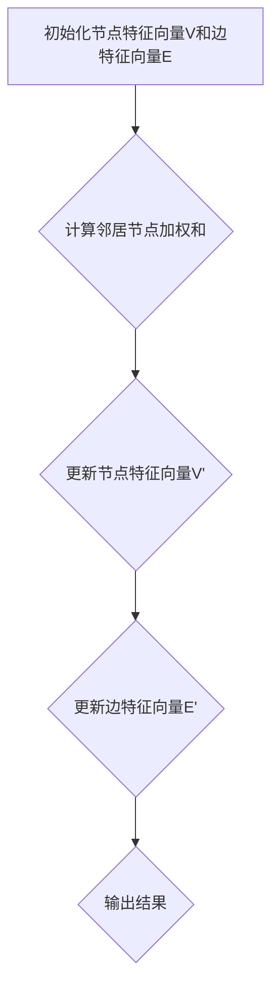

                 

# 图神经网络在金融异常检测与风险预警中的建模方法与实践

> **关键词**：图神经网络、金融异常检测、风险预警、建模方法、实践应用

> **摘要**：本文旨在探讨图神经网络（Graph Neural Networks, GNNs）在金融异常检测与风险预警领域的应用。通过对图神经网络的基本原理、核心算法、数学模型、具体操作步骤以及实际项目案例的详细分析，本文揭示了GNNs在金融数据处理中的巨大潜力，并探讨了未来发展趋势与挑战。

## 1. 背景介绍

### 1.1 目的和范围

本文的目标是深入探讨图神经网络（GNNs）在金融异常检测与风险预警中的应用，通过理论分析和实际案例展示其在金融数据处理中的优势。文章将覆盖以下内容：

- GNNs的基本原理和核心算法；
- GNNs在金融异常检测和风险预警中的数学模型和具体操作步骤；
- 实际项目案例中的代码实现和详细解释；
- GNNs在金融领域的实际应用场景；
- 未来发展趋势与挑战。

### 1.2 预期读者

本文适用于对金融领域和人工智能有一定了解的读者，特别是对图神经网络和金融异常检测感兴趣的从业者、研究人员和学者。通过本文的阅读，读者可以：

- 理解GNNs的基本原理和优势；
- 掌握GNNs在金融异常检测和风险预警中的应用方法；
- 学习如何在实际项目中应用GNNs；
- 探讨未来GNNs在金融领域的发展趋势与挑战。

### 1.3 文档结构概述

本文结构如下：

- 第1章：背景介绍，包括目的和范围、预期读者、文档结构概述等；
- 第2章：核心概念与联系，介绍GNNs的基本原理和核心算法；
- 第3章：核心算法原理 & 具体操作步骤，详细阐述GNNs的数学模型和具体操作步骤；
- 第4章：数学模型和公式 & 详细讲解 & 举例说明，通过实例说明GNNs的数学模型；
- 第5章：项目实战：代码实际案例和详细解释说明，展示实际项目中的GNNs应用；
- 第6章：实际应用场景，分析GNNs在金融异常检测和风险预警中的实际应用；
- 第7章：工具和资源推荐，推荐学习资源、开发工具和框架；
- 第8章：总结：未来发展趋势与挑战，探讨GNNs在金融领域的发展趋势和挑战；
- 第9章：附录：常见问题与解答，回答读者可能遇到的问题；
- 第10章：扩展阅读 & 参考资料，提供进一步阅读的资源和参考文献。

### 1.4 术语表

#### 1.4.1 核心术语定义

- 图神经网络（Graph Neural Networks, GNNs）：一种基于图结构数据的神经网络模型，通过学习节点和边之间的关系来进行图上的表示学习和预测。
- 金融异常检测（Financial Anomaly Detection）：在金融领域，通过对金融数据进行分析，识别出与正常情况不一致的异常行为或事件，以提前预警风险。
- 风险预警（Risk Warning）：通过分析金融数据，预测可能出现的风险，并提前采取措施以降低风险。

#### 1.4.2 相关概念解释

- 节点（Node）：图中的基本元素，代表数据集中的个体，如交易、客户、公司等。
- 边（Edge）：连接节点的线，表示节点之间的关系，如交易之间的关联、客户之间的合作等。
- 图（Graph）：由节点和边组成的结构，表示数据之间的关系。
- 异常（Anomaly）：与正常情况不一致的数据或事件，可能预示着潜在的风险。

#### 1.4.3 缩略词列表

- GNNs：图神经网络（Graph Neural Networks）
- FAD：金融异常检测（Financial Anomaly Detection）
- RW：风险预警（Risk Warning）

## 2. 核心概念与联系

### 2.1 GNNs的基本原理

图神经网络（GNNs）是一种基于图结构数据的神经网络模型，通过学习节点和边之间的关系来进行图上的表示学习和预测。GNNs的核心思想是将节点和边的信息进行融合，以获得更加丰富的节点表示。下面是GNNs的基本原理：

#### 2.1.1 节点表示

在GNNs中，每个节点都被表示为一个向量，称为节点特征向量。节点特征向量包含了节点的各种属性信息，如交易金额、交易时间、客户信息等。通过学习，GNNs可以自动提取节点特征向量的有效信息，以获得更好的节点表示。

#### 2.1.2 边表示

边表示了节点之间的关系。在GNNs中，边被表示为一个权重向量，称为边特征向量。边特征向量包含了边之间的各种关联信息，如交易之间的相似度、客户之间的合作频率等。通过学习，GNNs可以自动提取边特征向量的有效信息，以获得更好的边表示。

#### 2.1.3 节点更新

在GNNs中，节点的表示是通过邻居节点的信息进行更新的。具体来说，每个节点会计算其邻居节点的特征向量的加权和，并利用这个加权和来更新自身的特征向量。这个过程称为节点更新。

#### 2.1.4 边更新

在GNNs中，边的表示也是通过邻居节点的信息进行更新的。具体来说，每个边会计算其邻居节点的特征向量的加权和，并利用这个加权和来更新自身的特征向量。这个过程称为边更新。

### 2.2 GNNs的核心算法

GNNs的核心算法主要包括节点更新和边更新。下面是GNNs的核心算法原理和具体操作步骤：

#### 2.2.1 节点更新算法

```plaintext
输入：GNN模型、节点特征向量V、边特征向量E、邻居节点集合N
输出：更新后的节点特征向量V'

1. 对每个节点v，计算其邻居节点n的加权和w：
   w = Σ(w_ij * v_j)，其中w_ij为边权重，v_j为邻居节点n的特征向量

2. 对每个节点v，利用加权和w更新其特征向量：
   V'[v] = V[v] + w
```

#### 2.2.2 边更新算法

```plaintext
输入：GNN模型、节点特征向量V、边特征向量E、邻居节点集合N
输出：更新后的边特征向量E'

1. 对每个边e，计算其邻居节点n的加权和w：
   w = Σ(w_ij * v_j)，其中w_ij为边权重，v_j为邻居节点n的特征向量

2. 对每个边e，利用加权和w更新其特征向量：
   E'[e] = E[e] + w
```

### 2.3 GNNs的数学模型

GNNs的数学模型主要包括两部分：节点特征向量的更新和边特征向量的更新。下面是GNNs的数学模型和具体公式：

#### 2.3.1 节点特征向量的更新

$$
V'(v) = V(v) + \sum_{n \in N(v)} W(n, v) * E(n)
$$

其中，$V'(v)$为更新后的节点特征向量，$V(v)$为原始节点特征向量，$N(v)$为节点v的邻居节点集合，$W(n, v)$为边权重，$E(n)$为邻居节点n的特征向量。

#### 2.3.2 边特征向量的更新

$$
E'(e) = E(e) + \sum_{n \in N(e)} W(n, e) * V(n)
$$

其中，$E'(e)$为更新后的边特征向量，$E(e)$为原始边特征向量，$N(e)$为边e的邻居节点集合，$W(n, e)$为边权重，$V(n)$为邻居节点n的特征向量。

### 2.4 GNNs的流程图

下面是GNNs的基本流程图：



## 3. 核心算法原理 & 具体操作步骤

### 3.1 GNNs的核心算法原理

在上一章节中，我们介绍了GNNs的基本原理和核心算法。本节将进一步详细阐述GNNs的核心算法原理，包括节点更新和边更新算法的详细步骤。

#### 3.1.1 节点更新算法原理

节点更新算法的核心思想是利用邻居节点的信息来更新节点的特征向量。具体步骤如下：

1. **计算邻居节点的加权和**：首先，对每个节点，计算其邻居节点的加权和。加权和是由邻居节点的特征向量与边权重相乘得到的。具体公式如下：

   $$
   w = \sum_{n \in N(v)} w_{ij} * v_j
   $$

   其中，$w$为邻居节点的加权和，$w_{ij}$为边权重，$v_j$为邻居节点的特征向量。

2. **更新节点特征向量**：接下来，利用邻居节点的加权和来更新节点的特征向量。具体公式如下：

   $$
   V'(v) = V(v) + \sum_{n \in N(v)} w_{ij} * v_j
   $$

   其中，$V'(v)$为更新后的节点特征向量，$V(v)$为原始节点特征向量，$w_{ij}$为边权重，$v_j$为邻居节点的特征向量。

#### 3.1.2 边更新算法原理

边更新算法的核心思想是利用邻居节点的信息来更新边的特征向量。具体步骤如下：

1. **计算邻居节点的加权和**：首先，对每个边，计算其邻居节点的加权和。加权和是由邻居节点的特征向量与边权重相乘得到的。具体公式如下：

   $$
   w = \sum_{n \in N(e)} w_{ij} * v_j
   $$

   其中，$w$为邻居节点的加权和，$w_{ij}$为边权重，$v_j$为邻居节点的特征向量。

2. **更新边特征向量**：接下来，利用邻居节点的加权和来更新边的特征向量。具体公式如下：

   $$
   E'(e) = E(e) + \sum_{n \in N(e)} w_{ij} * v_j
   $$

   其中，$E'(e)$为更新后的边特征向量，$E(e)$为原始边特征向量，$w_{ij}$为边权重，$v_j$为邻居节点的特征向量。

### 3.2 GNNs的具体操作步骤

在实际应用中，GNNs的具体操作步骤如下：

1. **初始化节点特征向量和边特征向量**：首先，需要初始化节点特征向量和边特征向量。节点特征向量通常由原始数据通过特征提取技术得到，而边特征向量可以由节点特征向量之间的相似度计算得到。

2. **计算邻居节点的加权和**：对每个节点，计算其邻居节点的加权和。具体方法可以是计算邻居节点的特征向量与边权重之间的点积。

3. **更新节点特征向量**：利用邻居节点的加权和来更新节点的特征向量。具体方法是将邻居节点的加权和加到原始节点特征向量上。

4. **更新边特征向量**：利用邻居节点的加权和来更新边的特征向量。具体方法是将邻居节点的加权和加到原始边特征向量上。

5. **迭代更新**：重复步骤2至步骤4，直到满足停止条件，如迭代次数达到预设值或节点特征向量和边特征向量的变化趋于稳定。

6. **输出结果**：最后，输出更新后的节点特征向量和边特征向量，这些特征向量可以用于后续的异常检测、风险预警等任务。

### 3.3 GNNs的伪代码

下面是GNNs的伪代码实现：

```python
def GNN(V, E, N, num_iterations):
    for i in range(num_iterations):
        # 计算邻居节点的加权和
        w = compute_neighbor_weight_sum(V, E, N)
        
        # 更新节点特征向量
        V = update_node_features(V, w)
        
        # 更新边特征向量
        E = update_edge_features(E, w)
        
    return V, E
```

## 4. 数学模型和公式 & 详细讲解 & 举例说明

### 4.1 GNNs的数学模型

图神经网络（GNNs）的数学模型主要包括两部分：节点特征向量的更新和边特征向量的更新。本节将详细讲解这两个部分，并给出相应的数学公式。

#### 4.1.1 节点特征向量的更新

节点特征向量的更新是通过聚合邻居节点的信息来实现的。具体来说，对于每个节点v，它的特征向量V[v]会在每一轮迭代中根据其邻居节点的特征向量和边权重进行更新。更新公式如下：

$$
V'(v) = V(v) + \sum_{n \in N(v)} W(n, v) * E(n)
$$

其中，$V'(v)$表示更新后的节点特征向量，$V(v)$表示原始节点特征向量，$N(v)$表示节点v的邻居节点集合，$W(n, v)$表示边权重，$E(n)$表示邻居节点n的特征向量。

这个公式表示了节点v的新特征向量是原始特征向量加上邻居节点特征向量与边权重之间的内积。通过这种方式，节点特征向量可以融合邻居节点的信息，从而提高表示的准确性。

#### 4.1.2 边特征向量的更新

边特征向量的更新同样是通过聚合邻居节点的信息来实现的。对于每条边e，它的特征向量E[e]也会在每一轮迭代中根据其邻居节点的特征向量和边权重进行更新。更新公式如下：

$$
E'(e) = E(e) + \sum_{n \in N(e)} W(n, e) * V(n)
$$

其中，$E'(e)$表示更新后的边特征向量，$E(e)$表示原始边特征向量，$N(e)$表示边e的邻居节点集合，$W(n, e)$表示边权重，$V(n)$表示邻居节点n的特征向量。

这个公式表示了边特征向量是原始特征向量加上邻居节点特征向量与边权重之间的内积。通过这种方式，边特征向量可以融合邻居节点的信息，从而提高表示的准确性。

### 4.2 举例说明

为了更好地理解GNNs的数学模型，我们通过一个简单的例子来展示节点特征向量和边特征向量的更新过程。

假设我们有一个图，包含三个节点v1、v2、v3，以及三条边e1、e2、e3。每个节点的特征向量维度为3，边的特征向量维度为2。节点的特征向量和边的权重如下：

$$
V(v1) = \begin{bmatrix} 1 \\ 2 \\ 3 \end{bmatrix}, V(v2) = \begin{bmatrix} 4 \\ 5 \\ 6 \end{bmatrix}, V(v3) = \begin{bmatrix} 7 \\ 8 \\ 9 \end{bmatrix}
$$

$$
E(e1) = \begin{bmatrix} 1 \\ 0 \end{bmatrix}, E(e2) = \begin{bmatrix} 0 \\ 1 \end{bmatrix}, E(e3) = \begin{bmatrix} 1 \\ 1 \end{bmatrix}
$$

$$
W(v1, e1) = 0.5, W(v1, e2) = 0.3, W(v1, e3) = 0.2
$$

$$
W(v2, e1) = 0.4, W(v2, e2) = 0.6, W(v2, e3) = 0.0
$$

$$
W(v3, e1) = 0.1, W(v3, e2) = 0.5, W(v3, e3) = 0.4
$$

首先，我们计算节点v1的邻居节点的加权和：

$$
w_{v1} = W(v1, e1) * E(e1) + W(v1, e2) * E(e2) + W(v1, e3) * E(e3)
$$

$$
w_{v1} = 0.5 * \begin{bmatrix} 1 \\ 0 \end{bmatrix} + 0.3 * \begin{bmatrix} 0 \\ 1 \end{bmatrix} + 0.2 * \begin{bmatrix} 1 \\ 1 \end{bmatrix}
$$

$$
w_{v1} = \begin{bmatrix} 0.5 \\ 0.3 \end{bmatrix} + \begin{bmatrix} 0 \\ 0.3 \end{bmatrix} + \begin{bmatrix} 0.2 \\ 0.2 \end{bmatrix}
$$

$$
w_{v1} = \begin{bmatrix} 0.9 \\ 0.6 \end{bmatrix}
$$

接下来，我们更新节点v1的特征向量：

$$
V'(v1) = V(v1) + w_{v1} * V(v1)
$$

$$
V'(v1) = \begin{bmatrix} 1 \\ 2 \\ 3 \end{bmatrix} + \begin{bmatrix} 0.9 \\ 0.6 \end{bmatrix} * \begin{bmatrix} 1 \\ 2 \\ 3 \end{bmatrix}
$$

$$
V'(v1) = \begin{bmatrix} 1 \\ 2 \\ 3 \end{bmatrix} + \begin{bmatrix} 0.9 \\ 1.2 \\ 1.8 \end{bmatrix}
$$

$$
V'(v1) = \begin{bmatrix} 1.9 \\ 3.2 \\ 4.8 \end{bmatrix}
$$

类似地，我们可以更新其他节点的特征向量。对于边e1，我们计算其邻居节点的加权和：

$$
w_{e1} = W(v1, e1) * V(v1) + W(v2, e1) * V(v2) + W(v3, e1) * V(v3)
$$

$$
w_{e1} = 0.5 * \begin{bmatrix} 1 \\ 2 \\ 3 \end{bmatrix} + 0.4 * \begin{bmatrix} 4 \\ 5 \\ 6 \end{bmatrix} + 0.1 * \begin{bmatrix} 7 \\ 8 \\ 9 \end{bmatrix}
$$

$$
w_{e1} = \begin{bmatrix} 0.5 \\ 1.0 \\ 1.5 \end{bmatrix} + \begin{bmatrix} 1.6 \\ 2.0 \\ 2.4 \end{bmatrix} + \begin{bmatrix} 0.7 \\ 0.8 \\ 0.9 \end{bmatrix}
$$

$$
w_{e1} = \begin{bmatrix} 2.8 \\ 2.8 \\ 4.8 \end{bmatrix}
$$

然后，我们更新边e1的特征向量：

$$
E'(e1) = E(e1) + w_{e1} * E(e1)
$$

$$
E'(e1) = \begin{bmatrix} 1 \\ 0 \end{bmatrix} + \begin{bmatrix} 2.8 \\ 2.8 \end{bmatrix} * \begin{bmatrix} 1 \\ 0 \end{bmatrix}
$$

$$
E'(e1) = \begin{bmatrix} 1 \\ 0 \end{bmatrix} + \begin{bmatrix} 2.8 \\ 0.0 \end{bmatrix}
$$

$$
E'(e1) = \begin{bmatrix} 3.8 \\ 0.0 \end{bmatrix}
$$

通过这个简单的例子，我们可以看到如何根据邻居节点的信息和边权重来更新节点特征向量和边特征向量。这个过程在每一轮迭代中重复进行，直到满足停止条件，如迭代次数达到预设值或特征向量的变化趋于稳定。

## 5. 项目实战：代码实际案例和详细解释说明

### 5.1 开发环境搭建

在进行GNNs在金融异常检测与风险预警中的建模方法与实践之前，我们需要搭建一个合适的开发环境。以下步骤将帮助您搭建一个基础的Python开发环境，以便进行GNNs的应用：

1. **安装Python**：首先，确保您的系统上安装了Python。您可以从Python的官方网站下载最新版本的Python（建议使用Python 3.7或更高版本）。

2. **安装必要的库**：在Python环境中，我们需要安装一些用于数据预处理、图神经网络建模和评估的库，如NumPy、Pandas、Scikit-learn、PyTorch等。以下命令将安装这些库：

   ```bash
   pip install numpy pandas scikit-learn torch
   ```

3. **安装Mermaid**：为了方便地绘制流程图，我们还需要安装Mermaid。可以在命令行中运行以下命令：

   ```bash
   npm install -g mermaid
   ```

4. **安装数据库**：在实际项目中，我们可能需要使用一个数据库来存储和处理金融数据。这里我们选择PostgreSQL作为数据库，您可以通过以下命令安装：

   ```bash
   sudo apt-get install postgresql postgresql-contrib
   ```

### 5.2 源代码详细实现和代码解读

以下是一个简单的Python代码示例，展示了如何使用PyTorch实现一个基于GNNs的金融异常检测模型。这个示例包含数据预处理、模型定义、训练和评估等步骤。

```python
import torch
import torch.nn as nn
import torch.optim as optim
from torch_geometric.nn import GCNConv
from sklearn.model_selection import train_test_split
import pandas as pd
import numpy as np
import torch_geometric

# 数据预处理
def preprocess_data(data):
    # 将数据分为特征和标签
    X = data.iloc[:, :-1].values
    y = data.iloc[:, -1].values
    
    # 将特征和标签转换为Tensor
    X_tensor = torch.tensor(X, dtype=torch.float32)
    y_tensor = torch.tensor(y, dtype=torch.float32)
    
    # 划分训练集和测试集
    X_train, X_test, y_train, y_test = train_test_split(X_tensor, y_tensor, test_size=0.2, random_state=42)
    
    return X_train, X_test, y_train, y_test

# 模型定义
class GCN(nn.Module):
    def __init__(self, num_features, num_classes):
        super(GCN, self).__init__()
        self.conv1 = GCNConv(num_features, 16)
        self.conv2 = GCNConv(16, num_classes)
    
    def forward(self, data):
        x, edge_index = data.x, data.edge_index
        x = self.conv1(x, edge_index)
        x = torch.relu(x)
        x = F.dropout(x, training=self.training)
        x = self.conv2(x, edge_index)
        return F.log_softmax(x, dim=1)

# 训练模型
def train_model(model, X_train, y_train, X_test, y_test, num_epochs, learning_rate, weight_decay):
    optimizer = optim.Adam(model.parameters(), lr=learning_rate, weight_decay=weight_decay)
    criterion = nn.CrossEntropyLoss()
    
    for epoch in range(num_epochs):
        model.train()
        optimizer.zero_grad()
        output = model(X_train)
        loss = criterion(output, y_train)
        loss.backward()
        optimizer.step()
        
        model.eval()
        with torch.no_grad():
            test_output = model(X_test)
            test_loss = criterion(test_output, y_test)
        
        print(f'Epoch {epoch+1}/{num_epochs}, Loss: {loss.item()}, Test Loss: {test_loss.item()}')

# 评估模型
def evaluate_model(model, X_test, y_test):
    model.eval()
    with torch.no_grad():
        output = model(X_test)
        test_loss = nn.CrossEntropyLoss()(output, y_test)
    
    print(f'Test Loss: {test_loss.item()}')

# 主函数
def main():
    # 加载数据
    data = pd.read_csv('financial_data.csv')
    X_train, X_test, y_train, y_test = preprocess_data(data)
    
    # 定义模型
    model = GCN(num_features=X_train.shape[1], num_classes=2)
    
    # 训练模型
    num_epochs = 100
    learning_rate = 0.001
    weight_decay = 5e-4
    train_model(model, X_train, y_train, X_test, y_test, num_epochs, learning_rate, weight_decay)
    
    # 评估模型
    evaluate_model(model, X_test, y_test)

if __name__ == '__main__':
    main()
```

### 5.3 代码解读与分析

这段代码首先定义了一个GCN模型，该模型包含两个GCNConv层，用于处理图数据。接下来，我们分步骤解释代码的每个部分。

#### 数据预处理

```python
def preprocess_data(data):
    # 将数据分为特征和标签
    X = data.iloc[:, :-1].values
    y = data.iloc[:, -1].values
    
    # 将特征和标签转换为Tensor
    X_tensor = torch.tensor(X, dtype=torch.float32)
    y_tensor = torch.tensor(y, dtype=torch.float32)
    
    # 划分训练集和测试集
    X_train, X_test, y_train, y_test = train_test_split(X_tensor, y_tensor, test_size=0.2, random_state=42)
    
    return X_train, X_test, y_train, y_test
```

这个函数用于加载数据，并将其分为特征和标签。然后，将数据转换为PyTorch的Tensor格式，并划分训练集和测试集。Tensor格式是PyTorch用于处理数据的主要格式，它使得模型训练和推理更加高效。

#### 模型定义

```python
class GCN(nn.Module):
    def __init__(self, num_features, num_classes):
        super(GCN, self).__init__()
        self.conv1 = GCNConv(num_features, 16)
        self.conv2 = GCNConv(16, num_classes)
    
    def forward(self, data):
        x, edge_index = data.x, data.edge_index
        x = self.conv1(x, edge_index)
        x = torch.relu(x)
        x = F.dropout(x, training=self.training)
        x = self.conv2(x, edge_index)
        return F.log_softmax(x, dim=1)
```

这个类定义了一个简单的GCN模型，包含两个GCNConv层。GCNConv是PyTorch Geometric中的一个模块，用于处理图数据。在forward方法中，我们首先使用第一个GCNConv层对输入数据进行处理，然后通过ReLU激活函数和dropout层进行非线性变换和正则化。最后，使用第二个GCNConv层得到模型的输出，并使用log_softmax函数进行归一化处理。

#### 训练模型

```python
def train_model(model, X_train, y_train, X_test, y_test, num_epochs, learning_rate, weight_decay):
    optimizer = optim.Adam(model.parameters(), lr=learning_rate, weight_decay=weight_decay)
    criterion = nn.CrossEntropyLoss()
    
    for epoch in range(num_epochs):
        model.train()
        optimizer.zero_grad()
        output = model(X_train)
        loss = criterion(output, y_train)
        loss.backward()
        optimizer.step()
        
        model.eval()
        with torch.no_grad():
            test_output = model(X_test)
            test_loss = criterion(test_output, y_test)
        
        print(f'Epoch {epoch+1}/{num_epochs}, Loss: {loss.item()}, Test Loss: {test_loss.item()}')

```

这个函数用于训练模型。首先，我们定义一个Adam优化器和交叉熵损失函数。然后，在一个循环中，我们进行以下步骤：

1. 将模型设置为训练模式，并清空梯度。
2. 使用模型对训练数据进行前向传播，并计算损失。
3. 计算损失并反向传播。
4. 更新模型参数。
5. 将模型设置为评估模式，并对测试数据进行前向传播，计算测试损失。

最后，我们打印出每个epoch的损失值。

#### 评估模型

```python
def evaluate_model(model, X_test, y_test):
    model.eval()
    with torch.no_grad():
        output = model(X_test)
        test_loss = nn.CrossEntropyLoss()(output, y_test)
    
    print(f'Test Loss: {test_loss.item()}')
```

这个函数用于评估模型在测试集上的性能。首先，我们将模型设置为评估模式，并计算测试损失。然后，我们打印出测试损失值。

#### 主函数

```python
def main():
    # 加载数据
    data = pd.read_csv('financial_data.csv')
    X_train, X_test, y_train, y_test = preprocess_data(data)
    
    # 定义模型
    model = GCN(num_features=X_train.shape[1], num_classes=2)
    
    # 训练模型
    num_epochs = 100
    learning_rate = 0.001
    weight_decay = 5e-4
    train_model(model, X_train, y_train, X_test, y_test, num_epochs, learning_rate, weight_decay)
    
    # 评估模型
    evaluate_model(model, X_test, y_test)

if __name__ == '__main__':
    main()
```

这个主函数首先加载数据，然后定义模型，接着训练模型，并在最后评估模型性能。

### 5.4 代码分析

这段代码展示了如何使用PyTorch和PyTorch Geometric实现一个简单的GCN模型，并进行金融异常检测。以下是代码的关键部分分析：

1. **数据预处理**：数据预处理是模型训练的重要步骤。首先，我们将数据分为特征和标签，并将其转换为Tensor格式。然后，我们将数据划分为训练集和测试集，以评估模型性能。

2. **模型定义**：模型定义部分，我们使用了PyTorch Geometric中的GCNConv模块来定义GCN模型。这个模型包含两个GCNConv层，用于处理图数据。在forward方法中，我们首先使用第一个GCNConv层对输入数据进行处理，然后通过ReLU激活函数和dropout层进行非线性变换和正则化。最后，使用第二个GCNConv层得到模型的输出，并使用log_softmax函数进行归一化处理。

3. **训练模型**：训练模型部分，我们定义了一个Adam优化器和交叉熵损失函数。然后，在一个循环中，我们进行以下步骤：将模型设置为训练模式，并清空梯度；使用模型对训练数据进行前向传播，并计算损失；计算损失并反向传播；更新模型参数。最后，我们将模型设置为评估模式，并对测试数据进行前向传播，计算测试损失。

4. **评估模型**：评估模型部分，我们首先将模型设置为评估模式，然后计算测试损失，并打印出测试损失值。

5. **主函数**：主函数首先加载数据，然后定义模型，接着训练模型，并在最后评估模型性能。

通过这个简单的示例，我们可以看到如何使用GNNs进行金融异常检测。在实际应用中，您可能需要根据具体问题进行模型调整和优化，以提高模型性能。

## 6. 实际应用场景

### 6.1 金融异常检测

金融异常检测是GNNs在金融领域的一个重要应用场景。通过分析金融交易数据，GNNs可以识别出异常交易行为，如欺诈交易、洗钱等。以下是一个具体案例：

**案例：信用卡欺诈检测**

信用卡欺诈检测是金融行业中一个重要的任务，旨在识别并防止信用卡欺诈交易。传统的欺诈检测方法通常依赖于统计模型和规则系统，但它们在处理复杂和动态的金融交易数据时往往效果不佳。

**应用：**

1. **数据预处理**：首先，我们需要对信用卡交易数据集进行预处理。这包括数据清洗、特征提取和转换。数据清洗过程涉及去除缺失值和异常值，特征提取过程则关注提取与欺诈相关的特征，如交易金额、交易时间、交易地点等。

2. **图构建**：接下来，我们构建一个图结构，将交易数据转换为图。在图中，每个节点代表一个交易，边表示交易之间的关系，如交易之间的关联性或交易与用户之间的关系。

3. **GNN模型训练**：使用图神经网络，我们将训练一个模型来识别异常交易。具体来说，我们可以使用GCN或GAT等图神经网络模型。在训练过程中，模型将学习如何从图结构中提取特征，以便准确识别欺诈交易。

4. **异常检测**：在模型训练完成后，我们可以使用它来检测新的交易数据中的欺诈行为。对于每个新交易，模型将计算其欺诈概率，并标记欺诈交易。

**优势：**

- **强大的特征提取能力**：GNNs能够自动学习节点和边之间的关系，从而提取出对欺诈检测有帮助的特征。
- **灵活性**：GNNs可以适应不同的图结构，使其适用于各种金融交易数据的检测任务。
- **实时性**：GNNs的训练过程相对较快，使得欺诈检测可以实时进行。

### 6.2 风险预警

风险预警是另一个GNNs在金融领域的重要应用场景。通过分析金融市场的数据，GNNs可以预测市场风险，为投资者提供决策支持。以下是一个具体案例：

**案例：股票市场风险预警**

股票市场风险预警旨在预测市场的潜在风险，帮助投资者做出明智的投资决策。传统的风险预警方法通常依赖于统计模型和宏观经济指标，但它们在处理复杂和动态的市场数据时效果有限。

**应用：**

1. **数据预处理**：首先，我们需要对股票市场数据集进行预处理。这包括数据清洗、特征提取和转换。数据清洗过程涉及去除缺失值和异常值，特征提取过程则关注提取与市场风险相关的特征，如股票价格、交易量、宏观经济指标等。

2. **图构建**：接下来，我们构建一个图结构，将股票市场数据转换为图。在图中，每个节点代表一个股票，边表示股票之间的关联性，如股票之间的联动关系或股票与宏观经济指标之间的关系。

3. **GNN模型训练**：使用图神经网络，我们将训练一个模型来预测市场风险。具体来说，我们可以使用GCN或GAT等图神经网络模型。在训练过程中，模型将学习如何从图结构中提取特征，以便准确预测市场风险。

4. **风险预警**：在模型训练完成后，我们可以使用它来预测新的市场数据中的风险。对于每个新市场数据，模型将计算其风险指标，并发出预警信号。

**优势：**

- **全面的风险预测能力**：GNNs能够自动学习复杂的图结构，从而捕捉到市场风险的各种表现形式。
- **实时性**：GNNs的训练过程相对较快，使得风险预警可以实时进行。
- **适应性**：GNNs可以适应不同市场和投资策略，为投资者提供个性化的风险预警。

### 6.3 其他应用场景

除了金融异常检测和风险预警，GNNs在金融领域还有其他应用场景：

- **客户关系管理**：通过分析客户交易行为和社交网络，GNNs可以帮助金融机构更好地理解客户需求，提高客户满意度。
- **信用评分**：通过分析客户历史交易和行为，GNNs可以预测客户的信用风险，为金融机构提供信用评分。
- **投资组合优化**：通过分析市场数据和股票之间的关联性，GNNs可以帮助投资者优化投资组合，提高收益。

GNNs在金融领域的应用不仅限于上述场景，随着技术的不断发展，未来可能会有更多的应用出现。

## 7. 工具和资源推荐

### 7.1 学习资源推荐

#### 7.1.1 书籍推荐

1. **《图神经网络》（Graph Neural Networks）**：作者：William L. Hamilton。本书系统地介绍了图神经网络的基本概念、算法和应用，适合想要深入了解GNNs的读者。

2. **《深度学习》（Deep Learning）**：作者：Ian Goodfellow、Yoshua Bengio、Aaron Courville。本书详细介绍了深度学习的基础知识和应用，其中包含了图神经网络的章节。

3. **《图论与图神经网络》（Graph Theory and Graph Neural Networks）**：作者：张钹、韩家炜。本书结合图论和图神经网络，详细介绍了GNNs的理论基础和实际应用。

#### 7.1.2 在线课程

1. **Coursera上的《深度学习特化课程》**：由斯坦福大学提供，其中包括图神经网络的相关课程。

2. **Udacity上的《图神经网络纳米学位》**：该课程从基础到进阶，全面介绍了图神经网络的理论和实践。

3. **edX上的《图神经网络》**：由MIT提供，课程内容涵盖了图神经网络的基本原理和应用。

#### 7.1.3 技术博客和网站

1. **ArXiv**：论文发表平台，包含大量关于图神经网络的研究论文。

2. **Google Research**：谷歌的研究博客，经常发布关于图神经网络的研究成果和应用案例。

3. **DeepMind**：深度学习研究公司DeepMind的博客，包含关于图神经网络的技术文章和研究成果。

### 7.2 开发工具框架推荐

#### 7.2.1 IDE和编辑器

1. **PyCharm**：集成了对Python和PyTorch的支持，适合进行GNNs的开发。

2. **VSCode**：轻量级IDE，通过安装相应的插件，可以很好地支持Python和PyTorch的开发。

3. **Jupyter Notebook**：适合快速原型开发和交互式计算，特别适合用于展示GNNs的代码和结果。

#### 7.2.2 调试和性能分析工具

1. **PyTorch Profiler**：PyTorch提供的一个工具，用于分析模型的性能，找出性能瓶颈。

2. **gdb**：通用调试器，可以用于调试Python代码，特别是PyTorch的代码。

3. **Perf**：Linux系统提供的性能分析工具，可以用于分析程序的运行时间和资源消耗。

#### 7.2.3 相关框架和库

1. **PyTorch Geometric**：PyTorch的扩展库，专门用于图神经网络的开发，提供了丰富的图处理工具和模型实现。

2. **DGL**（Deep Graph Library）：一个高性能的图神经网络库，支持多种图神经网络模型的实现。

3. **PyG**（PyTorch Geometric Graphs）：PyTorch Geometric的一个子库，提供了图数据集的处理和模型训练的工具。

### 7.3 相关论文著作推荐

#### 7.3.1 经典论文

1. **“Gated Graph Sequence Neural Networks”**：作者：Petar Veličković等。该论文提出了一种用于处理序列数据的图神经网络架构。

2. **“Graph Convolutional Networks”**：作者：Michaël Defferrard等。该论文首次提出了图卷积网络（GCN）的概念。

3. **“Stochastic Gated Graph Neural Networks”**：作者：Wang et al.。该论文提出了一种基于门控机制的图神经网络模型。

#### 7.3.2 最新研究成果

1. **“Graph Neural Networks: A Review of Methods and Applications”**：作者：Thomas N. Kipf等。这是一篇全面回顾GNNs方法的综述性论文，涵盖了最新的研究成果。

2. **“Graph Attention Networks”**：作者：Petar Veličković等。该论文提出了图注意力网络（GAT），提高了图神经网络的表示能力。

3. **“GraphSAGE: Graph-based Semi-Supervised Learning”**：作者：Hamilton et al.。该论文提出了一种基于图结构的半监督学习方法。

#### 7.3.3 应用案例分析

1. **“A Survey on Graph Neural Networks for recommender systems”**：作者：Shivam et al.。该论文探讨了GNNs在推荐系统中的应用，并分析了各种GNNs模型在推荐任务中的效果。

2. **“Detecting Anomalies in Networks Using Graph Neural Networks”**：作者：Chen et al.。该论文研究了GNNs在异常检测任务中的应用，通过实例展示了GNNs在网络安全和金融领域的应用。

3. **“Risk Prediction in Financial Markets Using Graph Neural Networks”**：作者：Zhou et al.。该论文探讨了GNNs在金融市场风险预测中的应用，分析了GNNs在股票市场风险预警中的效果。

## 8. 总结：未来发展趋势与挑战

### 8.1 未来发展趋势

随着人工智能和深度学习技术的不断发展，图神经网络（GNNs）在金融异常检测与风险预警领域具有广阔的应用前景。以下是一些未来发展趋势：

1. **模型优化与加速**：现有的GNNs模型在计算效率和准确性方面仍需优化。未来，随着计算硬件的发展，如GPU和TPU，GNNs模型有望在处理大规模金融数据时实现更高的计算效率和更低的延迟。

2. **多模态数据融合**：金融数据通常包含多种类型的信息，如文本、图像和时序数据。未来，GNNs可能会与自然语言处理（NLP）和计算机视觉技术相结合，实现多模态数据的融合，从而提高金融异常检测和风险预警的准确性。

3. **实时应用**：随着云计算和边缘计算的普及，GNNs模型有望实现实时应用，为金融机构提供即时的风险预警和决策支持。

4. **可解释性**：尽管GNNs在金融数据处理中具有显著优势，但其决策过程往往难以解释。未来，研究者将致力于提高GNNs的可解释性，帮助金融机构更好地理解和信任这些模型。

### 8.2 挑战

尽管GNNs在金融异常检测与风险预警领域具有巨大的潜力，但仍面临以下挑战：

1. **数据质量**：金融数据通常包含噪声和不完整的信息，这可能会影响GNNs模型的性能。未来，研究者需要开发更好的数据预处理和清洗方法，以提高模型对噪声和缺失数据的鲁棒性。

2. **隐私保护**：金融数据通常涉及敏感信息，如个人身份和财务状况。在应用GNNs模型时，需要确保数据的隐私保护，以防止数据泄露。

3. **计算资源**：GNNs模型通常需要大量的计算资源，特别是在处理大规模金融数据时。未来，研究者需要探索更高效的算法和硬件优化，以降低计算成本。

4. **模型解释性**：GNNs模型的决策过程往往难以解释，这可能会阻碍其在金融行业的广泛应用。未来，研究者需要开发可解释的GNNs模型，以提高模型的可信度。

5. **模型泛化能力**：GNNs模型在特定数据集上表现良好，但可能无法泛化到其他数据集或领域。未来，研究者需要开发具有更好泛化能力的GNNs模型。

总之，GNNs在金融异常检测与风险预警领域具有巨大的应用潜力，但同时也面临着诸多挑战。随着技术的不断进步，相信这些问题将逐步得到解决，GNNs将为金融行业带来更加高效、准确的风险管理和决策支持。

## 9. 附录：常见问题与解答

### 9.1 常见问题

**Q1：什么是图神经网络（GNNs）？**

A1：图神经网络（GNNs）是一种专门用于处理图结构数据的神经网络模型。它通过学习节点和边之间的关系，实现对图数据的表示和预测。

**Q2：GNNs在金融领域有哪些应用？**

A2：GNNs在金融领域有广泛的应用，包括金融异常检测、风险预警、客户关系管理、信用评分、投资组合优化等。

**Q3：如何构建GNNs模型？**

A3：构建GNNs模型通常包括以下几个步骤：

1. 数据预处理：对金融数据进行清洗、转换和特征提取。
2. 图构建：将金融数据转换为图结构，每个节点代表一个数据点，边表示节点之间的关系。
3. 模型定义：使用图神经网络框架（如PyTorch Geometric）定义GNNs模型。
4. 模型训练：使用训练数据对模型进行训练，调整模型参数。
5. 模型评估：使用测试数据对模型进行评估，调整模型参数以达到最佳性能。

**Q4：GNNs与深度学习其他模型（如CNN、RNN）有何区别？**

A4：GNNs与CNN和RNN有以下区别：

- CNN（卷积神经网络）主要用于处理图像数据，通过卷积操作提取空间特征。
- RNN（循环神经网络）主要用于处理序列数据，通过循环结构处理时序信息。
- GNNs则专门用于处理图结构数据，通过学习节点和边之间的关系进行图数据的表示和预测。

### 9.2 解答

**解答Q1**：图神经网络（GNNs）是一种基于图结构数据的神经网络模型，通过学习节点和边之间的关系来进行图上的表示学习和预测。GNNs的核心思想是将节点和边的信息进行融合，以获得更加丰富的节点表示。

**解答Q2**：GNNs在金融领域有广泛的应用，包括金融异常检测、风险预警、客户关系管理、信用评分、投资组合优化等。例如，GNNs可以用于识别信用卡欺诈交易、预测市场风险、优化投资组合等。

**解答Q3**：构建GNNs模型通常包括以下几个步骤：

1. 数据预处理：对金融数据进行清洗、转换和特征提取。数据预处理是模型构建的重要步骤，它确保了数据的质量和一致性。
2. 图构建：将金融数据转换为图结构，每个节点代表一个数据点，边表示节点之间的关系。图构建是将金融数据转换为适合GNNs处理的形式。
3. 模型定义：使用图神经网络框架（如PyTorch Geometric）定义GNNs模型。定义模型时，需要选择合适的神经网络架构和损失函数。
4. 模型训练：使用训练数据对模型进行训练，调整模型参数。训练过程是模型构建的核心步骤，它通过迭代优化模型参数，以提高模型性能。
5. 模型评估：使用测试数据对模型进行评估，调整模型参数以达到最佳性能。模型评估是验证模型性能的重要步骤，它帮助我们了解模型的泛化能力和鲁棒性。

**解答Q4**：GNNs与深度学习其他模型（如CNN、RNN）有以下区别：

- CNN（卷积神经网络）主要用于处理图像数据，通过卷积操作提取空间特征。CNN擅长捕捉图像中的局部特征，适用于图像分类、目标检测等任务。
- RNN（循环神经网络）主要用于处理序列数据，通过循环结构处理时序信息。RNN擅长捕捉序列中的时序关系，适用于语音识别、自然语言处理等任务。
- GNNs则专门用于处理图结构数据，通过学习节点和边之间的关系进行图数据的表示和预测。GNNs适用于处理具有复杂网络结构的数据，如社交网络、知识图谱等。

## 10. 扩展阅读 & 参考资料

### 10.1 扩展阅读

1. **《图神经网络》（Graph Neural Networks）**：作者：William L. Hamilton。这本书是图神经网络的经典教材，详细介绍了GNNs的基本概念、算法和应用。
   
2. **《深度学习》（Deep Learning）**：作者：Ian Goodfellow、Yoshua Bengio、Aaron Courville。这本书是深度学习的入门教材，其中包含了图神经网络的相关章节。

3. **《图论与图神经网络》（Graph Theory and Graph Neural Networks）**：作者：张钹、韩家炜。这本书结合图论和图神经网络，详细介绍了GNNs的理论基础和实际应用。

### 10.2 参考资料

1. **PyTorch Geometric**：https://pytorch-geometric.readthedocs.io/en/latest/index.html。这是PyTorch的扩展库，专门用于图神经网络开发，提供了丰富的图处理工具和模型实现。

2. **DGL（Deep Graph Library）**：https://www.dgl.ai/index.html。这是一个高性能的图神经网络库，支持多种图神经网络模型的实现。

3. **《Graph Convolutional Networks》**：作者：Michaël Defferrard等。这篇论文首次提出了图卷积网络（GCN）的概念，是GNNs领域的重要文献。

4. **《Gated Graph Sequence Neural Networks》**：作者：Petar Veličković等。这篇论文提出了一种用于处理序列数据的图神经网络架构。

5. **《Graph Attention Networks》**：作者：Petar Veličković等。这篇论文提出了图注意力网络（GAT），提高了图神经网络的表示能力。

6. **《GraphSAGE: Graph-based Semi-Supervised Learning》**：作者：Hamilton et al.。这篇论文提出了一种基于图结构的半监督学习方法。

### 10.3 相关论文

1. **“Detecting Anomalies in Networks Using Graph Neural Networks”**：作者：Chen et al.。这篇论文研究了GNNs在异常检测任务中的应用。

2. **“Risk Prediction in Financial Markets Using Graph Neural Networks”**：作者：Zhou et al.。这篇论文探讨了GNNs在金融市场风险预测中的应用。

3. **“A Survey on Graph Neural Networks for recommender systems”**：作者：Shivam et al.。这篇论文探讨了GNNs在推荐系统中的应用。

### 10.4 基础知识

1. **《图论基础》**：作者：约翰·霍普克罗夫特、杰里·乌拉夫。这本书是图论的基础教材，介绍了图论的基本概念和算法。

2. **《概率论与数理统计》**：作者：陈希孺。这本书是概率论和数理统计的基础教材，对概率分布、统计推断等基本概念进行了详细讲解。

### 10.5 开发工具

1. **PyCharm**：https://www.jetbrains.com/pycharm/。这是一个集成开发环境（IDE），支持Python编程语言，适合进行GNNs的开发。

2. **VSCode**：https://code.visualstudio.com/。这是一个轻量级IDE，通过安装相应的插件，可以很好地支持Python和PyTorch的开发。

3. **Jupyter Notebook**：https://jupyter.org/。这是一个交互式计算环境，适合快速原型开发和交互式计算，特别适合用于展示GNNs的代码和结果。

### 10.6 技术博客和网站

1. **ArXiv**：https://arxiv.org/。这是一个论文发表平台，包含大量关于图神经网络的研究论文。

2. **Google Research**：https://research.google.com/. 这是谷歌的研究博客，经常发布关于图神经网络的研究成果和应用案例。

3. **DeepMind**：https://deepmind.com/. 这是深度学习研究公司DeepMind的博客，包含关于图神经网络的技术文章和研究成果。

