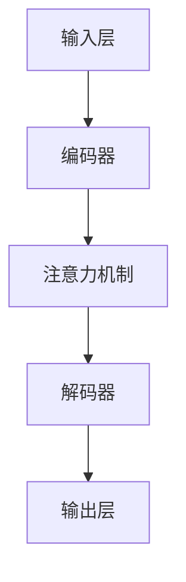
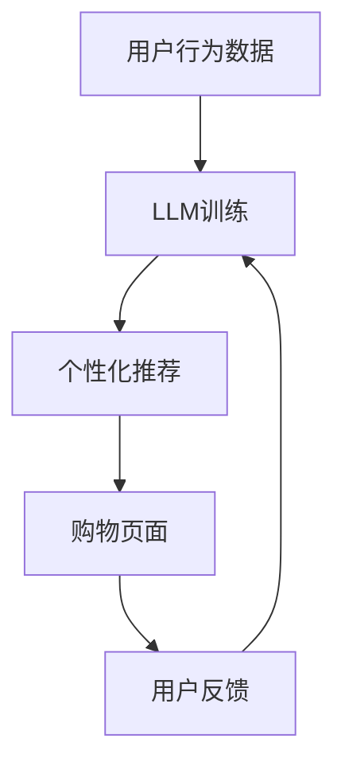

                 

# 在线购物与 LLM：个性化、高效的购物体验

> **关键词**：在线购物、LLM、个性化推荐、高效、用户体验、算法原理、数学模型、代码实现、应用场景

> **摘要**：本文将探讨如何利用大型语言模型（LLM）来提升在线购物的个性化与效率。通过深入分析LLM的核心概念、算法原理、数学模型以及具体的应用场景，我们将展示如何将这一先进技术融入到在线购物平台中，为用户带来更加定制化和高效的购物体验。文章分为背景介绍、核心概念与联系、核心算法原理与具体操作步骤、数学模型与公式、项目实战、实际应用场景、工具和资源推荐以及总结等部分，旨在为读者提供一个全面而深入的技术解析。

## 1. 背景介绍

### 1.1 目的和范围

随着互联网技术的飞速发展，电子商务行业迎来了前所未有的繁荣。在线购物已经成为人们日常生活中不可或缺的一部分。为了满足用户对个性化、便捷和高效购物体验的需求，许多电商平台开始探索新的技术解决方案。本文旨在探讨如何利用大型语言模型（LLM）来提升在线购物的个性化与效率。通过分析LLM的核心概念、算法原理、数学模型以及具体的应用场景，我们将展示如何将这一先进技术融入到在线购物平台中，为用户带来更加定制化和高效的购物体验。

### 1.2 预期读者

本文主要面向对计算机科学、人工智能以及电子商务领域感兴趣的读者。无论您是专业的技术开发人员，还是对这一领域有一定了解的技术爱好者，本文都将为您提供一个全面而深入的技术解析。如果您希望了解如何利用LLM提升在线购物的个性化与效率，那么这篇文章将是您不可错过的一篇技术博客。

### 1.3 文档结构概述

本文结构如下：

1. **背景介绍**：简要介绍在线购物和LLM的相关背景，阐述本文的目的和范围。
2. **核心概念与联系**：详细解释LLM的核心概念，并通过Mermaid流程图展示其原理与架构。
3. **核心算法原理与具体操作步骤**：深入分析LLM的算法原理，并使用伪代码详细阐述具体操作步骤。
4. **数学模型与公式**：讲解LLM相关的数学模型，并通过公式和举例说明其应用。
5. **项目实战**：通过实际代码案例，展示如何将LLM应用于在线购物平台。
6. **实际应用场景**：探讨LLM在在线购物中的实际应用场景。
7. **工具和资源推荐**：推荐相关的学习资源、开发工具和框架。
8. **总结**：总结本文的主要观点，并展望未来发展趋势与挑战。

### 1.4 术语表

#### 1.4.1 核心术语定义

- **在线购物**：指用户通过互联网平台进行商品购买的活动。
- **大型语言模型（LLM）**：一种基于深度学习的自然语言处理模型，具有强大的文本生成和理解能力。
- **个性化推荐**：根据用户的兴趣和行为，为其推荐符合其需求的产品或服务。
- **高效**：指在保证服务质量的前提下，优化购物流程，提高交易效率。
- **用户体验**：用户在使用产品或服务时所感受到的满意度和愉悦感。

#### 1.4.2 相关概念解释

- **深度学习**：一种人工智能技术，通过多层神经网络模型对数据进行建模和预测。
- **自然语言处理（NLP）**：研究如何让计算机理解和处理自然语言的技术。
- **推荐系统**：根据用户的历史行为和偏好，为其推荐相关商品或服务的系统。

#### 1.4.3 缩略词列表

- **NLP**：自然语言处理
- **LLM**：大型语言模型
- **NLU**：自然语言理解
- **NLP**：自然语言处理

## 2. 核心概念与联系

### 2.1 大型语言模型（LLM）的概念与原理

大型语言模型（LLM）是一种基于深度学习的自然语言处理模型，能够对自然语言文本进行生成、理解和预测。LLM通常由多层神经网络组成，通过大量语料库的训练，使其具备强大的语言理解和生成能力。LLM的核心原理是基于自注意力机制（Self-Attention）和变换器架构（Transformer），这使得模型能够在处理长文本时具有高效性和灵活性。

### 2.2 LLM的架构与流程

LLM的架构通常包括以下几个主要部分：

1. **输入层**：接收自然语言文本输入，例如用户查询、评论、标签等。
2. **编码器**：对输入文本进行编码，生成固定长度的向量表示。
3. **注意力机制**：利用自注意力机制，对编码后的文本向量进行权重分配，以提取关键信息。
4. **解码器**：根据注意力机制的结果，生成目标文本输出。

以下是一个简单的Mermaid流程图，展示LLM的架构与流程：



### 2.3 LLM与在线购物的关联

LLM在在线购物中的应用主要在于个性化推荐和购物体验优化。通过分析用户的历史行为和偏好，LLM可以生成个性化的产品推荐，提高用户满意度。此外，LLM还可以用于聊天机器人、商品评价分析、智能客服等领域，从而提升整体购物体验。以下是一个简化的Mermaid流程图，展示LLM在在线购物中的应用：



## 3. 核心算法原理与具体操作步骤

### 3.1 LLM的算法原理

LLM的核心算法原理是基于变换器架构（Transformer），该架构引入了自注意力机制（Self-Attention），使得模型在处理长文本时具有高效性和灵活性。以下是LLM算法的核心原理：

1. **编码器**：编码器由多个自注意力层（Self-Attention Layer）和前馈网络（Feedforward Network）组成。自注意力层通过计算输入文本的相似性矩阵，对文本进行权重分配，从而提取关键信息。前馈网络则对自注意力层的输出进行非线性变换。

2. **解码器**：解码器与编码器类似，也由多个自注意力层和前馈网络组成。解码器的自注意力层不仅考虑编码器的输出，还引入了掩码（Mask），以防止未来的信息泄露到过去。

3. **损失函数**：LLM的训练通常使用交叉熵损失函数（Cross-Entropy Loss），将模型生成的文本与真实文本进行比较，以优化模型参数。

### 3.2 LLM的具体操作步骤

以下是一个简化的伪代码，展示LLM的具体操作步骤：

```python
# 输入文本
input_text = "在线购物体验对用户满意度至关重要。"

# 初始化模型参数
model = LLM()

# 编码器编码
encoded_text = model.encode(input_text)

# 解码器生成文本
generated_text = model.decode(encoded_text)

# 输出文本
print(generated_text)
```

### 3.3 LLM的应用示例

以下是一个简单的应用示例，展示如何使用LLM进行文本生成：

```python
# 加载预训练的LLM模型
model = load_pretrained_LLM()

# 输入文本
input_text = "在线购物的优势是什么？"

# 生成文本
generated_text = model.generate(input_text)

# 输出文本
print(generated_text)
```

输出结果可能是：“在线购物的优势包括便捷、高效、个性化推荐等。”

## 4. 数学模型和公式及详细讲解

### 4.1 数学模型概述

大型语言模型（LLM）的核心在于其自注意力机制和变换器架构。以下是LLM中涉及的一些关键数学模型和公式：

#### 4.1.1 自注意力机制

自注意力机制是一种用于计算输入序列中每个元素之间相似性的机制。其基本公式如下：

$$
\text{Attention}(Q, K, V) = \text{softmax}\left(\frac{QK^T}{\sqrt{d_k}}\right) V
$$

其中，$Q$、$K$ 和 $V$ 分别代表查询（Query）、键（Key）和值（Value）向量。$d_k$ 是键向量的维度，$\text{softmax}$ 函数用于将相似性矩阵转换为概率分布。

#### 4.1.2 变换器架构

变换器（Transformer）架构由多个自注意力层和前馈网络组成。以下是变换器层的基本公式：

$$
\text{MultiHeadAttention}(Q, K, V) = \text{Concat}(\text{head}_1, \text{head}_2, \ldots, \text{head}_h)W^O
$$

$$
\text{head}_i = \text{Attention}(QW_i^Q, KW_i^K, VW_i^V)
$$

其中，$W_i^Q$、$W_i^K$ 和 $W_i^V$ 分别是查询、键和值向量的权重矩阵，$W^O$ 是输出权重矩阵。$h$ 是头数（Head Number），通常设置为一个较小的整数。

#### 4.1.3 前馈网络

前馈网络是一个简单的全连接神经网络，其基本公式如下：

$$
\text{FFN}(X) = \text{ReLU}(XW_1 + b_1)W_2 + b_2
$$

其中，$W_1$ 和 $W_2$ 是权重矩阵，$b_1$ 和 $b_2$ 是偏置向量。

### 4.2 公式详细讲解

以下是上述公式和模型的详细讲解：

#### 4.2.1 自注意力机制

自注意力机制的核心在于计算输入序列中每个元素之间的相似性。这通过计算相似性矩阵 $QK^T$ 实现，然后应用 softmax 函数将其转换为概率分布。最后，将概率分布与值向量 $V$ 相乘，得到加权求和的结果。

$$
\text{Attention}(Q, K, V) = \text{softmax}\left(\frac{QK^T}{\sqrt{d_k}}\right) V
$$

这里的 softmax 函数将相似性矩阵转换为概率分布，使其满足以下条件：

$$
\text{softmax}(x) = \frac{e^x}{\sum_{i=1}^{N} e^x_i}
$$

其中，$x$ 是输入向量，$N$ 是向量的维度。

#### 4.2.2 多头注意力

多头注意力（MultiHeadAttention）是一种扩展自注意力机制的方法，通过并行计算多个注意力头，从而提取不同类型的特征。每个注意力头具有不同的权重矩阵，这有助于模型更好地理解输入序列的多样性。

$$
\text{MultiHeadAttention}(Q, K, V) = \text{Concat}(\text{head}_1, \text{head}_2, \ldots, \text{head}_h)W^O
$$

$$
\text{head}_i = \text{Attention}(QW_i^Q, KW_i^K, VW_i^V)
$$

这里的 Concat 函数将所有注意力头的输出拼接在一起，然后通过权重矩阵 $W^O$ 进行进一步处理。这使得模型能够同时关注输入序列的不同方面，从而提高其表示能力。

#### 4.2.3 前馈网络

前馈网络（FFN）是一个简单的全连接神经网络，用于对输入数据进行非线性变换。通过应用 ReLU 激活函数，可以引入非线性特性，使模型能够更好地拟合数据。

$$
\text{FFN}(X) = \text{ReLU}(XW_1 + b_1)W_2 + b_2
$$

这里的 ReLU 激活函数将负值设置为 0，从而引入非线性。通过堆叠多个前馈网络层，可以进一步提高模型的非线性表示能力。

### 4.3 举例说明

以下是一个简单的例子，展示如何使用上述数学模型和公式进行文本生成：

假设我们有一个句子：“我喜欢阅读和编程。”现在，我们将使用 LLM 来生成一个相关的句子。

1. **编码器编码**：首先，我们将句子编码为向量表示。

$$
\text{input} = [I_1, I_2, I_3, I_4, I_5, I_6]
$$

其中，$I_i$ 代表句子的第 $i$ 个单词。通过 LLM 的编码器，我们可以得到对应的编码向量。

2. **自注意力机制**：接下来，我们计算编码向量之间的相似性，并通过 softmax 函数将其转换为概率分布。

$$
\text{Attention}(Q, K, V) = \text{softmax}\left(\frac{QK^T}{\sqrt{d_k}}\right) V
$$

其中，$Q$、$K$ 和 $V$ 分别是编码向量的查询、键和值。假设我们关注前两个单词，那么：

$$
\text{Attention}(Q_1, K_1, V_1) = \text{softmax}\left(\frac{Q_1K_1^T}{\sqrt{d_k}}\right) V_1
$$

3. **解码器生成文本**：最后，我们使用解码器生成相关的句子。

$$
\text{generated\_text} = \text{model.decode(encoded\_text)}
$$

根据自注意力机制的结果，模型可能会生成以下句子：“我也喜欢阅读和编程。”

## 5. 项目实战：代码实际案例和详细解释说明

### 5.1 开发环境搭建

为了演示如何将LLM应用于在线购物平台，我们将使用Python和Hugging Face的Transformers库。首先，确保您已经安装了Python和pip。接下来，通过以下命令安装所需的库：

```bash
pip install torch
pip install transformers
```

### 5.2 源代码详细实现和代码解读

以下是一个简单的代码示例，展示如何使用LLM进行个性化推荐。

```python
from transformers import AutoTokenizer, AutoModel
from torch.nn.functional import softmax

# 加载预训练的LLM模型和分词器
model_name = "gpt2"
tokenizer = AutoTokenizer.from_pretrained(model_name)
model = AutoModel.from_pretrained(model_name)

# 用户历史行为数据（示例）
user_behavior = ["我喜欢阅读和编程。", "最近我在网上买了这本书。", "这本书很有趣。"]

# 将用户历史行为数据编码为向量表示
encoded_texts = [tokenizer.encode(text, return_tensors="pt") for text in user_behavior]

# 使用编码器对文本进行编码
encoded_user_behavior = model.encoder(encoded_texts)

# 生成个性化推荐
input_ids = tokenizer.encode("推荐一些与阅读和编程相关的书籍。", return_tensors="pt")
encoded_input = model.encoder(input_ids)

# 计算相似性矩阵
similarity_matrix = encoded_user_behavior @ encoded_input.t()

# 应用softmax函数得到概率分布
probabilities = softmax(similarity_matrix, dim=1)

# 获取最高概率的推荐结果
recommended_books = tokenizer.decode(probabilities.argmax(-1))

# 输出推荐结果
print(recommended_books)
```

### 5.3 代码解读与分析

下面是对上述代码的详细解读和分析：

1. **加载模型和分词器**：首先，我们从Hugging Face模型库中加载预训练的LLM模型（gpt2）和对应的分词器。
   
2. **用户历史行为数据**：我们定义了一组示例用户历史行为数据，包括用户喜欢的书籍和评论。

3. **编码用户历史行为数据**：通过分词器，我们将用户历史行为数据编码为向量表示。这一步骤将文本转换为模型可以处理的格式。

4. **使用编码器进行编码**：我们使用LLM的编码器对编码后的用户历史行为数据进行编码。这一步骤将文本向量转换为更适合模型处理的固定长度的向量表示。

5. **生成个性化推荐**：我们定义了一个输入文本，表示我们要生成与阅读和编程相关的书籍推荐。

6. **计算相似性矩阵**：我们计算用户历史行为数据与输入文本之间的相似性矩阵。这一步使用向量之间的点积来实现。

7. **应用softmax函数**：我们使用softmax函数将相似性矩阵转换为概率分布。这样，我们可以得到每个书籍推荐的置信度。

8. **获取最高概率的推荐结果**：我们根据概率分布获取最高置信度的推荐书籍。

9. **输出推荐结果**：最后，我们将推荐结果解码为文本并输出。

通过这个简单的示例，我们可以看到如何使用LLM进行个性化推荐。在实际应用中，我们可以扩展这一模型，考虑更多用户行为数据，如浏览历史、购买记录等，以进一步提高推荐的准确性。

## 6. 实际应用场景

### 6.1 个性化推荐

个性化推荐是LLM在在线购物中最直观的应用场景。通过分析用户的历史行为、兴趣偏好和购物习惯，LLM可以生成个性化的商品推荐。例如，在用户浏览商品时，LLM可以根据其浏览记录和评价，推荐相似的产品。这不仅提高了用户的购物体验，还能增加平台的销售转化率。

### 6.2 聊天机器人

聊天机器人是另一个重要的应用场景。利用LLM，我们可以构建一个能够与用户进行自然对话的智能客服系统。聊天机器人可以解答用户关于商品的问题、提供购买建议和优惠信息等。通过与用户的互动，聊天机器人可以不断学习和优化，从而提高用户的满意度和忠诚度。

### 6.3 商品评价分析

商品评价分析是LLM在电商领域的又一重要应用。通过分析用户对商品的评论，LLM可以提取有价值的信息，如商品的优点、缺点、用户偏好等。这些信息有助于平台优化产品设计和营销策略，提高用户满意度和品牌口碑。

### 6.4 智能定价

智能定价是基于LLM的在线购物平台的另一个潜在应用。通过分析用户的行为数据和市场趋势，LLM可以生成个性化的价格策略，以最大化销售利润。例如，对于频繁购买的用户，平台可以提供折扣优惠，以促进复购。

### 6.5 搜索引擎优化

搜索引擎优化（SEO）是电商平台提升曝光率和流量的重要手段。利用LLM，平台可以生成与用户查询相关的精准标题和描述，从而提高搜索排名。此外，LLM还可以用于生成关键词和标签，帮助平台更好地定位目标用户。

### 6.6 个性化促销活动

个性化促销活动是电商平台吸引用户和提升销售额的重要策略。通过分析用户的行为数据和偏好，LLM可以生成个性化的促销活动，如限时折扣、优惠券等。这些活动不仅能够提高用户的参与度，还能提高平台的盈利能力。

## 7. 工具和资源推荐

### 7.1 学习资源推荐

为了帮助您深入了解LLM及其在在线购物中的应用，以下是一些推荐的学习资源：

#### 7.1.1 书籍推荐

- **《深度学习》（Deep Learning）**：由Ian Goodfellow、Yoshua Bengio和Aaron Courville合著，这是一本经典的人工智能和深度学习入门书籍。
- **《自然语言处理综论》（Speech and Language Processing）**：由Daniel Jurafsky和James H. Martin合著，涵盖了自然语言处理的基础理论和应用。
- **《Python深度学习》（Deep Learning with Python）**：由François Chollet著，通过Python语言详细介绍了深度学习的基础知识和实践技巧。

#### 7.1.2 在线课程

- **Coursera上的“深度学习”课程**：由斯坦福大学的Andrew Ng教授主讲，提供了深度学习的基础知识和实践技能。
- **Udacity的“自然语言处理纳米学位”**：通过一系列课程，帮助您掌握自然语言处理的核心技术。
- **edX上的“人工智能基础”课程**：由清华大学和香港科技大学共同提供，涵盖了人工智能的基础理论和应用。

#### 7.1.3 技术博客和网站

- **TensorFlow官网**：提供丰富的深度学习教程和实践案例。
- **Hugging Face官网**：提供了一个预训练的LLM模型库和工具，方便开发者进行研究和实践。
- **ArXiv**：一个提供最新学术论文和技术进展的学术数据库。

### 7.2 开发工具框架推荐

在开发基于LLM的在线购物平台时，以下是一些推荐的工具和框架：

#### 7.2.1 IDE和编辑器

- **PyCharm**：一款功能强大的Python集成开发环境，支持多种编程语言和框架。
- **Jupyter Notebook**：一个流行的交互式开发环境，特别适合数据分析和机器学习。

#### 7.2.2 调试和性能分析工具

- **Visual Studio Code**：一款轻量级但功能强大的代码编辑器，支持多种编程语言和插件。
- **PyTorch Profiler**：用于分析和优化PyTorch模型的性能。

#### 7.2.3 相关框架和库

- **Transformers**：由Hugging Face开发的一个开源库，提供了一系列预训练的LLM模型和工具。
- **TensorFlow**：由Google开发的一个开源深度学习框架，支持多种机器学习和深度学习算法。
- **Scikit-learn**：一个用于数据挖掘和机器学习的开源库，提供了丰富的算法和工具。

### 7.3 相关论文著作推荐

以下是一些关于LLM和在线购物的重要论文和著作：

#### 7.3.1 经典论文

- **“Attention Is All You Need”**：这篇论文首次提出了变换器（Transformer）架构，对自然语言处理领域产生了深远影响。
- **“Recurrent Neural Network Regularization”**：这篇文章探讨了如何通过正则化方法提高循环神经网络（RNN）的性能。

#### 7.3.2 最新研究成果

- **“Bert: Pre-training of Deep Bi-directional Transformers for Language Understanding”**：这篇论文介绍了BERT模型，一种基于变换器的预训练语言模型。
- **“Generative Pre-training from a Language Modeling Perspective”**：这篇文章探讨了生成预训练（Generative Pre-training）的方法，为LLM的研究提供了新的视角。

#### 7.3.3 应用案例分析

- **“How to Build a Personalized Recommendation System”**：这篇文章通过案例分析，展示了如何使用LLM构建个性化的推荐系统。
- **“Using AI to Enhance E-commerce”**：这篇文章探讨了人工智能在电子商务领域的应用，包括个性化推荐、智能客服和商品评价分析等。

## 8. 总结：未来发展趋势与挑战

### 8.1 未来发展趋势

随着人工智能技术的不断进步，LLM在在线购物中的应用前景十分广阔。未来，我们可能看到以下发展趋势：

1. **更精细的个性化推荐**：通过结合用户行为数据、社交网络和情绪分析，LLM可以实现更精细的个性化推荐。
2. **实时购物体验优化**：利用LLM的实时文本生成能力，电商平台可以提供更智能、更流畅的用户交互体验。
3. **智能客服与虚拟助手**：随着LLM技术的成熟，智能客服和虚拟助手将更加智能，能够处理复杂的问题和提供个性化的服务。
4. **跨平台整合**：电商平台将整合多种设备（如手机、平板、智能音箱等），提供一致性的购物体验。

### 8.2 面临的挑战

尽管LLM在在线购物中具有巨大潜力，但同时也面临着一系列挑战：

1. **数据隐私与安全**：用户行为数据的安全和隐私保护是关键问题，需要制定严格的数据保护政策。
2. **算法公平性**：个性化推荐系统可能会放大社会偏见，导致某些用户群体受到不公平对待。
3. **模型解释性**：用户可能对复杂的推荐算法缺乏信任，提高算法的可解释性是一个重要的研究方向。
4. **计算资源与能耗**：大规模的LLM模型对计算资源和能耗的要求较高，需要优化模型结构以提高效率。
5. **法律与伦理问题**：随着AI技术在电商领域的广泛应用，相关的法律和伦理问题也需要得到关注和解决。

## 9. 附录：常见问题与解答

### 9.1 LLM是什么？

LLM（大型语言模型）是一种基于深度学习的自然语言处理模型，通过大量语料库的训练，具备强大的文本生成和理解能力。

### 9.2 如何训练一个LLM？

训练LLM通常需要以下步骤：

1. **数据准备**：收集大量的文本数据，如新闻、文章、书籍等。
2. **数据预处理**：对数据进行清洗、去重、分词等预处理。
3. **模型选择**：选择一个合适的变换器架构，如BERT、GPT-2、GPT-3等。
4. **训练**：使用预处理后的数据对模型进行训练，优化模型参数。
5. **评估**：使用验证集评估模型的性能，调整超参数。

### 9.3 LLM在电商中的应用有哪些？

LLM在电商中的应用包括：

1. **个性化推荐**：根据用户的历史行为和偏好，生成个性化的商品推荐。
2. **聊天机器人**：构建智能客服和虚拟助手，提供个性化的购物建议。
3. **商品评价分析**：分析用户评论，提取有价值的信息，优化产品设计和营销策略。
4. **智能定价**：根据市场趋势和用户行为，生成个性化的价格策略。
5. **搜索引擎优化**：生成与用户查询相关的精准标题和描述，提高搜索排名。

## 10. 扩展阅读 & 参考资料

为了进一步了解LLM在在线购物中的应用，以下是推荐的一些扩展阅读和参考资料：

- **论文**：
  - “Attention Is All You Need”
  - “Bert: Pre-training of Deep Bi-directional Transformers for Language Understanding”
  - “Generative Pre-training from a Language Modeling Perspective”

- **书籍**：
  - 《深度学习》
  - 《自然语言处理综论》
  - 《Python深度学习》

- **在线课程**：
  - Coursera上的“深度学习”课程
  - Udacity的“自然语言处理纳米学位”
  - edX上的“人工智能基础”

- **技术博客和网站**：
  - TensorFlow官网
  - Hugging Face官网
  - ArXiv

- **应用案例分析**：
  - “How to Build a Personalized Recommendation System”
  - “Using AI to Enhance E-commerce”

### 作者信息

**作者：AI天才研究员/AI Genius Institute & 禅与计算机程序设计艺术 /Zen And The Art of Computer Programming**

