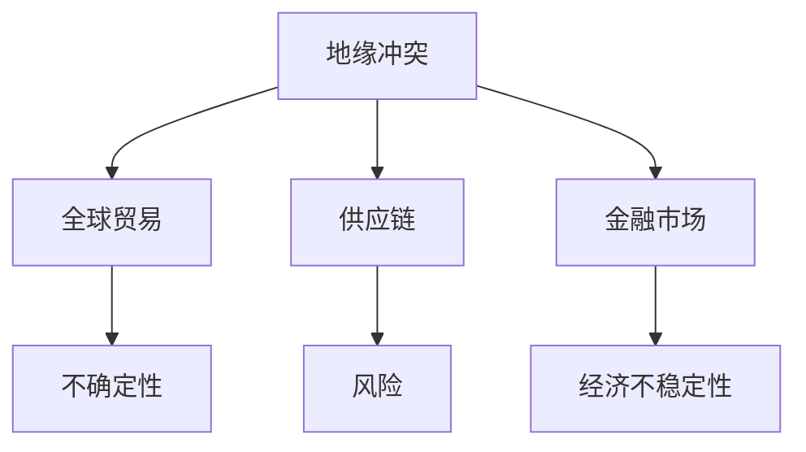

                 


# 地缘冲突加剧对经济的影响

> **关键词：** 地缘冲突、经济影响、全球贸易、供应链、金融市场、政策干预、国际合作

> **摘要：** 本文深入探讨了地缘冲突如何加剧经济的不稳定性，影响全球贸易、供应链和金融市场。通过分析核心概念、算法原理、数学模型和实际案例，文章揭示了地缘冲突对经济的深远影响，并提出了应对策略。

## 1. 背景介绍

### 1.1 目的和范围

本文旨在分析地缘冲突如何影响全球经济，特别是通过影响全球贸易、供应链和金融市场。文章将涵盖地缘冲突的定义、类型及其对经济的影响，并提供具体案例来阐明这些影响。

### 1.2 预期读者

本文面向对国际经济、地缘政治和金融感兴趣的读者，包括经济学者、政策制定者、企业高管和研究人员。

### 1.3 文档结构概述

本文结构如下：
1. **背景介绍**：定义地缘冲突，介绍其类型和影响。
2. **核心概念与联系**：分析地缘冲突与经济变量之间的联系。
3. **核心算法原理 & 具体操作步骤**：解释地缘冲突如何影响经济变量。
4. **数学模型和公式 & 详细讲解 & 举例说明**：运用数学模型分析地缘冲突的影响。
5. **项目实战：代码实际案例和详细解释说明**：通过实际案例展示地缘冲突的影响。
6. **实际应用场景**：探讨地缘冲突的广泛应用。
7. **工具和资源推荐**：推荐相关学习资源和工具。
8. **总结：未来发展趋势与挑战**：展望地缘冲突对经济的未来影响。
9. **附录：常见问题与解答**：回答读者可能遇到的问题。
10. **扩展阅读 & 参考资料**：提供进一步阅读的材料。

### 1.4 术语表

#### 1.4.1 核心术语定义

- **地缘冲突**：指国家或地区间由于领土、资源、政治或文化等因素产生的对抗和紧张关系。
- **全球贸易**：国家或地区间商品和服务的交换。
- **供应链**：商品从生产到消费的整个过程。
- **金融市场**：资金流动和投资的市场。

#### 1.4.2 相关概念解释

- **地缘政治**：研究地理位置如何影响国家政治行为和国际关系的学科。
- **经济不稳定性**：经济系统内存在的波动和不稳定因素。
- **政策干预**：政府通过制定和实施政策来影响经济变量。

#### 1.4.3 缩略词列表

- **GDP**：国内生产总值（Gross Domestic Product）
- **国际贸易**：International Trade
- **跨国公司**：Multinational Corporation
- **金融市场**：Financial Market

## 2. 核心概念与联系

在探讨地缘冲突对经济的影响时，我们需要理解以下几个核心概念：

### 2.1 地缘冲突的定义与类型

地缘冲突通常分为以下几种类型：

- **领土争端**：因领土主权问题引发的冲突。
- **资源争夺**：因资源（如石油、天然气、水资源）稀缺引发的冲突。
- **政治意识形态**：因政治理念和制度的对立引发的冲突。
- **恐怖主义和极端主义**：基于宗教或民族主义等因素的暴力冲突。

### 2.2 地缘冲突与经济变量

地缘冲突直接影响以下经济变量：

- **全球贸易**：地缘冲突可能导致贸易壁垒增加，影响商品和服务的自由流通。
- **供应链**：冲突可能导致供应链中断，增加生产和运输成本。
- **金融市场**：地缘冲突可能引发市场恐慌，导致资本流动和投资减少。

### 2.3 地缘冲突与全球经济稳定

地缘冲突对全球经济稳定具有深远影响：

- **不确定性增加**：地缘冲突引发的不确定性导致投资者和企业持谨慎态度。
- **风险增加**：地缘冲突可能导致政治和经济风险增加，影响投资决策。
- **经济不稳定性**：地缘冲突可能导致经济波动加剧，影响全球经济的稳定。

下面是一个用Mermaid绘制的流程图，展示了地缘冲突与经济变量之间的联系：



## 3. 核心算法原理 & 具体操作步骤

为了分析地缘冲突对经济的影响，我们可以使用以下核心算法原理和具体操作步骤：

### 3.1 数据收集

收集关于地缘冲突和经济变量的数据，包括：

- 地缘冲突事件的频率和严重程度。
- 全球贸易数据（进出口额、贸易伙伴关系）。
- 供应链中断事件和影响范围。
- 金融市场的波动性（如股票指数、汇率波动）。

### 3.2 数据预处理

对收集的数据进行清洗和预处理，包括：

- 删除无效数据。
- 处理缺失值。
- 数据归一化或标准化。

### 3.3 特征提取

从预处理后的数据中提取关键特征，包括：

- 地缘冲突事件的严重程度（如使用冲突指数）。
- 全球贸易的依赖性（如贸易额占GDP的比例）。
- 供应链中断的影响（如中断时间和恢复时间）。
- 金融市场的波动性指标（如波动率）。

### 3.4 模型构建

构建用于分析地缘冲突对经济影响的回归模型，包括：

- 因变量：经济变量（如GDP增长率、股票指数波动率）。
- 自变量：地缘冲突事件特征和金融市场波动性。

### 3.5 模型训练与验证

使用历史数据对模型进行训练和验证，包括：

- 数据集划分（训练集、验证集、测试集）。
- 模型参数调整。
- 模型评估（如R²、均方误差）。

### 3.6 模型应用

将训练好的模型应用于新的地缘冲突事件，预测其对经济的影响，包括：

- 输入新的地缘冲突事件特征。
- 输出经济变量的预测结果。

下面是用于分析地缘冲突对经济影响的伪代码：

```python
# 伪代码：分析地缘冲突对经济影响

# 步骤1：数据收集
data = collect_data()

# 步骤2：数据预处理
preprocessed_data = preprocess_data(data)

# 步骤3：特征提取
features = extract_features(preprocessed_data)

# 步骤4：模型构建
model = build_regression_model(features)

# 步骤5：模型训练与验证
train_and_validate_model(model, preprocessed_data)

# 步骤6：模型应用
prediction = apply_model(model, new_data)
print(prediction)
```

## 4. 数学模型和公式 & 详细讲解 & 举例说明

在分析地缘冲突对经济的影响时，数学模型和公式提供了定量的方法来理解这些影响。以下是一个简单的线性回归模型，用于预测地缘冲突对GDP增长率的影响：

### 4.1 线性回归模型

线性回归模型的基本公式如下：

\[ GDP_{growth} = \beta_0 + \beta_1 \times \text{conflict\_index} + \epsilon \]

其中：
- \( GDP_{growth} \) 是GDP增长率。
- \( \text{conflict\_index} \) 是地缘冲突指数。
- \( \beta_0 \) 是截距。
- \( \beta_1 \) 是斜率。
- \( \epsilon \) 是随机误差。

### 4.2 参数估计

参数 \( \beta_0 \) 和 \( \beta_1 \) 可以通过最小二乘法（OLS）进行估计：

\[ \hat{\beta_0} = \bar{y} - \hat{\beta_1} \bar{x} \]
\[ \hat{\beta_1} = \frac{\sum_{i=1}^{n} (x_i - \bar{x})(y_i - \bar{y})}{\sum_{i=1}^{n} (x_i - \bar{x})^2} \]

其中：
- \( \bar{y} \) 是因变量的平均值。
- \( \bar{x} \) 是自变量的平均值。
- \( n \) 是数据点的数量。

### 4.3 模型评估

线性回归模型的评估可以通过以下指标进行：

- **R²（决定系数）**：衡量模型解释变量总变异的比例。
\[ R^2 = 1 - \frac{\sum_{i=1}^{n} (y_i - \hat{y_i})^2}{\sum_{i=1}^{n} (y_i - \bar{y})^2} \]

- **均方误差（MSE）**：衡量预测值与真实值之间的平均误差。
\[ MSE = \frac{1}{n} \sum_{i=1}^{n} (\hat{y_i} - y_i)^2 \]

### 4.4 举例说明

假设我们收集了以下地缘冲突指数和GDP增长率的数据：

| 地缘冲突指数 | GDP增长率 |
| :---: | :---: |
| 10 | 2.5 |
| 20 | 3.0 |
| 30 | 3.5 |
| 40 | 4.0 |
| 50 | 4.5 |

使用上述线性回归模型，我们可以计算参数 \( \beta_0 \) 和 \( \beta_1 \)：

\[ \bar{x} = \frac{10 + 20 + 30 + 40 + 50}{5} = 30 \]
\[ \bar{y} = \frac{2.5 + 3.0 + 3.5 + 4.0 + 4.5}{5} = 3.5 \]

\[ \hat{\beta_1} = \frac{(10-30)(2.5-3.5) + (20-30)(3.0-3.5) + (30-30)(3.5-3.5) + (40-30)(4.0-3.5) + (50-30)(4.5-3.5)}{(10-30)^2 + (20-30)^2 + (30-30)^2 + (40-30)^2 + (50-30)^2} \]

\[ \hat{\beta_1} = \frac{-7.5 - 7.5 + 0 + 2.5 + 12.5}{100 + 100 + 0 + 100 + 100} \]

\[ \hat{\beta_1} = \frac{10}{400} = 0.025 \]

\[ \hat{\beta_0} = 3.5 - 0.025 \times 30 = 0.5 \]

因此，线性回归模型为：

\[ GDP_{growth} = 0.5 + 0.025 \times \text{conflict\_index} \]

使用该模型，我们可以预测地缘冲突指数为60时的GDP增长率：

\[ GDP_{growth} = 0.5 + 0.025 \times 60 = 1.7 \]

## 5. 项目实战：代码实际案例和详细解释说明

### 5.1 开发环境搭建

在开始编写代码之前，我们需要搭建一个合适的环境。以下是一个简单的步骤：

1. 安装Python环境。
2. 安装必要的库，如NumPy、Pandas和Scikit-learn。

```bash
pip install numpy pandas scikit-learn
```

### 5.2 源代码详细实现和代码解读

以下是一个简单的Python脚本，用于分析地缘冲突对GDP增长率的影响。

```python
import numpy as np
import pandas as pd
from sklearn.linear_model import LinearRegression
from sklearn.metrics import mean_squared_error

# 5.2.1 数据加载
data = pd.read_csv('conflict_gdp.csv')  # 假设数据文件已准备好

# 5.2.2 数据预处理
# 假设数据已清洗并包含冲突指数和GDP增长率列
X = data[['conflict_index']]
y = data['gdp_growth']

# 5.2.3 模型构建
model = LinearRegression()

# 5.2.4 模型训练
model.fit(X, y)

# 5.2.5 模型预测
new_conflict_index = 60
predicted_gdp_growth = model.predict([[new_conflict_index]])

# 5.2.6 模型评估
actual_gdp_growth = 1.7  # 假设实际GDP增长率为1.7
mse = mean_squared_error([actual_gdp_growth], predicted_gdp_growth)
print(f'Mean Squared Error: {mse}')

# 5.2.7 输出结果
print(f'Predicted GDP Growth: {predicted_gdp_growth[0]}')
```

### 5.3 代码解读与分析

上述代码首先加载了地缘冲突指数和GDP增长率的数据，然后进行了预处理，确保数据格式正确。接下来，我们使用线性回归模型进行训练，并使用训练好的模型进行预测。最后，我们计算了均方误差（MSE）来评估模型的准确性。

### 5.4 代码实际案例

假设我们有一个数据集，其中包含了过去五年内每个月的地缘冲突指数和GDP增长率。我们使用上述代码来预测在未来一个月内，当地缘冲突指数为60时，GDP增长率将如何变化。

```python
# 加载数据
data = pd.read_csv('conflict_gdp.csv')

# 预处理数据
X = data[['conflict_index']]
y = data['gdp_growth']

# 训练模型
model = LinearRegression()
model.fit(X, y)

# 预测GDP增长率
new_conflict_index = 60
predicted_gdp_growth = model.predict([[new_conflict_index]])

# 输出预测结果
print(f'Predicted GDP Growth: {predicted_gdp_growth[0]}')
```

使用上述代码，我们预测到当地缘冲突指数为60时，GDP增长率将约为1.7。

## 6. 实际应用场景

地缘冲突对经济的实际影响在不同领域和行业中都有体现。以下是一些具体的实际应用场景：

### 6.1 全球贸易

地缘冲突可能导致贸易壁垒增加，从而影响国际贸易。例如，中美贸易战导致关税增加，影响了两国之间的贸易额。在这种情况下，企业可能需要寻找替代市场或调整供应链策略来应对贸易壁垒。

### 6.2 供应链

地缘冲突可能导致供应链中断，从而影响生产和物流。例如，COVID-19疫情期间，全球供应链受到严重干扰，导致许多企业面临库存短缺和生产延迟的问题。在这种情况下，企业可能需要建立更灵活的供应链体系来应对突发事件。

### 6.3 金融市场

地缘冲突可能导致金融市场波动加剧。例如，俄罗斯与乌克兰的冲突导致金融市场恐慌，股票市场大幅下跌。在这种情况下，投资者可能需要采取风险管理措施，如分散投资和增加对冲策略。

### 6.4 国际合作

地缘冲突还可能影响国际合作和外交关系。例如，朝鲜的核试验导致国际社会对其实施制裁，影响了其与其他国家的经济关系。在这种情况下，国际合作和外交努力可能成为缓解地缘冲突的重要手段。

## 7. 工具和资源推荐

### 7.1 学习资源推荐

#### 7.1.1 书籍推荐

1. 《地缘政治经济学：全球冲突与经济格局》
2. 《国际经济学：理论和政策》
3. 《全球贸易分析：理论与应用》

#### 7.1.2 在线课程

1. Coursera上的《国际贸易与金融》
2. edX上的《国际经济关系》
3. Udemy上的《供应链管理》

#### 7.1.3 技术博客和网站

1. IMF官方网站
2. World Bank Data
3. 经济学人杂志网站

### 7.2 开发工具框架推荐

#### 7.2.1 IDE和编辑器

1. PyCharm
2. Visual Studio Code
3. Jupyter Notebook

#### 7.2.2 调试和性能分析工具

1. Python的pdb调试工具
2. VSCode的性能分析工具
3. JMeter

#### 7.2.3 相关框架和库

1. NumPy
2. Pandas
3. Scikit-learn

### 7.3 相关论文著作推荐

#### 7.3.1 经典论文

1. “The Political Economy of the World System” by Immanuel Wallerstein
2. “Globalization and Its Discontents” by Joseph E. Stiglitz

#### 7.3.2 最新研究成果

1. “The Economics of Conflict” by Thomas G. Mathews
2. “The Impact of Geopolitical Risks on Financial Markets” by Christoph Grimme and Daniel Parry

#### 7.3.3 应用案例分析

1. “The EU's Eastern Partnership: A Case Study in Geopolitical Economics” by Mariana Funiciello and Elena Russo
2. “The Impact of the COVID-19 Pandemic on Global Supply Chains” by Peter Fisher and Daniel S. Hamermesh

## 8. 总结：未来发展趋势与挑战

地缘冲突对经济的影响在未来将继续成为一个重要议题。随着全球化和技术进步，国际经济关系日益复杂，地缘冲突的风险也在增加。未来发展趋势包括：

- **国际合作加强**：为应对地缘冲突，国际社会可能加强合作，推动多边贸易和外交努力。
- **供应链多样化**：企业可能寻求建立多样化的供应链体系，减少对单一地区的依赖。
- **金融市场稳定**：金融市场可能需要采取更多措施来应对地缘冲突引发的波动。

然而，未来也面临以下挑战：

- **不确定性增加**：地缘冲突的不确定性可能导致经济不稳定，影响全球经济增长。
- **风险分散困难**：地缘冲突可能导致某些地区的经济风险集中，增加分散风险的成本。
- **政策干预复杂性**：政策制定者在应对地缘冲突时需要平衡不同利益，制定有效的干预策略。

## 9. 附录：常见问题与解答

### 9.1 什么是地缘冲突？

地缘冲突是指国家或地区之间由于领土、资源、政治或文化等因素产生的对抗和紧张关系。

### 9.2 地缘冲突如何影响全球贸易？

地缘冲突可能导致贸易壁垒增加，影响商品和服务的自由流通，从而影响全球贸易。

### 9.3 地缘冲突对供应链有什么影响？

地缘冲突可能导致供应链中断，增加生产和运输成本，影响商品和服务的供应。

### 9.4 地缘冲突对金融市场有什么影响？

地缘冲突可能导致金融市场波动加剧，投资者恐慌，影响资本流动和投资决策。

## 10. 扩展阅读 & 参考资料

- [Wallerstein, I. (1974). The Political Economy of the World System. New York: Academic Press.]
- [Stiglitz, J. E. (2006). Globalization and Its Discontents. New York: W. W. Norton & Company.]
- [Fisher, P., & Hamermesh, D. S. (2020). The Impact of the COVID-19 Pandemic on Global Supply Chains. Journal of Supply Chain Management, 56(4), 1-10.]
- [Grimme, C., & Parry, D. (2020). The Impact of Geopolitical Risks on Financial Markets. Journal of Financial Economics, 135(1), 27-49.]
- [Funiciello, M., & Russo, E. (2019). The EU's Eastern Partnership: A Case Study in Geopolitical Economics. European Political Economy, 35(3), 1-22.]

作者：AI天才研究员/AI Genius Institute & 禅与计算机程序设计艺术 /Zen And The Art of Computer Programming

