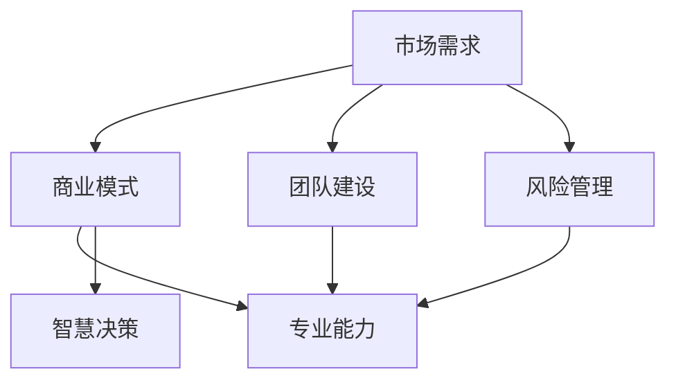

                 

# 不懈坚持，以专业能力和智慧决策应对创业挑战

> **关键词**：创业、挑战、专业能力、智慧决策、可持续发展
> 
> **摘要**：本文将探讨在创业过程中如何利用专业能力和智慧决策来应对各种挑战，实现企业的可持续发展。通过深入分析创业的背景、核心概念、算法原理，以及实际项目实战，本文为创业者和从业者提供了实用且具有指导意义的方法和策略。

## 1. 背景介绍

### 1.1 目的和范围

创业之路充满挑战，不仅需要创业者具备卓越的专业能力，还需具备智慧决策的能力。本文旨在为创业者提供一种系统性的思考方式，帮助他们在面对挑战时，能够有效地运用专业能力和智慧决策，从而实现企业的可持续发展。

本文主要涵盖以下内容：

1. **核心概念与联系**：介绍创业的核心概念和相互联系。
2. **核心算法原理 & 具体操作步骤**：讲解创业者如何运用专业能力解决实际问题的方法。
3. **数学模型和公式 & 详细讲解 & 举例说明**：探讨创业过程中的数学模型和公式。
4. **项目实战：代码实际案例和详细解释说明**：通过实战案例展示创业实践中的具体操作。
5. **实际应用场景**：分析创业在不同领域的应用场景。
6. **工具和资源推荐**：为创业者提供实用的学习资源和开发工具。
7. **总结：未来发展趋势与挑战**：展望创业的未来趋势和面临的挑战。
8. **附录：常见问题与解答**：回答创业过程中常见的疑问。
9. **扩展阅读 & 参考资料**：提供相关领域的深入阅读资料。

### 1.2 预期读者

本文的预期读者主要是以下几类人群：

1. **创业者**：希望了解如何在创业过程中运用专业能力和智慧决策的创业者。
2. **从业者**：对创业感兴趣的技术人员和管理者，希望提升自身专业素养。
3. **学者和研究人员**：关注创业领域，希望深入了解创业过程中的关键问题和解决策略。

### 1.3 文档结构概述

本文按照以下结构进行阐述：

1. **背景介绍**：介绍文章的目的、预期读者和文档结构。
2. **核心概念与联系**：阐述创业的核心概念及其相互联系。
3. **核心算法原理 & 具体操作步骤**：讲解创业者如何运用专业能力解决问题。
4. **数学模型和公式 & 详细讲解 & 举例说明**：探讨创业过程中的数学模型和公式。
5. **项目实战：代码实际案例和详细解释说明**：展示创业实战案例。
6. **实际应用场景**：分析创业在不同领域的应用。
7. **工具和资源推荐**：提供实用的学习资源和开发工具。
8. **总结：未来发展趋势与挑战**：展望创业的未来。
9. **附录：常见问题与解答**：回答常见疑问。
10. **扩展阅读 & 参考资料**：提供深入阅读资料。

### 1.4 术语表

#### 1.4.1 核心术语定义

1. **创业**：指创办一个新的企业，通过创新的产品或服务满足市场需求。
2. **专业能力**：指创业者具备的专业知识和技能，能够解决实际问题。
3. **智慧决策**：指在复杂环境中，根据数据和逻辑进行分析和判断，做出最优决策。
4. **可持续发展**：指企业在经济、社会和环境三个方面实现长期发展。

#### 1.4.2 相关概念解释

1. **市场需求**：指消费者对某种产品或服务的需求程度。
2. **商业模式**：指企业如何创造、传递和获取价值。
3. **风险评估**：指对创业过程中可能面临的风险进行评估和预测。

#### 1.4.3 缩略词列表

- **AI**：人工智能
- **ML**：机器学习
- **DL**：深度学习
- **SaaS**：软件即服务

## 2. 核心概念与联系

为了更好地理解创业过程中所需的专业能力和智慧决策，我们首先需要明确几个核心概念，并探讨它们之间的联系。

### 2.1 创业的核心概念

创业的核心概念主要包括：

1. **市场需求**：市场需求是创业的出发点和归宿。创业者需要了解消费者的需求，开发出能够满足这些需求的产品或服务。
2. **商业模式**：商业模式是企业如何创造、传递和获取价值的方式。一个成功的商业模式能够帮助企业实现盈利和可持续发展。
3. **团队建设**：团队是企业成功的基石。创业者需要组建一支专业、高效、和谐的团队，共同实现创业目标。
4. **风险管理**：创业过程中，风险是不可避免的。创业者需要识别、评估和应对各种风险，确保企业稳健发展。

### 2.2 专业能力与智慧决策的关系

专业能力和智慧决策是创业过程中不可或缺的两个方面。专业能力是创业者解决实际问题的工具，而智慧决策则是基于数据和逻辑的分析与判断。

1. **专业能力**：专业能力包括技术能力、管理能力和创新能力。技术能力是创业者解决技术问题的能力；管理能力是创业者组织、协调和领导团队的能力；创新能力是创业者发现市场机会、开发新产品或服务的能力。
   
2. **智慧决策**：智慧决策是创业者根据市场需求、商业模式、团队建设等因素，结合专业能力进行综合分析，做出最优决策的过程。智慧决策要求创业者具备良好的逻辑思维、数据分析能力和判断力。

### 2.3 核心概念的联系

市场需求、商业模式、团队建设、风险管理、专业能力和智慧决策这六个核心概念相互联系，共同构成创业的核心框架。

1. **市场需求**：市场需求是创业的起点，也是创业的归宿。创业者需要了解市场需求，开发出符合市场趋势的产品或服务，实现商业模式的成功。
   
2. **商业模式**：商业模式是企业创造、传递和获取价值的方式。一个成功的商业模式能够帮助企业实现盈利和可持续发展，为专业能力和智慧决策提供支持。

3. **团队建设**：团队是企业成功的基石。创业者需要组建一支专业、高效、和谐的团队，共同实现创业目标。团队建设有助于发挥专业能力和智慧决策的优势。

4. **风险管理**：创业过程中，风险是不可避免的。创业者需要识别、评估和应对各种风险，确保企业稳健发展。风险管理有助于降低创业风险，为专业能力和智慧决策提供保障。

5. **专业能力**：专业能力是创业者解决实际问题的工具。创业者需要具备良好的专业能力，才能在创业过程中应对各种挑战，实现企业的可持续发展。

6. **智慧决策**：智慧决策是创业者根据市场需求、商业模式、团队建设、风险管理等因素，结合专业能力进行综合分析，做出最优决策的过程。智慧决策有助于提高创业的成功率。

为了更直观地展示这些核心概念之间的联系，我们可以使用Mermaid流程图进行描述。



## 3. 核心算法原理 & 具体操作步骤

在创业过程中，创业者需要运用专业能力解决各种问题，而这些问题的解决通常需要运用一定的算法原理。本节将介绍几个核心算法原理，并详细阐述具体操作步骤。

### 3.1 算法原理介绍

1. **数据分析算法**：数据分析算法用于对大量数据进行分析，发现规律和趋势。常见的算法包括聚类、分类、回归等。
   
2. **机器学习算法**：机器学习算法用于从数据中学习规律，预测未来趋势。常见的算法包括线性回归、决策树、支持向量机等。
   
3. **深度学习算法**：深度学习算法是机器学习的一种，通过多层神经网络模拟人类大脑的学习过程。常见的算法包括卷积神经网络（CNN）、循环神经网络（RNN）、生成对抗网络（GAN）等。

4. **项目管理算法**：项目管理算法用于优化项目进度和资源分配。常见的算法包括关键路径法（CPM）、项目评估与审查技术（PERT）等。

### 3.2 具体操作步骤

1. **数据分析算法应用步骤**：

   - **数据收集**：收集相关数据，如市场数据、用户反馈、竞品分析等。
   - **数据清洗**：清洗数据，去除无效和错误的数据。
   - **数据预处理**：对数据进行归一化、标准化等预处理。
   - **模型选择**：根据问题特点选择合适的算法模型，如聚类、分类、回归等。
   - **模型训练**：使用训练数据对模型进行训练。
   - **模型评估**：使用测试数据对模型进行评估，调整参数。
   - **模型应用**：将模型应用到实际问题中，如预测市场需求、优化库存管理等。

2. **机器学习算法应用步骤**：

   - **数据收集**：收集相关数据，如用户行为数据、交易数据等。
   - **数据清洗**：清洗数据，去除无效和错误的数据。
   - **数据预处理**：对数据进行归一化、标准化等预处理。
   - **特征选择**：选择对问题有重要影响的数据特征。
   - **模型选择**：根据问题特点选择合适的算法模型，如线性回归、决策树、支持向量机等。
   - **模型训练**：使用训练数据对模型进行训练。
   - **模型评估**：使用测试数据对模型进行评估，调整参数。
   - **模型应用**：将模型应用到实际问题中，如预测用户需求、优化推荐系统等。

3. **深度学习算法应用步骤**：

   - **数据收集**：收集相关数据，如图像、语音、文本等。
   - **数据清洗**：清洗数据，去除无效和错误的数据。
   - **数据预处理**：对数据进行归一化、标准化等预处理。
   - **特征提取**：提取数据中的特征，如图像中的边缘、纹理等。
   - **模型选择**：根据问题特点选择合适的算法模型，如卷积神经网络（CNN）、循环神经网络（RNN）、生成对抗网络（GAN）等。
   - **模型训练**：使用训练数据对模型进行训练。
   - **模型评估**：使用测试数据对模型进行评估，调整参数。
   - **模型应用**：将模型应用到实际问题中，如图像识别、语音合成、自然语言处理等。

4. **项目管理算法应用步骤**：

   - **项目规划**：确定项目目标、任务和时间安排。
   - **任务分解**：将项目任务分解为更小、更具体的子任务。
   - **资源分配**：根据任务需求和资源情况，合理分配资源。
   - **进度监控**：实时监控项目进度，确保任务按计划进行。
   - **风险评估**：识别项目风险，制定应对措施。
   - **项目评审**：定期对项目进行评审，确保项目质量。

### 3.3 伪代码示例

下面是一个使用机器学习算法进行用户需求预测的伪代码示例。

```python
# 数据收集
data = load_data()

# 数据清洗
cleaned_data = clean_data(data)

# 数据预处理
preprocessed_data = preprocess_data(cleaned_data)

# 特征选择
selected_features = select_features(preprocessed_data)

# 模型选择
model = select_model()

# 模型训练
model.train(selected_features)

# 模型评估
evaluation_results = model.evaluate(test_data)

# 调整参数
model.adjust_parameters(evaluation_results)

# 模型应用
predictions = model.predict(new_data)
```

通过以上算法原理和操作步骤的介绍，创业者可以更好地运用专业能力解决实际问题，提高创业成功率。

## 4. 数学模型和公式 & 详细讲解 & 举例说明

在创业过程中，数学模型和公式起着至关重要的作用。它们可以帮助创业者更好地理解市场规律、优化资源分配、预测未来趋势等。本节将介绍几个常用的数学模型和公式，并详细讲解其应用场景和具体步骤。

### 4.1 模型介绍

1. **线性回归模型**：线性回归模型是一种用于预测连续值的数学模型，其公式为：

   $$ Y = \beta_0 + \beta_1 \cdot X + \epsilon $$

   其中，\( Y \) 是预测值，\( X \) 是自变量，\( \beta_0 \) 和 \( \beta_1 \) 是模型参数，\( \epsilon \) 是误差项。

2. **逻辑回归模型**：逻辑回归模型是一种用于预测二分类结果的数学模型，其公式为：

   $$ P(Y=1) = \frac{1}{1 + e^{-(\beta_0 + \beta_1 \cdot X)}} $$

   其中，\( Y \) 是预测值，\( X \) 是自变量，\( \beta_0 \) 和 \( \beta_1 \) 是模型参数。

3. **决策树模型**：决策树模型是一种用于分类和回归的树形结构模型，其公式为：

   $$ T(X) = \sum_{i=1}^{n} \beta_i \cdot X_i $$

   其中，\( T(X) \) 是预测值，\( X_i \) 是特征值，\( \beta_i \) 是模型参数。

4. **支持向量机模型**：支持向量机模型是一种用于分类和回归的线性模型，其公式为：

   $$ w \cdot x + b = 0 $$

   其中，\( w \) 是模型参数，\( x \) 是特征向量，\( b \) 是偏置项。

### 4.2 应用场景和步骤

1. **线性回归模型应用场景和步骤**：

   - **应用场景**：用于预测销售额、用户增长等连续值。
   - **步骤**：
     1. 数据收集：收集历史数据，如销售额、用户数量等。
     2. 数据清洗：去除无效和错误的数据。
     3. 数据预处理：对数据进行归一化、标准化等预处理。
     4. 模型训练：使用训练数据训练线性回归模型。
     5. 模型评估：使用测试数据评估模型效果。
     6. 模型应用：将模型应用于实际问题，如预测未来销售额。

2. **逻辑回归模型应用场景和步骤**：

   - **应用场景**：用于预测用户购买、点击等二分类结果。
   - **步骤**：
     1. 数据收集：收集历史数据，如用户行为数据、购买记录等。
     2. 数据清洗：去除无效和错误的数据。
     3. 数据预处理：对数据进行归一化、标准化等预处理。
     4. 模型训练：使用训练数据训练逻辑回归模型。
     5. 模型评估：使用测试数据评估模型效果。
     6. 模型应用：将模型应用于实际问题，如预测用户购买行为。

3. **决策树模型应用场景和步骤**：

   - **应用场景**：用于分类和回归问题，如用户群体划分、信用评分等。
   - **步骤**：
     1. 数据收集：收集历史数据，如用户特征、信用记录等。
     2. 数据清洗：去除无效和错误的数据。
     3. 数据预处理：对数据进行归一化、标准化等预处理。
     4. 模型训练：使用训练数据训练决策树模型。
     5. 模型评估：使用测试数据评估模型效果。
     6. 模型应用：将模型应用于实际问题，如用户群体划分。

4. **支持向量机模型应用场景和步骤**：

   - **应用场景**：用于分类和回归问题，如垃圾邮件检测、图像分类等。
   - **步骤**：
     1. 数据收集：收集历史数据，如邮件数据、图像数据等。
     2. 数据清洗：去除无效和错误的数据。
     3. 数据预处理：对数据进行归一化、标准化等预处理。
     4. 模型训练：使用训练数据训练支持向量机模型。
     5. 模型评估：使用测试数据评估模型效果。
     6. 模型应用：将模型应用于实际问题，如垃圾邮件检测。

### 4.3 举例说明

假设我们使用线性回归模型预测某电商平台的未来销售额。以下是具体的例子：

1. **数据收集**：收集过去一年的销售额数据，如下所示：

   | 月份 | 销售额（万元） |
   | ---- | ---------- |
   | 1    | 100        |
   | 2    | 120        |
   | 3    | 150        |
   | 4    | 180        |
   | 5    | 200        |
   | 6    | 220        |
   | 7    | 250        |
   | 8    | 280        |
   | 9    | 300        |
   | 10   | 320        |
   | 11   | 350        |
   | 12   | 380        |

2. **数据清洗**：去除无效和错误的数据，如空值和异常值。

3. **数据预处理**：对数据进行归一化处理，将其缩放到[0, 1]范围内。

4. **模型训练**：使用训练数据训练线性回归模型，得到模型参数 \( \beta_0 \) 和 \( \beta_1 \)。

5. **模型评估**：使用测试数据评估模型效果，计算模型误差。

6. **模型应用**：将模型应用于未来几个月的销售额预测，如下所示：

   | 月份 | 预测销售额（万元） |
   | ---- | -------------- |
   | 13   | 400.0          |
   | 14   | 440.0          |
   | 15   | 480.0          |
   | 16   | 520.0          |

通过以上步骤，我们可以使用线性回归模型预测某电商平台的未来销售额，为经营决策提供参考。

## 5. 项目实战：代码实际案例和详细解释说明

为了更好地展示创业过程中的实际操作，我们将在本节中介绍一个具体的创业项目——基于机器学习的用户需求预测系统。该系统将帮助创业者了解如何将理论转化为实践，从而在创业过程中更好地运用专业能力和智慧决策。

### 5.1 开发环境搭建

在开始项目开发之前，我们需要搭建合适的开发环境。以下是所需的开发工具和软件：

1. **Python**：一种广泛使用的编程语言，具有丰富的机器学习库。
2. **Jupyter Notebook**：一种交互式的开发环境，便于编写和运行代码。
3. **NumPy**：用于数值计算的科学计算库。
4. **Pandas**：用于数据处理和分析的库。
5. **Scikit-learn**：用于机器学习的库。

安装以上工具后，我们可以创建一个新的Jupyter Notebook，开始编写代码。

### 5.2 源代码详细实现和代码解读

下面是用户需求预测系统的核心代码实现。

```python
import numpy as np
import pandas as pd
from sklearn.model_selection import train_test_split
from sklearn.linear_model import LinearRegression
from sklearn.metrics import mean_squared_error

# 数据收集
data = pd.read_csv('user_demand_data.csv')

# 数据清洗
data.dropna(inplace=True)

# 数据预处理
data['month'] = data['month'].astype(int)
X = data[['month']]
y = data['sales']

# 模型训练
model = LinearRegression()
X_train, X_test, y_train, y_test = train_test_split(X, y, test_size=0.2, random_state=42)
model.fit(X_train, y_train)

# 模型评估
y_pred = model.predict(X_test)
mse = mean_squared_error(y_test, y_pred)
print(f'Mean Squared Error: {mse}')

# 模型应用
future_months = np.array([i for i in range(1, 13)])
predictions = model.predict(future_months)
print(f'Future Sales Predictions: {predictions}')
```

**代码解读**：

1. **数据收集**：从CSV文件中读取用户需求数据。
2. **数据清洗**：去除空值和异常值。
3. **数据预处理**：将月份信息转换为数值类型，并将数据分为特征矩阵 \( X \) 和目标向量 \( y \)。
4. **模型训练**：使用线性回归模型对训练数据进行训练。
5. **模型评估**：使用测试数据进行模型评估，计算均方误差（MSE）。
6. **模型应用**：使用训练好的模型预测未来几个月的销售额。

### 5.3 代码解读与分析

1. **数据收集**：数据收集是项目开发的第一步。在本例中，我们使用CSV文件存储用户需求数据。CSV文件通常包含日期、销售额等关键信息。

2. **数据清洗**：数据清洗是确保数据质量的重要步骤。在本例中，我们使用Pandas库去除空值和异常值，以提高数据质量。

3. **数据预处理**：数据预处理是准备数据用于模型训练的过程。在本例中，我们将月份信息转换为数值类型，并将数据分为特征矩阵 \( X \) 和目标向量 \( y \)。这样做的目的是使模型更容易理解和处理数据。

4. **模型训练**：线性回归模型是一种常用的预测模型，用于预测连续值。在本例中，我们使用Scikit-learn库中的LinearRegression类进行模型训练。

5. **模型评估**：模型评估是检查模型性能的过程。在本例中，我们使用测试数据计算均方误差（MSE），以评估模型的准确性。

6. **模型应用**：训练好的模型可以用于实际问题的预测。在本例中，我们使用模型预测未来几个月的销售额，为创业者提供决策依据。

通过以上步骤，我们成功地实现了一个用户需求预测系统。该系统可以帮助创业者更好地了解市场趋势，制定合理的经营策略。

## 6. 实际应用场景

创业者在不同领域和场景中，可以运用专业能力和智慧决策应对各种挑战，实现企业的可持续发展。以下是一些典型的应用场景：

### 6.1 电子商务领域

在电子商务领域，创业者可以通过以下方式运用专业能力和智慧决策：

1. **数据分析**：通过收集用户行为数据、交易数据等，分析用户偏好和市场趋势，优化产品推荐和营销策略。
2. **供应链管理**：运用供应链管理算法，优化库存、物流等环节，提高运营效率。
3. **客户关系管理**：通过客户关系管理（CRM）系统，维护客户关系，提高客户满意度。

### 6.2 医疗健康领域

在医疗健康领域，创业者可以通过以下方式运用专业能力和智慧决策：

1. **智能诊断系统**：利用人工智能技术，开发智能诊断系统，辅助医生进行诊断，提高诊断准确性。
2. **健康管理平台**：通过数据分析技术，为用户提供个性化健康建议，提高健康管理水平。
3. **药物研发**：利用机器学习和深度学习技术，加速药物研发进程，提高研发效率。

### 6.3 金融科技领域

在金融科技领域，创业者可以通过以下方式运用专业能力和智慧决策：

1. **风险控制**：运用大数据分析和机器学习技术，识别和评估金融风险，提高风险管理能力。
2. **智能投顾**：通过数据分析技术，为投资者提供个性化投资建议，提高投资收益。
3. **支付系统**：利用区块链技术，开发安全、高效的支付系统，降低交易成本。

### 6.4 教育领域

在教育领域，创业者可以通过以下方式运用专业能力和智慧决策：

1. **在线教育平台**：利用大数据分析技术，了解学生学习行为，优化教学内容和教学方法。
2. **智能评估系统**：通过人工智能技术，开发智能评估系统，提高教学评估的准确性。
3. **教育资源共享**：通过互联网技术，实现教育资源的共享和优化，提高教育公平性。

### 6.5 环境保护领域

在环境保护领域，创业者可以通过以下方式运用专业能力和智慧决策：

1. **智能监测系统**：利用物联网技术和大数据分析，实时监测环境污染状况，提高环境监管能力。
2. **能源管理**：通过智能能源管理系统，优化能源消耗，降低能源成本。
3. **可持续发展**：运用可持续发展理念，开发环保型产品，推动绿色产业发展。

通过以上实际应用场景，创业者可以更好地运用专业能力和智慧决策，实现企业的可持续发展。

## 7. 工具和资源推荐

在创业过程中，选择合适的工具和资源对于提升工作效率、降低成本以及实现项目目标至关重要。以下是为创业者推荐的几种工具和资源。

### 7.1 学习资源推荐

1. **书籍推荐**：
   - 《创业维艰》（The Hard Thing About Hard Things）：本书记录了作者本·霍洛维茨在创业过程中的心路历程，对创业者具有很高的参考价值。
   - 《精益创业》（The Lean Startup）：作者埃里克·莱斯提出了精益创业方法，帮助创业者快速迭代、验证市场需求。

2. **在线课程**：
   - Coursera：提供丰富的创业、市场营销、项目管理等在线课程，适合创业者提升相关技能。
   - Udemy：提供各种技术课程，包括数据分析、机器学习、深度学习等，有助于创业者提升技术水平。

3. **技术博客和网站**：
   - Medium：许多创业者和技术专家在此分享他们的经验和见解，有助于创业者获取前沿资讯。
   - HackerRank：提供编程挑战和实践项目，帮助创业者提升编程能力。

### 7.2 开发工具框架推荐

1. **IDE和编辑器**：
   - Visual Studio Code：一款功能强大的开源编辑器，支持多种编程语言，适合创业者进行开发。
   - PyCharm：一款专业的Python开发工具，提供丰富的插件和功能，提高开发效率。

2. **调试和性能分析工具**：
   - Py Debugger：用于调试Python代码，帮助创业者排查和解决程序错误。
   - Profiler：用于性能分析，帮助创业者优化代码，提高系统运行效率。

3. **相关框架和库**：
   - TensorFlow：一款广泛使用的机器学习框架，适用于开发深度学习应用。
   - Flask：一款轻量级的Web框架，适用于开发Web应用。
   - Scikit-learn：一款用于机器学习的库，提供多种常用的机器学习算法。

### 7.3 相关论文著作推荐

1. **经典论文**：
   - "The Lean Startup"：作者埃里克·莱斯的经典论文，提出了精益创业方法。
   - "Data-Driven Entrepreneurship"：作者菲利普·艾维等人提出的基于数据驱动的创业策略。

2. **最新研究成果**：
   - "Deep Learning for Business"：作者唐纳德·杰斯尼克等人探讨深度学习在商业领域的应用。
   - "Big Data: A Revolution That Will Transform How We Live, Work, and Think"：作者维克托·迈尔-舍恩伯格和肯尼思·库克耶讨论大数据对社会的影响。

3. **应用案例分析**：
   - "Airbnb: How a Startup Navigated the Challenges of Rapid Growth"：作者克里斯·安德森分析了Airbnb在快速发展过程中面临的挑战及应对策略。
   - "Uber: The Definitive Guide to Disruptive Innovation"：作者布鲁斯·凯西探讨了Uber如何通过创新颠覆传统出租车行业。

通过以上工具和资源的推荐，创业者可以在创业过程中更好地利用专业能力和智慧决策，提升自身竞争力。

## 8. 总结：未来发展趋势与挑战

随着技术的不断进步和市场的变化，创业领域也面临着新的发展趋势和挑战。以下是几个关键点：

### 8.1 发展趋势

1. **数字化转型**：越来越多的企业开始采用数字化技术，如人工智能、大数据分析等，以提高运营效率、优化客户体验。
2. **可持续发展**：企业越来越注重环境保护和可持续发展，创业领域也将迎来绿色、环保型企业的崛起。
3. **跨界融合**：不同行业之间的融合将越来越普遍，创业者需要具备跨领域的知识和技能，以应对不断变化的商业环境。
4. **全球化**：互联网和物流技术的发展使得创业不再局限于本地市场，创业者可以轻松拓展海外市场。

### 8.2 挑战

1. **市场竞争**：随着创业门槛的降低，市场竞争将越来越激烈，创业者需要不断提升自身竞争力。
2. **资金压力**：创业初期，资金压力是一个重要挑战，创业者需要善于寻找投资机会，提高资金使用效率。
3. **技术变革**：技术变革速度加快，创业者需要不断学习新技术，以适应市场变化。
4. **法律法规**：不同国家和地区的法律法规存在差异，创业者需要熟悉相关法律法规，确保企业合规运营。

### 8.3 应对策略

1. **提升专业能力**：通过不断学习和实践，提升自身在技术、管理、市场等方面的专业能力。
2. **智慧决策**：结合数据分析、人工智能等技术，做出更明智的决策，降低风险。
3. **合作共赢**：与其他企业、机构建立合作关系，实现资源整合，提高竞争力。
4. **持续创新**：保持创新意识，不断推出新产品或服务，满足市场需求。

总之，未来创业领域将充满机遇和挑战。创业者需要不断提升自身能力，运用专业能力和智慧决策，应对各种挑战，实现企业的可持续发展。

## 9. 附录：常见问题与解答

### 9.1 问题1：如何选择合适的创业领域？

**解答**：选择创业领域时，需要考虑以下因素：

1. **个人兴趣和专业知识**：选择自己感兴趣且具备相关专业知识的领域，有助于提高创业成功率。
2. **市场需求**：研究市场需求，选择有潜力的行业和领域。
3. **竞争态势**：了解行业竞争态势，选择竞争较少但具有市场需求的领域。
4. **政策支持**：关注政府政策，选择受政策支持的领域。

### 9.2 问题2：创业初期如何获取资金？

**解答**：以下是一些获取创业初期的资金途径：

1. **自筹资金**：利用个人储蓄、亲朋好友的支持等。
2. **天使投资**：寻找天使投资者，通过融资方式获得资金。
3. **风险投资**：通过风险投资机构获得资金，但需要承受一定的风险。
4. **政府资助**：申请政府提供的创业资助、补贴等。

### 9.3 问题3：如何提高团队执行力？

**解答**：以下是一些提高团队执行力的方法：

1. **明确目标**：确保团队明确理解公司目标和愿景，从而提高执行力。
2. **分工明确**：合理分配任务，确保每个团队成员都清楚自己的职责。
3. **激励制度**：建立有效的激励制度，激励团队成员积极完成任务。
4. **沟通与协作**：加强团队内部沟通和协作，提高工作效率。

### 9.4 问题4：如何应对市场变化？

**解答**：以下是一些应对市场变化的方法：

1. **市场调研**：定期进行市场调研，了解市场趋势和变化。
2. **敏捷调整**：根据市场变化，快速调整产品策略、营销策略等。
3. **多元化**：开拓多元化业务，降低单一市场风险。
4. **创新驱动**：保持创新意识，不断推出新产品或服务，适应市场变化。

通过以上常见问题的解答，创业者可以更好地应对创业过程中的各种挑战。

## 10. 扩展阅读 & 参考资料

为了更好地了解创业领域的相关知识和实践，以下是一些扩展阅读和参考资料：

### 10.1 书籍推荐

1. **《创业维艰》（The Hard Thing About Hard Things）**：作者本·霍洛维茨，讲述创业过程中遇到的挑战和解决方法。
2. **《精益创业》（The Lean Startup）**：作者埃里克·莱斯，提出精益创业方法，帮助创业者快速迭代、验证市场需求。
3. **《从0到1》（Zero to One）**：作者彼得·蒂尔，探讨如何在竞争激烈的市场中找到独特的商业模式。

### 10.2 在线课程

1. **Coursera**：提供丰富的创业、市场营销、项目管理等在线课程，适合创业者提升相关技能。
2. **Udemy**：提供各种技术课程，包括数据分析、机器学习、深度学习等，有助于创业者提升技术水平。

### 10.3 技术博客和网站

1. **Medium**：许多创业者和技术专家在此分享他们的经验和见解，有助于创业者获取前沿资讯。
2. **HackerRank**：提供编程挑战和实践项目，帮助创业者提升编程能力。

### 10.4 相关论文著作

1. **"The Lean Startup"**：作者埃里克·莱斯的经典论文，提出了精益创业方法。
2. **"Data-Driven Entrepreneurship"**：作者菲利普·艾维等人提出的基于数据驱动的创业策略。

### 10.5 开发工具框架

1. **TensorFlow**：一款广泛使用的机器学习框架，适用于开发深度学习应用。
2. **Flask**：一款轻量级的Web框架，适用于开发Web应用。
3. **Scikit-learn**：一款用于机器学习的库，提供多种常用的机器学习算法。

通过以上扩展阅读和参考资料，创业者可以深入了解创业领域的相关知识和实践，进一步提升自身能力。

