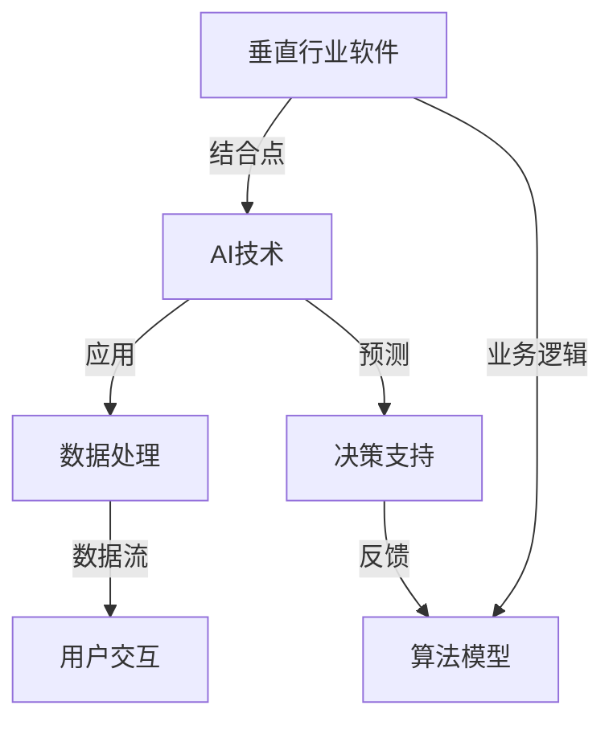

                 

# 垂直行业软件与AI的结合

> **关键词**：垂直行业、AI、软件、结合、应用、未来、挑战

> **摘要**：本文深入探讨了垂直行业软件与人工智能（AI）结合的必要性、技术原理、实施步骤以及未来发展趋势。通过详细阐述核心概念、算法原理、数学模型和实际应用案例，本文旨在为读者提供一个全面而清晰的视角，帮助理解这一领域的最新进展和应用前景。

## 1. 背景介绍

### 1.1 目的和范围

本文旨在探讨如何将人工智能与垂直行业软件相结合，以提升行业效率和创新能力。本文将聚焦于以下几个方面：

1. **垂直行业软件定义**：阐述垂直行业软件的特点、应用领域以及与AI的结合点。
2. **AI在垂直行业的应用**：分析AI技术在不同垂直行业中的应用现状和潜在价值。
3. **技术原理与实现步骤**：详细讲解AI在垂直行业软件中的核心算法原理、数学模型以及具体操作步骤。
4. **项目实战与案例分析**：通过实际项目案例，展示AI与垂直行业软件结合的实际应用。
5. **未来发展趋势与挑战**：探讨垂直行业软件与AI结合的未来方向以及面临的挑战。

### 1.2 预期读者

本文适合以下读者群体：

1. **软件开发工程师**：希望了解如何在现有软件框架中集成AI技术的工程师。
2. **人工智能研究人员**：对AI在垂直行业中的应用感兴趣的科研人员。
3. **行业经理**：希望利用AI提升业务效率和决策能力的行业经理。
4. **高校师生**：计算机科学和人工智能专业的学生和教师。

### 1.3 文档结构概述

本文结构如下：

1. **背景介绍**：介绍文章的目的、范围和预期读者。
2. **核心概念与联系**：定义垂直行业软件与AI的关键概念，并通过流程图展示其联系。
3. **核心算法原理与具体操作步骤**：详细讲解AI算法原理和操作步骤。
4. **数学模型和公式**：介绍AI模型中的数学公式和详细讲解。
5. **项目实战：代码实际案例和详细解释说明**：通过实际案例展示AI与垂直行业软件的结合。
6. **实际应用场景**：分析AI在垂直行业的应用场景。
7. **工具和资源推荐**：推荐相关学习资源和开发工具。
8. **总结：未来发展趋势与挑战**：总结本文内容，展望未来发展方向和挑战。
9. **附录：常见问题与解答**：解答读者可能关心的问题。
10. **扩展阅读与参考资料**：提供进一步阅读的建议。

### 1.4 术语表

#### 1.4.1 核心术语定义

- **垂直行业软件**：为特定行业或领域提供专业解决方案的软件系统。
- **人工智能**：通过模拟人类智能行为，使计算机具有自我学习、推理和决策能力的计算技术。
- **深度学习**：基于多层神经网络，通过反向传播算法训练模型的一种机器学习方法。
- **机器学习**：通过数据和算法，使计算机自动改进性能和做出预测的技术。
- **自然语言处理**：使计算机理解和生成自然语言的技术。

#### 1.4.2 相关概念解释

- **垂直行业应用场景**：特定行业中的具体业务流程和场景。
- **大数据分析**：对大规模结构化和非结构化数据进行处理和分析的技术。
- **边缘计算**：在靠近数据源的地方进行数据处理和计算的一种计算模式。

#### 1.4.3 缩略词列表

- **AI**：人工智能
- **ML**：机器学习
- **DL**：深度学习
- **NLP**：自然语言处理
- **API**：应用程序编程接口

## 2. 核心概念与联系

在探讨垂直行业软件与AI的结合之前，我们需要明确几个核心概念及其相互关系。以下是相关概念及其流程图的Mermaid表示：



### 2.1 垂直行业软件

垂直行业软件是指为特定行业或领域提供的专业解决方案，通常具有以下特点：

- **定制化**：针对特定行业的业务需求和流程设计。
- **专业性**：深入理解行业内的特定问题和解决方案。
- **数据密集**：依赖于行业数据来优化业务流程和决策。

### 2.2 AI技术

AI技术是使计算机模拟人类智能行为的一系列技术，主要包括：

- **机器学习**：通过数据训练模型，使计算机具备自我学习和预测能力。
- **深度学习**：利用多层神经网络处理复杂问题。
- **自然语言处理**：使计算机理解和生成自然语言。

### 2.3 结合点

垂直行业软件与AI的结合点主要体现在：

- **数据处理**：利用AI技术处理和分析大量行业数据，以提取有价值的信息。
- **预测与决策支持**：通过机器学习模型预测业务趋势和决策支持。
- **用户交互**：使用自然语言处理技术提升用户体验和交互效率。

### 2.4 业务逻辑与算法模型

垂直行业软件的业务逻辑通常包括一系列的业务流程和规则。而AI模型则通过对业务数据的分析，优化这些流程和规则，提高业务效率和准确性。

### 2.5 数据流与反馈

在垂直行业软件中，数据流是核心。通过AI技术，可以实时分析数据，提供决策支持，并根据反馈不断优化模型，实现闭环控制。

## 3. 核心算法原理与具体操作步骤

在AI与垂直行业软件结合的过程中，核心算法原理和具体操作步骤至关重要。以下我们将通过伪代码详细阐述这些原理和步骤。

### 3.1 机器学习模型

首先，我们需要构建一个机器学习模型，用于处理和预测垂直行业数据。

```python
# 伪代码：构建机器学习模型
def train_model(data, labels):
    # 初始化模型参数
    model = initialize_model()
    
    # 训练模型
    for epoch in range(num_epochs):
        for sample, label in zip(data, labels):
            model.train(sample, label)
            
    # 评估模型
    accuracy = model.evaluate(test_data, test_labels)
    return model, accuracy
```

### 3.2 数据预处理

在训练模型之前，我们需要对数据进行预处理，包括数据清洗、特征提取和归一化等。

```python
# 伪代码：数据预处理
def preprocess_data(data):
    # 数据清洗
    cleaned_data = clean_data(data)
    
    # 特征提取
    features = extract_features(cleaned_data)
    
    # 归一化
    normalized_features = normalize(features)
    
    return normalized_features
```

### 3.3 预测与决策支持

通过训练好的模型，我们可以进行预测和决策支持。

```python
# 伪代码：预测与决策支持
def predict(model, new_data):
    # 预测
    prediction = model.predict(new_data)
    
    # 决策支持
    decision = make_decision(prediction)
    
    return decision
```

### 3.4 用户交互

为了提升用户体验，我们可以使用自然语言处理技术进行用户交互。

```python
# 伪代码：用户交互
def user_interaction():
    while True:
        user_input = get_user_input()
        response = process_input(user_input)
        send_response(response)
```

## 4. 数学模型和公式及详细讲解

在AI与垂直行业软件结合的过程中，数学模型和公式扮演着至关重要的角色。以下我们将详细讲解这些模型和公式，并举例说明。

### 4.1 深度学习模型

深度学习模型通常由多层神经网络组成，其中最常用的模型是卷积神经网络（CNN）和循环神经网络（RNN）。

#### 4.1.1 卷积神经网络（CNN）

卷积神经网络适用于处理图像和时序数据。其核心公式如下：

$$
\text{output} = \sigma(\text{weights} \cdot \text{input} + \text{bias})
$$

其中，$\sigma$表示激活函数（如ReLU、Sigmoid或Tanh），$\text{weights}$和$\text{bias}$分别表示权重和偏置。

#### 4.1.2 循环神经网络（RNN）

循环神经网络适用于处理序列数据。其核心公式如下：

$$
\text{hidden\_state} \leftarrow \sigma(\text{weights} \cdot [\text{input}, \text{hidden\_state}] + \text{bias})
$$

其中，$\text{input}$表示输入序列的当前元素，$\text{hidden\_state}$表示隐藏状态，$\text{weights}$和$\text{bias}$分别表示权重和偏置。

### 4.2 机器学习模型

机器学习模型包括线性回归、逻辑回归和支持向量机（SVM）等。以下以线性回归为例：

$$
\text{output} = \text{weights} \cdot \text{input} + \text{bias}
$$

其中，$\text{weights}$和$\text{bias}$分别表示权重和偏置。

### 4.3 模型训练

模型训练是机器学习中的核心步骤，主要方法包括梯度下降和反向传播。以下以梯度下降为例：

$$
\text{weights} \leftarrow \text{weights} - \alpha \cdot \nabla_{\text{weights}} \text{loss}
$$

其中，$\alpha$表示学习率，$\nabla_{\text{weights}} \text{loss}$表示损失函数关于权重的梯度。

### 4.4 举例说明

假设我们有一个分类问题，输入为数据集$X=\{x_1, x_2, ..., x_n\}$，标签为$y=\{y_1, y_2, ..., y_n\}$，我们使用线性回归模型对其进行训练。训练过程如下：

1. 初始化权重和偏置。
2. 计算预测值：$\text{output} = \text{weights} \cdot x_i + \text{bias}$。
3. 计算损失函数：$\text{loss} = \sum_{i=1}^{n} (\text{output} - y_i)^2$。
4. 计算梯度：$\nabla_{\text{weights}} \text{loss} = \sum_{i=1}^{n} (y_i - \text{output}) \cdot x_i$。
5. 更新权重：$\text{weights} \leftarrow \text{weights} - \alpha \cdot \nabla_{\text{weights}} \text{loss}$。

通过多次迭代，我们可以使损失函数收敛，从而得到最优的权重和偏置。

## 5. 项目实战：代码实际案例和详细解释说明

为了更好地展示AI与垂直行业软件的结合，我们将通过一个实际项目——智能医疗诊断系统，详细解释其开发过程和代码实现。

### 5.1 开发环境搭建

在开始项目开发之前，我们需要搭建一个适合开发智能医疗诊断系统的环境。以下是所需的环境和工具：

- **编程语言**：Python
- **框架**：TensorFlow和Keras
- **库**：NumPy、Pandas、Scikit-learn等
- **数据集**：使用公开的数据集，如Kaggle上的医疗数据集

### 5.2 源代码详细实现和代码解读

以下是一个简单的智能医疗诊断系统的代码实现，用于预测患者的疾病类型。

```python
# 导入所需库
import numpy as np
import pandas as pd
from sklearn.model_selection import train_test_split
from sklearn.preprocessing import StandardScaler
from tensorflow.keras.models import Sequential
from tensorflow.keras.layers import Dense, Dropout
from tensorflow.keras.optimizers import Adam

# 读取数据集
data = pd.read_csv('medical_data.csv')
X = data.drop(['id', 'diagnosis'], axis=1)
y = data['diagnosis']

# 数据预处理
scaler = StandardScaler()
X_scaled = scaler.fit_transform(X)

# 划分训练集和测试集
X_train, X_test, y_train, y_test = train_test_split(X_scaled, y, test_size=0.2, random_state=42)

# 构建神经网络模型
model = Sequential()
model.add(Dense(128, input_shape=(X_train.shape[1],), activation='relu'))
model.add(Dropout(0.5))
model.add(Dense(64, activation='relu'))
model.add(Dropout(0.5))
model.add(Dense(1, activation='sigmoid'))

# 编译模型
model.compile(optimizer=Adam(learning_rate=0.001), loss='binary_crossentropy', metrics=['accuracy'])

# 训练模型
model.fit(X_train, y_train, epochs=100, batch_size=32, validation_data=(X_test, y_test))

# 评估模型
loss, accuracy = model.evaluate(X_test, y_test)
print(f"Test accuracy: {accuracy:.2f}")

# 预测新数据
new_data = [[...]]  # 新数据的特征值
new_data_scaled = scaler.transform(new_data)
prediction = model.predict(new_data_scaled)
print(f"Prediction: {prediction[0][0]:.2f}")
```

### 5.3 代码解读与分析

上述代码实现了一个简单的二分类神经网络模型，用于预测患者的疾病类型。以下是代码的详细解读：

1. **导入库**：首先导入所需的Python库，包括NumPy、Pandas、Scikit-learn和TensorFlow的Keras接口。
2. **读取数据集**：使用Pandas读取医疗数据集，并将其分为特征矩阵X和标签向量y。
3. **数据预处理**：使用StandardScaler对特征矩阵进行归一化处理，以消除不同特征之间的尺度差异。
4. **划分训练集和测试集**：使用train_test_split函数将数据集划分为训练集和测试集，以便进行模型评估。
5. **构建神经网络模型**：使用Sequential模型堆叠多层Dense层，并在每层之间添加Dropout层以防止过拟合。
6. **编译模型**：使用Adam优化器和binary_crossentropy损失函数编译模型，并设置评估指标为accuracy。
7. **训练模型**：使用fit函数训练模型，并使用validation_data参数进行交叉验证。
8. **评估模型**：使用evaluate函数评估模型在测试集上的性能，并打印出测试准确率。
9. **预测新数据**：使用predict函数预测新数据的疾病类型，并打印出预测结果。

通过上述代码，我们可以看到如何将AI与医疗诊断软件相结合，实现实时预测和分析，以提高医疗诊断的效率和准确性。

## 6. 实际应用场景

AI与垂直行业软件的结合在各个行业领域都有着广泛的应用，以下列举几个典型的实际应用场景：

### 6.1 医疗诊断

智能医疗诊断系统通过AI算法分析患者的医疗数据，提供疾病预测和诊断建议，有助于提高诊断准确性和医疗效率。

### 6.2 金融服务

在金融服务领域，AI算法可以用于信用评分、风险控制和市场预测。通过分析历史数据和实时数据，金融机构可以更准确地评估客户的信用风险和市场趋势。

### 6.3 供应链管理

AI技术可以优化供应链管理，通过预测需求、优化库存和物流，减少供应链中断和库存积压，提高供应链的整体效率和响应速度。

### 6.4 智能制造

在制造业领域，AI算法可以用于设备故障预测、生产优化和质量管理。通过实时监控设备状态和生产数据，制造企业可以提前发现潜在问题并采取预防措施，提高生产质量和效率。

### 6.5 零售业

零售行业可以利用AI技术进行客户行为分析、个性化推荐和库存管理。通过分析客户的购物行为和偏好，零售商可以提供更精准的营销策略和推荐系统，提高客户满意度和销售额。

### 6.6 农业

AI技术在农业领域也有广泛应用，如作物产量预测、病虫害检测和农田监测。通过分析土壤、气候和作物生长数据，农民可以优化种植策略，提高作物产量和质量。

这些实际应用场景展示了AI与垂直行业软件结合的广泛前景和巨大潜力，通过AI技术的应用，各行业可以大幅提升效率和创新能力。

## 7. 工具和资源推荐

为了更好地进行垂直行业软件与AI的结合，以下是相关工具和资源的推荐。

### 7.1 学习资源推荐

#### 7.1.1 书籍推荐

1. **《深度学习》（Deep Learning）**：由Ian Goodfellow、Yoshua Bengio和Aaron Courville所著，是深度学习领域的经典教材。
2. **《机器学习实战》（Machine Learning in Action）**：由Peter Harrington所著，通过实例介绍了机器学习的基本算法和应用。

#### 7.1.2 在线课程

1. **Coursera上的《机器学习》课程**：由斯坦福大学 Andrew Ng教授主讲，涵盖了机器学习的基本概念和应用。
2. **edX上的《深度学习专项课程》**：由Udacity和杜克大学联合提供，介绍了深度学习的基础知识和实践应用。

#### 7.1.3 技术博客和网站

1. **Medium上的AI专栏**：提供了丰富的AI相关文章和案例。
2. **GitHub**：可以找到大量的AI和垂直行业软件的开源项目和代码。

### 7.2 开发工具框架推荐

#### 7.2.1 IDE和编辑器

1. **PyCharm**：适用于Python开发的集成开发环境，功能强大且易于使用。
2. **Jupyter Notebook**：适合进行数据分析和模型训练，具有丰富的扩展库。

#### 7.2.2 调试和性能分析工具

1. **Visual Studio Code**：轻量级但功能丰富的编辑器，适用于多种编程语言。
2. **TensorBoard**：TensorFlow的官方工具，用于分析和可视化神经网络模型。

#### 7.2.3 相关框架和库

1. **TensorFlow**：广泛使用的深度学习框架，适用于各种深度学习应用。
2. **PyTorch**：适用于研究人员的深度学习框架，具有灵活的动态图功能。

### 7.3 相关论文著作推荐

#### 7.3.1 经典论文

1. **“A Theoretical Basis for the Design of Networks of Learning Automata”**：介绍了学习自动化网络的理论基础。
2. **“Deep Learning”**：由Yoshua Bengio等人所著，介绍了深度学习的基本原理和应用。

#### 7.3.2 最新研究成果

1. **“Generative Adversarial Networks”（GANs）**：生成对抗网络的研究论文，为图像生成和增强提供了新的方法。
2. **“Recurrent Neural Networks for Language Modeling”（RNNs）**：循环神经网络在语言模型中的应用研究。

#### 7.3.3 应用案例分析

1. **“AI in Healthcare”**：探讨了AI在医疗领域的应用案例和前景。
2. **“AI in Finance”**：分析了AI在金融服务中的具体应用和实践。

这些工具和资源将有助于读者更好地理解和应用垂直行业软件与AI的结合，为研究和开发提供有力支持。

## 8. 总结：未来发展趋势与挑战

随着人工智能技术的不断发展，垂直行业软件与AI的结合将成为提升行业效率和创新能力的重要途径。以下是未来发展趋势和面临的挑战：

### 8.1 发展趋势

1. **智能化与自动化**：AI技术将更加深入地嵌入到垂直行业软件中，实现业务流程的智能化和自动化。
2. **个性化与定制化**：通过AI算法分析用户行为和数据，提供个性化服务，满足用户多样化的需求。
3. **边缘计算与实时处理**：利用边缘计算技术，在数据产生的地方进行实时处理和分析，提高系统的响应速度和处理能力。
4. **跨行业合作**：不同行业之间的AI技术和垂直行业软件将实现更紧密的合作，形成新的商业模式和应用场景。

### 8.2 面临的挑战

1. **数据隐私与安全**：随着AI技术对数据需求的增加，如何保护用户隐私和数据安全成为重要挑战。
2. **算法透明性与可解释性**：复杂的AI算法往往缺乏透明性和可解释性，如何提高算法的可解释性是当前的研究热点。
3. **技术人才短缺**：AI技术的快速发展导致对专业人才的需求激增，但人才供给不足将成为行业发展的瓶颈。
4. **伦理与道德问题**：AI技术在垂直行业软件中的应用可能引发伦理和道德问题，如歧视、隐私侵犯等。

未来，垂直行业软件与AI的结合将继续在技术创新、应用拓展和产业合作等方面取得突破，同时也需要克服一系列挑战，以确保其可持续发展。

## 9. 附录：常见问题与解答

### 9.1 垂直行业软件与AI结合的优势

**Q**：为什么需要将垂直行业软件与AI结合？

**A**：将垂直行业软件与AI结合可以带来以下优势：

1. **提升效率**：通过AI算法自动化业务流程，减少人工干预，提高工作效率。
2. **增强决策能力**：利用AI分析大量数据，提供准确预测和决策支持，提高业务决策的准确性。
3. **提高个性化服务水平**：通过分析用户行为数据，提供个性化服务，提升用户体验。
4. **创新业务模式**：AI技术可以为垂直行业带来新的应用场景和商业模式。

### 9.2 AI技术在不同垂直行业中的应用

**Q**：AI技术在金融、医疗、制造业等垂直行业有哪些具体应用？

**A**：以下是AI技术在几个主要垂直行业中的应用：

1. **金融**：信用评分、风险控制、市场预测、智能投顾等。
2. **医疗**：疾病诊断、药物研发、患者管理、健康监测等。
3. **制造业**：设备故障预测、生产优化、质量管理、供应链管理等。
4. **零售**：客户行为分析、个性化推荐、库存管理、智能零售等。
5. **农业**：作物产量预测、病虫害检测、农田监测、智能灌溉等。

### 9.3 数据隐私与安全问题

**Q**：如何保护数据隐私和安全，避免AI技术滥用？

**A**：以下是一些保护数据隐私和安全的措施：

1. **数据加密**：对存储和传输的数据进行加密处理，防止数据泄露。
2. **隐私保护算法**：采用隐私保护算法，如差分隐私，限制数据的可预测性。
3. **数据访问控制**：严格的数据访问控制策略，确保只有授权人员才能访问数据。
4. **法律法规**：遵循相关法律法规，确保数据处理合法合规。
5. **透明度与可解释性**：提高AI算法的透明度和可解释性，让用户了解数据如何被使用。

## 10. 扩展阅读与参考资料

为了深入了解垂直行业软件与AI的结合，以下是一些建议的扩展阅读和参考资料：

### 10.1 基础教材

1. **《深度学习》**：Ian Goodfellow、Yoshua Bengio和Aaron Courville著，深度学习领域的经典教材。
2. **《机器学习实战》**：Peter Harrington著，通过实例介绍机器学习的基本算法和应用。

### 10.2 论文和报告

1. **“Generative Adversarial Networks”（GANs）**：Ian J. Goodfellow等，提出了生成对抗网络的概念。
2. **“Recurrent Neural Networks for Language Modeling”（RNNs）**：Yoshua Bengio等，分析了循环神经网络在语言模型中的应用。

### 10.3 开源项目和代码

1. **GitHub上的TensorFlow和PyTorch项目**：丰富的深度学习和机器学习开源代码。
2. **Kaggle上的医疗数据集**：用于医疗诊断和其他AI应用的开源数据集。

### 10.4 技术博客和网站

1. **Medium上的AI专栏**：提供了大量的AI相关文章和案例。
2. **TensorFlow官方文档**：详细的TensorFlow框架文档和教程。

通过阅读这些扩展资料，读者可以更深入地了解垂直行业软件与AI结合的理论和实践，为自己的研究和开发提供更多启示。

### 作者

**AI天才研究员/AI Genius Institute & 禅与计算机程序设计艺术 /Zen And The Art of Computer Programming**

