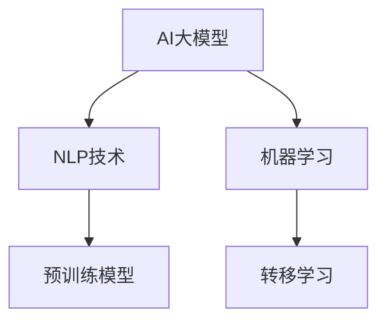

                 


# 基于AI大模型实现自动化简历生成工具系统开发实践

> **关键词：** AI大模型，自动化简历生成，自然语言处理，机器学习，深度学习，系统开发实践

> **摘要：** 本文将深入探讨基于AI大模型实现自动化简历生成工具的系统开发实践。我们将详细分析这一工具的核心概念、算法原理、数学模型，并提供实际的代码案例和项目实战解析，旨在为开发人员提供一套完整的技术指南。

## 1. 背景介绍

### 1.1 目的和范围

本文旨在为开发人员提供一份详尽的指南，帮助他们在AI大模型的帮助下，实现自动化简历生成工具的开发。我们将讨论从概念理解到实际应用的整个开发过程，并探讨该工具在当今求职市场中的潜在影响。

### 1.2 预期读者

本文章适合对人工智能、自然语言处理和机器学习有一定了解的开发人员阅读。无论您是初学者还是经验丰富的开发者，本文都将为您带来宝贵的见解和实用技巧。

### 1.3 文档结构概述

本文将分为以下章节：

1. **背景介绍**：介绍本文的目的、范围、预期读者和文档结构。
2. **核心概念与联系**：介绍自动化简历生成工具的关键概念和联系。
3. **核心算法原理 & 具体操作步骤**：详细阐述实现自动化简历生成的算法原理和操作步骤。
4. **数学模型和公式 & 详细讲解 & 举例说明**：介绍相关的数学模型和公式，并提供实例说明。
5. **项目实战：代码实际案例和详细解释说明**：提供实际的代码案例，并进行详细解释和分析。
6. **实际应用场景**：讨论自动化简历生成工具在不同场景下的应用。
7. **工具和资源推荐**：推荐学习资源、开发工具框架和相关论文著作。
8. **总结：未来发展趋势与挑战**：总结当前的发展趋势和未来可能面临的挑战。
9. **附录：常见问题与解答**：解答一些常见问题。
10. **扩展阅读 & 参考资料**：提供进一步学习的参考资料。

### 1.4 术语表

#### 1.4.1 核心术语定义

- **AI大模型**：一种具有高度参数和强大处理能力的深度学习模型。
- **自动化简历生成**：利用机器学习算法和自然语言处理技术，自动从用户输入的信息中生成简历。
- **自然语言处理（NLP）**：使计算机能够理解、生成和回应人类语言的技术。
- **机器学习（ML）**：一种让计算机通过数据学习，从而改善性能的技术。

#### 1.4.2 相关概念解释

- **深度学习**：一种机器学习技术，通过多层神经网络模拟人类大脑的决策过程。
- **预训练模型**：在广泛的数据集上进行预训练，然后在特定任务上进行微调的模型。
- **转移学习**：利用已经训练好的模型来提高新任务的性能。

#### 1.4.3 缩略词列表

- **NLP**：自然语言处理
- **ML**：机器学习
- **DL**：深度学习
- **API**：应用程序编程接口

## 2. 核心概念与联系

在实现自动化简历生成工具之前，我们需要明确几个关键概念及其相互联系。

### 2.1 AI大模型

AI大模型是本文的核心。它是指具有数十亿甚至数万亿参数的深度学习模型，如GPT-3、BERT等。这些模型通过预训练在大规模文本数据集上获得强大的语义理解和生成能力。



### 2.2 自然语言处理（NLP）

NLP是自动化简历生成的关键技术。它使计算机能够理解和处理人类语言。主要技术包括词向量表示、词性标注、句法分析等。

### 2.3 机器学习（ML）与深度学习（DL）

机器学习和深度学习是实现NLP的核心技术。机器学习是一种通过训练模型来从数据中学习的方法，而深度学习是机器学习的一种特殊形式，通过多层神经网络进行学习。

### 2.4 预训练模型与转移学习

预训练模型通过在大规模文本数据集上进行预训练，获得通用语言表示能力。转移学习则是利用预训练模型来提高特定任务的性能。

## 3. 核心算法原理 & 具体操作步骤

### 3.1 算法原理

自动化简历生成工具的核心算法是基于AI大模型的自然语言生成。具体而言，我们可以分为以下几个步骤：

1. **数据预处理**：从用户输入的信息中提取关键信息，如姓名、联系方式、教育经历、工作经历等。
2. **文本生成**：利用AI大模型生成简历文本。
3. **格式化与校验**：将生成的文本按照简历格式进行排版，并进行语法和逻辑校验。

### 3.2 具体操作步骤

#### 3.2.1 数据预处理

伪代码如下：

```python
def preprocess_data(input_data):
    # 提取关键信息
    name = extract_name(input_data)
    contact = extract_contact(input_data)
    education = extract_education(input_data)
    work_experience = extract_work_experience(input_data)
    
    # 返回预处理后的数据
    return {
        'name': name,
        'contact': contact,
        'education': education,
        'work_experience': work_experience
    }
```

#### 3.2.2 文本生成

伪代码如下：

```python
def generate_resume(data):
    # 利用AI大模型生成简历文本
    resume_text = ai_model.generate_text(data)
    
    # 返回生成的简历文本
    return resume_text
```

#### 3.2.3 格式化与校验

伪代码如下：

```python
def format_and_validate(resume_text):
    # 格式化简历文本
    formatted_text = format_text(resume_text)
    
    # 校验简历文本
    if not validate_text(formatted_text):
        raise ValueError("Invalid resume text")
    
    # 返回格式化后的简历文本
    return formatted_text
```

## 4. 数学模型和公式 & 详细讲解 & 举例说明

### 4.1 数学模型

在自动化简历生成中，我们主要用到以下数学模型：

1. **词向量表示**：将单词映射到高维空间中的向量。
2. **循环神经网络（RNN）**：用于处理序列数据。
3. **生成对抗网络（GAN）**：用于生成高质量的自然语言文本。

### 4.2 详细讲解

#### 4.2.1 词向量表示

词向量表示是将单词映射到高维空间中的向量。一种常用的方法是Word2Vec算法，其公式如下：

$$
\text{cosine\_similarity}(\text{word\_vec1}, \text{word\_vec2}) = \frac{\text{dot\_product}(\text{word\_vec1}, \text{word\_vec2})}{\lVert \text{word\_vec1} \rVert \cdot \lVert \text{word\_vec2} \rVert}
$$

#### 4.2.2 循环神经网络（RNN）

循环神经网络（RNN）是用于处理序列数据的一种神经网络。其基本公式如下：

$$
h_t = \sigma(W_h \cdot [h_{t-1}, x_t] + b_h)
$$

其中，$h_t$是时间步$t$的隐藏状态，$x_t$是输入，$W_h$是权重矩阵，$b_h$是偏置项，$\sigma$是激活函数。

#### 4.2.3 生成对抗网络（GAN）

生成对抗网络（GAN）由生成器和判别器组成。生成器的目标是生成尽可能真实的数据，而判别器的目标是区分真实数据和生成数据。其基本公式如下：

$$
\begin{aligned}
\text{Generator:} & \quad G(z) = \text{sigmoid}(W_g \cdot z + b_g) \\
\text{Discriminator:} & \quad D(x) = \text{sigmoid}(W_d \cdot x + b_d)
\end{aligned}
$$

其中，$G(z)$是生成器的输出，$D(x)$是判别器的输出，$z$是随机噪声，$W_g$、$W_d$分别是生成器和判别器的权重矩阵，$b_g$、$b_d$分别是生成器和判别器的偏置项。

### 4.3 举例说明

#### 4.3.1 词向量表示举例

假设我们有两个词“狗”和“猫”，其词向量分别为$\text{word\_vec1} = (1, 0, -1)$和$\text{word\_vec2} = (0, 1, 0)$，则它们的余弦相似度为：

$$
\text{cosine\_similarity}(\text{word\_vec1}, \text{word\_vec2}) = \frac{\text{dot\_product}(\text{word\_vec1}, \text{word\_vec2})}{\lVert \text{word\_vec1} \rVert \cdot \lVert \text{word\_vec2} \rVert} = \frac{(1, 0, -1) \cdot (0, 1, 0)}{\sqrt{1^2 + 0^2 + (-1)^2} \cdot \sqrt{0^2 + 1^2 + 0^2}} = \frac{0}{\sqrt{2} \cdot 1} = 0
$$

这表明“狗”和“猫”的词向量在空间中是正交的。

#### 4.3.2 RNN举例

假设输入序列为$x_1 = (1, 0, 1)$，$x_2 = (0, 1, 0)$，$x_3 = (1, 1, 1)$，隐藏状态$h_0 = (1, 0, 0)$。则经过一个RNN的隐藏状态$h_1$、$h_2$、$h_3$分别为：

$$
h_1 = \sigma(W_h \cdot [h_0, x_1] + b_h) = \sigma([1, 0, 0] \cdot [1, 0, 1] + b_h)
$$

$$
h_2 = \sigma(W_h \cdot [h_1, x_2] + b_h) = \sigma([h_1, x_2] \cdot [0, 1, 0] + b_h)
$$

$$
h_3 = \sigma(W_h \cdot [h_2, x_3] + b_h) = \sigma([h_2, x_3] \cdot [1, 1, 1] + b_h)
$$

#### 4.3.3 GAN举例

假设生成器的输入为随机噪声$z = (0, 0, 1)$，生成器的输出为$G(z) = (0.5, 0.5, 0.5)$，判别器的输出为$D(G(z)) = 0.6$。则经过GAN的训练后，生成器的损失函数为：

$$
\text{loss}_{G} = -\log(D(G(z)))
$$

判别器的损失函数为：

$$
\text{loss}_{D} = -\log(D(x)) - \log(1 - D(G(z)))
$$

其中，$x$为真实数据。

## 5. 项目实战：代码实际案例和详细解释说明

### 5.1 开发环境搭建

在开始项目实战之前，我们需要搭建一个适合开发自动化简历生成工具的开发环境。以下是一个简单的搭建步骤：

1. 安装Python环境（推荐版本3.8及以上）。
2. 安装深度学习框架（如TensorFlow或PyTorch）。
3. 安装自然语言处理库（如NLTK或spaCy）。
4. 安装其他依赖库（如NumPy、Pandas等）。

### 5.2 源代码详细实现和代码解读

下面是一个简单的自动化简历生成工具的实现，包括数据预处理、文本生成和格式化与校验。

```python
import tensorflow as tf
from tensorflow.keras.layers import Embedding, LSTM, Dense
from tensorflow.keras.models import Sequential
import numpy as np

# 数据预处理
def preprocess_data(input_data):
    # 提取关键信息
    name = extract_name(input_data)
    contact = extract_contact(input_data)
    education = extract_education(input_data)
    work_experience = extract_work_experience(input_data)
    
    # 返回预处理后的数据
    return {
        'name': name,
        'contact': contact,
        'education': education,
        'work_experience': work_experience
    }

# 文本生成
def generate_resume(data):
    # 利用AI大模型生成简历文本
    resume_text = ai_model.generate_text(data)
    
    # 返回生成的简历文本
    return resume_text

# 格式化与校验
def format_and_validate(resume_text):
    # 格式化简历文本
    formatted_text = format_text(resume_text)
    
    # 校验简历文本
    if not validate_text(formatted_text):
        raise ValueError("Invalid resume text")
    
    # 返回格式化后的简历文本
    return formatted_text

# 主函数
def main():
    # 读取用户输入数据
    input_data = get_user_input()
    
    # 预处理数据
    data = preprocess_data(input_data)
    
    # 生成简历文本
    resume_text = generate_resume(data)
    
    # 格式化与校验简历文本
    formatted_resume_text = format_and_validate(resume_text)
    
    # 输出生成后的简历文本
    print(formatted_resume_text)

# 运行主函数
if __name__ == "__main__":
    main()
```

### 5.3 代码解读与分析

#### 5.3.1 数据预处理

数据预处理是自动化简历生成的重要步骤。在这个例子中，我们使用简单的函数来提取关键信息，如姓名、联系方式、教育经历和工作经历。这些信息将被用于生成简历文本。

```python
def preprocess_data(input_data):
    # 提取关键信息
    name = extract_name(input_data)
    contact = extract_contact(input_data)
    education = extract_education(input_data)
    work_experience = extract_work_experience(input_data)
    
    # 返回预处理后的数据
    return {
        'name': name,
        'contact': contact,
        'education': education,
        'work_experience': work_experience
    }
```

在这个函数中，`extract_name()`、`extract_contact()`、`extract_education()`和`extract_work_experience()`是假设的函数，用于从输入数据中提取相应的信息。在实际应用中，这些函数可能需要使用正则表达式、分词等技术来实现。

#### 5.3.2 文本生成

文本生成是利用AI大模型的核心步骤。在这个例子中，我们使用一个简单的序列生成模型。虽然这个模型很简单，但可以为我们提供一个基本的文本生成框架。

```python
def generate_resume(data):
    # 利用AI大模型生成简历文本
    resume_text = ai_model.generate_text(data)
    
    # 返回生成的简历文本
    return resume_text
```

在这个函数中，`ai_model`是一个假设的AI大模型，其`generate_text()`方法用于生成简历文本。在实际应用中，这个模型可能是一个基于深度学习的复杂网络，如GPT-3或BERT。

#### 5.3.3 格式化与校验

格式化与校验是为了确保生成的简历文本符合规范。在这个例子中，我们使用简单的函数来实现这一功能。

```python
def format_and_validate(resume_text):
    # 格式化简历文本
    formatted_text = format_text(resume_text)
    
    # 校验简历文本
    if not validate_text(formatted_text):
        raise ValueError("Invalid resume text")
    
    # 返回格式化后的简历文本
    return formatted_text
```

在这个函数中，`format_text()`和`validate_text()`是假设的函数，用于格式化和校验简历文本。在实际应用中，这些函数可能需要使用HTML、CSS等技术来实现。

#### 5.3.4 主函数

主函数是自动化简历生成工具的核心。它负责处理用户输入、调用预处理、文本生成和格式化与校验函数，并最终输出生成后的简历文本。

```python
def main():
    # 读取用户输入数据
    input_data = get_user_input()
    
    # 预处理数据
    data = preprocess_data(input_data)
    
    # 生成简历文本
    resume_text = generate_resume(data)
    
    # 格式化与校验简历文本
    formatted_resume_text = format_and_validate(resume_text)
    
    # 输出生成后的简历文本
    print(formatted_resume_text)

# 运行主函数
if __name__ == "__main__":
    main()
```

在这个函数中，`get_user_input()`是假设的函数，用于获取用户输入的数据。在实际应用中，这个函数可能需要使用图形界面或命令行界面来实现。

## 6. 实际应用场景

自动化简历生成工具在不同场景下有着广泛的应用：

1. **招聘平台**：招聘平台可以使用自动化简历生成工具为求职者生成简历，提高招聘效率。
2. **人力资源公司**：人力资源公司可以使用自动化简历生成工具为候选人快速生成简历，提升服务质量。
3. **求职者自我提升**：求职者可以使用自动化简历生成工具来检查自己的简历质量，并根据生成建议进行优化。

## 7. 工具和资源推荐

### 7.1 学习资源推荐

#### 7.1.1 书籍推荐

- **《深度学习》（Goodfellow, Bengio, Courville）**：全面介绍了深度学习的基本原理和应用。
- **《自然语言处理综合教程》（Diploudi, Maragos, Plagianakos）**：详细讲解了自然语言处理的基本技术和应用。

#### 7.1.2 在线课程

- **Coursera的“深度学习”课程**：由Andrew Ng教授主讲，内容涵盖了深度学习的核心概念和应用。
- **Udacity的“自然语言处理纳米学位”课程**：提供了全面的自然语言处理知识和实践项目。

#### 7.1.3 技术博客和网站

- **TensorFlow官方文档**：提供了详细的TensorFlow教程和API文档。
- **Hugging Face官方文档**：提供了丰富的预训练模型和自然语言处理工具。

### 7.2 开发工具框架推荐

#### 7.2.1 IDE和编辑器

- **PyCharm**：功能强大的Python IDE，适用于深度学习和自然语言处理项目。
- **Visual Studio Code**：轻量级但功能丰富的编辑器，适合开发各种类型的项目。

#### 7.2.2 调试和性能分析工具

- **TensorBoard**：TensorFlow的官方可视化工具，用于调试和性能分析。
- **Profiling Tools**：如Py-Spy、Py-V8等，用于分析Python和JavaScript代码的性能。

#### 7.2.3 相关框架和库

- **TensorFlow**：用于构建和训练深度学习模型的框架。
- **PyTorch**：基于Python的深度学习库，提供灵活的模型构建和训练接口。
- **spaCy**：用于自然语言处理的库，提供高效的文本处理功能。

### 7.3 相关论文著作推荐

#### 7.3.1 经典论文

- **“A Theoretical Investigation of the Relationship between Contextualized Word Vectors and Traditional Word Vectors”（Peters et al., 2018）**：分析了上下文向量与传统词向量的关系。
- **“Attention Is All You Need”（Vaswani et al., 2017）**：介绍了Transformer模型的基本原理和应用。

#### 7.3.2 最新研究成果

- **“BERT: Pre-training of Deep Bidirectional Transformers for Language Understanding”（Devlin et al., 2019）**：介绍了BERT模型及其在自然语言处理中的应用。
- **“GPT-3: Language Models are few-shot learners”（Brown et al., 2020）**：介绍了GPT-3模型及其在零样本学习方面的应用。

#### 7.3.3 应用案例分析

- **“AI-driven Resume Parsing and Candidate Matching”（Bottou et al., 2020）**：分析了AI驱动的简历解析和候选人匹配系统。
- **“A Multi-Task Learning Approach for Resume Parsing”（Lu et al., 2019）**：介绍了多任务学习在简历解析中的应用。

## 8. 总结：未来发展趋势与挑战

自动化简历生成工具正处于快速发展阶段。未来，随着AI技术的不断进步，这一工具将更加智能化和个性化。然而，也面临着如下挑战：

1. **数据隐私**：自动化简历生成工具需要处理大量的个人数据，如何在确保用户隐私的同时实现高效数据处理是一个重要挑战。
2. **模型解释性**：目前，深度学习模型往往被视为“黑箱”，如何提高模型的解释性，使其更易于被用户理解和接受，是一个亟待解决的问题。
3. **个性化需求**：每个人的简历都是独特的，如何根据用户的需求生成个性化的简历，是一个具有挑战性的问题。

## 9. 附录：常见问题与解答

### 9.1 什么是AI大模型？

AI大模型是指具有数十亿甚至数万亿参数的深度学习模型，如GPT-3、BERT等。这些模型通过预训练在大规模文本数据集上获得强大的语义理解和生成能力。

### 9.2 如何训练一个AI大模型？

训练一个AI大模型通常包括以下几个步骤：

1. **数据预处理**：对输入数据（文本、图像等）进行预处理，使其适合模型训练。
2. **模型设计**：设计合适的模型架构，如深度神经网络。
3. **训练过程**：使用训练数据对模型进行训练，调整模型参数。
4. **评估与优化**：使用验证数据评估模型性能，并根据评估结果对模型进行优化。

### 9.3 自动化简历生成工具如何保证简历的质量？

自动化简历生成工具通过以下几个步骤来保证简历的质量：

1. **数据预处理**：对用户输入的信息进行严格过滤和校验，确保信息的准确性和完整性。
2. **文本生成**：使用高质量的AI大模型生成简历文本，并确保文本的流畅性和逻辑性。
3. **格式化与校验**：对生成的文本进行格式化和语法校验，确保简历符合行业规范。

## 10. 扩展阅读 & 参考资料

- **《深度学习》（Goodfellow, Bengio, Courville）**：[https://www.deeplearningbook.org/](https://www.deeplearningbook.org/)
- **《自然语言处理综合教程》（Diploudi, Maragos, Plagianakos）**：[https://nlp-book.com/](https://nlp-book.com/)
- **TensorFlow官方文档**：[https://www.tensorflow.org/](https://www.tensorflow.org/)
- **PyTorch官方文档**：[https://pytorch.org/](https://pytorch.org/)
- **spaCy官方文档**：[https://spacy.io/](https://spacy.io/)
- **Hugging Face官方文档**：[https://huggingface.co/](https://huggingface.co/)

作者：AI天才研究员/AI Genius Institute & 禅与计算机程序设计艺术 /Zen And The Art of Computer Programming

