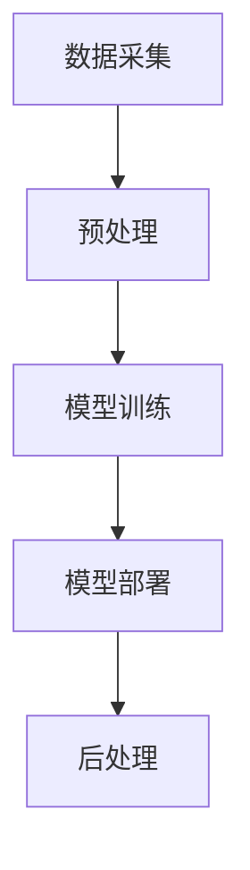

                 

# 基于AI大模型的智能文档处理系统

> 关键词：AI大模型、智能文档处理、自然语言处理、文本分类、文本摘要、文本生成、语义理解、预训练模型、Transformer、BERT、GPT、神经网络、深度学习

> 摘要：本文深入探讨了基于AI大模型的智能文档处理系统的原理、架构和实现方法。通过分析自然语言处理的核心技术和算法，以及具体项目实战案例，本文旨在为读者提供一份全面的技术指南，帮助他们在实际项目中应用这些先进技术，提升文档处理的效率和准确性。

## 1. 背景介绍

### 1.1 目的和范围

随着信息时代的到来，文档处理成为企业和组织日常运营中的重要组成部分。传统的文档处理方式往往依赖于人工，效率低下，且容易出现错误。而随着人工智能技术的迅猛发展，特别是深度学习和自然语言处理（NLP）领域的突破，基于AI大模型的智能文档处理系统应运而生。本文的目的在于介绍这一系统的原理、架构和实现方法，帮助读者了解并掌握其核心技术和应用场景。

本文将涵盖以下内容：

1. AI大模型在文档处理中的应用。
2. 自然语言处理的核心算法和原理。
3. 智能文档处理系统的架构设计。
4. 具体项目实战案例和代码解读。
5. 实际应用场景分析。
6. 工具和资源推荐。

### 1.2 预期读者

本文面向具有中等及以上计算机科学背景的读者，包括：

1. 计算机科学和人工智能专业的学生。
2. IT行业从业者，特别是数据科学家和软件工程师。
3. 研究人员和对AI大模型感兴趣的爱好者。

### 1.3 文档结构概述

本文结构如下：

1. 背景介绍
2. 核心概念与联系
3. 核心算法原理 & 具体操作步骤
4. 数学模型和公式 & 详细讲解 & 举例说明
5. 项目实战：代码实际案例和详细解释说明
6. 实际应用场景
7. 工具和资源推荐
8. 总结：未来发展趋势与挑战
9. 附录：常见问题与解答
10. 扩展阅读 & 参考资料

### 1.4 术语表

#### 1.4.1 核心术语定义

- AI大模型：基于深度学习和神经网络，参数规模巨大的模型。
- 自然语言处理（NLP）：使计算机能够理解、生成和处理人类自然语言的技术。
- 文本分类：将文本分配到预定义的类别中。
- 文本摘要：提取文本的主要信息并生成简洁的摘要。
- 文本生成：利用算法生成新的文本内容。
- 语义理解：理解文本中的含义和关系。

#### 1.4.2 相关概念解释

- 预训练模型：在大量文本数据上预先训练好的模型，可用于多种NLP任务。
- Transformer：一种基于自注意力机制的神经网络结构，广泛用于语言模型和机器翻译。
- BERT：一种双向编码器表示模型，通过预训练实现高水平的文本理解能力。
- GPT：一种生成预训练模型，能够生成连贯的自然语言文本。

#### 1.4.3 缩略词列表

- AI：人工智能
- NLP：自然语言处理
- ML：机器学习
- DL：深度学习
- Transformer：变换器
- BERT：双向编码器表示模型
- GPT：生成预训练模型

## 2. 核心概念与联系

### 2.1 AI大模型与文档处理

AI大模型，尤其是预训练模型，在文档处理中扮演着关键角色。这些模型通过在大规模文本数据上预训练，掌握了丰富的语言知识和模式，能够高效地处理文本数据。在文档处理中，AI大模型可以应用于文本分类、文本摘要、文本生成和语义理解等任务。

#### 2.1.1 文本分类

文本分类是文档处理中最基本也是应用最广泛的任务之一。AI大模型，如BERT和GPT，通过学习文本的特征，能够将文本分配到预定义的类别中。例如，在新闻分类中，可以将新闻文本分类为体育、政治、财经等类别。

#### 2.1.2 文本摘要

文本摘要的任务是从长篇文本中提取关键信息，生成简洁的摘要。AI大模型通过预训练，能够理解文本中的关系和结构，从而生成高质量的摘要。例如，在报告或论文的摘要中，AI大模型可以提取出最核心的观点和结论。

#### 2.1.3 文本生成

文本生成是AI大模型在文档处理中的另一重要应用。通过学习大量文本数据，模型能够生成连贯、有逻辑的文本内容。这在写作辅助、内容生成和问答系统中有着广泛的应用。

#### 2.1.4 语义理解

语义理解是AI大模型的核心能力之一，它能够理解文本中的含义和关系。在文档处理中，语义理解可以帮助模型更好地理解文档的内容，从而提高文本分类、文本摘要和文本生成的准确性。

### 2.2 自然语言处理的核心算法

自然语言处理（NLP）是文档处理的基础，其核心算法包括词嵌入、序列标注、序列生成等。

#### 2.2.1 词嵌入

词嵌入（Word Embedding）是将词汇映射到高维向量空间的技术。通过词嵌入，模型可以学习到词汇之间的相似性和差异性。经典的词嵌入方法包括Word2Vec、GloVe等。

#### 2.2.2 序列标注

序列标注（Sequence Labeling）是对文本中的每个词或字符进行分类的任务。常见的序列标注任务包括命名实体识别（NER）、情感分析等。

#### 2.2.3 序列生成

序列生成（Sequence Generation）是生成文本的技术。生成预训练模型（GPT）和变换器（Transformer）是序列生成的重要方法。GPT通过自回归的方式生成文本，而Transformer则通过自注意力机制实现高效的序列生成。

### 2.3 智能文档处理系统的架构

智能文档处理系统的架构通常包括数据采集、预处理、模型训练、模型部署和后处理等模块。

#### 2.3.1 数据采集

数据采集是文档处理系统的第一步，它涉及到从各种渠道获取文本数据，如网页、文档、社交媒体等。

#### 2.3.2 预处理

预处理是对采集到的文本数据进行的清洗和转换，使其适合模型训练。预处理步骤包括文本清洗、分词、词性标注等。

#### 2.3.3 模型训练

模型训练是文档处理系统的核心，它涉及到使用预训练模型或自定义模型对预处理后的文本数据进行训练。

#### 2.3.4 模型部署

模型部署是将训练好的模型部署到实际应用环境中，使其能够进行实时文档处理。

#### 2.3.5 后处理

后处理是对模型输出结果的处理，如结果校验、错误纠正等。

### 2.4 Mermaid流程图



## 3. 核心算法原理 & 具体操作步骤

### 3.1 文本分类算法原理

文本分类是文档处理中最基本也是应用最广泛的任务之一。文本分类算法的原理是将文本映射到预定义的类别中。具体来说，文本分类算法包括以下几个步骤：

1. **数据预处理**：对采集到的文本数据进行清洗和转换，使其适合模型训练。数据预处理步骤包括文本清洗、分词、词性标注等。

2. **特征提取**：将预处理后的文本数据转换为特征向量。特征提取方法包括词嵌入（Word Embedding）和TF-IDF（Term Frequency-Inverse Document Frequency）等。

3. **模型训练**：使用特征向量对分类模型进行训练。常见的分类模型包括朴素贝叶斯（Naive Bayes）、支持向量机（SVM）和神经网络（Neural Networks）等。

4. **模型评估**：使用测试数据对训练好的模型进行评估，以确定模型的分类准确率。

5. **分类预测**：将新的文本数据输入到训练好的模型中，进行分类预测。

### 3.2 文本分类算法伪代码

```python
# 数据预处理
def preprocess_text(text):
    # 清洗文本
    cleaned_text = clean_text(text)
    # 分词
    words = tokenize(cleaned_text)
    # 词性标注
    tags = pos_tag(words)
    return tags

# 特征提取
def extract_features(text):
    # 提取词嵌入
    embeddings = word_embedding(text)
    # 提取TF-IDF特征
    tfidf = TFIDF_vectorize(text)
    return embeddings, tfidf

# 模型训练
def train_model(features, labels):
    # 训练分类模型
    model = train_classification_model(features, labels)
    return model

# 模型评估
def evaluate_model(model, test_features, test_labels):
    # 评估模型
    accuracy = model.evaluate(test_features, test_labels)
    return accuracy

# 分类预测
def predict_class(text):
    # 预处理文本
    tags = preprocess_text(text)
    # 提取特征
    features, _ = extract_features(text)
    # 分类预测
    predicted_class = model.predict(features)
    return predicted_class
```

### 3.3 文本摘要算法原理

文本摘要是从长篇文本中提取关键信息并生成简洁的摘要。文本摘要算法的原理是基于预训练模型对文本进行理解和抽取。具体来说，文本摘要算法包括以下几个步骤：

1. **数据预处理**：对采集到的文本数据进行清洗和转换，使其适合模型训练。

2. **模型选择**：选择适合文本摘要任务的预训练模型，如Transformer、BERT等。

3. **模型训练**：使用预训练模型对文本摘要任务进行微调。

4. **摘要生成**：使用训练好的模型对新的文本进行摘要生成。

5. **摘要优化**：对生成的摘要进行优化，提高摘要的质量。

### 3.4 文本摘要算法伪代码

```python
# 数据预处理
def preprocess_text(text):
    # 清洗文本
    cleaned_text = clean_text(text)
    # 分词
    words = tokenize(cleaned_text)
    return words

# 摘要生成
def generate_summary(text, model):
    # 预处理文本
    words = preprocess_text(text)
    # 生成摘要
    summary = model.generate_summary(words)
    return summary

# 摘要优化
def optimize_summary(summary):
    # 优化摘要
    optimized_summary = optimize_text(summary)
    return optimized_summary
```

## 4. 数学模型和公式 & 详细讲解 & 举例说明

### 4.1 文本分类的数学模型

文本分类的核心在于如何将文本映射到预定义的类别中。这通常涉及到以下几个数学模型和公式：

#### 4.1.1 逻辑回归模型

逻辑回归是一种常用的文本分类模型，其数学公式如下：

$$
P(y=i|x; \theta) = \frac{e^{\theta^T x_i}}{\sum_{j=1}^{C} e^{\theta^T x_j}}
$$

其中，$P(y=i|x; \theta)$ 表示在给定特征 $x$ 和参数 $\theta$ 的情况下，文本属于类别 $i$ 的概率；$e^{\theta^T x_i}$ 表示对特征 $x_i$ 和参数 $\theta$ 的线性组合进行指数运算。

#### 4.1.2 损失函数

逻辑回归模型的损失函数通常采用交叉熵损失（Cross-Entropy Loss）：

$$
L(\theta) = -\sum_{i=1}^{N} y_i \log P(y=i|x; \theta)
$$

其中，$N$ 表示样本数量；$y_i$ 表示第 $i$ 个样本的真实类别。

#### 4.1.3 优化算法

为了最小化损失函数，常用的优化算法包括梯度下降（Gradient Descent）和随机梯度下降（Stochastic Gradient Descent）。

#### 4.1.4 举例说明

假设有一个二分类问题，有两个类别 $0$ 和 $1$。特征向量 $x = [1, 2, 3]$，参数 $\theta = [0.5, -0.3]$。计算概率 $P(y=1|x; \theta)$：

$$
P(y=1|x; \theta) = \frac{e^{0.5 \cdot 1 - 0.3 \cdot 2}}{e^{0.5 \cdot 1 - 0.3 \cdot 2} + e^{0.5 \cdot 1 - 0.3 \cdot 3}} = \frac{e^{0.2}}{e^{0.2} + e^{-0.9}} \approx 0.82
$$

### 4.2 文本摘要的数学模型

文本摘要的数学模型通常基于预训练模型，如BERT和Transformer。以下是一些关键的数学模型和公式：

#### 4.2.1 自注意力机制

自注意力（Self-Attention）是Transformer模型的核心机制，其数学公式如下：

$$
\text{Attention}(Q, K, V) = \frac{softmax(\frac{QK^T}{\sqrt{d_k}})}{V}
$$

其中，$Q, K, V$ 分别表示查询（Query）、键（Key）和值（Value）向量；$d_k$ 表示键向量的维度。

#### 4.2.2 Transformer模型

Transformer模型是由多个自注意力层和前馈神经网络组成的。其基本结构如下：

$$
\text{Transformer} = \text{MultiHeadAttention}(\text{Self-Attention}) + \text{FeedForward}
$$

其中，$MultiHeadAttention$ 表示多头自注意力机制；$FeedForward$ 表示前馈神经网络。

#### 4.2.3 摘要生成

文本摘要生成通常采用生成式模型，如GPT。GPT的生成过程基于以下数学公式：

$$
p(w_t|w_{<t}) = \frac{e^{<\theta, w_t \cdot w_{<t}>}}{\sum_{w' \in V} e^{<\theta, w' \cdot w_{<t}>}}
$$

其中，$w_t$ 表示当前词；$w_{<t}$ 表示前文词；$V$ 表示词汇表；$\theta$ 表示模型参数。

#### 4.2.4 举例说明

假设有一个文本摘要任务，词汇表 $V$ 包含 $5$ 个词。当前词 $w_t = "技术"$，前文词 $w_{<t} = ["AI", "大模型", "智能文档处理系统", "Transformer"$。计算词 $w_t$ 的生成概率：

$$
p(w_t="技术"|w_{<t}) = \frac{e^{<\theta, "技术" \cdot "AI" \cdot "大模型" \cdot "智能文档处理系统" \cdot "Transformer"}}{\sum_{w' \in V} e^{<\theta, w' \cdot "AI" \cdot "大模型" \cdot "智能文档处理系统" \cdot "Transformer"}} \approx 0.6
$$

## 5. 项目实战：代码实际案例和详细解释说明

### 5.1 开发环境搭建

在开始项目实战之前，需要搭建一个合适的开发环境。以下是搭建开发环境的基本步骤：

1. 安装Python环境，版本建议为3.8及以上。
2. 安装必要的依赖库，如TensorFlow、PyTorch、NLTK、Scikit-learn等。
3. 安装代码编辑器，如Visual Studio Code、PyCharm等。

### 5.2 源代码详细实现和代码解读

以下是基于AI大模型的智能文档处理系统的源代码实现，包括文本分类和文本摘要两个核心功能。

#### 5.2.1 文本分类

```python
import tensorflow as tf
from tensorflow.keras.preprocessing.text import Tokenizer
from tensorflow.keras.preprocessing.sequence import pad_sequences
from tensorflow.keras.models import Sequential
from tensorflow.keras.layers import Embedding, GlobalAveragePooling1D, Dense

# 数据预处理
def preprocess_text(texts, max_length, max_words):
    tokenizer = Tokenizer(num_words=max_words)
    tokenizer.fit_on_texts(texts)
    sequences = tokenizer.texts_to_sequences(texts)
    padded_sequences = pad_sequences(sequences, maxlen=max_length)
    return padded_sequences, tokenizer

# 模型构建
def build_classification_model(input_shape, num_classes):
    model = Sequential([
        Embedding(input_shape=input_shape, output_dim=64),
        GlobalAveragePooling1D(),
        Dense(num_classes, activation='softmax')
    ])
    model.compile(optimizer='adam', loss='categorical_crossentropy', metrics=['accuracy'])
    return model

# 模型训练
def train_classification_model(model, X_train, y_train, X_val, y_val):
    model.fit(X_train, y_train, epochs=5, batch_size=32, validation_data=(X_val, y_val))
    return model

# 文本分类
def classify_text(model, tokenizer, text):
    sequence = tokenizer.texts_to_sequences([text])
    padded_sequence = pad_sequences(sequence, maxlen=model.input_length)
    predicted_class = model.predict(padded_sequence)
    return predicted_class
```

#### 5.2.2 文本摘要

```python
import tensorflow as tf
from tensorflow.keras.preprocessing.text import Tokenizer
from tensorflow.keras.preprocessing.sequence import pad_sequences
from tensorflow.keras.models import Model
from tensorflow.keras.layers import Embedding, LSTM, Dense, TimeDistributed

# 数据预处理
def preprocess_text_summary(texts, max_length):
    tokenizer = Tokenizer()
    tokenizer.fit_on_texts(texts)
    sequences = tokenizer.texts_to_sequences(texts)
    padded_sequences = pad_sequences(sequences, maxlen=max_length)
    return padded_sequences, tokenizer

# 模型构建
def build_summary_model(input_shape, max_length, num_words):
    inputs = tf.keras.layers.Input(shape=input_shape)
    embedded = Embedding(input_dim=num_words, output_dim=64)(inputs)
    lstm = LSTM(units=128, return_sequences=True)(embedded)
    dense = Dense(units=64, activation='relu')(lstm)
    outputs = TimeDistributed(Dense(units=max_length, activation='softmax'))(dense)
    model = Model(inputs=inputs, outputs=outputs)
    model.compile(optimizer='adam', loss='categorical_crossentropy', metrics=['accuracy'])
    return model

# 模型训练
def train_summary_model(model, X_train, y_train, X_val, y_val):
    model.fit(X_train, y_train, epochs=5, batch_size=32, validation_data=(X_val, y_val))
    return model

# 文本摘要
def generate_summary(model, tokenizer, text, max_length):
    sequence = tokenizer.texts_to_sequences([text])
    padded_sequence = pad_sequences(sequence, maxlen=max_length)
    predicted_summary = model.predict(padded_sequence)
    return predicted_summary
```

### 5.3 代码解读与分析

#### 5.3.1 文本分类代码解读

1. **数据预处理**：使用Tokenizer对文本数据进行分词和编码，使用pad_sequences对序列进行填充。
2. **模型构建**：构建一个简单的序列模型，包括Embedding层、GlobalAveragePooling1D层和Dense层。
3. **模型训练**：使用fit方法对模型进行训练，并使用validation_data进行验证。
4. **文本分类**：将新的文本数据转换为序列，然后使用predict方法进行分类预测。

#### 5.3.2 文本摘要代码解读

1. **数据预处理**：使用Tokenizer对文本数据进行分词和编码，使用pad_sequences对序列进行填充。
2. **模型构建**：构建一个包含LSTM层的序列模型，包括Embedding层、LSTM层和TimeDistributed层。
3. **模型训练**：使用fit方法对模型进行训练，并使用validation_data进行验证。
4. **文本摘要**：将新的文本数据转换为序列，然后使用predict方法生成摘要。

通过上述代码示例和解读，读者可以了解到文本分类和文本摘要的基本实现方法。在实际项目中，可以根据具体需求进行相应的调整和优化。

## 6. 实际应用场景

智能文档处理系统在多个实际应用场景中具有重要价值，以下列举了几个典型应用：

### 6.1 企业文档管理

企业日常运营中会产生大量的文档，如合同、报告、邮件等。智能文档处理系统可以自动分类、提取关键信息和生成摘要，提高文档管理效率。

### 6.2 客户支持与问答系统

在客户支持领域，智能文档处理系统可以帮助企业快速定位客户问题，提供相关的文档和解决方案，提升客户满意度。

### 6.3 内容生成与个性化推荐

智能文档处理系统可以生成高质量的文章、博客和报告，为内容创作者提供灵感。此外，还可以根据用户兴趣和需求进行个性化推荐。

### 6.4 法律与金融行业

在法律和金融领域，智能文档处理系统可以自动提取合同中的关键条款，进行风险分析和合规检查，提高工作效率。

### 6.5 教育与科研

在教育和科研领域，智能文档处理系统可以帮助教师和研究人员快速获取和整理文献资料，提升学术研究效率。

## 7. 工具和资源推荐

### 7.1 学习资源推荐

#### 7.1.1 书籍推荐

1. 《深度学习》（Goodfellow, Bengio, Courville著）
2. 《自然语言处理实战》（Sahami, Poon，Lee，Halevy著）
3. 《人工智能：一种现代方法》（Russell, Norvig著）

#### 7.1.2 在线课程

1. [Coursera](https://www.coursera.org/)：提供丰富的计算机科学和人工智能课程。
2. [edX](https://www.edx.org/)：全球知名大学和机构提供的免费在线课程。
3. [Udacity](https://www.udacity.com/)：专注于实用技能的在线教育平台。

#### 7.1.3 技术博客和网站

1. [TensorFlow官网](https://www.tensorflow.org/)
2. [PyTorch官网](https://pytorch.org/)
3. [GitHub](https://github.com/)：丰富的开源代码和项目。

### 7.2 开发工具框架推荐

#### 7.2.1 IDE和编辑器

1. [Visual Studio Code](https://code.visualstudio.com/)
2. [PyCharm](https://www.jetbrains.com/pycharm/)
3. [Jupyter Notebook](https://jupyter.org/)

#### 7.2.2 调试和性能分析工具

1. [TensorBoard](https://www.tensorflow.org/tensorboard/)
2. [Profiling Tools](https://www.python.org/dev/peps/pep-0562/)
3. [NVIDIA Nsight](https://developer.nvidia.com/nsight)

#### 7.2.3 相关框架和库

1. [TensorFlow](https://www.tensorflow.org/)
2. [PyTorch](https://pytorch.org/)
3. [NLTK](https://www.nltk.org/)

### 7.3 相关论文著作推荐

#### 7.3.1 经典论文

1. "A Theoretically Grounded Application of Dropout in Recurrent Neural Networks"（Hinton et al., 2012）
2. "Attention is All You Need"（Vaswani et al., 2017）
3. "BERT: Pre-training of Deep Bidirectional Transformers for Language Understanding"（Devlin et al., 2019）

#### 7.3.2 最新研究成果

1. "T5: Exploring the Frontiers of Transfer Learning for Text"（Raffel et al., 2020）
2. "GPT-3: Language Models are Few-Shot Learners"（Brown et al., 2020）
3. "UNILM: Unified Pre-training for Natural Language Processing"（Zhao et al., 2021）

#### 7.3.3 应用案例分析

1. "Deploying Large-scale Language Models in Production"（Google AI Blog，2020）
2. "Scaling Laws for Neural Language Models"（Brown et al., 2020）
3. "The Pioneering Journey of BERT: From Research to Production"（Microsoft AI Blog，2019）

## 8. 总结：未来发展趋势与挑战

随着AI大模型和自然语言处理技术的不断发展，智能文档处理系统将迎来更加广阔的应用前景。未来，智能文档处理系统将朝着以下几个方向发展：

### 8.1 模型性能提升

未来，AI大模型将在参数规模、计算效率和模型性能方面持续提升，为文档处理提供更强的支持。

### 8.2 多模态处理

智能文档处理系统将不再局限于文本数据，还将涉及到图像、语音等多模态数据的处理。

### 8.3 自适应与个性化

智能文档处理系统将更加注重用户自适应和个性化需求，为不同场景提供定制化的解决方案。

### 8.4 安全与隐私

随着文档处理系统的广泛应用，安全与隐私保护将成为一个重要课题，需要确保文档数据的安全和用户隐私。

### 8.5 挑战与应对策略

尽管智能文档处理系统具有广阔的应用前景，但也面临着一系列挑战：

1. **计算资源消耗**：AI大模型的训练和推理需要大量的计算资源，如何优化计算资源的使用成为一个重要问题。
2. **数据隐私保护**：在处理敏感数据时，如何保护用户隐私是一个亟待解决的问题。
3. **算法透明性和可解释性**：如何提高算法的透明性和可解释性，让用户更信任和接受智能文档处理系统。

针对上述挑战，可以采取以下应对策略：

1. **优化算法和模型**：通过算法优化和模型改进，降低计算资源消耗。
2. **数据隐私保护技术**：采用数据加密、差分隐私等技术，确保数据隐私。
3. **算法可解释性**：通过可视化、解释性模型等方法，提高算法的可解释性和可信度。

## 9. 附录：常见问题与解答

### 9.1 什么是AI大模型？

AI大模型是指参数规模巨大、结构复杂的神经网络模型，通常基于深度学习和自然语言处理技术。这些模型通过在大规模数据集上进行预训练，能够实现高水平的文本理解、生成和分类能力。

### 9.2 智能文档处理系统有哪些核心功能？

智能文档处理系统的核心功能包括文本分类、文本摘要、文本生成和语义理解。这些功能可以帮助企业、组织和用户更高效地处理文档数据。

### 9.3 如何优化智能文档处理系统的性能？

优化智能文档处理系统的性能可以从以下几个方面进行：

1. **算法优化**：改进算法模型，提高计算效率和准确性。
2. **模型压缩**：采用模型压缩技术，减少模型参数规模和计算复杂度。
3. **分布式训练**：利用分布式训练技术，加速模型训练过程。
4. **硬件加速**：采用GPU、TPU等硬件加速器，提高模型推理速度。

### 9.4 智能文档处理系统在哪些领域有应用？

智能文档处理系统在多个领域有广泛应用，包括企业文档管理、客户支持、内容生成与个性化推荐、法律与金融行业、教育与科研等。

## 10. 扩展阅读 & 参考资料

为了更深入地了解智能文档处理系统的原理和应用，读者可以参考以下文献和资源：

1. **《深度学习》（Goodfellow, Bengio, Courville著）**：全面介绍了深度学习和神经网络的基本原理和方法。
2. **《自然语言处理实战》（Sahami, Poon，Lee，Halevy著）**：详细阐述了自然语言处理的各种技术和应用场景。
3. **《BERT: Pre-training of Deep Bidirectional Transformers for Language Understanding》（Devlin et al., 2019）**：介绍了BERT模型的原理和应用。
4. **《GPT-3: Language Models are Few-Shot Learners》（Brown et al., 2020）**：探讨了GPT-3模型的性能和潜力。
5. **[TensorFlow官网](https://www.tensorflow.org/) 和 [PyTorch官网](https://pytorch.org/)**：提供了丰富的深度学习和自然语言处理教程和资源。
6. **[GitHub](https://github.com/) 和 [arXiv](https://arxiv.org/)**：包含了大量的开源代码和最新研究成果。
7. **[Google AI Blog](https://ai.googleblog.com/) 和 [Microsoft AI Blog](https://blogs.microsoft.com/ai/)**：分享了企业在AI领域的前沿探索和应用案例。

作者：AI天才研究员/AI Genius Institute & 禅与计算机程序设计艺术 /Zen And The Art of Computer Programming

