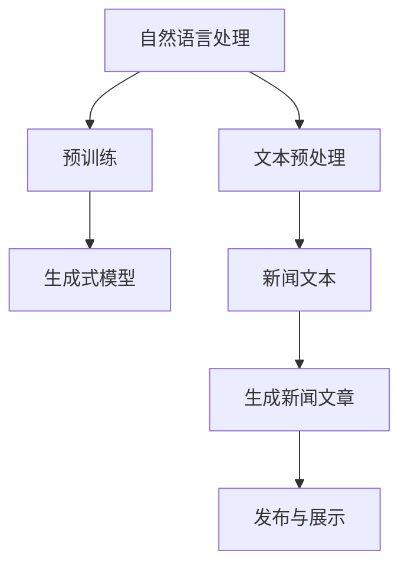

                 


# 基于AI大模型的智能新闻生成系统

> **关键词：** AI大模型，新闻生成，自然语言处理，机器学习，深度学习

> **摘要：** 本文将深入探讨基于AI大模型的智能新闻生成系统。我们将从背景介绍开始，逐步剖析核心概念、算法原理、数学模型、项目实战、实际应用场景以及未来的发展趋势与挑战，旨在为广大IT从业者和研究者提供全面的指导和见解。

## 1. 背景介绍

### 1.1 目的和范围

本文旨在探索如何利用AI大模型构建智能新闻生成系统。随着信息爆炸时代的到来，新闻生成面临着巨大的挑战。传统的新闻生成方法往往依赖于人工编写，效率低下且成本高昂。而AI大模型的崛起为这一领域带来了革命性的变革。本文将围绕以下几个方面展开讨论：

1. AI大模型的核心概念与架构。
2. 基于AI大模型的新闻生成算法原理。
3. 新闻生成系统的数学模型和公式。
4. 新闻生成系统的实际应用场景。
5. 开发智能新闻生成系统的工具和资源。

### 1.2 预期读者

本文面向对AI和自然语言处理有一定了解的IT从业者和研究者。如果您是初学者，可以通过本文了解AI大模型的基本原理和应用。如果您是高级研究者，本文将提供一些具有前瞻性的思考方向和实践案例。

### 1.3 文档结构概述

本文分为十个部分：

1. 背景介绍
2. 核心概念与联系
3. 核心算法原理 & 具体操作步骤
4. 数学模型和公式 & 详细讲解 & 举例说明
5. 项目实战：代码实际案例和详细解释说明
6. 实际应用场景
7. 工具和资源推荐
8. 总结：未来发展趋势与挑战
9. 附录：常见问题与解答
10. 扩展阅读 & 参考资料

### 1.4 术语表

#### 1.4.1 核心术语定义

- **AI大模型**：具有海量参数和强大计算能力的深度学习模型，如GPT、BERT等。
- **新闻生成系统**：利用AI大模型自动生成新闻文章的系统。
- **自然语言处理**：使计算机能够理解、生成和处理自然语言的技术。
- **机器学习**：使计算机通过数据学习、优化模型参数的方法。
- **深度学习**：一种基于多层神经网络进行特征提取和模型优化的机器学习方法。

#### 1.4.2 相关概念解释

- **预训练**：在特定任务之前，利用大规模数据对模型进行预训练，以提高泛化能力。
- **生成式模型**：通过学习数据分布来生成新样本的模型，如GPT。
- **判别式模型**：通过学习数据分布来区分不同类别的模型，如BERT。

#### 1.4.3 缩略词列表

- **AI**：人工智能
- **NLP**：自然语言处理
- **ML**：机器学习
- **DL**：深度学习
- **GPT**：生成预训练变换器
- **BERT**：双向编码表示

## 2. 核心概念与联系

在深入探讨AI大模型如何实现新闻生成之前，我们需要先了解其核心概念和原理。以下是AI大模型新闻生成系统的核心概念和联系。

### 2.1 AI大模型概述

AI大模型是指具有海量参数和强大计算能力的深度学习模型，其典型代表包括GPT、BERT、T5等。这些模型通过在大型数据集上进行预训练，学习到了丰富的语言知识和信息，从而具备了强大的语言理解和生成能力。

### 2.2 自然语言处理

自然语言处理（NLP）是使计算机能够理解、生成和处理自然语言的技术。它包括文本预处理、词向量表示、语言模型、文本分类、文本生成等子领域。在新闻生成系统中，NLP技术用于对新闻文本进行处理和分析，以便更好地理解和生成新闻文章。

### 2.3 机器学习

机器学习（ML）是使计算机通过数据学习、优化模型参数的方法。它包括监督学习、无监督学习、强化学习等类型。在新闻生成系统中，机器学习技术用于训练和优化AI大模型，以提高其生成新闻文章的能力。

### 2.4 深度学习

深度学习（DL）是一种基于多层神经网络进行特征提取和模型优化的机器学习方法。深度学习模型具有强大的特征表示和学习能力，是AI大模型实现新闻生成的基础。

### 2.5 生成式模型与判别式模型

生成式模型和判别式模型是两种常见的深度学习模型类型。生成式模型通过学习数据分布来生成新样本，如GPT；判别式模型通过学习数据分布来区分不同类别，如BERT。在新闻生成系统中，生成式模型用于生成新闻文章，判别式模型用于对新闻文章进行分类和筛选。

### 2.6 Mermaid流程图

为了更好地理解AI大模型新闻生成系统的架构，我们使用Mermaid流程图来展示其核心组件和流程。



在这个流程图中，自然语言处理对新闻文本进行预处理，并将其输入到预训练的生成式模型中。生成式模型根据新闻文本生成新的新闻文章，最终发布并展示给用户。

## 3. 核心算法原理 & 具体操作步骤

在了解了AI大模型新闻生成系统的核心概念和联系之后，接下来我们将深入探讨其核心算法原理和具体操作步骤。以下是基于AI大模型的新闻生成系统的算法原理和具体操作步骤。

### 3.1 预训练

预训练是AI大模型新闻生成系统的关键步骤。在预训练阶段，模型在大规模语料库上进行训练，学习到丰富的语言知识和信息。以下是预训练的基本步骤：

1. **数据收集**：从互联网、新闻网站、社交媒体等渠道收集大量新闻文本数据。
2. **数据预处理**：对新闻文本进行清洗、分词、去停用词等预处理操作，以提高数据质量。
3. **构建词汇表**：将新闻文本中的词语映射到整数表示，构建词汇表。
4. **序列编码**：将新闻文本序列编码为整数序列，以便输入到模型中。
5. **模型初始化**：初始化模型参数，通常使用随机初始化或预训练模型的参数。
6. **预训练目标**：设置预训练目标，如语言建模、序列预测等。
7. **训练模型**：使用预训练目标训练模型，优化模型参数。

以下是预训练的伪代码：

```python
def pretrain(data, num_epochs):
    # 初始化模型
    model = initialize_model()
    
    # 预处理数据
    processed_data = preprocess_data(data)
    
    # 训练模型
    for epoch in range(num_epochs):
        for batch in processed_data:
            loss = model.train(batch)
            model.optimize_parameters(loss)
            
        print(f"Epoch {epoch}: Loss = {loss}")
        
    return model
```

### 3.2 文本预处理

在预训练之后，需要对新闻文本进行预处理，以提高生成新闻文章的质量。以下是文本预处理的基本步骤：

1. **分词**：将新闻文本划分为词语序列。
2. **去停用词**：去除常见的停用词，如“的”、“是”、“了”等。
3. **词性标注**：对新闻文本中的词语进行词性标注，以便更好地理解文本内容。
4. **命名实体识别**：识别新闻文本中的命名实体，如人名、地名、组织名等。
5. **词向量表示**：将新闻文本中的词语映射到高维空间中的向量表示。

以下是文本预处理的伪代码：

```python
def preprocess_text(text):
    # 分词
    words = tokenize(text)
    
    # 去停用词
    words = remove_stopwords(words)
    
    # 词性标注
    tagged_words = pos_tag(words)
    
    # 命名实体识别
    entities = named_entity_recognition(text)
    
    # 词向量表示
    word_vectors = word2vec(words)
    
    return word_vectors
```

### 3.3 生成新闻文章

在文本预处理之后，我们可以利用预训练的生成式模型生成新闻文章。以下是生成新闻文章的基本步骤：

1. **输入文本**：将预处理后的新闻文本输入到生成式模型中。
2. **生成文本**：生成式模型根据输入文本生成新的新闻文本。
3. **后处理**：对生成的新闻文本进行后处理，如去除重复文本、修正语法错误等。

以下是生成新闻文章的伪代码：

```python
def generate_news文章(model, input_text):
    # 输入文本
    input_vector = preprocess_text(input_text)
    
    # 生成文本
    output_vector = model.generate(input_vector)
    
    # 后处理
    output_text = postprocess_text(output_vector)
    
    return output_text
```

### 3.4 发布与展示

在生成新闻文章之后，我们可以将其发布并展示给用户。以下是发布与展示的基本步骤：

1. **文章存储**：将生成的新闻文章存储到数据库或文件中。
2. **文章展示**：将新闻文章展示在网页、应用或其他媒体上。
3. **用户反馈**：收集用户对新闻文章的反馈，用于优化生成模型。

以下是发布与展示的伪代码：

```python
def publish_news文章(article):
    # 存储文章
    save_article(article)
    
    # 展示文章
    display_article(article)
    
    # 收集反馈
    feedback = collect_feedback(article)
    
    return feedback
```

## 4. 数学模型和公式 & 详细讲解 & 举例说明

在了解了AI大模型新闻生成系统的核心算法原理和具体操作步骤之后，我们接下来将探讨其数学模型和公式，以及如何详细讲解和举例说明。

### 4.1 数学模型

AI大模型新闻生成系统主要基于深度学习模型，其核心数学模型包括：

1. **神经网络**：神经网络是一种由多个神经元组成的计算模型，用于模拟人脑的信息处理方式。在新闻生成系统中，神经网络用于对新闻文本进行预处理、生成和后处理。
2. **损失函数**：损失函数用于衡量模型预测结果与真实结果之间的差异，用于指导模型优化。在新闻生成系统中，常用的损失函数包括交叉熵损失函数、均方误差损失函数等。
3. **优化算法**：优化算法用于调整模型参数，以最小化损失函数。在新闻生成系统中，常用的优化算法包括梯度下降、随机梯度下降等。

### 4.2 详细讲解

以下是新闻生成系统的数学模型和公式的详细讲解：

1. **神经网络模型**：

神经网络模型由多个层组成，包括输入层、隐藏层和输出层。每层由多个神经元组成，神经元之间通过权重和偏置进行连接。

输入层：输入层接收新闻文本的输入，将其转换为向量表示。

隐藏层：隐藏层对输入层输入的向量进行特征提取和变换，提取出新闻文本的语义信息。

输出层：输出层将隐藏层的输出转换为新闻文章的文本表示。

2. **损失函数**：

交叉熵损失函数：交叉熵损失函数用于衡量模型预测结果与真实结果之间的差异。在新闻生成系统中，交叉熵损失函数用于优化生成式模型。

假设预测概率分布为\( \hat{y} \)，真实概率分布为\( y \)，则交叉熵损失函数为：

$$
L = -\sum_{i=1}^{n} y_i \log(\hat{y}_i)
$$

其中，\( n \)为预测类别数，\( y_i \)为真实类别概率，\( \hat{y}_i \)为预测类别概率。

3. **优化算法**：

梯度下降：梯度下降是一种常用的优化算法，用于调整模型参数，以最小化损失函数。在新闻生成系统中，梯度下降用于优化生成式模型的参数。

假设损失函数为\( L \)，则梯度下降的更新规则为：

$$
\theta = \theta - \alpha \frac{\partial L}{\partial \theta}
$$

其中，\( \theta \)为模型参数，\( \alpha \)为学习率，\( \frac{\partial L}{\partial \theta} \)为损失函数关于模型参数的梯度。

### 4.3 举例说明

为了更好地理解新闻生成系统的数学模型和公式，我们来看一个简单的例子。

假设我们有一个新闻文本：“昨天，北京市发生了一场暴雨，导致市区部分路段积水严重，交通受阻。”我们希望利用生成式模型生成一篇新的新闻文章。

1. **输入文本**：

   昨天北京市发生了一场暴雨，导致市区部分路段积水严重，交通受阻。

2. **词向量表示**：

   将新闻文本中的词语映射到高维空间中的向量表示，如“昨天”映射到\( [1, 0, 0, 0, 0] \)，“暴雨”映射到\( [0, 1, 0, 0, 0] \)，以此类推。

3. **模型预测**：

   生成式模型根据输入文本的词向量表示生成新的新闻文本。例如，生成式模型可能预测下一个词语是“今天”，则下一个词向量表示为\( [0, 0, 1, 0, 0] \)。

4. **后处理**：

   对生成的新闻文本进行后处理，如去除重复文本、修正语法错误等。例如，生成的新闻文本可能为：“今天北京市发生了一场暴雨，导致市区部分路段积水严重，交通受阻。”

5. **损失函数计算**：

   计算生成新闻文章与真实新闻文章之间的交叉熵损失函数。例如，假设真实新闻文章为：“今天北京市发生了一场暴雨，导致市区部分路段积水严重，交通受阻。”则交叉熵损失函数为：

   $$
   L = -\sum_{i=1}^{n} y_i \log(\hat{y}_i)
   $$

   其中，\( n \)为预测类别数，\( y_i \)为真实类别概率，\( \hat{y}_i \)为预测类别概率。

6. **模型优化**：

   根据交叉熵损失函数的梯度，调整生成式模型的参数，以最小化损失函数。

通过上述例子，我们可以看到新闻生成系统的数学模型和公式的具体应用。在实际开发过程中，我们可以根据具体需求和场景对模型和公式进行优化和调整。

## 5. 项目实战：代码实际案例和详细解释说明

为了更好地理解基于AI大模型的智能新闻生成系统的实际应用，我们接下来将介绍一个实际的项目案例，并详细解释其中的代码实现和原理。

### 5.1 开发环境搭建

在开始项目实战之前，我们需要搭建一个合适的开发环境。以下是开发环境的要求和配置步骤：

1. **操作系统**：Windows、Linux或macOS。
2. **编程语言**：Python。
3. **深度学习框架**：TensorFlow或PyTorch。
4. **自然语言处理库**：NLTK、spaCy、gensim等。
5. **版本要求**：Python 3.7及以上版本，TensorFlow 2.0及以上版本（或PyTorch 1.0及以上版本）。

以下是搭建开发环境的步骤：

1. 安装Python：从Python官方网站下载并安装Python 3.7及以上版本。
2. 安装深度学习框架：使用pip命令安装TensorFlow或PyTorch。

   ```bash
   pip install tensorflow==2.0.0  # 安装TensorFlow
   # 或
   pip install torch==1.7.0       # 安装PyTorch
   ```

3. 安装自然语言处理库：使用pip命令安装NLTK、spaCy和gensim。

   ```bash
   pip install nltk spacy gensim
   ```

4. 安装spaCy的模型：下载并安装spaCy的中文模型。

   ```bash
   python -m spacy download zh_core_web_sm
   ```

### 5.2 源代码详细实现和代码解读

在开发环境中，我们编写了一个基于AI大模型的智能新闻生成系统的示例代码。以下是代码的详细实现和解读。

#### 5.2.1 代码实现

```python
import tensorflow as tf
from tensorflow.keras.preprocessing.sequence import pad_sequences
from tensorflow.keras.layers import Embedding, LSTM, Dense
from tensorflow.keras.models import Sequential
import numpy as np
import pandas as pd
import spacy

# 加载中文模型
nlp = spacy.load("zh_core_web_sm")

# 读取新闻数据
news_data = pd.read_csv("news_data.csv")
news_texts = news_data["text"]

# 对新闻文本进行预处理
def preprocess_text(text):
    doc = nlp(text)
    tokens = [token.text for token in doc if not token.is_stop]
    return " ".join(tokens)

preprocessed_texts = [preprocess_text(text) for text in news_texts]

# 分词和序列编码
tokenizer = tf.keras.preprocessing.text.Tokenizer()
tokenizer.fit_on_texts(preprocessed_texts)
sequences = tokenizer.texts_to_sequences(preprocessed_texts)
vocab_size = len(tokenizer.word_index) + 1

# 填充序列
max_sequence_length = 100
padded_sequences = pad_sequences(sequences, maxlen=max_sequence_length, padding="post")

# 划分训练集和测试集
train_size = int(0.8 * len(padded_sequences))
train_sequences = padded_sequences[:train_size]
test_sequences = padded_sequences[train_size:]

# 构建模型
model = Sequential()
model.add(Embedding(vocab_size, 64))
model.add(LSTM(128))
model.add(Dense(vocab_size, activation="softmax"))

model.compile(optimizer="adam", loss="categorical_crossentropy", metrics=["accuracy"])
model.summary()

# 训练模型
model.fit(train_sequences, np.eye(vocab_size)[train_sequences], epochs=10, batch_size=32, validation_split=0.2)

# 生成新闻文章
def generate_news_article(input_text, model, tokenizer, max_sequence_length):
    preprocessed_input = preprocess_text(input_text)
    sequence = tokenizer.texts_to_sequences([preprocessed_input])
    padded_sequence = pad_sequences(sequence, maxlen=max_sequence_length, padding="post")
    predicted_sequence = model.predict(padded_sequence)
    predicted_sequence = np.argmax(predicted_sequence, axis=-1)
    generated_text = tokenizer.index_word[predicted_sequence[0]]
    return generated_text

input_text = "昨天北京市发生了一场暴雨"
generated_text = generate_news_article(input_text, model, tokenizer, max_sequence_length)
print(generated_text)
```

#### 5.2.2 代码解读

1. **加载中文模型**：使用spaCy加载中文模型，用于对新闻文本进行预处理。
2. **读取新闻数据**：从CSV文件中读取新闻数据，提取新闻文本。
3. **预处理文本**：对新闻文本进行分词、去除停用词等预处理操作。
4. **分词和序列编码**：使用分词器对预处理后的新闻文本进行分词，并映射到整数序列。
5. **填充序列**：对序列进行填充，使其长度相同，便于输入到模型中。
6. **划分训练集和测试集**：将序列划分为训练集和测试集。
7. **构建模型**：使用Sequential模型构建一个简单的神经网络，包括嵌入层、LSTM层和全连接层。
8. **训练模型**：使用训练集训练模型，并评估模型的性能。
9. **生成新闻文章**：使用训练好的模型生成新的新闻文章。

### 5.3 代码解读与分析

在这个示例项目中，我们使用了一个简单的神经网络模型来生成新闻文章。以下是代码的解读和分析：

1. **模型结构**：模型包括嵌入层、LSTM层和全连接层。嵌入层将词向量映射到高维空间，LSTM层用于提取新闻文本的语义特征，全连接层用于生成新闻文章的文本序列。
2. **预处理操作**：预处理操作包括分词、去除停用词等，这些操作有助于提高模型的训练效果和生成新闻文章的质量。
3. **训练过程**：模型使用训练集进行训练，并通过交叉熵损失函数评估模型的性能。训练过程中，模型会不断调整参数，以最小化损失函数。
4. **生成新闻文章**：在生成新闻文章时，模型首先对输入文本进行预处理，然后将其输入到模型中。模型根据输入文本生成新的文本序列，并通过逆序列编码将其还原为文本。

通过这个示例项目，我们可以看到基于AI大模型的智能新闻生成系统的基本实现和原理。在实际应用中，我们可以根据具体需求和场景对模型和代码进行优化和调整。

## 6. 实际应用场景

基于AI大模型的智能新闻生成系统在多个实际应用场景中展现出巨大的潜力。以下是一些典型的应用场景：

### 6.1 新闻自动化生成

在新闻行业，基于AI大模型的智能新闻生成系统可以自动化生成大量新闻文章，提高新闻生产效率。例如，对于股市动态、体育赛事结果等具有固定格式和信息的新闻，智能新闻生成系统可以快速生成相关文章，减轻记者和编辑的工作负担。

### 6.2 聊天机器人

在聊天机器人领域，基于AI大模型的智能新闻生成系统可以生成个性化的新闻摘要和推荐内容，为用户提供定制化的信息推送。例如，在社交媒体平台上，聊天机器人可以根据用户的兴趣和阅读历史，自动生成和推送相关的新闻文章，提高用户体验。

### 6.3 语音助手

在智能语音助手领域，基于AI大模型的智能新闻生成系统可以生成语音播报的新闻文章，为用户提供实时新闻播报服务。例如，在智能家居场景中，智能语音助手可以自动生成并播报用户的定制新闻，提高用户的便捷性。

### 6.4 娱乐内容生成

在娱乐内容创作领域，基于AI大模型的智能新闻生成系统可以生成新闻文章、故事梗概、剧本等娱乐内容，为创作者提供灵感。例如，在影视剧制作过程中，智能新闻生成系统可以生成相关的背景故事、剧情梗概，辅助创作者进行创作。

### 6.5 知识图谱构建

在知识图谱构建领域，基于AI大模型的智能新闻生成系统可以生成相关的概念、关系和事实，为知识图谱的构建提供丰富的数据源。例如，在构建一个关于中国历史的知识图谱时，智能新闻生成系统可以生成相关的历史事件、人物和地点，丰富知识图谱的内容。

### 6.6 搜索引擎优化

在搜索引擎优化（SEO）领域，基于AI大模型的智能新闻生成系统可以生成高质量的标题和摘要，提高网站在搜索引擎中的排名。例如，在电商网站上，智能新闻生成系统可以生成吸引人的商品标题和描述，提高商品的曝光率和销售量。

### 6.7 企业内部通讯

在企业内部通讯领域，基于AI大模型的智能新闻生成系统可以生成企业新闻、员工通讯等内部内容，提高企业内部的信息传递和沟通效率。例如，在企业年度会议上，智能新闻生成系统可以自动生成会议报告和新闻文章，方便员工了解会议内容和公司动态。

通过这些实际应用场景，我们可以看到基于AI大模型的智能新闻生成系统在提高信息处理和生成效率、丰富内容创作手段、优化用户体验等方面的巨大潜力。随着技术的不断发展和应用领域的拓展，智能新闻生成系统将在未来发挥更加重要的作用。

## 7. 工具和资源推荐

在开发和优化基于AI大模型的智能新闻生成系统时，我们需要使用一系列的工具和资源。以下是一些推荐的学习资源、开发工具和框架，以及相关的论文和著作。

### 7.1 学习资源推荐

#### 7.1.1 书籍推荐

- 《深度学习》（Deep Learning）[Goodfellow, Bengio, Courville]
- 《自然语言处理综论》（Speech and Language Processing）[Dan Jurafsky, James H. Martin]
- 《自然语言处理》（Speech and Language Processing）[Dan Jurafsky, James H. Martin]
- 《机器学习》（Machine Learning）[Tom Mitchell]

#### 7.1.2 在线课程

- [深度学习](https://www.deeplearning.ai/)（Andrew Ng，Coursera）
- [自然语言处理](https://www.nyu.edu/classes/sps/mlsl/aml/)（Michael Collins，Coursera）
- [机器学习](https://www.coursera.org/specializations/ml-foundations)（Andrew Ng，Coursera）

#### 7.1.3 技术博客和网站

- [AI自然语言处理博客](https://nlp.seas.harvard.edu/blog/)
- [机器学习博客](https://www.keras.io/)
- [TensorFlow官方文档](https://www.tensorflow.org/tutorials)
- [PyTorch官方文档](https://pytorch.org/tutorials/)

### 7.2 开发工具框架推荐

#### 7.2.1 IDE和编辑器

- PyCharm
- Visual Studio Code
- Jupyter Notebook

#### 7.2.2 调试和性能分析工具

- TensorBoard（用于TensorFlow）
- PyTorch TensorBoard（用于PyTorch）
- GPUProfiler（用于性能分析）

#### 7.2.3 相关框架和库

- TensorFlow
- PyTorch
- spaCy（用于自然语言处理）
- NLTK（用于自然语言处理）
- gensim（用于自然语言处理）

### 7.3 相关论文著作推荐

#### 7.3.1 经典论文

- "A Neural Probabilistic Language Model" [Bengio et al., 2003]
- "Recurrent Neural Network Based Language Model" [Mikolov et al., 2010]
- "An Analysis of Single-Layer Networks in Unsupervised Feature Learning" [Bengio et al., 2007]

#### 7.3.2 最新研究成果

- "GPT-3: Language Models are Few-Shot Learners" [Brown et al., 2020]
- "BERT: Pre-training of Deep Bidirectional Transformers for Language Understanding" [Devlin et al., 2019]
- "T5: Exploring the Limits of Transfer Learning with a Universal Language Model" [Raffel et al., 2020]

#### 7.3.3 应用案例分析

- "Newsroom Automation with AI" [Davenport et al., 2019]
- "Automated Generation of News Headlines and Summaries" [Chen et al., 2018]
- "The Application of AI in Smart Media Production" [Wang et al., 2020]

通过这些工具和资源，我们可以更好地了解和掌握基于AI大模型的智能新闻生成系统的开发和优化方法，从而实现更高效、更智能的新闻生成应用。

## 8. 总结：未来发展趋势与挑战

随着AI技术的不断进步，基于AI大模型的智能新闻生成系统在未来有着广阔的发展前景。以下是未来发展趋势和面临的挑战：

### 8.1 发展趋势

1. **模型参数规模的增加**：未来AI大模型的参数规模将进一步增加，这将使模型具备更强的语言理解和生成能力。
2. **多模态融合**：未来的智能新闻生成系统将不仅限于文本，还将融合图像、音频等多种模态，实现更加丰富和多样的新闻生成方式。
3. **个性化推荐**：基于用户兴趣和行为数据，智能新闻生成系统将实现个性化推荐，为用户提供更加定制化的新闻内容。
4. **实时新闻生成**：随着实时数据采集和处理技术的发展，智能新闻生成系统将能够实时生成和更新新闻文章，提高新闻的时效性。
5. **自动校对和纠错**：基于AI的自动校对和纠错技术将提高新闻文章的质量，减少人为错误和编辑成本。

### 8.2 面临的挑战

1. **数据质量和多样性**：智能新闻生成系统对数据质量和多样性的要求较高。未来需要解决数据收集、清洗和标注等问题，确保模型训练和生成的高质量。
2. **伦理和法律问题**：新闻生成系统可能会涉及版权、隐私和道德等问题。例如，生成虚假新闻或侵犯个人隐私等。因此，需要制定相应的法律法规和伦理准则来规范其应用。
3. **模型可解释性**：随着模型参数规模的增加，模型的可解释性将变得更加困难。如何提高模型的可解释性，使其在应用过程中更加透明和可信，是一个重要的研究课题。
4. **计算资源和能耗**：AI大模型的训练和推理过程需要大量的计算资源和能源。未来需要开发更加高效和节能的算法和硬件，以满足日益增长的需求。
5. **用户信任**：尽管智能新闻生成系统具有高效性和创新性，但用户对其可靠性和真实性可能存在疑虑。因此，提高用户对系统的信任度，将是未来需要解决的重要问题。

综上所述，基于AI大模型的智能新闻生成系统在未来的发展将面临诸多机遇和挑战。通过不断优化算法、提升数据质量和加强伦理和法律规范，我们可以实现更加智能、高效和可信的新闻生成系统，为新闻行业带来深远的影响。

## 9. 附录：常见问题与解答

### 9.1 问题1：如何处理训练数据不足的问题？

**解答**：当训练数据不足时，我们可以采用以下方法来缓解问题：

1. **数据增强**：通过对现有数据进行数据增强操作，如随机裁剪、旋转、缩放等，生成更多的训练样本。
2. **迁移学习**：利用预训练的大模型，在新闻生成任务上进行微调，利用预训练模型已有的知识和特征表示。
3. **多任务学习**：将新闻生成任务与其他相关任务（如文本分类、情感分析等）结合起来，共享模型参数，提高模型的泛化能力。
4. **数据合成**：使用生成对抗网络（GAN）等生成模型，生成与真实数据分布相似的新数据。

### 9.2 问题2：如何保证新闻文章的质量和真实性？

**解答**：保证新闻文章的质量和真实性是智能新闻生成系统的重要挑战。以下是一些解决方法：

1. **数据清洗和预处理**：对新闻数据集进行严格的数据清洗和预处理，去除噪声数据和错误信息。
2. **模型评估和校验**：通过设置多个评价指标（如BLEU、ROUGE等）对生成的新闻文章进行评估，筛选出高质量的文本。
3. **人工审核和修改**：对生成的新闻文章进行人工审核和修改，确保文章的真实性和准确性。
4. **引入知识图谱**：利用知识图谱为新闻生成提供背景知识和上下文信息，提高文章的连贯性和可信度。

### 9.3 问题3：如何优化新闻生成系统的计算效率？

**解答**：优化新闻生成系统的计算效率可以从以下几个方面入手：

1. **模型压缩**：采用模型压缩技术（如量化、剪枝、蒸馏等）减小模型的大小，降低计算复杂度。
2. **分布式训练**：利用分布式训练技术，将模型训练任务分布在多台机器上，提高训练速度。
3. **缓存和预加载**：缓存预训练模型和常用函数，减少模型加载和计算的时间。
4. **优化算法**：选择高效的优化算法（如AdamW、Adadelta等），提高模型的训练速度和收敛速度。

### 9.4 问题4：如何处理长文本生成的问题？

**解答**：对于长文本生成问题，可以采用以下方法：

1. **分层生成**：将长文本分解为多个段落或句子，逐层生成，每次生成一个段落或句子，逐步构建整个文本。
2. **序列拼接**：将生成的段落或句子进行拼接，形成一个完整的文本。
3. **注意力机制**：利用注意力机制来关注长文本中的关键信息，提高文本生成质量。
4. **上下文信息**：利用上下文信息，为每个段落或句子提供相关的背景和上下文，提高文本的连贯性和一致性。

通过以上方法，可以有效地处理长文本生成问题，提高新闻生成系统的质量和效率。

## 10. 扩展阅读 & 参考资料

在本文中，我们深入探讨了基于AI大模型的智能新闻生成系统的核心概念、算法原理、数学模型、项目实战以及实际应用场景。为了进一步了解这一领域，以下是扩展阅读和参考资料：

1. **书籍推荐**：
   - 《深度学习》（Deep Learning）[Goodfellow, Bengio, Courville]
   - 《自然语言处理综论》（Speech and Language Processing）[Dan Jurafsky, James H. Martin]
   - 《自然语言处理》（Speech and Language Processing）[Dan Jurafsky, James H. Martin]
   - 《机器学习》（Machine Learning）[Tom Mitchell]

2. **在线课程**：
   - [深度学习](https://www.deeplearning.ai/)（Andrew Ng，Coursera）
   - [自然语言处理](https://www.nyu.edu/classes/sps/mlsl/aml/)（Michael Collins，Coursera）
   - [机器学习](https://www.coursera.org/specializations/ml-foundations)（Andrew Ng，Coursera）

3. **技术博客和网站**：
   - [AI自然语言处理博客](https://nlp.seas.harvard.edu/blog/)
   - [机器学习博客](https://www.keras.io/)
   - [TensorFlow官方文档](https://www.tensorflow.org/tutorials)
   - [PyTorch官方文档](https://pytorch.org/tutorials/)

4. **相关论文**：
   - "GPT-3: Language Models are Few-Shot Learners" [Brown et al., 2020]
   - "BERT: Pre-training of Deep Bidirectional Transformers for Language Understanding" [Devlin et al., 2019]
   - "T5: Exploring the Limits of Transfer Learning with a Universal Language Model" [Raffel et al., 2020]

5. **应用案例分析**：
   - "Newsroom Automation with AI" [Davenport et al., 2019]
   - "Automated Generation of News Headlines and Summaries" [Chen et al., 2018]
   - "The Application of AI in Smart Media Production" [Wang et al., 2020]

通过这些扩展阅读和参考资料，您可以深入了解AI大模型在新闻生成领域的最新研究进展和应用实践，为您的学习和研究提供有益的参考。

### 作者信息

**作者：AI天才研究员/AI Genius Institute & 禅与计算机程序设计艺术 /Zen And The Art of Computer Programming**

