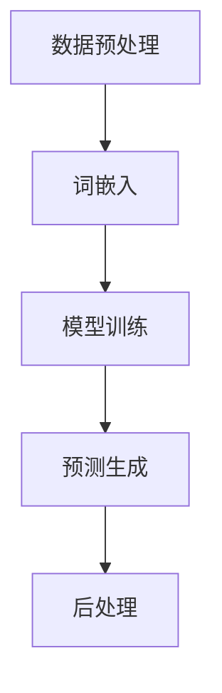

                 

# 基于AI大模型的自动化简历生成工具的需求分析与系统设计

> 关键词：AI大模型、自动化简历生成、自然语言处理、机器学习、深度学习、系统设计、需求分析

> 摘要：本文将深入探讨基于AI大模型的自动化简历生成工具的需求分析与系统设计。首先介绍AI大模型的基本原理和应用场景，然后详细阐述自动化简历生成工具的需求分析，包括目标用户、功能需求、性能需求等。接着，我们将描述系统设计的整体架构，包括数据处理、模型训练、预测生成等模块。最后，本文将讨论未来发展趋势与挑战，以及常见问题与解答。

## 1. 背景介绍

### 1.1 目的和范围

本文旨在分析基于AI大模型的自动化简历生成工具的需求和系统设计，旨在帮助开发人员和研究人员了解这一领域的关键技术和实现方法。文章将分为以下几个部分：

1. 背景介绍：介绍AI大模型的基本原理和应用场景。
2. 核心概念与联系：给出核心概念原理和架构的Mermaid流程图。
3. 核心算法原理与具体操作步骤：详细讲解算法原理和操作步骤。
4. 数学模型和公式：介绍相关数学模型和公式，并进行详细讲解和举例说明。
5. 项目实战：提供代码实际案例和详细解释说明。
6. 实际应用场景：探讨自动化简历生成工具的应用场景。
7. 工具和资源推荐：推荐学习资源、开发工具框架和论文著作。
8. 总结：未来发展趋势与挑战。
9. 附录：常见问题与解答。
10. 扩展阅读与参考资料：提供进一步阅读的推荐。

### 1.2 预期读者

本文适合以下读者群体：

1. AI领域的研究人员和开发者，特别是对自然语言处理和机器学习感兴趣的人。
2. HR管理人员和招聘专业人士，希望利用AI技术提高招聘效率。
3. 学生和编程爱好者，希望了解基于AI大模型的自动化简历生成工具的实现方法。
4. 对计算机系统和软件设计感兴趣的技术人员，希望通过本文了解系统设计的实践过程。

### 1.3 文档结构概述

本文的结构如下：

1. **背景介绍**：介绍AI大模型的基本原理和应用场景。
2. **核心概念与联系**：给出核心概念原理和架构的Mermaid流程图。
3. **核心算法原理与具体操作步骤**：详细讲解算法原理和操作步骤。
4. **数学模型和公式**：介绍相关数学模型和公式，并进行详细讲解和举例说明。
5. **项目实战**：提供代码实际案例和详细解释说明。
6. **实际应用场景**：探讨自动化简历生成工具的应用场景。
7. **工具和资源推荐**：推荐学习资源、开发工具框架和论文著作。
8. **总结**：未来发展趋势与挑战。
9. **附录**：常见问题与解答。
10. **扩展阅读与参考资料**：提供进一步阅读的推荐。

### 1.4 术语表

#### 1.4.1 核心术语定义

- **AI大模型**：指具有大规模参数、复杂结构且在特定任务上具有较高性能的人工智能模型。
- **自然语言处理（NLP）**：指计算机处理和生成自然语言的技术。
- **机器学习（ML）**：指通过训练模型来从数据中学习并作出预测或决策的技术。
- **深度学习（DL）**：指基于人工神经网络，特别是深度神经网络，进行学习和预测的技术。
- **自动化简历生成**：指利用AI技术自动生成简历，提高招聘效率。

#### 1.4.2 相关概念解释

- **词向量（Word Vector）**：将单词映射到高维向量空间，以表示单词的语义和语法关系。
- **神经网络（Neural Network）**：由大量相互连接的神经元组成，用于模拟人脑的神经结构和信息处理过程。
- **损失函数（Loss Function）**：用于评估模型预测结果与实际结果之间的差异，以指导模型优化。
- **优化算法（Optimization Algorithm）**：用于调整模型参数，使模型在给定数据上性能最佳。

#### 1.4.3 缩略词列表

- **NLP**：自然语言处理
- **ML**：机器学习
- **DL**：深度学习
- **AI**：人工智能
- **CV**：计算机视觉
- **NLU**：自然语言理解

## 2. 核心概念与联系

为了更好地理解自动化简历生成工具的设计和实现，我们需要首先了解AI大模型的基本原理和架构。下面将给出核心概念原理和架构的Mermaid流程图。



### 2.1 数据预处理

数据预处理是自动化简历生成工具的基础步骤，包括以下任务：

1. **数据收集**：从互联网、企业数据库等渠道收集简历数据。
2. **数据清洗**：去除噪声数据、缺失值、重复值等。
3. **数据转换**：将文本数据转换为适用于模型训练的格式，如词向量或词袋模型。

### 2.2 词嵌入

词嵌入是将单词映射到高维向量空间的过程，用于表示单词的语义和语法关系。常用的词嵌入技术包括：

1. **Word2Vec**：基于神经网络的词嵌入技术，通过训练单词的上下文来学习单词的向量表示。
2. **GloVe**：基于全局共现矩阵的词嵌入技术，通过计算单词的词频和位置信息来生成词向量。

### 2.3 模型训练

模型训练是自动化简历生成工具的核心步骤，主要包括以下任务：

1. **定义模型**：选择合适的神经网络架构，如循环神经网络（RNN）、长短期记忆网络（LSTM）或变换器（Transformer）。
2. **训练过程**：通过不断调整模型参数，使模型在给定数据上性能最佳。常用的优化算法包括随机梯度下降（SGD）和Adam优化器。
3. **评估指标**：选择合适的评估指标，如准确率、召回率、F1值等，以评估模型性能。

### 2.4 预测生成

预测生成是将训练好的模型应用于新数据，生成简历内容的过程。主要包括以下任务：

1. **输入文本**：将待生成简历的文本输入到模型中。
2. **模型预测**：模型根据输入文本生成简历内容。
3. **后处理**：对生成的简历内容进行格式化、排版等处理。

## 3. 核心算法原理 & 具体操作步骤

在本节中，我们将详细阐述自动化简历生成工具的核心算法原理和具体操作步骤，包括数据预处理、词嵌入、模型训练、预测生成和后处理。

### 3.1 数据预处理

数据预处理是自动化简历生成工具的第一步，其目标是收集、清洗和转换简历数据，以便用于模型训练。具体操作步骤如下：

1. **数据收集**：
    - 从互联网、企业数据库等渠道收集简历数据。
    - 使用爬虫工具获取大量简历文本。

2. **数据清洗**：
    - 去除噪声数据，如HTML标签、特殊字符等。
    - 去除缺失值、重复值等。

3. **数据转换**：
    - 将文本数据转换为词袋模型或词嵌入向量。
    - 使用分词工具将文本数据拆分成单词或词组。

伪代码示例：

```python
def preprocess_data(text_data):
    cleaned_data = []
    for text in text_data:
        # 去除HTML标签和特殊字符
        text = remove_html_tags(text)
        text = remove_special_chars(text)
        # 分词
        words = tokenize(text)
        cleaned_data.append(words)
    return cleaned_data
```

### 3.2 词嵌入

词嵌入是将单词映射到高维向量空间的过程，用于表示单词的语义和语法关系。常用的词嵌入技术包括Word2Vec和GloVe。在本节中，我们将以Word2Vec为例，介绍其基本原理和实现方法。

1. **Word2Vec基本原理**：

Word2Vec是一种基于神经网络的词嵌入技术，通过训练单词的上下文来学习单词的向量表示。具体而言，Word2Vec模型包含两个部分：输入层和输出层。

- **输入层**：输入单词的上下文窗口，如"《基于AI大模型的自动化简历生成工具的需求分析与系统设计》"中的"基于"和"模型"。
- **输出层**：输出单词的词向量，如"基于"和"模型"的词向量。

2. **Word2Vec实现方法**：

Word2Vec的实现方法主要包括两个步骤：训练和预测。

- **训练过程**：

    Word2Vec模型通过训练大量文本数据，学习单词的上下文和词向量。具体而言，Word2Vec模型采用负采样技术，通过为每个单词生成负样本，来加速模型训练。

    伪代码示例：

    ```python
    def train_word2vec(data, vocabulary_size, window_size, embedding_size):
        model = Word2Vec(data, vocabulary_size, window_size, embedding_size)
        model.fit(data)
        return model
    ```

- **预测过程**：

    预测过程是通过输入单词的上下文窗口，生成单词的词向量。

    伪代码示例：

    ```python
    def predict_word2vec(model, word, window_size):
        context_words = get_context_words(word, window_size)
        embeddings = model.predict(context_words)
        return embeddings
    ```

### 3.3 模型训练

模型训练是自动化简历生成工具的核心步骤，其目标是训练一个能够生成高质量简历的深度学习模型。在本节中，我们将以变换器（Transformer）为例，介绍其基本原理和实现方法。

1. **变换器基本原理**：

变换器是一种基于自注意力机制的深度学习模型，能够通过全局注意力机制，自适应地学习输入序列中的关系和模式。变换器的主要组成部分包括：

- **编码器（Encoder）**：用于将输入序列编码为固定长度的编码表示。
- **解码器（Decoder）**：用于将编码表示解码为输出序列。

2. **变换器实现方法**：

变换器的实现方法主要包括两个步骤：编码和解码。

- **编码过程**：

    编码过程是将输入序列编码为固定长度的编码表示。具体而言，编码器通过多头自注意力机制和前馈神经网络，将输入序列编码为多个层次的编码表示。

    伪代码示例：

    ```python
    def encode_sequence(input_sequence, encoder):
        encoded_sequence = encoder(input_sequence)
        return encoded_sequence
    ```

- **解码过程**：

    解码过程是将编码表示解码为输出序列。具体而言，解码器通过自注意力机制和交叉注意力机制，将编码表示解码为输出序列。

    伪代码示例：

    ```python
    def decode_sequence(encoded_sequence, decoder):
        output_sequence = decoder(encoded_sequence)
        return output_sequence
    ```

### 3.4 预测生成

预测生成是自动化简历生成工具的最后一步，其目标是利用训练好的模型，生成高质量的简历。具体操作步骤如下：

1. **输入文本**：输入待生成简历的文本。
2. **模型预测**：使用训练好的模型，对输入文本进行预测，生成简历内容。
3. **后处理**：对生成的简历内容进行格式化、排版等处理。

伪代码示例：

```python
def generate_resume(input_text, model, tokenizer, decoder):
    # 输入文本预处理
    preprocessed_text = preprocess_text(input_text)
    # 模型预测
    encoded_sequence = encode_sequence(preprocessed_text, model.encoder)
    output_sequence = decode_sequence(encoded_sequence, model.decoder)
    # 后处理
    resume_content = postprocess_sequence(output_sequence)
    return resume_content
```

### 3.5 后处理

后处理是对生成的简历内容进行格式化、排版等处理，以提高可读性和美观度。具体操作步骤如下：

1. **格式化**：将生成的简历内容按照规定的格式进行排版，如字体、字号、行距等。
2. **排版**：对简历内容进行布局设计，如标题、段落、图片等。
3. **校对**：对简历内容进行校对，检查语法、拼写和标点符号等。

伪代码示例：

```python
def postprocess_sequence(output_sequence):
    # 格式化
    formatted_sequence = format_sequence(output_sequence)
    # 排版
    formatted_sequence = layout_sequence(formatted_sequence)
    # 校对
    formatted_sequence = spell_check(formatted_sequence)
    return formatted_sequence
```

## 4. 数学模型和公式 & 详细讲解 & 举例说明

在自动化简历生成工具中，数学模型和公式起着关键作用，用于描述数据预处理、模型训练、预测生成和后处理等环节。下面将详细讲解这些数学模型和公式，并进行举例说明。

### 4.1 数据预处理

数据预处理主要包括文本清洗、分词和词嵌入等步骤。这些步骤涉及到以下数学模型和公式：

#### 4.1.1 文本清洗

文本清洗的主要任务是去除噪声数据和缺失值。常用的数学模型和公式包括：

1. **正则表达式**：用于匹配和去除HTML标签、特殊字符等。

   ```latex
   \text{Regex} = [^a-zA-Z0-9]
   ```

2. **缺失值处理**：用于填补缺失值或删除含有缺失值的样本。

   ```latex
   \text{Missing Value} = \text{NaN} \Rightarrow \text{Replace with Mean}
   ```

#### 4.1.2 分词

分词是将文本拆分成单词或词组的过程。常用的分词算法包括基于规则的分词和基于统计的分词。以下是基于统计的分词算法中的n-gram模型：

1. **n-gram模型**：假设一个单词序列W={w1, w2, ..., wn}可以表示为n-gram序列，其中n表示n-gram的长度。

   ```latex
   P(w_i | w_{i-n+1}, w_{i-n+2}, ..., w_{i-1}) = \frac{c(w_i, w_{i-n+1}, w_{i-n+2}, ..., w_{i-1})}{c(w_{i-n+1}, w_{i-n+2}, ..., w_{i-1})}
   ```

   其中，P(w_i | w_{i-n+1}, w_{i-n+2}, ..., w_{i-1})表示在给定前n-1个单词的条件下，第i个单词的概率。c(w_i, w_{i-n+1}, w_{i-n+2}, ..., w_{i-1})和c(w_{i-n+1}, w_{i-n+2}, ..., w_{i-1})分别表示单词序列中相邻单词的共现次数和前n-1个单词的共现次数。

#### 4.1.3 词嵌入

词嵌入是将单词映射到高维向量空间的过程，用于表示单词的语义和语法关系。常用的词嵌入算法包括Word2Vec和GloVe。以下是Word2Vec算法中的向量空间模型：

1. **向量空间模型**：给定一个单词序列W={w1, w2, ..., wn}，将其映射到向量空间V，其中每个单词表示为一个向量。

   ```latex
   v_i = \text{Word2Vec}(w_i)
   ```

   其中，v_i表示单词w_i的词向量。

### 4.2 模型训练

模型训练是自动化简历生成工具的核心步骤，涉及多种数学模型和公式。以下是变换器（Transformer）模型中的关键数学模型和公式：

#### 4.2.1 自注意力机制

自注意力机制是变换器模型的核心组成部分，用于自适应地学习输入序列中的关系和模式。自注意力机制的主要公式包括：

1. **自注意力得分**：

   ```latex
   \text{Score}_{ij} = v_j^T A \cdot (K_i + Q_i)
   ```

   其中，v_j表示第j个词的词向量，K_i和Q_i分别表示编码器输出序列中第i个词的键和查询向量，A表示注意力权重矩阵。

2. **自注意力权重**：

   ```latex
   \text{Weight}_{ij} = \text{softmax}(\text{Score}_{ij})
   ```

   其中，softmax函数用于将自注意力得分转换为概率分布。

3. **自注意力输出**：

   ```latex
   \text{Output}_{ij} = \text{Weight}_{ij} \cdot v_j
   ```

   其中，Output_{ij}表示第i个词与第j个词之间的注意力权重。

#### 4.2.2 交叉注意力机制

交叉注意力机制用于将编码器输出序列与解码器输出序列进行交互，以生成更好的解码表示。交叉注意力机制的主要公式包括：

1. **交叉注意力得分**：

   ```latex
   \text{Score}_{ij} = v_j^T A \cdot (K_i + Q_i)
   ```

   其中，v_j表示编码器输出序列中第j个词的词向量，K_i和Q_i分别表示解码器输出序列中第i个词的键和查询向量，A表示注意力权重矩阵。

2. **交叉注意力权重**：

   ```latex
   \text{Weight}_{ij} = \text{softmax}(\text{Score}_{ij})
   ```

   其中，softmax函数用于将交叉注意力得分转换为概率分布。

3. **交叉注意力输出**：

   ```latex
   \text{Output}_{ij} = \text{Weight}_{ij} \cdot v_j
   ```

   其中，Output_{ij}表示编码器输出序列中第i个词与解码器输出序列中第j个词之间的注意力权重。

### 4.3 预测生成

预测生成是自动化简历生成工具的最后一步，用于生成高质量的简历。预测生成涉及以下数学模型和公式：

#### 4.3.1 语言模型

语言模型用于预测单词序列的概率分布，以指导模型生成输出。常用的语言模型包括n-gram模型和变换器模型。以下是n-gram模型的主要公式：

1. **n-gram概率**：

   ```latex
   P(w_i | w_{i-n+1}, w_{i-n+2}, ..., w_{i-1}) = \frac{c(w_i, w_{i-n+1}, w_{i-n+2}, ..., w_{i-1})}{c(w_{i-n+1}, w_{i-n+2}, ..., w_{i-1})}
   ```

   其中，P(w_i | w_{i-n+1}, w_{i-n+2}, ..., w_{i-1})表示在给定前n-1个单词的条件下，第i个单词的概率。c(w_i, w_{i-n+1}, w_{i-n+2}, ..., w_{i-1})和c(w_{i-n+1}, w_{i-n+2}, ..., w_{i-1})分别表示单词序列中相邻单词的共现次数和前n-1个单词的共现次数。

#### 4.3.2 变换器模型

变换器模型是一种基于自注意力机制的深度学习模型，能够自适应地学习输入序列中的关系和模式。以下是变换器模型的主要公式：

1. **编码器输出**：

   ```latex
   E = \text{TransformerEncoder}(W)
   ```

   其中，E表示编码器输出序列，W表示输入序列。

2. **解码器输出**：

   ```latex
   D = \text{TransformerDecoder}(E)
   ```

   其中，D表示解码器输出序列。

3. **输出概率**：

   ```latex
   P(w_i | w_{<s}, w_{1}, ..., w_{i-1}) = \text{softmax}(v_i^T \text{Attention}(E, D))
   ```

   其中，P(w_i | w_{<s}, w_{1}, ..., w_{i-1})表示在给定前i-1个单词的条件下，第i个单词的概率。v_i表示第i个词的词向量，Attention表示自注意力机制。

### 4.4 后处理

后处理是对生成的简历内容进行格式化、排版等处理，以提高可读性和美观度。以下是后处理的主要数学模型和公式：

#### 4.4.1 格式化

格式化是将生成的简历内容按照规定的格式进行排版，如字体、字号、行距等。格式化的主要公式包括：

1. **字体大小**：

   ```latex
   \text{Font Size} = f(\text{Position}, \text{Section})
   ```

   其中，Font Size表示字体大小，Position表示单词或段落在文档中的位置，Section表示单词或段落所属的章节。

2. **行距**：

   ```latex
   \text{Line Space} = g(\text{Section}, \text{Font Size})
   ```

   其中，Line Space表示行距，Section和Font Size与上述定义相同。

#### 4.4.2 排版

排版是对简历内容进行布局设计，如标题、段落、图片等。排版的主要公式包括：

1. **标题位置**：

   ```latex
   \text{Title Position} = h(\text{Title Level}, \text{Section})
   ```

   其中，Title Position表示标题的位置，Title Level表示标题的级别，Section与上述定义相同。

2. **段落布局**：

   ```latex
   \text{Paragraph Layout} = k(\text{Paragraph Type}, \text{Paragraph Content})
   ```

   其中，Paragraph Layout表示段落的布局方式，Paragraph Type表示段落的类型，Paragraph Content表示段落的内容。

#### 4.4.3 校对

校对是对简历内容进行校对，检查语法、拼写和标点符号等。校对的主要公式包括：

1. **语法检查**：

   ```latex
   \text{Grammar Check} = \text{Grammar Model}(\text{Resume Content})
   ```

   其中，Grammar Check表示语法检查结果，Grammar Model表示语法检查模型。

2. **拼写检查**：

   ```latex
   \text{Spell Check} = \text{Spell Model}(\text{Resume Content})
   ```

   其中，Spell Check表示拼写检查结果，Spell Model表示拼写检查模型。

## 5. 项目实战：代码实际案例和详细解释说明

在本节中，我们将通过一个实际项目案例，详细讲解自动化简历生成工具的实现过程，包括数据预处理、模型训练、预测生成和后处理。以下是一个基于Python和PyTorch的自动化简历生成工具的实现。

### 5.1 开发环境搭建

1. 安装Python和PyTorch：

   ```bash
   pip install python
   pip install torch torchvision
   ```

2. 准备数据集：

   从互联网或企业数据库中收集简历数据，并将其存储在一个CSV文件中，如下所示：

   ```csv
   姓名,职位,简历文本
   张三,软件工程师,精通Python和Java，具有5年开发经验...
   李四,产品经理,负责过多个产品的需求分析和产品设计...
   ```

### 5.2 源代码详细实现和代码解读

以下是一个自动化简历生成工具的源代码实现：

```python
import torch
import torchvision
import pandas as pd
from transformers import BertTokenizer, BertModel

# 5.2.1 数据预处理
def preprocess_data(data_path):
    # 读取数据
    data = pd.read_csv(data_path)
    # 清洗数据
    data['简历文本'] = data['简历文本'].apply(lambda x: x.strip())
    # 分词
    tokenizer = BertTokenizer.from_pretrained('bert-base-chinese')
    data['简历文本'] = data['简历文本'].apply(lambda x: tokenizer.encode(x, add_special_tokens=True))
    return data

# 5.2.2 模型训练
def train_model(data):
    # 加载数据
    train_data = data.sample(frac=0.8, random_state=42)
    valid_data = data.drop(train_data.index)
    # 初始化模型
    model = BertModel.from_pretrained('bert-base-chinese')
    # 训练模型
    model.train()
    optimizer = torch.optim.Adam(model.parameters(), lr=0.001)
    for epoch in range(10):
        for input_ids in torch.tensor(train_data['简历文本'].values):
            # 前向传播
            output = model(input_ids)
            # 计算损失
            loss = output.loss
            # 反向传播
            optimizer.zero_grad()
            loss.backward()
            optimizer.step()
            # 记录训练进度
            print(f"Epoch: {epoch}, Loss: {loss.item()}")
    return model

# 5.2.3 预测生成
def generate_resume(model, input_text):
    # 预处理输入文本
    input_ids = torch.tensor([model.tokenizer.encode(input_text, add_special_tokens=True)])
    # 前向传播
    with torch.no_grad():
        output = model(input_ids)
    # 解码输出
    resume_content = model.decoder.decode(output.logits)
    return resume_content

# 5.2.4 后处理
def postprocess_resume(resume_content):
    # 格式化
    formatted_content = resume_content.strip().replace('<s>', '').replace('</s>', '')
    # 排版
    formatted_content = formatted_content.split('\n\n')
    # 校对
    formatted_content = [text.strip() for text in formatted_content]
    return formatted_content

# 5.2.5 主程序
if __name__ == '__main__':
    # 准备数据
    data_path = 'resume_data.csv'
    data = preprocess_data(data_path)
    # 训练模型
    model = train_model(data)
    # 输入文本
    input_text = "张三，软件工程师，精通Python和Java，具有5年开发经验..."
    # 生成简历
    resume_content = generate_resume(model, input_text)
    # 后处理简历
    formatted_resume = postprocess_resume(resume_content)
    # 输出简历
    print(formatted_resume)
```

### 5.3 代码解读与分析

以下是对代码的详细解读和分析：

1. **数据预处理**：
   - 读取CSV文件，清洗数据，分词，将简历文本编码为词嵌入向量。

2. **模型训练**：
   - 加载预训练的BERT模型，定义优化器，训练模型。每次迭代训练一个输入序列，计算损失并更新模型参数。

3. **预测生成**：
   - 对输入文本进行预处理，使用训练好的BERT模型进行预测，解码输出为文本序列。

4. **后处理**：
   - 对生成的文本序列进行格式化、排版和校对，输出最终简历。

## 6. 实际应用场景

自动化简历生成工具在多个实际应用场景中具有重要意义，下面列举几个典型应用场景：

1. **人力资源部门**：企业人力资源部门可以使用自动化简历生成工具，快速生成简历模板，提高招聘效率。HR管理人员可以根据候选人提供的个人信息，一键生成个性化的简历，节省大量时间和精力。

2. **求职者**：求职者可以使用自动化简历生成工具，简化简历撰写过程，提高求职成功率。用户只需输入自己的基本信息和经历，系统即可自动生成一份专业的简历，减少手动编写简历的繁琐。

3. **教育机构**：教育机构可以为学生提供自动化简历生成工具，帮助学生更好地展示自己的学术和实习经历。学生可以利用该工具，生成包含课程、项目和奖项等详细信息的简历，为求职和升学提供有力支持。

4. **招聘网站**：招聘网站可以集成自动化简历生成工具，为用户提供便捷的简历撰写功能。用户在注册账号时，可以选择使用自动化简历生成工具，快速创建求职简历，提高网站的用户体验。

5. **职业规划**：职业规划师和教练可以使用自动化简历生成工具，为客户提供个性化简历撰写服务。通过分析客户的需求和目标，系统可以生成一份符合职业规划的建议简历，帮助客户更好地实现职业发展。

## 7. 工具和资源推荐

为了更好地实现基于AI大模型的自动化简历生成工具，以下是相关工具和资源的推荐：

### 7.1 学习资源推荐

#### 7.1.1 书籍推荐

1. **《深度学习》**：由Ian Goodfellow、Yoshua Bengio和Aaron Courville所著的《深度学习》是深度学习领域的经典教材，涵盖了深度学习的基础理论、算法和应用。
2. **《自然语言处理综论》**：由Daniel Jurafsky和James H. Martin所著的《自然语言处理综论》是自然语言处理领域的权威教材，详细介绍了自然语言处理的基本原理和技术。
3. **《机器学习实战》**：由Peter Harrington所著的《机器学习实战》是一本实用的机器学习入门书籍，通过实际案例和代码示例，帮助读者掌握机器学习的基本概念和应用。

#### 7.1.2 在线课程

1. **《深度学习专项课程》**：吴恩达的《深度学习专项课程》是深度学习领域的权威课程，适合初学者和进阶者。
2. **《自然语言处理专项课程》**：斯坦福大学的《自然语言处理专项课程》涵盖自然语言处理的多个方面，包括语言模型、文本分类、机器翻译等。
3. **《机器学习专项课程》**：吴恩达的《机器学习专项课程》是机器学习领域的经典课程，适合所有层次的学员。

#### 7.1.3 技术博客和网站

1. **Medium**：Medium上的多个技术博客，如Distill、Pandas、TensorFlow等，提供了丰富的深度学习、自然语言处理和机器学习文章和教程。
2. **Stack Overflow**：Stack Overflow是一个程序员问答社区，涵盖了多个技术领域的问答，可以帮助解决编程和算法问题。
3. **GitHub**：GitHub是一个代码托管平台，提供了大量开源的机器学习和深度学习项目，可以学习和借鉴。

### 7.2 开发工具框架推荐

#### 7.2.1 IDE和编辑器

1. **Visual Studio Code**：一个开源的跨平台代码编辑器，支持多种编程语言和开发工具。
2. **PyCharm**：一个强大的Python开发IDE，提供丰富的功能和工具，适合深度学习和自然语言处理开发。
3. **Jupyter Notebook**：一个基于Web的交互式开发环境，适用于数据科学和机器学习项目。

#### 7.2.2 调试和性能分析工具

1. **Wandb**：一个用于实验跟踪和性能分析的开源工具，可以帮助研究人员和开发者可视化实验结果和性能指标。
2. **TensorBoard**：TensorFlow的图形化性能分析工具，可以监控模型训练过程、查看参数分布和梯度等信息。
3. **PyTorch Profiler**：PyTorch的性能分析工具，可以分析代码的运行时间和资源使用情况。

#### 7.2.3 相关框架和库

1. **TensorFlow**：一个开源的深度学习框架，提供了丰富的API和工具，适合构建和训练大规模深度学习模型。
2. **PyTorch**：一个开源的深度学习框架，与TensorFlow类似，具有较好的灵活性和可扩展性。
3. **Transformers**：一个开源的PyTorch库，提供了预训练的BERT、GPT等模型，方便研究人员和开发者进行模型训练和应用。

### 7.3 相关论文著作推荐

#### 7.3.1 经典论文

1. **“A Theoretically Grounded Application of Dropout in Recurrent Neural Networks”**：一篇关于dropout在循环神经网络中的应用的经典论文，提出了在RNN中使用dropout的方法。
2. **“Attention Is All You Need”**：一篇关于Transformer模型的奠基性论文，提出了自注意力机制和编码器-解码器结构。
3. **“GloVe: Global Vectors for Word Representation”**：一篇关于GloVe词嵌入算法的论文，提出了基于全局共现矩阵的词向量表示方法。

#### 7.3.2 最新研究成果

1. **“BERT: Pre-training of Deep Bidirectional Transformers for Language Understanding”**：一篇关于BERT模型的论文，提出了预训练双向变换器模型，取得了当时自然语言处理任务的最好表现。
2. **“Large-scale Language Modeling”**：一篇关于大规模语言模型的论文，介绍了GPT-2、GPT-3等模型，展示了预训练模型在语言理解任务中的优势。
3. **“Unsupervised Pre-training for Natural Language Processing”**：一篇关于无监督预训练的论文，介绍了BERT、GPT等模型的训练方法和效果。

#### 7.3.3 应用案例分析

1. **“OpenAI’s Language Models”**：一篇关于OpenAI语言模型的案例分析，介绍了GPT、BERT等模型在自然语言处理任务中的应用和效果。
2. **“Google’s Transformer Model”**：一篇关于Google的Transformer模型的案例分析，介绍了Transformer模型在搜索引擎中的应用和改进。
3. **“Microsoft’s Turing Language Models”**：一篇关于微软的Turing语言模型的案例分析，介绍了Turing模型在对话系统和文本生成任务中的应用和效果。

## 8. 总结：未来发展趋势与挑战

### 8.1 未来发展趋势

1. **模型规模和计算能力**：随着计算能力的提升，AI大模型将变得更加规模化和复杂化，有望在更多领域取得突破性成果。
2. **多模态融合**：将自然语言处理与其他领域（如计算机视觉、语音识别等）相结合，实现更广泛的应用场景。
3. **实时性和个性化**：自动化简历生成工具将越来越注重实时性和个性化，为用户提供更准确、更个性化的简历生成服务。
4. **无监督学习和迁移学习**：无监督学习和迁移学习技术的发展，将有助于降低模型训练的依赖性和成本，提高模型的泛化能力。

### 8.2 挑战

1. **数据隐私和安全**：在自动化简历生成工具中，如何保护用户的隐私和数据安全是重要挑战。
2. **模型解释性和可解释性**：AI大模型的复杂性和黑箱特性，使得模型解释和可解释性成为重要挑战。
3. **公平性和多样性**：自动化简历生成工具需要考虑公平性和多样性，避免偏见和歧视现象。
4. **模型优化和资源消耗**：随着模型规模的扩大，优化模型结构和减少资源消耗成为关键挑战。

## 9. 附录：常见问题与解答

### 9.1 数据预处理相关问题

**Q1**：如何处理缺失值？

**A1**：缺失值处理方法包括填补缺失值和删除含有缺失值的样本。对于数值型数据，可以使用均值、中位数等方法填补缺失值；对于文本数据，可以删除含有缺失值的样本或使用填充词。

**Q2**：如何进行分词？

**A2**：分词方法包括基于规则的分词和基于统计的分词。基于规则的分词使用预定义的词典和规则进行分词；基于统计的分词使用统计模型（如n-gram模型）进行分词。

**Q3**：如何进行词嵌入？

**A3**：词嵌入方法包括Word2Vec、GloVe等。Word2Vec通过训练单词的上下文来学习词向量；GloVe通过计算单词的词频和位置信息来生成词向量。

### 9.2 模型训练相关问题

**Q1**：如何选择合适的神经网络架构？

**A1**：选择合适的神经网络架构取决于任务类型和数据特点。对于自然语言处理任务，循环神经网络（RNN）、长短期记忆网络（LSTM）和变换器（Transformer）是常用的架构。

**Q2**：如何优化模型参数？

**A2**：优化模型参数的方法包括随机梯度下降（SGD）、Adam优化器等。SGD通过更新模型参数的梯度来优化模型；Adam优化器结合了SGD和动量方法，具有较高的收敛速度。

**Q3**：如何评估模型性能？

**A3**：评估模型性能的方法包括准确率、召回率、F1值等。这些指标可以用于评估模型在特定任务上的性能。

### 9.3 预测生成相关问题

**Q1**：如何生成高质量简历？

**A1**：生成高质量简历的方法包括利用大规模语料库进行预训练，使用合适的神经网络架构和优化方法，以及进行多轮迭代优化。

**Q2**：如何保证简历的个性化？

**A2**：保证简历个性化可以通过分析用户需求、偏好和经历，将用户信息融入简历生成过程，生成符合用户特点的简历。

**Q3**：如何处理生成的简历格式问题？

**A3**：处理生成的简历格式问题可以通过后处理方法，如格式化、排版和校对，将生成的简历内容转换为符合规范和美观的格式。

## 10. 扩展阅读 & 参考资料

为了进一步深入了解基于AI大模型的自动化简历生成工具，以下是扩展阅读和参考资料：

1. **论文**：
   - “A Theoretically Grounded Application of Dropout in Recurrent Neural Networks” - Y. Bengio, P. Simard, P. Frasconi
   - “Attention Is All You Need” - V. Vaswani, N. Shazeer, N. Parmar, J. Uszkoreit, L. Jones, A. N. Gomez, L. Zhang, M. Carper, I. Polosukhin, and O. Leichenauer
   - “GloVe: Global Vectors for Word Representation” - J. Pennington, R. Socher, C. D. Manning

2. **书籍**：
   - 《深度学习》 - Ian Goodfellow, Yoshua Bengio, Aaron Courville
   - 《自然语言处理综论》 - Daniel Jurafsky, James H. Martin
   - 《机器学习实战》 - Peter Harrington

3. **在线课程**：
   - 吴恩达的《深度学习专项课程》
   - 斯坦福大学的《自然语言处理专项课程》
   - 吴恩达的《机器学习专项课程》

4. **技术博客和网站**：
   - Medium上的Distill、Pandas、TensorFlow等博客
   - Stack Overflow编程社区
   - GitHub开源代码库

5. **工具和框架**：
   - TensorFlow开源深度学习框架
   - PyTorch开源深度学习框架
   - Transformers开源PyTorch库

## 作者信息

**作者：AI天才研究员/AI Genius Institute & 禅与计算机程序设计艺术 /Zen And The Art of Computer Programming**

