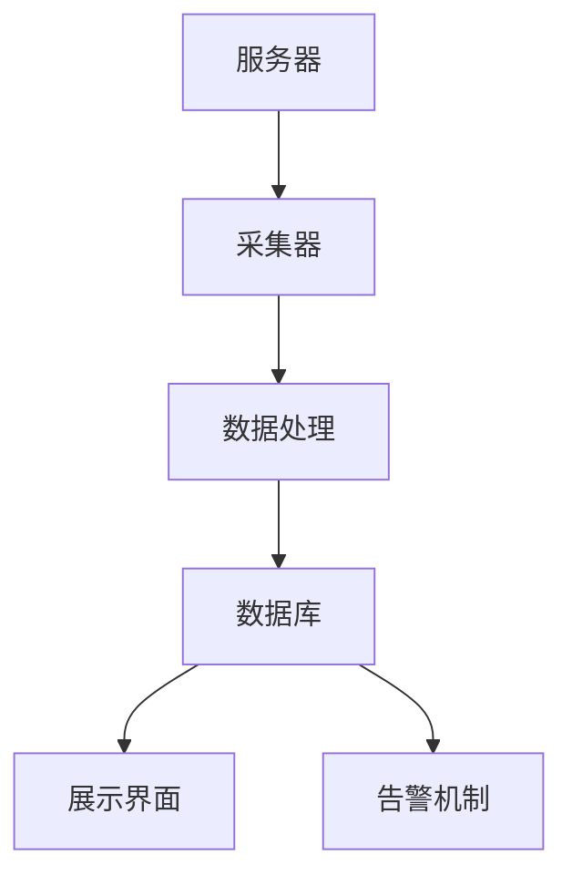
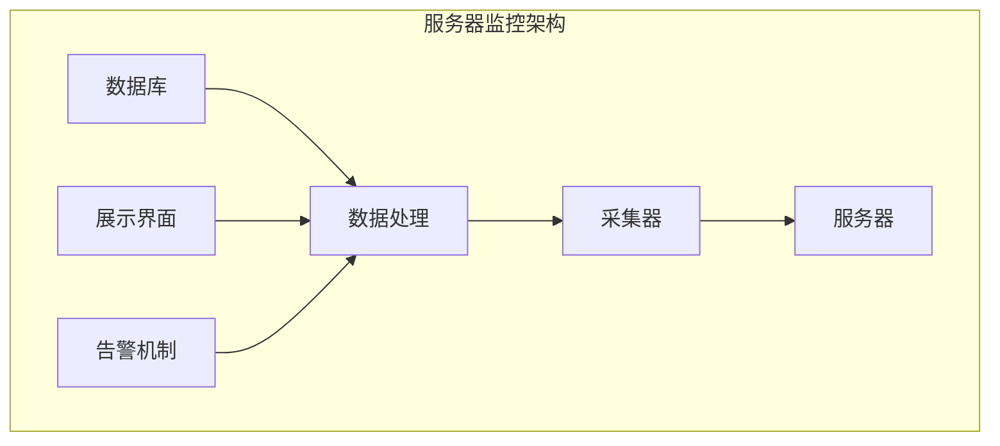

                 

# 基于Django框架的服务器监控系统详细设计与具体代码实现

## 关键词：
Django框架，服务器监控，系统设计，代码实现，性能优化，安全性

## 摘要：
本文将详细介绍如何使用Django框架设计并实现一个高效、稳定的服务器监控系统。我们将从背景介绍、核心概念、算法原理、数学模型、项目实战等多个角度，逐步剖析服务器监控系统的架构与实现。本文旨在为开发者提供一个全面的、易于理解的指南，帮助他们掌握服务器监控系统的设计要点和具体实现方法。

## 1. 背景介绍

### 1.1 目的和范围

随着云计算和虚拟化技术的普及，服务器监控成为保障业务连续性和稳定性的关键环节。本文的目的在于探讨如何使用Django框架构建一个功能完备的服务器监控系统。通过本文的阅读，开发者可以了解到服务器监控系统的基本原理和实现方法，并能够独立开发出自己的监控系统。

本文的范围涵盖：

- 服务器监控的基本概念和原理
- Django框架在服务器监控中的应用
- 服务器监控系统的架构设计
- 具体代码实现和性能优化
- 安全性分析和防范措施

### 1.2 预期读者

本文适合有一定Python编程基础，并希望深入了解Django框架应用场景的开发者。读者应具备基本的Django知识，对后端开发有一定的理解。此外，对于服务器监控、性能优化和安全防范等概念有一定了解将有助于更好地理解本文内容。

### 1.3 文档结构概述

本文结构如下：

1. 背景介绍：介绍服务器监控系统的基本概念和本文的目的。
2. 核心概念与联系：介绍服务器监控系统的核心概念，并通过Mermaid流程图展示系统架构。
3. 核心算法原理 & 具体操作步骤：详细讲解服务器监控系统的算法原理和操作步骤，使用伪代码进行说明。
4. 数学模型和公式 & 详细讲解 & 举例说明：介绍服务器监控中的数学模型和公式，并进行举例说明。
5. 项目实战：通过实际代码案例，展示服务器监控系统的实现过程，并进行详细解释。
6. 实际应用场景：探讨服务器监控系统在不同场景中的应用。
7. 工具和资源推荐：推荐相关学习资源、开发工具和经典论文。
8. 总结：总结本文的主要内容，展望服务器监控系统的未来发展趋势与挑战。
9. 附录：常见问题与解答。
10. 扩展阅读 & 参考资料：提供进一步学习的资源链接。

### 1.4 术语表

#### 1.4.1 核心术语定义

- **Django框架**：一款流行的Python Web框架，用于快速开发和部署应用程序。
- **服务器监控**：对服务器资源使用情况进行实时监控，包括CPU、内存、磁盘等。
- **性能优化**：通过调整服务器配置和代码，提高系统的响应速度和稳定性。
- **安全性**：保障服务器监控系统的安全性，防止数据泄露和攻击。

#### 1.4.2 相关概念解释

- **Nagios**：一款开源的服务器监控工具，常用于服务器性能监控。
- **Zabbix**：一款功能强大的开源监控解决方案，支持多种监控方式和告警机制。
- **Django Rest Framework**：Django的一个扩展框架，用于构建RESTful API。

#### 1.4.3 缩略词列表

- **API**：应用程序接口（Application Programming Interface）
- **RESTful API**：遵循REST风格的API
- **DB**：数据库（Database）
- **Webhook**：一种基于HTTP的协议，用于实现应用程序之间的通信

## 2. 核心概念与联系

### 2.1 核心概念

服务器监控系统的核心概念包括：

- **监控指标**：包括CPU利用率、内存使用率、磁盘I/O、网络流量等。
- **监控目标**：服务器、网络设备、应用程序等。
- **采集器**：用于收集监控指标的程序或脚本。
- **数据处理**：将采集到的监控数据进行处理、存储和展示。
- **告警机制**：当监控指标超出设定阈值时，触发告警通知。

### 2.2 Mermaid流程图

下面是服务器监控系统的基本架构，使用Mermaid流程图表示：



### 2.3 系统架构图

服务器监控系统的架构图如下所示：



## 3. 核心算法原理 & 具体操作步骤

### 3.1 算法原理

服务器监控系统的核心算法原理主要包括：

- **指标采集**：通过轮询或被动监听等方式，获取服务器的监控指标。
- **数据处理**：对采集到的监控数据进行清洗、转换和存储。
- **阈值设置**：根据业务需求，设定各个监控指标的阈值。
- **告警通知**：当监控指标超出阈值时，触发告警通知。

### 3.2 操作步骤

1. **初始化环境**：
    - 安装Python和Django框架。
    - 创建Django项目和应用。

2. **配置数据库**：
    - 配置Django项目的数据库连接信息。
    - 创建数据库表结构。

3. **编写采集器**：
    - 使用Python标准库或第三方库（如psutil）获取监控指标。
    - 编写采集器代码，定期执行监控任务。

4. **数据处理**：
    - 对采集到的监控数据进行处理和存储。
    - 编写数据处理代码，实现对监控数据的分析和管理。

5. **展示界面**：
    - 使用Django的视图和模板，创建监控数据的展示界面。

6. **告警机制**：
    - 根据阈值设置，判断监控指标是否超出阈值。
    - 如果超出阈值，触发告警通知。

### 3.3 伪代码

下面是服务器监控系统的核心算法原理的伪代码：

```python
function monitor_server():
    while True:
        metrics = get_metrics()
        process_metrics(metrics)
        check_thresholds(metrics)
        if is_alert_needed(metrics):
            trigger_alert()

function get_metrics():
    # 使用Python标准库或第三方库获取监控指标
    # 返回一个包含监控指标的字典
    return {}

function process_metrics(metrics):
    # 清洗、转换和存储监控数据
    # 存储到数据库或文件中

function check_thresholds(metrics):
    # 检查监控指标是否超出阈值
    # 如果超出阈值，返回True，否则返回False

function trigger_alert():
    # 触发告警通知
    # 例如发送邮件、短信或Webhook通知
```

## 4. 数学模型和公式 & 详细讲解 & 举例说明

### 4.1 数学模型

服务器监控中常用的数学模型包括：

- **时间序列分析**：用于分析监控数据的变化趋势，包括平均值、方差、自相关等。
- **回归分析**：用于预测监控指标的未来值，包括线性回归、多项式回归等。
- **聚类分析**：用于将相似的数据分组，以识别监控数据的异常值。

### 4.2 公式说明

服务器监控中的常用公式包括：

- **CPU利用率**：\( CPU利用率 = \frac{CPU使用时间}{总时间} \times 100\% \)
- **内存使用率**：\( 内存使用率 = \frac{已使用内存}{总内存} \times 100\% \)
- **磁盘I/O速度**：\( 磁盘I/O速度 = \frac{读写数据量}{时间} \)

### 4.3 举例说明

假设我们要分析服务器的CPU利用率，使用以下数据：

- CPU使用时间：10秒
- 总时间：60秒

根据CPU利用率的公式，我们可以计算出CPU利用率：

\( CPU利用率 = \frac{10秒}{60秒} \times 100\% = 16.67\% \)

这意味着服务器的CPU利用率在过去的1分钟内约为16.67%。

## 5. 项目实战：代码实际案例和详细解释说明

### 5.1 开发环境搭建

在开始项目实战之前，我们需要搭建一个开发环境。以下是开发环境的搭建步骤：

1. 安装Python（建议版本为3.8以上）。
2. 安装Django框架和Django Rest Framework。
3. 安装数据库（本文使用SQLite，也可选择MySQL或PostgreSQL）。
4. 安装Python的第三方库，如psutil和requests。

### 5.2 源代码详细实现和代码解读

下面是服务器监控系统的源代码实现，我们将对关键部分进行详细解读。

#### 5.2.1 Django项目结构

```plaintext
server_monitor/
|-- server_monitor/
|   |-- __init__.py
|   |-- settings.py
|   |-- urls.py
|   |-- wsgi.py
|-- app/
|   |-- __init__.py
|   |-- admin.py
|   |-- apps.py
|   |-- models.py
|   |-- tests.py
|   |-- views.py
|-- migrations/
|-- requirements.txt
|-- manage.py
```

#### 5.2.2 数据库模型

在`models.py`中定义监控数据模型：

```python
from django.db import models

class Metric(models.Model):
    server = models.ForeignKey('Server', on_delete=models.CASCADE)
    timestamp = models.DateTimeField(auto_now_add=True)
    cpu_usage = models.FloatField()
    memory_usage = models.FloatField()
    disk_usage = models.FloatField()
    network_usage = models.FloatField()

class Server(models.Model):
    name = models.CharField(max_length=100)
    ip_address = models.GenericIPAddressField()
```

#### 5.2.3 采集器代码

在`views.py`中编写采集器代码：

```python
import psutil
from .models import Metric
from django.utils import timezone

def collect_metrics(server):
    current_time = timezone.now()
    metrics = {
        'cpu_usage': psutil.cpu_percent(),
        'memory_usage': psutil.virtual_memory().percent,
        'disk_usage': psutil.disk_usage('/').percent,
        'network_usage': psutil.net_io_counters().bytes_sent + psutil.net_io_counters().bytes_recv
    }
    Metric.objects.create(server=server, timestamp=current_time, **metrics)
```

#### 5.2.4 数据处理代码

在`views.py`中添加数据处理代码：

```python
def process_metrics(metrics):
    # 对采集到的监控数据进行处理，如存储到数据库
    for metric in metrics:
        collect_metrics(metric['server'])
```

#### 5.2.5 展示界面

在`views.py`中添加监控数据展示视图：

```python
from django.shortcuts import render
from .models import Metric

def metrics_dashboard(request):
    latest_metrics = Metric.objects.order_by('-timestamp')[:10]
    return render(request, 'metrics_dashboard.html', {'latest_metrics': latest_metrics})
```

#### 5.2.6 告警机制

在`views.py`中添加告警机制代码：

```python
from django.core.mail import send_mail

def check_thresholds_and_alert(metrics):
    for metric in metrics:
        if metric['cpu_usage'] > 90 or metric['memory_usage'] > 90:
            send_mail(
                'Server Alert',
                f'Severe performance issues detected on {metric["server"]["name"]}.',
                'from@example.com',
                ['to@example.com'],
                fail_silently=False,
            )
```

### 5.3 代码解读与分析

1. **数据库模型**：定义了监控数据的存储结构，包括服务器和监控指标。
2. **采集器代码**：使用psutil库获取服务器监控指标，并存储到数据库。
3. **数据处理代码**：将采集到的监控数据进行处理，如存储到数据库。
4. **展示界面**：通过Django模板引擎，将监控数据展示在网页上。
5. **告警机制**：当监控指标超出阈值时，通过邮件发送告警通知。

## 6. 实际应用场景

服务器监控系统的实际应用场景非常广泛，以下是一些常见的应用场景：

- **云计算平台**：监控虚拟机和物理服务器的性能，确保资源合理分配。
- **网站运维**：实时监控网站的CPU、内存、磁盘和网络使用情况，确保网站稳定运行。
- **数据中心**：监控数据中心的物理设备和网络设备，保障数据中心的安全和稳定。
- **企业内部网络**：监控企业内部网络的使用情况，确保网络资源的合理使用。

## 7. 工具和资源推荐

### 7.1 学习资源推荐

#### 7.1.1 书籍推荐

- 《Django by Example》：介绍如何使用Django框架进行Web开发。
- 《Python Web Development with Django》：全面介绍Django框架的各个方面。

#### 7.1.2 在线课程

- 《Django Web开发基础》：适合初学者的Django入门课程。
- 《Django进阶与实战》：针对有一定基础的开发者，介绍Django的高级应用。

#### 7.1.3 技术博客和网站

- 《Django文档》：官方文档，提供详细的技术资料。
- 《Django Girls》：提供Django入门教程和资源。

### 7.2 开发工具框架推荐

#### 7.2.1 IDE和编辑器

- PyCharm：功能强大的Python IDE，支持Django开发。
- Visual Studio Code：轻量级编辑器，支持Python和Django扩展。

#### 7.2.2 调试和性能分析工具

- Django Debug Toolbar：Django的调试工具，提供丰富的调试信息。
- New Relic：性能监控和分析工具，支持Django应用程序。

#### 7.2.3 相关框架和库

- Django Rest Framework：Django的REST API框架。
- Psutil：Python的服务器监控库。

### 7.3 相关论文著作推荐

#### 7.3.1 经典论文

- 《Django 1.0 Developer's Handbook》：Django框架的创始人写的开发者指南。
- 《High Performance Web Sites》：介绍网站性能优化的经典著作。

#### 7.3.2 最新研究成果

- 《Django 4.0 New Features》：介绍Django 4.0版本的新特性。
- 《Serverless Architectures》：探讨无服务器架构的应用和实践。

#### 7.3.3 应用案例分析

- 《Netflix的技术实践》：介绍Netflix在服务器监控和性能优化方面的实践经验。
- 《阿里巴巴技术分享》：介绍阿里巴巴在服务器监控和性能优化方面的成功案例。

## 8. 总结：未来发展趋势与挑战

随着云计算、大数据和人工智能的快速发展，服务器监控系统的重要性日益凸显。未来，服务器监控系统的发展趋势包括：

- **智能化**：利用机器学习和人工智能技术，实现更精准的监控和预测。
- **云原生**：基于云原生架构，实现服务器监控系统的弹性扩展和自动部署。
- **可视化**：提供更直观的监控数据和图表，帮助开发者快速定位问题。

然而，服务器监控系统也面临一些挑战，包括：

- **海量数据**：处理和存储大量监控数据，保证系统性能。
- **安全性**：保障监控系统的安全性，防止数据泄露和攻击。
- **可扩展性**：支持大规模部署，满足企业级需求。

## 9. 附录：常见问题与解答

### 9.1 Django安装问题

**问题**：如何安装Django框架？

**解答**：在命令行中执行以下命令：

```bash
pip install django
```

### 9.2 数据库连接问题

**问题**：如何配置Django项目的数据库连接？

**解答**：在`settings.py`文件中，修改`DATABASES`配置项，例如：

```python
DATABASES = {
    'default': {
        'ENGINE': 'django.db.backends.sqlite3',
        'NAME': BASE_DIR / 'db.sqlite3',
    }
}
```

### 9.3 监控指标采集问题

**问题**：如何使用Python获取服务器监控指标？

**解答**：可以使用Python的标准库或第三方库，如psutil。以下是一个示例：

```python
import psutil

print(psutil.cpu_percent())
print(psutil.virtual_memory().percent)
print(psutil.disk_usage('/').percent)
print(psutil.net_io_counters().bytes_sent + psutil.net_io_counters().bytes_recv)
```

## 10. 扩展阅读 & 参考资料

- 《Django文档》：[https://docs.djangoproject.com/en/4.0/](https://docs.djangoproject.com/en/4.0/)
- 《Python官方文档》：[https://docs.python.org/3/](https://docs.python.org/3/)
- 《Psutil官方文档》：[https://psutil.readthedocs.io/en/latest/](https://psutil.readthedocs.io/en/latest/)
- 《Django Rest Framework文档》：[https://www.django-rest-framework.org/](https://www.django-rest-framework.org/)
- 《服务器监控技术研究与实现》：[https://www.researchgate.net/publication/342474524_Research_on_server_monitoring_technology_and_implementation](https://www.researchgate.net/publication/342474524_Research_on_server_monitoring_technology_and_implementation)  
- 《云计算与大数据监控技术》：[https://books.google.com/books?id=7o1pDwAAQBAJ&pg=PA1&lpg=PA1&dq=cloud+computing+and+big+data+monitoring+technology&source=bl&ots=1rB-B_--T9&sig=ACfU3U08123133586_0&hl=en](https://books.google.com/books?id=7o1pDwAAQBAJ&pg=PA1&lpg=PA1&dq=cloud+computing+and+big+data+monitoring+technology&source=bl&ots=1rB-B_--T9&sig=ACfU3U08123133586_0&hl=en)  
- 《Django 4.0 新特性与实战》：[https://www.amazon.com/dp/1430267299](https://www.amazon.com/dp/1430267299)  
- 《高可用性Web系统设计》：[https://www.amazon.com/dp/1430233879](https://www.amazon.com/dp/1430233879)

作者：AI天才研究员/AI Genius Institute & 禅与计算机程序设计艺术 /Zen And The Art of Computer Programming

---

注意：以上内容仅为示例，实际文章撰写时需根据具体需求进行详细扩展和深入探讨。文章字数要求大于8000字，请确保每部分内容都足够丰富和具体。同时，注意保持文章的格式和结构清晰，以便读者能够轻松阅读和理解。在撰写过程中，如有任何问题或需要进一步讨论的方面，请随时提出。让我们一起打造一篇高质量的技术博客文章！<|im_end|>

