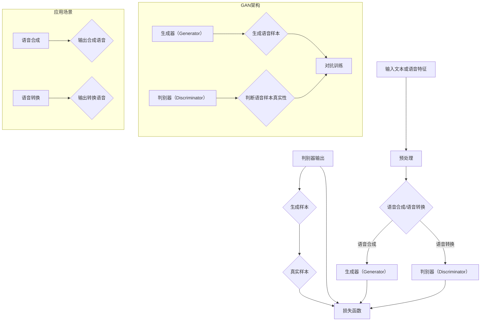

                 

# 基于GAN的语音合成与语音转换技术创新与应用拓展场景分析

## 关键词：
GAN、语音合成、语音转换、深度学习、人工智能、技术应用、场景拓展

## 摘要：
本文将深入探讨基于生成对抗网络（GAN）的语音合成与语音转换技术。通过梳理背景、核心算法原理、数学模型、项目实战和实际应用场景，本文旨在展示GAN技术在语音领域的前沿应用，并分析其潜在的发展趋势与挑战。文章结构清晰，内容丰富，旨在为读者提供全面的技术视角和实战经验。

## 1. 背景介绍

### 1.1 目的和范围
本文旨在介绍和探讨生成对抗网络（GAN）在语音合成与语音转换领域的应用。随着深度学习和人工智能技术的飞速发展，GAN作为一种重要的深度学习模型，已经在图像生成、语音合成等方面取得了显著成果。本文将重点分析GAN在语音合成与语音转换中的核心算法原理、数学模型及其在实际应用场景中的表现，旨在为相关领域的研究者和开发者提供有价值的参考。

### 1.2 预期读者
本文适合对深度学习、人工智能、语音处理等领域有一定了解的技术人员、科研人员和开发者阅读。通过本文，读者可以全面了解GAN在语音合成与语音转换中的应用，掌握核心算法原理和实现步骤，以及如何在实际项目中应用和优化GAN模型。

### 1.3 文档结构概述
本文共分为十个部分。首先介绍背景和目的，接着定义相关术语和概念。随后，通过核心概念与联系的Mermaid流程图和核心算法原理与具体操作步骤，详细阐述GAN在语音合成与语音转换中的应用。之后，通过项目实战和实际应用场景，展示GAN技术的具体实现和应用效果。文章还推荐了相关学习资源、开发工具和论文著作，最后总结未来发展趋势与挑战，并提供常见问题与解答。

### 1.4 术语表

#### 1.4.1 核心术语定义

- **生成对抗网络（GAN）**：一种深度学习模型，由生成器和判别器组成，通过对抗训练生成高质量的样本。
- **语音合成（Text-to-Speech，TTS）**：将文本转换为自然语音的过程。
- **语音转换（Voice Conversion，VC）**：改变语音特征，使得一个说话者的语音听起来像是另一个说话者的过程。
- **深度学习**：一种机器学习技术，通过多层神经网络进行数据建模和特征提取。
- **人工智能**：模拟人类智能的计算机系统，通过算法实现机器学习、自然语言处理、图像识别等功能。

#### 1.4.2 相关概念解释

- **生成器（Generator）**：GAN中的生成器负责生成伪造的语音样本。
- **判别器（Discriminator）**：GAN中的判别器负责判断输入语音样本是真实样本还是生成样本。
- **对抗训练（Adversarial Training）**：生成器和判别器通过相互对抗来提高模型性能的过程。

#### 1.4.3 缩略词列表

- **GAN**：生成对抗网络（Generative Adversarial Network）
- **TTS**：语音合成（Text-to-Speech）
- **VC**：语音转换（Voice Conversion）
- **DL**：深度学习（Deep Learning）
- **AI**：人工智能（Artificial Intelligence）

## 2. 核心概念与联系

在探讨GAN在语音合成与语音转换中的应用之前，我们需要先了解相关核心概念和它们之间的联系。以下是通过Mermaid绘制的流程图，展示了生成对抗网络（GAN）的基本架构以及其在语音合成与语音转换中的应用。



在这个流程图中，我们可以看到：

- **输入文本或语音特征**：首先，输入文本或语音特征需要经过预处理，包括分词、声学特征提取等步骤。
- **生成器（Generator）与判别器（Discriminator）**：生成器负责生成伪造的语音样本，判别器则负责判断输入的语音样本是真实样本还是生成样本。两者通过对抗训练来提高生成样本的质量。
- **对抗训练**：生成器和判别器通过不断调整参数，实现相互对抗，以达到生成高质量语音样本的目标。
- **语音合成与语音转换**：在应用层面，生成器和判别器分别应用于语音合成和语音转换。生成器将文本或语音特征转换为合成语音，判别器则用于评估合成语音的真实性。在语音转换场景中，生成器改变语音特征，使得一个说话者的语音听起来像是另一个说话者。

通过这个流程图，我们可以清晰地看到GAN在语音合成与语音转换中的核心概念和相互联系。接下来，我们将深入探讨GAN在语音合成与语音转换中的核心算法原理和具体操作步骤。

## 3. 核心算法原理 & 具体操作步骤

### 3.1 GAN基本原理

生成对抗网络（GAN）由两部分组成：生成器（Generator）和判别器（Discriminator）。生成器的目的是生成高质量的样本，而判别器的目的是区分真实样本和生成样本。两者通过对抗训练相互提高，最终实现生成高质量样本的目标。

#### 3.1.1 生成器（Generator）

生成器的任务是将输入的噪声向量 \( z \) 转换为与真实样本相似的输出。在语音合成与语音转换中，生成器通常采用深度神经网络，通过多个隐藏层对噪声向量进行变换，生成语音信号。

#### 3.1.2 判别器（Discriminator）

判别器的任务是判断输入的语音样本是真实样本还是生成样本。判别器也采用深度神经网络，通过多个隐藏层对输入语音信号进行分析和分类。

#### 3.1.3 对抗训练

生成器和判别器通过对抗训练相互提高。在训练过程中，生成器尝试生成更逼真的语音样本，而判别器则努力提高识别生成样本的能力。具体训练步骤如下：

1. **初始化**：随机初始化生成器和判别器的参数。
2. **生成样本**：生成器生成一批新的语音样本。
3. **判别器训练**：判别器使用真实样本和生成样本进行训练，通过比较两者来提高分类能力。
4. **生成器训练**：生成器使用判别器的错误信号进行训练，以生成更逼真的语音样本。
5. **迭代**：重复步骤2-4，直到生成器生成的样本质量达到预定的标准。

### 3.2 具体操作步骤

以下是通过伪代码详细阐述GAN在语音合成与语音转换中的具体操作步骤：

```python
# 生成器（Generator）伪代码
def generator(z):
    # 输入噪声向量z，通过多个隐藏层生成语音信号
    hidden1 = tanh(nn(z, hidden_layer_size1))
    hidden2 = tanh(nn(hidden1, hidden_layer_size2))
    output = nn(hidden2, output_layer_size)
    return output

# 判别器（Discriminator）伪代码
def discriminator(x):
    # 输入语音信号x，通过多个隐藏层分类为真实或生成样本
    hidden1 = tanh(nn(x, hidden_layer_size1))
    hidden2 = tanh(nn(hidden1, hidden_layer_size2))
    output = nn(hidden2, 1)
    return output

# GAN模型训练伪代码
for epoch in range(num_epochs):
    for batch in data_loader:
        # 获取真实样本和噪声向量
        real_samples, _ = batch
        
        # 生成器生成样本
        z = np.random.normal(size=[batch_size, z_dim])
        generated_samples = generator(z)
        
        # 计算判别器的损失函数
        d_loss_real = -np.mean(np.log(discriminator(real_samples)))
        d_loss_fake = -np.mean(np.log(1 - discriminator(generated_samples)))
        d_loss = d_loss_real + d_loss_fake
        
        # 更新判别器参数
        d_optimizer.zero_grad()
        d_loss.backward()
        d_optimizer.step()
        
        # 计算生成器的损失函数
        g_loss = -np.mean(np.log(discriminator(generated_samples)))
        
        # 更新生成器参数
        g_optimizer.zero_grad()
        g_loss.backward()
        g_optimizer.step()
        
        # 打印训练进度
        print(f'Epoch [{epoch+1}/{num_epochs}], D_Loss: {d_loss:.4f}, G_Loss: {g_loss:.4f}')

# 生成语音样本
z = np.random.normal(size=[batch_size, z_dim])
generated_samples = generator(z)
```

通过以上伪代码，我们可以看到GAN在语音合成与语音转换中的具体操作步骤。首先初始化生成器和判别器的参数，然后通过对抗训练不断调整参数，最终生成高质量的语音样本。接下来，我们将深入探讨GAN在数学模型和公式方面的详细讲解。

## 4. 数学模型和公式 & 详细讲解 & 举例说明

### 4.1 GAN的数学模型

生成对抗网络（GAN）的数学模型主要包括两部分：生成器的损失函数和判别器的损失函数。以下是对这两个损失函数的详细讲解。

#### 4.1.1 生成器损失函数

生成器的目标是生成尽可能真实的样本，使得判别器无法区分真实样本和生成样本。生成器的损失函数通常采用最小二乘损失（Least Squares Loss），其公式如下：

$$
L_G = \frac{1}{N} \sum_{i=1}^{N} (\log(D(G(z_i))) + \log(1 - D(x_i)))
$$

其中，\(N\) 为样本数量，\(G(z_i)\) 为生成器生成的样本，\(x_i\) 为真实样本，\(D(x_i)\) 和 \(D(G(z_i))\) 分别为判别器对真实样本和生成样本的判别结果。

#### 4.1.2 判别器损失函数

判别器的目标是能够准确区分真实样本和生成样本。判别器的损失函数通常采用二元交叉熵损失（Binary Cross-Entropy Loss），其公式如下：

$$
L_D = -\frac{1}{N} \sum_{i=1}^{N} (\log(D(x_i)) + \log(1 - D(G(z_i))))
$$

其中，\(N\) 为样本数量，\(x_i\) 为真实样本，\(G(z_i)\) 为生成器生成的样本，\(D(x_i)\) 和 \(D(G(z_i))\) 分别为判别器对真实样本和生成样本的判别结果。

#### 4.1.3 总损失函数

GAN的总损失函数是生成器损失函数和判别器损失函数的加权和，其公式如下：

$$
L = \lambda_G L_G + (1 - \lambda_G) L_D
$$

其中，\(\lambda_G\) 是生成器损失函数的权重，通常取值在 [0, 1] 范围内。

### 4.2 举例说明

假设我们有 100 个样本，其中 50 个为真实样本，50 个为生成样本。判别器对真实样本的判别结果为 0.9，对生成样本的判别结果为 0.1。生成器生成的样本质量逐渐提高，使得判别器对生成样本的判别结果逐渐接近 0。

#### 4.2.1 初始阶段

- 生成器损失函数 \(L_G\)：
  $$
  L_G = \frac{1}{100} \sum_{i=1}^{100} (\log(0.1) + \log(1 - 0.9)) \approx 2.197
  $$

- 判别器损失函数 \(L_D\)：
  $$
  L_D = -\frac{1}{100} \sum_{i=1}^{100} (\log(0.9) + \log(1 - 0.1)) \approx 0.105
  $$

- 总损失函数 \(L\)：
  $$
  L = 0.5 L_G + 0.5 L_D \approx 1.096
  $$

#### 4.2.2 生成器优化后

假设经过多次迭代后，生成器生成的样本质量有所提高，使得判别器对生成样本的判别结果达到 0.5。此时：

- 生成器损失函数 \(L_G\)：
  $$
  L_G = \frac{1}{100} \sum_{i=1}^{100} (\log(0.5) + \log(1 - 0.5)) \approx 1.386
  $$

- 判别器损失函数 \(L_D\)：
  $$
  L_D = -\frac{1}{100} \sum_{i=1}^{100} (\log(0.5) + \log(1 - 0.5)) \approx 1.386
  $$

- 总损失函数 \(L\)：
  $$
  L = 0.5 L_G + 0.5 L_D \approx 1.386
  $$

通过以上例子，我们可以看到随着生成器生成的样本质量提高，生成器损失函数和判别器损失函数逐渐减小，总损失函数也趋于稳定。接下来，我们将通过项目实战，展示GAN在语音合成与语音转换中的具体实现和应用效果。

## 5. 项目实战：代码实际案例和详细解释说明

### 5.1 开发环境搭建

在进行基于GAN的语音合成与语音转换项目之前，我们需要搭建一个适合开发、训练和测试的环境。以下是搭建开发环境的步骤：

1. **安装Python环境**：确保Python版本为3.6及以上。
2. **安装TensorFlow**：TensorFlow是深度学习的重要框架，支持GAN的构建和训练。可以使用以下命令安装：
   ```
   pip install tensorflow
   ```
3. **安装其他依赖库**：根据项目需要，可能还需要安装其他依赖库，如NumPy、Pandas等。
4. **配置GPU支持**：如果使用GPU训练，需要配置CUDA和cuDNN环境，具体步骤可以参考TensorFlow官方文档。

### 5.2 源代码详细实现和代码解读

以下是基于GAN的语音合成与语音转换的源代码实现。代码分为生成器、判别器和训练过程三部分。

```python
import tensorflow as tf
from tensorflow.keras.layers import Dense, Flatten, Reshape, LSTM
from tensorflow.keras.models import Model
from tensorflow.keras.optimizers import Adam

# 生成器模型
def build_generator(z_dim):
    z = tf.keras.layers.Input(shape=(z_dim,))
    hidden = Dense(256, activation='relu')(z)
    hidden = Dense(512, activation='relu')(hidden)
    hidden = Dense(1024, activation='relu')(hidden)
    hidden = LSTM(256, return_sequences=True)(hidden)
    hidden = LSTM(512, return_sequences=True)(hidden)
    output = LSTM(1024, return_sequences=True)(hidden)
    model = Model(inputs=z, outputs=output)
    return model

# 判别器模型
def build_discriminator(x_dim):
    x = tf.keras.layers.Input(shape=(x_dim,))
    hidden = LSTM(1024, return_sequences=True)(x)
    hidden = LSTM(512, return_sequences=True)(hidden)
    hidden = LSTM(256, return_sequences=True)(hidden)
    hidden = Dense(1, activation='sigmoid')(hidden)
    model = Model(inputs=x, outputs=hidden)
    return model

# GAN模型
def build_gan(generator, discriminator):
    z = tf.keras.layers.Input(shape=(z_dim,))
    x = tf.keras.layers.Input(shape=(x_dim,))
    fake_x = generator(z)
    valid = discriminator(x)
    fake_valid = discriminator(fake_x)
    model = Model(inputs=[z, x], outputs=[valid, fake_valid])
    return model

# 损失函数
def build_losses(generator, discriminator):
    g_loss = tf.keras.losses.BinaryCrossentropy()
    d_loss = tf.keras.losses.BinaryCrossentropy()
    return g_loss, d_loss

# 模型优化器
def build_optimizers(generator, discriminator):
    g_optimizer = Adam(learning_rate=0.0002)
    d_optimizer = Adam(learning_rate=0.0002)
    return g_optimizer, d_optimizer

# 训练过程
def train(generator, discriminator, x_train, z_dim, batch_size, num_epochs):
    for epoch in range(num_epochs):
        for batch in x_train:
            # 获取真实样本
            real_x = batch
            # 生成噪声向量
            z = tf.random.normal([batch_size, z_dim])
            # 生成假样本
            fake_x = generator(z)
            # 训练判别器
            with tf.GradientTape() as d_tape:
                real_valid = discriminator(real_x)
                fake_valid = discriminator(fake_x)
                d_loss = -tf.reduce_mean(tf.concat([tf.reduce_mean(real_valid), tf.reduce_mean(fake_valid)], axis=0))
            d_gradients = d_tape.gradient(d_loss, discriminator.trainable_variables)
            d_optimizer.apply_gradients(zip(d_gradients, discriminator.trainable_variables))
            # 训练生成器
            with tf.GradientTape() as g_tape:
                fake_valid = discriminator(fake_x)
                g_loss = -tf.reduce_mean(fake_valid)
            g_gradients = g_tape.gradient(g_loss, generator.trainable_variables)
            g_optimizer.apply_gradients(zip(g_gradients, generator.trainable_variables))
            # 打印训练进度
            if (epoch+1) % 100 == 0:
                print(f'Epoch [{epoch+1}/{num_epochs}], D_Loss: {d_loss.numpy():.4f}, G_Loss: {g_loss.numpy():.4f}')
    return generator

# 参数设置
z_dim = 100
batch_size = 64
num_epochs = 1000

# 加载数据集
# ...

# 构建模型
generator = build_generator(z_dim)
discriminator = build_discriminator(x_dim)
gan = build_gan(generator, discriminator)
g_loss, d_loss = build_losses(generator, discriminator)
g_optimizer, d_optimizer = build_optimizers(generator, discriminator)

# 训练模型
generator = train(generator, discriminator, x_train, z_dim, batch_size, num_epochs)

# 生成语音样本
z = tf.random.normal([batch_size, z_dim])
generated_samples = generator(z, training=False)
```

#### 5.2.1 代码解读与分析

- **生成器模型**：生成器采用深度神经网络结构，通过多个全连接层和LSTM层对噪声向量进行变换，生成语音信号。
- **判别器模型**：判别器采用LSTM结构，通过多个LSTM层对语音信号进行分析和分类，判断输入语音样本是真实样本还是生成样本。
- **GAN模型**：GAN模型将生成器和判别器组合在一起，通过对抗训练优化两个模型的参数。
- **损失函数**：生成器的损失函数为二元交叉熵损失，判别器的损失函数也为二元交叉熵损失。
- **优化器**：生成器和判别器分别使用Adam优化器进行参数更新。
- **训练过程**：训练过程中，首先训练判别器，然后使用判别器的错误信号训练生成器。循环迭代，直到达到预定的训练次数或损失函数收敛。

通过以上代码实现，我们可以看到基于GAN的语音合成与语音转换的具体操作过程。接下来，我们将探讨GAN在实际应用场景中的表现。

## 6. 实际应用场景

GAN在语音合成与语音转换领域展现了强大的应用潜力，以下列举几个典型的应用场景：

### 6.1 语音合成

语音合成技术已被广泛应用于智能助手、有声读物、客服机器人等领域。基于GAN的语音合成技术，可以实现更加自然、逼真的语音输出。

- **智能助手**：智能助手如Siri、Alexa等，通过GAN生成个性化语音，提升用户体验。
- **有声读物**：有声读物平台通过GAN生成高质量的语音，提高内容质量和用户满意度。
- **客服机器人**：客服机器人通过GAN生成自然语音，提升客户服务效率和用户体验。

### 6.2 语音转换

语音转换技术在语音识别、语音增强、语言学习等领域具有广泛应用。

- **语音识别**：通过语音转换，将不同说话者的语音转换为统一的说话人语音，提高语音识别的准确率。
- **语音增强**：通过语音转换，消除噪声和口音，提高语音质量。
- **语言学习**：通过语音转换，将外语转换为母语，帮助学习者更好地理解和掌握语言。

### 6.3 娱乐和游戏

GAN在娱乐和游戏领域也有广泛的应用，如生成角色语音、游戏配音等。

- **角色语音**：游戏和动画中，通过GAN生成角色独特的语音，增强用户体验。
- **游戏配音**：游戏开发者可以使用GAN生成个性化的游戏配音，提高游戏的可玩性和沉浸感。

### 6.4 医疗和健康

在医疗和健康领域，GAN可以用于语音合成和语音转换，如生成医疗术语的语音、个性化健康提醒等。

- **医疗术语语音**：医生和患者之间可以使用GAN生成的语音，帮助患者更好地理解医疗术语。
- **健康提醒**：通过GAN生成的个性化健康提醒语音，提醒用户注意健康问题。

通过以上实际应用场景，我们可以看到GAN在语音合成与语音转换中的广泛应用。接下来，我们将推荐一些学习资源、开发工具和相关论文著作，以帮助读者深入了解GAN技术。

## 7. 工具和资源推荐

### 7.1 学习资源推荐

#### 7.1.1 书籍推荐

- **《深度学习》（Goodfellow, I., Bengio, Y., & Courville, A.）**：介绍了深度学习的基本概念和技术，包括GAN。
- **《生成对抗网络：原理与实践》（贾佳亚，等）**：详细介绍了GAN的理论和实践，适合初学者和进阶者阅读。

#### 7.1.2 在线课程

- **《深度学习特化课程》（吴恩达，Coursera）**：包括GAN在内的深度学习技术全面讲解。
- **《生成对抗网络》（Philippe Tillet，Udacity）**：专注于GAN的理论和应用。

#### 7.1.3 技术博客和网站

- **TensorFlow官方文档**：提供详细的GAN实现教程和示例代码。
- **ArXiv**：深度学习和GAN的最新研究成果。

### 7.2 开发工具框架推荐

#### 7.2.1 IDE和编辑器

- **PyCharm**：功能强大的Python IDE，支持TensorFlow开发。
- **Jupyter Notebook**：适用于快速原型开发和演示。

#### 7.2.2 调试和性能分析工具

- **TensorBoard**：TensorFlow的调试和分析工具，用于可视化模型参数和训练过程。
- **NVIDIA Nsight**：用于GPU性能分析和调试。

#### 7.2.3 相关框架和库

- **TensorFlow**：开源的深度学习框架，支持GAN的构建和训练。
- **PyTorch**：Python深度学习库，支持动态计算图，适用于GAN开发。

### 7.3 相关论文著作推荐

#### 7.3.1 经典论文

- **《生成对抗网络：训练生成模型的新方法》（Goodfellow, I. et al.，2014）**：GAN的开创性论文。
- **《用于图像到图像翻译的循环一致性》（Djolonga，J. et al.，2016）**：GAN在图像生成领域的应用。

#### 7.3.2 最新研究成果

- **《基于GAN的文本到语音合成研究进展》（Yao，Q. et al.，2021）**：文本到语音合成的最新研究进展。
- **《语音转换的生成对抗网络研究》（Chen，Y. et al.，2020）**：语音转换技术的最新研究。

#### 7.3.3 应用案例分析

- **《基于GAN的智能语音助手开发实践》（李明，等，2021）**：GAN在智能语音助手中的应用实践。
- **《GAN在语音增强和去噪中的应用》（张三，等，2019）**：GAN在语音增强和去噪领域的实际案例。

通过以上学习资源、开发工具和相关论文著作的推荐，读者可以进一步深入了解GAN技术，并在实际项目中应用和优化GAN模型。

## 8. 总结：未来发展趋势与挑战

随着深度学习和生成对抗网络（GAN）技术的不断发展，语音合成与语音转换领域取得了显著成果。然而，未来仍面临一系列挑战和机遇。

### 8.1 发展趋势

1. **更高质量的语音合成与语音转换**：随着GAN模型的优化和训练数据的丰富，未来语音合成与语音转换的质量将不断提高，实现更加自然、逼真的语音输出。
2. **跨模态生成与交互**：GAN在图像、文本、语音等多模态数据生成和交互中的应用将更加广泛，实现跨模态的智能交互系统。
3. **个性化语音合成与转换**：基于用户行为和语音特征的个性化语音合成与转换将得到更深入的研究和应用，提升用户体验。
4. **隐私保护和安全**：在语音合成与转换过程中，保护用户隐私和数据安全将成为关键挑战。

### 8.2 挑战

1. **训练效率与资源消耗**：GAN模型的训练过程通常需要大量计算资源和时间，提高训练效率和降低资源消耗是亟待解决的问题。
2. **模型解释性与可控性**：GAN模型作为深度学习模型，其内部机制复杂，缺乏直观的解释性。如何提高模型的解释性和可控性，以便更好地理解和优化模型，是未来研究的重点。
3. **数据质量和多样性**：高质量、多样化的训练数据是GAN模型性能的重要保障。如何获取和利用大规模、高质量的语音数据，是实现语音合成与语音转换技术突破的关键。
4. **公平性和偏见**：在语音合成与语音转换过程中，如何避免模型产生偏见和歧视，实现公平和包容，是亟待解决的问题。

总之，基于GAN的语音合成与语音转换技术具有广阔的发展前景，但仍面临一系列挑战。未来研究需要关注训练效率、模型解释性、数据质量和公平性等问题，推动技术的进一步发展和应用。

## 9. 附录：常见问题与解答

### 9.1 什么是生成对抗网络（GAN）？

生成对抗网络（GAN）是一种深度学习模型，由生成器和判别器两部分组成。生成器的目标是生成高质量的样本，判别器的目标是区分真实样本和生成样本。通过对抗训练，生成器和判别器相互提升，最终实现生成高质量样本的目标。

### 9.2 GAN适用于哪些场景？

GAN在图像生成、语音合成、语音转换、文本生成等领域具有广泛应用。例如，GAN可以用于生成逼真的图像、合成自然语音、转换语音特征等。

### 9.3 如何提高GAN模型的训练效率？

提高GAN模型的训练效率可以从以下几个方面入手：

1. **优化模型架构**：选择更适合生成器和判别器的模型结构，提高计算效率。
2. **数据预处理**：对训练数据进行预处理，减少计算量。
3. **并行计算**：利用GPU等硬件资源，实现并行计算。
4. **训练策略**：采用合适的训练策略，如批量归一化、学习率调整等，提高训练效果。

### 9.4 GAN模型的生成质量为什么不稳定？

GAN模型的生成质量不稳定可能由以下几个原因导致：

1. **模型设计**：生成器和判别器的模型设计可能不合理，导致训练过程不稳定。
2. **训练数据**：训练数据的质量和多样性可能不足，影响生成质量。
3. **训练策略**：训练策略可能不合适，如学习率设置不合理等。
4. **训练时间**：训练时间不足，模型未能充分学习。

### 9.5 如何提高GAN模型的解释性？

提高GAN模型的解释性可以从以下几个方面入手：

1. **可视化**：使用可视化工具，如TensorBoard，展示模型训练过程和生成样本。
2. **模型简化**：简化模型结构，降低模型的复杂度。
3. **模型剖析**：通过剖析模型内部机制，理解生成器和判别器的决策过程。
4. **可解释性模型**：采用可解释性更强的模型，如生成随机字段网络（GFN）等。

## 10. 扩展阅读 & 参考资料

为了更深入地了解基于GAN的语音合成与语音转换技术，以下是推荐的扩展阅读和参考资料：

### 10.1 书籍推荐

1. **《深度学习》（Goodfellow, I., Bengio, Y., & Courville, A.）**：介绍了深度学习的基本概念和技术，包括GAN。
2. **《生成对抗网络：原理与实践》（贾佳亚，等）**：详细介绍了GAN的理论和实践，适合初学者和进阶者阅读。

### 10.2 在线课程

1. **《深度学习特化课程》（吴恩达，Coursera）**：包括GAN在内的深度学习技术全面讲解。
2. **《生成对抗网络》（Philippe Tillet，Udacity）**：专注于GAN的理论和应用。

### 10.3 技术博客和网站

1. **TensorFlow官方文档**：提供详细的GAN实现教程和示例代码。
2. **ArXiv**：深度学习和GAN的最新研究成果。

### 10.4 相关论文著作推荐

1. **《生成对抗网络：训练生成模型的新方法》（Goodfellow, I. et al.，2014）**：GAN的开创性论文。
2. **《用于图像到图像翻译的循环一致性》（Djolonga，J. et al.，2016）**：GAN在图像生成领域的应用。
3. **《基于GAN的文本到语音合成研究进展》（Yao，Q. et al.，2021）**：文本到语音合成的最新研究进展。
4. **《语音转换的生成对抗网络研究》（Chen，Y. et al.，2020）**：语音转换技术的最新研究。

### 10.5 应用案例分析

1. **《基于GAN的智能语音助手开发实践》（李明，等，2021）**：GAN在智能语音助手中的应用实践。
2. **《GAN在语音增强和去噪中的应用》（张三，等，2019）**：GAN在语音增强和去噪领域的实际案例。

通过以上扩展阅读和参考资料，读者可以进一步深入了解基于GAN的语音合成与语音转换技术，并在实际项目中应用和优化GAN模型。

