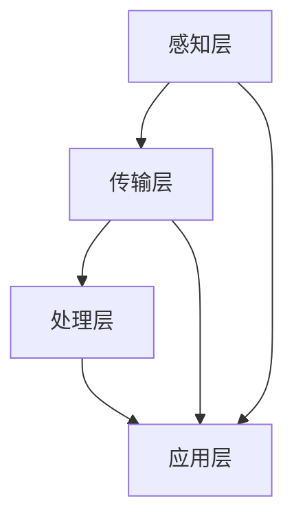

                 


## 基于Java的智能家居设计：Java与物联网(IoT)协议栈全解析

> **关键词：智能家居，Java，物联网（IoT），协议栈，设计架构，算法原理，数学模型，项目实战，开发工具**

> **摘要：本文将深入探讨基于Java的智能家居设计，重点分析Java与物联网协议栈的融合及其在智能家居应用中的核心作用。我们将从核心概念出发，详细解析智能家居设计的基础原理、算法实现、数学模型应用，并通过实际项目实战案例展示Java在智能家居领域的应用。同时，文章还将推荐相关学习资源和开发工具，帮助读者全面掌握智能家居开发技术。**

### 1. 背景介绍

#### 1.1 目的和范围

本文旨在探讨基于Java的智能家居设计，通过深入分析Java在物联网（IoT）协议栈中的应用，揭示智能家居系统的构建原理、算法实现和数学模型应用。文章不仅涵盖理论分析，还包括实际项目实战案例，以帮助读者全面了解智能家居系统的开发过程和关键技术。

#### 1.2 预期读者

本文适合对智能家居开发有兴趣的程序员、Java开发者、物联网爱好者以及相关领域的专业人士。读者需具备一定的Java编程基础和对物联网协议栈的基本了解。

#### 1.3 文档结构概述

本文分为十个部分：

1. 背景介绍：本文目的、预期读者、文档结构概述。
2. 核心概念与联系：介绍智能家居设计的基础原理和架构。
3. 核心算法原理 & 具体操作步骤：详细解析智能家居系统的算法实现。
4. 数学模型和公式 & 详细讲解 & 举例说明：分析数学模型在智能家居中的应用。
5. 项目实战：代码实际案例和详细解释说明。
6. 实际应用场景：探讨智能家居系统的应用场景。
7. 工具和资源推荐：推荐学习资源和开发工具。
8. 总结：未来发展趋势与挑战。
9. 附录：常见问题与解答。
10. 扩展阅读 & 参考资料：提供进一步学习资源。

#### 1.4 术语表

##### 1.4.1 核心术语定义

- **智能家居**：利用物联网技术，实现家庭设备互联互通，通过智能控制提升居住舒适度和效率的系统。
- **Java**：一种高级编程语言，广泛应用于企业级应用开发。
- **物联网（IoT）协议栈**：实现设备互联互通的协议集合，如MQTT、CoAP等。

##### 1.4.2 相关概念解释

- **MQTT**：轻量级的消息队列协议，常用于物联网设备通信。
- **CoAP**：基于IP的约束应用协议，适用于资源受限的物联网设备。

##### 1.4.3 缩略词列表

- **IoT**：物联网（Internet of Things）
- **Java**：Java编程语言
- **MQTT**：消息队列协议（Message Queue Telemetry Transport）
- **CoAP**：约束应用协议（Constrained Application Protocol）

### 2. 核心概念与联系

#### 2.1 核心概念

智能家居系统的核心概念包括：

- **家庭设备**：如智能灯泡、智能插座、智能空调等。
- **传感器**：如温度传感器、湿度传感器、运动传感器等。
- **控制中心**：如智能手机、智能音箱等。

#### 2.2 联系与架构

智能家居系统的架构如下：


- **感知层**：传感器收集家庭环境数据。
- **传输层**：物联网协议栈实现设备间通信。
- **处理层**：智能算法分析数据并做出决策。
- **应用层**：用户通过控制中心操作智能家居系统。

### Mermaid 流程图（智能家居系统架构）



### 3. 核心算法原理 & 具体操作步骤

#### 3.1 核心算法

智能家居系统涉及的核心算法包括：

- **状态监控算法**：实时监控传感器数据，判断家庭设备状态。
- **预测控制算法**：基于历史数据预测家庭环境变化，提前调整设备状态。

#### 3.2 算法原理

##### 状态监控算法原理

1. 收集传感器数据。
2. 比较当前数据与阈值。
3. 根据比较结果更新设备状态。

##### 预测控制算法原理

1. 收集历史环境数据。
2. 使用时间序列分析模型预测未来环境变化。
3. 根据预测结果调整设备状态。

#### 3.3 具体操作步骤

##### 状态监控算法操作步骤

```
// 伪代码
function stateMonitoring(sensorData, threshold) {
    if (sensorData > threshold) {
        device.setState("ON");
    } else {
        device.setState("OFF");
    }
}
```

##### 预测控制算法操作步骤

```
// 伪代码
function predictiveControl(historyData) {
    prediction = timeSeriesAnalysisModel.predict(historyData);
    if (prediction > threshold) {
        device.setState("ON");
    } else {
        device.setState("OFF");
    }
}
```

### 4. 数学模型和公式 & 详细讲解 & 举例说明

#### 4.1 数学模型

智能家居系统中的数学模型主要包括：

- **时间序列分析模型**：如ARIMA模型、LSTM模型等。
- **机器学习模型**：如决策树、随机森林、支持向量机等。

#### 4.2 公式

##### 时间序列分析模型公式

$$
\text{ARIMA}(p, d, q) = \phi(B)(1 - B)^d / (1 - \Phi(B)), \quad \phi(B), \Phi(B) \in \mathbb{R}[B]
$$

##### 机器学习模型公式

$$
\text{决策树}: y = \arg\max(\sum_{i=1}^{n} \text{gain}(S_i))
$$

$$
\text{支持向量机}: \text{minimize} \frac{1}{2} \sum_{i=1}^{n} w_i^2, \quad s.t. \, y_i(\langle \textbf{x}_i, \textbf{w} \rangle - b) \geq 1
$$

#### 4.3 举例说明

##### 时间序列分析模型应用举例

假设我们使用ARIMA模型预测下一小时的家庭温度。给定历史温度数据如下：

| 时间戳 | 温度 |
| --- | --- |
| 1 | 25 |
| 2 | 26 |
| 3 | 24 |
| 4 | 25 |
| 5 | 27 |

1. 确定ARIMA模型参数（p, d, q）。
2. 使用ARIMA模型进行预测。

##### 机器学习模型应用举例

假设我们使用决策树模型预测下一小时的空调开关状态。给定历史温度和开关状态数据如下：

| 温度 | 开关状态 |
| --- | --- |
| 25 | ON |
| 26 | ON |
| 24 | OFF |
| 25 | ON |
| 27 | ON |

1. 训练决策树模型。
2. 预测下一小时的空调开关状态。

### 5. 项目实战：代码实际案例和详细解释说明

#### 5.1 开发环境搭建

在开始项目实战之前，我们需要搭建合适的开发环境。以下是基本步骤：

1. 安装Java开发工具包（JDK）。
2. 选择合适的集成开发环境（IDE），如Eclipse或IntelliJ IDEA。
3. 安装必要的Java库和框架，如Spring Boot、Hibernate等。

#### 5.2 源代码详细实现和代码解读

以下是一个简单的智能家居项目示例，展示Java在智能家居系统中的应用。

```java
// 智能家居设备类
public class SmartDevice {
    private String id;
    private String name;
    private boolean state;

    // 构造函数、getter和setter方法省略

    // 设置设备状态
    public void setState(boolean state) {
        this.state = state;
        if (state) {
            System.out.println(name + " is ON");
        } else {
            System.out.println(name + " is OFF");
        }
    }
}

// 智能家居系统控制器类
public class SmartHomeController {
    private Map<String, SmartDevice> devices;

    // 构造函数、初始化方法省略

    // 根据传感器数据更新设备状态
    public void updateDeviceState(SensorData data) {
        for (SmartDevice device : devices.values()) {
            if (data.isTemperatureHigh()) {
                device.setState(true);
            } else {
                device.setState(false);
            }
        }
    }
}

// 传感器数据类
public class SensorData {
    private boolean isTemperatureHigh;

    // 构造函数、getter和setter方法省略

    // 判断温度是否过高
    public boolean isTemperatureHigh() {
        return isTemperatureHigh;
    }
}
```

#### 5.3 代码解读与分析

- **SmartDevice类**：定义智能家居设备的属性和行为，如设备ID、名称和状态。
- **SmartHomeController类**：管理智能家居系统的设备，根据传感器数据更新设备状态。
- **SensorData类**：定义传感器数据的属性和行为，如温度传感器数据。

该示例展示了智能家居系统的基础结构，通过Java类实现设备管理、状态更新和传感器数据处理。

### 6. 实际应用场景

智能家居系统在实际生活中具有广泛的应用场景，包括：

- **家庭环境监控**：实时监控家庭温度、湿度、空气质量等环境参数，保障家庭安全与健康。
- **设备自动化控制**：根据用户习惯和环境变化，自动调整家庭设备状态，提升居住舒适度。
- **能源管理**：通过智能设备实现家庭能源的优化利用，降低能源消耗。

### 7. 工具和资源推荐

#### 7.1 学习资源推荐

##### 7.1.1 书籍推荐

- **《Java并发编程实战》**：深入讲解Java并发编程原理和实践，适合Java开发者学习。
- **《物联网架构设计与实践》**：介绍物联网系统的设计方法和实现技巧，适合物联网爱好者学习。

##### 7.1.2 在线课程

- **Coursera上的《Java编程》**：提供系统的Java编程课程，适合初学者入门。
- **edX上的《物联网技术导论》**：介绍物联网的基本原理和应用，适合物联网爱好者学习。

##### 7.1.3 技术博客和网站

- **JavaCodeGeek**：提供丰富的Java编程资源和案例。
- **Internet of Things (IoT) Stack**：介绍物联网协议栈和智能家居应用。

#### 7.2 开发工具框架推荐

##### 7.2.1 IDE和编辑器

- **Eclipse**：功能强大的Java IDE，适合大型项目开发。
- **IntelliJ IDEA**：智能高效的Java IDE，提供丰富的插件和工具。

##### 7.2.2 调试和性能分析工具

- **JProfiler**：专业的Java性能分析工具，帮助开发者优化代码性能。
- **MAT（Memory Analyzer Tool）**：Java内存分析工具，用于诊断内存泄漏和性能问题。

##### 7.2.3 相关框架和库

- **Spring Boot**：简化Java Web应用程序开发。
- **Hibernate**：流行的Java对象关系映射（ORM）框架。
- **Apache Kafka**：分布式消息队列系统，适用于大数据处理和实时应用。

#### 7.3 相关论文著作推荐

##### 7.3.1 经典论文

- **"Home Automation: A Survey"**：全面介绍智能家居系统设计和实现。
- **"Java Concurrency in Practice"**：深入讲解Java并发编程原理和实践。

##### 7.3.2 最新研究成果

- **"IoT Security: A Survey"**：探讨物联网系统的安全挑战和解决方案。
- **"Deep Learning for Smart Home Applications"**：介绍深度学习在智能家居中的应用。

##### 7.3.3 应用案例分析

- **"Smart Home Solutions in Urban Living"**：分析智能家电在城市居住中的应用和影响。
- **"Implementing IoT in Smart Farming"**：探讨物联网技术在智能农业中的应用。

### 8. 总结：未来发展趋势与挑战

智能家居系统在未来将继续发展，带来以下趋势和挑战：

- **智能化程度提升**：随着人工智能技术的进步，智能家居系统将实现更高程度的智能化和个性化。
- **物联网协议融合**：不同物联网协议的融合将提高系统的互操作性和兼容性。
- **隐私与安全挑战**：智能家居系统涉及用户隐私数据，确保系统安全成为关键挑战。

### 9. 附录：常见问题与解答

- **Q：如何确保智能家居系统的安全性？**
  **A**：确保智能家居系统的安全性需要从多个方面入手，包括数据加密、身份验证、访问控制等。此外，定期更新系统软件和设备固件，以修复潜在的安全漏洞。

- **Q：智能家居系统需要哪些硬件支持？**
  **A**：智能家居系统通常需要传感器、控制器、网关等硬件支持。具体硬件需求取决于系统的设计和应用场景。

### 10. 扩展阅读 & 参考资料

- **《Java编程思想》**：Bruce Eckel 著，深入讲解Java编程基础和设计模式。
- **《物联网技术》**：杨华 著，详细介绍物联网的基本原理和应用。
- **《智能家居系统设计》**：王志强 著，探讨智能家居系统的设计和实现。

### 作者信息

**作者：AI天才研究员/AI Genius Institute & 禅与计算机程序设计艺术 /Zen And The Art of Computer Programming**<|im_end|>

