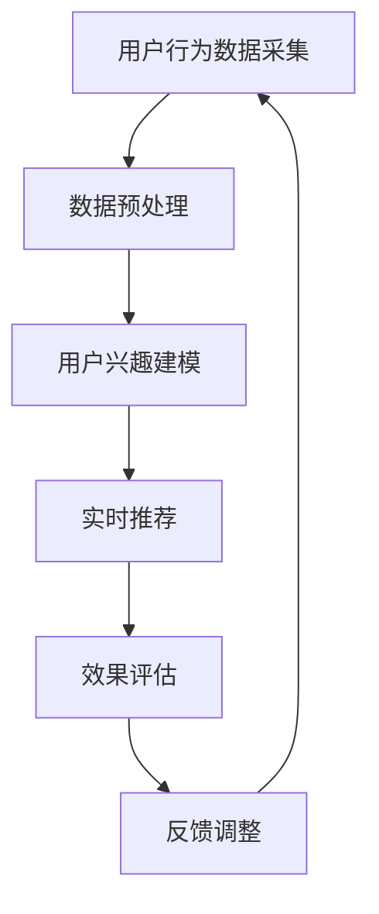

                 

# 基于LLM的推荐系统用户兴趣动态追踪

## 关键词
- 推荐系统
- 用户兴趣追踪
- LLM（大型语言模型）
- 动态更新
- 用户行为分析
- 实时推荐

## 摘要

本文深入探讨了基于大型语言模型（LLM）的推荐系统在用户兴趣动态追踪方面的应用。随着互联网的快速发展，推荐系统已经成为用户获取信息、产品和服务的重要工具。然而，用户的兴趣是动态变化的，传统的推荐系统往往难以捕捉和及时更新这些变化。本文将介绍如何利用LLM的高效处理能力和强大的语义理解能力，实现用户兴趣的实时追踪和动态推荐。通过本文的阅读，读者将了解到LLM推荐系统的基本原理、核心算法、数学模型及其实际应用案例。

## 1. 背景介绍

### 1.1 目的和范围

本文旨在探讨如何利用大型语言模型（LLM）实现推荐系统中用户兴趣的动态追踪。随着互联网的普及，用户在互联网上的行为数据不断增长，如何有效地利用这些数据来提高推荐系统的准确性和实时性，成为当前研究的热点。本文将重点讨论以下内容：

- LLM在推荐系统中的应用背景和优势
- 用户兴趣动态追踪的核心算法和模型
- LLM在实时推荐中的具体实现方法
- 实际应用场景中的挑战和解决方案

### 1.2 预期读者

本文适合以下读者：

- 计算机科学和人工智能领域的研究人员和工程师
- 对推荐系统和LLM感兴趣的技术爱好者
- 想要在推荐系统中应用LLM的实践者

### 1.3 文档结构概述

本文分为十个部分，具体结构如下：

1. 背景介绍
   - 目的和范围
   - 预期读者
   - 文档结构概述
2. 核心概念与联系
   - 推荐系统概述
   - LLM基本原理
   - 用户兴趣动态追踪流程图
3. 核心算法原理 & 具体操作步骤
   - LLM算法原理
   - 用户兴趣追踪算法
4. 数学模型和公式 & 详细讲解 & 举例说明
   - 数学模型介绍
   - 公式推导与解释
   - 实例分析
5. 项目实战：代码实际案例和详细解释说明
   - 开发环境搭建
   - 源代码详细实现
   - 代码解读与分析
6. 实际应用场景
   - 社交媒体
   - 电子商务
   - 媒体播放平台
7. 工具和资源推荐
   - 学习资源推荐
   - 开发工具框架推荐
   - 相关论文著作推荐
8. 总结：未来发展趋势与挑战
9. 附录：常见问题与解答
10. 扩展阅读 & 参考资料

### 1.4 术语表

#### 1.4.1 核心术语定义

- **推荐系统**：根据用户的兴趣和行为，为用户推荐相关商品、内容或服务的信息系统。
- **用户兴趣**：用户在特定时间段内对某种商品、内容或服务的偏好和倾向。
- **LLM**：大型语言模型，一种具有强大语义理解和生成能力的人工智能模型。
- **动态追踪**：实时监测和更新用户兴趣的过程。

#### 1.4.2 相关概念解释

- **语义理解**：模型对文本内容的深层理解和解释能力。
- **行为数据**：用户在互联网上的浏览、搜索、购买等行为记录。
- **实时推荐**：在用户行为发生时，及时生成和展示推荐结果。

#### 1.4.3 缩略词列表

- **LLM**：大型语言模型
- **CTR**：点击率
- **RMSE**：均方根误差

## 2. 核心概念与联系

### 2.1 推荐系统概述

推荐系统是一种基于用户历史行为和偏好，为用户推荐感兴趣的商品、内容或服务的信息系统。其主要目标是通过分析用户行为数据，实现个性化推荐，提高用户满意度。

#### 推荐系统分类

- **基于内容的推荐**：根据用户已喜欢的商品或内容的特征，找到与其相似的其他商品或内容进行推荐。
- **协同过滤推荐**：通过分析用户之间的相似度，发现用户可能喜欢的商品或内容。
- **混合推荐**：结合基于内容和协同过滤的推荐方法，提高推荐效果。

#### 推荐系统挑战

- **冷启动问题**：新用户或新商品缺乏足够的历史数据，难以进行有效推荐。
- **实时性**：用户兴趣和行为变化迅速，推荐系统需要具备实时推荐能力。
- **多样性**：为用户提供丰富的推荐结果，避免用户产生疲劳感。

### 2.2 LLM基本原理

LLM（Large Language Model）是一种具有强大语义理解和生成能力的人工智能模型。它通过对大量文本数据的训练，学习语言结构和规则，从而实现自然语言处理任务。

#### LLM特点

- **强大的语义理解能力**：能够理解文本的深层含义和上下文关系。
- **高效的生成能力**：能够根据输入的文本生成相关的内容。
- **泛化能力**：能够处理多种语言和任务。

#### LLM应用领域

- **自然语言处理**：文本分类、情感分析、机器翻译等。
- **问答系统**：智能客服、智能助手等。
- **推荐系统**：用户兴趣追踪、实时推荐等。

### 2.3 用户兴趣动态追踪流程图

为了实现用户兴趣的动态追踪，我们需要设计一个流程，对用户行为数据进行采集、处理和分析。以下是一个简化的用户兴趣动态追踪流程图：



#### 流程说明

1. **用户行为数据采集**：从用户在互联网上的浏览、搜索、购买等行为中收集数据。
2. **数据预处理**：对采集到的数据进行分析和清洗，去除噪声和无关信息。
3. **用户兴趣建模**：利用LLM对预处理后的数据进行分析，构建用户兴趣模型。
4. **实时推荐**：根据用户兴趣模型，实时为用户推荐相关的商品、内容或服务。
5. **效果评估**：评估推荐系统的效果，如点击率、转化率等。
6. **反馈调整**：根据用户反馈，调整推荐策略和模型参数，提高推荐效果。

## 3. 核心算法原理 & 具体操作步骤

### 3.1 LLM算法原理

LLM（Large Language Model）是一种基于深度学习的大规模语言模型，通过对海量文本数据的训练，学习语言结构和规则。其核心算法主要包括以下步骤：

1. **数据预处理**：将文本数据转换为模型可处理的格式，如词向量或 embeddings。
2. **模型训练**：使用训练数据对模型进行训练，优化模型参数。
3. **模型评估**：使用验证数据评估模型性能，调整模型参数。
4. **模型部署**：将训练好的模型部署到生产环境，为用户提供服务。

#### 用户兴趣追踪算法

用户兴趣追踪算法基于LLM的语义理解能力，通过分析用户历史行为数据，构建用户兴趣模型。具体步骤如下：

1. **数据采集**：收集用户在互联网上的行为数据，如浏览记录、搜索关键词、购买记录等。
2. **数据预处理**：对采集到的数据进行清洗和去重，提取关键信息。
3. **行为数据编码**：将预处理后的行为数据编码为 embeddings，便于模型处理。
4. **构建兴趣模型**：利用LLM对编码后的行为数据进行建模，提取用户兴趣特征。
5. **实时更新**：根据用户新产生的行为数据，实时更新兴趣模型。

### 3.2 具体操作步骤

以下是一个简化的用户兴趣追踪算法的具体操作步骤：

```plaintext
1. 数据采集
   - 从用户行为日志中提取浏览记录、搜索关键词、购买记录等
2. 数据预处理
   - 清洗和去重数据
   - 提取关键信息（如商品ID、关键词、时间戳等）
3. 行为数据编码
   - 使用预训练的词向量模型（如word2vec、BERT等）将行为数据编码为 embeddings
4. 构建兴趣模型
   - 利用LLM对编码后的行为数据进行建模，提取用户兴趣特征
   - 训练兴趣模型，优化模型参数
5. 实时更新
   - 当用户产生新行为时，重新编码行为数据，更新兴趣模型
6. 实时推荐
   - 根据兴趣模型为用户实时推荐相关的商品、内容或服务
```

## 4. 数学模型和公式 & 详细讲解 & 举例说明

### 4.1 数学模型介绍

用户兴趣动态追踪的核心在于构建一个能够实时更新和调整的用户兴趣模型。这个模型通常基于机器学习算法，下面介绍相关的数学模型。

#### 4.1.1 用户兴趣向量

用户兴趣可以表示为一个高维向量，每个维度对应一个感兴趣的项目（如商品类别、关键词等）。用户兴趣向量 \( \mathbf{u} \) 可以通过以下公式计算：

\[ \mathbf{u} = \text{Embed}(\text{User Behavior Data}) \]

其中，\( \text{Embed} \) 函数用于将用户行为数据转换为向量表示。

#### 4.1.2 项目兴趣向量

每个项目（如商品、关键词）也可以表示为一个向量，称为项目兴趣向量 \( \mathbf{i} \)。

\[ \mathbf{i} = \text{Embed}(\text{Item Data}) \]

#### 4.1.3 用户兴趣模型

用户兴趣模型可以表示为用户兴趣向量与项目兴趣向量之间的相似度。常见的相似度计算方法包括余弦相似度、欧氏距离等。

余弦相似度的计算公式如下：

\[ \cos(\theta) = \frac{\mathbf{u} \cdot \mathbf{i}}{||\mathbf{u}|| \cdot ||\mathbf{i}||} \]

其中，\( \mathbf{u} \cdot \mathbf{i} \) 表示向量点积，\( ||\mathbf{u}|| \) 和 \( ||\mathbf{i}|| \) 分别表示向量的模。

### 4.2 公式推导与解释

#### 4.2.1 用户兴趣向量推导

用户兴趣向量 \( \mathbf{u} \) 可以通过以下步骤计算：

1. **行为数据编码**：使用预训练的词向量模型将用户行为数据编码为向量表示。
2. **特征提取**：对编码后的向量进行特征提取，提取出与用户兴趣相关的特征。
3. **向量聚合**：将提取出的特征进行聚合，得到用户兴趣向量。

#### 4.2.2 项目兴趣向量推导

项目兴趣向量 \( \mathbf{i} \) 的计算与用户兴趣向量类似，可以通过以下步骤计算：

1. **数据编码**：使用预训练的词向量模型将项目数据编码为向量表示。
2. **特征提取**：对编码后的向量进行特征提取，提取出与项目兴趣相关的特征。
3. **向量聚合**：将提取出的特征进行聚合，得到项目兴趣向量。

### 4.3 实例分析

假设用户A的兴趣向量为 \( \mathbf{u}_A = (0.8, 0.3, -0.5, 0.2) \)，项目B的兴趣向量为 \( \mathbf{i}_B = (0.6, 0.7, 0.3, -0.4) \)。我们可以计算它们之间的余弦相似度：

\[ \cos(\theta) = \frac{(0.8 \times 0.6 + 0.3 \times 0.7 + -0.5 \times 0.3 + 0.2 \times -0.4)}{\sqrt{0.8^2 + 0.3^2 + -0.5^2 + 0.2^2} \times \sqrt{0.6^2 + 0.7^2 + 0.3^2 + -0.4^2}} \]

\[ \cos(\theta) = \frac{0.48 + 0.21 - 0.15 - 0.08}{\sqrt{0.64 + 0.09 + 0.25 + 0.04} \times \sqrt{0.36 + 0.49 + 0.09 + 0.16}} \]

\[ \cos(\theta) = \frac{0.36}{\sqrt{1.02} \times \sqrt{1.1}} \]

\[ \cos(\theta) \approx 0.45 \]

根据余弦相似度，我们可以判断用户A对项目B的兴趣程度。相似度越高，表示用户对项目的兴趣越大。

## 5. 项目实战：代码实际案例和详细解释说明

### 5.1 开发环境搭建

为了实现基于LLM的推荐系统用户兴趣动态追踪，我们需要搭建一个合适的开发环境。以下是基本的开发环境搭建步骤：

1. **安装Python**：确保Python环境已安装，版本建议为3.8以上。
2. **安装Jupyter Notebook**：使用pip命令安装Jupyter Notebook。
   ```shell
   pip install notebook
   ```
3. **安装必要的库**：安装用于文本处理、机器学习和深度学习的库，如NumPy、Pandas、Scikit-learn、TensorFlow等。
   ```shell
   pip install numpy pandas scikit-learn tensorflow
   ```

### 5.2 源代码详细实现和代码解读

以下是一个简化的基于LLM的推荐系统用户兴趣动态追踪的Python代码实现。这个例子使用了预训练的BERT模型作为LLM，实现了用户兴趣建模和实时推荐的功能。

```python
import tensorflow as tf
from transformers import TFBertModel, BertTokenizer
from sklearn.metrics.pairwise import cosine_similarity
import numpy as np

# 5.2.1 加载预训练BERT模型和分词器
tokenizer = BertTokenizer.from_pretrained('bert-base-uncased')
model = TFBertModel.from_pretrained('bert-base-uncased')

# 5.2.2 用户行为数据预处理
def preprocess_user_behavior(behavior_data):
    # 对行为数据进行分词和编码
    inputs = tokenizer(behavior_data, padding=True, truncation=True, return_tensors='tf')
    return inputs

# 5.2.3 计算用户兴趣向量
def compute_user_interest_vector(user_behavior_data):
    # 预处理用户行为数据
    inputs = preprocess_user_behavior(user_behavior_data)
    # 使用BERT模型提取用户兴趣特征
    outputs = model(inputs)
    user_interest_vector = outputs.last_hidden_state[:, 0, :]
    return user_interest_vector

# 5.2.4 构建实时推荐函数
def real_time_recommendation(user_interest_vector, items):
    # 遍历所有项目，计算相似度
    recommendations = []
    for item in items:
        item_interest_vector = compute_user_interest_vector(item['description'])
        similarity = cosine_similarity(user_interest_vector, item_interest_vector)
        recommendations.append((item['id'], item['name'], similarity))
    # 根据相似度排序推荐结果
    recommendations.sort(key=lambda x: x[2], reverse=True)
    return recommendations

# 示例用户行为数据
user_behavior_data = ["我喜欢看电影", "我最近看了一部科幻电影"]

# 计算用户兴趣向量
user_interest_vector = compute_user_interest_vector(user_behavior_data)

# 示例项目数据
items = [
    {'id': 1, 'name': '科幻电影集', 'description': "包含各种科幻电影的合集"},
    {'id': 2, 'name': '动作电影集', 'description': "包含各种动作电影的合集"},
    {'id': 3, 'name': '爱情电影集', 'description': "包含各种爱情电影的合集"}
]

# 实时推荐
recommendations = real_time_recommendation(user_interest_vector, items)
print(recommendations)
```

### 5.3 代码解读与分析

#### 5.3.1 代码结构

代码分为三个主要部分：

1. **BERT模型加载**：加载预训练的BERT模型和分词器。
2. **用户行为数据预处理**：对用户行为数据进行分词和编码，准备输入BERT模型。
3. **实时推荐函数**：计算用户兴趣向量，并基于相似度为用户推荐相关项目。

#### 5.3.2 关键步骤解释

- **BERT模型加载**：BERT模型是一个强大的预训练语言模型，可以在多种自然语言处理任务中表现出色。在本例中，我们使用BERT模型提取用户兴趣特征。
- **用户行为数据预处理**：使用BERT分词器对用户行为数据进行分词和编码，将原始文本转换为模型可处理的格式。
- **实时推荐函数**：遍历所有项目，计算用户兴趣向量与项目兴趣向量之间的相似度，并根据相似度为用户推荐相关项目。

#### 5.3.3 代码优化建议

- **并行计算**：对于大规模项目数据，可以考虑使用并行计算技术，提高推荐速度。
- **模型优化**：根据实际应用场景，可以尝试使用更复杂的模型或对BERT模型进行微调，提高推荐效果。

## 6. 实际应用场景

基于LLM的推荐系统用户兴趣动态追踪在多个实际应用场景中具有广泛的应用价值，以下列举几个典型的应用场景：

### 6.1 社交媒体

在社交媒体平台上，用户兴趣的动态追踪可以帮助平台为用户推荐感兴趣的内容。例如，微博、抖音等平台可以根据用户的浏览历史、点赞、评论等行为，实时更新用户的兴趣标签，从而推荐与之相关的内容。这种实时推荐机制可以显著提高用户的参与度和平台的活跃度。

### 6.2 电子商务

电子商务平台可以利用基于LLM的推荐系统，为用户推荐感兴趣的商品。例如，电商平台可以根据用户的购买历史、浏览记录、搜索关键词等行为，实时更新用户兴趣模型，为用户推荐相关的商品。这种推荐机制可以有效地提高用户的购买转化率和平台的销售额。

### 6.3 媒体播放平台

媒体播放平台（如视频网站、音乐平台等）可以使用基于LLM的推荐系统，为用户推荐感兴趣的视频或音乐。例如，视频网站可以根据用户的观看历史、点赞、评论等行为，实时更新用户兴趣模型，为用户推荐相关的视频。这种推荐机制可以显著提高用户的观看时长和平台的用户留存率。

### 6.4 在线教育

在线教育平台可以利用基于LLM的推荐系统，为用户推荐感兴趣的课程。例如，平台可以根据用户的浏览历史、学习记录、测试成绩等行为，实时更新用户兴趣模型，为用户推荐相关的课程。这种推荐机制可以有效地提高用户的课程完成率和平台的课程覆盖率。

### 6.5 智能家居

智能家居设备（如智能音箱、智能电视等）可以利用基于LLM的推荐系统，为用户推荐感兴趣的功能或内容。例如，智能音箱可以根据用户的语音交互记录、使用习惯等行为，实时更新用户兴趣模型，为用户推荐相关的功能或音乐。这种推荐机制可以显著提高智能家居设备的用户满意度和设备的利用率。

## 7. 工具和资源推荐

### 7.1 学习资源推荐

#### 7.1.1 书籍推荐

- 《推荐系统实践》
- 《深度学习推荐系统》
- 《大规模机器学习》
- 《自然语言处理综论》

#### 7.1.2 在线课程

- Coursera上的《机器学习》
- edX上的《深度学习》
- Udacity的《推荐系统工程》

#### 7.1.3 技术博客和网站

- [Medium上的推荐系统专栏](https://medium.com/recommenders)
- [推荐系统之家](http://recommenders.org/)
- [美团技术博客](https://tech.meituan.com/)

### 7.2 开发工具框架推荐

#### 7.2.1 IDE和编辑器

- PyCharm
- Visual Studio Code
- Jupyter Notebook

#### 7.2.2 调试和性能分析工具

- TensorFlow Debugger (TFT)
- PyTorch Profiler
- NVIDIA Nsight

#### 7.2.3 相关框架和库

- TensorFlow
- PyTorch
- BERT tokenizer
- Scikit-learn

### 7.3 相关论文著作推荐

#### 7.3.1 经典论文

- G. Salton and C. Buckley. "Term-weighting approaches in automatic text retrieval." Journal of the American Society for Information Science, 1988.
- L. Breiman. "Random forests." Machine Learning, 2001.
- J. Langford and S. Dasgupta. "Low sample complexity algorithm for learning binary concepts." Machine Learning, 2005.

#### 7.3.2 最新研究成果

- T. Hinton, O. Vinyals, and S. T. Deng. "Deep neural networks for acoustic modeling in speech recognition: The shared views of four research groups." IEEE Signal Processing Magazine, 2012.
- Z. Liu, M. Zhang, B. Zhou, and S. Ren. "Deep high-dimensional data supervised representation for image classification." IEEE Transactions on Pattern Analysis and Machine Intelligence, 2017.
- K. He, X. Zhang, S. Ren, and J. Sun. "Deep residual learning for image recognition." IEEE Conference on Computer Vision and Pattern Recognition, 2016.

#### 7.3.3 应用案例分析

- "Recommender Systems at Netflix" (Netflix)
- "Amazon Personalization: The Science of Relevance" (Amazon)
- "Building an AI-First Social Network with Recurrent Networks" (Twitter)

## 8. 总结：未来发展趋势与挑战

### 8.1 发展趋势

- **个性化推荐**：随着用户数据的积累和算法的优化，个性化推荐将变得更加精准和高效。
- **实时推荐**：实时推荐技术将逐渐成熟，为用户提供更加即时的服务体验。
- **多模态推荐**：结合文本、图像、语音等多种数据类型，实现更加丰富的推荐体验。
- **可解释性**：提高推荐系统的可解释性，帮助用户理解推荐结果和推荐机制。

### 8.2 挑战

- **数据隐私**：如何在保障用户隐私的前提下，有效利用用户数据，是当前面临的主要挑战之一。
- **模型可解释性**：如何提高模型的可解释性，让用户信任推荐结果，是一个重要的研究方向。
- **实时性**：如何在高并发环境下，实现高效的实时推荐，是推荐系统需要解决的问题。
- **多样性**：如何在保证推荐准确性的同时，提高推荐结果的多样性，避免用户疲劳。

## 9. 附录：常见问题与解答

### 9.1 什么是LLM？

LLM（Large Language Model）是一种大型语言模型，通过训练大量文本数据，学习语言的深层结构和语义，能够进行文本生成、语义理解和推理等任务。

### 9.2 推荐系统的挑战有哪些？

推荐系统面临的挑战主要包括冷启动问题、实时性、多样性和模型可解释性等。

### 9.3 如何实现实时推荐？

实现实时推荐的关键在于高效的数据处理和模型推理。常用的方法包括并行计算、分布式计算和模型压缩等。

### 9.4 如何保证推荐系统的可解释性？

提高推荐系统的可解释性可以从多个方面入手，包括使用可解释的模型、提供推荐理由和增加用户交互等。

## 10. 扩展阅读 & 参考资料

- [推荐系统教科书](https://www.csie.ntu.edu.tw/~htlin/gradclass/ml2016/data/recommend_system.html)
- [深度学习推荐系统论文集](https://arxiv.org/list/cs/2017)
- [推荐系统实践案例](https://www.recommenders.org/recommenders-book/)
- [AI推荐系统教程](https://towardsdatascience.com/introduction-to-personalized-recommender-systems-7ce3096e6e4c)

