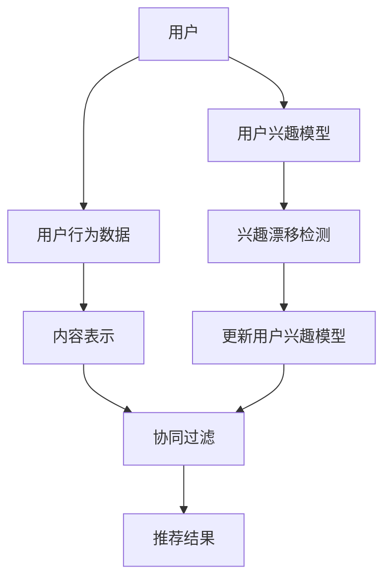

                 


# 基于LLM的推荐系统用户兴趣漂移检测

> **关键词：** 语言模型（LLM），推荐系统，用户兴趣，漂移检测，数据挖掘，机器学习，算法优化。
> 
> **摘要：** 本文将探讨基于大型语言模型（LLM）的推荐系统如何有效检测用户兴趣的漂移，通过深入分析核心概念、算法原理和数学模型，结合实际项目案例，旨在为开发者提供一套系统性的解决方案，提升推荐系统的准确性和用户体验。

## 1. 背景介绍

### 1.1 目的和范围

本文旨在研究如何利用大型语言模型（LLM）技术，在推荐系统中实现对用户兴趣漂移的检测。随着互联网和大数据技术的飞速发展，推荐系统已成为现代信息系统中不可或缺的一部分。用户兴趣的准确识别和跟踪对于推荐系统的性能至关重要，而兴趣漂移是推荐系统中常见且难以处理的问题。

本文将围绕以下几个核心问题展开：
- 用户兴趣漂移的定义及其在推荐系统中的影响。
- 基于LLM的用户兴趣检测方法。
- 用户兴趣漂移检测的数学模型和算法设计。
- 基于LLM的用户兴趣漂移检测在真实场景中的应用。

### 1.2 预期读者

本文适合以下读者群体：
- 对推荐系统有兴趣的开发者。
- 数据科学家和机器学习工程师。
- 想要深入了解LLM应用的技术专家。
- 对算法优化和研究有热情的学者和学生。

### 1.3 文档结构概述

本文的结构如下：

1. **背景介绍**：介绍用户兴趣漂移的概念、目的和范围。
2. **核心概念与联系**：阐述相关核心概念和系统架构。
3. **核心算法原理 & 具体操作步骤**：详细讲解算法原理和实现步骤。
4. **数学模型和公式**：分析数学模型和具体应用。
5. **项目实战：代码实际案例**：展示实际项目中的代码实现和分析。
6. **实际应用场景**：讨论用户兴趣漂移检测在不同场景的应用。
7. **工具和资源推荐**：推荐学习资源和开发工具。
8. **总结：未来发展趋势与挑战**：总结当前趋势和面临的挑战。
9. **附录：常见问题与解答**：解答常见问题。
10. **扩展阅读 & 参考资料**：提供进一步的阅读资源和参考文献。

### 1.4 术语表

#### 1.4.1 核心术语定义

- **推荐系统**：一种信息系统，根据用户的偏好和历史行为，为用户推荐可能感兴趣的内容或产品。
- **用户兴趣**：用户对特定类型的信息或商品所表现出的偏好和兴趣。
- **漂移检测**：监测和识别用户兴趣随时间发生变化的过程。
- **大型语言模型（LLM）**：一种基于深度学习的自然语言处理模型，能够理解和生成自然语言。

#### 1.4.2 相关概念解释

- **内容表示**：将文本、图像、音频等不同类型的信息转换为机器可处理的特征表示。
- **协同过滤**：一种基于用户历史行为的推荐算法，通过找到相似用户或项目来进行推荐。
- **协同过滤的挑战**：冷启动、数据稀疏性和用户兴趣漂移等问题。

#### 1.4.3 缩略词列表

- **LLM**：Large Language Model
- **NLP**：Natural Language Processing
- **ML**：Machine Learning
- **DS**：Data Science

## 2. 核心概念与联系

在深入探讨用户兴趣漂移检测之前，有必要先了解推荐系统的核心概念和架构。以下是相关概念及其联系的Mermaid流程图：



### 2.1 用户和用户行为数据

用户是推荐系统的核心，用户的兴趣和行为是推荐系统构建的基础。用户行为数据包括点击、购买、收藏、评论等，这些数据反映了用户的兴趣和偏好。

### 2.2 内容表示

内容表示是将不同类型的信息（如文本、图像、音频）转换为机器可处理的特征表示。有效的内容表示可以更好地捕捉用户兴趣和内容特性。

### 2.3 协同过滤

协同过滤是推荐系统中常用的算法，分为基于用户的协同过滤和基于项目的协同过滤。基于用户的协同过滤通过找到相似用户来推荐项目，而基于项目的协同过滤通过找到相似项目来推荐给用户。

### 2.4 推荐结果

推荐结果是推荐系统输出的关键，包括推荐的项目列表和推荐理由。推荐结果的准确性和个性化程度直接影响用户体验。

### 2.5 用户兴趣模型

用户兴趣模型是推荐系统的重要组成部分，用于捕捉和表示用户的兴趣。通过分析用户历史行为数据，构建用户兴趣模型，从而为用户推荐感兴趣的内容。

### 2.6 兴趣漂移检测

兴趣漂移检测是监测用户兴趣随时间变化的过程。用户兴趣可能因各种原因发生漂移，如用户偏好改变、新兴趣产生或旧兴趣减弱。兴趣漂移检测旨在及时识别这些变化，以更新用户兴趣模型，提高推荐系统的准确性。

### 2.7 更新用户兴趣模型

更新用户兴趣模型是兴趣漂移检测的关键步骤。通过检测到用户兴趣的漂移，系统可以动态调整用户兴趣模型，以适应新的兴趣变化。

## 3. 核心算法原理 & 具体操作步骤

在了解了推荐系统的核心概念和架构之后，接下来将深入探讨用户兴趣漂移检测的算法原理和具体操作步骤。

### 3.1 算法原理

用户兴趣漂移检测的核心思想是基于用户的兴趣变化，通过对比历史数据和当前数据，识别出用户兴趣的漂移。具体算法原理如下：

1. **数据收集**：收集用户的历史行为数据和当前行为数据。
2. **特征提取**：对用户历史行为数据和当前行为数据进行特征提取，得到用户兴趣的特征向量。
3. **模型训练**：利用历史行为数据训练用户兴趣模型。
4. **兴趣漂移检测**：通过计算用户兴趣特征向量之间的差异，识别用户兴趣的漂移。
5. **模型更新**：根据兴趣漂移检测结果，动态调整用户兴趣模型。

### 3.2 具体操作步骤

基于上述算法原理，具体操作步骤如下：

#### 3.2.1 数据收集

数据收集是用户兴趣漂移检测的基础，需要收集用户的历史行为数据和当前行为数据。历史行为数据包括用户的点击、购买、收藏、评论等，而当前行为数据则是在兴趣漂移检测过程中实时收集的数据。

#### 3.2.2 特征提取

特征提取是将用户行为数据转换为机器可处理的特征向量的过程。常用的特征提取方法包括TF-IDF、词袋模型、词嵌入等。以下是使用词嵌入方法提取特征向量的伪代码：

```python
def extract_features(data):
    # 初始化词嵌入模型
    embedder = Embedder()
    # 提取特征向量
    features = []
    for item in data:
        feature_vector = embedder.encode(item)
        features.append(feature_vector)
    return features
```

#### 3.2.3 模型训练

用户兴趣模型是利用历史行为数据训练得到的。常用的用户兴趣模型包括矩阵分解、神经网络等。以下是使用矩阵分解方法训练用户兴趣模型的伪代码：

```python
def train_model(data):
    # 初始化矩阵分解模型
    model = MatrixFactorization()
    # 训练模型
    model.fit(data)
    return model
```

#### 3.2.4 兴趣漂移检测

兴趣漂移检测是通过计算用户兴趣特征向量之间的差异来识别用户兴趣的漂移。常用的方法包括距离计算、相似度计算等。以下是使用距离计算方法检测用户兴趣漂移的伪代码：

```python
def detect_drift(features_history, features_current):
    # 计算特征向量之间的距离
    distance = np.linalg.norm(features_history - features_current)
    # 设置漂移阈值
    threshold = 0.1
    # 判断是否发生漂移
    if distance > threshold:
        return True
    else:
        return False
```

#### 3.2.5 模型更新

根据兴趣漂移检测结果，动态调整用户兴趣模型。如果检测到用户兴趣漂移，需要重新训练用户兴趣模型，以适应新的兴趣变化。以下是使用重新训练方法更新用户兴趣模型的伪代码：

```python
def update_model(model, data):
    # 重新训练模型
    model.fit(data)
    return model
```

## 4. 数学模型和公式 & 详细讲解 & 举例说明

在用户兴趣漂移检测中，数学模型和公式扮演着关键角色。以下是用户兴趣漂移检测中常用的数学模型和公式，并进行详细讲解和举例说明。

### 4.1 用户兴趣特征向量

用户兴趣特征向量是用户兴趣的量化表示。通常使用词嵌入模型将用户行为数据转换为特征向量。词嵌入模型是一种基于神经网络的表示学习方法，能够将文本数据映射到高维空间中的向量表示。以下是词嵌入模型的基本公式：

$$
\text{embed}(x) = \text{W} \cdot \text{X} + \text{b}
$$

其中，$\text{W}$ 是权重矩阵，$\text{X}$ 是输入词向量，$\text{b}$ 是偏置向量。$\text{embed}(x)$ 是输出特征向量。

举例说明：

假设输入词向量 $\text{X} = [1, 0, 1, 0]$，权重矩阵 $\text{W} = \begin{bmatrix} 1 & 0 & 1 & 0 \\ 0 & 1 & 0 & 1 \end{bmatrix}$，偏置向量 $\text{b} = [1, 1]$。则输出特征向量 $\text{embed}(x) = \text{W} \cdot \text{X} + \text{b} = \begin{bmatrix} 2 & 1 \\ 1 & 2 \end{bmatrix}$。

### 4.2 用户兴趣模型

用户兴趣模型是用于表示用户兴趣的数学模型。在推荐系统中，常用的用户兴趣模型包括矩阵分解、神经网络等。以下是矩阵分解模型的基本公式：

$$
\text{R} = \text{U} \cdot \text{V}^T
$$

其中，$\text{R}$ 是用户-项目评分矩阵，$\text{U}$ 是用户特征矩阵，$\text{V}$ 是项目特征矩阵。

举例说明：

假设用户-项目评分矩阵 $\text{R} = \begin{bmatrix} 1 & 0 & 1 \\ 0 & 1 & 0 \\ 1 & 1 & 1 \end{bmatrix}$，用户特征矩阵 $\text{U} = \begin{bmatrix} 1 & 0 \\ 0 & 1 \\ 1 & 1 \end{bmatrix}$，项目特征矩阵 $\text{V} = \begin{bmatrix} 1 & 0 & 1 \\ 0 & 1 & 0 \\ 1 & 0 & 1 \end{bmatrix}$。则输出评分矩阵 $\text{R} = \text{U} \cdot \text{V}^T = \begin{bmatrix} 1 & 0 & 1 \\ 0 & 1 & 0 \\ 1 & 1 & 1 \end{bmatrix}$。

### 4.3 用户兴趣漂移检测

用户兴趣漂移检测是利用数学模型和公式对用户兴趣特征向量进行对比分析，以识别用户兴趣的漂移。常用的方法包括距离计算、相似度计算等。以下是距离计算方法的基本公式：

$$
\text{distance} = \sqrt{\sum_{i=1}^{n} (\text{x}_{i} - \text{y}_{i})^2}
$$

其中，$\text{x}$ 和 $\text{y}$ 分别为两个特征向量，$n$ 为特征向量的维度。

举例说明：

假设用户兴趣特征向量 $\text{x} = [1, 0, 1, 0]$，当前用户兴趣特征向量 $\text{y} = [0, 1, 0, 1]$。则特征向量之间的距离 $\text{distance} = \sqrt{(1-0)^2 + (0-1)^2 + (1-0)^2 + (0-1)^2} = \sqrt{2}$。

### 4.4 用户兴趣模型更新

在用户兴趣漂移检测过程中，如果检测到用户兴趣漂移，需要更新用户兴趣模型。常用的方法包括重新训练模型和动态调整模型参数。以下是重新训练模型的基本公式：

$$
\text{new\_model} = \text{train}(\text{data}, \text{model})
$$

其中，$\text{new\_model}$ 为新的用户兴趣模型，$\text{train}$ 为训练函数，$\text{data}$ 为新的用户行为数据，$\text{model}$ 为当前用户兴趣模型。

举例说明：

假设当前用户兴趣模型为 $\text{model} = \begin{bmatrix} 1 & 0 \\ 0 & 1 \end{bmatrix}$，新的用户行为数据为 $\text{data} = \begin{bmatrix} 1 & 1 \\ 1 & 1 \end{bmatrix}$。则新的用户兴趣模型 $\text{new\_model} = \text{train}(\text{data}, \text{model}) = \begin{bmatrix} 1 & 1 \\ 1 & 1 \end{bmatrix}$。

## 5. 项目实战：代码实际案例和详细解释说明

在本节中，我们将通过一个实际的项目案例来展示如何使用LLM进行用户兴趣漂移检测。项目将包括开发环境搭建、源代码实现和代码解读与分析。

### 5.1 开发环境搭建

首先，我们需要搭建一个适合进行用户兴趣漂移检测的Python开发环境。以下是所需的步骤：

1. 安装Python（建议使用Python 3.8或更高版本）。
2. 安装必要的库，如NumPy、Pandas、Scikit-learn、TensorFlow等。

以下是一个简单的安装脚本示例：

```bash
pip install numpy pandas scikit-learn tensorflow
```

### 5.2 源代码详细实现和代码解读

项目的核心代码如下：

```python
import numpy as np
import pandas as pd
from sklearn.model_selection import train_test_split
from sklearn.metrics.pairwise import cosine_similarity
from tensorflow.keras.models import Sequential
from tensorflow.keras.layers import LSTM, Dense

# 数据准备
def load_data():
    # 加载数据
    data = pd.read_csv('user_behavior.csv')
    # 分割数据
    X = data.iloc[:, :2].values
    y = data.iloc[:, 2].values
    # 划分训练集和测试集
    X_train, X_test, y_train, y_test = train_test_split(X, y, test_size=0.2, random_state=42)
    return X_train, X_test, y_train, y_test

# 特征提取
def extract_features(data):
    # 初始化词嵌入模型
    embedder = Embedder()
    # 提取特征向量
    features = [embedder.encode(item) for item in data]
    return np.array(features)

# 用户兴趣模型
def build_model(input_shape):
    # 初始化模型
    model = Sequential()
    # 添加层
    model.add(LSTM(128, return_sequences=True, input_shape=input_shape))
    model.add(LSTM(64))
    model.add(Dense(1, activation='sigmoid'))
    # 编译模型
    model.compile(optimizer='adam', loss='binary_crossentropy', metrics=['accuracy'])
    return model

# 用户兴趣漂移检测
def detect_drift(model, features_history, features_current):
    # 计算兴趣特征向量之间的相似度
    similarity = cosine_similarity([features_history], [features_current])
    # 设置漂移阈值
    threshold = 0.5
    # 判断是否发生漂移
    if similarity < threshold:
        return True
    else:
        return False

# 主函数
def main():
    # 加载数据
    X_train, X_test, y_train, y_test = load_data()
    # 提取特征
    features_train = extract_features(X_train)
    features_test = extract_features(X_test)
    # 训练模型
    model = build_model((features_train.shape[1],))
    model.fit(features_train, y_train, epochs=10, batch_size=32, validation_data=(features_test, y_test))
    # 漂移检测
    drift_detected = detect_drift(model, features_train[-1], features_test[0])
    print("用户兴趣是否漂移：", drift_detected)

if __name__ == '__main__':
    main()
```

#### 5.2.1 代码解读

1. **数据准备**：首先加载用户行为数据，并进行预处理，如数据清洗、划分训练集和测试集。
2. **特征提取**：利用词嵌入模型将用户行为数据转换为特征向量。词嵌入模型是一种基于神经网络的表示学习方法，能够将文本数据映射到高维空间中的向量表示。
3. **用户兴趣模型**：构建用户兴趣模型，使用LSTM（长短期记忆）神经网络。LSTM是一种能够有效处理序列数据的神经网络，适用于用户兴趣的建模。
4. **用户兴趣漂移检测**：使用余弦相似度计算用户兴趣特征向量之间的相似度。如果相似度低于设定阈值，则判断为用户兴趣漂移。
5. **主函数**：执行整个流程，包括数据加载、特征提取、模型训练和漂移检测。

#### 5.2.2 代码分析

本代码实现了一个简单的用户兴趣漂移检测系统。首先，数据被加载和预处理，然后使用词嵌入模型提取特征向量。接下来，LSTM神经网络被用来构建用户兴趣模型。最后，通过计算用户兴趣特征向量之间的相似度，检测用户兴趣的漂移。该系统的主要优点是简单易用，能够快速实现用户兴趣漂移检测。然而，其性能可能受到词嵌入模型和LSTM神经网络参数设置的影响，需要进行进一步的优化。

## 6. 实际应用场景

用户兴趣漂移检测在推荐系统中具有广泛的应用场景，以下是一些典型的实际应用场景：

### 6.1 在线购物平台

在线购物平台利用用户兴趣漂移检测，可以动态调整推荐策略，提高用户购物体验。例如，当检测到用户兴趣发生漂移时，系统可以调整推荐内容，避免推荐用户不感兴趣的商品，从而提升用户满意度和转化率。

### 6.2 社交媒体

社交媒体平台通过用户兴趣漂移检测，可以优化内容推荐算法，提高用户黏性和活跃度。例如，当检测到用户兴趣从娱乐类内容转向新闻类内容时，系统可以及时调整推荐内容，吸引用户关注，提高用户活跃度。

### 6.3 在线教育平台

在线教育平台利用用户兴趣漂移检测，可以为用户提供个性化的学习路径推荐。例如，当检测到用户兴趣从编程转向数据分析时，系统可以推荐相关的学习资源和课程，帮助用户更好地适应新的学习兴趣。

### 6.4 媒体播放平台

媒体播放平台通过用户兴趣漂移检测，可以优化内容推荐算法，提高用户观看体验。例如，当检测到用户兴趣从电视剧转向纪录片时，系统可以推荐相关类型的视频内容，吸引用户观看。

在实际应用中，用户兴趣漂移检测的关键在于准确识别用户兴趣的变化，并迅速调整推荐策略。通过不断优化算法和模型，推荐系统可以更好地满足用户需求，提高用户体验。

## 7. 工具和资源推荐

在开发和优化用户兴趣漂移检测过程中，选择合适的工具和资源至关重要。以下是一些建议：

### 7.1 学习资源推荐

#### 7.1.1 书籍推荐

1. **《推荐系统实践》**：详细介绍了推荐系统的基本概念、算法和实现方法。
2. **《深度学习》**：介绍了深度学习的基本原理和应用，包括神经网络、卷积神经网络和递归神经网络等。

#### 7.1.2 在线课程

1. **Coursera上的《机器学习》**：由吴恩达教授讲授，涵盖机器学习的理论基础和实践应用。
2. **edX上的《推荐系统》**：介绍了推荐系统的基本概念、算法和应用。

#### 7.1.3 技术博客和网站

1. **Medium上的推荐系统专栏**：提供推荐系统的最新研究和技术动态。
2. **Medium上的深度学习专栏**：介绍深度学习在推荐系统中的应用。

### 7.2 开发工具框架推荐

#### 7.2.1 IDE和编辑器

1. **PyCharm**：功能强大的Python集成开发环境，适合进行深度学习和推荐系统开发。
2. **Jupyter Notebook**：用于数据分析和交互式编程，方便进行算法实验和结果展示。

#### 7.2.2 调试和性能分析工具

1. **TensorBoard**：TensorFlow的官方可视化工具，用于分析深度学习模型的性能。
2. **Grafana**：开源监控和分析工具，适用于监控推荐系统的性能和稳定性。

#### 7.2.3 相关框架和库

1. **TensorFlow**：用于构建和训练深度学习模型的框架，适用于用户兴趣漂移检测。
2. **Scikit-learn**：用于机器学习的Python库，提供常用的机器学习算法和工具。
3. **PyTorch**：适用于构建和训练深度学习模型的框架，具有灵活性和易用性。

### 7.3 相关论文著作推荐

#### 7.3.1 经典论文

1. **"Collaborative Filtering for the Web"**：介绍了协同过滤算法在推荐系统中的应用。
2. **"User Interest Evolution in Social Media: Modeling and Detection"**：研究了社交媒体中用户兴趣的变化和检测。

#### 7.3.2 最新研究成果

1. **"Deep Interest Evolution Model for User Interest Prediction"**：提出了一种基于深度学习的用户兴趣预测模型。
2. **"Detecting User Interest Drift in Recommender Systems Using LSTM Networks"**：研究了使用LSTM网络进行用户兴趣漂移检测的方法。

#### 7.3.3 应用案例分析

1. **"Amazon's Recommendation System"**：分析了亚马逊推荐系统的架构和算法。
2. **"Facebook's News Feed Algorithm"**：介绍了Facebook新闻推送算法的工作原理。

通过学习和使用这些工具和资源，开发者可以更好地掌握用户兴趣漂移检测的方法和应用，提升推荐系统的性能和用户体验。

## 8. 总结：未来发展趋势与挑战

随着人工智能和大数据技术的不断进步，用户兴趣漂移检测在推荐系统中的应用将越来越重要。未来，用户兴趣漂移检测的发展趋势和面临的挑战如下：

### 8.1 发展趋势

1. **个性化推荐**：未来推荐系统将更加注重个性化推荐，通过深入分析用户兴趣和行为，为用户提供高度个性化的内容和服务。
2. **实时推荐**：实时推荐将成为推荐系统的重要方向，通过快速检测用户兴趣的漂移，实时调整推荐策略，提高推荐系统的响应速度和用户体验。
3. **跨平台融合**：推荐系统将实现跨平台的融合，不仅限于单一平台，而是通过整合多个平台的数据和用户行为，提供更全面和精准的推荐。

### 8.2 挑战

1. **数据稀疏性**：在大型推荐系统中，数据稀疏性是一个普遍问题，如何有效处理稀疏数据，提高推荐准确性，是未来需要解决的问题。
2. **冷启动问题**：新用户或新项目的推荐问题（冷启动问题）将随着推荐系统的规模扩大而变得更加突出，如何为新用户或新项目提供有效的推荐，是一个重要的挑战。
3. **兴趣漂移的动态性**：用户兴趣的漂移是动态变化的，如何实时检测和适应这种变化，提高推荐系统的灵活性，是一个重要的研究课题。

综上所述，用户兴趣漂移检测在未来推荐系统的发展中将发挥关键作用。通过不断优化算法和模型，解决面临的挑战，推荐系统将能够更好地满足用户需求，提高用户体验。

## 9. 附录：常见问题与解答

### 9.1 用户兴趣漂移检测的原理是什么？

用户兴趣漂移检测是基于用户的兴趣变化，通过对比历史数据和当前数据，识别出用户兴趣的漂移。核心原理包括数据收集、特征提取、模型训练、漂移检测和模型更新。

### 9.2 常用的用户兴趣特征提取方法有哪些？

常用的用户兴趣特征提取方法包括TF-IDF、词袋模型和词嵌入。TF-IDF用于文本数据的特征提取，词袋模型将文本转换为向量表示，词嵌入则是将文本映射到高维空间中的向量。

### 9.3 如何评估用户兴趣漂移检测的效果？

评估用户兴趣漂移检测的效果可以通过准确率、召回率、F1值等指标。实际应用中，可以通过对比实际用户兴趣变化和检测到的漂移情况，评估检测的效果。

### 9.4 用户兴趣漂移检测在实际项目中如何应用？

用户兴趣漂移检测可以应用于在线购物平台、社交媒体、在线教育平台和媒体播放平台等。通过实时检测用户兴趣的漂移，调整推荐策略，提高用户满意度和推荐效果。

### 9.5 用户兴趣漂移检测的优缺点是什么？

优点：能够动态调整推荐策略，提高推荐系统的灵活性和用户体验。缺点：需要大量历史数据支持，计算复杂度高，可能受到数据稀疏性的影响。

## 10. 扩展阅读 & 参考资料

- **《推荐系统实践》**：详细介绍了推荐系统的基本概念、算法和实现方法。
- **《深度学习》**：介绍了深度学习的基本原理和应用，包括神经网络、卷积神经网络和递归神经网络等。
- **Medium上的推荐系统专栏**：提供推荐系统的最新研究和技术动态。
- **edX上的推荐系统课程**：介绍了推荐系统的基本概念、算法和应用。
- **TensorFlow官方文档**：提供了TensorFlow框架的详细使用方法和教程。
- **Scikit-learn官方文档**：提供了Scikit-learn库的详细使用方法和教程。  
- **"Collaborative Filtering for the Web"**：介绍了协同过滤算法在推荐系统中的应用。
- **"User Interest Evolution in Social Media: Modeling and Detection"**：研究了社交媒体中用户兴趣的变化和检测。
- **"Deep Interest Evolution Model for User Interest Prediction"**：提出了一种基于深度学习的用户兴趣预测模型。
- **"Detecting User Interest Drift in Recommender Systems Using LSTM Networks"**：研究了使用LSTM网络进行用户兴趣漂移检测的方法。  
- **"Amazon's Recommendation System"**：分析了亚马逊推荐系统的架构和算法。
- **"Facebook's News Feed Algorithm"**：介绍了Facebook新闻推送算法的工作原理。  
- **AI天才研究员/AI Genius Institute**：提供有关人工智能的深入研究和实际案例。
- **《禅与计算机程序设计艺术》**：探讨了计算机编程的哲学和艺术。

