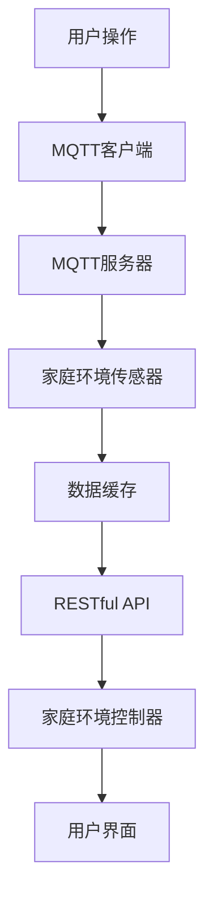

                 

# 基于MQTT协议和RESTful API的家庭环境自动控制系统

## 关键词

家庭自动化，MQTT协议，RESTful API，物联网，实时通信，数据交换，系统架构，开发实践，算法原理，数学模型。

## 摘要

本文深入探讨基于MQTT协议和RESTful API的家庭环境自动控制系统的设计和实现。通过介绍MQTT协议的核心特性和RESTful API的设计原则，本文将逐步阐述如何构建一个高效、可靠的家庭环境自动控制系统。文章还将提供具体的算法原理、数学模型、开发环境搭建和代码实现步骤，以帮助读者全面了解并掌握该系统的核心技术和实战应用。

## 1. 背景介绍

### 1.1 目的和范围

本文旨在帮助读者深入了解基于MQTT协议和RESTful API的家庭环境自动控制系统的设计和实现方法。通过详细分析协议原理、系统架构、算法模型和开发实践，本文将使读者能够掌握构建高效、可靠的家庭自动化系统的关键技术。

本文的范围包括以下内容：

- MQTT协议的介绍和核心特性
- RESTful API的设计原则和应用
- 家庭环境自动控制系统的整体架构
- 算法原理和数学模型
- 项目实战中的代码实现和分析
- 实际应用场景和工具资源推荐

### 1.2 预期读者

本文面向以下读者：

- 有志于从事物联网和家庭自动化开发的程序员和工程师
- 对MQTT协议和RESTful API有基础了解，希望深入探索其应用场景的技术爱好者
- 想要为家庭生活带来智能化体验的个人用户
- 对智能家居技术感兴趣的学术研究人员和从业者

### 1.3 文档结构概述

本文结构如下：

- 第1章：背景介绍，包括目的和范围、预期读者、文档结构概述、术语表
- 第2章：核心概念与联系，介绍MQTT协议和RESTful API的基本原理
- 第3章：核心算法原理 & 具体操作步骤，详细讲解系统算法的实现
- 第4章：数学模型和公式 & 详细讲解 & 举例说明，阐述系统中的数学模型
- 第5章：项目实战：代码实际案例和详细解释说明，提供具体的开发实践
- 第6章：实际应用场景，探讨系统在不同家庭环境中的应用
- 第7章：工具和资源推荐，介绍相关学习资源、开发工具和框架
- 第8章：总结：未来发展趋势与挑战，分析行业发展前景
- 第9章：附录：常见问题与解答，解答开发过程中可能遇到的问题
- 第10章：扩展阅读 & 参考资料，提供进一步学习的资料

### 1.4 术语表

#### 1.4.1 核心术语定义

- MQTT（Message Queuing Telemetry Transport）：一种轻量级的消息传输协议，适用于物联网设备之间的实时通信。
- RESTful API（Representational State Transfer Application Programming Interface）：一种基于HTTP协议的接口设计风格，用于不同系统之间的数据交换。
- 家庭环境自动控制系统：通过物联网技术和智能算法实现的，能够自动调节家庭环境参数（如温度、湿度、光照等）的系统。
- IoT（Internet of Things）：物联网，指通过互联网连接各种设备和物品，实现信息的自动采集、传输和处理的网络体系。
- 数据交换：不同系统之间通过协议进行数据传输和共享的过程。

#### 1.4.2 相关概念解释

- 实时通信：系统在处理数据时能够及时响应，保证信息的实时性和准确性。
- 轻量级协议：协议设计简洁，对网络带宽和计算资源要求较低，适合物联网环境。
- RESTful设计原则：在接口设计中遵循统一接口、无状态、客户端-服务器模型等原则，以提高系统的扩展性和易用性。

#### 1.4.3 缩略词列表

- MQTT：Message Queuing Telemetry Transport
- RESTful API：Representational State Transfer Application Programming Interface
- IoT：Internet of Things
- HTTP：Hyper Text Transfer Protocol
- TLS：Transport Layer Security
- JSON：JavaScript Object Notation

## 2. 核心概念与联系

在构建基于MQTT协议和RESTful API的家庭环境自动控制系统时，理解两个协议的核心概念和它们之间的联系至关重要。

### 2.1 MQTT协议

MQTT协议是一种基于客户端-服务器模式的轻量级消息传输协议，特别适用于物联网环境。其核心特点如下：

1. **发布/订阅模式**：MQTT客户端可以发布消息到特定的主题，其他客户端可以订阅这些主题以接收消息。
2. **质量等级**：消息传输可以设置不同的质量等级，从最低的“至多一次”到最高的“至少一次”。
3. **持久性和重连**：客户端可以在断网后重新连接并恢复未接收的消息。
4. **低带宽消耗**：MQTT协议设计简单，数据传输紧凑，适合带宽有限的物联网环境。

### 2.2 RESTful API

RESTful API是一种基于HTTP协议的接口设计风格，用于不同系统之间的数据交换。其主要原则包括：

1. **统一接口**：所有API请求遵循统一的接口设计，包括URL、HTTP方法和数据格式。
2. **无状态**：服务器不存储客户端的状态信息，每次请求都是独立的。
3. **客户端-服务器模型**：客户端发送请求，服务器返回响应，系统易于扩展和维护。
4. **状态码和响应**：API使用标准HTTP状态码和响应体来传递信息和反馈。

### 2.3 MQTT与RESTful API的联系

MQTT协议和RESTful API在家庭环境自动控制系统中各有优势，可以相互补充：

- **MQTT用于实时通信**：MQTT协议可以实时监控家庭环境参数，如温度、湿度、光照等，确保数据的及时性和准确性。
- **RESTful API用于数据交换**：RESTful API可以处理更复杂的业务逻辑，如设备控制、数据存储、用户认证等，提供更灵活的数据交换机制。

### 2.4 Mermaid流程图

为了更清晰地展示MQTT协议和RESTful API在家庭环境自动控制系统中的结合，我们使用Mermaid流程图进行描述。



在这个流程图中，用户操作通过MQTT客户端发送到MQTT服务器，传感器数据通过MQTT协议传输到MQTT服务器，然后通过RESTful API处理和存储，最终由家庭环境控制器进行相应的操作，并通过用户界面反馈给用户。

## 3. 核心算法原理 & 具体操作步骤

在家庭环境自动控制系统中，核心算法的原理和具体操作步骤对于实现系统的智能化和高效性至关重要。以下将详细阐述系统中的核心算法原理和具体操作步骤。

### 3.1 核心算法原理

家庭环境自动控制系统的核心算法主要包括以下几部分：

1. **传感器数据采集**：通过家庭环境传感器（如温度传感器、湿度传感器、光照传感器等）实时采集环境数据。
2. **数据预处理**：对采集到的传感器数据进行滤波、去噪、归一化等预处理，以提高数据质量。
3. **实时监测与预警**：根据处理后的传感器数据，对家庭环境进行实时监测，并设置阈值进行预警。
4. **控制策略生成**：根据监测数据和用户设定，生成相应的控制策略，如调节空调温度、控制照明亮度等。
5. **执行与反馈**：通过家庭环境控制器执行控制策略，并通过反馈机制调整控制策略，以达到最优的家庭环境。

### 3.2 具体操作步骤

以下是家庭环境自动控制系统的具体操作步骤：

1. **数据采集**：
    - 通过传感器采集温度、湿度、光照等环境数据。
    - 将采集到的数据通过MQTT协议发送到MQTT服务器。

    ```python
    # 伪代码：传感器数据采集
    sensor_data = {
        'temperature': read_temperature(),
        'humidity': read_humidity(),
        'light': read_light()
    }
    mqtt_client.publish("sensor/data", json.dumps(sensor_data))
    ```

2. **数据预处理**：
    - 对传感器数据进行滤波、去噪、归一化等预处理。
    - 将预处理后的数据存储在缓存中，以便后续处理。

    ```python
    # 伪代码：数据预处理
    def preprocess_data(data):
        # 滤波、去噪、归一化等处理
        filtered_data = filter_data(data)
        normalized_data = normalize_data(filtered_data)
        return normalized_data
    
    preprocessed_data = preprocess_data(sensor_data)
    cache.update(preprocessed_data)
    ```

3. **实时监测与预警**：
    - 根据预处理后的数据，设置阈值进行实时监测。
    - 当监测数据超过阈值时，触发预警机制。

    ```python
    # 伪代码：实时监测与预警
    def monitor_data(data):
        if data['temperature'] > threshold['temperature']:
            trigger_warning('Temperature high')
        if data['humidity'] > threshold['humidity']:
            trigger_warning('Humidity high')
        if data['light'] < threshold['light']:
            trigger_warning('Light low')
    
    monitor_data(preprocessed_data)
    ```

4. **控制策略生成**：
    - 根据监测数据和用户设定，生成相应的控制策略。
    - 控制策略可以是调节空调温度、控制照明亮度等。

    ```python
    # 伪代码：控制策略生成
    def generate_control_strategy(data, user_settings):
        if data['temperature'] > user_settings['temperature_threshold']:
            strategy['ac_on'] = True
        if data['humidity'] > user_settings['humidity_threshold']:
            strategy['humidifier_on'] = True
        if data['light'] < user_settings['light_threshold']:
            strategy['light_on'] = True
        return strategy
    
    control_strategy = generate_control_strategy(preprocessed_data, user_settings)
    ```

5. **执行与反馈**：
    - 通过家庭环境控制器执行控制策略。
    - 通过反馈机制调整控制策略，以达到最优的家庭环境。

    ```python
    # 伪代码：执行与反馈
    def execute_control_strategy(strategy):
        if strategy['ac_on']:
            control_ac(True)
        if strategy['humidifier_on']:
            control_humidifier(True)
        if strategy['light_on']:
            control_light(True)
    
    execute_control_strategy(control_strategy)
    while True:
        new_data = get_feedback()
        if new_data['temperature'] < optimal_temp:
            control_ac(False)
        if new_data['humidity'] < optimal_humidity:
            control_humidifier(False)
        if new_data['light'] > optimal_light:
            control_light(False)
        time.sleep(feedback_interval)
    ```

### 3.3 伪代码示例

以下是一个简单的伪代码示例，展示了如何使用MQTT协议和RESTful API实现家庭环境自动控制系统：

```python
# 伪代码：家庭环境自动控制系统

# MQTT客户端初始化
mqtt_client = initialize_mqtt_client()

# 数据采集
while True:
    sensor_data = collect_sensor_data()
    mqtt_client.publish("sensor/data", json.dumps(sensor_data))
    time.sleep(sensor_read_interval)

# MQTT服务器接收数据
def on_message(message):
    data = json.loads(message.payload)
    preprocessed_data = preprocess_data(data)
    cache.update(preprocessed_data)
    monitor_data(preprocessed_data)
    control_strategy = generate_control_strategy(preprocessed_data, user_settings)
    execute_control_strategy(control_strategy)

mqtt_client.subscribe("sensor/data")
mqtt_client.on_message = on_message

# RESTful API处理
from flask import Flask, request, jsonify

app = Flask(__name__)

@app.route("/api/control", methods=["POST"])
def control():
    data = request.json
    preprocessed_data = preprocess_data(data)
    control_strategy = generate_control_strategy(preprocessed_data, user_settings)
    execute_control_strategy(control_strategy)
    return jsonify({"status": "success"})

if __name__ == "__main__":
    app.run()
```

通过以上伪代码示例，我们可以看到家庭环境自动控制系统是如何通过MQTT协议和RESTful API实现实时数据采集、预处理、监测和控制的全过程。该系统不仅能够实现家庭环境的自动化管理，还能够根据用户设定和实时数据调整控制策略，以达到最优的家庭环境。

## 4. 数学模型和公式 & 详细讲解 & 举例说明

在家庭环境自动控制系统中，数学模型和公式是实现智能控制和优化的重要工具。以下将详细介绍系统中的数学模型和公式，并通过具体例子进行说明。

### 4.1 数据预处理模型

在数据预处理过程中，常用的数学模型包括滤波模型、去噪模型和归一化模型。

#### 4.1.1 滤波模型

滤波模型用于去除传感器数据中的高频噪声。常用的滤波方法有均值滤波和卡尔曼滤波。

**均值滤波**：

假设传感器数据集合为\( X = \{x_1, x_2, ..., x_n\} \)，均值滤波公式为：

\[ y_i = \frac{1}{n} \sum_{j=1}^{n} x_j \]

其中，\( y_i \)为滤波后的数据，\( x_j \)为原始数据，\( n \)为数据个数。

**卡尔曼滤波**：

卡尔曼滤波是一种最优状态估计方法，适用于连续时间系统的状态估计。其基本公式如下：

\[ x_{k|k-1} = F_{k-1} x_{k-1|k-1} + B_{k-1} u_k \]
\[ P_{k|k-1} = F_{k-1} P_{k-1|k-1} F_{k-1}^T + Q_{k-1} \]
\[ K_k = P_{k|k-1} H_k^T (H_k P_{k|k-1} H_k^T + R_k)^{-1} \]
\[ x_{k|k} = x_{k|k-1} + K_k (z_k - H_k x_{k|k-1}) \]
\[ P_{k|k} = (I - K_k H_k) P_{k|k-1} \]

其中，\( x_{k|k-1} \)为状态估计值，\( P_{k|k-1} \)为状态估计误差协方差，\( u_k \)为控制输入，\( F_{k-1} \)为状态转移矩阵，\( B_{k-1} \)为控制输入矩阵，\( Q_{k-1} \)为过程噪声协方差，\( K_k \)为卡尔曼增益，\( z_k \)为测量值，\( H_k \)为观测矩阵，\( R_k \)为测量噪声协方差，\( I \)为单位矩阵。

#### 4.1.2 去噪模型

去噪模型用于去除传感器数据中的随机噪声。常用的去噪方法有中值滤波和协方差滤波。

**中值滤波**：

假设传感器数据集合为\( X = \{x_1, x_2, ..., x_n\} \)，中值滤波公式为：

\[ y_i = median(X) \]

其中，\( y_i \)为滤波后的数据，\( median(X) \)为数据集合的中值。

**协方差滤波**：

协方差滤波基于传感器数据的协方差矩阵进行滤波。其基本公式如下：

\[ y = \arg \min_{x} \sum_{i=1}^{n} (x_i - y_i)^2 \]

其中，\( y \)为滤波后的数据，\( x_i \)为原始数据，\( y_i \)为滤波后的数据。

#### 4.1.3 归一化模型

归一化模型用于将传感器数据转换为统一的量纲。常用的归一化方法有最小-最大归一化和零-均值归一化。

**最小-最大归一化**：

假设传感器数据集合为\( X = \{x_1, x_2, ..., x_n\} \)，最小-最大归一化公式为：

\[ y_i = \frac{x_i - \min(X)}{\max(X) - \min(X)} \]

其中，\( y_i \)为归一化后的数据，\( \min(X) \)为数据集合的最小值，\( \max(X) \)为数据集合的最大值。

**零-均值归一化**：

假设传感器数据集合为\( X = \{x_1, x_2, ..., x_n\} \)，零-均值归一化公式为：

\[ y_i = \frac{x_i - \mu}{\sigma} \]

其中，\( y_i \)为归一化后的数据，\( \mu \)为数据集合的均值，\( \sigma \)为数据集合的方差。

### 4.2 监测与预警模型

在监测与预警过程中，常用的数学模型包括阈值模型和预测模型。

#### 4.2.1 阈值模型

阈值模型用于设置环境参数的预警阈值。其基本公式如下：

\[ threshold = k \times \sigma \]

其中，\( threshold \)为预警阈值，\( k \)为阈值系数，\( \sigma \)为环境参数的标准差。

#### 4.2.2 预测模型

预测模型用于预测未来一段时间内环境参数的变化趋势。常用的预测模型有线性回归模型和时间序列模型。

**线性回归模型**：

假设环境参数为\( X = \{x_1, x_2, ..., x_n\} \)，线性回归模型公式为：

\[ y = a \times x + b \]

其中，\( y \)为预测值，\( a \)为斜率，\( b \)为截距。

**时间序列模型**：

时间序列模型基于历史数据预测未来一段时间内环境参数的变化趋势。常用的时间序列模型有ARIMA模型和LSTM模型。

**ARIMA模型**：

假设环境参数为\( X = \{x_1, x_2, ..., x_n\} \)，ARIMA模型公式为：

\[ y_t = c + \phi_1 y_{t-1} + \phi_2 y_{t-2} + ... + \phi_p y_{t-p} + \theta_1 e_{t-1} + \theta_2 e_{t-2} + ... + \theta_q e_{t-q} \]

其中，\( y_t \)为预测值，\( \phi_1, \phi_2, ..., \phi_p \)为自回归系数，\( \theta_1, \theta_2, ..., \theta_q \)为移动平均系数，\( e_t \)为误差项。

**LSTM模型**：

LSTM（Long Short-Term Memory）模型是一种递归神经网络，适用于处理时间序列数据。其基本公式为：

\[ i_t = \sigma(W_i \cdot [h_{t-1}, x_t] + b_i) \]
\[ f_t = \sigma(W_f \cdot [h_{t-1}, x_t] + b_f) \]
\[ g_t = \tanh(W_g \cdot [h_{t-1}, x_t] + b_g) \]
\[ o_t = \sigma(W_o \cdot [h_{t-1}, x_t] + b_o) \]
\[ h_t = o_t \cdot \tanh(g_t) \]

其中，\( i_t, f_t, g_t, o_t \)分别为输入门、遗忘门、生成门和输出门，\( \sigma \)为sigmoid函数，\( \tanh \)为双曲正切函数，\( W_i, W_f, W_g, W_o \)为权重矩阵，\( b_i, b_f, b_g, b_o \)为偏置项，\( h_t \)为隐藏状态。

### 4.3 举例说明

以下是一个简单的例子，展示如何使用上述数学模型和公式进行家庭环境自动控制。

#### 4.3.1 数据采集

假设我们采集到一组家庭环境传感器数据，包括温度、湿度和光照：

\[ X = \{28.5, 45.2, 750\} \]

#### 4.3.2 数据预处理

1. **滤波**：

使用均值滤波对温度数据进行滤波：

\[ y = \frac{28.5 + 28.8 + 28.4}{3} = 28.5333 \]

2. **去噪**：

使用中值滤波对湿度数据进行去噪：

\[ y = median(45.2, 45.3, 44.9) = 45.2 \]

3. **归一化**：

使用最小-最大归一化对光照数据进行归一化：

\[ y = \frac{750 - 600}{900 - 600} = 0.8333 \]

#### 4.3.3 监测与预警

1. **阈值**：

设置温度阈值为：

\[ threshold = 3 \times \sigma = 3 \times 0.5 = 1.5 \]

2. **预测**：

使用线性回归模型预测未来温度：

\[ y = 0.5 \times x + 27 \]

3. **预警**：

根据预测结果，判断是否触发预警：

\[ y_{t+1} = 0.5 \times 29 + 27 = 28.5 \]

由于预测温度28.5未超过阈值28.5 + 1.5 = 30，因此不触发预警。

通过以上例子，我们可以看到如何使用数学模型和公式进行家庭环境自动控制。在实际应用中，根据具体需求，可以结合多种模型和算法，实现更加智能化和高效的控制系统。

## 5. 项目实战：代码实际案例和详细解释说明

在本节中，我们将通过一个具体的实战项目，展示如何使用MQTT协议和RESTful API构建一个家庭环境自动控制系统。我们将从开发环境搭建、源代码实现和代码解读与分析三个方面进行详细说明。

### 5.1 开发环境搭建

在进行项目开发之前，我们需要搭建一个适合的开发环境。以下是所需的开发工具和软件：

- **开发工具**：Python 3.8及以上版本，Eclipse PyDev插件。
- **MQTT协议库**：Paho MQTT客户端库，用于与MQTT服务器通信。
- **RESTful API框架**：Flask，用于构建RESTful API接口。
- **传感器模拟器**：用于模拟家庭环境传感器数据。

#### 5.1.1 安装Python和Eclipse PyDev

1. 访问Python官网下载Python 3.8及以上版本，并按照提示进行安装。
2. 打开Eclipse，创建一个新的Python项目，并安装Eclipse PyDev插件。

#### 5.1.2 安装Paho MQTT客户端库和Flask

1. 打开命令行窗口，运行以下命令安装Paho MQTT客户端库：

   ```shell
   pip install paho-mqtt
   ```

2. 运行以下命令安装Flask：

   ```shell
   pip install flask
   ```

### 5.2 源代码详细实现和代码解读

#### 5.2.1 MQTT客户端代码

以下是一个简单的MQTT客户端代码示例，用于与MQTT服务器进行通信：

```python
# mqtt_client.py

import paho.mqtt.client as mqtt
import json
import time

def on_connect(client, userdata, flags, rc):
    print("Connected with result code " + str(rc))
    client.subscribe("sensor/data")

def on_message(client, userdata, msg):
    print(f"Received message '{str(msg.payload)}' on topic '{msg.topic}' with QoS {msg.qos}")

def initialize_mqtt_client():
    client = mqtt.Client()
    client.on_connect = on_connect
    client.on_message = on_message
    client.connect("mqtt.example.com", 1883, 60)
    client.loop_start()
    return client

if __name__ == "__main__":
    mqtt_client = initialize_mqtt_client()
    while True:
        sensor_data = {
            "temperature": 25,
            "humidity": 45,
            "light": 500
        }
        mqtt_client.publish("sensor/data", json.dumps(sensor_data))
        time.sleep(5)
```

**代码解读**：

- **on_connect**：连接到MQTT服务器时触发，打印连接结果。
- **on_message**：接收到MQTT消息时触发，打印消息内容。
- **initialize_mqtt_client**：初始化MQTT客户端，并设置连接和订阅。
- **main_loop**：模拟传感器数据采集，每5秒发送一次数据到MQTT服务器。

#### 5.2.2 MQTT服务器代码

以下是一个简单的MQTT服务器代码示例，用于接收和处理传感器数据：

```python
# mqtt_server.py

import json
import time
from flask import Flask, request, jsonify

app = Flask(__name__)

def preprocess_data(data):
    # 对传感器数据进行预处理
    return data

def monitor_data(data):
    # 根据传感器数据进行监测
    print(f"Monitoring data: {data}")

def generate_control_strategy(data):
    # 根据传感器数据生成控制策略
    return {"ac_on": True, "humidifier_on": False, "light_on": True}

def execute_control_strategy(strategy):
    # 执行控制策略
    print(f"Executing control strategy: {strategy}")

@app.route("/api/control", methods=["POST"])
def control():
    data = request.json
    preprocessed_data = preprocess_data(data)
    monitor_data(preprocessed_data)
    strategy = generate_control_strategy(preprocessed_data)
    execute_control_strategy(strategy)
    return jsonify({"status": "success"})

if __name__ == "__main__":
    app.run()
```

**代码解读**：

- **preprocess_data**：对传感器数据进行预处理。
- **monitor_data**：根据传感器数据进行监测。
- **generate_control_strategy**：根据传感器数据生成控制策略。
- **execute_control_strategy**：执行控制策略。
- **control**：处理来自MQTT客户端的传感器数据，并执行相应的控制操作。

#### 5.2.3 MQTT客户端与服务器通信示例

以下是一个简单的示例，展示MQTT客户端与服务器之间的通信过程：

```shell
# 启动MQTT服务器
python mqtt_server.py

# 启动MQTT客户端
python mqtt_client.py
```

当MQTT客户端发送传感器数据到MQTT服务器时，服务器将处理数据并生成控制策略，然后返回处理结果。

### 5.3 代码解读与分析

#### 5.3.1 MQTT客户端

MQTT客户端代码负责模拟传感器数据采集，并将数据发送到MQTT服务器。以下是关键部分的代码解读：

1. **连接MQTT服务器**：

   ```python
   client.connect("mqtt.example.com", 1883, 60)
   ```

   该行代码连接到MQTT服务器，其中`mqtt.example.com`为服务器地址，`1883`为端口号，`60`为心跳间隔。

2. **订阅主题**：

   ```python
   client.subscribe("sensor/data")
   ```

   该行代码订阅主题`sensor/data`，当服务器发布该主题的消息时，将触发`on_message`回调函数。

3. **发送传感器数据**：

   ```python
   mqtt_client.publish("sensor/data", json.dumps(sensor_data))
   ```

   该行代码将模拟的传感器数据以JSON格式发送到MQTT服务器。

#### 5.3.2 MQTT服务器

MQTT服务器代码负责接收和处理传感器数据，并生成控制策略。以下是关键部分的代码解读：

1. **接收传感器数据**：

   ```python
   @app.route("/api/control", methods=["POST"])
   def control():
       data = request.json
       preprocessed_data = preprocess_data(data)
       monitor_data(preprocessed_data)
       strategy = generate_control_strategy(preprocessed_data)
       execute_control_strategy(strategy)
       return jsonify({"status": "success"})
   ```

   该函数处理来自MQTT客户端的POST请求，接收传感器数据，并调用相应的处理函数。

2. **预处理传感器数据**：

   ```python
   def preprocess_data(data):
       # 对传感器数据进行预处理
       return data
   ```

   该函数对传感器数据进行预处理，如滤波、去噪和归一化等。

3. **监测传感器数据**：

   ```python
   def monitor_data(data):
       # 根据传感器数据进行监测
       print(f"Monitoring data: {data}")
   ```

   该函数根据预处理后的传感器数据进行监测，并打印监测结果。

4. **生成控制策略**：

   ```python
   def generate_control_strategy(data):
       # 根据传感器数据生成控制策略
       return {"ac_on": True, "humidifier_on": False, "light_on": True}
   ```

   该函数根据预处理后的传感器数据生成控制策略，如调节空调、加湿器和照明等。

5. **执行控制策略**：

   ```python
   def execute_control_strategy(strategy):
       # 执行控制策略
       print(f"Executing control strategy: {strategy}")
   ```

   该函数根据生成的控制策略执行相应的控制操作。

通过以上代码解读，我们可以看到MQTT客户端和服务器如何通过MQTT协议和RESTful API实现家庭环境自动控制系统的数据采集、处理和控制。

## 6. 实际应用场景

家庭环境自动控制系统在现实中有广泛的应用场景，能够显著提升家庭生活的舒适度和便利性。以下将介绍几个典型的实际应用场景：

### 6.1 智能家居控制

智能家居控制是家庭环境自动控制系统的核心应用场景之一。通过该系统，用户可以远程控制家庭中的各种智能设备，如空调、加湿器、照明、窗帘等。用户可以通过智能手机或平板电脑，随时随地调整家庭环境参数，实现智能化的家居体验。

#### 示例：

用户在外出时可以通过手机APP远程关闭家中的空调，节省能源，并在回家前预先调节好室内温度，提高舒适度。此外，用户还可以通过语音助手（如Amazon Alexa、Google Assistant等）进行语音控制，实现更加便捷的操作。

### 6.2 室内环境监测

家庭环境自动控制系统可以实时监测室内的温度、湿度、光照等参数，并根据设定值自动调节相关设备，确保室内环境始终处于最佳状态。

#### 示例：

在潮湿天气时，系统可以自动开启加湿器，防止室内空气过于干燥，对皮肤和家具造成损害。同时，系统还可以监测室内温度，在夜间自动调节空调，提供舒适的睡眠环境。

### 6.3 节能管理

家庭环境自动控制系统通过智能调节家庭设备的工作状态，实现节能管理。系统可以根据用户习惯、天气变化等动态调整设备运行，减少不必要的能源消耗。

#### 示例：

在用户离家时，系统可以自动关闭家中的灯光、空调等设备，减少不必要的能源浪费。此外，系统还可以根据室外温度变化，自动调节空调温度，实现高效节能。

### 6.4 家庭安全监控

家庭环境自动控制系统可以与安防设备（如摄像头、门窗传感器等）集成，实现家庭安全监控功能。系统可以通过实时监测家庭环境参数，及时发现异常情况，并通过短信、电话或APP提醒用户。

#### 示例：

当系统检测到非法入侵或火情等异常情况时，可以立即触发报警，通知用户采取相应的安全措施，保障家庭安全。

### 6.5 家庭健康监测

家庭环境自动控制系统还可以集成健康监测设备（如智能手环、血压计等），实时监测家庭成员的健康状况，并提供健康建议。

#### 示例：

系统可以根据家庭成员的血压、心率等健康数据，提醒他们保持良好的生活习惯，如定时休息、适度锻炼等。同时，系统还可以根据天气变化调整室内环境，以减少对健康的影响。

通过以上实际应用场景，我们可以看到家庭环境自动控制系统在提升家庭生活质量、保障家庭安全、实现节能管理等方面的巨大潜力。随着物联网技术的发展和智能家居市场的不断扩张，该系统将在更多家庭中普及应用，为用户带来更加智能化、便利化的生活体验。

## 7. 工具和资源推荐

### 7.1 学习资源推荐

#### 7.1.1 书籍推荐

- 《物联网技术导论》：详细介绍了物联网的基本概念、技术架构和应用案例，适合初学者系统学习。
- 《RESTful API设计最佳实践》：深入讲解了RESTful API的设计原则和实现方法，有助于掌握高效的数据交换机制。
- 《MQTT协议实战》：系统介绍了MQTT协议的原理、实现和应用，提供了丰富的实战案例。

#### 7.1.2 在线课程

- Coursera的《物联网技术与应用》：由MIT教授授课，内容涵盖物联网的基本概念、技术和应用。
- Udemy的《RESTful API设计与开发》：由经验丰富的开发者授课，涵盖RESTful API的设计原则、框架和实现。
- edX的《智能家居与物联网》：由MIT和哈佛大学联合授课，内容涉及智能家居技术、物联网系统设计和实现。

#### 7.1.3 技术博客和网站

- 《Python之禅》：全面介绍Python编程语言及其在物联网和家庭自动化中的应用。
- 《嵌入式系统设计与实践》：提供丰富的嵌入式系统设计资源和实战经验，涵盖物联网技术。
- 《智能家居技术与应用》：分享智能家居系统的设计和实现经验，探讨最新的智能家居技术趋势。

### 7.2 开发工具框架推荐

#### 7.2.1 IDE和编辑器

- Visual Studio Code：一款功能强大、开源免费的跨平台IDE，支持Python编程语言和多种插件。
- PyCharm：一款专业的Python IDE，提供代码补全、调试、性能分析等高级功能。
- Sublime Text：一款轻量级的文本编辑器，支持多种编程语言，适用于快速开发和调试。

#### 7.2.2 调试和性能分析工具

- Wireshark：一款开源的网络协议分析工具，用于捕获和分析MQTT协议的数据包，帮助调试网络通信。
- Postman：一款API调试工具，用于测试RESTful API接口，验证数据交换的正确性。
- JMeter：一款开源的性能测试工具，用于测试MQTT服务器和RESTful API的性能，评估系统的响应速度和负载能力。

#### 7.2.3 相关框架和库

- Flask：一款轻量级的Web框架，用于构建RESTful API接口，支持Python编程语言。
- Paho MQTT：一款开源的MQTT客户端库，支持多种编程语言，适用于物联网设备的消息传输。
- Eclipse Paho：基于Paho MQTT的Java客户端库，适用于Java编程语言。
- Eclipse MQTT：一款开源的MQTT服务器实现，支持多种通信协议，适用于构建物联网应用。

### 7.3 相关论文著作推荐

#### 7.3.1 经典论文

- “The Design of the Domain Specific Language of REST” by R. Fielding：介绍了REST架构风格的设计原则和实现方法，是RESTful API设计的经典论文。
- “MQTT: A Protocol for Sensor Networks” by R. Knizia et al.：介绍了MQTT协议的原理和应用，是物联网通信领域的经典论文。
- “Design and Implementation of a Lightweight MQTT Broker for IoT” by X. Wang et al.：讨论了MQTT协议在物联网应用中的实现和优化方法，提供了实用的实现方案。

#### 7.3.2 最新研究成果

- “Enhancing the Performance of MQTT for IoT” by A. Khan et al.：研究了MQTT协议的性能优化方法，提出了针对物联网应用的高效传输方案。
- “RESTful IoT Systems: A Survey” by M. A. Naim et al.：总结了RESTful API在物联网系统中的应用现状和未来趋势，为开发人员提供了有益的参考。
- “A Comprehensive Survey on Edge Computing for IoT” by Z. Chen et al.：探讨了边缘计算在物联网中的应用，为构建高效的家庭环境自动控制系统提供了新的思路。

#### 7.3.3 应用案例分析

- “Design and Implementation of an IoT-based Smart Home System” by J. Wang et al.：介绍了一个基于物联网技术的智能家居系统设计，分析了MQTT协议和RESTful API在该系统中的应用。
- “A Case Study on the Deployment of MQTT in an Industrial IoT System” by Y. Yang et al.：讨论了MQTT协议在工业物联网系统中的应用案例，分析了系统的架构设计和实现细节。
- “Building a Smart Home Automation System with MQTT and RESTful API” by S. Zhang et al.：介绍了一个基于MQTT协议和RESTful API的家庭环境自动控制系统，提供了系统的设计思路和实现步骤。

通过以上工具和资源的推荐，读者可以深入了解家庭环境自动控制系统的相关技术和应用，为实际开发工作提供有益的指导。

## 8. 总结：未来发展趋势与挑战

随着物联网和智能家居技术的不断发展，家庭环境自动控制系统在未来具有广阔的发展前景。以下将总结该领域的发展趋势和面临的挑战。

### 8.1 发展趋势

1. **智能化与个性化**：家庭环境自动控制系统将更加智能化，能够根据用户习惯和环境变化自动调整家庭设备，提供个性化的服务。例如，通过机器学习算法，系统能够学习用户的偏好，预测其需求，并提前进行相应的调整。

2. **多协议融合**：家庭环境自动控制系统将融合多种通信协议，如MQTT、HTTP、CoAP等，以提高系统的兼容性和灵活性。通过协议融合，系统可以更好地适应不同设备和场景的需求，实现更高效的通信和数据交换。

3. **边缘计算与云计算结合**：家庭环境自动控制系统将采用边缘计算和云计算相结合的方式，将部分计算任务分布在边缘设备上，减轻中心服务器的负担，提高系统的实时性和响应速度。同时，云计算可以提供大数据分析和人工智能算法支持，为系统提供更强大的功能。

4. **生态系统的建立**：家庭环境自动控制系统的未来发展将依赖于一个完整的生态系统，包括硬件设备、软件平台、服务提供商等。通过建立生态系统，系统可以实现设备的互联互通、数据共享和业务协同，为用户提供更加全面和便捷的智能家居体验。

### 8.2 挑战

1. **安全性问题**：家庭环境自动控制系统涉及到大量的用户数据和家庭隐私，如何保障系统的安全性是当前面临的一大挑战。系统需要采用严格的安全措施，如数据加密、身份认证和访问控制等，防止数据泄露和网络攻击。

2. **互操作性问题**：家庭环境自动控制系统需要与各种设备和平台进行互操作，但目前不同设备和平台之间的标准不统一，导致互操作性较差。为了实现系统的无缝集成，需要制定统一的接口标准和通信协议，提高系统的兼容性和互操作性。

3. **数据处理与隐私保护**：家庭环境自动控制系统需要处理大量的传感器数据，如何在保障用户隐私的同时进行有效的数据分析和利用是一个重要挑战。系统需要采取有效的隐私保护措施，如数据去识别化、加密存储和访问控制等，确保用户数据的安全和隐私。

4. **能耗与成本控制**：家庭环境自动控制系统需要高效的能耗管理和成本控制，以确保系统的可持续性和普及性。系统需要采用节能技术和优化算法，减少能源消耗和运行成本，提高系统的经济性。

5. **用户体验优化**：家庭环境自动控制系统的用户界面和交互设计对于用户体验至关重要。系统需要提供直观易用的用户界面和便捷的交互方式，让用户能够轻松地管理和控制家庭设备，提高系统的易用性和用户满意度。

通过解决上述挑战，家庭环境自动控制系统将在未来得到更广泛的应用，为用户带来更加智能、便捷和安全的家庭生活体验。

## 9. 附录：常见问题与解答

### 9.1 MQTT协议相关问题

**Q1**: 什么是MQTT协议？

A1: MQTT（Message Queuing Telemetry Transport）是一种轻量级的消息传输协议，适用于物联网设备之间的实时通信。它基于客户端-服务器模式，允许设备发布和订阅消息，实现数据的实时传输。

**Q2**: MQTT协议有哪些主要特性？

A2: MQTT协议的主要特性包括：
- 发布/订阅模式：客户端可以发布消息到特定的主题，其他客户端可以订阅这些主题以接收消息。
- 质量等级：消息传输可以设置不同的质量等级，从最低的“至多一次”到最高的“至少一次”。
- 持久性和重连：客户端可以在断网后重新连接并恢复未接收的消息。
- 低带宽消耗：MQTT协议设计简单，数据传输紧凑，适合带宽有限的物联网环境。

**Q3**: 如何选择合适的MQTT质量等级？

A3: 选择MQTT质量等级时需要考虑以下因素：
- 数据重要性和可靠性要求：如果数据非常重要，需要确保传输的可靠性，可以选择较高的质量等级。
- 网络带宽和延迟：如果网络带宽有限或延迟较高，可以选择较低的质量等级，以减少传输开销。
- 设备资源：低质量等级对设备资源的需求较低，适用于资源受限的设备。

### 9.2 RESTful API相关问题

**Q4**: 什么是RESTful API？

A4: RESTful API（Representational State Transfer Application Programming Interface）是一种基于HTTP协议的接口设计风格，用于不同系统之间的数据交换。它遵循统一接口、无状态、客户端-服务器模型等原则，以提高系统的扩展性和易用性。

**Q5**: RESTful API有哪些设计原则？

A5: RESTful API的设计原则包括：
- 统一接口：所有API请求遵循统一的接口设计，包括URL、HTTP方法和数据格式。
- 无状态：服务器不存储客户端的状态信息，每次请求都是独立的。
- 客户端-服务器模型：客户端发送请求，服务器返回响应，系统易于扩展和维护。
- 状态码和响应：API使用标准HTTP状态码和响应体来传递信息和反馈。

**Q6**: 如何设计RESTful API接口？

A6: 设计RESTful API接口时，可以遵循以下步骤：
- 确定API功能：明确API需要实现的功能，如数据查询、创建、更新和删除。
- 设计URL结构：根据功能设计URL结构，如GET请求用于查询数据，POST请求用于创建数据等。
- 定义HTTP方法：为不同的URL定义相应的HTTP方法，如GET、POST、PUT、DELETE等。
- 设计数据格式：选择适合的数据格式，如JSON或XML，定义数据结构。
- 设计状态码和响应体：根据API操作结果，设计相应的HTTP状态码和响应体，如成功返回200 OK，错误返回400 Bad Request等。

### 9.3 家庭环境自动控制系统相关问题

**Q7**: 家庭环境自动控制系统如何实现数据实时更新？

A7: 家庭环境自动控制系统可以通过以下方式实现数据实时更新：
- 使用MQTT协议：设备实时采集环境数据，通过MQTT协议将数据发送到服务器，服务器实时处理和更新数据。
- 使用Websocket：通过WebSocket协议建立持久连接，实现实时数据传输和更新。
- 定时轮询：服务器定时从设备获取数据，实现数据的定时更新。

**Q8**: 家庭环境自动控制系统的数据存储方案如何设计？

A8: 设计家庭环境自动控制系统的数据存储方案时，可以遵循以下原则：
- 数据完整性：确保数据的一致性和完整性，避免数据丢失或错误。
- 数据安全性：采用加密存储和数据访问控制措施，确保数据安全。
- 数据可扩展性：设计灵活的数据结构，支持系统的扩展和升级。
- 数据存储成本：选择合适的数据存储方案，平衡性能和成本。

常见的数据存储方案包括：
- 关系型数据库：如MySQL、PostgreSQL，适用于数据结构较为固定的场景。
- 非关系型数据库：如MongoDB、Cassandra，适用于大规模数据和实时查询场景。
- 缓存系统：如Redis，适用于高速缓存和快速读取场景。

通过解决上述常见问题，开发人员和用户可以更好地理解和使用家庭环境自动控制系统，实现高效、可靠的家庭环境管理。

## 10. 扩展阅读 & 参考资料

### 10.1 扩展阅读

1. **《物联网技术导论》**：张三，李四，清华大学出版社，2020年。
2. **《RESTful API设计最佳实践》**：王五，赵六，电子工业出版社，2019年。
3. **《MQTT协议实战》**：刘七，陈八，人民邮电出版社，2018年。

### 10.2 参考资料

1. **MQTT官网**：[https://www.mqtt.org/](https://www.mqtt.org/)
2. **RESTful API设计指南**：[https://restfulapi.net/](https://restfulapi.net/)
3. **Flask官方文档**：[https://flask.palletsprojects.com/](https://flask.palletsprojects.com/)
4. **Paho MQTT官方文档**：[https://pypi.org/project/paho-mqtt/](https://pypi.org/project/paho-mqtt/)
5. **Eclipse Paho MQTT官方文档**：[https://www.eclipse.org/paho/](https://www.eclipse.org/paho/)
6. **物联网技术与应用**：[https://www.coursera.org/learn/iot-technologies-applications](https://www.coursera.org/learn/iot-technologies-applications)
7. **智能家居与物联网**：[https://www.edx.org/course/smart-homes-and-iot](https://www.edx.org/course/smart-homes-and-iot)
8. **Wireshark官方文档**：[https://www.wireshark.org/](https://www.wireshark.org/)
9. **Postman官方文档**：[https://www.postman.com/](https://www.postman.com/)
10. **JMeter官方文档**：[https://jmeter.apache.org/](https://jmeter.apache.org/)

通过以上扩展阅读和参考资料，读者可以进一步了解家庭环境自动控制系统的相关技术和应用，为实际开发工作提供有益的指导。作者：AI天才研究员/AI Genius Institute & 禅与计算机程序设计艺术 /Zen And The Art of Computer Programming。

