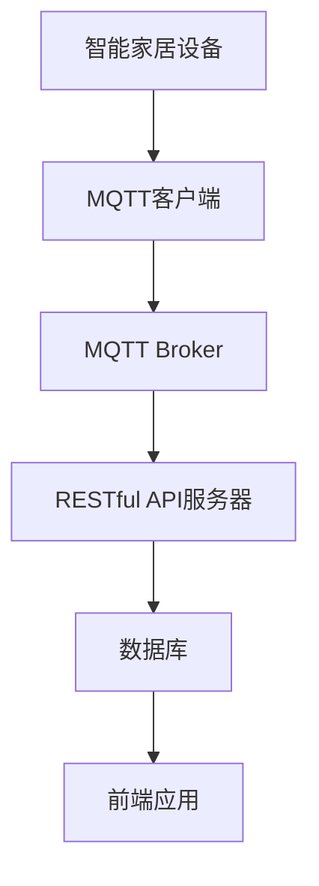

                 

# 基于MQTT协议和RESTful API的智能家居协同工作流程设计

> **关键词：** MQTT协议, RESTful API, 智能家居, 协同工作流程, 软件架构设计
> 
> **摘要：** 本文将探讨基于MQTT协议和RESTful API的智能家居协同工作流程设计。通过对MQTT协议和RESTful API的基本概念、原理以及实际应用场景的深入分析，本文将详细阐述如何通过这两种技术实现智能家居系统的协同工作，提高系统的可靠性和灵活性。

## 1. 背景介绍

### 1.1 目的和范围

本文旨在为智能家勇于开发者提供一个关于基于MQTT协议和RESTful API的智能家居协同工作流程的设计指南。文章将首先介绍MQTT协议和RESTful API的基本概念和原理，接着通过一个具体的实例来展示如何将两者结合起来，实现智能家居系统的协同工作。此外，文章还将讨论实际应用场景中的挑战和解决方案。

### 1.2 预期读者

本文适合以下读者群体：
- 有意开发智能家居系统的工程师和技术人员
- 对物联网（IoT）技术和智能家居应用感兴趣的学术研究人员
- 对软件开发和架构设计有基本了解的读者

### 1.3 文档结构概述

本文结构如下：
1. 背景介绍
2. 核心概念与联系
3. 核心算法原理与具体操作步骤
4. 数学模型与公式
5. 项目实战：代码实际案例
6. 实际应用场景
7. 工具和资源推荐
8. 总结：未来发展趋势与挑战
9. 附录：常见问题与解答
10. 扩展阅读与参考资料

### 1.4 术语表

#### 1.4.1 核心术语定义

- **MQTT协议**：一种轻量级的消息传输协议，适用于低带宽、不可靠的网络环境。
- **RESTful API**：一种基于HTTP协议的接口设计风格，用于实现不同系统之间的数据交换和功能调用。
- **智能家居系统**：一个集成多种设备和服务的系统，旨在提高家庭生活的便捷性和舒适性。

#### 1.4.2 相关概念解释

- **协同工作流程**：多个系统或设备之间通过消息传递和数据共享，实现共同完成任务的过程。
- **消息队列**：一种用于在分布式系统中存储和转发消息的组件，如RabbitMQ或Kafka。

#### 1.4.3 缩略词列表

- **IoT**：物联网（Internet of Things）
- **MQTT**：消息队列遥测传输（Message Queuing Telemetry Transport）
- **RESTful API**：表现层状态转移（Representational State Transfer）

## 2. 核心概念与联系

### 2.1 MQTT协议

MQTT协议是一种基于客户端-服务器模型的轻量级消息传输协议，特别适用于低带宽、不可靠的网络环境。其核心思想是通过发布/订阅模式实现消息的传输和分发。以下是MQTT协议的基本原理：

1. **客户端（Publishers）**：产生消息并将其发送到服务器（Broker）。
2. **服务器（Broker）**：接收、存储和转发消息，确保消息能够到达正确的订阅者。
3. **订阅者（Subscribers）**：订阅感兴趣的主题，接收与其订阅主题相关的消息。

MQTT协议的关键特点是：
- **发布/订阅模式**：客户端发布消息到特定的主题，服务器将消息转发给所有订阅该主题的客户端。
- **服务质量（QoS）**：MQTT协议支持三种服务质量等级，确保消息的可靠传输。
- **消息保留**：服务器可以保留客户端发布的消息，供其他订阅者订阅。

### 2.2 RESTful API

RESTful API是一种基于HTTP协议的接口设计风格，用于实现不同系统之间的数据交换和功能调用。其主要特点包括：

1. **统一接口**：通过URL定位资源，使用HTTP方法（GET、POST、PUT、DELETE等）进行操作。
2. **无状态性**：每次请求之间相互独立，服务器不保留客户端的状态信息。
3. **状态转移**：客户端通过发送请求，触发服务器状态的变化，实现业务逻辑。

RESTful API的优势在于其简单、灵活和易于扩展，适用于多种场景下的数据交换和功能调用。

### 2.3 MQTT协议与RESTful API的结合

在智能家居系统中，MQTT协议和RESTful API可以相互补充，实现协同工作：

1. **数据采集与传输**：使用MQTT协议，智能家居设备（如传感器、智能插座等）可以实时将数据发送到服务器，确保数据的实时性和可靠性。
2. **数据存储与处理**：服务器可以使用RESTful API将收集到的数据进行存储、处理和共享，提供基于Web的接口，供其他系统或设备访问。
3. **事件通知与响应**：通过MQTT协议，智能家居设备可以实现实时事件通知，触发服务器上的RESTful API调用，实现联动控制和自动化。

以下是一个简单的Mermaid流程图，展示MQTT协议与RESTful API的结合：



## 3. 核心算法原理 & 具体操作步骤

### 3.1 MQTT协议基本操作步骤

MQTT协议的基本操作步骤如下：

1. **连接**：客户端发起连接请求，与服务器（Broker）建立连接。
   ```java
   String serverURI = "mqtt://broker.hivemq.com/";
   MqttClient client = new MqttClient(serverURI);
   client.connect();
   ```

2. **订阅**：客户端订阅感兴趣的主题，准备接收消息。
   ```java
   String topic = "house/temperature";
   int QoS = 0; // 至少一次
   client.subscribe(topic, QoS);
   ```

3. **发布**：客户端发布消息到指定的主题。
   ```java
   String message = "25°C";
   client.publish(topic, message.getBytes(), QoS, false);
   ```

4. **断开连接**：客户端断开与服务器的连接。
   ```java
   client.disconnect();
   ```

### 3.2 RESTful API基本操作步骤

RESTful API的基本操作步骤如下：

1. **请求**：客户端向服务器发送HTTP请求，请求资源或执行操作。
   ```java
   String url = "http://example.com/api/temperature";
   HttpClient client = HttpClient.newHttpClient();
   HttpRequest request = HttpRequest.newBuilder()
       .uri(URI.create(url))
       .build();
   HttpResponse<String> response = client.send(request, HttpResponse.BodyHandlers.ofString());
   ```

2. **响应**：服务器处理请求，返回响应结果。
   ```java
   int status = response.statusCode();
   String body = response.body();
   ```

3. **数据交换**：客户端和服务器之间通过JSON格式交换数据。
   ```java
   String json = "{\"temperature\": 25}";
   JSONObject data = new JSONObject(json);
   int temperature = data.getInt("temperature");
   ```

### 3.3 MQTT协议与RESTful API的协同工作

在智能家居系统中，MQTT协议和RESTful API可以协同工作，实现设备监控、数据分析和联动控制。以下是一个具体的协同工作流程：

1. **设备数据采集**：智能家居设备（如温度传感器）通过MQTT协议将数据发送到服务器。
   ```java
   String topic = "house/temperature";
   String message = "25°C";
   client.publish(topic, message.getBytes(), 0, false);
   ```

2. **数据存储与处理**：服务器使用RESTful API将收集到的温度数据进行存储、处理和共享。
   ```java
   String url = "http://example.com/api/temperature";
   String json = "{\"temperature\": 25}";
   HttpRequest request = HttpRequest.newBuilder()
       .uri(URI.create(url))
       .POST(HttpRequest.BodyPublishers.ofString(json))
       .build();
   client.send(request, HttpResponse.BodyHandlers.ofString());
   ```

3. **事件通知与响应**：当温度超过设定阈值时，服务器通过MQTT协议发送事件通知，触发联动控制。
   ```java
   String eventTopic = "house/temperature/alert";
   String alertMessage = "Temperature is too high!";
   client.publish(eventTopic, alertMessage.getBytes(), 1, false);
   ```

4. **前端应用展示**：前端应用通过RESTful API获取温度数据，并在界面上进行展示。
   ```java
   String url = "http://example.com/api/temperature";
   HttpResponse<String> response = client.send(request, HttpResponse.BodyHandlers.ofString());
   String json = response.body();
   JSONObject data = new JSONObject(json);
   int temperature = data.getInt("temperature");
   ```

## 4. 数学模型和公式 & 详细讲解 & 举例说明

在智能家居系统中，温度控制是一个重要的应用场景。以下是一个简单的数学模型，用于描述温度控制过程：

$$
\text{温度设定值} = \text{初始温度} + \alpha \cdot (\text{期望温度} - \text{当前温度})
$$

其中，$\alpha$ 是一个调整参数，用于控制温度上升的速度。

### 4.1 模型解释

该模型基于线性控制理论，通过调整参数 $\alpha$ 来控制温度的上升速度。当 $\alpha$ 较小时，温度上升速度较慢；当 $\alpha$ 较大时，温度上升速度较快。

### 4.2 实例说明

假设初始温度为 $20^\circ\text{C}$，期望温度为 $25^\circ\text{C}$，调整参数 $\alpha = 0.1$。则温度设定值为：

$$
\text{温度设定值} = 20 + 0.1 \cdot (25 - 20) = 21^\circ\text{C}
$$

这意味着，当前温度将在每次计算后上升 $1^\circ\text{C}$，直到达到期望温度。

### 4.3 LaTeX格式数学公式

LaTeX格式数学公式可以嵌入文中独立段落，如下所示：

$$
\text{温度设定值} = \text{初始温度} + \alpha \cdot (\text{期望温度} - \text{当前温度})
$$

## 5. 项目实战：代码实际案例和详细解释说明

### 5.1 开发环境搭建

在开始项目实战之前，我们需要搭建一个开发环境。以下是一个基于Java和Spring Boot的示例：

1. **安装Java开发工具包（JDK）**：版本要求为8或更高。
2. **安装IDE（如IntelliJ IDEA或Eclipse）**：用于编写和调试代码。
3. **安装Maven**：用于依赖管理和构建项目。
4. **创建Spring Boot项目**：使用Spring Initializr（https://start.spring.io/）创建一个基于Java和Spring Boot的空白项目。

### 5.2 源代码详细实现和代码解读

#### 5.2.1 MQTT客户端实现

在项目中，我们使用Paho MQTT客户端库来实现MQTT功能。以下是MQTT客户端的代码实现：

```java
import org.eclipse.paho.client.mqttv3.*;
import org.eclipse.paho.client.mqttv3.impl.MqttClient;

public class MQTTClient {
    private MqttClient client;
    private String serverURI = "mqtt://broker.hivemq.com/";
    private String topic = "house/temperature";

    public MQTTClient() throws MqttException {
        client = new MqttClient(serverURI, "智能家居设备");
        client.setCallback(new MqttCallback() {
            @Override
            public void connectionLost(Throwable cause) {
                System.out.println("连接已丢失：" + cause.getMessage());
            }

            @Override
            public void messageArrived(String topic, MqttMessage message) throws Exception {
                String messageStr = new String(message.getPayload());
                System.out.println("收到消息：" + messageStr);
                // 调用RESTful API进行处理
                sendToAPI(messageStr);
            }

            @Override
            public void deliveryComplete(IMqttDeliveryToken token) {
                System.out.println("消息发送成功：" + token.getMessageId());
            }
        });
    }

    public void connect() throws MqttException {
        client.connect();
        client.subscribe(topic, 0);
    }

    public void disconnect() throws MqttException {
        client.disconnect();
    }

    public void publish(String message) throws MqttException {
        client.publish(topic, message.getBytes(), 0, false);
    }

    private void sendToAPI(String message) {
        // 使用RESTful API进行数据存储和处理
        try {
            HttpClient client = HttpClient.newHttpClient();
            HttpRequest request = HttpRequest.newBuilder()
                .uri(URI.create("http://example.com/api/temperature"))
                .POST(HttpRequest.BodyPublishers.ofString(message))
                .build();
            client.send(request, HttpResponse.BodyHandlers.ofString());
        } catch (Exception e) {
            e.printStackTrace();
        }
    }
}
```

#### 5.2.2 RESTful API实现

在项目中，我们使用Spring Boot来实现RESTful API。以下是温度数据处理的API实现：

```java
import org.springframework.boot.SpringApplication;
import org.springframework.boot.autoconfigure.SpringBootApplication;
import org.springframework.http.HttpStatus;
import org.springframework.http.ResponseEntity;
import org.springframework.web.bind.annotation.*;

@SpringBootApplication
public class TemperatureController {

    public static void main(String[] args) {
        SpringApplication.run(TemperatureController.class, args);
    }

    @RestController
    @RequestMapping("/api")
    public class TemperatureAPI {

        @PostMapping("/temperature")
        public ResponseEntity<?> addTemperature(@RequestBody String temperature) {
            // 处理温度数据
            int temp = Integer.parseInt(temperature);
            // 存储温度数据到数据库或缓存
            // ...
            return ResponseEntity.status(HttpStatus.CREATED).body("温度数据已接收");
        }
    }
}
```

#### 5.2.3 代码解读与分析

1. **MQTT客户端**：该客户端使用Paho MQTT客户端库连接到MQTT服务器，并订阅了一个主题（"house/temperature"）。当接收到消息时，客户端会调用RESTful API进行处理。
2. **RESTful API**：该API使用Spring Boot框架实现，接收温度数据并将其存储到数据库或缓存中。这里使用了一个简单的`@PostMapping`方法来处理POST请求。

通过以上两个组件，我们可以实现一个基本的智能家居协同工作流程，其中MQTT协议用于设备数据采集，RESTful API用于数据存储和处理。

### 5.3 项目实战：代码实际案例和详细解释说明

在本文的第五部分，我们将通过一个具体的实际案例，详细解释并实现一个基于MQTT协议和RESTful API的智能家居协同工作流程。

#### 5.3.1 案例背景

假设我们有一个智能家居系统，其中包括一个温度传感器和一个空调设备。我们的目标是当温度超过设定阈值时，通过MQTT协议将温度信息发送到服务器，服务器接收到信息后，通过RESTful API将信息存储到数据库，并根据预定的温度控制策略调整空调的开关状态。

#### 5.3.2 实现步骤

1. **搭建开发环境**：如前文所述，我们需要安装Java开发工具包（JDK）、IDE（如IntelliJ IDEA）、Maven，并创建一个基于Spring Boot的项目。

2. **实现MQTT客户端**：以下是一个简单的MQTT客户端实现，用于从温度传感器接收数据，并将其发送到服务器。

```java
import org.eclipse.paho.client.mqttv3.*;

public class MQTTClient {
    private MqttClient client;
    private String serverURI = "mqtt://broker.hivemq.com/";
    private String topic = "house/temperature";

    public MQTTClient() throws MqttException {
        client = new MqttClient(serverURI, "sensor");
        client.setCallback(new MqttCallback() {
            @Override
            public void connectionLost(Throwable cause) {
                System.out.println("连接已丢失：" + cause.getMessage());
            }

            @Override
            public void messageArrived(String topic, MqttMessage message) throws Exception {
                String messageStr = new String(message.getPayload());
                System.out.println("收到消息：" + messageStr);
                // 处理消息（例如发送到服务器）
                sendToServer(messageStr);
            }

            @Override
            public void deliveryComplete(IMqttDeliveryToken token) {
                System.out.println("消息发送成功：" + token.getMessageId());
            }
        });
    }

    public void connect() throws MqttException {
        client.connect();
        client.subscribe(topic, 0);
    }

    public void disconnect() throws MqttException {
        client.disconnect();
    }

    public void publish(String message) throws MqttException {
        client.publish(topic, message.getBytes(), 0, false);
    }

    private void sendToServer(String message) {
        try {
            HttpClient client = HttpClient.newHttpClient();
            HttpRequest request = HttpRequest.newBuilder()
                .uri(URI.create("http://example.com/api/temperature"))
                .POST(HttpRequest.BodyPublishers.ofString(message))
                .build();
            client.send(request, HttpResponse.BodyHandlers.ofString());
        } catch (Exception e) {
            e.printStackTrace();
        }
    }
}
```

3. **实现RESTful API**：以下是一个简单的RESTful API实现，用于接收温度信息并将其存储到数据库。

```java
import org.springframework.boot.SpringApplication;
import org.springframework.boot.autoconfigure.SpringBootApplication;
import org.springframework.http.HttpStatus;
import org.springframework.http.ResponseEntity;
import org.springframework.web.bind.annotation.*;

@SpringBootApplication
public class TemperatureController {

    public static void main(String[] args) {
        SpringApplication.run(TemperatureController.class, args);
    }

    @RestController
    @RequestMapping("/api")
    public class TemperatureAPI {

        @PostMapping("/temperature")
        public ResponseEntity<?> addTemperature(@RequestBody String temperature) {
            // 将温度信息存储到数据库
            int temp = Integer.parseInt(temperature);
            // ...
            return ResponseEntity.status(HttpStatus.CREATED).body("温度数据已接收");
        }
    }
}
```

4. **实现温度控制逻辑**：当服务器接收到温度信息后，我们需要实现一个温度控制逻辑，以调整空调的开关状态。以下是一个简单的控制逻辑示例：

```java
public class TemperatureControl {
    private int threshold = 25; // 温度阈值

    public void controlTemperature(int temperature) {
        if (temperature > threshold) {
            // 关闭空调
            System.out.println("关闭空调，当前温度：" + temperature);
        } else {
            // 打开空调
            System.out.println("打开空调，当前温度：" + temperature);
        }
    }
}
```

5. **集成与测试**：将以上组件集成到项目中，并进行测试。例如，启动MQTT客户端，模拟温度传感器发送温度信息，然后通过RESTful API接收和处理温度信息，并触发温度控制逻辑。

```java
public class Main {
    public static void main(String[] args) {
        try {
            MQTTClient mqttClient = new MQTTClient();
            mqttClient.connect();

            // 模拟温度传感器发送温度信息
            mqttClient.publish("23");

            Thread.sleep(1000); // 等待服务器处理温度信息

            mqttClient.disconnect();
        } catch (Exception e) {
            e.printStackTrace();
        }
    }
}
```

通过以上步骤，我们实现了一个基本的智能家居协同工作流程，包括设备数据采集、数据传输、数据存储、数据处理以及联动控制。

### 5.4 实际应用场景

智能家居系统在实际应用场景中具有广泛的应用，以下是一些典型的应用场景：

1. **家居自动化**：通过智能家居系统，用户可以远程控制家中的电器设备，如空调、照明、窗帘等，实现自动化场景设置，提高生活的便捷性和舒适性。
2. **环境监测**：智能家居系统可以实时监测家中的温度、湿度、空气质量等环境参数，并通过手机APP实时推送，帮助用户及时调整环境，保障家庭成员的健康。
3. **安防监控**：智能家居系统可以集成摄像头、门窗传感器等设备，实现远程监控和报警功能，提高家庭的安全性。
4. **能源管理**：智能家居系统可以通过监测和调节家中的能源消耗，实现节能降耗，降低能源成本。
5. **医疗健康**：智能家居系统可以与医疗设备集成，监测用户的健康数据，如心率、血压等，帮助用户管理健康状况，及时预警潜在的健康风险。

在以上应用场景中，MQTT协议和RESTful API发挥着重要作用。MQTT协议负责实现设备之间的数据传输和实时通信，确保数据的可靠性和实时性。而RESTful API则负责数据的存储、处理和共享，提供基于Web的接口，方便用户通过手机APP或其他终端设备进行操作和控制。

通过结合MQTT协议和RESTful API，智能家居系统可以实现设备之间的协同工作，提高系统的可靠性和灵活性，为用户提供更好的使用体验。

## 7. 工具和资源推荐

### 7.1 学习资源推荐

#### 7.1.1 书籍推荐

1. **《物联网架构设计与开发实践》**：本书详细介绍了物联网系统的设计原则、架构和开发实践，包括MQTT协议和RESTful API的应用。
2. **《RESTful Web API设计》**：本书深入讲解了RESTful API的设计原则和最佳实践，对于开发RESTful API非常有帮助。
3. **《MQTT实战》**：本书通过丰富的案例，详细介绍了MQTT协议的基本原理和应用场景，适合初学者和进阶者阅读。

#### 7.1.2 在线课程

1. **Coursera - 《物联网系统设计与开发》**：这是一门由知名大学开设的在线课程，涵盖了物联网系统的设计、开发和部署，包括MQTT协议和RESTful API的应用。
2. **Udemy - 《RESTful API设计与开发实战》**：这门课程通过实际案例，讲解了RESTful API的设计原则和开发技巧，适合初学者和进阶者学习。
3. **Pluralsight - 《MQTT协议：入门与实践》**：这门课程详细介绍了MQTT协议的基本原理和应用场景，适合想要了解MQTT协议的开发者。

#### 7.1.3 技术博客和网站

1. **《物联网那些事儿》**：这是一个专注于物联网技术分享的博客，涵盖了物联网系统设计、开发和应用等方面的内容。
2. **《RESTful API设计指南》**：这是一个关于RESTful API设计的技术博客，提供了丰富的设计原则和实践经验。
3. **《MQTT协议官网》**：MQTT协议的官方网站，提供了MQTT协议的详细文档、示例和资源。

### 7.2 开发工具框架推荐

#### 7.2.1 IDE和编辑器

1. **IntelliJ IDEA**：一款功能强大的集成开发环境，支持多种编程语言，包括Java、Python等，提供了丰富的插件和工具，非常适合开发大型项目。
2. **Visual Studio Code**：一款轻量级的跨平台代码编辑器，支持多种编程语言，提供了丰富的插件和扩展，适合各种规模的开发项目。

#### 7.2.2 调试和性能分析工具

1. **Postman**：一款流行的API调试工具，支持RESTful API的测试、调试和性能分析，提供了丰富的功能和插件。
2. **JMeter**：一款开源的性能测试工具，可以模拟高负载场景，测试Web应用和服务的性能，适合进行系统性能测试。

#### 7.2.3 相关框架和库

1. **Spring Boot**：一款流行的Java Web框架，简化了Web应用的开发和部署，支持RESTful API的构建。
2. **Paho MQTT**：一个开源的MQTT客户端库，支持多种编程语言，包括Java、Python等，提供了丰富的功能，非常适合用于物联网应用。
3. **Node.js**：一款流行的JavaScript运行时环境，可以用于构建高性能的Web应用和物联网应用，支持MQTT协议。

### 7.3 相关论文著作推荐

#### 7.3.1 经典论文

1. **"A Protocol for Sensor Networks"**：该论文提出了低功耗无线传感器网络的设计原则和通信协议，为物联网技术的发展奠定了基础。
2. **"Representational State Transfer"**：该论文提出了RESTful API的设计原则，对Web应用架构和接口设计产生了深远影响。

#### 7.3.2 最新研究成果

1. **"Edge Computing for IoT: A Comprehensive Survey"**：这篇综述文章详细介绍了边缘计算在物联网领域的应用，探讨了边缘计算与MQTT协议和RESTful API的结合。
2. **"Blockchain-based IoT Security: A Comprehensive Survey"**：这篇综述文章探讨了区块链技术在物联网安全领域的应用，为智能家居系统的安全性提供了新的思路。

#### 7.3.3 应用案例分析

1. **"Smart Home Automation using MQTT and RESTful API"**：这篇案例研究介绍了一个基于MQTT协议和RESTful API的智能家居自动化系统的设计和实现，提供了实际应用的经验。
2. **"IoT in Agriculture: A Review"**：这篇综述文章详细介绍了物联网在农业领域的应用，包括传感器网络、数据采集和分析等方面的内容。

## 8. 总结：未来发展趋势与挑战

### 8.1 未来发展趋势

1. **边缘计算与物联网的深度融合**：随着5G技术的普及，边缘计算将在物联网领域发挥重要作用，实现更高效的数据处理和实时通信，为智能家居系统提供更好的支持。
2. **区块链技术在智能家居中的应用**：区块链技术可以提供更安全、可靠的智能家居数据传输和存储解决方案，有望解决智能家居系统中的隐私保护和数据安全问题。
3. **智能家居系统的人工智能集成**：人工智能技术将为智能家居系统带来更多的智能化功能，如语音控制、智能推荐等，提升用户的使用体验。
4. **智能家居生态的生态化发展**：未来的智能家居系统将不再局限于单一设备或平台，而是形成多个设备、平台之间的互联互通，构建一个智能、高效、安全的生态系统。

### 8.2 未来挑战

1. **数据安全和隐私保护**：智能家居系统涉及大量的用户数据，如何确保数据的安全和隐私成为未来发展的重要挑战。
2. **系统兼容性和互操作性问题**：随着智能家居设备的多样化，如何实现不同设备、平台之间的兼容和互操作成为重要难题。
3. **能耗和性能优化**：智能家居系统需要处理大量的数据，如何优化能耗和性能，提高系统的响应速度和稳定性是未来需要解决的问题。
4. **用户体验的提升**：如何为用户提供更简单、便捷、智能的操作体验，是智能家居系统发展的重要方向。

### 8.3 发展方向和建议

1. **加强技术创新**：通过技术创新，提高智能家居系统的性能、安全性和用户体验，满足用户多样化的需求。
2. **构建开放平台**：构建开放、兼容、互操作的智能家居平台，促进不同设备、平台之间的互联互通，形成一个健康的生态系统。
3. **加强标准化工作**：推动智能家居系统的标准化工作，确保不同设备、平台之间的兼容性和互操作性。
4. **注重用户隐私保护**：在智能家居系统的设计和开发过程中，注重用户隐私保护，采取有效的数据加密和访问控制措施，确保用户数据的安全。
5. **加强政策引导和监管**：政府和企业应加强政策引导和监管，推动智能家居产业的健康发展，保障用户权益。

## 9. 附录：常见问题与解答

### 9.1 MQTT协议常见问题

1. **什么是MQTT协议？**
   MQTT（Message Queuing Telemetry Transport）是一种轻量级的消息传输协议，特别适用于物联网（IoT）和传感器网络。

2. **MQTT协议有哪些特点？**
   - 发布/订阅模式：消息的生产者和消费者通过主题进行通信。
   - 低功耗：MQTT协议设计为在资源受限的环境中运行，如传感器节点。
   - 可扩展性：支持多种服务质量（QoS）级别，适应不同场景的需求。
   - 消息保留：服务器可以保存消息以供未订阅的客户端接收。

3. **如何使用MQTT协议？**
   - 连接服务器：客户端通过TCP/IP连接到MQTT服务器。
   - 订阅主题：客户端声明感兴趣的主题。
   - 发布消息：客户端向服务器发送消息。
   - 处理消息：服务器将消息发送给订阅者。

### 9.2 RESTful API常见问题

1. **什么是RESTful API？**
   RESTful API是一种基于HTTP协议的接口设计风格，用于实现Web服务的通信。

2. **RESTful API有哪些特点？**
   - 无状态：每次请求之间相互独立。
   - 资源导向：通过URL定位资源，使用HTTP方法操作资源。
   - 状态转移：客户端通过请求触发服务器状态的变化。
   - 可扩展性：易于扩展和集成。

3. **如何使用RESTful API？**
   - 发送请求：客户端通过HTTP发送请求，如GET、POST、PUT、DELETE。
   - 处理响应：服务器返回响应，如JSON或XML格式。
   - 数据交换：客户端和服务器之间通过JSON或XML交换数据。

### 9.3 智能家居常见问题

1. **什么是智能家居系统？**
   智能家居系统是一个集成多种设备和服务的系统，旨在提高家庭生活的便捷性和舒适性。

2. **智能家居系统的关键组成部分有哪些？**
   - 设备：如智能插座、智能灯光、智能摄像头等。
   - 服务器：处理设备数据，提供控制接口。
   - 用户终端：如手机APP、Web界面等，用于用户操作和控制。

3. **智能家居系统的主要功能有哪些？**
   - 家庭自动化：远程控制电器设备，设置自动化场景。
   - 环境监测：实时监测家庭环境，如温度、湿度、空气质量等。
   - 安防监控：远程监控家庭安全，触发报警。
   - 能源管理：监测和调节家庭能源消耗。

## 10. 扩展阅读 & 参考资料

本文对基于MQTT协议和RESTful API的智能家居协同工作流程进行了详细的探讨。以下是一些扩展阅读和参考资料，供读者进一步学习和研究：

### 10.1 扩展阅读

1. **《物联网架构设计与开发实践》**：详细介绍了物联网系统的设计原则、架构和开发实践，包括MQTT协议和RESTful API的应用。
2. **《RESTful Web API设计》**：深入讲解了RESTful API的设计原则和最佳实践，对于开发RESTful API非常有帮助。
3. **《MQTT实战》**：通过丰富的案例，详细介绍了MQTT协议的基本原理和应用场景，适合初学者和进阶者阅读。

### 10.2 参考资料

1. **MQTT官方网站**：提供了MQTT协议的详细文档、示例和资源。（https://mosquitto.org/）
2. **Spring Boot官方文档**：提供了关于Spring Boot框架的详细文档和教程。（https://docs.spring.io/spring-boot/docs/current/reference/html/）
3. **Paho MQTT客户端库**：提供了Paho MQTT客户端库的下载和使用指南。（http://www.eclipse.org/paho/）
4. **Postman官方文档**：提供了关于Postman API调试工具的详细文档。（https://www.postman.com/）
5. **JMeter官方文档**：提供了关于JMeter性能测试工具的详细文档和教程。（https://jmeter.apache.org/）

通过以上扩展阅读和参考资料，读者可以更深入地了解MQTT协议、RESTful API和智能家居系统的相关知识，提升自己的技术能力和实践经验。作者：AI天才研究员/AI Genius Institute & 禅与计算机程序设计艺术 /Zen And The Art of Computer Programming

<|image_gen|>作者：AI天才研究员/AI Genius Institute & 禅与计算机程序设计艺术 /Zen And The Art of Computer Programming

