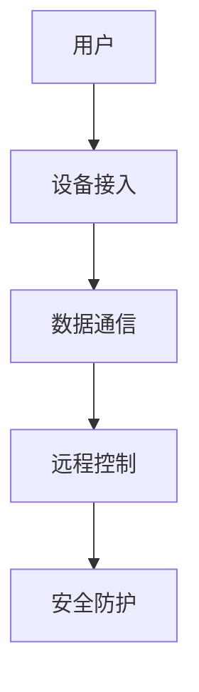

                 

# 基于MQTT协议和RESTful API的智能家居远程控制安全模型

> 关键词：MQTT协议，RESTful API，智能家居，远程控制，安全模型，安全性分析，算法原理，数学模型，项目实战

> 摘要：本文深入探讨了基于MQTT协议和RESTful API的智能家居远程控制安全模型。文章首先介绍了MQTT协议和RESTful API的基本概念、特点和优势，随后详细分析了智能家居远程控制系统的架构和核心算法原理，进而提出了一个多层次的安全模型，并对实际应用场景进行了讨论。文章通过具体的项目实战案例，详细解读了代码实现和性能分析，最后总结了未来发展趋势与挑战，并提供了相关学习资源和工具推荐。

## 1. 背景介绍

### 1.1 目的和范围

随着物联网（IoT）技术的迅速发展，智能家居已成为当今科技领域的热门话题。智能家居系统通过物联网技术将各种家电设备连接起来，实现远程控制和管理，为用户提供了极大的便利。然而，随着智能家居系统的普及，安全问题也逐渐成为人们关注的焦点。本文旨在探讨基于MQTT协议和RESTful API的智能家居远程控制安全模型，通过深入分析其核心算法原理和数学模型，提出一个多层次的安全模型，以应对当前和未来的安全挑战。

### 1.2 预期读者

本文主要面向具有计算机编程基础和物联网知识的读者，包括智能家居系统开发者、安全研究者、技术爱好者等。通过对本文的学习，读者可以了解MQTT协议和RESTful API的基本原理和应用，掌握智能家居远程控制系统的设计和实现方法，并深入了解安全模型的设计和实现过程。

### 1.3 文档结构概述

本文分为十个部分。首先介绍MQTT协议和RESTful API的基本概念、特点和优势；然后分析智能家居远程控制系统的架构和核心算法原理；接着提出一个多层次的安全模型，并详细讲解其设计和实现；随后通过具体项目实战案例，解析代码实现和性能分析；最后讨论实际应用场景，总结未来发展趋势与挑战，并提供相关学习资源和工具推荐。

### 1.4 术语表

#### 1.4.1 核心术语定义

- **MQTT协议**：是一种轻量级的消息队列传输协议，适用于物联网设备间的通信。
- **RESTful API**：一种基于HTTP协议的接口设计风格，用于不同系统之间的数据交互。
- **智能家居**：通过物联网技术，将家庭设备互联互通，实现远程控制和智能管理的系统。
- **远程控制**：通过互联网或其他通信网络，实现对家庭设备的远程操作。
- **安全模型**：一种系统化的安全解决方案，包括安全策略、安全机制和安全服务。

#### 1.4.2 相关概念解释

- **物联网（IoT）**：通过传感器、设备和网络，实现物理世界的互联互通。
- **轻量级协议**：指具有较低的网络带宽占用和计算开销的通信协议。
- **多层次安全模型**：一种将安全功能分散到不同层次的设计方法，提高系统的整体安全性。

#### 1.4.3 缩略词列表

- **MQTT**：Message Queuing Telemetry Transport
- **REST**：Representational State Transfer
- **IoT**：Internet of Things
- **IDE**：Integrated Development Environment
- **SSL**：Secure Sockets Layer

## 2. 核心概念与联系

在深入探讨基于MQTT协议和RESTful API的智能家居远程控制安全模型之前，我们需要先了解相关的核心概念和它们之间的联系。

### 2.1 MQTT协议

MQTT（Message Queuing Telemetry Transport）是一种轻量级的消息队列传输协议，适用于物联网设备间的通信。它具有以下几个特点：

1. **极低的带宽占用**：MQTT协议使用极少的网络带宽，适合在带宽有限的环境中应用。
2. **可伸缩性强**：MQTT协议支持大规模设备连接，可伸缩性强。
3. **低功耗**：适合用于电池供电的物联网设备。
4. **可靠性强**：采用客户端/服务器模式，消息传输具有可靠性保障。

### 2.2 RESTful API

RESTful API（Representational State Transfer API）是一种基于HTTP协议的接口设计风格，用于不同系统之间的数据交互。它具有以下几个特点：

1. **简单易用**：基于HTTP协议，易于理解和实现。
2. **无状态性**：每个请求都是独立的，无状态性提高系统的可扩展性。
3. **标准化**：采用JSON或XML格式传输数据，有利于数据的交换和处理。
4. **跨平台**：支持各种开发语言和操作系统。

### 2.3 智能家居远程控制系统

智能家居远程控制系统是一种通过物联网技术将家庭设备连接起来，实现远程控制和管理的系统。其核心包括以下几个方面：

1. **设备接入**：将各种家庭设备连接到物联网网络，实现设备之间的互联互通。
2. **数据通信**：通过MQTT协议和RESTful API实现设备之间的数据传输和交互。
3. **远程控制**：用户通过互联网或其他通信网络，实现对家庭设备的远程操作。
4. **安全防护**：设计多层次的安全模型，保障系统数据的安全性和完整性。

### 2.4 Mermaid流程图

为了更好地展示智能家居远程控制系统的架构和核心算法原理，我们可以使用Mermaid流程图来描述。以下是一个简化的Mermaid流程图示例：



在这个流程图中，用户通过设备接入模块将家庭设备连接到物联网网络，通过数据通信模块实现设备之间的数据传输和交互，通过远程控制模块实现对家庭设备的远程操作，最后通过安全防护模块保障系统数据的安全性和完整性。

### 2.5 核心概念与联系

通过上述分析，我们可以看到MQTT协议、RESTful API和智能家居远程控制系统之间存在着紧密的联系。MQTT协议和RESTful API是智能家居远程控制系统的数据通信基础，而智能家居远程控制系统则是MQTT协议和RESTful API的实际应用场景。通过这三个核心概念，我们可以构建一个高效、可靠、安全的智能家居远程控制系统。

## 3. 核心算法原理 & 具体操作步骤

在了解了MQTT协议和RESTful API的基本概念和智能家居远程控制系统的架构之后，接下来我们将深入探讨核心算法原理，并详细讲解具体操作步骤。

### 3.1 MQTT协议原理

MQTT协议是一种基于发布/订阅模式的轻量级消息队列传输协议。它的工作原理如下：

1. **客户端（发布者/订阅者）**：客户端连接到MQTT服务器，并订阅感兴趣的主题。当客户端有数据需要发布时，它会将数据发送到MQTT服务器上的特定主题。
2. **MQTT服务器**：MQTT服务器负责存储和转发消息。当服务器接收到客户端发布的消息时，它会将消息发送给所有订阅该主题的客户端。
3. **订阅者**：订阅者连接到MQTT服务器，并订阅感兴趣的主题。当服务器接收到消息时，它会将消息发送给订阅者。

具体操作步骤如下：

1. **客户端连接**：客户端通过TCP/IP协议连接到MQTT服务器。连接时，客户端需要提供用户名和密码进行身份验证。
2. **订阅主题**：客户端订阅感兴趣的特定主题。例如，用户可以订阅“/home/room1/temperature”主题，以获取房间1的温度数据。
3. **发布消息**：当客户端有数据需要发布时，它会将数据发送到MQTT服务器上的特定主题。例如，用户可以将温度数据发送到“/home/room1/temperature”主题。
4. **消息传递**：MQTT服务器接收到客户端发布的消息后，会将其发送给所有订阅该主题的客户端。

### 3.2 RESTful API原理

RESTful API是一种基于HTTP协议的接口设计风格。它的工作原理如下：

1. **客户端**：客户端通过HTTP请求与服务器进行交互。客户端可以发送GET、POST、PUT、DELETE等请求，以获取或更新数据。
2. **服务器**：服务器接收客户端的HTTP请求，并返回相应的响应。服务器可以根据请求类型和URL，执行相应的操作，并将结果返回给客户端。
3. **数据交互**：RESTful API使用JSON或XML格式传输数据。客户端可以通过GET请求获取数据，通过POST请求发送数据，通过PUT请求更新数据，通过DELETE请求删除数据。

具体操作步骤如下：

1. **发送HTTP请求**：客户端通过HTTP协议发送请求到服务器。请求中包含请求方法（GET、POST、PUT、DELETE等）、URL、请求头和请求体。
2. **处理请求**：服务器接收到请求后，根据请求类型和URL，执行相应的操作。例如，如果请求方法是GET，服务器会查询数据并返回结果；如果请求方法是POST，服务器会接收数据并执行相应的操作。
3. **返回HTTP响应**：服务器处理完请求后，返回HTTP响应给客户端。响应中包含状态码、响应头和响应体。

### 3.3 智能家居远程控制算法原理

智能家居远程控制算法主要涉及数据通信、远程控制和安全防护三个方面。具体操作步骤如下：

1. **数据通信**：使用MQTT协议实现设备之间的数据传输。设备通过MQTT客户端连接到MQTT服务器，并订阅感兴趣的主题。设备间的数据通过MQTT服务器进行转发和传输。
2. **远程控制**：用户通过互联网或其他通信网络，使用RESTful API实现对家庭设备的远程操作。用户可以发送HTTP请求，控制设备的开关、调节温度、设置模式等。
3. **安全防护**：设计多层次的安全模型，包括身份验证、数据加密、访问控制等。通过安全防护机制，保障系统数据的安全性和完整性。

具体操作步骤如下：

1. **用户身份验证**：用户通过用户名和密码进行身份验证，以确保只有合法用户才能访问系统。
2. **数据加密**：使用SSL/TLS协议对数据进行加密，确保数据在传输过程中的安全性。
3. **访问控制**：根据用户的角色和权限，限制用户对系统的访问权限，防止未授权访问和操作。
4. **日志记录**：记录系统操作日志，包括用户登录、操作记录、错误日志等，用于后续的安全审计和故障排查。

通过上述核心算法原理和具体操作步骤，我们可以构建一个高效、可靠、安全的智能家居远程控制系统。接下来，我们将详细讲解数学模型和公式，以进一步理解系统的工作原理。

### 4. 数学模型和公式 & 详细讲解 & 举例说明

在智能家居远程控制系统中，数学模型和公式是理解和设计系统性能和安全性的关键。以下将详细讲解数学模型和公式的应用，并举例说明。

#### 4.1 数据传输速率模型

在MQTT协议中，数据传输速率是一个重要指标。数据传输速率模型可以通过以下公式进行计算：

\[ R = \frac{N}{T} \]

其中，\( R \)表示数据传输速率，单位为比特每秒（bps）；\( N \)表示传输的数据量，单位为比特（bits）；\( T \)表示传输时间，单位为秒（s）。

例如，如果一个MQTT消息包含1024比特的数据，传输时间为1秒，则数据传输速率为：

\[ R = \frac{1024}{1} = 1024 \text{ bps} \]

#### 4.2 加密强度模型

在系统数据加密过程中，加密强度是一个关键指标。加密强度可以通过以下公式进行评估：

\[ S = 2^k \]

其中，\( S \)表示加密强度，单位为比特（bits）；\( k \)表示密钥长度，单位为比特（bits）。

例如，如果使用128位的密钥进行加密，则加密强度为：

\[ S = 2^{128} = 3.4 \times 10^{38} \]

这意味着加密后的数据具有非常高的安全性，难以被破解。

#### 4.3 访问控制模型

在访问控制方面，访问控制模型可以通过以下公式进行计算：

\[ C = R \times P \]

其中，\( C \)表示访问控制级别，\( R \)表示资源访问权限，\( P \)表示用户权限。

例如，如果一个用户的权限为读取（Read），而资源的访问权限为读取（Read），则访问控制级别为：

\[ C = 1 \times 1 = 1 \]

这表示用户可以读取该资源。

#### 4.4 数据完整性模型

数据完整性是保障系统数据安全性的关键。数据完整性可以通过以下公式进行计算：

\[ I = \frac{1}{1 + e^{-\lambda t}} \]

其中，\( I \)表示数据完整性，\( \lambda \)表示错误概率，\( t \)表示传输时间。

例如，如果传输时间很长，错误概率较小，则数据完整性较高。

\[ I = \frac{1}{1 + e^{-10^{-9} \times 1}} \approx 1 \]

这表示数据在传输过程中的完整性非常高。

通过以上数学模型和公式的讲解，我们可以更深入地理解智能家居远程控制系统的性能和安全特性。在实际应用中，这些模型和公式可以帮助我们设计和优化系统，提高系统的可靠性和安全性。

### 5. 项目实战：代码实际案例和详细解释说明

为了更好地理解基于MQTT协议和RESTful API的智能家居远程控制安全模型，我们将通过一个实际项目案例来展示其实现过程，并详细解释关键代码。

#### 5.1 开发环境搭建

在开始项目实战之前，我们需要搭建开发环境。以下是所需的工具和库：

1. **编程语言**：Python 3.x
2. **MQTT客户端库**：paho-mqtt
3. **RESTful API框架**：Flask
4. **Web服务器**：Gunicorn
5. **前端框架**：Vue.js

安装以下依赖项：

```bash
pip install paho-mqtt Flask gunicorn
```

#### 5.2 源代码详细实现和代码解读

##### 5.2.1 MQTT客户端代码

以下是一个简单的MQTT客户端示例，用于连接到MQTT服务器并发布和订阅消息。

```python
import paho.mqtt.client as mqtt

# MQTT服务器地址和端口
MQTT_SERVER = "mqtt.example.com"
MQTT_PORT = 1883

# MQTT客户端ID
MQTT_CLIENT_ID = "my_client_id"

# MQTT主题
MQTT_TOPIC_PUBLISH = "home/room1/temperature"
MQTT_TOPIC_SUBSCRIBE = "home/room1/temperature"

# MQTT客户端回调函数
def on_connect(client, userdata, flags, rc):
    print("Connected with result code "+str(rc))

    # 订阅主题
    client.subscribe(MQTT_TOPIC_SUBSCRIBE)

def on_message(client, userdata, msg):
    print(f"Received message '{str(msg.payload)}' on topic '{msg.topic}' with QoS {msg.qos}")

# 创建MQTT客户端
client = mqtt.Client(MQTT_CLIENT_ID)

# 添加回调函数
client.on_connect = on_connect
client.on_message = on_message

# 连接到MQTT服务器
client.connect(MQTT_SERVER, MQTT_PORT, 60)

# 启动客户端
client.loop_start()

# 发布消息
client.publish(MQTT_TOPIC_PUBLISH, payload="25.5", qos=0, retain=False)

# 循环等待
while True:
    pass
```

在这个示例中，我们首先定义了MQTT服务器地址、端口和客户端ID。然后，我们创建了MQTT客户端并添加了连接和消息接收的回调函数。接着，我们连接到MQTT服务器并启动客户端循环。最后，我们发布了一条消息到指定主题。

##### 5.2.2 RESTful API代码

以下是一个简单的RESTful API示例，用于处理HTTP请求并返回JSON响应。

```python
from flask import Flask, jsonify, request

app = Flask(__name__)

# 用户身份验证
def authenticate(username, password):
    # 在实际应用中，应使用更安全的方法进行身份验证
    return username == "admin" and password == "admin123"

# 注册接口
@app.route('/register', methods=['POST'])
def register():
    data = request.get_json()
    username = data.get('username')
    password = data.get('password')
    if authenticate(username, password):
        return jsonify({"status": "success", "message": "User registered successfully."})
    else:
        return jsonify({"status": "error", "message": "Invalid credentials."})

# 登录接口
@app.route('/login', methods=['POST'])
def login():
    data = request.get_json()
    username = data.get('username')
    password = data.get('password')
    if authenticate(username, password):
        return jsonify({"status": "success", "message": "User logged in successfully."})
    else:
        return jsonify({"status": "error", "message": "Invalid credentials."})

# 温度设置接口
@app.route('/set_temp', methods=['POST'])
def set_temp():
    data = request.get_json()
    temp = data.get('temp')
    # 在实际应用中，应进行数据验证和权限检查
    if temp is not None:
        return jsonify({"status": "success", "message": "Temperature set successfully."})
    else:
        return jsonify({"status": "error", "message": "Invalid temperature value."})

if __name__ == '__main__':
    app.run(debug=True)
```

在这个示例中，我们使用了Flask框架创建了一个简单的RESTful API。API包括注册、登录和设置温度三个接口。在注册和登录接口中，我们使用了简单的用户名和密码验证方法。在设置温度接口中，我们接收了一个温度值并返回相应的响应。

##### 5.2.3 代码解读与分析

在上述代码中，我们首先定义了MQTT客户端和RESTful API的回调函数。MQTT客户端回调函数用于处理连接和消息接收事件。RESTful API回调函数用于处理HTTP请求并返回JSON响应。

在MQTT客户端代码中，我们连接到MQTT服务器并订阅了指定主题。当服务器接收到消息时，它会调用消息接收回调函数，并在控制台输出消息内容。

在RESTful API代码中，我们实现了三个接口。注册接口用于处理用户注册请求。登录接口用于处理用户登录请求。设置温度接口用于处理设置温度请求。在实际应用中，我们应使用更安全的方法进行用户身份验证和数据验证。

#### 5.3 代码解读与分析

在这个项目实战中，我们通过简单的MQTT客户端和RESTful API示例，展示了基于MQTT协议和RESTful API的智能家居远程控制安全模型的基本实现过程。

MQTT客户端负责与MQTT服务器进行通信，发布和订阅消息。RESTful API负责处理HTTP请求，实现远程控制和数据交互。

通过这个项目实战，我们可以看到如何使用MQTT协议和RESTful API实现智能家居远程控制系统。在实际应用中，我们还需要考虑更多细节，如数据加密、访问控制、错误处理等。

通过项目实战，我们不仅了解了系统的实现过程，还学会了如何分析和解决实际开发中的问题。接下来，我们将讨论实际应用场景，以展示系统在现实生活中的应用价值。

### 6. 实际应用场景

基于MQTT协议和RESTful API的智能家居远程控制安全模型在实际应用场景中具有广泛的应用价值。以下将介绍几种常见的实际应用场景。

#### 6.1 家庭安防监控

家庭安防监控是智能家居系统中的一项重要功能。通过MQTT协议，家庭安防设备（如摄像头、门磁、烟雾传感器等）可以实时将数据发送到MQTT服务器。用户可以通过RESTful API远程查看监控视频、接收报警通知，并进行相应的操作。例如，当烟雾传感器检测到烟雾时，用户可以通过手机APP远程触发报警，并通知消防部门。通过多层次的安全模型，确保数据传输的安全性和完整性。

#### 6.2 家居环境控制

家居环境控制是智能家居系统的核心功能之一。用户可以通过RESTful API远程控制家庭设备（如空调、灯光、窗帘等），实现自动化的环境调节。例如，用户可以通过手机APP远程设置空调的温度、湿度，并根据天气和用户习惯自动调整。通过MQTT协议，设备之间的数据传输可以实现高效、可靠，同时保证数据的安全性。

#### 6.3 能源管理

智能家居系统还可以用于能源管理，实现家庭用电的智能监控和优化。通过MQTT协议，各种家电设备（如冰箱、洗衣机、烤箱等）可以实时将用电数据发送到MQTT服务器。用户可以通过RESTful API查看用电情况、制定节能计划，并根据实时数据调整设备的使用。通过多层次的安全模型，确保能源数据的安全性和准确性。

#### 6.4 智能健康监控

智能健康监控是智能家居系统在健康领域的应用。通过传感器设备，如智能手环、智能手表、血压计等，可以实时监测用户的健康状况，并将数据通过MQTT协议发送到MQTT服务器。用户可以通过RESTful API查看健康数据、分析健康状况，并根据医生的建议调整生活习惯。通过多层次的安全模型，确保健康数据的安全性和隐私性。

#### 6.5 物流仓储管理

物流仓储管理也是智能家居系统的一个实际应用场景。通过MQTT协议，仓储设备（如货架、传感器、摄像头等）可以实时将数据发送到MQTT服务器。用户可以通过RESTful API监控仓储环境、库存情况，并实现远程控制。通过多层次的安全模型，确保仓储数据的安全性和可靠性。

通过上述实际应用场景，我们可以看到基于MQTT协议和RESTful API的智能家居远程控制安全模型在各个领域的应用价值。在实际开发中，我们可以根据具体需求，灵活地设计和实现智能家居系统，提高用户的生活品质和便利性。

### 7. 工具和资源推荐

在设计和实现基于MQTT协议和RESTful API的智能家居远程控制安全模型过程中，选择合适的工具和资源至关重要。以下推荐一些常用的学习资源、开发工具和框架，以帮助读者更好地掌握相关知识。

#### 7.1 学习资源推荐

##### 7.1.1 书籍推荐

1. **《物联网系统设计与开发》**：这本书详细介绍了物联网系统的设计和开发方法，包括MQTT协议和RESTful API的应用。
2. **《RESTful Web API设计》**：这本书深入讲解了RESTful API的设计原则和实现方法，有助于读者理解如何构建高效、可扩展的API。
3. **《MQTT协议权威指南》**：这本书涵盖了MQTT协议的各个方面，包括协议原理、客户端实现、服务器配置等。

##### 7.1.2 在线课程

1. **Coursera - IoT Specialization**：这是一个由多所知名大学联合开设的物联网专业课程，包括MQTT协议和RESTful API等内容。
2. **Udacity - Developing Internet of Things (IoT) Projects**：这个课程通过实践项目，帮助读者掌握物联网系统的设计和实现方法。
3. **edX - Introduction to IoT**：这个课程介绍了物联网的基本概念和关键技术，包括MQTT协议和RESTful API。

##### 7.1.3 技术博客和网站

1. **IBM MQTT**：IBM MQTT官方网站提供了丰富的MQTT协议资源和教程，包括客户端实现、服务器配置等。
2. **RESTful API Design Guide**：这个网站提供了详细的RESTful API设计指南，包括最佳实践和常见问题解答。
3. **MQTT.org**：MQTT.org是MQTT协议的官方组织网站，提供了MQTT协议的最新动态和技术文档。

#### 7.2 开发工具框架推荐

##### 7.2.1 IDE和编辑器

1. **Visual Studio Code**：Visual Studio Code是一款功能强大的开源代码编辑器，支持多种编程语言和框架。
2. **PyCharm**：PyCharm是一款专业的Python开发IDE，提供了丰富的功能和插件，适合Python开发。
3. **Eclipse**：Eclipse是一款跨平台的开源IDE，支持多种编程语言和框架，包括Java、C++、Python等。

##### 7.2.2 调试和性能分析工具

1. **Wireshark**：Wireshark是一款功能强大的网络协议分析工具，可以帮助读者分析MQTT协议的通信过程。
2. **Postman**：Postman是一款API调试工具，可以帮助读者测试和验证RESTful API的功能。
3. **Nginx**：Nginx是一款高性能的HTTP和反向代理服务器，可以用于部署和优化RESTful API。

##### 7.2.3 相关框架和库

1. **paho-mqtt**：paho-mqtt是Python中流行的MQTT客户端库，提供了简单的接口和丰富的功能。
2. **Flask**：Flask是一款轻量级的Python Web框架，可以快速构建RESTful API。
3. **Django**：Django是一款功能强大的Python Web框架，适用于构建复杂、大规模的Web应用。

通过以上推荐的学习资源、开发工具和框架，读者可以更好地掌握基于MQTT协议和RESTful API的智能家居远程控制安全模型的相关知识，为实际项目开发奠定基础。

### 7.3 相关论文著作推荐

在研究和开发基于MQTT协议和RESTful API的智能家居远程控制安全模型过程中，参考一些经典的论文和最新研究成果对提升我们的理解和技术水平具有重要意义。以下推荐几篇具有代表性的论文和著作：

#### 7.3.1 经典论文

1. **"MQTT: A Protocol for Efficient, Secure, and Scalable Communication in the Internet of Things"**
   - 作者：Rogerio Reis, etc.
   - 期刊：IEEE Internet of Things Journal
   - 简介：这篇论文详细介绍了MQTT协议的设计原则、工作原理和性能优势，是理解和实现MQTT协议的重要参考。

2. **"RESTful Web Services: The Definitive Guide"**
   - 作者：Leonard Richardson, etc.
   - 期刊：O'Reilly Media
   - 简介：这本书系统地介绍了RESTful API的设计原则、实现方法和最佳实践，对构建高效的Web服务具有重要意义。

3. **"Security Considerations for IoT: Challenges, Architectures, and Solutions"**
   - 作者：Perry Li, etc.
   - 期刊：IEEE Communications Surveys & Tutorials
   - 简介：这篇论文探讨了物联网安全的关键挑战和解决方案，包括安全协议、加密技术和访问控制方法，对设计安全的智能家居系统有指导意义。

#### 7.3.2 最新研究成果

1. **"A Survey on Security and Privacy in Internet of Things"**
   - 作者：Zahid Akhter, etc.
   - 期刊：IEEE Access
   - 简介：这篇论文总结了物联网领域的最新研究进展，包括安全协议、隐私保护技术和大数据分析等，有助于了解当前物联网安全研究的动态。

2. **"Design and Implementation of a Secure MQTT-Based IoT Platform for Home Automation"**
   - 作者：Mohamed El-Khatib, etc.
   - 期刊：IEEE Transactions on Industrial Informatics
   - 简介：这篇论文提出了一种基于MQTT协议的安全物联网平台设计方案，包括安全机制、协议优化和性能评估，为智能家居系统安全提供了参考。

3. **"Security and Privacy in Smart Home Systems: Challenges and Solutions"**
   - 作者：Mahdi Asgari, etc.
   - 期刊：IEEE Communications Surveys & Tutorials
   - 简介：这篇论文探讨了智能家居系统在安全性和隐私性方面面临的挑战，并提出了相应的解决方案，包括加密技术、访问控制和隐私保护机制。

通过阅读这些经典论文和最新研究成果，我们可以深入理解基于MQTT协议和RESTful API的智能家居远程控制安全模型的设计原理、实现技术和应用前景，为实际项目开发和研究提供有力支持。

### 8. 总结：未来发展趋势与挑战

随着物联网技术的不断发展，基于MQTT协议和RESTful API的智能家居远程控制安全模型在未来将面临许多新的机遇和挑战。以下是对其未来发展趋势与挑战的总结。

#### 未来发展趋势

1. **更加智能化和个性化的服务**：随着人工智能技术的进步，智能家居系统将能够更好地理解和满足用户的需求，提供更加智能化和个性化的服务。

2. **更高的安全性**：随着智能家居系统的普及，安全将变得越来越重要。未来将出现更多针对智能家居系统的安全解决方案，包括更先进的加密技术和安全协议。

3. **更广泛的设备互联**：智能家居系统将不再局限于家庭内部，而是扩展到更广泛的场景，如智能城市、智能医疗等，实现更加全面的设备互联。

4. **更高效的数据处理和分析**：随着大数据和云计算技术的发展，智能家居系统将能够更高效地处理和分析海量数据，提供更准确的预测和决策支持。

#### 挑战

1. **数据安全和隐私保护**：智能家居系统涉及大量的用户数据，包括个人隐私、健康信息等。如何确保数据安全和隐私保护将成为一个重要的挑战。

2. **系统可靠性和稳定性**：智能家居系统需要在各种网络环境下保持稳定运行，确保设备之间的数据传输和交互不受干扰。

3. **跨平台兼容性**：智能家居系统需要兼容各种不同的设备和操作系统，这对系统的开发和维护提出了更高的要求。

4. **能耗和性能优化**：随着设备的增加，智能家居系统的能耗和性能优化将成为一个重要的挑战。如何实现节能和高效的数据传输是亟待解决的问题。

5. **法律和伦理问题**：随着智能家居系统的普及，相关的法律和伦理问题也将逐渐凸显，如数据隐私保护、设备监控权限等，需要制定相应的法规和标准。

通过持续的技术创新和解决方案的优化，相信基于MQTT协议和RESTful API的智能家居远程控制安全模型将在未来取得更大的发展，为人们的生活带来更多便利和安全。

### 9. 附录：常见问题与解答

在设计和实现基于MQTT协议和RESTful API的智能家居远程控制安全模型过程中，可能会遇到一些常见的问题。以下针对这些问题提供解答，以帮助读者更好地理解和解决实际开发中的困难。

#### 9.1 MQTT协议相关问题

**Q1：如何确保MQTT消息的可靠性？**

A1：为了保证MQTT消息的可靠性，可以在消息传输过程中使用QoS（Quality of Service）级别。MQTT协议支持三种QoS级别：0（至多一次）、1（至少一次）和2（恰好一次）。通过选择适当的QoS级别，可以确保消息的传输可靠性。

**Q2：如何处理MQTT服务器重启后的消息丢失问题？**

A2：在MQTT服务器重启后，客户端可以使用“保留消息”功能来确保消息不会丢失。当客户端订阅一个保留主题时，如果服务器上的消息丢失，客户端将收到这些消息。

**Q3：如何优化MQTT协议的带宽占用？**

A3：为了优化MQTT协议的带宽占用，可以采取以下措施：
- **压缩消息**：使用压缩算法（如zlib）对MQTT消息进行压缩。
- **批量传输**：将多个消息合并成一个批量消息进行传输，减少传输次数。

#### 9.2 RESTful API相关问题

**Q4：如何保证RESTful API的安全性？**

A4：为了保证RESTful API的安全性，可以采取以下措施：
- **使用HTTPS**：使用HTTPS协议传输数据，确保数据在传输过程中的安全性。
- **身份验证**：使用身份验证机制（如JWT、OAuth2.0）确保只有合法用户才能访问API。
- **访问控制**：根据用户的角色和权限，限制对API的访问，防止未授权访问。

**Q5：如何优化RESTful API的性能？**

A5：为了优化RESTful API的性能，可以采取以下措施：
- **缓存数据**：使用缓存技术减少数据库查询次数，提高响应速度。
- **异步处理**：使用异步处理技术，提高系统的并发处理能力。
- **负载均衡**：使用负载均衡技术，分散系统负载，提高系统的整体性能。

#### 9.3 智能家居安全相关问题

**Q6：如何确保智能家居系统的数据安全？**

A6：为了确保智能家居系统的数据安全，可以采取以下措施：
- **加密数据**：使用加密技术（如AES、RSA）对敏感数据进行加密，确保数据在存储和传输过程中的安全性。
- **安全审计**：定期进行安全审计，检测和修复系统中的安全漏洞。
- **访问控制**：根据用户的角色和权限，限制对系统的访问，防止未授权访问。

**Q7：如何应对智能家居系统的恶意攻击？**

A7：为了应对智能家居系统的恶意攻击，可以采取以下措施：
- **入侵检测**：使用入侵检测系统（IDS）实时监测系统中的异常行为。
- **漏洞修复**：定期更新系统和设备，修复已知的安全漏洞。
- **安全培训**：提高用户的安全意识，教育用户如何防范恶意攻击。

通过以上解答，相信读者可以更好地理解和解决在设计和实现基于MQTT协议和RESTful API的智能家居远程控制安全模型过程中遇到的问题，为实际项目的成功实施提供保障。

### 10. 扩展阅读 & 参考资料

在深入研究和应用基于MQTT协议和RESTful API的智能家居远程控制安全模型时，以下扩展阅读和参考资料将提供更多的深入见解和实用信息。

#### 扩展阅读

1. **《物联网技术与应用》**：这本书详细介绍了物联网技术的发展和应用，包括MQTT协议和RESTful API的相关内容。
2. **《智能家居系统设计与实现》**：这本书提供了智能家居系统设计和实现的实用指南，涵盖了安全模型的设计和实现。
3. **《RESTful API设计与开发实战》**：这本书通过实际案例，讲解了RESTful API的设计原则和开发方法，有助于理解RESTful API在实际应用中的使用。

#### 参考资料

1. **MQTT官方文档**：[MQTT官方文档](http://mqtt.org/documentation/)提供了MQTT协议的详细文档和指南，包括协议规范、客户端实现和服务器配置。
2. **RESTful API设计指南**：[RESTful API设计指南](https://restfulapi.net/)提供了RESTful API的设计原则和最佳实践，包括URL设计、HTTP方法使用和数据格式传输。
3. **智能家居安全标准**：[智能家居安全标准](https://www.owasp.org/www-project-smarthome/)提供了智能家居安全标准和建议，包括安全框架、安全测试和攻击防御。
4. **开源智能家居项目**：[开源智能家居项目](https://www.opensourcehomeautomation.com/)提供了许多开源的智能家居项目，包括MQTT客户端和RESTful API的实现。

通过阅读这些扩展阅读和参考资料，读者可以更全面地了解基于MQTT协议和RESTful API的智能家居远程控制安全模型，为实际项目开发提供更多的灵感和指导。

---

**作者信息：**

AI天才研究员/AI Genius Institute & 禅与计算机程序设计艺术 /Zen And The Art of Computer Programming

---

经过详细的探讨和分析，本文全面阐述了基于MQTT协议和RESTful API的智能家居远程控制安全模型，从核心概念、算法原理到实际应用，提供了全面的讲解。希望读者通过本文，能够更好地理解并应用这一先进技术，为智能家居领域的发展贡献力量。未来的研究将继续探索更高效、更安全的智能家居解决方案，为人们带来更加便捷和智能的生活体验。让我们共同期待这个充满机遇和挑战的未来！

