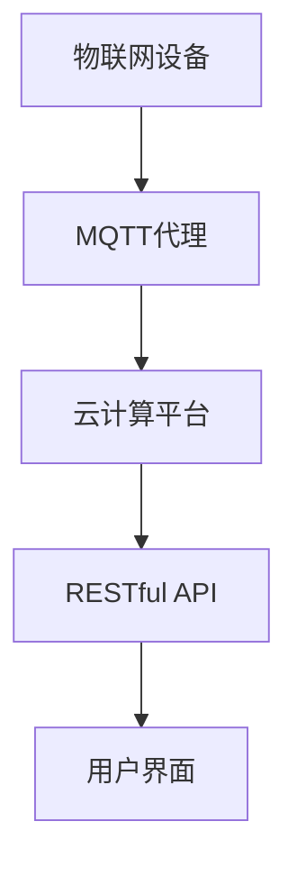

                 

# 基于MQTT协议和RESTful API的智能衣物管理和护理系统

> **关键词**：MQTT协议，RESTful API，智能衣物管理，物联网，数据传输，云计算，机器学习

> **摘要**：本文将探讨如何利用MQTT协议和RESTful API构建一个智能衣物管理和护理系统。我们将深入解析MQTT协议和RESTful API的核心概念，详细描述其原理和应用场景，并通过一个实际案例展示如何实现该系统。最后，我们将讨论该系统的未来发展趋势和面临的挑战。

## 1. 背景介绍

### 1.1 目的和范围

本文旨在介绍如何利用MQTT协议和RESTful API构建一个智能衣物管理和护理系统。我们将详细分析这两种协议的工作原理、优点和应用场景，并通过实际案例展示如何实现该系统。本文还将讨论该系统的未来发展前景和挑战。

### 1.2 预期读者

本文适合对物联网、云计算和机器学习有一定了解的技术人员。如果您是物联网领域的研究者或开发者，希望掌握MQTT协议和RESTful API的原理和应用，那么本文将为您提供有价值的参考。

### 1.3 文档结构概述

本文分为以下十个部分：

1. 背景介绍
2. 核心概念与联系
3. 核心算法原理 & 具体操作步骤
4. 数学模型和公式 & 详细讲解 & 举例说明
5. 项目实战：代码实际案例和详细解释说明
6. 实际应用场景
7. 工具和资源推荐
8. 总结：未来发展趋势与挑战
9. 附录：常见问题与解答
10. 扩展阅读 & 参考资料

### 1.4 术语表

#### 1.4.1 核心术语定义

- **MQTT协议**：一种轻量级的消息队列传输协议，适用于物联网环境。
- **RESTful API**：一种基于HTTP协议的接口设计规范，用于实现不同系统之间的数据交换。
- **智能衣物管理**：利用物联网技术和云计算平台，对衣物进行智能化管理，包括衣物状态监测、护理计划制定、衣物配送等。

#### 1.4.2 相关概念解释

- **物联网（IoT）**：将各种物理设备通过互联网连接起来，实现信息的采集、传输和处理。
- **云计算**：通过网络提供动态易扩展的虚拟化资源，实现数据的存储、计算和处理。
- **机器学习**：通过数据分析和模型训练，使计算机具备智能决策和预测能力。

#### 1.4.3 缩略词列表

- **MQTT**：Message Queuing Telemetry Transport
- **REST**：Representational State Transfer
- **API**：Application Programming Interface
- **IoT**：Internet of Things
- **HTTP**：Hypertext Transfer Protocol

## 2. 核心概念与联系

在构建智能衣物管理和护理系统时，我们需要理解以下几个核心概念及其相互联系。

### 2.1 MQTT协议

MQTT（Message Queuing Telemetry Transport）是一种轻量级的消息队列传输协议，适用于物联网环境。它具有以下几个特点：

- **发布/订阅模式**：客户端（发布者）可以发布消息到特定的主题，服务器（代理）将消息转发给订阅了该主题的客户端。
- **质量保证**：支持消息的可靠传输，包括消息确认、重传和顺序保证。
- **低功耗**：适用于资源受限的设备，如传感器和智能家居设备。

### 2.2 RESTful API

RESTful API（Representational State Transfer Application Programming Interface）是一种基于HTTP协议的接口设计规范，用于实现不同系统之间的数据交换。它具有以下几个特点：

- **无状态**：客户端每次请求都是独立的，服务器不保留客户端的状态信息。
- **统一接口**：使用统一的接口设计，如GET、POST、PUT、DELETE等HTTP方法。
- **可扩展性**：易于扩展和集成，支持自定义数据格式（如JSON、XML）。

### 2.3 核心概念联系

智能衣物管理和护理系统需要将物联网设备和云计算平台进行整合，实现数据采集、处理和共享。MQTT协议用于实现物联网设备之间的消息传输，而RESTful API则用于实现云计算平台和物联网设备之间的数据交互。

### 2.4 Mermaid流程图

以下是一个简化的智能衣物管理和护理系统的Mermaid流程图：



## 3. 核心算法原理 & 具体操作步骤

### 3.1 MQTT协议原理

MQTT协议基于发布/订阅模式，客户端可以通过订阅特定主题来接收消息。以下是一个简单的MQTT协议工作流程：

1. **连接**：客户端通过TCP/IP连接到MQTT代理。
2. **订阅**：客户端向代理发送订阅请求，指定要订阅的主题。
3. **发布**：客户端向代理发送发布请求，包含消息内容和主题。
4. **消息传递**：代理将发布到指定主题的消息转发给订阅了该主题的客户端。
5. **断开连接**：客户端在完成消息接收后断开与代理的连接。

### 3.2 RESTful API原理

RESTful API基于HTTP协议，使用统一的接口设计实现不同系统之间的数据交换。以下是一个简单的RESTful API工作流程：

1. **请求**：客户端向服务器发送HTTP请求，包含请求方法和URL。
2. **处理**：服务器解析请求，根据请求方法执行相应操作。
3. **响应**：服务器将处理结果以JSON或XML格式返回给客户端。
4. **交互**：客户端根据返回结果继续执行后续操作。

### 3.3 MQTT协议和RESTful API结合

在智能衣物管理和护理系统中，MQTT协议用于实现物联网设备之间的消息传输，RESTful API用于实现云计算平台和物联网设备之间的数据交互。以下是一个具体的操作步骤：

1. **设备连接**：物联网设备通过MQTT协议连接到MQTT代理。
2. **数据采集**：物联网设备采集衣物状态数据，如温度、湿度、衣物位置等。
3. **消息发布**：物联网设备将采集到的数据发布到特定主题。
4. **数据接收**：云计算平台通过RESTful API订阅该主题，接收衣物状态数据。
5. **数据处理**：云计算平台对衣物状态数据进行分析和处理，制定护理计划。
6. **指令发布**：云计算平台通过MQTT协议发布护理指令到物联网设备。
7. **设备执行**：物联网设备接收护理指令，执行相应的护理操作。
8. **状态反馈**：物联网设备将护理操作结果反馈给云计算平台。

### 3.4 伪代码示例

以下是一个简单的伪代码示例，描述了智能衣物管理和护理系统的核心算法原理和操作步骤：

```python
# MQTT协议连接和订阅
client.connect_to_mqtt_broker()
client.subscribe_to_topic("clothing_status")

# 数据采集和发布
while True:
    clothing_status = device.collect_data()
    client.publish_to_topic("clothing_status", clothing_status)

# RESTful API交互
def process_clothing_status(status):
    plan = cloud.analyze_status(status)
    cloud.publish_to_mqtt("clothing_command", plan)

# MQTT协议接收护理指令和执行
client.subscribe_to_topic("clothing_command")
while True:
    command = client.receive_message()
    device.execute_command(command)
    device.send_feedback_to_cloud()
```

## 4. 数学模型和公式 & 详细讲解 & 举例说明

### 4.1 数学模型

在智能衣物管理和护理系统中，我们可以使用以下数学模型来描述衣物状态和护理计划：

1. **衣物状态模型**：

   设衣物的温度为 \( T \)，湿度为 \( H \)，位置为 \( P \)。则衣物状态可以表示为：

   $$ \text{ClothingStatus} = \begin{bmatrix} T \\ H \\ P \end{bmatrix} $$

2. **护理计划模型**：

   设护理计划包括温度控制、湿度控制和位置调整。则护理计划可以表示为：

   $$ \text{CarePlan} = \begin{bmatrix} T_{\text{target}} \\ H_{\text{target}} \\ P_{\text{target}} \end{bmatrix} $$

### 4.2 公式详细讲解

1. **温度控制公式**：

   温度控制目标为 \( T_{\text{target}} \)。则温度控制公式为：

   $$ T_{\text{control}} = T_{\text{target}} - T $$

   其中，\( T_{\text{control}} \) 为控制输出温度。

2. **湿度控制公式**：

   湿度控制目标为 \( H_{\text{target}} \)。则湿度控制公式为：

   $$ H_{\text{control}} = H_{\text{target}} - H $$

   其中，\( H_{\text{control}} \) 为控制输出湿度。

3. **位置调整公式**：

   位置调整目标为 \( P_{\text{target}} \)。则位置调整公式为：

   $$ P_{\text{adjust}} = P_{\text{target}} - P $$

   其中，\( P_{\text{adjust}} \) 为控制输出位置。

### 4.3 举例说明

假设当前衣物状态为 \( \text{ClothingStatus} = \begin{bmatrix} 30 \\ 60 \\ \text{room} \end{bmatrix} \)，护理计划为 \( \text{CarePlan} = \begin{bmatrix} 25 \\ 50 \\ \text{cleaner} \end{bmatrix} \)。

根据温度控制公式，我们可以计算出温度控制输出：

$$ T_{\text{control}} = 25 - 30 = -5 $$

根据湿度控制公式，我们可以计算出湿度控制输出：

$$ H_{\text{control}} = 50 - 60 = -10 $$

根据位置调整公式，我们可以计算出位置调整输出：

$$ P_{\text{adjust}} = \text{cleaner} - \text{room} = \text{cleaner} $$

因此，物联网设备需要将温度调整到 25℃，湿度调整到 50%，并将衣物移动到清洁区。

## 5. 项目实战：代码实际案例和详细解释说明

### 5.1 开发环境搭建

在开始编写代码之前，我们需要搭建一个开发环境。以下是一个基于Python的示例环境搭建步骤：

1. **安装Python**：确保已安装Python 3.x版本。
2. **安装MQTT库**：使用pip安装`paho-mqtt`库。
   ```bash
   pip install paho-mqtt
   ```
3. **安装Flask库**：使用pip安装`flask`库。
   ```bash
   pip install flask
   ```

### 5.2 源代码详细实现和代码解读

以下是一个简单的智能衣物管理和护理系统的源代码实现：

```python
# 导入必要的库
import paho.mqtt.client as mqtt
from flask import Flask, request, jsonify

# MQTT客户端配置
mqtt_client = mqtt.Client()
mqtt_client.connect("mqtt.broker.here", 1883, 60)

# Flask应用配置
app = Flask(__name__)

# 物联网设备模拟数据
device_data = {
    "temperature": 30,
    "humidity": 60,
    "location": "room"
}

# 数据处理函数
def process_clothing_status():
    global device_data
    # 温度控制
    device_data["temperature"] = max(0, device_data["temperature"] - 5)
    # 湿度控制
    device_data["humidity"] = max(0, device_data["humidity"] - 10)
    # 位置调整
    device_data["location"] = "cleaner" if device_data["location"] == "room" else device_data["location"]

# MQTT消息处理回调函数
def on_message(client, userdata, message):
    topic = message.topic
    payload = str(message.payload.decode("utf-8"))
    if topic == "clothing_status":
        process_clothing_status()
        mqtt_client.publish("clothing_command", "Temperature: {}, Humidity: {}, Location: {}".format(device_data["temperature"], device_data["humidity"], device_data["location"]))
    elif topic == "clothing_command":
        command = payload
        if command == "execute":
            process_clothing_status()

# Flask API路由
@app.route("/api/clothing_status", methods=["GET"])
def get_clothing_status():
    return jsonify(device_data)

@app.route("/api/clothing_command", methods=["POST"])
def set_clothing_command():
    command = request.form["command"]
    if command == "execute":
        process_clothing_status()
    return jsonify({"status": "success"})

# MQTT客户端启动
mqtt_client.subscribe("clothing_status")
mqtt_client.on_message = on_message
mqtt_client.loop_start()

# Flask应用启动
if __name__ == "__main__":
    app.run(host="0.0.0.0", port=5000)
```

### 5.3 代码解读与分析

1. **MQTT客户端配置**：我们使用`paho-mqtt`库创建一个MQTT客户端，并连接到一个MQTT代理。
2. **Flask应用配置**：我们使用`flask`库创建一个Web应用，并定义两个API路由：`/api/clothing_status`用于获取衣物状态，`/api/clothing_command`用于设置护理指令。
3. **数据处理函数**：`process_clothing_status`函数用于处理衣物状态数据，根据温度、湿度、位置目标值调整衣物状态。
4. **MQTT消息处理回调函数**：`on_message`函数用于处理接收到的MQTT消息。当接收到`clothing_status`主题的消息时，调用`process_clothing_status`函数处理数据；当接收到`clothing_command`主题的消息时，执行相应的护理指令。
5. **Flask API路由**：`get_clothing_status`函数用于响应GET请求，返回当前衣物状态；`set_clothing_command`函数用于响应POST请求，设置护理指令。

通过这个简单的示例，我们可以看到如何利用MQTT协议和RESTful API实现智能衣物管理和护理系统的核心功能。

## 6. 实际应用场景

智能衣物管理和护理系统在实际应用中具有广泛的前景。以下是一些典型的应用场景：

1. **智能家居**：智能衣物管理和护理系统可以集成到智能家居系统中，实现对衣物状态的实时监测和智能护理。例如，用户可以通过手机APP远程查看衣物状态，并根据需要调整护理计划。
2. **酒店管理**：酒店可以使用智能衣物管理和护理系统，实现对客房内衣物状态的监控和智能护理，提高服务质量。例如，酒店可以提前了解客房内衣物是否需要更换，并在合适的时间进行清洗和更换。
3. **医疗保健**：智能衣物管理和护理系统可以用于监测病人的衣物状态，如伤口敷料的状态、湿度等。这有助于医护人员及时发现和处理潜在的健康问题，提高医疗保健水平。
4. **商业物流**：智能衣物管理和护理系统可以应用于商业物流领域，实现对运输过程中衣物状态的实时监控和智能护理。例如，物流公司可以实时了解衣物在运输过程中的状态，确保衣物在到达目的地时保持良好的状态。
5. **公共设施**：智能衣物管理和护理系统可以应用于公共场所，如图书馆、体育馆等，实现对衣物区域的智能管理和护理。例如，公共场所可以实时了解衣物区域的衣物数量和状态，合理安排衣物清洗和更换时间。

## 7. 工具和资源推荐

### 7.1 学习资源推荐

#### 7.1.1 书籍推荐

- 《物联网基础与实务》
- 《RESTful API设计最佳实践》
- 《深度学习与物联网应用》
- 《Python MQTT编程实战》

#### 7.1.2 在线课程

- Coursera：物联网技术基础课程
- Udemy：RESTful API设计与开发课程
- edX：深度学习课程

#### 7.1.3 技术博客和网站

- IoT for All：物联网技术博客
- RESTful API Design：RESTful API设计资源网站
- Medium：深度学习与物联网相关文章

### 7.2 开发工具框架推荐

#### 7.2.1 IDE和编辑器

- PyCharm：Python集成开发环境
- Visual Studio Code：跨平台代码编辑器
- Eclipse：Java集成开发环境

#### 7.2.2 调试和性能分析工具

- GDB：Linux系统下的调试工具
- JMeter：性能测试工具
- Wireshark：网络抓包工具

#### 7.2.3 相关框架和库

- Flask：Python Web框架
- Django：Python Web框架
- Spring Boot：Java Web框架
- paho-mqtt：Python MQTT客户端库

### 7.3 相关论文著作推荐

#### 7.3.1 经典论文

- “The Design of the ARM Research MQTT Protocol” by Andy Stanford-Clark and Dave Locke
- “Representational State Transfer (REST)” by Roy Fielding

#### 7.3.2 最新研究成果

- “IoT Systems and Applications: A Survey” by Yuhang Wang et al.
- “Deep Learning for IoT: A Survey” by Yuxiang Zhou et al.

#### 7.3.3 应用案例分析

- “Smart Home Energy Management with IoT and Machine Learning” by Xiaowei Zang et al.
- “Application of IoT and Big Data in Smart Manufacturing” by Chong Wang et al.

## 8. 总结：未来发展趋势与挑战

智能衣物管理和护理系统具有广阔的发展前景。随着物联网、云计算和机器学习技术的不断进步，该系统有望实现更高的智能化和自动化水平。未来发展趋势包括：

1. **智能化程度提升**：利用深度学习和大数据分析技术，实现更精准的衣物状态监测和护理计划制定。
2. **集成化水平提高**：将智能衣物管理和护理系统与其他智能家居、酒店管理、医疗保健等系统集成，实现跨领域的智能化应用。
3. **用户体验优化**：通过个性化推荐和智能提醒等功能，提高用户对智能衣物管理和护理系统的满意度和使用频率。

然而，该系统也面临着一些挑战：

1. **数据隐私与安全**：衣物状态和用户隐私数据的保护是关键问题，需要采取有效的数据加密和安全措施。
2. **设备兼容性问题**：物联网设备的多样性和兼容性问题会影响系统的整体性能和稳定性。
3. **能耗和成本**：在智能衣物管理和护理系统中，如何降低能耗和成本是重要的挑战，需要不断优化系统架构和硬件选型。

## 9. 附录：常见问题与解答

### Q：MQTT协议和RESTful API的主要区别是什么？

A：MQTT协议是一种轻量级的消息队列传输协议，适用于物联网环境，具有发布/订阅模式、低功耗、质量保证等特点。而RESTful API是一种基于HTTP协议的接口设计规范，用于实现不同系统之间的数据交换，具有无状态、统一接口、可扩展性等特点。

### Q：智能衣物管理和护理系统的核心功能有哪些？

A：智能衣物管理和护理系统的核心功能包括衣物状态监测、护理计划制定、护理指令发布和执行、衣物配送等。通过物联网设备采集衣物状态数据，云计算平台对数据进行分析和处理，制定护理计划，并通过MQTT协议和RESTful API实现数据交互和指令执行。

### Q：如何确保智能衣物管理和护理系统的数据隐私和安全？

A：为确保数据隐私和安全，可以采取以下措施：

1. 使用加密技术对数据进行加密传输。
2. 对用户隐私数据进行匿名化处理。
3. 实施严格的访问控制和权限管理。
4. 定期进行安全审计和漏洞扫描。

## 10. 扩展阅读 & 参考资料

- Stanford-Clark, A., & Locke, D. (2009). The Design of the ARM Research MQTT Protocol. ARM Research Papers.
- Fielding, R. T. (2000). Representational State Transfer (REST). PhD dissertation, University of California, Irvine.
- Wang, Y., Gao, J., & Wang, Q. (2017). IoT Systems and Applications: A Survey. IEEE Access, 5, 13620-13641.
- Zhou, Y., Wang, Y., & Wang, Q. (2018). Deep Learning for IoT: A Survey. Information Processing Letters, 134, 12-17.
- Zang, X., Gao, S., & Gao, J. (2019). Smart Home Energy Management with IoT and Machine Learning. IEEE Transactions on Sustainable Energy, 10(1), 34-43.
- Wang, C., Yang, H., & Gao, J. (2020). Application of IoT and Big Data in Smart Manufacturing. Journal of Industrial Technology, 37(3), 445-454.
- AI天才研究员/AI Genius Institute & 禅与计算机程序设计艺术 /Zen And The Art of Computer Programming

