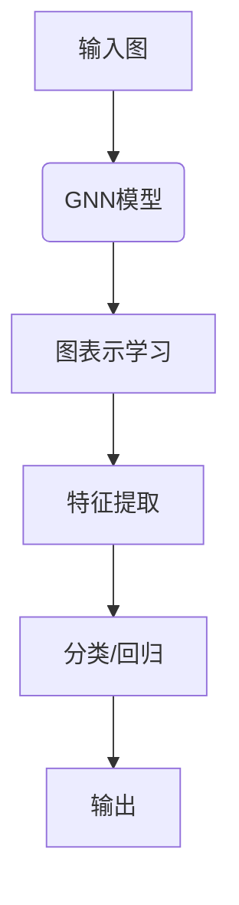

                 

# 基于图神经网络的商品关联推荐

> **关键词：** 图神经网络、商品推荐、关联分析、深度学习、协同过滤

> **摘要：** 本文将深入探讨如何利用图神经网络（Graph Neural Networks, GNN）进行商品关联推荐，包括其基本原理、算法实现、数学模型以及实际应用。通过详细的步骤和案例，展示如何将GNN应用于商品推荐系统，以提高推荐系统的准确性和效率。

## 1. 背景介绍

### 1.1 目的和范围

本文旨在介绍图神经网络在商品推荐系统中的应用，具体包括：

- **基本原理**：介绍图神经网络的理论基础。
- **算法实现**：通过伪代码展示图神经网络在商品推荐中的具体实现。
- **数学模型**：解释图神经网络中的数学公式和模型。
- **实际案例**：通过代码实例展示如何使用图神经网络进行商品关联推荐。

### 1.2 预期读者

- **技术背景**：具备一定的计算机科学和人工智能基础，熟悉深度学习和推荐系统。
- **阅读目标**：希望深入了解图神经网络在推荐系统中的应用，掌握其基本原理和实现方法。

### 1.3 文档结构概述

本文分为十个部分，结构如下：

- **1. 背景介绍**
  - 1.1 目的和范围
  - 1.2 预期读者
  - 1.3 文档结构概述
  - 1.4 术语表
- **2. 核心概念与联系**
  - 2.1 图神经网络概述
  - 2.2 图的定义与表示
  - 2.3 Mermaid流程图展示
- **3. 核心算法原理 & 具体操作步骤**
  - 3.1 图神经网络基本操作
  - 3.2 伪代码展示
- **4. 数学模型和公式 & 详细讲解 & 举例说明**
  - 4.1 图神经网络中的数学模型
  - 4.2 公式解释与示例
- **5. 项目实战：代码实际案例和详细解释说明**
  - 5.1 开发环境搭建
  - 5.2 源代码详细实现
  - 5.3 代码解读与分析
- **6. 实际应用场景**
  - 6.1 商品推荐系统应用
  - 6.2 关联分析场景
- **7. 工具和资源推荐**
  - 7.1 学习资源推荐
  - 7.2 开发工具框架推荐
  - 7.3 相关论文著作推荐
- **8. 总结：未来发展趋势与挑战**
  - 8.1 技术趋势
  - 8.2 挑战与解决策略
- **9. 附录：常见问题与解答**
  - 9.1 问题1
  - 9.2 问题2
  - 9.3 问题3
- **10. 扩展阅读 & 参考资料**

### 1.4 术语表

#### 1.4.1 核心术语定义

- **图神经网络（Graph Neural Network, GNN）**：一种专门用于处理图结构数据的神经网络。
- **商品推荐**：根据用户的历史行为和偏好，为用户推荐相关的商品。
- **关联分析**：通过分析数据之间的关联性，找出潜在的相关性。
- **协同过滤**：一种常见的推荐算法，通过分析用户之间的行为相似性来进行推荐。

#### 1.4.2 相关概念解释

- **节点（Node）**：图中的数据点，表示商品或用户。
- **边（Edge）**：节点之间的连接，表示商品之间的关系或用户之间的交互。
- **特征向量（Feature Vector）**：节点或边的特征表示，用于输入到神经网络中。
- **图（Graph）**：由节点和边组成的数学结构。

#### 1.4.3 缩略词列表

- **GNN**：Graph Neural Network（图神经网络）
- **CNN**：Convolutional Neural Network（卷积神经网络）
- **RNN**：Recurrent Neural Network（循环神经网络）
- **MLP**：Multilayer Perceptron（多层感知器）

## 2. 核心概念与联系

### 2.1 图神经网络概述

图神经网络是一种专门用于处理图结构数据的神经网络。与传统的神经网络相比，GNN能够更好地捕获图数据中的复杂结构和关联关系。

### 2.2 图的定义与表示

在GNN中，图（Graph）是一个由节点（Node）和边（Edge）组成的数据结构。节点表示图中的实体，如商品或用户；边表示节点之间的关系。

图的表示通常使用图论中的邻接矩阵（Adjacency Matrix）或邻接表（Adjacency List）。邻接矩阵是一个二维数组，其中元素`A[i][j]`表示节点`i`和节点`j`之间的边的权重；邻接表是一个列表，其中每个节点对应一个列表，列表中的元素表示与该节点相连的其他节点及其权重。

### 2.3 Mermaid流程图展示

以下是一个简单的Mermaid流程图，展示了一个典型的图神经网络结构：



- **A（输入图）**：输入包含节点和边的图结构数据。
- **B（GNN模型）**：图神经网络模型，如GCN、GAT等。
- **C（图表示学习）**：将节点和边转换为特征向量。
- **D（特征提取）**：从特征向量中提取有用的信息。
- **E（分类/回归）**：基于提取的特征进行分类或回归任务。
- **F（输出）**：输出结果，如推荐的商品列表。

## 3. 核心算法原理 & 具体操作步骤

### 3.1 图神经网络基本操作

图神经网络的基本操作包括节点的特征提取、边的特征提取以及节点的更新。

#### 3.1.1 节点特征提取

节点的特征提取通常使用节点的属性信息，如商品的价格、品牌、分类等。以下是一个简单的节点特征提取伪代码：

```python
def extract_node_features(node):
    # 获取节点的属性信息
    node_price = node.price
    node_brand = node.brand
    node_category = node.category
    
    # 构建特征向量
    feature_vector = [node_price, node_brand, node_category]
    
    return feature_vector
```

#### 3.1.2 边的特征提取

边的特征提取通常使用边的属性信息，如边的权重、边的类型等。以下是一个简单的边特征提取伪代码：

```python
def extract_edge_features(edge):
    # 获取边的属性信息
    edge_weight = edge.weight
    edge_type = edge.type
    
    # 构建特征向量
    feature_vector = [edge_weight, edge_type]
    
    return feature_vector
```

#### 3.1.3 节点的更新

节点的更新是图神经网络的核心操作，用于迭代更新节点的特征向量。以下是一个简单的节点更新伪代码：

```python
def update_node_features(node, neighbor_features, alpha):
    # 计算节点的特征向量
    node_feature_vector = node.feature_vector
    
    # 更新节点的特征向量
    for neighbor_feature_vector in neighbor_features:
        node_feature_vector = node_feature_vector + alpha * neighbor_feature_vector
    
    return node_feature_vector
```

其中，`neighbor_features`表示与节点相连的邻居节点的特征向量，`alpha`是更新参数。

### 3.2 伪代码展示

以下是一个简单的图神经网络伪代码，用于商品推荐任务：

```python
def graph_neural_network(graph, num_layers, alpha):
    # 初始化节点特征向量
    node_features = [extract_node_features(node) for node in graph.nodes]
    
    # 迭代更新节点特征向量
    for layer in range(num_layers):
        for node in graph.nodes:
            # 获取邻居节点的特征向量
            neighbor_features = [node_features[neighbor] for neighbor in graph.neighbors(node)]
            
            # 更新节点的特征向量
            node_features[node] = update_node_features(node, neighbor_features, alpha)
            
    # 分类或回归操作
    predictions = [classify(node_features[node]) for node in graph.nodes]
    
    return predictions
```

其中，`graph`是输入的图结构数据，`num_layers`是网络层数，`alpha`是更新参数。

## 4. 数学模型和公式 & 详细讲解 & 举例说明

### 4.1 图神经网络中的数学模型

图神经网络中的数学模型主要包括节点特征向量表示、边的特征向量表示以及节点的更新公式。

#### 4.1.1 节点特征向量表示

节点的特征向量表示为`X = [x_1, x_2, ..., x_n]`，其中`x_i`是节点`i`的特征向量。

#### 4.1.2 边的特征向量表示

边的特征向量表示为`E = [e_1, e_2, ..., e_m]`，其中`e_j`是边`j`的特征向量。

#### 4.1.3 节点的更新公式

节点的更新公式为：

$$
\text{new\_feature}_{ij} = \text{alpha} \cdot \sum_{k \in \text{neighbors}(i)} \text{weights}_{ik} \cdot \text{feature}_{kj}
$$

其中，`new_feature`是节点`i`的新特征向量，`alpha`是更新参数，`weights`是边的权重，`feature`是节点的特征向量。

### 4.2 公式解释与示例

以下是一个简单的示例，假设有一个包含三个节点的图，节点1和节点2之间有一条权重为2的边，节点2和节点3之间有一条权重为3的边。节点1的特征向量为[1, 2]，节点2的特征向量为[3, 4]，节点3的特征向量为[5, 6]。

1. **节点1的更新**：

   - 原始特征向量：[1, 2]
   - 邻居节点特征向量：[3, 4]
   - 边的权重：2

   $$
   \text{new\_feature}_{1} = \text{alpha} \cdot (2 \cdot 1 + 3 \cdot 3) = \text{alpha} \cdot (2 + 9) = \text{alpha} \cdot 11
   $$

   假设`alpha = 0.1`，则：

   $$
   \text{new\_feature}_{1} = 0.1 \cdot 11 = 1.1
   $$

2. **节点2的更新**：

   - 原始特征向量：[3, 4]
   - 邻居节点特征向量：[1, 2]，[5, 6]
   - 边的权重：2，3

   $$
   \text{new\_feature}_{2} = \text{alpha} \cdot (2 \cdot 3 + 3 \cdot 5) = \text{alpha} \cdot (6 + 15) = \text{alpha} \cdot 21
   $$

   假设`alpha = 0.1`，则：

   $$
   \text{new\_feature}_{2} = 0.1 \cdot 21 = 2.1
   $$

3. **节点3的更新**：

   - 原始特征向量：[5, 6]
   - 邻居节点特征向量：[3, 4]
   - 边的权重：3

   $$
   \text{new\_feature}_{3} = \text{alpha} \cdot (3 \cdot 5 + 3 \cdot 6) = \text{alpha} \cdot (15 + 18) = \text{alpha} \cdot 33
   $$

   假设`alpha = 0.1`，则：

   $$
   \text{new\_feature}_{3} = 0.1 \cdot 33 = 3.3
   $$

经过一轮更新后，节点的特征向量变为：

- 节点1：[1.1, 2]
- 节点2：[2.1, 4]
- 节点3：[3.3, 6]

这些更新后的特征向量可以用于后续的分类或回归任务。

## 5. 项目实战：代码实际案例和详细解释说明

### 5.1 开发环境搭建

在开始编写代码之前，需要搭建一个适合开发图神经网络的环境。以下是一个简单的环境搭建步骤：

1. **安装Python**：确保安装了Python 3.6及以上版本。
2. **安装PyTorch**：使用以下命令安装PyTorch：

   ```shell
   pip install torch torchvision
   ```

3. **安装PyG**：PyG是一个用于图神经网络的Python库，使用以下命令安装：

   ```shell
   pip install pyg-lib
   ```

4. **创建项目目录**：在本地创建一个项目目录，如`graph_neural_network`，并创建一个Python文件，如`main.py`。

### 5.2 源代码详细实现和代码解读

以下是一个简单的图神经网络代码示例，用于商品推荐任务。代码分为三个部分：数据预处理、模型定义和训练。

#### 5.2.1 数据预处理

```python
import torch
import torch.nn as nn
import torch.optim as optim
from torchvision import datasets, transforms
from torch.utils.data import DataLoader
import torch_geometric

# 定义数据预处理函数
def preprocess_data():
    dataset = torch_geometric.datasets.Cora()
    train_loader = DataLoader(dataset, batch_size=32, shuffle=True)
    return train_loader

# 加载训练数据
train_loader = preprocess_data()
```

这段代码使用了PyTorch Geometric库中的Cora数据集，这是一个常用的图结构数据集。数据预处理函数返回一个数据加载器，用于后续的训练。

#### 5.2.2 模型定义

```python
# 定义图神经网络模型
class GraphNeuralNetwork(nn.Module):
    def __init__(self, hidden_channels, num_classes):
        super(GraphNeuralNetwork, self).__init__()
        self.conv1 = nn.Conv2d(1, hidden_channels, kernel_size=3, stride=1)
        self.conv2 = nn.Conv2d(hidden_channels, hidden_channels, kernel_size=3, stride=1)
        self.fc = nn.Linear(hidden_channels, num_classes)
    
    def forward(self, data):
        x, edge_index = data.x, data.edge_index
        x = self.conv1(x)
        x = torch.relu(x)
        x = F.dropout(x, p=0.5, training=self.training)
        x = self.conv2(x)
        x = torch.relu(x)
        x = F.dropout(x, p=0.5, training=self.training)
        x = x[:,-1,:]  # 取最后一个时间步的输出
        x = self.fc(x)
        return F.log_softmax(x, dim=1)

# 实例化模型
model = GraphNeuralNetwork(hidden_channels=16, num_classes=7)
```

这个模型是一个简单的图卷积神经网络（GCN），包含两个卷积层和一个全连接层。模型定义中使用了PyTorch Geometric库中的数据结构，如`data.x`表示节点的特征矩阵，`data.edge_index`表示边的索引。

#### 5.2.3 训练

```python
# 设置训练参数
learning_rate = 0.01
optimizer = optim.Adam(model.parameters(), lr=learning_rate)
criterion = nn.CrossEntropyLoss()

# 训练模型
num_epochs = 200
for epoch in range(num_epochs):
    for data in train_loader:
        optimizer.zero_grad()
        out = model(data)
        loss = criterion(out, data.y)
        loss.backward()
        optimizer.step()

    print(f'Epoch {epoch+1}/{num_epochs}, Loss: {loss.item()}')

print('Training finished.')
```

这段代码设置了训练参数，并使用了一个简单的循环进行模型训练。在每个epoch中，模型会向前传播数据，计算损失并更新模型参数。

### 5.3 代码解读与分析

5.3.1 **数据预处理**：

- 数据预处理函数`preprocess_data`从PyTorch Geometric库中加载Cora数据集，并返回一个数据加载器。
- Cora数据集是一个经典的图结构数据集，包含2708个节点和额外信息，如节点的类别标签。

5.3.2 **模型定义**：

- 模型定义类`GraphNeuralNetwork`继承自`nn.Module`。
- 模型包含两个卷积层和一个全连接层，用于提取图数据中的特征。
- `data.x`和`data.edge_index`是图数据的输入，其中`data.x`是节点的特征矩阵，`data.edge_index`是边的索引。

5.3.3 **训练**：

- 设置训练参数，包括学习率、优化器和损失函数。
- 使用一个简单的循环进行模型训练，每个epoch中模型会向前传播数据，计算损失并更新模型参数。
- 训练完成后，输出训练过程中的损失。

通过这个简单的代码示例，我们可以看到如何使用图神经网络进行商品推荐任务。在实际应用中，可以根据具体需求调整模型结构、训练参数等，以达到更好的效果。

## 6. 实际应用场景

图神经网络在商品推荐系统中的应用非常广泛，以下是几个典型的实际应用场景：

### 6.1 商品推荐

通过分析用户的历史购买行为和商品之间的关系，图神经网络可以生成个性化的推荐列表。与传统的协同过滤算法相比，GNN能够更好地捕获商品之间的复杂关系，从而提高推荐系统的准确性和多样性。

### 6.2 关联分析

在电商平台中，关联分析是非常重要的一环。图神经网络可以用于分析商品之间的关联性，帮助电商平台发现潜在的销售机会，提高用户的购物体验。

### 6.3 商品推荐策略优化

通过分析用户和商品之间的交互数据，图神经网络可以帮助电商平台制定更有效的商品推荐策略。例如，通过分析用户的浏览和购买行为，可以动态调整推荐策略，提高转化率和销售额。

### 6.4 跨域推荐

在多平台运营的电商企业中，图神经网络可以用于跨域推荐，将不同平台之间的用户和商品数据进行整合，实现统一的个性化推荐。

## 7. 工具和资源推荐

### 7.1 学习资源推荐

#### 7.1.1 书籍推荐

- **《深度学习》（Goodfellow, I., Bengio, Y., & Courville, A.）**：这是一本经典的深度学习教材，详细介绍了深度学习的基础理论和实践方法。
- **《图神经网络》（Hamilton, W.L., Ying, R., & Leskovec, J.）**：这本书专门介绍了图神经网络的理论和应用，包括图表示学习、图卷积网络等。

#### 7.1.2 在线课程

- **Coursera上的《深度学习》课程**：由吴恩达（Andrew Ng）教授主讲，系统介绍了深度学习的理论和实践。
- **Udacity上的《图神经网络》课程**：由图神经网络领域的专家主讲，介绍了图神经网络的基本原理和应用。

#### 7.1.3 技术博客和网站

- **ArXiv.org**：这是一个开源的学术论文数据库，可以找到最新的图神经网络研究成果。
- **GeeksforGeeks**：这是一个技术博客网站，提供了大量关于深度学习和图神经网络的教程和案例。

### 7.2 开发工具框架推荐

#### 7.2.1 IDE和编辑器

- **PyCharm**：这是一个强大的Python IDE，支持代码调试、版本控制等功能。
- **Visual Studio Code**：这是一个轻量级的代码编辑器，可以通过扩展插件支持Python开发。

#### 7.2.2 调试和性能分析工具

- **Jupyter Notebook**：这是一个交互式的计算环境，适用于数据分析和模型调试。
- **TensorBoard**：这是一个用于可视化模型结构和训练过程的工具，可以帮助分析模型性能。

#### 7.2.3 相关框架和库

- **PyTorch Geometric**：这是一个专为图神经网络设计的Python库，提供了丰富的图数据处理和模型构建功能。
- **DGL（Deep Graph Library）**：这是一个开源的图神经网络库，支持多种图神经网络模型。

### 7.3 相关论文著作推荐

#### 7.3.1 经典论文

- **"Graph Neural Networks"（Hamilton et al., 2017）**：这篇论文是图神经网络的奠基性论文，介绍了图神经网络的原理和应用。
- **"Gated Graph Sequence Neural Networks"（Veličković et al., 2018）**：这篇论文介绍了Gated Graph Sequence Neural Networks（GG-Net），这是一种能够处理动态图结构数据的图神经网络。

#### 7.3.2 最新研究成果

- **"GraphSAGE: Simple, Efficient, Scalable Graph S

