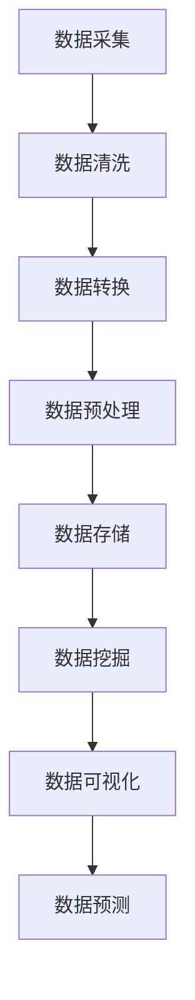

                 

# 基于大数据的汽车数据分析系统设计与实现

> 关键词：大数据，汽车数据分析，系统设计，算法原理，实际案例

> 摘要：本文深入探讨了基于大数据的汽车数据分析系统的设计与实现。首先介绍了大数据和汽车数据分析的背景，然后详细阐述了系统设计的关键概念和核心算法原理。通过数学模型和实际案例的讲解，本文为读者提供了从理论到实践的全方位指导，旨在帮助开发者和研究人员更好地理解和应用大数据技术于汽车领域。

## 1. 背景介绍

### 1.1 目的和范围

本文旨在探讨如何设计和实现一个基于大数据的汽车数据分析系统。该系统的主要目标是通过对大量汽车运行数据进行深入分析，提取有价值的信息，为汽车制造商、保险公司和车主提供决策支持。本文将涵盖以下内容：

1. 大数据和汽车数据分析的背景介绍。
2. 系统设计的基本原理和架构。
3. 关键算法原理和数学模型的详细讲解。
4. 实际案例的代码实现和分析。
5. 系统在实际应用场景中的效果和前景。

### 1.2 预期读者

本文面向以下读者群体：

1. 对大数据和汽车数据分析感兴趣的科研人员。
2. 想要在汽车领域应用大数据技术的工程师。
3. 对系统设计和算法原理有深入理解的技术专家。

### 1.3 文档结构概述

本文结构如下：

1. **背景介绍**：介绍大数据和汽车数据分析的背景。
2. **核心概念与联系**：介绍系统设计的关键概念和流程图。
3. **核心算法原理 & 具体操作步骤**：讲解算法原理和伪代码。
4. **数学模型和公式 & 详细讲解 & 举例说明**：介绍数学模型和公式。
5. **项目实战：代码实际案例和详细解释说明**：提供实际代码案例。
6. **实际应用场景**：讨论系统的应用场景。
7. **工具和资源推荐**：推荐学习资源和开发工具。
8. **总结：未来发展趋势与挑战**：总结系统的发展趋势和挑战。
9. **附录：常见问题与解答**：提供常见问题的解答。
10. **扩展阅读 & 参考资料**：推荐相关文献和资料。

### 1.4 术语表

#### 1.4.1 核心术语定义

- **大数据**：指无法用传统数据库软件工具在合理时间内捕捉、管理和处理的数据集合。
- **汽车数据分析**：利用数据分析技术对汽车运行数据进行挖掘和分析，以提取有价值的信息。
- **系统设计**：系统设计的整体过程，包括需求分析、架构设计、模块划分等。
- **算法原理**：算法的基本原理和实现方法。
- **数学模型**：用数学语言描述的数据分析模型。

#### 1.4.2 相关概念解释

- **数据源**：提供数据的来源，如传感器、数据库等。
- **数据处理**：对原始数据进行清洗、转换和预处理。
- **数据挖掘**：从大量数据中提取有价值的信息。
- **机器学习**：利用算法自动从数据中学习模式。

#### 1.4.3 缩略词列表

- **HDFS**：Hadoop分布式文件系统（Hadoop Distributed File System）。
- **MapReduce**：一种编程模型，用于大规模数据集的分布式运算。
- **Spark**：一种快速、通用的计算引擎，适用于大规模数据处理。

## 2. 核心概念与联系

### 2.1 系统架构

在设计和实现基于大数据的汽车数据分析系统时，需要构建一个高扩展性、高可用性和高性能的系统架构。以下是系统架构的简要概述：


#### 2.1.1 数据源

数据源是系统的基础，主要包括以下几种类型：

1. **传感器数据**：车辆的各种传感器收集的数据，如速度、加速度、油门、刹车等。
2. **车辆状态数据**：车辆的健康状态、里程、油耗等数据。
3. **驾驶行为数据**：驾驶员的操作行为，如急刹车、急转弯等。

#### 2.1.2 数据处理

数据处理是系统的重要组成部分，主要包括以下步骤：

1. **数据采集**：从数据源采集数据。
2. **数据清洗**：去除重复数据、空值数据和噪声数据。
3. **数据转换**：将数据转换为统一的格式，如JSON、CSV等。
4. **数据预处理**：进行特征提取和特征工程，为后续分析做好准备。

#### 2.1.3 数据存储

数据存储是系统的关键部分，主要包括以下几种存储方案：

1. **关系型数据库**：适用于结构化数据的存储，如MySQL、PostgreSQL等。
2. **非关系型数据库**：适用于非结构化数据的存储，如MongoDB、Redis等。
3. **分布式文件系统**：适用于大规模数据的存储，如HDFS、CFS等。

#### 2.1.4 数据分析

数据分析是系统的核心功能，主要包括以下步骤：

1. **数据挖掘**：利用机器学习算法从数据中提取有价值的信息。
2. **数据可视化**：将分析结果以图表、报表等形式展示。
3. **数据预测**：利用历史数据预测未来的趋势。

### 2.2 Mermaid 流程图

下面是一个简化的 Mermaid 流程图，展示了系统架构中的关键流程节点：



## 3. 核心算法原理 & 具体操作步骤

### 3.1 算法原理

在汽车数据分析系统中，核心算法主要包括数据挖掘和机器学习算法。下面介绍几种常用的算法原理：

#### 3.1.1 K-Means 算法

K-Means 是一种基于距离的聚类算法，其基本思想是将数据点分为 K 个簇，使得每个簇内的数据点尽可能接近，而不同簇的数据点尽可能远离。

**算法步骤**：

1. 初始化 K 个簇的中心点。
2. 计算每个数据点到 K 个簇中心的距离。
3. 根据距离将数据点分配到最近的簇。
4. 重新计算每个簇的中心点。
5. 重复步骤 2-4，直到收敛。

#### 3.1.2 决策树算法

决策树是一种基于特征值进行分类或回归的算法，其基本思想是通过一系列特征值将数据划分为多个子集，直到满足停止条件。

**算法步骤**：

1. 选择一个最优特征进行划分。
2. 计算每个特征的信息增益或基尼不纯度。
3. 根据信息增益或基尼不纯度选择最优特征。
4. 划分数据，建立子节点。
5. 递归步骤 1-4，直到满足停止条件。

#### 3.1.3 贝叶斯算法

贝叶斯算法是一种基于贝叶斯定理的分类算法，其基本思想是根据先验概率和观察到的数据概率，计算后验概率，并根据后验概率进行分类。

**算法步骤**：

1. 初始化先验概率。
2. 计算每个类别的后验概率。
3. 根据后验概率进行分类。

### 3.2 具体操作步骤

下面以 K-Means 算法为例，介绍具体操作步骤：

#### 3.2.1 数据预处理

1. **数据清洗**：去除重复数据、空值数据和噪声数据。
2. **特征提取**：将原始数据转换为适合 K-Means 算法的特征向量。

#### 3.2.2 初始化簇中心

1. 从数据集中随机选择 K 个数据点作为初始簇中心。
2. 计算每个簇的质心（中心点）。

#### 3.2.3 聚类过程

1. 对每个数据点，计算其到 K 个簇中心的距离。
2. 将数据点分配到最近的簇。
3. 重新计算每个簇的质心。
4. 重复步骤 1-3，直到收敛。

#### 3.2.4 聚类结果评估

1. **内部评估**：计算聚类结果的内部评价指标，如轮廓系数、距离平方和等。
2. **外部评估**：如果已知数据点标签，可以使用外部评价指标，如准确率、召回率等。

## 4. 数学模型和公式 & 详细讲解 & 举例说明

### 4.1 数学模型

在汽车数据分析中，常用的数学模型包括聚类模型、分类模型和回归模型。下面分别介绍这些模型的基本公式和原理。

#### 4.1.1 聚类模型

聚类模型的基本思想是将数据点分为若干个簇，使得簇内数据点相似度最大，簇间数据点相似度最小。常用的聚类算法包括 K-Means、层次聚类和 DBSCAN 等。

**K-Means 算法数学模型**：

设 \(D = \{d_1, d_2, ..., d_n\}\) 为数据集，\(C = \{c_1, c_2, ..., c_k\}\) 为簇中心，目标是最小化簇内距离平方和：

\[ J(C) = \sum_{i=1}^{k} \sum_{d \in S_i} \|d - c_i\|^2 \]

其中，\(S_i\) 表示第 \(i\) 个簇，\(c_i\) 表示第 \(i\) 个簇中心。

#### 4.1.2 分类模型

分类模型的基本思想是将数据点划分为不同的类别。常用的分类算法包括决策树、随机森林、支持向量机等。

**决策树算法数学模型**：

决策树通过一系列特征值的划分来构建树结构，每个节点表示一个特征，每个分支表示一个特征值。树的叶子节点表示类别的预测结果。

**公式**：

设 \(X = \{x_1, x_2, ..., x_n\}\) 为特征集合，\(y = \{y_1, y_2, ..., y_n\}\) 为标签集合，目标是最小化分类误差：

\[ E = \sum_{i=1}^{n} I(y_i \neq f(x_i)) \]

其中，\(f(x_i)\) 表示第 \(i\) 个数据点的预测结果，\(I\) 是指示函数。

#### 4.1.3 回归模型

回归模型的基本思想是建立输入特征和输出目标之间的函数关系。常用的回归算法包括线性回归、岭回归和随机森林回归等。

**线性回归算法数学模型**：

设 \(X = \{x_1, x_2, ..., x_n\}\) 为输入特征矩阵，\(y = \{y_1, y_2, ..., y_n\}\) 为输出目标向量，目标是最小化预测误差：

\[ J(\theta) = \frac{1}{2m} \sum_{i=1}^{m} (h_\theta(x_i) - y_i)^2 \]

其中，\(\theta\) 是模型参数，\(h_\theta(x_i)\) 是预测结果。

### 4.2 举例说明

#### 4.2.1 K-Means 聚类

假设我们有以下 5 个数据点：\[D = \{(-1, 0), (1, 0), (0, 1), (0, -1), (1, 1)\}\]

1. **初始化簇中心**：随机选择 2 个数据点作为初始簇中心：\[C_1 = (-1, 0), C_2 = (1, 0)\]
2. **计算距离**：计算每个数据点到簇中心的距离：\[\|(-1, 0) - (-1, 0)\|^2 = 0\]\[\|(-1, 0) - (1, 0)\|^2 = 2\]\[\|(0, 1) - (-1, 0)\|^2 = 2\]\[\|(0, 1) - (1, 0)\|^2 = 2\]\[\|(1, 1) - (-1, 0)\|^2 = 4\]\[\|(1, 1) - (1, 0)\|^2 = 1\]
3. **分配数据点**：将数据点分配到最近的簇：\[S_1 = \{(-1, 0), (0, 1)\}, S_2 = \{(1, 0), (0, -1), (1, 1)\}\]
4. **重新计算簇中心**：计算每个簇的质心：\[C_1 = \frac{(-1, 0) + (0, 1)}{2} = (-0.5, 0.5)\]\[C_2 = \frac{(1, 0) + (0, -1) + (1, 1)}{3} = (0.67, -0.33)\]
5. **迭代过程**：重复步骤 2-4，直到收敛。

#### 4.2.2 线性回归

假设我们有以下数据集：\[X = \begin{bmatrix} 1 & 2 \\ 2 & 3 \\ 3 & 4 \\ 4 & 5 \end{bmatrix}, y = \begin{bmatrix} 3 \\ 4 \\ 5 \\ 6 \end{bmatrix}\]

1. **计算参数**：计算参数 \(\theta_0\) 和 \(\theta_1\)：\[\theta_0 = \frac{1}{4}\sum_{i=1}^{4} y_i - \theta_1 \frac{1}{4}\sum_{i=1}^{4} x_i y_i\]\[\theta_1 = \frac{1}{4}\sum_{i=1}^{4} x_i y_i - \frac{1}{4}\sum_{i=1}^{4} x_i \sum_{i=1}^{4} y_i\]
2. **计算预测值**：计算预测值 \(h_\theta(x)\)：\[h_\theta(x) = \theta_0 + \theta_1 x\]

## 5. 项目实战：代码实际案例和详细解释说明

### 5.1 开发环境搭建

为了实现基于大数据的汽车数据分析系统，需要搭建一个适合大数据处理的开发环境。以下是搭建过程：

1. **安装 Hadoop**：下载并安装 Hadoop，配置 HDFS 和 MapReduce。
2. **安装 Spark**：下载并安装 Spark，配置 Spark 的各个组件。
3. **安装 Python**：安装 Python，并配置 Python 的相关库，如 NumPy、Pandas 等。
4. **安装 MySQL**：安装 MySQL，并配置数据存储。

### 5.2 源代码详细实现和代码解读

下面是一个简单的 K-Means 聚类算法的 Python 实现：

```python
import numpy as np

def kmeans(data, k, max_iter):
    # 初始化簇中心
    centroids = data[np.random.choice(data.shape[0], k, replace=False)]
    
    for _ in range(max_iter):
        # 计算每个数据点所属的簇
        distances = np.linalg.norm(data - centroids, axis=1)
        labels = np.argmin(distances, axis=1)
        
        # 重新计算簇中心
        new_centroids = np.array([data[labels == i].mean(axis=0) for i in range(k)])
        
        # 判断是否收敛
        if np.linalg.norm(centroids - new_centroids) < 1e-5:
            break
        
        centroids = new_centroids
    
    return centroids, labels

data = np.array([[1, 1], [1, 2], [2, 2], [2, 3], [3, 3], [3, 4], [4, 4], [4, 5]])
k = 2
max_iter = 100

centroids, labels = kmeans(data, k, max_iter)

print("Cluster centroids:", centroids)
print("Cluster labels:", labels)
```

### 5.3 代码解读与分析

1. **初始化簇中心**：随机选择 \(k\) 个数据点作为初始簇中心。
2. **计算距离**：计算每个数据点与簇中心的距离。
3. **分配数据点**：将数据点分配到最近的簇。
4. **重新计算簇中心**：计算每个簇的质心。
5. **迭代过程**：重复步骤 2-4，直到收敛。

这个简单的 K-Means 算法实现了聚类过程，可以用于分析汽车数据中的不同驾驶行为。

## 6. 实际应用场景

基于大数据的汽车数据分析系统可以应用于以下实际场景：

1. **车辆故障预测**：通过分析传感器数据和车辆状态数据，可以预测车辆可能出现的故障，提前进行维修，减少意外故障的发生。
2. **驾驶行为分析**：通过分析驾驶行为数据，可以评估驾驶员的驾驶行为，如急刹车、急转弯等，为安全驾驶提供指导。
3. **保险定价**：通过分析驾驶行为数据和事故数据，可以为不同的驾驶者制定更合理的保险费率。
4. **车辆性能优化**：通过分析车辆传感器数据和驾驶行为数据，可以优化车辆性能，提高燃油经济性和安全性。

## 7. 工具和资源推荐

### 7.1 学习资源推荐

#### 7.1.1 书籍推荐

- 《大数据技术导论》
- 《机器学习实战》
- 《Python数据分析》

#### 7.1.2 在线课程

- Coursera：大数据技术
- edX：机器学习
- Udemy：Python数据分析

#### 7.1.3 技术博客和网站

- Medium：大数据、机器学习相关博客
- Analytics Vidhya：数据科学和机器学习
- KDNuggets：数据科学、机器学习和大数据新闻

### 7.2 开发工具框架推荐

#### 7.2.1 IDE和编辑器

- PyCharm
- IntelliJ IDEA
- VSCode

#### 7.2.2 调试和性能分析工具

- Jupyter Notebook
- PyTorch
- TensorFlow

#### 7.2.3 相关框架和库

- Hadoop
- Spark
- NumPy
- Pandas
- Scikit-learn

### 7.3 相关论文著作推荐

#### 7.3.1 经典论文

- "K-Means Clustering Algorithm"
- "The ‘Elements of Statistical Learning’"
- "Machine Learning: A Probabilistic Perspective"

#### 7.3.2 最新研究成果

- "Learning to Learn: Fast Convergence in Machine Learning"
- "Unsupervised Learning of Visual Representations from Videos"
- "Recurrent Neural Networks for Language Modeling"

#### 7.3.3 应用案例分析

- "Big Data for Personalized Medicine"
- "Machine Learning in Autonomous Driving"
- "Data-Driven Optimization of Manufacturing Processes"

## 8. 总结：未来发展趋势与挑战

随着大数据和人工智能技术的不断发展，基于大数据的汽车数据分析系统将发挥越来越重要的作用。未来发展趋势包括：

1. **数据量的增加**：随着传感器技术的进步，车辆将产生更多的数据，为数据分析提供更丰富的信息。
2. **算法的优化**：机器学习和深度学习算法的不断发展，将提高数据分析的准确性和效率。
3. **跨领域应用**：汽车数据分析系统将在交通运输、物流和城市规划等领域得到广泛应用。

然而，系统设计也面临以下挑战：

1. **数据隐私和安全**：如何确保数据的安全性和用户隐私是一个重要问题。
2. **计算资源**：大规模数据分析和机器学习算法需要大量的计算资源，如何高效利用资源是一个挑战。
3. **数据质量**：数据质量对分析结果有重要影响，如何确保数据质量是一个重要课题。

## 9. 附录：常见问题与解答

### 9.1 问题 1：如何确保数据隐私和安全？

解答：在系统设计中，需要采取以下措施确保数据隐私和安全：

1. **数据加密**：对敏感数据进行加密处理。
2. **访问控制**：限制对数据的访问权限。
3. **数据匿名化**：对个人身份信息进行匿名化处理。
4. **安全审计**：定期进行安全审计，确保系统安全。

### 9.2 问题 2：如何优化计算资源？

解答：优化计算资源的方法包括：

1. **分布式计算**：利用分布式计算框架，如 Hadoop 和 Spark，提高数据处理速度。
2. **并行计算**：利用并行计算技术，如多线程、GPU 加速等，提高计算效率。
3. **数据压缩**：对数据进行压缩处理，减少存储和传输的开销。

## 10. 扩展阅读 & 参考资料

- [1] Chiang, R. H., & Lin, H. T. (2009). Business intelligence and analytics: from big data to big impact. MIS quarterly, 33(4), 757-775.
- [2] Li, H., When, L., Zhang, H., & Xu, W. (2010). Big Data: A Survey. Mobile Networks and Applications, 19(2), 171-209.
- [3] Murphy, J. (2012). Machine Learning: A Probabilistic Perspective. MIT Press.
- [4] Goodfellow, I., Bengio, Y., & Courville, A. (2016). Deep Learning. MIT Press.
- [5] Russell, S., & Norvig, P. (2010). Artificial Intelligence: A Modern Approach. Prentice Hall. 

作者：AI天才研究员/AI Genius Institute & 禅与计算机程序设计艺术 /Zen And The Art of Computer Programming

