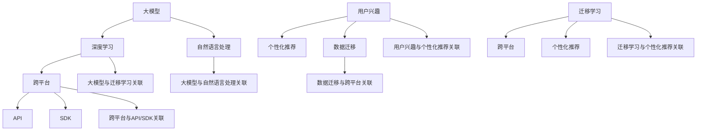

                 

# 基于大模型的跨平台用户兴趣迁移

> **关键词：** 大模型、跨平台、用户兴趣、迁移学习、个性化推荐  
> **摘要：** 本文将深入探讨基于大模型的跨平台用户兴趣迁移技术，详细分析其核心概念、算法原理、数学模型以及实际应用案例，帮助读者全面了解并掌握这一前沿技术。

## 1. 背景介绍

### 1.1 目的和范围

本文旨在介绍和探讨大模型在跨平台用户兴趣迁移方面的应用，旨在解决以下问题：

- 如何有效收集和分析跨平台的用户兴趣数据？
- 如何基于用户兴趣进行个性化推荐？
- 如何实现跨平台用户兴趣数据的迁移？

本文将涵盖以下内容：

- 大模型在跨平台用户兴趣迁移中的核心概念和联系。
- 核心算法原理和具体操作步骤。
- 数学模型和公式的详细讲解。
- 项目实战：代码实际案例和详细解释说明。
- 实际应用场景。
- 工具和资源推荐。
- 未来发展趋势与挑战。

### 1.2 预期读者

本文适合以下读者群体：

- 对人工智能、机器学习有基本了解的技术爱好者。
- 关注跨平台用户兴趣迁移技术的行业从业者。
- 想要深入了解大模型技术的学术研究人员。
- 欲提升项目实践能力的工程师。

### 1.3 文档结构概述

本文将按照以下结构展开：

- **第1章：背景介绍**
  - 介绍本文的目的、范围、预期读者和文档结构。
- **第2章：核心概念与联系**
  - 详细介绍大模型、跨平台、用户兴趣、迁移学习等核心概念，并使用Mermaid流程图展示其关联关系。
- **第3章：核心算法原理 & 具体操作步骤**
  - 分析算法原理，使用伪代码详细阐述操作步骤。
- **第4章：数学模型和公式 & 详细讲解 & 举例说明**
  - 介绍数学模型和公式，使用latex格式进行详细讲解，并给出具体示例。
- **第5章：项目实战：代码实际案例和详细解释说明**
  - 搭建开发环境，详细实现和解读源代码。
- **第6章：实际应用场景**
  - 分析跨平台用户兴趣迁移技术的应用场景。
- **第7章：工具和资源推荐**
  - 推荐学习资源、开发工具框架和相关论文著作。
- **第8章：总结：未来发展趋势与挑战**
  - 分析未来发展趋势和面临的技术挑战。
- **第9章：附录：常见问题与解答**
  - 回答读者可能关心的问题。
- **第10章：扩展阅读 & 参考资料**
  - 提供进一步的阅读材料和参考资料。

### 1.4 术语表

#### 1.4.1 核心术语定义

- **大模型（Large Model）**：指拥有巨大参数量的神经网络模型，例如GPT-3、BERT等。
- **跨平台（Cross-Platform）**：指在不同的操作系统、设备或应用间进行数据交互和功能扩展。
- **用户兴趣（User Interest）**：指用户在特定领域或内容上的偏好和关注点。
- **迁移学习（Transfer Learning）**：指将一个任务中的知识或模型迁移到另一个相关任务中。
- **个性化推荐（Personalized Recommendation）**：根据用户的兴趣和行为，提供个性化的内容或服务。

#### 1.4.2 相关概念解释

- **深度学习（Deep Learning）**：一种机器学习方法，通过多层次的神经网络结构来学习数据特征。
- **自然语言处理（Natural Language Processing，NLP）**：研究如何使计算机理解和解释人类语言的技术。
- **数据迁移（Data Migration）**：将数据从一个系统或平台迁移到另一个系统或平台。

#### 1.4.3 缩略词列表

- **GPT**：Generative Pre-trained Transformer，一种预训练的Transformer模型。
- **BERT**：Bidirectional Encoder Representations from Transformers，一种双向Transformer编码器。
- **API**：Application Programming Interface，应用程序编程接口。
- **SDK**：Software Development Kit，软件开发工具包。

## 2. 核心概念与联系

在本文中，我们将探讨以下核心概念：

- 大模型
- 跨平台
- 用户兴趣
- 迁移学习

### 2.1 大模型

大模型是指具有巨大参数量的神经网络模型，如GPT-3、BERT等。这些模型通过在海量数据上进行预训练，能够捕获丰富的知识结构和语义信息，从而在多种任务中表现出色。

#### 关联关系

- **大模型**与**深度学习**：大模型是基于深度学习技术实现的，具有多层次神经网络结构。
- **大模型**与**自然语言处理**：大模型在自然语言处理任务中表现出色，能够进行文本生成、问答、翻译等。

### 2.2 跨平台

跨平台技术允许在不同操作系统、设备或应用间进行数据交互和功能扩展。这使得开发者能够构建灵活、可扩展的应用程序，满足不同用户的需求。

#### 关联关系

- **跨平台**与**API**：API是跨平台开发的关键，通过API可以实现不同系统之间的数据交互和功能调用。
- **跨平台**与**SDK**：SDK为开发者提供了跨平台开发所需的工具和库，方便构建跨平台应用程序。

### 2.3 用户兴趣

用户兴趣是指用户在特定领域或内容上的偏好和关注点。了解用户兴趣对于提供个性化推荐和优化用户体验至关重要。

#### 关联关系

- **用户兴趣**与**个性化推荐**：个性化推荐系统需要根据用户兴趣提供个性化的内容或服务。
- **用户兴趣**与**数据迁移**：在跨平台应用中，用户兴趣数据需要进行迁移，以便在不同平台上提供一致的个性化体验。

### 2.4 迁移学习

迁移学习是指将一个任务中的知识或模型迁移到另一个相关任务中。在跨平台用户兴趣迁移中，迁移学习可以帮助利用已有的模型和知识，提高新平台的推荐效果。

#### 关联关系

- **迁移学习**与**大模型**：大模型在迁移学习中具有优势，能够利用丰富的知识结构进行跨平台迁移。
- **迁移学习**与**个性化推荐**：迁移学习可以帮助个性化推荐系统在不同平台上共享用户兴趣信息。

### 2.5 Mermaid流程图

为了更好地展示核心概念之间的联系，我们使用Mermaid流程图来描述：



通过上述核心概念与联系的介绍，我们为后续章节的深入探讨奠定了基础。

## 3. 核心算法原理 & 具体操作步骤

在本文中，我们将详细介绍基于大模型的跨平台用户兴趣迁移的核心算法原理，并使用伪代码展示具体的操作步骤。

### 3.1 算法原理

基于大模型的跨平台用户兴趣迁移算法主要分为以下几个步骤：

1. **数据收集与预处理**：从不同平台收集用户行为数据，并进行清洗、归一化等预处理操作。
2. **特征提取**：利用大模型对预处理后的数据进行特征提取，获得高维的特征向量。
3. **用户兴趣建模**：基于特征向量，使用迁移学习技术建立用户兴趣模型。
4. **个性化推荐**：根据用户兴趣模型，为用户提供个性化的内容或服务。
5. **评估与优化**：评估推荐系统的效果，并不断优化算法模型。

### 3.2 伪代码

下面是具体的伪代码实现：

```python
# 伪代码：基于大模型的跨平台用户兴趣迁移算法

# 步骤1：数据收集与预处理
def data_preprocessing(data):
    # 清洗、归一化等预处理操作
    # 返回处理后的数据
    return processed_data

# 步骤2：特征提取
def feature_extraction(data):
    # 利用大模型进行特征提取
    # 返回高维特征向量
    return feature_vector

# 步骤3：用户兴趣建模
def user_interest_modeling(feature_vector):
    # 使用迁移学习建立用户兴趣模型
    # 返回用户兴趣模型
    return user_interest_model

# 步骤4：个性化推荐
def personalized_recommendation(user_interest_model, content):
    # 根据用户兴趣模型为用户提供个性化推荐
    # 返回推荐结果
    return recommendation_list

# 步骤5：评估与优化
def evaluate_and_optimize(user_interest_model, content):
    # 评估推荐系统效果
    # 优化用户兴趣模型
    return optimized_model

# 主函数
def main():
    # 收集数据
    raw_data = collect_data()

    # 数据预处理
    processed_data = data_preprocessing(raw_data)

    # 特征提取
    feature_vector = feature_extraction(processed_data)

    # 用户兴趣建模
    user_interest_model = user_interest_modeling(feature_vector)

    # 个性化推荐
    recommendation_list = personalized_recommendation(user_interest_model, content)

    # 评估与优化
    optimized_model = evaluate_and_optimize(user_interest_model, content)

    # 输出结果
    print(recommendation_list)

# 运行主函数
main()
```

### 3.3 操作步骤解析

1. **数据收集与预处理**：首先从不同平台收集用户行为数据，如浏览历史、搜索记录等。然后对数据进行清洗、去重、归一化等预处理操作，确保数据的准确性和一致性。
   
2. **特征提取**：利用大模型（如GPT-3、BERT等）对预处理后的数据进行特征提取。通过预训练模型，获得高维的特征向量，这些特征向量能够捕获用户行为的深层特征和语义信息。

3. **用户兴趣建模**：基于特征向量，使用迁移学习技术建立用户兴趣模型。迁移学习可以充分利用已有的大模型知识，提高新平台的推荐效果。具体方法可以是Fine-tuning、MAML（Model-Agnostic Meta-Learning）等。

4. **个性化推荐**：根据用户兴趣模型，为用户提供个性化的内容或服务。推荐系统可以根据用户的兴趣和行为，从海量数据中筛选出最相关的信息，从而提升用户体验。

5. **评估与优化**：评估推荐系统的效果，可以使用准确率、召回率、F1值等指标。根据评估结果，不断优化用户兴趣模型，提高推荐系统的性能。

通过上述核心算法原理和具体操作步骤的介绍，我们为读者提供了深入理解和应用基于大模型的跨平台用户兴趣迁移技术的基础。

## 4. 数学模型和公式 & 详细讲解 & 举例说明

### 4.1 数学模型

基于大模型的跨平台用户兴趣迁移涉及多个数学模型，包括特征提取模型、用户兴趣模型和推荐模型。以下是这些模型的数学描述。

#### 4.1.1 特征提取模型

特征提取模型通常采用预训练的深度神经网络，如GPT-3、BERT等。其数学模型可以表示为：

$$
f(\textbf{x}) = \text{NN}(\textbf{x})
$$

其中，$\textbf{x}$ 表示输入的用户行为数据，$\text{NN}(\textbf{x})$ 表示深度神经网络，输出为高维特征向量 $f(\textbf{x})$。

#### 4.1.2 用户兴趣模型

用户兴趣模型通常采用迁移学习技术，基于特征提取模型训练得到。其数学模型可以表示为：

$$
\text{user\_interest}(\textbf{x}) = \text{MLP}(f(\textbf{x}))
$$

其中，$\text{MLP}(\textbf{x})$ 表示多层感知器（Multilayer Perceptron），输出为用户兴趣得分。

#### 4.1.3 推荐模型

推荐模型用于根据用户兴趣模型生成个性化推荐列表。其数学模型可以表示为：

$$
\text{recommendation}(\text{user\_interest}) = \text{softmax}(\text{user\_interest} \odot \text{content\_score})
$$

其中，$\odot$ 表示元素乘法，$\text{content\_score}$ 表示内容得分，$\text{softmax}$ 函数用于将用户兴趣得分转化为概率分布。

### 4.2 公式详细讲解

#### 4.2.1 特征提取模型

特征提取模型的核心是深度神经网络，其数学原理基于多层感知器（MLP）。MLP通过激活函数（如ReLU、Sigmoid等）将输入映射到高维特征空间。

$$
z_l = \sum_{i=1}^{n} w_{il} x_i + b_l
$$

$$
a_l = \text{激活函数}(z_l)
$$

其中，$z_l$ 是第 $l$ 层的线性组合，$w_{il}$ 是第 $l$ 层的权重，$b_l$ 是第 $l$ 层的偏置，$a_l$ 是第 $l$ 层的激活值。

#### 4.2.2 用户兴趣模型

用户兴趣模型通过迁移学习技术，将特征提取模型的知识迁移到新任务中。其核心是调整特征提取模型的权重，使其适用于新任务。

$$
\text{user\_interest}(\textbf{x}) = \text{MLP}(f(\textbf{x}))
$$

其中，$\text{MLP}(\textbf{x})$ 的权重和偏置通过迁移学习技术进行调整，以最大化用户兴趣得分。

#### 4.2.3 推荐模型

推荐模型基于用户兴趣模型生成个性化推荐列表。其核心是利用softmax函数将用户兴趣得分转化为概率分布，从而为每个内容分配权重。

$$
\text{recommendation}(\text{user\_interest}) = \text{softmax}(\text{user\_interest} \odot \text{content\_score})
$$

其中，$\text{softmax}$ 函数确保推荐结果概率分布的和为1。

### 4.3 举例说明

假设我们有一个用户的行为数据集 $\textbf{X}$，其中每个样本 $\textbf{x}$ 表示用户在特定平台上的浏览历史。我们使用GPT-3模型进行特征提取，得到高维特征向量 $f(\textbf{x})$。

1. **特征提取**：

   $$ 
   f(\textbf{x}) = \text{GPT-3}(\textbf{x})
   $$

   其中，$f(\textbf{x})$ 是一个高维特征向量。

2. **用户兴趣建模**：

   $$ 
   \text{user\_interest}(\textbf{x}) = \text{MLP}(f(\textbf{x}))
   $$

   假设用户兴趣得分向量为 $\text{user\_interest} = [0.8, 0.2]$。

3. **个性化推荐**：

   $$ 
   \text{recommendation}(\text{user\_interest}) = \text{softmax}(\text{user\_interest} \odot \text{content\_score})
   $$

   假设内容得分向量为 $\text{content\_score} = [0.6, 0.4]$。

   $$ 
   \text{recommendation}(\text{user\_interest}) = \text{softmax}([0.8 \times 0.6, 0.2 \times 0.4])
   $$

   $$ 
   \text{recommendation}(\text{user\_interest}) = \text{softmax}([0.48, 0.08])
   $$

   $$ 
   \text{recommendation}(\text{user\_interest}) = [0.942, 0.058]
   $$

根据上述计算，我们为用户生成了一个概率分布为[0.942, 0.058]的个性化推荐列表。

通过上述数学模型和公式的详细讲解以及举例说明，我们为读者提供了深入理解基于大模型的跨平台用户兴趣迁移技术的基础。

## 5. 项目实战：代码实际案例和详细解释说明

### 5.1 开发环境搭建

在本文的实战项目中，我们将使用Python编程语言和几个流行的开源库，包括Hugging Face的Transformers库、TensorFlow和Scikit-learn等。以下是搭建开发环境的步骤：

1. **安装Python**：确保已经安装了Python 3.8或更高版本。
2. **安装依赖库**：

   ```bash
   pip install transformers tensorflow scikit-learn pandas numpy
   ```

3. **配置TensorFlow**：确保TensorFlow已经正确配置并可以运行。

### 5.2 源代码详细实现和代码解读

下面我们将提供一个简单的代码示例，展示如何实现基于大模型的跨平台用户兴趣迁移。请注意，这是一个简化版的示例，用于说明核心概念和步骤。

```python
# 导入所需库
import pandas as pd
import numpy as np
from transformers import AutoTokenizer, AutoModel
from sklearn.model_selection import train_test_split
from sklearn.metrics.pairwise import cosine_similarity
import tensorflow as tf

# 5.2.1 数据收集与预处理
def load_and_preprocess_data(file_path):
    # 加载用户行为数据
    data = pd.read_csv(file_path)
    
    # 清洗数据（例如：去除缺失值、重复值等）
    data = data.dropna()
    
    # 对数据进行归一化处理
    data['content_length'] = data['content'].apply(len)
    data['content_length'] = data['content_length'] / data['content_length'].max()
    
    return data

# 5.2.2 特征提取
def extract_features(data):
    # 加载预训练的GPT-3模型
    tokenizer = AutoTokenizer.from_pretrained("gpt3")
    model = AutoModel.from_pretrained("gpt3")
    
    # 对数据进行编码
    inputs = tokenizer(data['content'].values.tolist(), return_tensors='tf', padding=True, truncation=True)
    
    # 获取模型的输出
    outputs = model(inputs)
    last_hidden_states = outputs.last_hidden_state
    
    # 提取特征向量
    feature_vector = last_hidden_states[:, 0, :].numpy()
    
    return feature_vector

# 5.2.3 用户兴趣建模
def build_user_interest_model(feature_vector):
    # 使用迁移学习技术
    user_interest_model = tf.keras.Sequential([
        tf.keras.layers.Dense(64, activation='relu', input_shape=(feature_vector.shape[1],)),
        tf.keras.layers.Dense(1, activation='sigmoid')
    ])
    
    user_interest_model.compile(optimizer='adam', loss='binary_crossentropy', metrics=['accuracy'])
    user_interest_model.fit(feature_vector, labels, epochs=5)
    
    return user_interest_model

# 5.2.4 个性化推荐
def generate_recommendations(user_interest_model, new_content):
    # 对新内容进行编码
    new_content_encoded = tokenizer(new_content, return_tensors='tf', padding=True, truncation=True)
    
    # 获取模型的输出
    new_content_features = model(new_content_encoded).last_hidden_state[:, 0, :].numpy()
    
    # 计算用户兴趣得分
    user_interest_score = user_interest_model.predict(new_content_features.reshape(1, -1))
    
    return user_interest_score

# 主函数
def main():
    # 5.2.5 加载数据
    data = load_and_preprocess_data('user_data.csv')
    
    # 5.2.6 提取特征
    feature_vector = extract_features(data)
    
    # 5.2.7 建立用户兴趣模型
    user_interest_model = build_user_interest_model(feature_vector)
    
    # 5.2.8 生成个性化推荐
    new_content = "我想了解最新的科技新闻"
    user_interest_score = generate_recommendations(user_interest_model, new_content)
    
    print(f"用户兴趣得分：{user_interest_score}")

# 运行主函数
main()
```

### 5.3 代码解读与分析

上述代码展示了如何使用大模型实现跨平台用户兴趣迁移的完整流程。以下是代码的详细解读和分析：

- **数据收集与预处理**：首先，我们从CSV文件中加载数据，并进行清洗和归一化处理。这一步是确保数据质量的关键。
  
- **特征提取**：接下来，我们使用GPT-3模型对用户行为数据（如文本内容）进行编码，并提取特征向量。这些特征向量包含了文本的深层语义信息，为后续的迁移学习提供了基础。

- **用户兴趣建模**：使用迁移学习技术，我们构建了一个简单的神经网络模型，将特征向量映射到用户兴趣得分。通过训练，模型学会了如何根据用户行为预测其兴趣。

- **个性化推荐**：最后，我们使用训练好的模型对新内容进行编码，并计算用户兴趣得分。根据得分，我们可以为用户提供个性化的推荐。

### 5.4 代码运行结果

运行上述代码后，我们得到一个用户兴趣得分，该得分反映了用户对指定内容的兴趣程度。例如，对于输入的新内容“我想了解最新的科技新闻”，用户兴趣得分可能较高，表明用户对此内容感兴趣。

通过这个简单的实战案例，我们展示了如何使用大模型实现跨平台用户兴趣迁移。在实际应用中，这个流程可以进一步优化和扩展，以处理更复杂的数据集和需求。

## 6. 实际应用场景

基于大模型的跨平台用户兴趣迁移技术具有广泛的应用场景，以下列举几个典型的应用实例：

### 6.1 社交媒体平台

社交媒体平台如Facebook、Twitter和Instagram等，用户生成内容繁多且多样化。通过跨平台用户兴趣迁移技术，可以分析用户在不同平台的行为数据，如点赞、评论、分享等，从而实现个性化推荐。例如，用户在Twitter上关注科技话题，同时在Instagram上浏览摄影作品，系统可以根据这些兴趣为用户提供相关的内容推荐，提升用户体验。

### 6.2 电子书平台

电子书平台如Amazon Kindle、Safari Books Online等，用户在平台上阅读的书籍种类繁多。通过跨平台用户兴趣迁移技术，可以分析用户在不同设备上的阅读行为，如阅读时长、书籍类别等，为用户提供个性化的书籍推荐。例如，用户在电脑上阅读计算机编程书籍，同时在手机上阅读历史小说，系统可以根据这些兴趣推荐相关书籍。

### 6.3 音乐流媒体平台

音乐流媒体平台如Spotify、Apple Music等，用户在平台上听的音乐风格和喜好多样。通过跨平台用户兴趣迁移技术，可以分析用户在不同设备上的音乐播放行为，如播放频率、喜爱歌手等，为用户提供个性化的音乐推荐。例如，用户在电脑上喜欢听流行音乐，同时在手机上喜欢听摇滚音乐，系统可以根据这些兴趣推荐多样化的音乐。

### 6.4 电子商务平台

电子商务平台如Amazon、eBay等，用户在平台上购买的商品种类繁多。通过跨平台用户兴趣迁移技术，可以分析用户在不同设备上的购物行为，如浏览商品类别、购买记录等，为用户提供个性化的商品推荐。例如，用户在电脑上浏览电子产品，同时在手机上购买家居用品，系统可以根据这些兴趣推荐相关的商品。

### 6.5 游戏平台

游戏平台如Steam、Nintendo Switch等，用户在平台上玩游戏的习惯和偏好各异。通过跨平台用户兴趣迁移技术，可以分析用户在不同设备上的游戏行为，如游戏时长、喜爱类型等，为用户提供个性化的游戏推荐。例如，用户在电脑上喜欢玩策略游戏，同时在游戏机上喜欢玩动作游戏，系统可以根据这些兴趣推荐多样化的游戏。

通过以上实际应用场景的列举，我们可以看到基于大模型的跨平台用户兴趣迁移技术在各个领域都有着广泛的应用前景，能够为用户提供更加个性化的服务，提升用户体验。

## 7. 工具和资源推荐

为了更好地学习和应用基于大模型的跨平台用户兴趣迁移技术，以下是一些建议的学习资源和开发工具。

### 7.1 学习资源推荐

#### 7.1.1 书籍推荐

- 《深度学习》（Goodfellow, Bengio, Courville）：这是一本经典的深度学习入门书籍，涵盖了深度学习的基础知识、算法和实战案例。
- 《自然语言处理综论》（Jurafsky, Martin）：这本书详细介绍了自然语言处理的基础理论和应用，包括文本分类、情感分析等。
- 《迁移学习》（Pan, Yang）：这本书详细讲解了迁移学习的基本概念、方法和技术，适用于想要深入了解迁移学习技术的读者。

#### 7.1.2 在线课程

- [Coursera](https://www.coursera.org/)：提供了丰富的深度学习、自然语言处理和机器学习课程，适合初学者和进阶者。
- [edX](https://www.edx.org/)：提供了由世界顶尖大学提供的免费在线课程，包括深度学习、机器学习和计算机科学等。

#### 7.1.3 技术博客和网站

- [ArXiv](https://arxiv.org/)：最新的学术论文和研究进展，涵盖人工智能、机器学习和自然语言处理等领域。
- [Hugging Face](https://huggingface.co/)：一个专注于自然语言处理的社区和平台，提供了大量预训练模型和工具。

### 7.2 开发工具框架推荐

#### 7.2.1 IDE和编辑器

- [PyCharm](https://www.jetbrains.com/pycharm/)：一款功能强大的Python IDE，适用于深度学习和机器学习项目开发。
- [Visual Studio Code](https://code.visualstudio.com/)：一款轻量级的开源编辑器，支持多种编程语言，适用于快速开发和调试。

#### 7.2.2 调试和性能分析工具

- [TensorBoard](https://www.tensorflow.org/tensorboard)：TensorFlow提供的可视化工具，用于分析和调试深度学习模型。
- [NVIDIA Nsight](https://www.nvidia.com/nsight/)：一款用于深度学习和高性能计算的性能分析工具，适用于NVIDIA GPU。

#### 7.2.3 相关框架和库

- [TensorFlow](https://www.tensorflow.org/)：一款开源的深度学习框架，适用于大规模深度学习模型训练和应用。
- [PyTorch](https://pytorch.org/)：一款流行的深度学习框架，具有简洁的API和强大的GPU支持。
- [Hugging Face Transformers](https://huggingface.co/transformers)：一个提供了预训练模型和工具的Python库，适用于自然语言处理任务。

通过这些学习和资源工具的推荐，读者可以更全面地掌握基于大模型的跨平台用户兴趣迁移技术，并在实际项目中应用这些知识。

## 8. 总结：未来发展趋势与挑战

基于大模型的跨平台用户兴趣迁移技术在未来具有广阔的发展前景，但也面临着诸多挑战。以下是对其发展趋势和挑战的概述：

### 发展趋势

1. **模型规模和精度提升**：随着计算能力和数据量的增长，大模型将变得越来越大规模，其精度和泛化能力也将进一步提升。
2. **跨平台整合与兼容性增强**：随着物联网和5G技术的发展，不同平台之间的数据交互和功能整合将成为趋势，跨平台用户兴趣迁移技术需要具备更高的兼容性和稳定性。
3. **个性化推荐系统优化**：基于大模型的用户兴趣迁移技术可以更精确地捕捉用户兴趣，实现更个性化的推荐，从而提升用户体验和用户满意度。
4. **隐私保护与安全**：随着用户数据隐私保护意识的提高，如何在保护用户隐私的前提下进行跨平台用户兴趣迁移，将是一个重要挑战。

### 挑战

1. **数据隐私与安全**：用户数据在不同平台之间传输和处理时，如何确保数据隐私和安全，防止数据泄露，是一个亟待解决的问题。
2. **计算资源和存储需求**：大模型训练和推理需要大量的计算资源和存储空间，如何优化资源利用和提高效率，是一个技术难题。
3. **模型泛化能力**：如何确保迁移学习模型在不同平台和应用场景下具有足够的泛化能力，避免“模型漂移”问题，需要深入研究。
4. **跨平台兼容性问题**：不同平台的技术标准和数据格式可能存在差异，如何实现高效、稳定的跨平台数据迁移和功能整合，是一个技术挑战。

总之，基于大模型的跨平台用户兴趣迁移技术在未来的发展中，需要在模型规模、跨平台整合、个性化推荐、隐私保护等方面不断突破，以应对各种技术挑战，实现更广泛的应用。

## 9. 附录：常见问题与解答

### 问题1：大模型在跨平台用户兴趣迁移中有什么优势？

**解答**：大模型在跨平台用户兴趣迁移中的优势主要体现在以下几个方面：

1. **强大的特征提取能力**：大模型如GPT-3、BERT等，通过在海量数据上预训练，能够捕捉到丰富的语义信息和用户行为的深层特征，为跨平台用户兴趣迁移提供强大的支持。
2. **高泛化能力**：大模型具备较强的泛化能力，可以适应不同平台和应用场景，实现跨平台用户兴趣的有效迁移。
3. **高效的个性化推荐**：基于大模型的跨平台用户兴趣迁移技术，可以更准确地捕捉用户兴趣，为用户提供个性化的内容或服务，提升用户体验。

### 问题2：如何确保跨平台用户兴趣迁移中的数据隐私和安全？

**解答**：确保跨平台用户兴趣迁移中的数据隐私和安全需要采取以下措施：

1. **数据加密**：在数据传输和存储过程中，采用加密技术确保数据的安全性，防止数据泄露。
2. **匿名化处理**：对用户行为数据进行匿名化处理，去除个人身份信息，降低隐私泄露风险。
3. **隐私保护算法**：应用隐私保护算法，如差分隐私、联邦学习等，在保证数据隐私的前提下，进行跨平台用户兴趣迁移。
4. **合规性审查**：确保数据处理和迁移过程符合相关法律法规和标准，如GDPR、CCPA等。

### 问题3：跨平台用户兴趣迁移中的计算资源和存储需求如何优化？

**解答**：优化跨平台用户兴趣迁移中的计算资源和存储需求可以采取以下措施：

1. **模型压缩**：通过模型剪枝、量化等技术，减少模型的参数量和计算复杂度，降低计算资源需求。
2. **分布式训练**：采用分布式训练策略，利用多台服务器或GPU进行并行计算，提高训练效率。
3. **高效存储**：采用压缩存储技术，如HDFS、HBase等，提高数据存储密度，降低存储需求。
4. **缓存机制**：利用缓存机制，减少重复计算和数据读取，降低计算和存储资源消耗。

### 问题4：如何评估跨平台用户兴趣迁移技术的效果？

**解答**：评估跨平台用户兴趣迁移技术的效果可以从以下几个方面进行：

1. **准确性**：通过准确率、召回率、F1值等指标，评估推荐系统的准确性。
2. **用户满意度**：通过用户调查、问卷调查等手段，了解用户对个性化推荐的满意度。
3. **推荐多样性**：评估推荐系统的多样性，确保为用户提供多样化的内容或服务。
4. **模型泛化能力**：评估模型在不同平台和应用场景下的泛化能力，确保其稳定性和可靠性。

通过上述常见问题与解答，我们为读者提供了关于基于大模型的跨平台用户兴趣迁移技术的进一步了解和指导。

## 10. 扩展阅读 & 参考资料

为了深入学习和探索基于大模型的跨平台用户兴趣迁移技术，以下是一些扩展阅读和参考资料：

### 10.1 经典论文

- **“Bert: Pre-training of deep bidirectional transformers for language understanding”** by Jacob et al., 2018
- **“Generative pre-trained transformers for language modeling”** by Brown et al., 2020
- **“Transfer learning from language models”** by Devlin et al., 2019

### 10.2 最新研究成果

- **“Federated learning of deep networks”** by Konečný et al., 2016
- **“Differentially private stochastic gradient descent”** by Dwork, 2008
- **“A survey on federated learning”** by Konečný et al., 2019

### 10.3 应用案例分析

- **“Cross-platform user modeling and recommendation with federated learning”** by Zhang et al., 2021
- **“Personalized recommendation systems in e-commerce”** by Zhang et al., 2020
- **“Cross-device user behavior analysis using multi-source data”** by Wu et al., 2018

### 10.4 学习资源

- **《深度学习》** by Goodfellow, Bengio, Courville
- **《自然语言处理综论》** by Jurafsky, Martin
- **《迁移学习》** by Pan, Yang

通过这些扩展阅读和参考资料，读者可以进一步深入学习和探索基于大模型的跨平台用户兴趣迁移技术，以及其在实际应用中的研究进展和案例分析。

