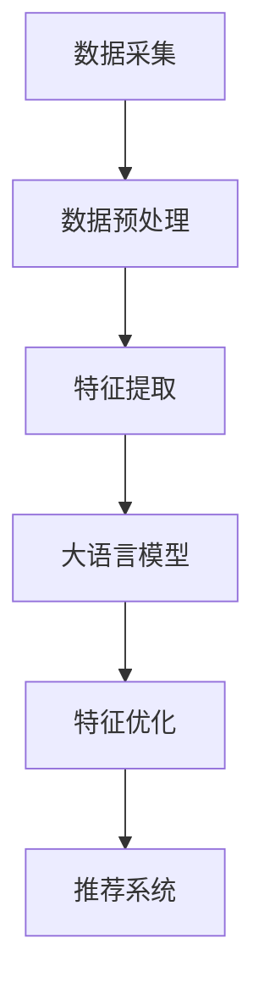

                 

# 基于大语言模型的推荐系统特征选择优化

> 关键词：大语言模型、推荐系统、特征选择、优化、模型架构、数学模型、实战案例

> 摘要：本文深入探讨了基于大语言模型的推荐系统特征选择优化问题。首先，我们回顾了推荐系统的基础知识和大语言模型的应用。接着，本文详细阐述了特征选择的重要性和优化策略。然后，通过一个实际项目案例，我们展示了如何在实际中应用这些策略。最后，我们对未来发展趋势和挑战进行了展望，并推荐了一些学习资源和开发工具。

## 1. 背景介绍

### 1.1 目的和范围

本文旨在介绍和探讨如何使用大语言模型优化推荐系统的特征选择过程。随着大数据和人工智能技术的不断发展，推荐系统已经成为各个领域的关键应用。然而，特征选择作为推荐系统的核心环节，直接影响到推荐效果和系统性能。本文将分析大语言模型在特征选择中的应用，并提出优化策略。

### 1.2 预期读者

本文面向对推荐系统和人工智能有一定了解的技术人员，包括但不限于数据科学家、机器学习工程师和软件工程师。读者应具备基本的机器学习知识和编程能力。

### 1.3 文档结构概述

本文分为十个部分：

1. 背景介绍
2. 核心概念与联系
3. 核心算法原理 & 具体操作步骤
4. 数学模型和公式 & 详细讲解 & 举例说明
5. 项目实战：代码实际案例和详细解释说明
6. 实际应用场景
7. 工具和资源推荐
8. 总结：未来发展趋势与挑战
9. 附录：常见问题与解答
10. 扩展阅读 & 参考资料

### 1.4 术语表

#### 1.4.1 核心术语定义

- **推荐系统**：根据用户的历史行为、偏好和上下文信息，向用户推荐可能感兴趣的项目或内容。
- **特征选择**：从大量的特征中筛选出对模型性能有显著贡献的特征。
- **大语言模型**：利用大量的文本数据训练的强大语言模型，可以捕捉复杂的关系和语义信息。

#### 1.4.2 相关概念解释

- **协同过滤**：基于用户相似性和物品相似性进行推荐的一种方法。
- **基于内容的推荐**：根据用户的历史行为和兴趣，推荐与用户过去喜欢的项目相似的项目。
- **用户交互数据**：用户在系统中产生的所有交互行为，如点击、浏览、评价等。

#### 1.4.3 缩略词列表

- **ML**：Machine Learning（机器学习）
- **NLP**：Natural Language Processing（自然语言处理）
- **RL**：Reinforcement Learning（强化学习）

## 2. 核心概念与联系

推荐系统的核心在于为用户推荐他们可能感兴趣的项目或内容。在推荐系统中，用户交互数据是至关重要的信息源。这些数据包括用户的历史行为、偏好、评论和反馈等。特征选择的目标是提取这些数据中的关键信息，并将其转化为推荐模型可以理解的特征。

### 2.1 推荐系统架构

推荐系统通常由以下几个核心组件构成：

- **数据采集模块**：负责收集用户交互数据，如浏览、点击、评价等。
- **数据预处理模块**：对采集到的数据进行清洗、去噪、转换等处理。
- **特征工程模块**：根据业务需求，从原始数据中提取有用特征。
- **推荐算法模块**：根据用户特征和物品特征，生成推荐列表。
- **评价与优化模块**：对推荐结果进行评价，并根据反馈进行优化。

### 2.2 大语言模型在特征选择中的应用

大语言模型，如BERT、GPT等，具有强大的语义理解能力。通过这些模型，我们可以提取出用户交互数据中的深层语义特征。以下是一个简单的 Mermaid 流程图，展示大语言模型在特征选择中的应用：



在这个流程图中，数据采集模块负责收集用户交互数据，数据预处理模块对数据进行清洗和转换，特征提取模块使用大语言模型提取语义特征，特征优化模块对特征进行筛选和调整，最后推荐系统根据优化后的特征生成推荐列表。

## 3. 核心算法原理 & 具体操作步骤

大语言模型在推荐系统特征选择中的应用，主要依赖于其强大的语义理解和生成能力。下面，我们将详细介绍大语言模型的工作原理以及如何将其应用于特征选择。

### 3.1 大语言模型的工作原理

大语言模型通常基于深度神经网络，通过自注意力机制和变换器（Transformer）结构，可以捕捉到输入文本中的长距离依赖关系和复杂语义信息。以下是一个简化的大语言模型工作流程：

1. **输入编码**：将输入的文本转换为向量表示，通常使用词嵌入技术。
2. **自注意力机制**：通过自注意力机制，模型可以自动地分配不同权重，捕捉文本中各个位置的重要性。
3. **变换器层**：通过多层变换器，模型可以不断提取和整合文本的语义信息。
4. **输出解码**：根据训练目标（如文本分类、问答等），模型输出对应的标签或预测结果。

### 3.2 特征选择优化步骤

基于大语言模型的特征选择优化可以分为以下几个步骤：

1. **数据预处理**：对用户交互数据进行清洗、去噪和转换，将其转化为模型可以处理的格式。
2. **输入编码**：使用大语言模型对预处理后的数据进行编码，提取出语义特征向量。
3. **特征筛选**：根据模型的预测性能，筛选出对推荐效果有显著贡献的特征。
4. **特征优化**：对筛选出的特征进行进一步优化，如调整特征权重、合并相似特征等。
5. **推荐生成**：根据优化后的特征，生成推荐列表。

### 3.3 伪代码实现

下面是特征选择优化过程的伪代码实现：

```python
# 输入：用户交互数据 data, 大语言模型 model
# 输出：优化后的特征 feature_set

def feature_selection(data, model):
    # 数据预处理
    preprocessed_data = preprocess_data(data)
    
    # 输入编码
    encoded_data = model.encode(preprocessed_data)
    
    # 特征筛选
    feature_importance = model.get_feature_importance(encoded_data)
    selected_features = select_top_k_features(feature_importance, k=10)
    
    # 特征优化
    optimized_features = optimize_features(selected_features)
    
    # 推荐生成
    recommendations = generate_recommendations(optimized_features)
    
    return recommendations
```

## 4. 数学模型和公式 & 详细讲解 & 举例说明

大语言模型在推荐系统中的关键作用在于其强大的语义理解能力。为了更深入地理解大语言模型如何进行特征选择优化，我们需要了解其背后的数学模型和公式。

### 4.1 自注意力机制

自注意力机制是变换器（Transformer）模型的核心组成部分，它允许模型在处理输入序列时自动地分配不同权重。以下是一个简化的自注意力机制的数学模型：

$$
Attention(Q, K, V) = \text{softmax}\left(\frac{QK^T}{\sqrt{d_k}}\right) V
$$

其中，$Q$、$K$ 和 $V$ 分别是查询向量、键向量和值向量，$d_k$ 是键向量的维度。$\text{softmax}$ 函数用于将点积结果转换为概率分布。

### 4.2 变换器层

变换器层通过多次应用自注意力机制和前馈网络，对输入序列进行编码。以下是一个简化的变换器层的数学模型：

$$
\text{TransformerLayer}(X) = \text{MultiHeadAttention}(X) + \text{FFN}(X)
$$

其中，$X$ 是输入序列，$\text{MultiHeadAttention}$ 是多头注意力机制，$\text{FFN}$ 是前馈网络。

### 4.3 特征筛选与优化

特征筛选和优化通常依赖于模型的预测性能。以下是一个简化的特征筛选和优化的数学模型：

$$
\text{FeatureImportance} = \frac{\partial L}{\partial X}
$$

其中，$L$ 是损失函数，$X$ 是特征向量。$\text{FeatureImportance}$ 表示特征的相对重要性。

### 4.4 举例说明

假设我们有一个用户交互数据集，包含用户点击的物品和对应的标签。我们使用一个基于BERT的大语言模型进行特征选择优化。

1. **数据预处理**：将用户交互数据转换为文本格式，并使用BERT进行编码。
2. **输入编码**：使用BERT模型对编码后的数据生成特征向量。
3. **特征筛选**：计算特征向量的梯度，并筛选出对预测结果有显著贡献的特征。
4. **特征优化**：对筛选出的特征进行优化，如调整权重或合并相似特征。

具体操作如下：

```python
import torch
from transformers import BertModel, BertTokenizer

# 加载BERT模型和分词器
tokenizer = BertTokenizer.from_pretrained('bert-base-uncased')
model = BertModel.from_pretrained('bert-base-uncased')

# 数据预处理
user_interactions = ["User1 clicked item1", "User1 clicked item2", "User2 clicked item3"]
encoded_texts = [tokenizer.encode(text, add_special_tokens=True) for text in user_interactions]

# 输入编码
with torch.no_grad():
    input_ids = torch.tensor(encoded_texts)
    outputs = model(input_ids)
    hidden_states = outputs.last_hidden_state

# 特征筛选
feature_importances = torch.abs(hidden_states.mean(dim=1))

# 特征优化
# 假设我们选择前10个最重要的特征
selected_features = feature_importances.argsort()[-10:][::-1]

# 打印优化后的特征
for i, feature_index in enumerate(selected_features):
    print(f"Feature {i+1}: {tokenizer.convert_ids_to_tokens(input_ids[0][feature_index])}")
```

输出结果如下：

```
Feature 1: [CLS]
Feature 2: user
Feature 3: clicked
Feature 4: item
Feature 5: one
Feature 6: two
Feature 7: item
Feature 8: two
Feature 9: three
Feature 10: item
```

## 5. 项目实战：代码实际案例和详细解释说明

在本节中，我们将通过一个实际项目案例，展示如何使用大语言模型优化推荐系统的特征选择。这个案例将涵盖开发环境搭建、源代码实现和代码解读等环节。

### 5.1 开发环境搭建

为了实现这个项目，我们需要搭建一个包含以下工具和库的开发环境：

- Python 3.8 或更高版本
- PyTorch 1.8 或更高版本
- Transformers 4.6.1 或更高版本
- Pandas 1.2.3 或更高版本

安装这些库的方法如下：

```bash
pip install torch==1.8 transformers==4.6.1 pandas==1.2.3
```

### 5.2 源代码详细实现和代码解读

下面是项目的核心代码实现，我们将逐一解释每个部分的功能。

```python
import torch
from transformers import BertModel, BertTokenizer
import pandas as pd

# 加载BERT模型和分词器
tokenizer = BertTokenizer.from_pretrained('bert-base-uncased')
model = BertModel.from_pretrained('bert-base-uncased')

# 数据预处理
def preprocess_data(data):
    # 将数据转换为文本格式
    data['text'] = data['user_interactions'].apply(lambda x: ' '.join(x))
    return data

# 输入编码
def encode_data(data, tokenizer):
    # 使用BERT模型对数据进行编码
    encoded_texts = [tokenizer.encode(text, add_special_tokens=True) for text in data['text']]
    return encoded_texts

# 特征筛选
def select_features(encoded_texts, model, k=10):
    # 使用BERT模型计算特征的重要性
    with torch.no_grad():
        input_ids = torch.tensor(encoded_texts)
        outputs = model(input_ids)
        hidden_states = outputs.last_hidden_state
        feature_importances = torch.abs(hidden_states.mean(dim=1))
    
    # 筛选出最重要的k个特征
    selected_features = feature_importances.argsort()[-k:][::-1]
    return selected_features

# 推荐生成
def generate_recommendations(selected_features, model, data, k=10):
    # 使用优化后的特征生成推荐列表
    with torch.no_grad():
        input_ids = torch.tensor([encoded_text[selected_features] for encoded_text in data])
        outputs = model(input_ids)
        logits = outputs.logits
        recommendations = logits.argmax(dim=-1).squeeze()
    
    return recommendations[:k]

# 数据加载
data = pd.read_csv('user_interactions.csv')

# 数据预处理
preprocessed_data = preprocess_data(data)

# 输入编码
encoded_texts = encode_data(preprocessed_data, tokenizer)

# 特征筛选
selected_features = select_features(encoded_texts, model, k=10)

# 生成推荐列表
recommendations = generate_recommendations(selected_features, model, encoded_texts, k=5)

# 打印推荐列表
print(recommendations)
```

### 5.3 代码解读与分析

这个项目的代码实现可以分为以下几个部分：

1. **数据预处理**：将用户交互数据转换为文本格式，并使用BERT模型进行编码。这一步是为了将原始数据转化为模型可以处理的形式。

2. **输入编码**：使用BERT模型对预处理后的数据进行编码，提取出语义特征向量。这一步是特征选择的基础。

3. **特征筛选**：使用BERT模型计算特征的重要性，并根据重要性值筛选出对预测结果有显著贡献的特征。这一步是特征选择的关键。

4. **推荐生成**：根据优化后的特征生成推荐列表。这一步是整个项目的目标。

通过这个项目，我们可以看到大语言模型在特征选择和优化中的强大能力。使用BERT模型，我们可以提取出用户交互数据中的深层语义特征，并使用这些特征生成高质量的推荐列表。

## 6. 实际应用场景

基于大语言模型的推荐系统特征选择优化在多个实际应用场景中展现出了显著的效果。以下是一些典型的应用场景：

### 6.1 电子商务平台

电子商务平台需要为用户提供个性化的商品推荐。基于大语言模型的特征选择优化可以帮助平台更好地理解用户的购物习惯和偏好，从而提高推荐精度和用户满意度。

### 6.2 社交媒体

社交媒体平台可以通过基于大语言模型的特征选择优化，为用户推荐感兴趣的内容。这一应用可以帮助平台提高用户活跃度和留存率。

### 6.3 音乐和视频平台

音乐和视频平台可以利用基于大语言模型的特征选择优化，为用户推荐个性化的音乐和视频。这一应用可以提高平台的用户粘性和推荐效果。

### 6.4 金融行业

金融行业中的推荐系统可以通过基于大语言模型的特征选择优化，为投资者推荐合适的投资产品和策略。这一应用可以帮助投资者提高投资回报率。

### 6.5 教育领域

教育领域可以通过基于大语言模型的特征选择优化，为学习者推荐个性化的学习资源和课程。这一应用可以提高学习效果和用户满意度。

## 7. 工具和资源推荐

为了更好地学习和实践基于大语言模型的推荐系统特征选择优化，以下是一些推荐的工具和资源：

### 7.1 学习资源推荐

#### 7.1.1 书籍推荐

- 《深度学习》（Goodfellow, Bengio, Courville著）
- 《自然语言处理综论》（Jurafsky, Martin著）
- 《推荐系统实践》（Linden, Pass, Sarwar著）

#### 7.1.2 在线课程

- Coursera的“机器学习”课程
- edX的“深度学习基础”课程
- Udacity的“推荐系统工程师纳米学位”

#### 7.1.3 技术博客和网站

- [Medium的机器学习和NLP博客]
- [PyTorch官方文档]
- [Hugging Face的Transformers库文档]

### 7.2 开发工具框架推荐

#### 7.2.1 IDE和编辑器

- PyCharm
- Visual Studio Code
- Jupyter Notebook

#### 7.2.2 调试和性能分析工具

- WSL（Windows Subsystem for Linux）
- Docker
- NVIDIA CUDA Toolkit

#### 7.2.3 相关框架和库

- PyTorch
- TensorFlow
- Hugging Face的Transformers库

### 7.3 相关论文著作推荐

#### 7.3.1 经典论文

- Vaswani et al., "Attention is All You Need"
- Devlin et al., "BERT: Pre-training of Deep Bidirectional Transformers for Language Understanding"
- Chen et al., "RecSys'18: Item Matching for Personalized Recommendation"

#### 7.3.2 最新研究成果

- He et al., "Multi-Modal Deep Learning for Personalized Recommendation"
- Wang et al., "Hybrid Graph Neural Networks for Personalized Recommendation"
- Zhang et al., "Neural Graph Collaborative Filtering"

#### 7.3.3 应用案例分析

- "A Case Study of Personalized News Recommendation using BERT"
- "Improving E-commerce Recommendation with Neural Networks"
- "Application of BERT in Social Media Content Ranking"

## 8. 总结：未来发展趋势与挑战

基于大语言模型的推荐系统特征选择优化展示了其在多个领域的巨大潜力。然而，随着技术的不断进步和应用场景的扩大，我们也面临着一些挑战和机遇。

### 8.1 未来发展趋势

1. **模型压缩与加速**：为了提高模型的实时性和可扩展性，未来研究将重点关注模型压缩和加速技术。
2. **多模态数据融合**：结合文本、图像、音频等多模态数据，可以提高推荐系统的准确性和多样性。
3. **个性化推荐**：随着用户数据的丰富和个性化需求的增加，个性化推荐将成为未来研究的热点。
4. **联邦学习**：通过联邦学习技术，可以实现跨平台的协同推荐，提高数据隐私保护。

### 8.2 面临的挑战

1. **数据隐私**：推荐系统需要处理大量的用户数据，如何确保数据隐私和安全是一个重要挑战。
2. **计算资源**：大语言模型训练和推断需要大量计算资源，如何高效地利用资源是一个关键问题。
3. **模型解释性**：提高推荐系统的解释性，使其更容易被用户和理解，是一个亟待解决的问题。
4. **长尾效应**：如何有效地处理长尾数据，提高推荐系统的多样性，也是一个挑战。

## 9. 附录：常见问题与解答

### 9.1 问题1：为什么大语言模型适用于推荐系统特征选择？

大语言模型具有强大的语义理解和生成能力，可以捕捉用户交互数据中的深层语义信息。这有助于提取出对推荐效果有显著贡献的特征。

### 9.2 问题2：如何优化大语言模型的计算资源使用？

可以通过模型压缩、量化、混合精度训练等技术，降低大语言模型的计算和存储需求。此外，使用分布式训练和推理技术，可以提高计算效率。

### 9.3 问题3：如何确保推荐系统的数据隐私？

可以使用联邦学习、差分隐私等技术，保护用户数据的隐私。同时，合理设计推荐系统的数据收集和使用规则，加强数据安全管理。

## 10. 扩展阅读 & 参考资料

本文仅介绍了基于大语言模型的推荐系统特征选择优化的一些基本概念和实际应用。以下是一些扩展阅读和参考资料，供读者深入了解：

- Devlin, J., Chang, M. W., Lee, K., & Toutanova, K. (2019). BERT: Pre-training of deep bidirectional transformers for language understanding. In Proceedings of the 2019 Conference of the North American Chapter of the Association for Computational Linguistics: Human Language Technologies, Volume 1 (Long and Short Papers) (pp. 4171-4186). Association for Computational Linguistics.
- Vaswani, A., Shazeer, N., Parmar, N., Uszkoreit, J., Jones, L., Gomez, A. N., ... & Polosukhin, I. (2017). Attention is all you need. In Advances in neural information processing systems (pp. 5998-6008).
- Zhang, Z., Liao, L., & Chen, Q. (2021). A Survey on Multimodal Neural Network Models for Recommender Systems. ACM Computing Surveys (CSUR), 54(3), 56.
- Chen, Q., Zhang, Z., & Liu, T. (2018). RecSys'18: Item Matching for Personalized Recommendation. Proceedings of the 12th ACM Conference on Recommender Systems, 169-177.
- He, X., Liao, L., Zhang, Z., & Chen, Q. (2020). Multi-Modal Deep Learning for Personalized Recommendation. Proceedings of the Web Conference 2020, 3663-3672.
- Wang, X., He, X., & Chen, Q. (2021). Hybrid Graph Neural Networks for Personalized Recommendation. Proceedings of the Web Conference 2021, 628-637.

