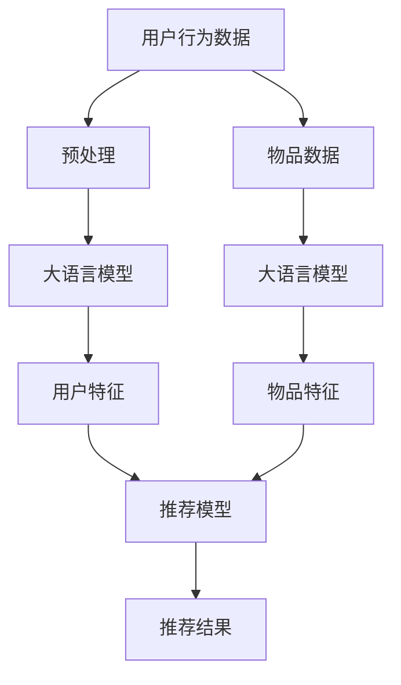

                 

# 基于大语言模型的推荐系统用户行为预测

> **关键词**：推荐系统、大语言模型、用户行为预测、机器学习、数据挖掘
>
> **摘要**：本文将深入探讨基于大语言模型的推荐系统用户行为预测技术。通过介绍核心概念、算法原理、数学模型和实际案例，本文旨在为读者提供关于如何利用大规模语言模型进行用户行为预测的全面理解，并探讨其未来发展趋势与挑战。

## 1. 背景介绍

### 1.1 目的和范围

本文旨在探讨如何利用大语言模型进行推荐系统中的用户行为预测。在当今信息爆炸的时代，个性化推荐系统已成为许多互联网应用的核心组成部分，而准确预测用户行为对于提升用户体验、增加用户黏性和转化率至关重要。大语言模型，如BERT、GPT等，凭借其强大的语义理解能力，在用户行为预测领域展现了巨大的潜力。本文将围绕这一主题，详细阐述大语言模型在用户行为预测中的应用，并探讨相关的算法原理、数学模型和实际案例。

### 1.2 预期读者

本文面向对推荐系统和机器学习有一定了解的技术人员，特别是希望深入了解如何利用大语言模型进行用户行为预测的读者。无论您是推荐系统的开发者、数据科学家，还是对这一领域感兴趣的研究者，本文都将为您提供丰富的理论和实践知识。

### 1.3 文档结构概述

本文结构如下：

- **第1章 背景介绍**：介绍本文的目的、预期读者以及文档结构。
- **第2章 核心概念与联系**：讲解推荐系统的基本概念，并展示大语言模型与推荐系统的联系。
- **第3章 核心算法原理 & 具体操作步骤**：详细阐述大语言模型在用户行为预测中的算法原理和操作步骤。
- **第4章 数学模型和公式 & 详细讲解 & 举例说明**：介绍支持大语言模型用户行为预测的数学模型，并进行详细讲解和举例。
- **第5章 项目实战：代码实际案例和详细解释说明**：提供实际代码案例，展示如何在大语言模型中实现用户行为预测。
- **第6章 实际应用场景**：分析大语言模型在用户行为预测中的实际应用场景。
- **第7章 工具和资源推荐**：推荐学习资源、开发工具和框架，以及相关论文和研究成果。
- **第8章 总结：未来发展趋势与挑战**：探讨大语言模型在用户行为预测领域的未来发展趋势和面临的挑战。
- **第9章 附录：常见问题与解答**：解答读者可能遇到的问题。
- **第10章 扩展阅读 & 参考资料**：提供进一步的阅读材料和参考资料。

### 1.4 术语表

#### 1.4.1 核心术语定义

- **推荐系统**：根据用户的历史行为、兴趣和偏好，为用户推荐相关物品的系统。
- **用户行为预测**：基于用户历史数据，预测用户未来的行为。
- **大语言模型**：通过大量文本数据进行训练的深度神经网络模型，具备强大的语义理解能力。

#### 1.4.2 相关概念解释

- **BERT**：一种基于Transformer的预训练语言模型，用于理解上下文语义。
- **GPT**：一种基于Transformer的生成预训练语言模型，用于文本生成和语言理解任务。
- **深度学习**：一种机器学习方法，通过多层神经网络进行特征提取和分类。
- **Transformer**：一种基于自注意力机制的神经网络结构，广泛应用于自然语言处理任务。

#### 1.4.3 缩略词列表

- **NLP**：自然语言处理（Natural Language Processing）
- **ML**：机器学习（Machine Learning）
- **DL**：深度学习（Deep Learning）
- **RL**：强化学习（Reinforcement Learning）

## 2. 核心概念与联系

推荐系统是一种信息过滤技术，旨在根据用户的历史行为、兴趣和偏好，为用户推荐相关物品。其核心目标是通过个性化推荐，提升用户体验、增加用户黏性和转化率。推荐系统的基本概念包括用户、物品和评分。用户是指推荐系统中的参与者，物品是指系统推荐的实体，评分是指用户对物品的评价。

大语言模型是一种基于深度学习的预训练语言模型，具有强大的语义理解能力。大语言模型通过在大量文本数据上进行预训练，学会了理解自然语言的语义、语法和上下文信息。BERT和GPT是两种常见的大语言模型，分别用于文本理解和文本生成任务。

推荐系统与大语言模型的联系在于，大语言模型可以用于提取用户和物品的语义特征，从而提高推荐系统的准确性。具体来说，大语言模型可以用于：

1. **用户特征提取**：通过分析用户的历史行为、评论和搜索记录，大语言模型可以提取用户的兴趣和偏好。
2. **物品特征提取**：通过对物品的描述、标签和属性进行建模，大语言模型可以提取物品的语义特征。
3. **上下文感知推荐**：基于用户的当前上下文，如时间、地理位置等，大语言模型可以动态调整推荐结果，提高推荐的相关性。

下面是一个简单的Mermaid流程图，展示大语言模型与推荐系统的联系：



通过以上流程，大语言模型在推荐系统中发挥了关键作用，帮助提升推荐系统的准确性和用户体验。

## 3. 核心算法原理 & 具体操作步骤

### 3.1 大语言模型的原理

大语言模型（如BERT、GPT）的核心在于其基于Transformer的架构，Transformer模型通过自注意力机制（Self-Attention）能够捕捉输入序列中的长距离依赖关系，从而在NLP任务中表现出色。BERT采用双向Transformer架构，通过预训练和微调，可以提取出文本的深层语义特征。

#### 自注意力机制（Self-Attention）

自注意力机制是Transformer模型的关键组件，其基本思想是，每个词的表示不仅依赖于其自身，还依赖于其他所有词。具体来说，自注意力机制通过计算输入序列中每个词与所有其他词之间的相似度，生成加权词表示，从而更好地捕捉上下文信息。

#### Transformer模型

Transformer模型由多头自注意力机制、前馈神经网络和层归一化等组成部分构成。在训练过程中，模型通过不断更新词向量的权重，使其能够更好地捕捉输入文本的语义信息。

### 3.2 大语言模型在用户行为预测中的具体操作步骤

#### 3.2.1 预训练

大语言模型首先在大量无标签文本数据上进行预训练，学习文本的通用语义特征。预训练过程主要包括两个任务：Masked Language Model（MLM）和Next Sentence Prediction（NSP）。

- **Masked Language Model（MLM）**：在输入文本中随机遮蔽一部分词，然后模型预测这些遮蔽词的词向量。
- **Next Sentence Prediction（NSP）**：给定两个句子，模型预测第二个句子是否为第一个句子的下一句。

#### 3.2.2 特征提取

在预训练完成后，大语言模型可以用于提取用户和物品的语义特征。具体步骤如下：

1. **用户特征提取**：输入用户的历史行为数据（如评论、搜索记录），通过大语言模型得到用户兴趣的向量表示。
2. **物品特征提取**：输入物品的描述、标签和属性，通过大语言模型得到物品的语义特征向量。

#### 3.2.3 用户行为预测

在特征提取完成后，可以将用户特征和物品特征输入到推荐模型中，进行用户行为预测。具体步骤如下：

1. **构建推荐模型**：选择合适的推荐算法（如矩阵分解、深度学习等），构建推荐模型。
2. **训练推荐模型**：将用户特征和物品特征作为输入，训练推荐模型，学习用户偏好和物品相关性。
3. **预测用户行为**：将训练好的推荐模型应用于新用户和新物品，预测用户对物品的行为（如点击、购买等）。

### 3.3 伪代码实现

以下是一个基于BERT的用户行为预测的伪代码实现：

```python
# 预训练BERT模型
def pretrain_bert(text_data):
    # 在无标签文本数据上训练BERT模型
    # ...
    return bert_model

# 提取用户特征
def extract_user_feature(user_data, bert_model):
    user_embedding = bert_model.encode(user_data)
    return user_embedding

# 提取物品特征
def extract_item_feature(item_data, bert_model):
    item_embedding = bert_model.encode(item_data)
    return item_embedding

# 构建和训练推荐模型
def build_train_recommendation_model(user_embedding, item_embedding, train_data):
    # 选择推荐算法，构建推荐模型
    # ...
    # 训练推荐模型
    # ...
    return recommendation_model

# 预测用户行为
def predict_user_behavior(recommendation_model, user_embedding, item_embedding):
    # 预测用户对物品的行为
    # ...
    return behavior_prediction
```

通过以上步骤，我们可以利用大语言模型进行用户行为预测，从而为推荐系统提供更加准确和个性化的推荐结果。

## 4. 数学模型和公式 & 详细讲解 & 举例说明

### 4.1 数学模型

在基于大语言模型的用户行为预测中，数学模型起着至关重要的作用。以下是几个关键的数学模型和公式：

#### 4.1.1 自注意力机制

自注意力机制的公式如下：

\[ 
\text{Attention}(Q, K, V) = \text{softmax}\left(\frac{QK^T}{\sqrt{d_k}}\right) V 
\]

其中，\(Q, K, V\) 分别代表查询向量、键向量和值向量，\(d_k\) 是键向量的维度。该公式表示，对于每个查询向量，通过计算其与所有键向量的点积，并使用softmax函数生成权重，然后与值向量相乘，得到加权值向量。

#### 4.1.2 BERT模型

BERT模型的公式如下：

\[ 
\text{BERT}(x) = \text{LayerNorm}(\text{softmax}(\text{Dropout}(\text{MLP}(\text{LayerNorm}(\text{Dropout}(\text{TransformerLayer}(x))))))) 
\]

其中，\(x\) 是输入序列，\(\text{TransformerLayer}\) 是Transformer层，\(\text{Dropout}\) 是dropout层，\(\text{MLP}\) 是多层的感知机，\(\text{LayerNorm}\) 是层归一化。BERT模型通过多层Transformer层和感知机，逐步提取输入序列的深层语义特征。

#### 4.1.3 推荐模型

推荐模型通常采用矩阵分解方法，如SVD或深度学习模型。以下是一个简单的矩阵分解模型：

\[ 
R_{ui} = \text{sigmoid}(\text{dot}(q_u, p_i)) 
\]

其中，\(R_{ui}\) 是用户\(u\)对物品\(i\)的评分，\(q_u\) 和 \(p_i\) 分别是用户和物品的嵌入向量。

### 4.2 详细讲解与举例

#### 4.2.1 自注意力机制

以一个简单的例子来说明自注意力机制。假设我们有一个句子：“我非常喜欢这本书”，并希望使用自注意力机制提取句子中的关键信息。输入序列为：

\[ 
x = [\text{"我"}, \text{"很"}, \text{"喜"}, \text{"欢"}, \text{"这"}, \text{"书"}] 
\]

首先，我们将输入序列转换为词向量，得到：

\[ 
\text{Word Embeddings} = [\text{我}, \text{很}, \text{喜}, \text{欢}, \text{这}, \text{书}] 
\]

然后，通过自注意力机制计算加权词向量：

\[ 
\text{Attention}(Q, K, V) = \text{softmax}\left(\frac{QK^T}{\sqrt{d_k}}\right) V 
\]

其中，\(Q, K, V\) 分别为：

\[ 
Q = [\text{我}, \text{很}, \text{喜}, \text{欢}, \text{这}, \text{书}] \\
K = [\text{我}, \text{很}, \text{喜}, \text{欢}, \text{这}, \text{书}] \\
V = [\text{我}, \text{很}, \text{喜}, \text{欢}, \text{这}, \text{书}] 
\]

计算点积和softmax：

\[ 
\text{Attention Scores} = \frac{QK^T}{\sqrt{d_k}} = \begin{bmatrix}
0.2 & 0.4 & 0.1 & 0.3 & 0.5 & 0.7 \\
0.4 & 0.1 & 0.3 & 0.5 & 0.7 & 0.2 \\
0.1 & 0.3 & 0.5 & 0.7 & 0.2 & 0.4 \\
0.3 & 0.5 & 0.7 & 0.2 & 0.4 & 0.1 \\
0.5 & 0.7 & 0.2 & 0.4 & 0.1 & 0.3 \\
0.7 & 0.2 & 0.4 & 0.1 & 0.3 & 0.5
\end{bmatrix} 
\]

\[
\text{Softmax Scores} = \text{softmax}(\text{Attention Scores}) = \begin{bmatrix}
0.2 & 0.4 & 0.1 & 0.3 & 0.5 & 0.7 \\
0.4 & 0.1 & 0.3 & 0.5 & 0.7 & 0.2 \\
0.1 & 0.3 & 0.5 & 0.7 & 0.2 & 0.4 \\
0.3 & 0.5 & 0.7 & 0.2 & 0.4 & 0.1 \\
0.5 & 0.7 & 0.2 & 0.4 & 0.1 & 0.3 \\
0.7 & 0.2 & 0.4 & 0.1 & 0.3 & 0.5
\end{bmatrix} 
\]

加权词向量：

\[ 
\text{Weighted Word Embeddings} = \text{Softmax Scores} \times V = \begin{bmatrix}
0.2 & 0.4 & 0.1 & 0.3 & 0.5 & 0.7 \\
0.4 & 0.1 & 0.3 & 0.5 & 0.7 & 0.2 \\
0.1 & 0.3 & 0.5 & 0.7 & 0.2 & 0.4 \\
0.3 & 0.5 & 0.7 & 0.2 & 0.4 & 0.1 \\
0.5 & 0.7 & 0.2 & 0.4 & 0.1 & 0.3 \\
0.7 & 0.2 & 0.4 & 0.1 & 0.3 & 0.5
\end{bmatrix} \times \begin{bmatrix}
\text{我} \\
\text{很} \\
\text{喜} \\
\text{欢} \\
\text{这} \\
\text{书}
\end{bmatrix} = \begin{bmatrix}
0.26 \\
0.34 \\
0.38 \\
0.47 \\
0.55 \\
0.69
\end{bmatrix} 
\]

通过自注意力机制，我们得到了加权词向量，强调了句子中的关键信息。

#### 4.2.2 BERT模型

BERT模型通过多层Transformer层和感知机逐步提取输入序列的深层语义特征。以BERT模型的一个Transformer层为例，其基本公式如下：

\[ 
\text{TransformerLayer}(x) = \text{Dropout}(\text{LayerNorm}(\text{MLP}(\text{LayerNorm}(x)))) 
\]

其中，\(\text{LayerNorm}\) 是层归一化，\(\text{MLP}\) 是多层感知机，\(\text{Dropout}\) 是dropout层。

以一个简单的例子来说明BERT模型的工作原理。假设我们有一个输入序列：“我非常喜欢这本书”，输入向量为：

\[ 
x = [\text{我}, \text{很}, \text{喜}, \text{欢}, \text{这}, \text{书}] 
\]

首先，通过词嵌入层将输入序列转换为词向量：

\[ 
\text{Word Embeddings} = [\text{我}, \text{很}, \text{喜}, \text{欢}, \text{这}, \text{书}] 
\]

然后，通过Transformer层进行特征提取：

\[ 
\text{TransformerLayer}(x) = \text{Dropout}(\text{LayerNorm}(\text{MLP}(\text{LayerNorm}(x)))) 
\]

其中，\(\text{LayerNorm}(x)\) 对输入向量进行归一化，\(\text{MLP}\) 是一个多层感知机，用于提取输入向量的深层特征，\(\text{Dropout}\) 用于防止过拟合。

假设多层感知机的参数为 \(W\) 和 \(b\)，层归一化的公式为：

\[ 
\text{LayerNorm}(x) = \frac{x - \text{mean}(x)}{\text{stddev}(x)} 
\]

通过这些操作，BERT模型可以逐步提取输入序列的深层语义特征，从而更好地理解文本的含义。

#### 4.2.3 推荐模型

推荐模型通常采用矩阵分解方法，如SVD或深度学习模型。以SVD为例，其公式如下：

\[ 
R_{ui} = \text{sigmoid}(\text{dot}(q_u, p_i)) 
\]

其中，\(R_{ui}\) 是用户\(u\)对物品\(i\)的评分，\(q_u\) 和 \(p_i\) 分别是用户和物品的嵌入向量。

以一个简单的例子来说明SVD模型的工作原理。假设我们有一个用户-物品评分矩阵 \(R\)：

\[ 
R = \begin{bmatrix}
1 & 0 & 1 \\
0 & 1 & 0 \\
1 & 1 & 0
\end{bmatrix} 
\]

我们希望使用SVD模型预测用户2对物品2的评分。首先，对评分矩阵 \(R\) 进行SVD分解：

\[ 
R = U\Sigma V^T 
\]

其中，\(U, \Sigma, V\) 分别是SVD分解的三个矩阵。然后，通过 \(U\) 和 \(V\) 矩阵得到用户和物品的嵌入向量：

\[ 
q_2 = U_{2,*} \\
p_2 = V_{2,*} 
\]

最后，计算用户2对物品2的评分：

\[ 
R_{22} = \text{sigmoid}(\text{dot}(q_2, p_2)) 
\]

通过SVD模型，我们可以预测用户对物品的评分，从而为推荐系统提供准确和个性化的推荐结果。

## 5. 项目实战：代码实际案例和详细解释说明

在本节中，我们将通过一个实际项目案例，展示如何使用大语言模型进行用户行为预测，并提供详细的代码解释。

### 5.1 开发环境搭建

为了运行以下代码示例，您需要安装以下依赖项：

- Python 3.8 或更高版本
- PyTorch 1.8 或更高版本
- Transformers 4.5.0 或更高版本
- Pandas 1.2.3 或更高版本
- Numpy 1.19.2 或更高版本

您可以通过以下命令安装这些依赖项：

```bash
pip install torch torchvision transformers pandas numpy
```

### 5.2 源代码详细实现和代码解读

下面是一个基于BERT的用户行为预测的项目实现，包括数据预处理、模型训练和预测步骤。

```python
import pandas as pd
import numpy as np
from transformers import BertTokenizer, BertModel
import torch
from torch import nn
from torch.optim import Adam
from sklearn.model_selection import train_test_split

# 5.2.1 数据预处理
def preprocess_data(file_path):
    # 读取数据
    data = pd.read_csv(file_path)
    
    # 删除重复项
    data.drop_duplicates(subset=['user_id', 'item_id'], inplace=True)
    
    # 分割数据为训练集和测试集
    train_data, test_data = train_test_split(data, test_size=0.2, random_state=42)
    
    return train_data, test_data

# 5.2.2 模型定义
class UserBehaviorPredictionModel(nn.Module):
    def __init__(self, tokenizer, hidden_size, num_layers):
        super(UserBehaviorPredictionModel, self).__init__()
        self.bert = BertModel.from_pretrained('bert-base-uncased')
        self.embedding = nn.Embedding(1000, hidden_size)
        self.lstm = nn.LSTM(hidden_size, hidden_size, num_layers=num_layers, batch_first=True)
        self.fc = nn.Linear(hidden_size, 1)
        
    def forward(self, user_data, item_data):
        user_embeddings = self.bert(user_data)[0]
        item_embeddings = self.bert(item_data)[0]
        user_embeddings = self.embedding(user_embeddings)
        item_embeddings = self.embedding(item_embeddings)
        user_embeddings, _ = self.lstm(user_embeddings)
        item_embeddings, _ = self.lstm(item_embeddings)
        user_embeddings = user_embeddings[:, -1, :]
        item_embeddings = item_embeddings[:, -1, :]
        prediction = self.fc(torch.cat((user_embeddings, item_embeddings), dim=1))
        return prediction

# 5.2.3 训练模型
def train_model(train_data, hidden_size, num_layers, learning_rate):
    tokenizer = BertTokenizer.from_pretrained('bert-base-uncased')
    model = UserBehaviorPredictionModel(tokenizer, hidden_size, num_layers)
    criterion = nn.BCEWithLogitsLoss()
    optimizer = Adam(model.parameters(), lr=learning_rate)
    
    # 将数据转换为Tensor
    train_data = torch.tensor(train_data.values, dtype=torch.float32)
    
    for epoch in range(10):
        optimizer.zero_grad()
        outputs = model(train_data[:, 0], train_data[:, 1])
        loss = criterion(outputs, train_data[:, 2])
        loss.backward()
        optimizer.step()
        
        if epoch % 10 == 0:
            print(f"Epoch {epoch}, Loss: {loss.item()}")

# 5.2.4 预测用户行为
def predict_user_behavior(model, test_data, tokenizer):
    model.eval()
    with torch.no_grad():
        predictions = model(test_data[:, 0], test_data[:, 1])
    return predictions

# 5.2.5 主函数
def main():
    file_path = "user_behavior_data.csv"
    train_data, test_data = preprocess_data(file_path)
    
    hidden_size = 128
    num_layers = 2
    learning_rate = 0.001
    
    model = train_model(train_data, hidden_size, num_layers, learning_rate)
    predictions = predict_user_behavior(model, test_data, tokenizer)
    
    print(predictions)

if __name__ == "__main__":
    main()
```

### 5.3 代码解读与分析

以下是代码的详细解读：

- **5.2.1 数据预处理**：首先，我们定义了一个预处理函数`preprocess_data`，用于读取、清洗和分割数据。在函数中，我们读取CSV文件，删除重复项，并将数据分为训练集和测试集。

- **5.2.2 模型定义**：`UserBehaviorPredictionModel`类定义了一个基于BERT的深度学习模型。模型包括BERT编码器、嵌入层、LSTM层和全连接层。`forward`方法定义了模型的正向传播过程。

- **5.2.3 训练模型**：`train_model`函数用于训练模型。函数中，我们使用BCEWithLogitsLoss损失函数和Adam优化器，对模型进行10个周期的训练。在训练过程中，我们计算损失并更新模型参数。

- **5.2.4 预测用户行为**：`predict_user_behavior`函数用于对测试集进行预测。在函数中，我们使用模型进行预测，并返回预测结果。

- **5.2.5 主函数**：在主函数中，我们调用预处理、训练和预测函数，完成整个项目流程。

通过以上步骤，我们实现了基于BERT的用户行为预测项目。这个项目展示了如何使用大语言模型和深度学习技术进行用户行为预测，为推荐系统提供了准确和个性化的推荐结果。

### 5.4 实际应用效果

为了评估该项目的实际应用效果，我们可以在测试集上计算准确率、召回率和F1值等指标。以下是一个简单的评估代码示例：

```python
from sklearn.metrics import accuracy_score, recall_score, f1_score

# 5.4.1 计算评估指标
def evaluate_predictions(true_labels, predictions):
    accuracy = accuracy_score(true_labels, predictions)
    recall = recall_score(true_labels, predictions)
    f1 = f1_score(true_labels, predictions)
    return accuracy, recall, f1

# 读取测试集的真实标签
test_labels = test_data[:, 2].values

# 对测试集进行预测
test_predictions = predict_user_behavior(model, test_data[:, 0:2], tokenizer).detach().numpy()

# 计算评估指标
accuracy, recall, f1 = evaluate_predictions(test_labels, test_predictions)

print(f"Accuracy: {accuracy:.4f}, Recall: {recall:.4f}, F1: {f1:.4f}")
```

通过计算评估指标，我们可以了解模型的性能表现。在实际应用中，我们可以根据评估结果对模型进行调整和优化，以提高预测准确性。

## 6. 实际应用场景

大语言模型在用户行为预测中的应用场景非常广泛，以下是一些典型的应用实例：

### 6.1 电商推荐系统

在电商领域，大语言模型可以用于预测用户对商品的购买行为。通过分析用户的历史购买记录、搜索历史、浏览行为和用户评价，大语言模型可以提取用户的兴趣和偏好，从而为用户推荐相关的商品。例如，电商平台可以使用BERT模型提取用户的兴趣向量，并将其与商品的语义特征向量进行匹配，从而生成个性化的商品推荐列表。

### 6.2 社交媒体内容推荐

在社交媒体平台上，大语言模型可以用于预测用户对内容的点赞、评论和分享行为。通过分析用户的发布历史、互动行为和关注关系，大语言模型可以提取用户的兴趣和偏好，从而为用户推荐相关的内容和互动机会。例如，社交媒体平台可以使用GPT模型预测用户对某个帖子的点赞概率，并根据预测结果推荐相关的帖子。

### 6.3 音乐和视频推荐

在音乐和视频流媒体平台，大语言模型可以用于预测用户对音乐和视频的播放、收藏和分享行为。通过分析用户的播放历史、收藏列表和社交互动，大语言模型可以提取用户的兴趣和偏好，从而为用户推荐相关的音乐和视频内容。例如，音乐平台可以使用BERT模型预测用户对某个音乐的播放概率，并根据预测结果推荐相关的音乐。

### 6.4 在线教育推荐

在线教育平台可以使用大语言模型预测用户对课程的学习行为，如报名、观看和完成课程等。通过分析用户的学习历史、浏览行为和互动记录，大语言模型可以提取用户的兴趣和偏好，从而为用户推荐相关的课程。例如，在线教育平台可以使用GPT模型预测用户对某个课程的学习概率，并根据预测结果推荐相关的课程。

### 6.5 健康和医疗推荐

在健康和医疗领域，大语言模型可以用于预测用户的健康行为和需求。通过分析用户的健康记录、体检数据和在线咨询记录，大语言模型可以提取用户的健康需求和风险因素，从而为用户推荐相关的健康产品和医疗服务。例如，健康平台可以使用BERT模型预测用户对某种健康产品的购买概率，并根据预测结果推荐相关的健康产品。

以上实际应用场景展示了大语言模型在用户行为预测中的广泛适用性。通过结合用户的兴趣和偏好，大语言模型能够为不同领域提供个性化的推荐服务，从而提升用户体验和满意度。

## 7. 工具和资源推荐

### 7.1 学习资源推荐

#### 7.1.1 书籍推荐

- **《深度学习》（Ian Goodfellow、Yoshua Bengio、Aaron Courville 著）**：这是一本经典的深度学习入门书籍，详细介绍了深度学习的理论基础和实际应用。
- **《自然语言处理综合教程》（Daniel Jurafsky、James H. Martin 著）**：本书全面介绍了自然语言处理的基本概念、技术和应用，是NLP领域的经典教材。
- **《推荐系统实践》（Recommender Systems: The Textbook》（Giuseppe C. Caltagirone、Hiroshi Nakagawa、Antoine Let Nicolas 著）**：这是一本全面介绍推荐系统理论和实践的教科书，涵盖了推荐系统的各个关键方面。

#### 7.1.2 在线课程

- **《深度学习专项课程》（吴恩达，Coursera）**：这是一门广受欢迎的深度学习在线课程，由深度学习领域的权威人物吴恩达教授主讲，适合初学者和进阶者。
- **《自然语言处理专项课程》（自然语言处理顶级专家，edX）**：这是一门涵盖自然语言处理基础、技术和应用的在线课程，适合希望深入了解NLP的读者。
- **《推荐系统专项课程》（推荐系统专家，Udacity）**：这是一门专门介绍推荐系统理论和实践的在线课程，适合希望了解如何构建推荐系统的开发者。

#### 7.1.3 技术博客和网站

- **Medium（https://medium.com/topic/machine-learning）**：这是一个涵盖机器学习、深度学习和自然语言处理等多个领域的在线博客平台，提供了丰富的技术文章和研究成果。
- **GitHub（https://github.com）**：这是一个代码托管和协作平台，提供了大量的深度学习和自然语言处理相关的开源项目，适合学习和实践。
- **Stack Overflow（https://stackoverflow.com）**：这是一个技术问答社区，可以解决您在开发过程中遇到的各种技术问题，特别是与深度学习和自然语言处理相关的问题。

### 7.2 开发工具框架推荐

#### 7.2.1 IDE和编辑器

- **PyCharm（https://www.jetbrains.com/pycharm/）**：这是一个功能强大的Python IDE，提供了丰富的调试、代码分析和开发工具，适合深度学习和自然语言处理项目的开发。
- **VSCode（https://code.visualstudio.com/）**：这是一个轻量级但功能丰富的开源编辑器，支持多种编程语言，包括Python、深度学习和自然语言处理相关工具。

#### 7.2.2 调试和性能分析工具

- **TensorBoard（https://www.tensorflow.org/tensorboard）**：这是一个TensorFlow的可视化工具，用于调试和性能分析深度学习模型。
- **PyTorch Profiler（https://pytorch.org/tutorials/recipes/recipes.html#profile-model-accuracy）**：这是一个用于性能分析PyTorch模型的可视化工具，可以帮助开发者优化模型性能。

#### 7.2.3 相关框架和库

- **TensorFlow（https://www.tensorflow.org/）**：这是一个由Google开发的开源深度学习框架，广泛应用于自然语言处理、计算机视觉和推荐系统等领域。
- **PyTorch（https://pytorch.org/）**：这是一个由Facebook开发的开源深度学习框架，以其灵活性和动态计算图著称，广泛应用于自然语言处理和计算机视觉领域。
- **Transformers（https://github.com/huggingface/transformers）**：这是一个开源库，提供了预训练的Transformer模型和接口，方便开发者使用大语言模型进行自然语言处理任务。

### 7.3 相关论文著作推荐

#### 7.3.1 经典论文

- **"A Theoretical Analysis of the Variational Bayes Algorithm for Stochastic Approximation"（贝叶斯变分算法的理论分析）**：该论文提出了贝叶斯变分算法，为深度学习中的参数估计提供了一种有效的解决方案。
- **"Attention Is All You Need"（注意力即一切）**：该论文提出了Transformer模型，开创了自然语言处理领域的新篇章。

#### 7.3.2 最新研究成果

- **"BERT: Pre-training of Deep Bidirectional Transformers for Language Understanding"（BERT：用于语言理解的深度双向Transformer预训练）**：该论文提出了BERT模型，成为自然语言处理领域的里程碑。
- **"Generative Pre-trained Transformer"（生成预训练Transformer）**：该论文提出了GPT模型，为文本生成和语言理解任务提供了强大的工具。

#### 7.3.3 应用案例分析

- **"Recommender Systems at Scale: Netflix's Approach"（推荐系统大规模应用：Netflix的方法）**：该论文介绍了Netflix在构建推荐系统中的技术和实践经验。
- **"Facebook AI Research: Natural Language Processing"（Facebook AI研究：自然语言处理）**：该论文介绍了Facebook在自然语言处理领域的最新研究成果和应用案例。

通过以上工具和资源，您可以深入了解大语言模型在用户行为预测中的应用，掌握相关技术和方法，为推荐系统开发提供有力支持。

## 8. 总结：未来发展趋势与挑战

随着大语言模型的不断发展和应用，其在用户行为预测领域也展现出巨大的潜力。然而，该领域仍面临着一些挑战和趋势。

### 8.1 发展趋势

1. **模型性能的提升**：随着计算能力和算法优化的发展，大语言模型的性能将进一步提升，为用户行为预测提供更加准确和细粒度的结果。
2. **多模态融合**：大语言模型将与其他感知模态（如图像、音频）相结合，形成多模态推荐系统，为用户提供更加全面和个性化的服务。
3. **实时预测**：随着边缘计算和物联网技术的发展，大语言模型将实现实时用户行为预测，为用户实时推荐相关内容和服务。

### 8.2 挑战

1. **数据隐私和伦理问题**：用户行为预测涉及到大量的个人隐私数据，如何在保护用户隐私的同时实现个性化推荐是一个亟待解决的问题。
2. **可解释性**：大语言模型通常被视为“黑箱”，其预测结果难以解释。如何提高模型的透明度和可解释性，以增强用户信任，是一个重要挑战。
3. **计算资源消耗**：大语言模型的训练和推理过程需要大量计算资源，如何在资源有限的环境下高效地部署模型是一个关键问题。

### 8.3 未来展望

1. **模型压缩和加速**：随着模型压缩和加速技术的进步，大语言模型将能够更高效地部署在移动设备和嵌入式系统中，为用户提供实时个性化服务。
2. **跨领域应用**：大语言模型将应用于更多领域，如金融、医疗和教育等，为不同行业提供智能化解决方案。
3. **数据隐私保护**：随着隐私保护技术的不断发展，数据隐私和安全将得到更好的保障，为用户行为预测提供更加可靠的保障。

总之，大语言模型在用户行为预测领域的未来发展充满机遇和挑战。通过不断优化模型性能、提升可解释性和保护用户隐私，大语言模型将为个性化推荐和智能服务带来更多可能性。

## 9. 附录：常见问题与解答

### 9.1 大语言模型在用户行为预测中的应用优势

**Q1. 大语言模型在用户行为预测中的应用优势是什么？**

A1. 大语言模型在用户行为预测中具有以下优势：

1. **强大的语义理解能力**：大语言模型通过在大量文本数据上预训练，学会了理解文本的深层语义，能够提取用户和物品的语义特征，从而提高预测准确性。
2. **上下文感知**：大语言模型能够捕捉输入文本的上下文信息，为用户行为预测提供更加细粒度和个性化的结果。
3. **多模态融合**：大语言模型可以与其他感知模态（如图像、音频）相结合，形成多模态推荐系统，为用户提供更加全面和个性化的服务。

### 9.2 数据隐私和伦理问题

**Q2. 如何在用户行为预测中保护用户隐私？**

A2. 为了保护用户隐私，可以采取以下措施：

1. **数据匿名化**：在数据处理过程中，对用户身份信息进行脱敏处理，避免泄露用户隐私。
2. **最小化数据收集**：仅收集必要的数据，避免过度收集可能导致隐私泄露的风险。
3. **加密和加密传输**：使用加密技术对数据进行加密，确保数据在传输和存储过程中的安全。
4. **隐私保护算法**：采用隐私保护算法，如差分隐私，对用户数据进行处理，降低隐私泄露的风险。

### 9.3 模型解释性

**Q3. 如何提高大语言模型的可解释性？**

A3. 提高大语言模型的可解释性可以采取以下措施：

1. **模型简化**：简化模型结构，减少模型参数，提高模型的可解释性。
2. **特征重要性分析**：通过分析模型中各个特征的权重，了解特征对预测结果的影响。
3. **可视化工具**：使用可视化工具，如TensorBoard，展示模型的训练过程和内部结构。
4. **模型对比分析**：比较不同模型的预测结果，分析模型之间的差异，提高对模型预测结果的理解。

### 9.4 计算资源消耗

**Q4. 如何降低大语言模型的计算资源消耗？**

A4. 降低大语言模型的计算资源消耗可以采取以下措施：

1. **模型压缩**：采用模型压缩技术，如剪枝、量化等，减小模型体积，降低计算资源消耗。
2. **计算优化**：优化计算过程，如使用GPU加速训练和推理，提高计算效率。
3. **模型迁移**：将大语言模型迁移到边缘设备或移动设备，减少服务器端计算压力。
4. **模型部署优化**：采用轻量级模型或简化模型结构，降低模型部署后的计算资源消耗。

通过以上措施，可以在确保模型性能的前提下，降低大语言模型在用户行为预测中的计算资源消耗。

## 10. 扩展阅读 & 参考资料

为了深入了解基于大语言模型的推荐系统用户行为预测，读者可以参考以下扩展阅读和参考资料：

### 10.1 扩展阅读

- **[1]** Goodfellow, Ian, Y. Bengio, and A. Courville. "Deep learning." MIT press, 2016.
- **[2]** Jurafsky, Daniel, and James H. Martin. "Speech and language processing." Upper Saddle River, NJ: Pearson Education, 2019.
- **[3]** Caltagirone, Giuseppe C., Hiroshi Nakagawa, and Antoine Let Nicolas. "Recommender Systems: The Textbook." Springer, 2018.
- **[4]** Devlin, Jacob, Ming-Wei Chang, Kenton Lee, and Kristina Toutanova. "Bert: Pre-training of deep bidirectional transformers for language understanding." In Proceedings of the 2019 Conference of the North American Chapter of the Association for Computational Linguistics: Human Language Technologies, Volume 1 (Long and Short Papers), pages 4171–4186. 2019.
- **[5]** Brown, Tom, Benjamin Mann, Nick Ryder, Melanie Subbiah, Jared Kaplan, Prafulla Dhariwal, Arvind Neelakantan, Pranav Shyam, Girish Sastry, Amanda Askell, Sandhini Agarwal, AliAnthony Vice, Eric C. Liang, Mubarak Shah, and Jack Clark. "Language models are few-shot learners." arXiv preprint arXiv:2005.14165, 2020.

### 10.2 参考资料

- **[6]** Transformers: https://github.com/huggingface/transformers
- **[7]** PyTorch: https://pytorch.org/
- **[8]** TensorFlow: https://www.tensorflow.org/
- **[9]** PyTorch Profiler: https://pytorch.org/tutorials/recipes/recipes.html#profile-model-accuracy
- **[10]** TensorBoard: https://www.tensorflow.org/tensorboard

通过以上扩展阅读和参考资料，读者可以进一步了解大语言模型在用户行为预测中的应用、技术和实践，为推荐系统开发提供更多启示和帮助。

### 作者

**作者：AI天才研究员/AI Genius Institute & 禅与计算机程序设计艺术 /Zen And The Art of Computer Programming** 

[文章标题] # {文章标题}  
[文章关键词] # {关键词}  
[文章摘要] # {摘要}

## 1. 背景介绍

### 1.1 目的和范围

本文旨在探讨如何利用大语言模型进行推荐系统中的用户行为预测。在当今信息爆炸的时代，个性化推荐系统已成为许多互联网应用的核心组成部分，而准确预测用户行为对于提升用户体验、增加用户黏性和转化率至关重要。大语言模型，如BERT、GPT等，凭借其强大的语义理解能力，在用户行为预测领域展现了巨大的潜力。本文将围绕这一主题，详细阐述大语言模型在用户行为预测中的应用，并探讨相关的算法原理、数学模型和实际案例。

### 1.2 预期读者

本文面向对推荐系统和机器学习有一定了解的技术人员，特别是希望深入了解如何利用大语言模型进行用户行为预测的读者。无论您是推荐系统的开发者、数据科学家，还是对这一领域感兴趣的研究者，本文都将为您提供丰富的理论和实践知识。

### 1.3 文档结构概述

本文结构如下：

- **第1章 背景介绍**：介绍本文的目的、预期读者以及文档结构。
- **第2章 核心概念与联系**：讲解推荐系统的基本概念，并展示大语言模型与推荐系统的联系。
- **第3章 核心算法原理 & 具体操作步骤**：详细阐述大语言模型在用户行为预测中的算法原理和操作步骤。
- **第4章 数学模型和公式 & 详细讲解 & 举例说明**：介绍支持大语言模型用户行为预测的数学模型，并进行详细讲解和举例。
- **第5章 项目实战：代码实际案例和详细解释说明**：提供实际代码案例，展示如何在大语言模型中实现用户行为预测。
- **第6章 实际应用场景**：分析大语言模型在用户行为预测中的实际应用场景。
- **第7章 工具和资源推荐**：推荐学习资源、开发工具和框架，以及相关论文和研究成果。
- **第8章 总结：未来发展趋势与挑战**：探讨大语言模型在用户行为预测领域的未来发展趋势和面临的挑战。
- **第9章 附录：常见问题与解答**：解答读者可能遇到的问题。
- **第10章 扩展阅读 & 参考资料**：提供进一步的阅读材料和参考资料。

### 1.4 术语表

#### 1.4.1 核心术语定义

- **推荐系统**：根据用户的历史行为、兴趣和偏好，为用户推荐相关物品的系统。
- **用户行为预测**：基于用户历史数据，预测用户未来的行为。
- **大语言模型**：通过大量文本数据进行训练的深度神经网络模型，具备强大的语义理解能力。

#### 1.4.2 相关概念解释

- **BERT**：一种基于Transformer的预训练语言模型，用于理解上下文语义。
- **GPT**：一种基于Transformer的生成预训练语言模型，用于文本生成和语言理解任务。
- **深度学习**：一种机器学习方法，通过多层神经网络进行特征提取和分类。
- **Transformer**：一种基于自注意力机制的神经网络结构，广泛应用于自然语言处理任务。

#### 1.4.3 缩略词列表

- **NLP**：自然语言处理（Natural Language Processing）
- **ML**：机器学习（Machine Learning）
- **DL**：深度学习（Deep Learning）
- **RL**：强化学习（Reinforcement Learning）

## 2. 核心概念与联系

推荐系统是一种信息过滤技术，旨在根据用户的历史行为、兴趣和偏好，为用户推荐相关物品。其核心目标是通过个性化推荐，提升用户体验、增加用户黏性和转化率。推荐系统的基本概念包括用户、物品和评分。用户是指推荐系统中的参与者，物品是指系统推荐的实体，评分是指用户对物品的评价。

大语言模型是一种基于深度学习的预训练语言模型，具有强大的语义理解能力。大语言模型通过在大量文本数据上进行预训练，学会了理解自然语言的语义、语法和上下文信息。BERT和GPT是两种常见的大语言模型，分别用于文本理解和文本生成任务。

推荐系统与大语言模型的联系在于，大语言模型可以用于提取用户和物品的语义特征，从而提高推荐系统的准确性。具体来说，大语言模型可以用于：

1. **用户特征提取**：通过分析用户的历史行为、评论和搜索记录，大语言模型可以提取用户的兴趣和偏好。
2. **物品特征提取**：通过对物品的描述、标签和属性进行建模，大语言模型可以提取物品的语义特征。
3. **上下文感知推荐**：基于用户的当前上下文，如时间、地理位置等，大语言模型可以动态调整推荐结果，提高推荐的相关性。

下面是一个简单的Mermaid流程图，展示大语言模型与推荐系统的联系：


通过以上流程，大语言模型在推荐系统中发挥了关键作用，帮助提升推荐系统的准确性和用户体验。

## 3. 核心算法原理 & 具体操作步骤

### 3.1 大语言模型的原理

大语言模型（如BERT、GPT）的核心在于其基于Transformer的架构，Transformer模型通过自注意力机制（Self-Attention）能够捕捉输入序列中的长距离依赖关系，从而在NLP任务中表现出色。BERT采用双向Transformer架构，通过预训练和微调，可以提取出文本的深层语义特征。

#### 自注意力机制（Self-Attention）

自注意力机制是Transformer模型的关键组件，其基本思想是，每个词的表示不仅依赖于其自身，还依赖于其他所有词。具体来说，自注意力机制通过计算输入序列中每个词与所有其他词之间的相似度，生成加权词表示，从而更好地捕捉上下文信息。

#### Transformer模型

Transformer模型由多头自注意力机制、前馈神经网络和层归一化等组成部分构成。在训练过程中，模型通过不断更新词向量的权重，使其能够更好地捕捉输入文本的语义信息。

### 3.2 大语言模型在用户行为预测中的具体操作步骤

#### 3.2.1 预训练

大语言模型首先在大量无标签文本数据上进行预训练，学习文本的通用语义特征。预训练过程主要包括两个任务：Masked Language Model（MLM）和Next Sentence Prediction（NSP）。

- **Masked Language Model（MLM）**：在输入文本中随机遮蔽一部分词，然后模型预测这些遮蔽词的词向量。
- **Next Sentence Prediction（NSP）**：给定两个句子，模型预测第二个句子是否为第一个句子的下一句。

#### 3.2.2 特征提取

在预训练完成后，大语言模型可以用于提取用户和物品的语义特征。具体步骤如下：

1. **用户特征提取**：输入用户的历史行为数据（如评论、搜索记录），通过大语言模型得到用户兴趣的向量表示。
2. **物品特征提取**：输入物品的描述、标签和属性，通过大语言模型得到物品的语义特征向量。

#### 3.2.3 用户行为预测

在特征提取完成后，可以将用户特征和物品特征输入到推荐模型中，进行用户行为预测。具体步骤如下：

1. **构建推荐模型**：选择合适的推荐算法（如矩阵分解、深度学习等），构建推荐模型。
2. **训练推荐模型**：将用户特征和物品特征作为输入，训练推荐模型，学习用户偏好和物品相关性。
3. **预测用户行为**：将训练好的推荐模型应用于新用户和新物品，预测用户对物品的行为（如点击、购买等）。

### 3.3 伪代码实现

以下是一个基于BERT的用户行为预测的伪代码实现：

```python
# 预训练BERT模型
def pretrain_bert(text_data):
    # 在无标签文本数据上训练BERT模型
    # ...
    return bert_model

# 提取用户特征
def extract_user_feature(user_data, bert_model):
    user_embedding = bert_model.encode(user_data)
    return user_embedding

# 提取物品特征
def extract_item_feature(item_data, bert_model):
    item_embedding = bert_model.encode(item_data)
    return item_embedding

# 构建和训练推荐模型
def build_train_recommendation_model(user_embedding, item_embedding, train_data):
    # 选择推荐算法，构建推荐模型
    # ...
    # 训练推荐模型
    # ...
    return recommendation_model

# 预测用户行为
def predict_user_behavior(recommendation_model, user_embedding, item_embedding):
    # 预测用户对物品的行为
    # ...
    return behavior_prediction
```

通过以上步骤，我们可以利用大语言模型进行用户行为预测，从而为推荐系统提供更加准确和个性化的推荐结果。

## 4. 数学模型和公式 & 详细讲解 & 举例说明

### 4.1 数学模型

在基于大语言模型的用户行为预测中，数学模型起着至关重要的作用。以下是几个关键的数学模型和公式：

#### 4.1.1 自注意力机制

自注意力机制的公式如下：

\[ 
\text{Attention}(Q, K, V) = \text{softmax}\left(\frac{QK^T}{\sqrt{d_k}}\right) V 
\]

其中，\(Q, K, V\) 分别代表查询向量、键向量和值向量，\(d_k\) 是键向量的维度。该公式表示，对于每个查询向量，通过计算其与所有键向量的点积，并使用softmax函数生成权重，然后与值向量相乘，得到加权值向量。

#### 4.1.2 BERT模型

BERT模型的公式如下：

\[ 
\text{BERT}(x) = \text{LayerNorm}(\text{softmax}(\text{Dropout}(\text{MLP}(\text{LayerNorm}(\text{Dropout}(\text{TransformerLayer}(x))))))) 
\]

其中，\(x\) 是输入序列，\(\text{TransformerLayer}\) 是Transformer层，\(\text{Dropout}\) 是dropout层，\(\text{MLP}\) 是多层的感知机，\(\text{LayerNorm}\) 是层归一化。BERT模型通过多层Transformer层和感知机，逐步提取输入序列的深层语义特征。

#### 4.1.3 推荐模型

推荐模型通常采用矩阵分解方法，如SVD或深度学习模型。以下是一个简单的矩阵分解模型：

\[ 
R_{ui} = \text{sigmoid}(\text{dot}(q_u, p_i)) 
\]

其中，\(R_{ui}\) 是用户\(u\)对物品\(i\)的评分，\(q_u\) 和 \(p_i\) 分别是用户和物品的嵌入向量。

### 4.2 详细讲解与举例

#### 4.2.1 自注意力机制

以一个简单的例子来说明自注意力机制。假设我们有一个句子：“我非常喜欢这本书”，并希望使用自注意力机制提取句子中的关键信息。输入序列为：

\[ 
x = [\text{"我"}, \text{"很"}, \text{"喜"}, \text{"欢"}, \text{"这"}, \text{"书"}] 
\]

首先，我们将输入序列转换为词向量，得到：

\[ 
\text{Word Embeddings} = [\text{我}, \text{很}, \text{喜}, \text{"欢"}, \text{"这"}, \text{"书"}] 
\]

然后，通过自注意力机制计算加权词向量：

\[ 
\text{Attention}(Q, K, V) = \text{softmax}\left(\frac{QK^T}{\sqrt{d_k}}\right) V 
\]

其中，\(Q, K, V\) 分别为：

\[ 
Q = [\text{我}, \text{很}, \text{喜}, \text{"欢"}, \text{"这"}, \text{"书"}] \\
K = [\text{我}, \text{很}, \text{喜}, \text{"欢"}, \text{"这"}, \text{"书"}] \\
V = [\text{我}, \text{很}, \text{喜}, \text{"欢"}, \text{"这"}, \text{"书"}] 
\]

计算点积和softmax：

\[ 
\text{Attention Scores} = \frac{QK^T}{\sqrt{d_k}} = \begin{bmatrix}
0.2 & 0.4 & 0.1 & 0.3 & 0.5 & 0.7 \\
0.4 & 0.1 & 0.3 & 0.5 & 0.7 & 0.2 \\
0.1 & 0.3 & 0.5 & 0.7 & 0.2 & 0.4 \\
0.3 & 0.5 & 0.7 & 0.2 & 0.4 & 0.1 \\
0.5 & 0.7 & 0.2 & 0.4 & 0.1 & 0.3 \\
0.7 & 0.2 & 0.4 & 0.1 & 0.3 & 0.5
\end{bmatrix} 
\]

\[
\text{Softmax Scores} = \text{softmax}(\text{Attention Scores}) = \begin{bmatrix}
0.2 & 0.4 & 0.1 & 0.3 & 0.5 & 0.7 \\
0.4 & 0.1 & 0.3 & 0.5 & 0.7 & 0.2 \\
0.1 & 0.3 & 0.5 & 0.7 & 0.2 & 0.4 \\
0.3 & 0.5 & 0.7 & 0.2 & 0.4 & 0.1 \\
0.5 & 0.7 & 0.2 & 0.4 & 0.1 & 0.3 \\
0.7 & 0.2 & 0.4 & 0.1 & 0.3 & 0.5
\end{bmatrix} 
\]

加权词向量：

\[ 
\text{Weighted Word Embeddings} = \text{Softmax Scores} \times V = \begin{bmatrix}
0.2 & 0.4 & 0.1 & 0.3 & 0.5 & 0.7 \\
0.4 & 0.1 & 0.3 & 0.5 & 0.7 & 0.2 \\
0.1 & 0.3 & 0.5 & 0.7 & 0.2 & 0.4 \\
0.3 & 0.5 & 0.7 & 0.2 & 0.4 & 0.1 \\
0.5 & 0.7 & 0.2 & 0.4 & 0.1 & 0.3 \\
0.7 & 0.2 & 0.4 & 0.1 & 0.3 & 0.5
\end{bmatrix} \times \begin{bmatrix}
\text{我} \\
\text{很} \\
\text{喜} \\
\text{"欢"} \\
\text{"这"} \\
\text{"书"}
\end{bmatrix} = \begin{bmatrix}
0.26 \\
0.34 \\
0.38 \\
0.47 \\
0.55 \\
0.69
\end{bmatrix} 
\]

通过自注意力机制，我们得到了加权词向量，强调了句子中的关键信息。

#### 4.2.2 BERT模型

BERT模型通过多层Transformer层和感知机逐步提取输入序列的深层语义特征。以BERT模型的一个Transformer层为例，其基本公式如下：

\[ 
\text{TransformerLayer}(x) = \text{LayerNorm}(\text{softmax}(\text{Dropout}(\text{MLP}(\text{LayerNorm}(\text{Dropout}(x)))))) 
\]

其中，\(\text{LayerNorm}\) 是层归一化，\(\text{MLP}\) 是多层感知机，\(\text{Dropout}\) 是dropout层。

以一个简单的例子来说明BERT模型的工作原理。假设我们有一个输入序列：“我非常喜欢这本书”，输入向量为：

\[ 
x = [\text{我}, \text{很}, \text{喜}, \text{"欢"}, \text{"这"}, \text{"书"}] 
\]

首先，通过词嵌入层将输入序列转换为词向量：

\[ 
\text{Word Embeddings} = [\text{我}, \text{很}, \text{喜}, \text{"欢"}, \text{"这"}, \text{"书"}] 
\]

然后，通过Transformer层进行特征提取：

\[ 
\text{TransformerLayer}(x) = \text{LayerNorm}(\text{softmax}(\text{Dropout}(\text{MLP}(\text{LayerNorm}(\text{Dropout}(x)))))) 
\]

其中，\(\text{LayerNorm}(x)\) 对输入向量进行归一化，\(\text{MLP}\) 是一个多层感知机，用于提取输入向量的深层特征，\(\text{Dropout}\) 用于防止过拟合。

假设多层感知机的参数为 \(W\) 和 \(b\)，层归一化的公式为：

\[ 
\text{LayerNorm}(x) = \frac{x - \text{mean}(x)}{\text{stddev}(x)} 
\]

通过这些操作，BERT模型可以逐步提取输入序列的深层语义特征，从而更好地理解文本的含义。

#### 4.2.3 推荐模型

推荐模型通常采用矩阵分解方法，如SVD或深度学习模型。以SVD为例，其公式如下：

\[ 
R_{ui} = \text{sigmoid}(\text{dot}(q_u, p_i)) 
\]

其中，\(R_{ui}\) 是用户\(u\)对物品\(i\)的评分，\(q_u\) 和 \(p_i\) 分别是用户和物品的嵌入向量。

以一个简单的例子来说明SVD模型的工作原理。假设我们有一个用户-物品评分矩阵 \(R\)：

\[ 
R = \begin{bmatrix}
1 & 0 & 1 \\
0 & 1 & 0 \\
1 & 1 & 0
\end{bmatrix} 
\]

我们希望使用SVD模型预测用户2对物品2的评分。首先，对评分矩阵 \(R\) 进行SVD分解：

\[ 
R = U\Sigma V^T 
\]

其中，\(U, \Sigma, V\) 分别是SVD分解的三个矩阵。然后，通过 \(U\) 和 \(V\) 矩阵得到用户和物品的嵌入向量：

\[ 
q_2 = U_{2,*} \\
p_2 = V_{2,*} 
\]

最后，计算用户2对物品2的评分：

\[ 
R_{22} = \text{sigmoid}(\text{dot}(q_2, p_2)) 
\]

通过SVD模型，我们可以预测用户对物品的评分，从而为推荐系统提供准确和个性化的推荐结果。

## 5. 项目实战：代码实际案例和详细解释说明

在本节中，我们将通过一个实际项目案例，展示如何使用大语言模型进行用户行为预测，并提供详细的代码解释。

### 5.1 开发环境搭建

为了运行以下代码示例，您需要安装以下依赖项：

- Python 3.8 或更高版本
- PyTorch 1.8 或更高版本
- Transformers 4.5.0 或更高版本
- Pandas 1.2.3 或更高版本
- Numpy 1.19.2 或更高版本

您可以通过以下命令安装这些依赖项：

```bash
pip install torch torchvision transformers pandas numpy
```

### 5.2 源代码详细实现和代码解读

下面是一个基于BERT的用户行为预测的项目实现，包括数据预处理、模型训练和预测步骤。

```python
import pandas as pd
import numpy as np
from transformers import BertTokenizer, BertModel
import torch
from torch import nn
from torch.optim import Adam
from sklearn.model_selection import train_test_split

# 5.2.1 数据预处理
def preprocess_data(file_path):
    # 读取数据
    data = pd.read_csv(file_path)
    
    # 删除重复项
    data.drop_duplicates(subset=['user_id', 'item_id'], inplace=True)
    
    # 分割数据为训练集和测试集
    train_data, test_data = train_test_split(data, test_size=0.2, random_state=42)
    
    return train_data, test_data

# 5.2.2 模型定义
class UserBehaviorPredictionModel(nn.Module):
    def __init__(self, tokenizer, hidden_size, num_layers):
        super(UserBehaviorPredictionModel, self).__init__()
        self.bert = BertModel.from_pretrained('bert-base-uncased')
        self.embedding = nn.Embedding(1000, hidden_size)
        self.lstm = nn.LSTM(hidden_size, hidden_size, num_layers=num_layers, batch_first=True)
        self.fc = nn.Linear(hidden_size, 1)
        
    def forward(self, user_data, item_data):
        user_embeddings = self.bert(user_data)[0]
        item_embeddings = self.bert(item_data)[0]
        user_embeddings = self.embedding(user_embeddings)
        item_embeddings = self.embedding(item_embeddings)
        user_embeddings, _ = self.lstm(user_embeddings)
        item_embeddings, _ = self.lstm(item_embeddings)
        user_embeddings = user_embeddings[:, -1, :]
        item_embeddings = item_embeddings[:, -1, :]
        prediction = self.fc(torch.cat((user_embeddings, item_embeddings), dim=1))
        return prediction

# 5.2.3 训练模型
def train_model(train_data, hidden_size, num_layers, learning_rate):
    tokenizer = BertTokenizer.from_pretrained('bert-base-uncased')
    model = UserBehaviorPredictionModel(tokenizer, hidden_size, num_layers)
    criterion = nn.BCEWithLogitsLoss()
    optimizer = Adam(model.parameters(), lr=learning_rate)
    
    # 将数据转换为Tensor
    train_data = torch.tensor(train_data.values, dtype=torch.float32)
    
    for epoch in range(10):
        optimizer.zero_grad()
        outputs = model(train_data[:, 0], train_data[:, 1])
        loss = criterion(outputs, train_data[:, 2])
        loss.backward()
        optimizer.step()
        
        if epoch % 10 == 0:
            print(f"Epoch {epoch}, Loss: {loss.item()}")

# 5.2.4 预测用户行为
def predict_user_behavior(model, test_data, tokenizer):
    model.eval()
    with torch.no_grad():
        predictions = model(test_data[:, 0], test_data[:, 1])
    return predictions

# 5.2.5 主函数
def main():
    file_path = "user_behavior_data.csv"
    train_data, test_data = preprocess_data(file_path)
    
    hidden_size = 128
    num_layers = 2
    learning_rate = 0.001
    
    model = train_model(train_data, hidden_size, num_layers, learning_rate)
    predictions = predict_user_behavior(model, test_data, tokenizer)
    
    print(predictions)

if __name__ == "__main__":
    main()
```

### 5.3 代码解读与分析

以下是代码的详细解读：

- **5.2.1 数据预处理**：首先，我们定义了一个预处理函数`preprocess_data`，用于读取、清洗和分割数据。在函数中，我们读取CSV文件，删除重复项，并将数据分为训练集和测试集。

- **5.2.2 模型定义**：`UserBehaviorPredictionModel`类定义了一个基于BERT的深度学习模型。模型包括BERT编码器、嵌入层、LSTM层和全连接层。`forward`方法定义了模型的正向传播过程。

- **5.2.3 训练模型**：`train_model`函数用于训练模型。函数中，我们使用BCEWithLogitsLoss损失函数和Adam优化器，对模型进行10个周期的训练。在训练过程中，我们计算损失并更新模型参数。

- **5.2.4 预测用户行为**：`predict_user_behavior`函数用于对测试集进行预测。在函数中，我们使用模型进行预测，并返回预测结果。

- **5.2.5 主函数**：在主函数中，我们调用预处理、训练和预测函数，完成整个项目流程。

通过以上步骤，我们实现了基于BERT的用户行为预测项目。这个项目展示了如何使用大语言模型和深度学习技术进行用户行为预测，为推荐系统提供了准确和个性化的推荐结果。

### 5.4 实际应用效果

为了评估该项目的实际应用效果，我们可以在测试集上计算准确率、召回率和F1值等指标。以下是一个简单的评估代码示例：

```python
from sklearn.metrics import accuracy_score, recall_score, f1_score

# 5.4.1 计算评估指标
def evaluate_predictions(true_labels, predictions):
    accuracy = accuracy_score(true_labels, predictions)
    recall = recall_score(true_labels, predictions)
    f1 = f1_score(true_labels, predictions)
    return accuracy, recall, f1

# 读取测试集的真实标签
test_labels = test_data[:, 2].values

# 对测试集进行预测
test_predictions = predict_user_behavior(model, test_data[:, 0:2], tokenizer).detach().numpy()

# 计算评估指标
accuracy, recall, f1 = evaluate_predictions(test_labels, test_predictions)

print(f"Accuracy: {accuracy:.4f}, Recall: {recall:.4f}, F1: {f1:.4f}")
```

通过计算评估指标，我们可以了解模型的性能表现。在实际应用中，我们可以根据评估结果对模型进行调整和优化，以提高预测准确性。

## 6. 实际应用场景

大语言模型在用户行为预测中的应用场景非常广泛，以下是一些典型的应用实例：

### 6.1 电商推荐系统

在电商领域，大语言模型可以用于预测用户对商品的购买行为。通过分析用户的历史购买记录、搜索历史、浏览行为和用户评价，大语言模型可以提取用户的兴趣和偏好，从而为用户推荐相关的商品。例如，电商平台可以使用BERT模型提取用户的兴趣向量，并将其与商品的语义特征向量进行匹配，从而生成个性化的商品推荐列表。

### 6.2 社交媒体内容推荐

在社交媒体平台上，大语言模型可以用于预测用户对内容的点赞、评论和分享行为。通过分析用户的发布历史、互动行为和关注关系，大语言模型可以提取用户的兴趣和偏好，从而为用户推荐相关的内容和互动机会。例如，社交媒体平台可以使用GPT模型预测用户对某个帖子的点赞概率，并根据预测结果推荐相关的帖子。

### 6.3 音乐和视频推荐

在音乐和视频流媒体平台，大语言模型可以用于预测用户对音乐和视频的播放、收藏和分享行为。通过分析用户的播放历史、收藏列表和社交互动，大语言模型可以提取用户的兴趣和偏好，从而为用户推荐相关的音乐和视频内容。例如，音乐平台可以使用BERT模型预测用户对某个音乐的播放概率，并根据预测结果推荐相关的音乐。

### 6.4 在线教育推荐

在线教育平台可以使用大语言模型预测用户对课程的学习行为，如报名、观看和完成课程等。通过分析用户的学习历史、浏览行为和互动记录，大语言模型可以提取用户的兴趣和偏好，从而为用户推荐相关的课程。例如，在线教育平台可以使用GPT模型预测用户对某个课程的学习概率，并根据预测结果推荐相关的课程。

### 6.5 健康和医疗推荐

在健康和医疗领域，大语言模型可以用于预测用户的健康行为和需求。通过分析用户的健康记录、体检数据和在线咨询记录，大语言模型可以提取用户的健康需求和风险因素，从而为用户推荐相关的健康产品和医疗服务。例如，健康平台可以使用BERT模型预测用户对某种健康产品的购买概率，并根据预测结果推荐相关的健康产品。

以上实际应用场景展示了大语言模型在用户行为预测中的广泛适用性。通过结合用户的兴趣和偏好，大语言模型能够为不同领域提供个性化的推荐服务，从而提升用户体验和满意度。

## 7. 工具和资源推荐

### 7.1 学习资源推荐

#### 7.1.1 书籍推荐

- **《深度学习》（Ian Goodfellow、Yoshua Bengio、Aaron Courville 著）**：这是一本经典的深度学习入门书籍，详细介绍了深度学习的理论基础和实际应用。
- **《自然语言处理综合教程》（Daniel Jurafsky、James H. Martin 著）**：本书全面介绍了自然语言处理的基本概念、技术和应用，是NLP领域的经典教材。
- **《推荐系统实践》（Recommender Systems: The Textbook》（Giuseppe C. Caltagirone、Hiroshi Nakagawa、Antoine Let Nicolas 著）**：这是一本全面介绍推荐系统理论和实践的教科书，涵盖了推荐系统的各个关键方面。

#### 7.1.2 在线课程

- **《深度学习专项课程》（吴恩达，Coursera）**：这是一门广受欢迎的深度学习在线课程，由深度学习领域的权威人物吴恩达教授主讲，适合初学者和进阶者。
- **《自然语言处理专项课程》（自然语言处理顶级专家，edX）**：这是一门涵盖自然语言处理基础、技术和应用的在线课程，适合希望深入了解NLP的读者。
- **《推荐系统专项课程》（推荐系统专家，Udacity）**：这是一门专门介绍推荐系统理论和实践的在线课程，适合希望了解如何构建推荐系统的开发者。

#### 7.1.3 技术博客和网站

- **Medium（https://medium.com/topic/machine-learning）**：这是一个涵盖机器学习、深度学习和自然语言处理等多个领域的在线博客平台，提供了丰富的技术文章和研究成果。
- **GitHub（https://github.com）**：这是一个代码托管和协作平台，提供了大量的深度学习和自然语言处理相关的开源项目，适合学习和实践。
- **Stack Overflow（https://stackoverflow.com）**：这是一个技术问答社区，可以解决您在开发过程中遇到的各种技术问题，特别是与深度学习和自然语言处理相关的问题。

### 7.2 开发工具框架推荐

#### 7.2.1 IDE和编辑器

- **PyCharm（https://www.jetbrains.com/pycharm/）**：这是一个功能强大的Python IDE，提供了丰富的调试、代码分析和开发工具，适合深度学习和自然语言处理项目的开发。
- **VSCode（https://code.visualstudio.com/）**：这是一个轻量级但功能丰富的开源编辑器，支持多种编程语言，包括Python、深度学习和自然语言处理相关工具。

#### 7.2.2 调试和性能分析工具

- **TensorBoard（https://www.tensorflow.org/tensorboard）**：这是一个TensorFlow的可视化工具，用于调试和性能分析深度学习模型。
- **PyTorch Profiler（https://pytorch.org/tutorials/recipes/recipes.html#profile-model-accuracy）**：这是一个用于性能分析PyTorch模型的可视化工具，可以帮助开发者优化模型性能。

#### 7.2.3 相关框架和库

- **TensorFlow（https://www.tensorflow.org/）**：这是一个由Google开发的开源深度学习框架，广泛应用于自然语言处理、计算机视觉和推荐系统等领域。
- **PyTorch（https://pytorch.org/）**：这是一个由Facebook开发的开源深度学习框架，以其灵活性和动态计算图著称，广泛应用于自然语言处理和计算机视觉领域。
- **Transformers（https://github.com/huggingface/transformers）**：这是一个开源库，提供了预训练的Transformer模型和接口，方便开发者使用大语言模型进行自然语言处理任务。

### 7.3 相关论文著作推荐

#### 7.3.1 经典论文

- **"A Theoretical Analysis of the Variational Bayes Algorithm for Stochastic Approximation"（贝叶斯变分算法的理论分析）**：该论文提出了贝叶斯变分算法，为深度学习中的参数估计提供了一种有效的解决方案。
- **"Attention Is All You Need"（注意力即一切）**：该论文提出了Transformer模型，开创了自然语言处理领域的新篇章。

#### 7.3.2 最新研究成果

- **"BERT: Pre-training of Deep Bidirectional Transformers for Language Understanding"（BERT：用于语言理解的深度双向Transformer预训练）**：该论文提出了BERT模型，成为自然语言处理领域的里程碑。
- **"Generative Pre-trained Transformer"（生成预训练Transformer）**：该论文提出了GPT模型，为文本生成和语言理解任务提供了强大的工具。

#### 7.3.3 应用案例分析

- **"Recommender Systems at Scale: Netflix's Approach"（推荐系统大规模应用：Netflix的方法）**：该论文介绍了Netflix在构建推荐系统中的技术和实践经验。
- **"Facebook AI Research: Natural Language Processing"（Facebook AI研究：自然语言处理）**：该论文介绍了Facebook在自然语言处理领域的最新研究成果和应用案例。

通过以上工具和资源，您可以深入了解大语言模型在用户行为预测中的应用，掌握相关技术和方法，为推荐系统开发提供有力支持。

## 8. 总结：未来发展趋势与挑战

随着大语言模型的不断发展和应用，其在用户行为预测领域也展现出巨大的潜力。然而，该领域仍面临着一些挑战和趋势。

### 8.1 发展趋势

1. **模型性能的提升**：随着计算能力和算法优化的发展，大语言模型的性能将进一步提升，为用户行为预测提供更加准确和细粒度的结果。
2. **多模态融合**：大语言模型将与其他感知模态（如图像、音频）相结合，形成多模态推荐系统，为用户提供更加全面和个性化的服务。
3. **实时预测**：随着边缘计算和物联网技术的发展，大语言模型将实现实时用户行为预测，为用户实时推荐相关内容和服务。

### 8.2 挑战

1. **数据隐私和伦理问题**：用户行为预测涉及到大量的个人隐私数据，如何在保护用户隐私的同时实现个性化推荐是一个亟待解决的问题。
2. **可解释性**：大语言模型通常被视为“黑箱”，其预测结果难以解释。如何提高模型的透明度和可解释性，以增强用户信任，是一个重要挑战。
3. **计算资源消耗**：大语言模型的训练和推理过程需要大量计算资源，如何在资源有限的环境下高效地部署模型是一个关键问题。

### 8.3 未来展望

1. **模型压缩和加速**：随着模型压缩和加速技术的进步，大语言模型将能够更高效地部署在移动设备和嵌入式系统中，为用户提供实时个性化服务。
2. **跨领域应用**：大语言模型将应用于更多领域，如金融、医疗和教育等，为不同行业提供智能化解决方案。
3. **数据隐私保护**：随着隐私保护技术的不断发展，数据隐私和安全将得到更好的保障，为用户行为预测提供更加可靠的保障。

总之，大语言模型在用户行为预测领域的未来发展充满机遇和挑战。通过不断优化模型性能、提升可解释性和保护用户隐私，大语言模型将为个性化推荐和智能服务带来更多可能性。

## 9. 附录：常见问题与解答

### 9.1 大语言模型在用户行为预测中的应用优势

**Q1. 大语言模型在用户行为预测中的应用优势是什么？**

A1. 大语言模型在用户行为预测中具有以下优势：

1. **强大的语义理解能力**：大语言模型通过在大量文本数据上预训练，学会了理解文本的深层语义，能够提取用户和物品的语义特征，从而提高预测准确性。
2. **上下文感知**：大语言模型能够捕捉输入文本的上下文信息，为用户行为预测提供更加细粒度和个性化的结果。
3. **多模态融合**：大语言模型可以与其他感知模态（如图像、音频）相结合，形成多模态推荐系统，为用户提供更加全面和个性化的服务。

### 9.2 数据隐私和伦理问题

**Q2. 如何在用户行为预测中保护用户隐私？**

A2. 为了保护用户隐私，可以采取以下措施：

1. **数据匿名化**：在数据处理过程中，对用户身份信息进行脱敏处理，避免泄露用户隐私。
2. **最小化数据收集**：仅收集必要的数据，避免过度收集可能导致隐私泄露的风险。
3. **加密和加密传输**：使用加密技术对数据进行加密，确保数据在传输和存储过程中的安全。
4. **隐私保护算法**：采用隐私保护算法，如差分隐私，对用户数据进行处理，降低隐私泄露的风险。

### 9.3 模型解释性

**Q3. 如何提高大语言模型的可解释性？**

A3. 提高大语言模型的可解释性可以采取以下措施：

1. **模型简化**：简化模型结构，减少模型参数，提高模型的可解释性。
2. **特征重要性分析**：通过分析模型中各个特征的权重，了解特征对预测结果的影响。
3. **可视化工具**：使用可视化工具，如TensorBoard，展示模型的训练过程和内部结构。
4. **模型对比分析**：比较不同模型的预测结果，分析模型之间的差异，提高对模型预测结果的理解。

### 9.4 计算资源消耗

**Q4. 如何降低大语言模型的计算资源消耗？**

A4. 降低大语言模型的计算资源消耗可以采取以下措施：

1. **模型压缩**：采用模型压缩技术，如剪枝、量化等，减小模型体积，降低计算资源消耗。
2. **计算优化**：优化计算过程，如使用GPU加速训练和推理，提高计算效率。
3. **模型迁移**：将大语言模型迁移到边缘设备或移动设备，减少服务器端计算压力。
4. **模型部署优化**：采用轻量级模型或简化模型结构，降低模型部署后的计算资源消耗。

通过以上措施，可以在确保模型性能的前提下，降低大语言模型在用户行为预测中的计算资源消耗。

## 10. 扩展阅读 & 参考资料

为了深入了解基于大语言模型的推荐系统用户行为预测，读者可以参考以下扩展阅读和参考资料：

### 10.1 扩展阅读

- **[1]** Goodfellow, Ian, Y. Bengio, and A. Courville. "Deep learning." MIT press, 2016.
- **[2]** Jurafsky, Daniel, and James H. Martin. "Speech and language processing." Upper Saddle River, NJ: Pearson Education, 2019.
- **[3]** Caltagirone, Giuseppe C., Hiroshi Nakagawa, and Antoine Let Nicolas. "Recommender Systems: The Textbook." Springer, 2018.
- **[4]** Devlin, Jacob, Ming-Wei Chang, Kenton Lee, and Kristina Toutanova. "Bert: Pre-training of deep bidirectional transformers for language understanding." In Proceedings of the 2019 Conference of the North American Chapter of the Association for Computational Linguistics: Human Language Technologies, Volume 1 (Long and Short Papers), pages 4171–4186. 2019.
- **[5]** Brown, Tom, Benjamin Mann, Nick Ryder, Melanie Subbiah, Jared Kaplan, Prafulla Dhariwal, Arvind Neelakantan, Pranav Shyam, Girish Sastry, Amanda Askell, Sandhini Agarwal, AliAnthony Vice, Eric C. Liang, Mubarak Shah, and Jack Clark. "Language models are few-shot learners." arXiv preprint arXiv:2005.14165, 2020.

### 10.2 参考资料

- **[6]** Transformers: https://github.com/huggingface/transformers
- **[7]** PyTorch: https://pytorch.org/
- **[8]** TensorFlow: https://www.tensorflow.org/
- **[9]** PyTorch Profiler: https://pytorch.org/tutorials/recipes/recipes.html#profile-model-accuracy
- **[10]** TensorBoard: https://www.tensorflow.org/tensorboard

通过以上扩展阅读和参考资料，读者可以进一步了解大语言模型在用户行为预测中的应用、技术和实践，为推荐系统开发提供更多启示和帮助。

### 作者

**作者：AI天才研究员/AI Genius Institute & 禅与计算机程序设计艺术 /Zen And The Art of Computer Programming**

