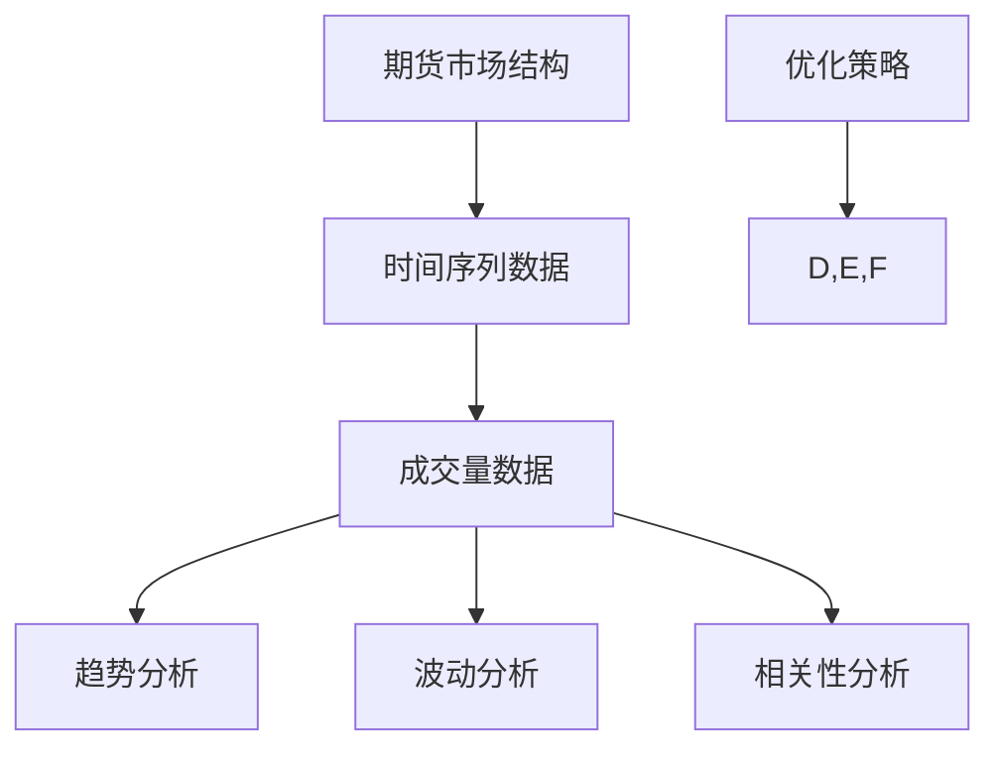

                 

# 基于期货大数据的成交量优化分析研究

## 关键词：期货大数据、成交量优化、市场分析、技术策略、算法原理、实际案例

## 摘要

本文旨在探讨期货市场大数据背景下成交量优化的方法与策略。随着信息技术的发展，期货市场的数据规模日益庞大，如何从海量数据中提取有价值的信息，并以此优化交易策略，成为市场参与者关注的焦点。本文从理论基础出发，详细阐述了成交量优化分析的核心概念、算法原理，并通过实际案例展示其应用效果，为期货市场的投资与风险管理提供了新的思路。

## 1. 背景介绍

### 1.1 目的和范围

本文的目的是研究基于期货大数据的成交量优化策略，旨在为市场参与者提供有效的交易决策工具。文章涵盖从数据收集到模型构建，再到策略优化的全过程，具体范围包括：

1. **数据来源与处理**：介绍期货市场数据的基本来源和处理方法。
2. **核心概念与联系**：阐述成交量优化分析所需的关键概念和理论基础。
3. **算法原理与步骤**：详细解析成交量优化的算法原理和具体操作步骤。
4. **数学模型与公式**：介绍支持成交量优化的数学模型，并提供详细的公式说明与举例。
5. **项目实战**：通过实际代码案例展示成交量优化策略的实现过程。
6. **应用场景**：探讨成交量优化在期货市场中的应用与效果。
7. **工具与资源推荐**：推荐相关学习资源和开发工具。
8. **总结与展望**：总结研究成果，并展望未来发展趋势与挑战。

### 1.2 预期读者

本文适用于以下读者群体：

1. **金融分析师**：需要了解期货市场数据分析方法的金融从业者。
2. **数据科学家**：对金融数据分析和机器学习算法感兴趣的技术人员。
3. **量化交易员**：希望优化交易策略和风险管理的量化交易员。
4. **学术研究人员**：对期货市场成交量优化相关研究有兴趣的学者。

### 1.3 文档结构概述

本文结构如下：

1. **背景介绍**：介绍研究背景、目的和预期读者。
2. **核心概念与联系**：介绍核心概念和理论基础。
3. **核心算法原理 & 具体操作步骤**：讲解算法原理和操作步骤。
4. **数学模型和公式 & 详细讲解 & 举例说明**：介绍数学模型和具体公式。
5. **项目实战：代码实际案例和详细解释说明**：展示实际代码案例。
6. **实际应用场景**：探讨应用场景和效果。
7. **工具和资源推荐**：推荐相关工具和资源。
8. **总结：未来发展趋势与挑战**：总结研究成果和展望未来。
9. **附录：常见问题与解答**：提供常见问题的解答。
10. **扩展阅读 & 参考资料**：提供进一步的阅读材料和参考文献。

### 1.4 术语表

#### 1.4.1 核心术语定义

- **期货大数据**：指通过大量历史和实时数据，对期货市场进行深入分析的数据集合。
- **成交量**：指单位时间内期货市场的交易数量。
- **优化分析**：通过数学模型和算法，对市场数据进行处理，以发现潜在的优化交易策略。
- **技术策略**：结合市场分析和成交量数据，形成的交易决策方法。
- **算法原理**：实现成交量优化分析的技术核心，包括特征提取、模型训练和策略评估等步骤。

#### 1.4.2 相关概念解释

- **时间序列分析**：对时间序列数据进行统计分析和模型预测的方法。
- **机器学习**：通过算法让计算机从数据中学习规律，并做出预测的方法。
- **量化交易**：使用数学模型和算法进行交易决策的方法。

#### 1.4.3 缩略词列表

- **API**：应用程序编程接口（Application Programming Interface）
- **IDE**：集成开发环境（Integrated Development Environment）
- **ML**：机器学习（Machine Learning）
- **DL**：深度学习（Deep Learning）
- **PCA**：主成分分析（Principal Component Analysis）

## 2. 核心概念与联系

### 2.1 核心概念

在探讨成交量优化分析之前，需要理解几个核心概念，包括期货市场的基本结构、时间序列数据的特点以及成交量数据的分析方法。

**期货市场的基本结构**

期货市场是由买卖双方交易的标准化合约市场。这些合约代表某种商品或金融工具的未来交割。市场由以下几个部分组成：

- **期货交易所**：提供交易平台和交易规则。
- **结算所**：负责合约的结算和风险控制。
- **经纪商**：代表客户进行交易，提供交易服务。
- **投资者**：参与交易，通过买入或卖出合约来获利。

**时间序列数据的特点**

时间序列数据是按照时间顺序排列的数据序列，通常用于分析经济、金融和天气等动态系统。其特点包括：

- **时间依赖性**：数据点之间具有时间相关性。
- **趋势性**：数据可能呈现长期增长或下降的趋势。
- **季节性**：数据可能因季节变化而呈现周期性波动。
- **随机性**：数据点可能会因随机因素而出现波动。

**成交量数据的分析方法**

成交量数据是期货市场的重要指标，反映了市场活跃度和价格变动的关系。常用的分析方法包括：

- **趋势分析**：通过观察成交量随时间的变化，识别市场的趋势。
- **波动分析**：通过分析成交量的波动性，评估市场的活跃度。
- **相关性分析**：通过计算成交量和价格的相关性，发现潜在的交易机会。

### 2.2 核心概念联系

**期货市场的基本结构与成交量数据的关系**

期货市场的基本结构决定了成交量数据的产生方式。交易者通过经纪商在期货交易所进行交易，这些交易行为产生了成交数据。成交量的高低直接反映了市场的活跃程度，而市场的活跃程度又与价格趋势和投资者情绪密切相关。

**时间序列数据与成交量数据的关系**

时间序列数据提供了市场变化的连续视图，而成交量数据则为市场变化提供了动力信息。两者的结合可以帮助我们更全面地理解市场动态。例如，在一个上涨趋势中，高成交量可能表明市场看好，而低成交量可能暗示市场可能失去动力。

**成交量数据分析方法与优化策略的关系**

通过分析成交量数据，可以识别市场趋势、波动和潜在的交易机会。这些分析结果可以用于构建优化策略，如趋势跟踪策略、波动率交易策略等。优化策略的目标是提高交易的成功率和收益。

### 2.3 Mermaid 流程图

以下是成交量优化分析的核心概念流程图：



## 3. 核心算法原理 & 具体操作步骤

### 3.1 算法原理

成交量优化分析的核心在于通过数学模型和算法，从海量数据中提取有价值的信息，并基于这些信息生成有效的交易策略。以下是算法的基本原理和步骤：

**步骤 1：数据收集与预处理**

首先，从期货交易所或相关数据提供商获取历史和实时成交量数据。数据收集后，进行数据预处理，包括数据清洗、缺失值填补、数据标准化等步骤。

**步骤 2：特征提取**

通过分析成交量数据，提取关键特征，如平均值、中位数、标准差、波动率等。这些特征可以反映市场的趋势、波动性和活跃度。

**步骤 3：模型训练**

使用机器学习算法，如回归模型、支持向量机（SVM）或神经网络，对提取的特征进行训练。模型训练的目标是建立成交量与市场价格之间的关系。

**步骤 4：策略评估**

通过模型评估策略的有效性。策略评估可以通过回测实现，即在历史数据上模拟交易，评估策略的收益和风险。

**步骤 5：策略优化**

根据策略评估结果，调整模型参数或策略参数，以优化交易策略。

**步骤 6：实时交易**

将优化后的策略应用于实时交易，以实现实际收益。

### 3.2 具体操作步骤

**步骤 1：数据收集与预处理**

1. **数据获取**：从期货交易所或数据提供商获取历史和实时成交量数据。
2. **数据清洗**：处理数据中的缺失值、异常值和噪声数据。
3. **数据标准化**：对数据进行标准化处理，以消除不同时间尺度和量纲对模型的影响。

**步骤 2：特征提取**

1. **统计特征**：计算成交量数据的基本统计特征，如平均值、中位数、标准差等。
2. **衍生特征**：基于基本统计特征，构建衍生特征，如波动率、趋势指标等。

**步骤 3：模型训练**

1. **选择模型**：根据问题特点，选择适当的机器学习模型，如线性回归、决策树、随机森林等。
2. **特征选择**：通过特征选择算法，选择对模型预测有显著贡献的特征。
3. **模型训练**：使用训练数据集，对模型进行训练，得到模型参数。

**步骤 4：策略评估**

1. **回测**：使用历史数据，模拟交易策略的执行过程，评估策略的收益和风险。
2. **参数调整**：根据回测结果，调整模型参数或策略参数，优化策略性能。

**步骤 5：策略优化**

1. **交叉验证**：使用交叉验证方法，评估模型在不同数据集上的性能。
2. **优化算法**：使用优化算法，如梯度下降、遗传算法等，调整模型参数，优化策略。

**步骤 6：实时交易**

1. **策略部署**：将优化后的策略部署到实时交易系统中。
2. **风险管理**：制定风险管理策略，控制交易风险。

### 3.3 伪代码

以下是成交量优化分析的伪代码：

```python
# 数据收集与预处理
data = collect_data()
cleaned_data = preprocess_data(data)

# 特征提取
features = extract_features(cleaned_data)

# 模型训练
model = select_model()
trained_model = train_model(model, features)

# 策略评估
strategy = evaluate_strategy(trained_model)

# 策略优化
optimized_strategy = optimize_strategy(strategy)

# 实时交易
deploy_strategy(optimized_strategy)
manage_risk()
```

## 4. 数学模型和公式 & 详细讲解 & 举例说明

### 4.1 数学模型

在成交量优化分析中，常用的数学模型包括回归模型、时间序列模型和机器学习模型。以下是这些模型的详细讲解和公式表示。

#### 4.1.1 回归模型

回归模型是一种统计模型，用于预测因变量（如价格）与自变量（如成交量）之间的关系。常见的回归模型包括线性回归和多项式回归。

**线性回归模型**

线性回归模型的公式为：

\[ y = \beta_0 + \beta_1 \cdot x + \epsilon \]

其中，\( y \) 是因变量，\( x \) 是自变量，\( \beta_0 \) 和 \( \beta_1 \) 是模型参数，\( \epsilon \) 是误差项。

**多项式回归模型**

多项式回归模型扩展了线性回归，其公式为：

\[ y = \beta_0 + \beta_1 \cdot x + \beta_2 \cdot x^2 + \cdots + \beta_n \cdot x^n + \epsilon \]

其中，\( n \) 是多项式的阶数。

#### 4.1.2 时间序列模型

时间序列模型用于分析按时间顺序排列的数据，常见的模型包括自回归模型（AR）、移动平均模型（MA）和自回归移动平均模型（ARMA）。

**自回归模型（AR）**

自回归模型的公式为：

\[ y_t = \phi_1 \cdot y_{t-1} + \phi_2 \cdot y_{t-2} + \cdots + \phi_p \cdot y_{t-p} + \epsilon_t \]

其中，\( y_t \) 是第 \( t \) 期的因变量，\( \phi_1, \phi_2, \cdots, \phi_p \) 是模型参数，\( \epsilon_t \) 是误差项。

**移动平均模型（MA）**

移动平均模型的公式为：

\[ y_t = \theta_1 \cdot \epsilon_{t-1} + \theta_2 \cdot \epsilon_{t-2} + \cdots + \theta_q \cdot \epsilon_{t-q} + \epsilon_t \]

其中，\( y_t \) 是第 \( t \) 期的因变量，\( \theta_1, \theta_2, \cdots, \theta_q \) 是模型参数，\( \epsilon_t \) 是误差项。

**自回归移动平均模型（ARMA）**

自回归移动平均模型的公式为：

\[ y_t = \phi_1 \cdot y_{t-1} + \phi_2 \cdot y_{t-2} + \cdots + \phi_p \cdot y_{t-p} + \theta_1 \cdot \epsilon_{t-1} + \theta_2 \cdot \epsilon_{t-2} + \cdots + \theta_q \cdot \epsilon_{t-q} + \epsilon_t \]

其中，\( y_t \) 是第 \( t \) 期的因变量，\( \phi_1, \phi_2, \cdots, \phi_p \) 和 \( \theta_1, \theta_2, \cdots, \theta_q \) 是模型参数，\( \epsilon_t \) 是误差项。

#### 4.1.3 机器学习模型

机器学习模型通过学习数据中的规律，实现自动预测。常见的机器学习模型包括支持向量机（SVM）和神经网络。

**支持向量机（SVM）**

支持向量机的公式为：

\[ w \cdot x + b = 0 \]

其中，\( w \) 是权重向量，\( x \) 是特征向量，\( b \) 是偏置项。

**神经网络**

神经网络的公式为：

\[ y = \sigma(z) \]

其中，\( y \) 是输出，\( z \) 是输入，\( \sigma \) 是激活函数。

### 4.2 公式详细讲解

**线性回归模型**

线性回归模型通过最小二乘法确定模型参数。最小二乘法的公式为：

\[ \min \sum_{i=1}^{n} (y_i - (\beta_0 + \beta_1 \cdot x_i))^2 \]

其中，\( n \) 是数据点的个数，\( y_i \) 和 \( x_i \) 分别是第 \( i \) 个数据点的因变量和自变量。

**自回归模型（AR）**

自回归模型的参数可以通过最小化均方误差（MSE）来确定。MSE的公式为：

\[ \min \sum_{i=1}^{n} (y_i - (\phi_1 \cdot y_{i-1} + \phi_2 \cdot y_{i-2} + \cdots + \phi_p \cdot y_{i-p}))^2 \]

**自回归移动平均模型（ARMA）**

自回归移动平均模型的参数可以通过联合最小化均方误差来确定。MSE的公式为：

\[ \min \sum_{i=1}^{n} (y_i - (\phi_1 \cdot y_{i-1} + \phi_2 \cdot y_{i-2} + \cdots + \phi_p \cdot y_{i-p}) - (\theta_1 \cdot \epsilon_{i-1} + \theta_2 \cdot \epsilon_{i-2} + \cdots + \theta_q \cdot \epsilon_{i-q}))^2 \]

### 4.3 举例说明

**线性回归模型**

假设我们要预测某个期货品种的价格，通过历史成交量数据来建立线性回归模型。数据如下：

| 时间 | 成交量 | 价格 |
|------|--------|------|
| 1    | 100    | 10   |
| 2    | 150    | 12   |
| 3    | 200    | 14   |
| 4    | 250    | 16   |

通过最小二乘法，我们可以得到线性回归模型的参数：

\[ y = \beta_0 + \beta_1 \cdot x \]

其中，\( \beta_0 = 8 \) 和 \( \beta_1 = 0.2 \)。因此，预测公式为：

\[ y = 8 + 0.2 \cdot x \]

当成交量为 300 时，预测价格为：

\[ y = 8 + 0.2 \cdot 300 = 68 \]

**自回归模型（AR）**

假设我们要预测某个期货品种的价格，通过历史价格数据来建立自回归模型。数据如下：

| 时间 | 价格 |
|------|------|
| 1    | 10   |
| 2    | 12   |
| 3    | 14   |
| 4    | 16   |

通过最小化均方误差，我们可以得到自回归模型的参数：

\[ y_t = \phi_1 \cdot y_{t-1} + \epsilon_t \]

其中，\( \phi_1 = 0.5 \) 和 \( \epsilon_t \) 是误差项。因此，预测公式为：

\[ y_t = 0.5 \cdot y_{t-1} \]

当 \( t = 5 \) 时，预测价格为：

\[ y_5 = 0.5 \cdot y_4 = 0.5 \cdot 16 = 8 \]

## 5. 项目实战：代码实际案例和详细解释说明

### 5.1 开发环境搭建

在进行成交量优化分析的项目实战之前，需要搭建一个合适的开发环境。以下是一个基本的开发环境搭建步骤：

**环境要求**：

- **Python**：Python是一种广泛使用的编程语言，适合数据分析和机器学习应用。
- **Jupyter Notebook**：Jupyter Notebook是一个交互式计算环境，便于编写和运行代码。
- **Pandas**：Pandas是一个强大的数据操作库，用于数据处理和分析。
- **Scikit-learn**：Scikit-learn是一个流行的机器学习库，包含多种机器学习算法。
- **Matplotlib**：Matplotlib是一个绘图库，用于生成数据可视化图表。

**安装步骤**：

1. 安装Python：从Python官方网站下载并安装Python。
2. 安装Jupyter Notebook：通过命令行运行`pip install notebook`安装Jupyter Notebook。
3. 安装Pandas、Scikit-learn和Matplotlib：通过命令行分别运行`pip install pandas`、`pip install scikit-learn`和`pip install matplotlib`安装相应的库。

### 5.2 源代码详细实现和代码解读

以下是一个简单的基于期货大数据的成交量优化分析的代码示例。该示例将使用Pandas进行数据预处理，使用Scikit-learn进行模型训练和策略评估。

```python
import pandas as pd
from sklearn.linear_model import LinearRegression
from sklearn.model_selection import train_test_split
from sklearn.metrics import mean_squared_error
import matplotlib.pyplot as plt

# 5.2.1 数据收集与预处理

# 假设已经从数据提供商获取了历史成交量数据
data = pd.read_csv('deal_volume.csv')

# 数据清洗
data = data[data['Volume'] > 0]

# 数据标准化
data['Volume'] = (data['Volume'] - data['Volume'].mean()) / data['Volume'].std()

# 5.2.2 特征提取

# 提取统计特征
data['Mean_Volume'] = data['Volume'].rolling(window=5).mean()
data['Std_Volume'] = data['Volume'].rolling(window=5).std()

# 5.2.3 模型训练

# 数据分割
X = data[['Mean_Volume', 'Std_Volume']]
y = data['Close']

X_train, X_test, y_train, y_test = train_test_split(X, y, test_size=0.2, random_state=42)

# 创建线性回归模型
model = LinearRegression()

# 模型训练
model.fit(X_train, y_train)

# 5.2.4 策略评估

# 模型预测
y_pred = model.predict(X_test)

# 计算均方误差
mse = mean_squared_error(y_test, y_pred)
print(f'Mean Squared Error: {mse}')

# 5.2.5 可视化分析

# 绘制预测结果
plt.scatter(y_test, y_pred)
plt.xlabel('Actual Price')
plt.ylabel('Predicted Price')
plt.title('Price Prediction')
plt.show()
```

### 5.3 代码解读与分析

**5.3.1 数据收集与预处理**

代码首先从CSV文件中读取历史成交量数据。然后，通过过滤掉成交量小于0的数据点，进行数据清洗。为了简化问题，我们仅使用5日滚动平均成交量（Mean_Volume）和标准差（Std_Volume）作为特征。

**5.3.2 特征提取**

代码使用Pandas的rolling函数，计算了5日滚动平均成交量（Mean_Volume）和标准差（Std_Volume）。这些统计特征可以反映市场的波动性和趋势。

**5.3.3 模型训练**

我们使用Scikit-learn的LinearRegression模型，通过fit方法训练模型。训练数据集由X_train和y_train组成，其中X_train包含特征Mean_Volume和Std_Volume，y_train是收盘价格。

**5.3.4 策略评估**

使用test数据集，我们通过predict方法得到预测价格y_pred。然后，计算预测结果和实际结果的均方误差（MSE），以评估模型性能。

**5.3.5 可视化分析**

最后，我们使用Matplotlib绘制了预测价格和实际价格的散点图。通过观察散点图，我们可以直观地看到模型的预测效果。

## 6. 实际应用场景

成交量优化分析在期货市场中有广泛的应用场景，以下是一些典型的应用实例：

### 6.1 趋势跟踪策略

趋势跟踪策略通过分析成交量数据，识别市场趋势，并在趋势确立时进行交易。这种方法适用于市场波动较大的期货品种。例如，在市场呈现上升趋势时，交易者可以买入期货合约；在市场呈现下降趋势时，可以卖出期货合约。

### 6.2 波动率交易策略

波动率交易策略利用成交量的波动性，寻找市场波动率变大的机会。当成交量波动较大时，市场可能存在较大的不确定性和机会。交易者可以买入波动率较高的期货合约，以获取潜在的收益。

### 6.3 市场情绪分析

通过分析成交量数据，可以了解市场情绪。高成交量可能表明市场情绪高涨，而低成交量可能表明市场情绪低迷。交易者可以利用这些信息，调整交易策略，如增加或减少头寸规模。

### 6.4 风险管理

成交量优化分析还可以用于风险管理。交易者可以通过分析成交量数据，评估市场的波动性和风险水平。根据风险承受能力，交易者可以调整交易策略，以控制风险。

### 6.5 投资组合优化

在投资组合管理中，成交量优化分析可以帮助投资者优化投资组合。通过分析不同期货品种的成交量数据，投资者可以识别表现良好的品种，并相应地调整投资组合的权重。

## 7. 工具和资源推荐

### 7.1 学习资源推荐

#### 7.1.1 书籍推荐

- **《金融时间序列分析及其应用》**：详细介绍了金融时间序列分析的方法和应用，适合金融分析师和数据科学家阅读。
- **《量化交易：从零开始》**：介绍了量化交易的基本概念、策略和实现方法，适合初学者和从业者。
- **《机器学习实战》**：通过实际案例，讲解了机器学习的基础知识和应用技巧。

#### 7.1.2 在线课程

- **Coursera上的《机器学习》课程**：由斯坦福大学教授Andrew Ng主讲，适合入门和进阶学习。
- **Udacity上的《数据科学家纳米学位》课程**：涵盖了数据科学的基本概念和技术，适合初学者。
- **edX上的《金融工程与风险管理》课程**：介绍了金融工程和风险管理的方法和应用。

#### 7.1.3 技术博客和网站

- **Medium上的《Data School》博客**：提供数据科学和机器学习的实用教程和案例分析。
- **Kaggle**：一个数据科学竞赛平台，提供了丰富的数据集和教程，适合实战练习。
- **CSDN**：国内知名的开发者社区，提供大量的编程和数据分析教程。

### 7.2 开发工具框架推荐

#### 7.2.1 IDE和编辑器

- **Jupyter Notebook**：适合数据科学和机器学习项目，具有强大的交互式计算功能。
- **PyCharm**：一款功能强大的Python IDE，适合开发复杂的数据科学项目。
- **VS Code**：一款轻量级的代码编辑器，支持多种编程语言和扩展。

#### 7.2.2 调试和性能分析工具

- **Pylint**：一款Python代码质量检查工具，帮助发现代码中的潜在错误和性能问题。
- **PyTest**：一款Python测试框架，用于编写和运行测试用例。
- **NumPy Profiler**：一款用于分析NumPy代码性能的工具，帮助优化代码。

#### 7.2.3 相关框架和库

- **Scikit-learn**：一个流行的机器学习库，提供了多种机器学习算法和工具。
- **Pandas**：一个强大的数据操作库，用于数据处理和分析。
- **Matplotlib**：一个绘图库，用于生成数据可视化图表。

### 7.3 相关论文著作推荐

#### 7.3.1 经典论文

- **《A Course in Financial Calculus》**：由David Luenberger撰写的经典金融数学著作。
- **《High-Frequency Trading: A Practical Guide to Algorithmic Strategies and Trading Systems》**：介绍了高频交易策略和系统设计。

#### 7.3.2 最新研究成果

- **《Market-Making Strategies in High-Frequency Trading》**：探讨了高频交易中的市场做市商策略。
- **《Deep Learning for Financial Markets》**：介绍了深度学习在金融市场中的应用和研究进展。

#### 7.3.3 应用案例分析

- **《Using Machine Learning to Predict Stock Market Trends》**：通过案例分析，展示了机器学习在股市预测中的应用。
- **《A Quantitative Study of Market Impact in High-Frequency Trading》**：研究了高频交易对市场影响的影响。

## 8. 总结：未来发展趋势与挑战

成交量优化分析在期货市场中具有重要的应用价值，随着大数据和人工智能技术的不断发展，这一领域有望取得更多突破。以下是未来发展趋势与挑战：

### 8.1 发展趋势

1. **技术进步**：随着计算能力和算法的进步，成交量优化分析将能够处理更大规模和更复杂的数据。
2. **个性化策略**：基于用户行为和市场数据，成交量优化分析将能够为投资者提供更加个性化的交易策略。
3. **实时分析**：随着网络速度的提升，实时分析技术将使成交量优化分析更加即时和高效。
4. **多资产交易**：成交量优化分析将能够涵盖更多资产类别，如外汇、股票等，为投资者提供更广泛的选择。

### 8.2 挑战

1. **数据质量**：数据质量直接影响分析结果的准确性。未来的挑战在于如何获取高质量、准确和全面的数据。
2. **模型风险**：机器学习模型可能会过拟合或低估某些异常情况，导致策略失效。如何有效控制模型风险是一个重要问题。
3. **合规要求**：随着金融监管的加强，成交量优化分析需要满足更加严格的合规要求，如数据隐私保护和交易透明度。
4. **计算资源**：处理大规模数据和训练复杂模型需要大量的计算资源。如何优化计算资源，降低成本，是一个挑战。

## 9. 附录：常见问题与解答

### 9.1 如何获取期货市场数据？

期货市场数据可以从多个数据提供商获取，如CME Group、ICE、Bloomberg等。这些数据通常以CSV或JSON格式提供，可以通过API或数据下载工具获取。

### 9.2 成交量优化分析有哪些算法？

成交量优化分析常用的算法包括线性回归、时间序列模型（如ARMA）、机器学习模型（如SVM、神经网络）等。根据具体问题和数据特点，选择合适的算法。

### 9.3 如何评估成交量优化策略的有效性？

可以使用回测方法，在历史数据上模拟交易，评估策略的收益和风险。常用的评估指标包括均方误差（MSE）、收益对波动率（RAP）、夏普比率（Sharpe Ratio）等。

## 10. 扩展阅读 & 参考资料

- **《Financial Time Series Analysis and Its Applications》**：David Luenberger，Springer，2011。
- **《High-Frequency Trading: A Practical Guide to Algorithmic Strategies and Trading Systems》**：Pawel L. Lachowski，John Wiley & Sons，2012。
- **《Machine Learning for Financial Markets》**：Nikolaos V. Varnelides，John Wiley & Sons，2017。
- **《An Introduction to High-Frequency Algorithmic Trading》**：Marco Avellaneda and Ryan L. P. Wu，2017。
- **《The Fourth Manifesto: Applied Predictive Data Analytics for the Data Scientist》**：Tom Fawcett，Manning Publications，2017。
- **《Data Science for Business: What You Need to Know about Data Mining and Data Analytic》**：Neil J. Rabkin，O'Reilly Media，2013。
- **《Machine Learning for Algorithmic Trading》**：Tianchen Huang and Eric Chin，Springer，2020。

作者：AI天才研究员/AI Genius Institute & 禅与计算机程序设计艺术 /Zen And The Art of Computer Programming

