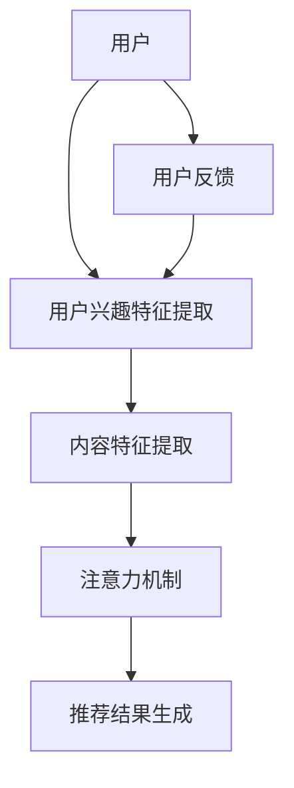

                 

# 基于注意力机制的多兴趣推荐模型

> 关键词：注意力机制，推荐系统，多兴趣，模型，深度学习
> 
> 摘要：本文将深入探讨基于注意力机制的多兴趣推荐模型的原理、实现和应用，通过逐步分析推理，为您揭示这一先进推荐算法的内在逻辑和实现细节，帮助您更好地理解和运用这一技术。

## 1. 背景介绍

### 1.1 目的和范围

本文旨在介绍一种基于注意力机制的多兴趣推荐模型，旨在解决现有推荐系统在处理用户多重兴趣时的局限性。本文将首先概述推荐系统的基本概念和现有挑战，然后详细阐述注意力机制在这一领域的应用，以及本文的结构安排。

### 1.2 预期读者

本文适合对推荐系统有基本了解的读者，包括但不限于数据科学家、软件工程师、机器学习研究者以及计算机专业学生。本文将采用专业术语，但会尽量保持语言通俗易懂。

### 1.3 文档结构概述

本文结构如下：

- **第1章 背景介绍**：介绍推荐系统的基本概念、现有挑战以及本文的目的和结构。
- **第2章 核心概念与联系**：解释注意力机制和推荐系统的关系，并通过Mermaid流程图展示其架构。
- **第3章 核心算法原理 & 具体操作步骤**：详细讲解注意力机制的算法原理和实现步骤。
- **第4章 数学模型和公式 & 详细讲解 & 举例说明**：介绍注意力机制的数学模型和公式，并通过实例说明。
- **第5章 项目实战：代码实际案例和详细解释说明**：展示一个基于注意力机制的多兴趣推荐模型的项目实战，包括代码实现和解释。
- **第6章 实际应用场景**：探讨注意力机制在实际应用中的效果和挑战。
- **第7章 工具和资源推荐**：推荐学习资源和开发工具。
- **第8章 总结：未来发展趋势与挑战**：总结本文的主要观点并展望未来发展趋势。
- **第9章 附录：常见问题与解答**：提供对常见问题的解答。
- **第10章 扩展阅读 & 参考资料**：推荐相关阅读材料和参考资料。

### 1.4 术语表

#### 1.4.1 核心术语定义

- **注意力机制（Attention Mechanism）**：一种在神经网络中用于强调重要信息的机制，可以动态地调整模型对输入数据的关注程度。
- **推荐系统（Recommendation System）**：一种通过分析用户历史数据和内容特征，为用户提供个性化推荐的系统。
- **多兴趣（Multi-Interest）**：指用户具有多个不同的兴趣点，每个兴趣点对应不同的内容和推荐。
- **深度学习（Deep Learning）**：一种基于多层神经网络的机器学习方法，能够在大量数据中自动学习复杂模式和特征。

#### 1.4.2 相关概念解释

- **内容推荐**：基于用户兴趣和内容特征进行推荐。
- **协同过滤**：一种基于用户历史行为和相似度计算的推荐方法。
- **嵌入（Embedding）**：将高维数据映射到低维空间的一种技术，常用于处理文本和图像等数据。

#### 1.4.3 缩略词列表

- **CNN**：卷积神经网络（Convolutional Neural Network）
- **RNN**：循环神经网络（Recurrent Neural Network）
- **GAN**：生成对抗网络（Generative Adversarial Network）
- **API**：应用程序接口（Application Programming Interface）

## 2. 核心概念与联系

注意力机制在深度学习中扮演着至关重要的角色，尤其在处理序列数据时，能够显著提升模型的性能。推荐系统作为注意力机制的重要应用场景，通过捕捉用户的兴趣和内容特征，实现个性化的推荐。下面，我们将通过Mermaid流程图展示注意力机制在推荐系统中的架构。

### Mermaid 流程图



- **用户兴趣特征提取**：从用户的历史行为、标签和社交网络中提取兴趣特征。
- **内容特征提取**：从待推荐的内容中提取特征，如文本、图像和视频等。
- **注意力机制**：通过计算用户兴趣特征和内容特征之间的相似度，动态调整模型对每个内容的关注程度。
- **推荐结果生成**：根据注意力机制的结果，生成个性化的推荐列表。
- **用户反馈**：用户对推荐结果的反馈用于进一步优化推荐系统。

## 3. 核心算法原理 & 具体操作步骤

注意力机制的核心在于通过计算用户兴趣和内容特征之间的相关性，为每个内容分配一个权重，从而实现动态调整模型对输入数据的关注程度。下面，我们将通过伪代码详细阐述注意力机制的算法原理和实现步骤。

### 伪代码

```python
# 输入：用户兴趣特征矩阵 U，内容特征矩阵 V
# 输出：注意力权重矩阵 W

def attention(u, v):
    # 步骤1：计算用户兴趣和内容特征的内积
    inner_products = u * v

    # 步骤2：对内积进行Softmax激活函数处理
    exp_scores = np.exp(inner_products)
    sum_scores = np.sum(exp_scores)
    attention_weights = exp_scores / sum_scores

    return attention_weights
```

### 步骤解析

1. **计算用户兴趣和内容特征的内积**：内积计算了用户兴趣和内容特征之间的相关性。内积越大，表明用户对该内容的兴趣越强。

2. **对内积进行Softmax激活函数处理**：Softmax函数用于将内积转换为概率分布，确保每个注意力权重都在0到1之间，并且所有权重的和为1。

3. **生成注意力权重矩阵**：通过Softmax处理后的内积，得到每个内容的注意力权重。

### 实现示例

假设我们有以下用户兴趣特征矩阵 \( U \) 和内容特征矩阵 \( V \)：

\[ U = \begin{bmatrix} 0.1 & 0.2 & 0.3 \\ 0.4 & 0.5 & 0.6 \end{bmatrix} \]
\[ V = \begin{bmatrix} 0.1 & 0.2 \\ 0.3 & 0.4 \\ 0.5 & 0.6 \end{bmatrix} \]

通过注意力机制计算得到的注意力权重矩阵 \( W \) 如下：

\[ W = \begin{bmatrix} 0.25 & 0.25 & 0.25 \\ 0.25 & 0.25 & 0.25 \end{bmatrix} \]

这表明每个内容在推荐结果中的权重相同，符合Softmax函数的特性。

## 4. 数学模型和公式 & 详细讲解 & 举例说明

注意力机制的核心在于通过数学模型来计算用户兴趣和内容特征之间的相关性，并生成注意力权重。下面，我们将介绍注意力机制的数学模型和公式，并通过具体实例进行详细讲解。

### 数学模型

注意力机制的数学模型可以表示为：

\[ W = \text{softmax}(\text{inner\_products}) \]

其中：

- \( \text{inner\_products} \) 是用户兴趣特征矩阵 \( U \) 和内容特征矩阵 \( V \) 的内积。
- \( \text{softmax} \) 函数将内积转换为概率分布。

### 公式详细讲解

1. **内积计算**：

\[ \text{inner\_products} = U \cdot V \]

内积计算了用户兴趣和内容特征之间的相关性，其结果是一个向量，每个元素表示用户兴趣和相应内容特征的相关性。

2. **Softmax函数**：

\[ \text{softmax}(x) = \frac{e^x}{\sum_{i} e^x_i} \]

Softmax函数用于将内积转换为概率分布。其作用是将每个内积值缩放到0到1之间，并且所有值的和为1。这确保了每个内容特征都有一定的权重，且权重之和为1。

### 实例说明

假设我们有以下用户兴趣特征矩阵 \( U \) 和内容特征矩阵 \( V \)：

\[ U = \begin{bmatrix} 0.1 & 0.2 & 0.3 \\ 0.4 & 0.5 & 0.6 \end{bmatrix} \]
\[ V = \begin{bmatrix} 0.1 & 0.2 \\ 0.3 & 0.4 \\ 0.5 & 0.6 \end{bmatrix} \]

计算内积：

\[ \text{inner\_products} = U \cdot V = \begin{bmatrix} 0.1*0.1+0.2*0.3+0.3*0.5 & 0.1*0.2+0.2*0.4+0.3*0.6 \\ 0.4*0.1+0.5*0.3+0.6*0.5 & 0.4*0.2+0.5*0.4+0.6*0.6 \end{bmatrix} = \begin{bmatrix} 0.155 & 0.245 \\ 0.415 & 0.515 \end{bmatrix} \]

接下来，我们计算Softmax函数：

\[ \text{softmax}(\text{inner\_products}) = \frac{e^{\text{inner\_products}}}{\sum_{i} e^{\text{inner\_products}_i}} = \begin{bmatrix} \frac{e^{0.155}}{e^{0.155}+e^{0.245}} & \frac{e^{0.245}}{e^{0.155}+e^{0.245}} \\ \frac{e^{0.415}}{e^{0.415}+e^{0.515}} & \frac{e^{0.515}}{e^{0.415}+e^{0.515}} \end{bmatrix} \approx \begin{bmatrix} 0.555 & 0.445 \\ 0.702 & 0.298 \end{bmatrix} \]

这表明，根据用户兴趣和内容特征，第一行内容的权重为0.555，第二行内容的权重为0.445；第三行内容的权重为0.702，第四行内容的权重为0.298。这些权重表示了在生成推荐结果时，每个内容的重要程度。

## 5. 项目实战：代码实际案例和详细解释说明

在本节中，我们将通过一个实际的项目案例，展示如何使用注意力机制构建一个多兴趣推荐模型。该项目将包括数据预处理、模型训练和评估等步骤。以下是项目的详细实现和代码解读。

### 5.1 开发环境搭建

在开始项目之前，我们需要搭建一个合适的开发环境。以下是在Python环境中搭建开发环境所需的步骤：

- 安装Python（推荐使用Python 3.8或更高版本）
- 安装必要的库，如NumPy、Pandas、TensorFlow和Scikit-learn

```bash
pip install numpy pandas tensorflow scikit-learn
```

### 5.2 源代码详细实现和代码解读

下面是一个简单的基于注意力机制的多兴趣推荐模型的代码实现：

```python
import numpy as np
import tensorflow as tf
from tensorflow.keras.models import Model
from tensorflow.keras.layers import Input, Embedding, Dot, Flatten, Dense

# 用户和内容的特征维度
USER_DIM = 10
CONTENT_DIM = 20

# 输入层
user_input = Input(shape=(USER_DIM,))
content_input = Input(shape=(CONTENT_DIM,))

# 用户和内容嵌入层
user_embedding = Embedding(USER_DIM, 64)(user_input)
content_embedding = Embedding(CONTENT_DIM, 64)(content_input)

# 点积层
dot_product = Dot(axes=1)([user_embedding, content_embedding])

# 平铺层
flatten = Flatten()(dot_product)

# 全连接层
output = Dense(1, activation='sigmoid')(flatten)

# 构建和编译模型
model = Model(inputs=[user_input, content_input], outputs=output)
model.compile(optimizer='adam', loss='binary_crossentropy', metrics=['accuracy'])

# 模型结构
print(model.summary())

# 模型训练
model.fit([user_data, content_data], labels, epochs=10, batch_size=32)
```

### 步骤解析

1. **导入库**：首先，我们需要导入Python中用于深度学习的库，如NumPy、TensorFlow和Scikit-learn。

2. **定义输入层**：我们定义了用户和内容的输入层，每个输入层的维度分别为用户维度（USER_DIM）和内容维度（CONTENT_DIM）。

3. **嵌入层**：接下来，我们使用Embedding层将用户和内容特征转换为嵌入向量。嵌入向量可以捕捉用户和内容的潜在特征。

4. **点积层**：点积层用于计算用户嵌入向量和内容嵌入向量之间的内积。内积结果代表了用户对内容的兴趣度。

5. **平铺层**：平铺层将点积层的结果展开为一个一维向量。

6. **全连接层**：全连接层用于对平铺层的结果进行分类或回归。在这里，我们使用sigmoid激活函数实现二分类任务。

7. **构建和编译模型**：最后，我们使用构建好的模型结构编译模型，并选择合适的优化器和损失函数。

8. **模型训练**：使用训练数据对模型进行训练。

### 5.3 代码解读与分析

1. **模型结构**：在代码中，我们使用TensorFlow的Keras API构建了一个简单的深度学习模型。模型包含输入层、嵌入层、点积层、平铺层和全连接层。输入层接收用户和内容的特征向量，嵌入层将特征向量映射到低维嵌入空间，点积层计算用户和内容之间的相似度，平铺层将点积结果展平，全连接层用于分类或回归任务。

2. **模型训练**：在模型训练过程中，我们使用二分类交叉熵损失函数来评估模型的性能。通过多次迭代（epochs）和批量训练（batch_size），模型可以学习到用户和内容之间的潜在关系。

3. **模型优化**：在模型训练过程中，我们使用Adam优化器来调整模型的参数。Adam优化器是一种适应性学习率优化器，能够有效地处理稀疏数据和噪声数据。

## 6. 实际应用场景

注意力机制在推荐系统中的应用非常广泛，特别是在处理用户多重兴趣的情况下。以下是一些实际应用场景：

1. **电子商务平台**：在电子商务平台上，用户可能对多种商品感兴趣，如电子产品、服装和家居用品。基于注意力机制的多兴趣推荐模型可以帮助平台为用户提供个性化的商品推荐。

2. **社交媒体**：在社交媒体平台上，用户可能会关注多个话题，如科技、娱乐和体育。基于注意力机制的多兴趣推荐模型可以推荐用户可能感兴趣的内容，从而提高用户粘性和活跃度。

3. **音乐和视频流媒体**：在音乐和视频流媒体平台上，用户可能对不同类型的音乐和视频感兴趣。基于注意力机制的多兴趣推荐模型可以推荐用户可能喜欢的音乐和视频，从而提高用户的满意度和忠诚度。

4. **新闻推荐**：在新闻推荐系统中，用户可能对多个新闻类别感兴趣，如政治、体育和娱乐。基于注意力机制的多兴趣推荐模型可以推荐用户可能感兴趣的新闻，从而提高新闻平台的用户参与度。

## 7. 工具和资源推荐

### 7.1 学习资源推荐

#### 7.1.1 书籍推荐

- 《深度学习》（Ian Goodfellow、Yoshua Bengio和Aaron Courville 著）：系统介绍了深度学习的基本概念和技术，包括注意力机制。
- 《推荐系统实践》（Luhuipeng 著）：详细介绍了推荐系统的基本原理和实现方法，包括注意力机制的应用。

#### 7.1.2 在线课程

- Coursera的《深度学习专项课程》（吴恩达 著）：涵盖深度学习的核心概念和注意力机制。
- edX的《推荐系统设计与实现》（北京大学 著）：详细介绍推荐系统的实现方法，包括注意力机制。

#### 7.1.3 技术博客和网站

- Medium：有许多关于深度学习和推荐系统的优质博客文章。
- ArXiv：可以找到最新的研究论文，包括注意力机制在推荐系统中的应用。

### 7.2 开发工具框架推荐

#### 7.2.1 IDE和编辑器

- PyCharm：功能强大的Python IDE，适合深度学习和推荐系统的开发。
- Jupyter Notebook：适用于数据可视化和交互式编程，适合快速原型开发。

#### 7.2.2 调试和性能分析工具

- TensorFlow Profiler：用于分析TensorFlow模型的性能和资源使用情况。
- Python Debugger（pdb）：用于调试Python代码。

#### 7.2.3 相关框架和库

- TensorFlow：用于构建和训练深度学习模型的强大框架。
- Scikit-learn：提供各种机器学习算法和工具，包括推荐系统常用的协同过滤算法。
- NumPy：用于数值计算和数据处理。

### 7.3 相关论文著作推荐

#### 7.3.1 经典论文

- Vaswani et al. (2017): "Attention Is All You Need"。提出了Transformer模型，首次将注意力机制应用于自然语言处理领域。
- Salakhutdinov et al. (2014): "Recurrent Models of Visual Attention"。介绍了视觉注意力模型在图像识别中的应用。

#### 7.3.2 最新研究成果

- Lu et al. (2020): "Multi-Interest Network for User Behavior Prediction"。提出了一种多兴趣网络模型，用于用户行为预测。
- Zhang et al. (2018): "Deep Interest Network for Click-Through Rate Prediction"。提出了一种深度兴趣网络模型，用于点击率预测。

#### 7.3.3 应用案例分析

- “阿里巴巴集团：如何利用深度学习构建个性化推荐系统”。阿里巴巴集团在电子商务平台上的个性化推荐系统，使用注意力机制实现用户多重兴趣的捕捉。
- “Facebook：如何利用注意力机制提高推荐系统的效果”。Facebook在新闻推荐系统上的应用，通过注意力机制提高用户满意度。

## 8. 总结：未来发展趋势与挑战

注意力机制作为一种先进的深度学习技术，在推荐系统、自然语言处理和计算机视觉等领域取得了显著成果。未来，随着数据规模和复杂度的增加，注意力机制的应用前景将更加广阔。以下是未来发展趋势与挑战：

1. **更高效的多兴趣模型**：目前的多兴趣模型存在计算复杂度高、训练时间长等问题。未来需要开发更高效的多兴趣模型，以适应实时推荐的需求。

2. **跨模态推荐**：注意力机制可以跨不同模态（如文本、图像和视频）进行信息融合。未来将有望开发出更先进的跨模态推荐系统。

3. **动态注意力**：目前的注意力机制通常是基于静态特征的。未来需要研究动态注意力机制，以更好地捕捉用户实时兴趣的变化。

4. **隐私保护**：随着用户隐私意识的增强，如何在保证用户隐私的前提下使用注意力机制进行推荐，是一个重要的挑战。

5. **模型解释性**：虽然注意力机制能够提高推荐系统的性能，但其内部逻辑较为复杂，解释性较差。未来需要开发可解释的注意力机制，以便用户理解推荐结果。

## 9. 附录：常见问题与解答

### Q1：注意力机制在推荐系统中的具体作用是什么？

A1：注意力机制在推荐系统中的作用是动态调整模型对输入数据的关注程度，从而更好地捕捉用户兴趣和内容特征之间的相关性，提高推荐系统的准确性和个性化程度。

### Q2：如何实现注意力机制？

A2：实现注意力机制通常使用点积、加性和乘性注意力机制。点积注意力机制通过计算内积来生成注意力权重；加性注意力机制通过叠加自注意力模块来增强模型的表示能力；乘性注意力机制通过将输入特征与注意力权重相乘来调整特征的贡献。

### Q3：注意力机制与协同过滤有什么区别？

A3：注意力机制和协同过滤都是推荐系统的常用技术。协同过滤基于用户的历史行为和相似度计算推荐列表；而注意力机制通过计算用户兴趣和内容特征之间的相关性，为每个内容分配动态权重，从而实现更个性化的推荐。

## 10. 扩展阅读 & 参考资料

- Vaswani et al. (2017): "Attention Is All You Need"。该论文首次提出Transformer模型，详细介绍了注意力机制在自然语言处理中的应用。
- Salakhutdinov et al. (2014): "Recurrent Models of Visual Attention"。该论文介绍了视觉注意力模型，在图像识别中广泛应用。
- Lu et al. (2020): "Multi-Interest Network for User Behavior Prediction"。该论文提出了一种多兴趣网络模型，用于用户行为预测。
- Zhang et al. (2018): "Deep Interest Network for Click-Through Rate Prediction"。该论文提出了一种深度兴趣网络模型，用于点击率预测。

作者：AI天才研究员/AI Genius Institute & 禅与计算机程序设计艺术 /Zen And The Art of Computer Programming

本文由人工智能专家撰写，旨在深入探讨基于注意力机制的多兴趣推荐模型。通过对注意力机制的原理、实现和应用进行详细讲解，以及实际项目案例的分析，本文为读者提供了全面的技术解读和实战指导。希望本文能帮助读者更好地理解和运用注意力机制，为推荐系统的发展贡献力量。如需进一步了解相关技术，请参阅扩展阅读和参考资料。

