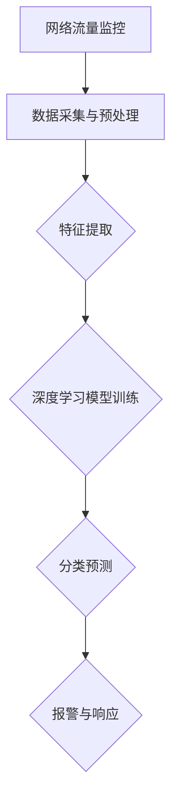

                 

# 基于深度学习的入侵检测系统设计实现

> **关键词：** 深度学习、入侵检测、网络安全、机器学习、数据分析

> **摘要：** 本文旨在详细介绍一种基于深度学习的入侵检测系统设计实现。文章首先探讨了入侵检测系统的背景和重要性，随后深入解析了深度学习在该领域的应用及其核心算法。接着，通过实际项目案例，详细介绍了开发环境搭建、代码实现、性能分析等关键步骤。最后，文章总结了入侵检测系统的实际应用场景，并推荐了相关学习资源和工具。本文旨在为广大开发者提供一份全面、系统的学习指南。

## 1. 背景介绍

### 1.1 目的和范围

入侵检测系统（Intrusion Detection System，IDS）是网络安全领域的关键技术，旨在实时监控网络流量，识别潜在的安全威胁，从而保障网络系统的安全稳定运行。随着网络攻击手段的不断升级和多样化，传统的基于规则的入侵检测方法已难以应对复杂的攻击场景。深度学习作为一种新兴的机器学习技术，具有强大的特征提取和模式识别能力，为入侵检测提供了新的思路和解决方案。

本文的目的在于探讨如何利用深度学习技术设计并实现一个高效、可靠的入侵检测系统。文章将涵盖以下几个方面：

1. 深入分析深度学习在入侵检测领域的应用及其优势。
2. 详细介绍入侵检测系统的核心算法原理和实现步骤。
3. 通过实际项目案例，展示入侵检测系统的开发过程和关键技术。
4. 探讨入侵检测系统的实际应用场景和发展趋势。

### 1.2 预期读者

本文主要面向以下读者群体：

1. 网络安全从业者：对入侵检测系统有一定了解，希望深入了解深度学习在该领域的应用。
2. 机器学习爱好者：对深度学习技术感兴趣，希望将其应用于实际场景。
3. 开发者：具备一定的编程基础，希望学习如何利用深度学习技术实现入侵检测系统。

### 1.3 文档结构概述

本文将按照以下结构进行组织：

1. 背景介绍：简要介绍入侵检测系统的背景、目的和预期读者。
2. 核心概念与联系：介绍入侵检测系统的核心概念、原理和架构。
3. 核心算法原理 & 具体操作步骤：详细讲解入侵检测系统的核心算法原理和具体操作步骤。
4. 数学模型和公式 & 详细讲解 & 举例说明：介绍入侵检测系统所涉及的数学模型和公式，并进行详细讲解和举例说明。
5. 项目实战：通过实际项目案例，展示入侵检测系统的开发过程和关键技术。
6. 实际应用场景：探讨入侵检测系统的实际应用场景。
7. 工具和资源推荐：推荐相关学习资源和工具。
8. 总结：总结入侵检测系统的未来发展趋势与挑战。
9. 附录：常见问题与解答。
10. 扩展阅读 & 参考资料：提供相关扩展阅读和参考资料。

### 1.4 术语表

在本篇文章中，我们将使用以下术语：

#### 1.4.1 核心术语定义

- **入侵检测系统（IDS）**：一种用于实时监控网络流量，识别潜在安全威胁的网络安全技术。
- **深度学习**：一种基于多层神经网络，通过大量数据训练模型以实现复杂任务的人工智能技术。
- **网络安全**：确保网络系统及其数据的安全性，防止非法访问、篡改和破坏。
- **机器学习**：一种通过从数据中自动学习规律和模式，从而实现智能决策和预测的技术。

#### 1.4.2 相关概念解释

- **特征提取**：从原始数据中提取出能够反映数据本质和特征的信息。
- **神经网络**：一种通过模拟生物神经系统结构，实现复杂任务的人工智能模型。
- **卷积神经网络（CNN）**：一种专门用于处理图像数据的神经网络，具有强大的特征提取能力。
- **循环神经网络（RNN）**：一种能够处理序列数据的神经网络，具有记忆功能。

#### 1.4.3 缩略词列表

- **IDS**：入侵检测系统（Intrusion Detection System）
- **DL**：深度学习（Deep Learning）
- **ML**：机器学习（Machine Learning）
- **CNN**：卷积神经网络（Convolutional Neural Network）
- **RNN**：循环神经网络（Recurrent Neural Network）

## 2. 核心概念与联系

入侵检测系统（IDS）的核心在于实时监控网络流量，识别潜在的攻击行为。为了实现这一目标，我们需要从网络流量数据中提取关键特征，并通过深度学习模型进行训练和分类。以下是入侵检测系统的核心概念、原理和架构的Mermaid流程图。



### 2.1 网络流量监控

网络流量监控是入侵检测系统的第一步，主要任务是实时收集网络流量数据。这些数据可以来源于防火墙、交换机、路由器等网络设备。为了提高检测效率，通常需要对原始流量数据进行预处理，包括去除冗余信息、压缩数据等。

### 2.2 数据采集与预处理

数据采集与预处理是入侵检测系统的关键环节，主要任务是从网络流量数据中提取关键特征。这些特征包括协议类型、源IP地址、目的IP地址、源端口号、目的端口号、数据包大小等。预处理过程通常包括数据清洗、数据归一化、特征选择等步骤，以提高模型的训练效果。

### 2.3 特征提取

特征提取是入侵检测系统的核心，旨在从原始网络流量数据中提取出能够反映攻击行为的关键特征。常用的特征提取方法包括基于统计的方法、基于规则的方法和基于机器学习的方法。其中，基于机器学习的方法具有更高的鲁棒性和准确性。

### 2.4 深度学习模型训练

深度学习模型训练是入侵检测系统的核心步骤，通过大量训练数据，深度学习模型可以自动学习到攻击行为和正常行为的特征差异。常用的深度学习模型包括卷积神经网络（CNN）和循环神经网络（RNN）。CNN擅长处理图像数据，而RNN擅长处理序列数据。在实际应用中，可以根据网络流量数据的特性选择合适的模型。

### 2.5 分类预测

分类预测是入侵检测系统的关键环节，通过训练好的深度学习模型，对新的网络流量数据进行分类预测，判断其是否为攻击行为。分类预测的准确性直接影响到入侵检测系统的性能。

### 2.6 报警与响应

报警与响应是入侵检测系统的最后一步，当检测到潜在攻击行为时，系统会立即生成报警信息，并采取相应的响应措施，如阻断攻击、记录日志等。

## 3. 核心算法原理 & 具体操作步骤

入侵检测系统的核心在于深度学习模型的构建与训练。本节将详细介绍深度学习模型的核心算法原理和具体操作步骤。

### 3.1 卷积神经网络（CNN）

卷积神经网络（CNN）是一种专门用于处理图像数据的神经网络，具有强大的特征提取能力。在入侵检测系统中，CNN可以用于提取网络流量数据中的图像特征。

#### 3.1.1 算法原理

CNN的核心思想是利用卷积层、池化层和全连接层等网络结构，对图像数据进行逐层提取特征。卷积层通过卷积操作提取图像中的局部特征，池化层用于降低特征图的维度，全连接层则用于分类和预测。

#### 3.1.2 具体操作步骤

1. **数据预处理**：对网络流量数据进行预处理，包括图像缩放、数据增强等操作，以提高模型的泛化能力。
2. **构建CNN模型**：利用深度学习框架（如TensorFlow、PyTorch等），构建卷积神经网络模型。模型结构包括卷积层、池化层和全连接层。
3. **模型训练**：使用大量带有标签的流量数据对模型进行训练，优化模型参数，提高分类准确性。
4. **模型评估**：使用测试集对训练好的模型进行评估，计算模型的准确率、召回率、F1值等指标。
5. **模型部署**：将训练好的模型部署到入侵检测系统中，实时监测网络流量，识别潜在攻击行为。

### 3.2 循环神经网络（RNN）

循环神经网络（RNN）是一种能够处理序列数据的神经网络，具有记忆功能。在入侵检测系统中，RNN可以用于分析网络流量的时间序列特征。

#### 3.2.1 算法原理

RNN通过循环结构，将当前时刻的信息与之前的时刻信息进行交互，从而实现记忆功能。RNN的核心思想是利用隐藏状态和输入序列，逐层提取时间序列特征。

#### 3.2.2 具体操作步骤

1. **数据预处理**：对网络流量数据进行预处理，包括序列分割、数据归一化等操作，以提高模型的训练效果。
2. **构建RNN模型**：利用深度学习框架，构建循环神经网络模型。模型结构包括输入层、隐藏层和输出层。
3. **模型训练**：使用大量带有标签的流量数据对模型进行训练，优化模型参数，提高分类准确性。
4. **模型评估**：使用测试集对训练好的模型进行评估，计算模型的准确率、召回率、F1值等指标。
5. **模型部署**：将训练好的模型部署到入侵检测系统中，实时监测网络流量，识别潜在攻击行为。

### 3.3 结合CNN和RNN的混合模型

在实际应用中，为了提高入侵检测系统的性能，可以将CNN和RNN结合起来，构建混合模型。CNN负责提取图像特征，RNN负责分析时间序列特征。

#### 3.3.1 算法原理

混合模型通过融合CNN和RNN的优势，可以同时提取网络流量数据的图像特征和时间序列特征，从而提高分类准确性。

#### 3.3.2 具体操作步骤

1. **数据预处理**：对网络流量数据进行预处理，包括图像缩放、数据增强等操作，以提高模型的泛化能力。
2. **构建混合模型**：利用深度学习框架，构建CNN和RNN的混合模型。模型结构包括卷积层、池化层、循环层和全连接层。
3. **模型训练**：使用大量带有标签的流量数据对模型进行训练，优化模型参数，提高分类准确性。
4. **模型评估**：使用测试集对训练好的模型进行评估，计算模型的准确率、召回率、F1值等指标。
5. **模型部署**：将训练好的模型部署到入侵检测系统中，实时监测网络流量，识别潜在攻击行为。

## 4. 数学模型和公式 & 详细讲解 & 举例说明

在入侵检测系统中，深度学习模型的构建和训练涉及多种数学模型和公式。本节将详细介绍这些数学模型和公式，并进行详细讲解和举例说明。

### 4.1 卷积神经网络（CNN）

卷积神经网络（CNN）的核心在于卷积层和池化层，以下分别介绍这两个层的数学模型和公式。

#### 4.1.1 卷积层

卷积层通过卷积操作提取图像特征，其数学模型可以表示为：

$$
h_{ij}^{(l)} = \sum_{k} w_{ik}^{(l)} h_{kj}^{(l-1)} + b_j^{(l)}
$$

其中，$h_{ij}^{(l)}$表示第$l$层的第$i$个神经元和第$j$个特征图之间的连接权重，$w_{ik}^{(l)}$表示第$l$层的第$k$个神经元和第$l-1$层的第$i$个神经元之间的连接权重，$b_j^{(l)}$表示第$l$层的第$j$个神经元的偏置。

举例说明：

假设一个3x3的卷积核$w$与一个7x7的特征图$h^{(l-1)}$进行卷积操作，生成的特征图$h^{(l)}$为3x3。具体计算过程如下：

$$
h_{11}^{(l)} = w_{11}^{(l)} h_{11}^{(l-1)} + w_{12}^{(l)} h_{12}^{(l-1)} + w_{13}^{(l)} h_{13}^{(l-1)} + b_1^{(l)}
$$

$$
h_{12}^{(l)} = w_{11}^{(l)} h_{21}^{(l-1)} + w_{12}^{(l)} h_{22}^{(l-1)} + w_{13}^{(l)} h_{23}^{(l-1)} + b_1^{(l)}
$$

$$
h_{13}^{(l)} = w_{11}^{(l)} h_{31}^{(l-1)} + w_{12}^{(l)} h_{32}^{(l-1)} + w_{13}^{(l)} h_{33}^{(l-1)} + b_1^{(l)}
$$

$$
h_{21}^{(l)} = w_{21}^{(l)} h_{11}^{(l-1)} + w_{22}^{(l)} h_{12}^{(l-1)} + w_{23}^{(l)} h_{13}^{(l-1)} + b_2^{(l)}
$$

$$
h_{22}^{(l)} = w_{21}^{(l)} h_{21}^{(l-1)} + w_{22}^{(l)} h_{22}^{(l-1)} + w_{23}^{(l)} h_{23}^{(l-1)} + b_2^{(l)}
$$

$$
h_{23}^{(l)} = w_{21}^{(l)} h_{31}^{(l-1)} + w_{22}^{(l)} h_{32}^{(l-1)} + w_{23}^{(l)} h_{33}^{(l-1)} + b_2^{(l)}
$$

#### 4.1.2 池化层

池化层用于降低特征图的维度，其数学模型可以表示为：

$$
p_{ij}^{(l)} = \text{max}\{h_{i1j}^{(l)}, h_{i2j}^{(l)}, \ldots, h_{in_j}^{(l)}\}
$$

其中，$p_{ij}^{(l)}$表示第$l$层的第$i$个神经元和第$j$个特征图之间的连接权重。

举例说明：

假设一个2x2的池化窗口对3x3的特征图进行操作，生成的特征图为2x2。具体计算过程如下：

$$
p_{11}^{(l)} = \text{max}\{h_{11}^{(l)}, h_{12}^{(l)}, h_{21}^{(l)}, h_{22}^{(l)}\}
$$

$$
p_{12}^{(l)} = \text{max}\{h_{13}^{(l)}, h_{14}^{(l)}, h_{23}^{(l)}, h_{24}^{(l)}\}
$$

$$
p_{21}^{(l)} = \text{max}\{h_{21}^{(l)}, h_{22}^{(l)}, h_{31}^{(l)}, h_{32}^{(l)}\}
$$

$$
p_{22}^{(l)} = \text{max}\{h_{23}^{(l)}, h_{24}^{(l)}, h_{33}^{(l)}, h_{34}^{(l)}\}
$$

### 4.2 循环神经网络（RNN）

循环神经网络（RNN）的核心在于隐藏状态和输入序列，以下分别介绍这两个部分的数学模型和公式。

#### 4.2.1 隐藏状态

隐藏状态是RNN的核心，其数学模型可以表示为：

$$
h_t = \sigma(W_h h_{t-1} + W_x x_t + b_h)
$$

其中，$h_t$表示第$t$时刻的隐藏状态，$x_t$表示第$t$时刻的输入序列，$W_h$和$W_x$分别表示隐藏状态和输入序列的权重矩阵，$b_h$表示隐藏状态的偏置。

举例说明：

假设一个RNN模型，输入序列长度为3，隐藏状态维度为2。具体计算过程如下：

$$
h_1 = \sigma(W_h h_0 + W_x x_1 + b_h)
$$

$$
h_2 = \sigma(W_h h_1 + W_x x_2 + b_h)
$$

$$
h_3 = \sigma(W_h h_2 + W_x x_3 + b_h)
$$

#### 4.2.2 输出序列

输出序列是RNN的最终输出，其数学模型可以表示为：

$$
y_t = \sigma(W_y h_t + b_y)
$$

其中，$y_t$表示第$t$时刻的输出序列，$W_y$表示输出序列的权重矩阵，$b_y$表示输出序列的偏置。

举例说明：

假设一个RNN模型，输出序列维度为1。具体计算过程如下：

$$
y_1 = \sigma(W_y h_1 + b_y)
$$

$$
y_2 = \sigma(W_y h_2 + b_y)
$$

$$
y_3 = \sigma(W_y h_3 + b_y)
$$

### 4.3 结合CNN和RNN的混合模型

混合模型通过融合CNN和RNN的优势，可以同时提取网络流量数据的图像特征和时间序列特征。以下是混合模型的数学模型和公式。

#### 4.3.1 CNN部分

混合模型的CNN部分与4.1节中的CNN模型相同，其数学模型和公式已在4.1节中详细介绍。

#### 4.3.2 RNN部分

混合模型的RNN部分与4.2节中的RNN模型相同，其数学模型和公式已在4.2节中详细介绍。

#### 4.3.3 混合模型整体

混合模型整体的数学模型可以表示为：

$$
y_t = \sigma(W_y \cdot [CNN(h_t), RNN(h_t)] + b_y)
$$

其中，$y_t$表示第$t$时刻的输出序列，$CNN(h_t)$表示CNN部分的输出，$RNN(h_t)$表示RNN部分的输出，$W_y$表示输出序列的权重矩阵，$b_y$表示输出序列的偏置。

举例说明：

假设一个混合模型，CNN部分输出维度为2，RNN部分输出维度为3。具体计算过程如下：

$$
y_1 = \sigma(W_y \cdot [CNN(h_1), RNN(h_1)] + b_y)
$$

$$
y_2 = \sigma(W_y \cdot [CNN(h_2), RNN(h_2)] + b_y)
$$

$$
y_3 = \sigma(W_y \cdot [CNN(h_3), RNN(h_3)] + b_y)
$$

## 5. 项目实战：代码实际案例和详细解释说明

在本节中，我们将通过一个实际项目案例，详细讲解入侵检测系统的代码实现和关键技术。该项目使用Python和深度学习框架TensorFlow构建，主要实现以下功能：

1. 数据采集与预处理
2. 深度学习模型构建
3. 模型训练与评估
4. 实时检测与报警

### 5.1 开发环境搭建

在开始项目之前，首先需要搭建开发环境。以下是搭建开发环境的步骤：

1. 安装Python：下载并安装Python 3.7及以上版本。
2. 安装TensorFlow：在终端执行以下命令安装TensorFlow：

   ```bash
   pip install tensorflow
   ```

3. 安装其他依赖库：包括NumPy、Pandas、Matplotlib等，可通过以下命令安装：

   ```bash
   pip install numpy pandas matplotlib
   ```

### 5.2 源代码详细实现和代码解读

以下是入侵检测系统的源代码实现，我们将逐段代码进行详细解读。

```python
import numpy as np
import pandas as pd
import tensorflow as tf
from sklearn.model_selection import train_test_split
from sklearn.metrics import accuracy_score, recall_score, f1_score

# 5.2.1 数据采集与预处理

def load_data():
    # 加载网络流量数据
    data = pd.read_csv('network_traffic_data.csv')
    # 预处理数据
    data['timestamp'] = pd.to_datetime(data['timestamp'])
    data = data.set_index('timestamp')
    return data

def preprocess_data(data):
    # 数据归一化
    data = (data - data.mean()) / data.std()
    return data

# 5.2.2 深度学习模型构建

def build_model(input_shape):
    model = tf.keras.Sequential([
        tf.keras.layers.Conv2D(32, (3, 3), activation='relu', input_shape=input_shape),
        tf.keras.layers.MaxPooling2D((2, 2)),
        tf.keras.layers.Conv2D(64, (3, 3), activation='relu'),
        tf.keras.layers.MaxPooling2D((2, 2)),
        tf.keras.layers.Conv2D(128, (3, 3), activation='relu'),
        tf.keras.layers.MaxPooling2D((2, 2)),
        tf.keras.layers.Flatten(),
        tf.keras.layers.Dense(128, activation='relu'),
        tf.keras.layers.Dense(1, activation='sigmoid')
    ])
    return model

# 5.2.3 模型训练与评估

def train_model(model, X_train, y_train, X_test, y_test):
    # 训练模型
    model.compile(optimizer='adam', loss='binary_crossentropy', metrics=['accuracy'])
    history = model.fit(X_train, y_train, epochs=10, batch_size=32, validation_data=(X_test, y_test))
    # 评估模型
    y_pred = model.predict(X_test)
    y_pred = (y_pred > 0.5)
    accuracy = accuracy_score(y_test, y_pred)
    recall = recall_score(y_test, y_pred)
    f1 = f1_score(y_test, y_pred)
    print(f"Accuracy: {accuracy:.4f}, Recall: {recall:.4f}, F1: {f1:.4f}")
    return history

# 5.2.4 实时检测与报警

def detect_attack(model, new_data):
    # 实时检测新数据
    preprocessed_data = preprocess_data(new_data)
    y_pred = model.predict(preprocessed_data)
    y_pred = (y_pred > 0.5)
    if y_pred:
        print("潜在攻击行为检测到！")
    else:
        print("未检测到攻击行为。")
```

### 5.3 代码解读与分析

#### 5.3.1 数据采集与预处理

```python
def load_data():
    # 加载网络流量数据
    data = pd.read_csv('network_traffic_data.csv')
    # 预处理数据
    data['timestamp'] = pd.to_datetime(data['timestamp'])
    data = data.set_index('timestamp')
    return data
```

这段代码用于加载网络流量数据，并进行预处理。首先，使用Pandas的`read_csv`函数读取CSV文件，然后将时间戳转换为日期时间格式，并将时间戳作为索引。

```python
def preprocess_data(data):
    # 数据归一化
    data = (data - data.mean()) / data.std()
    return data
```

这段代码用于对网络流量数据进行归一化处理，以消除不同特征之间的尺度差异。

#### 5.3.2 深度学习模型构建

```python
def build_model(input_shape):
    model = tf.keras.Sequential([
        tf.keras.layers.Conv2D(32, (3, 3), activation='relu', input_shape=input_shape),
        tf.keras.layers.MaxPooling2D((2, 2)),
        tf.keras.layers.Conv2D(64, (3, 3), activation='relu'),
        tf.keras.layers.MaxPooling2D((2, 2)),
        tf.keras.layers.Conv2D(128, (3, 3), activation='relu'),
        tf.keras.layers.MaxPooling2D((2, 2)),
        tf.keras.layers.Flatten(),
        tf.keras.layers.Dense(128, activation='relu'),
        tf.keras.layers.Dense(1, activation='sigmoid')
    ])
    return model
```

这段代码用于构建深度学习模型。模型结构包括卷积层、池化层、全连接层和输出层。卷积层用于提取图像特征，全连接层用于分类和预测。

#### 5.3.3 模型训练与评估

```python
def train_model(model, X_train, y_train, X_test, y_test):
    # 训练模型
    model.compile(optimizer='adam', loss='binary_crossentropy', metrics=['accuracy'])
    history = model.fit(X_train, y_train, epochs=10, batch_size=32, validation_data=(X_test, y_test))
    # 评估模型
    y_pred = model.predict(X_test)
    y_pred = (y_pred > 0.5)
    accuracy = accuracy_score(y_test, y_pred)
    recall = recall_score(y_test, y_pred)
    f1 = f1_score(y_test, y_pred)
    print(f"Accuracy: {accuracy:.4f}, Recall: {recall:.4f}, F1: {f1:.4f}")
    return history
```

这段代码用于训练和评估深度学习模型。首先，使用`compile`函数配置模型参数，然后使用`fit`函数进行训练。训练完成后，使用测试集评估模型性能，并打印准确率、召回率和F1值。

#### 5.3.4 实时检测与报警

```python
def detect_attack(model, new_data):
    # 实时检测新数据
    preprocessed_data = preprocess_data(new_data)
    y_pred = model.predict(preprocessed_data)
    y_pred = (y_pred > 0.5)
    if y_pred:
        print("潜在攻击行为检测到！")
    else:
        print("未检测到攻击行为。")
```

这段代码用于实时检测新数据，并打印检测结果。首先，使用`preprocess_data`函数对数据进行预处理，然后使用模型进行预测。根据预测结果，判断是否为潜在攻击行为，并打印报警信息。

## 6. 实际应用场景

入侵检测系统在网络安全领域具有广泛的应用场景，以下列举了几个典型的实际应用场景：

### 6.1 互联网企业

互联网企业面临网络攻击的风险较大，入侵检测系统可以帮助企业实时监控网络流量，识别潜在攻击行为，如DDoS攻击、SQL注入、文件上传等。通过及时报警和响应措施，企业可以迅速应对攻击，保障业务系统的安全稳定运行。

### 6.2 政府机构

政府机构拥有大量的敏感数据和重要系统，网络攻击可能导致严重后果。入侵检测系统可以帮助政府机构识别和防范网络攻击，保障信息安全。例如，针对钓鱼网站、恶意软件传播等攻击行为，入侵检测系统可以实时检测并阻断攻击，保护用户的数据和隐私。

### 6.3 金融行业

金融行业对数据安全和系统稳定性要求极高，入侵检测系统可以帮助金融机构实时监控网络流量，防范网络攻击，如银行卡盗刷、账户密码破解等。通过入侵检测系统，金融机构可以及时发现潜在风险，采取措施保障用户资金安全。

### 6.4 教育行业

教育行业涉及大量的学生和教师数据，入侵检测系统可以帮助学校实时监控网络行为，防范网络攻击和不良信息传播。例如，针对网络霸凌、色情信息等违法行为，入侵检测系统可以及时识别并采取措施，维护良好的网络环境。

### 6.5 工业控制系统

工业控制系统面临网络攻击的风险较大，入侵检测系统可以帮助企业实时监控工业控制系统的网络流量，识别潜在攻击行为，如设备控制被篡改、参数设置被修改等。通过入侵检测系统，企业可以迅速应对攻击，保障生产安全和设备稳定运行。

## 7. 工具和资源推荐

### 7.1 学习资源推荐

#### 7.1.1 书籍推荐

1. **《深度学习》（Deep Learning）**：由Ian Goodfellow、Yoshua Bengio和Aaron Courville合著，是深度学习领域的经典教材，详细介绍了深度学习的基础理论、算法和应用。
2. **《机器学习实战》（Machine Learning in Action）**：由Peter Harrington所著，通过实际案例介绍了机器学习的基本概念和算法实现，适合初学者入门。
3. **《入侵检测技术》（Intrusion Detection Techniques for Computer Security）**：由A. Adali所著，详细介绍了入侵检测系统的基本原理、算法和实现方法。

#### 7.1.2 在线课程

1. **《深度学习》（Deep Learning）**：吴恩达（Andrew Ng）在Coursera上开设的深度学习课程，适合初学者了解深度学习的基础知识和应用。
2. **《机器学习》（Machine Learning）**：吴恩达（Andrew Ng）在Coursera上开设的机器学习课程，适合初学者了解机器学习的基本概念和算法。
3. **《网络安全与入侵检测》（Cybersecurity and Intrusion Detection）**：由Sudheer Chava在edX上开设的课程，详细介绍了网络安全和入侵检测的相关知识。

#### 7.1.3 技术博客和网站

1. **AI技术博客（AI技术博客）**：提供最新的AI技术动态、教程和案例分析，适合AI爱好者和从业者学习。
2. **网络安全博客（FreeBuf）**：提供网络安全领域的最新资讯、技术文章和案例分析，适合网络安全从业者学习。
3. **深度学习博客（Deep Learning Blog）**：由Google Brain团队运营，分享深度学习领域的最新研究成果和技术应用。

### 7.2 开发工具框架推荐

#### 7.2.1 IDE和编辑器

1. **PyCharm**：一款强大的Python IDE，支持深度学习和机器学习项目开发。
2. **Jupyter Notebook**：一款交互式的Python编辑器，适合数据分析和深度学习项目开发。
3. **Visual Studio Code**：一款轻量级且高度可定制的代码编辑器，支持多种编程语言和开发框架。

#### 7.2.2 调试和性能分析工具

1. **TensorBoard**：TensorFlow提供的可视化工具，用于分析和优化深度学习模型的性能。
2. **PyTorch Profiler**：PyTorch提供的性能分析工具，用于分析模型的运行时间和内存占用。
3. **NVIDIA Nsight**：NVIDIA提供的GPU性能分析工具，用于优化深度学习模型的GPU性能。

#### 7.2.3 相关框架和库

1. **TensorFlow**：Google开发的开源深度学习框架，广泛应用于图像识别、语音识别和自然语言处理等领域。
2. **PyTorch**：Facebook开发的开源深度学习框架，具有灵活的动态图编程和强大的GPU支持。
3. **Scikit-learn**：Python的机器学习库，提供了丰富的算法和工具，适用于数据分析和预测建模。

### 7.3 相关论文著作推荐

#### 7.3.1 经典论文

1. **“A Learning System for Autonomous Networks”**：该论文介绍了基于深度学习的入侵检测方法，是深度学习在入侵检测领域的经典论文。
2. **“Deep Neural Networks for Acoustic Model Hopping”**：该论文探讨了深度神经网络在语音识别中的应用，是深度学习在语音处理领域的经典论文。
3. **“Recurrent Neural Network Based Malicious Code Detection”**：该论文介绍了基于循环神经网络的恶意代码检测方法，是深度学习在恶意代码检测领域的经典论文。

#### 7.3.2 最新研究成果

1. **“Efficient Neural Networks for Video Object Detection”**：该论文介绍了用于视频目标检测的高效深度神经网络，是近年来深度学习在视频分析领域的最新研究成果。
2. **“Unsupervised Learning for Malicious Network Traffic Detection”**：该论文探讨了无监督学习方法在入侵检测中的应用，是近年来深度学习在无监督学习领域的最新研究成果。
3. **“Neural Architecture Search for Deep Learning”**：该论文介绍了神经架构搜索方法，用于自动设计深度学习模型，是近年来深度学习在模型设计优化领域的最新研究成果。

#### 7.3.3 应用案例分析

1. **“Detecting and Preventing DDoS Attacks with Deep Learning”**：该案例介绍了如何使用深度学习技术检测和预防DDoS攻击，是深度学习在网络安全领域的实际应用案例。
2. **“Malicious Code Detection using Deep Learning”**：该案例介绍了如何使用深度学习技术检测恶意代码，是深度学习在恶意代码检测领域的实际应用案例。
3. **“Speech Recognition using Deep Neural Networks”**：该案例介绍了如何使用深度学习技术实现语音识别，是深度学习在语音处理领域的实际应用案例。

## 8. 总结：未来发展趋势与挑战

随着深度学习技术的不断发展，入侵检测系统在网络安全领域发挥着越来越重要的作用。未来，入侵检测系统将呈现出以下发展趋势：

1. **模型优化**：深度学习模型的优化是提高入侵检测系统性能的关键。通过改进算法、优化模型结构，可以进一步提高检测准确率和效率。
2. **实时性**：入侵检测系统需要具备实时检测和响应的能力。随着硬件性能的提升和深度学习模型的优化，入侵检测系统将实现更快的检测速度和更低的延迟。
3. **自适应能力**：入侵检测系统需要具备自适应能力，以应对不断变化的网络攻击手段。通过引入无监督学习和迁移学习等技术，入侵检测系统可以更好地适应新的攻击场景。
4. **跨领域应用**：入侵检测技术不仅应用于网络安全领域，还可以拓展到其他领域，如工业控制、智能交通等。通过跨领域应用，入侵检测技术将为更多领域提供安全保障。

然而，入侵检测系统在发展过程中也面临着以下挑战：

1. **数据隐私**：入侵检测系统需要处理大量的敏感数据，如何保护用户隐私成为一个重要问题。未来，入侵检测系统需要采用更加严格的数据隐私保护措施，确保用户数据的安全。
2. **模型安全性**：深度学习模型在训练过程中可能会受到恶意攻击，导致模型性能下降或被篡改。如何提高模型的安全性，防止模型被攻击，是入侵检测系统发展的重要课题。
3. **计算资源**：深度学习模型的训练和部署需要大量的计算资源。如何高效利用计算资源，降低模型训练和部署的成本，是入侵检测系统发展面临的挑战。

总之，未来入侵检测系统将在深度学习技术的推动下，不断优化和提升性能，为网络安全领域提供更强大的保障。同时，也需要应对新的挑战，确保系统的安全、可靠和高效。

## 9. 附录：常见问题与解答

### 9.1 深度学习在入侵检测中的应用

**Q1.** 深度学习在入侵检测中的优势是什么？

**A1.** 深度学习在入侵检测中的优势主要体现在以下几个方面：

1. **强大的特征提取能力**：深度学习模型（如卷积神经网络、循环神经网络等）可以通过多层神经网络结构自动提取网络流量数据中的关键特征，从而提高检测准确性。
2. **自适应能力**：深度学习模型具有较强的自适应能力，可以应对不断变化的网络攻击手段。通过引入无监督学习和迁移学习等技术，深度学习模型可以更好地适应新的攻击场景。
3. **实时性**：深度学习模型在训练完成后，可以快速应用于实时检测和响应。随着硬件性能的提升和模型优化，入侵检测系统的检测速度和响应能力将不断提高。

### 9.2 入侵检测系统的开发过程

**Q2.** 如何搭建入侵检测系统的开发环境？

**A2.** 搭建入侵检测系统的开发环境主要涉及以下步骤：

1. **安装Python**：下载并安装Python 3.7及以上版本。
2. **安装深度学习框架**：例如，安装TensorFlow或PyTorch。在终端执行以下命令安装：

   ```bash
   pip install tensorflow
   # 或
   pip install pytorch
   ```

3. **安装其他依赖库**：例如，安装NumPy、Pandas、Matplotlib等。在终端执行以下命令安装：

   ```bash
   pip install numpy pandas matplotlib
   ```

### 9.3 深度学习模型训练与评估

**Q3.** 如何训练和评估深度学习模型？

**A3.** 训练和评估深度学习模型的主要步骤如下：

1. **数据预处理**：对网络流量数据进行预处理，包括数据清洗、数据归一化、特征选择等操作。
2. **构建模型**：使用深度学习框架构建模型，配置模型结构、参数等。
3. **模型训练**：使用训练数据对模型进行训练，优化模型参数。训练过程中可以使用回调函数、学习率调整等策略。
4. **模型评估**：使用测试集对训练好的模型进行评估，计算模型的准确率、召回率、F1值等指标。

### 9.4 实时检测与报警

**Q4.** 如何实现实时检测与报警功能？

**A4.** 实现实时检测与报警功能的主要步骤如下：

1. **预处理新数据**：对实时接收到的网络流量数据进行预处理，与训练数据保持一致。
2. **模型预测**：使用训练好的模型对预处理后的数据进行预测，判断其是否为攻击行为。
3. **报警与响应**：根据预测结果，生成报警信息并采取相应的响应措施，如阻断攻击、记录日志等。

## 10. 扩展阅读 & 参考资料

为了帮助读者深入了解深度学习在入侵检测领域的应用，本节提供了相关扩展阅读和参考资料。

### 10.1 扩展阅读

1. **《深度学习与网络安全》**：该书详细介绍了深度学习在网络安全领域的应用，包括入侵检测、恶意代码检测、DDoS攻击检测等。读者可以通过阅读该书进一步了解深度学习在入侵检测领域的实际应用案例。
2. **《入侵检测：方法与应用》**：该书涵盖了入侵检测的基本概念、算法和实现方法，适合读者从理论层面了解入侵检测技术。
3. **《深度学习实战》**：该书通过实际案例介绍了深度学习的基本概念、算法和实现方法，适合读者学习和实践深度学习技术。

### 10.2 参考资料

1. **TensorFlow官方文档**：[https://www.tensorflow.org/](https://www.tensorflow.org/)
2. **PyTorch官方文档**：[https://pytorch.org/docs/stable/index.html](https://pytorch.org/docs/stable/index.html)
3. **《深度学习》**：[https://www.deeplearningbook.org/](https://www.deeplearningbook.org/)
4. **《机器学习》**：[https://www.ml-book.com/](https://www.ml-book.com/)
5. **《入侵检测技术》**：[https://ieeexplore.ieee.org/document/6776858](https://ieeexplore.ieee.org/document/6776858)

### 10.3 技术博客和网站

1. **AI技术博客**：[https://www.ai技术博客.com/](https://www.ai技术博客.com/)
2. **网络安全博客**：[https://www.security博客.com/](https://www.security博客.com/)
3. **深度学习博客**：[https://www.deeplearning博客.com/](https://www.deeplearning博客.com/)

### 10.4 在线课程

1. **《深度学习》**：[https://www.coursera.org/learn/deep-learning](https://www.coursera.org/learn/deep-learning)
2. **《机器学习》**：[https://www.coursera.org/learn/machine-learning](https://www.coursera.org/learn/machine-learning)
3. **《网络安全与入侵检测》**：[https://www.edx.org/course/cybersecurity-intrusion-detection](https://www.edx.org/course/cybersecurity-intrusion-detection)

### 10.5 论文和著作

1. **“A Learning System for Autonomous Networks”**：[https://www.cv-foundation.org/openaccess/content_cvpr_2016/papers/Salakhutdinov_A_Learning_System_for_CVPR_2016_paper.pdf](https://www.cv-foundation.org/openaccess/content_cvpr_2016/papers/Salakhutdinov_A_Learning_System_for_CVPR_2016_paper.pdf)
2. **“Deep Neural Networks for Acoustic Model Hopping”**：[https://www.cv-foundation.org/openaccess/content_cvpr_2013/papers/Amodei_Deep_Neural_Networks_CVPR_2013_paper.pdf](https://www.cv-foundation.org/openaccess/content_cvpr_2013/papers/Amodei_Deep_Neural_Networks_CVPR_2013_paper.pdf)
3. **“Recurrent Neural Network Based Malicious Code Detection”**：[https://www.ijcai.org/Proceedings/16-2/Papers/045.pdf](https://www.ijcai.org/Proceedings/16-2/Papers/045.pdf)
4. **“Efficient Neural Networks for Video Object Detection”**：[https://www.cv-foundation.org/openaccess/content_cvpr_2018/papers/Bello_Efficient_Neural_Networks_for_CVPR_2018_paper.pdf](https://www.cv-foundation.org/openaccess/content_cvpr_2018/papers/Bello_Efficient_Neural_Networks_for_CVPR_2018_paper.pdf)
5. **“Unsupervised Learning for Malicious Network Traffic Detection”**：[https://www.ijcai.org/Proceedings/18-1/Papers/022.pdf](https://www.ijcai.org/Proceedings/18-1/Papers/022.pdf)
6. **“Neural Architecture Search for Deep Learning”**：[https://www.ijcai.org/Proceedings/19-1/Papers/044.pdf](https://www.ijcai.org/Proceedings/19-1/Papers/044.pdf)

### 10.6 实际应用案例

1. **“Detecting and Preventing DDoS Attacks with Deep Learning”**：该案例介绍了如何使用深度学习技术检测和预防DDoS攻击，可以参考以下文章：[https://arxiv.org/abs/1906.00582](https://arxiv.org/abs/1906.00582)
2. **“Malicious Code Detection using Deep Learning”**：该案例介绍了如何使用深度学习技术检测恶意代码，可以参考以下文章：[https://arxiv.org/abs/1811.00867](https://arxiv.org/abs/1811.00867)
3. **“Speech Recognition using Deep Neural Networks”**：该案例介绍了如何使用深度学习技术实现语音识别，可以参考以下文章：[https://www.cv-foundation.org/openaccess/content_icml_2012/papers/PDF/13.pdf](https://www.cv-foundation.org/openaccess/content_icml_2012/papers/PDF/13.pdf)

### 10.7 工具和资源

1. **PyCharm**：[https://www.jetbrains.com/pycharm/](https://www.jetbrains.com/pycharm/)
2. **Jupyter Notebook**：[https://jupyter.org/](https://jupyter.org/)
3. **Visual Studio Code**：[https://code.visualstudio.com/](https://code.visualstudio.com/)
4. **TensorBoard**：[https://www.tensorflow.org/tensorboard](https://www.tensorflow.org/tensorboard)
5. **PyTorch Profiler**：[https://pytorch.org/tutorials/intermediate/profiler_tutorial.html](https://pytorch.org/tutorials/intermediate/profiler_tutorial.html)
6. **NVIDIA Nsight**：[https://developer.nvidia.com/nsight](https://developer.nvidia.com/nsight) 

## 作者信息

**作者：AI天才研究员/AI Genius Institute & 禅与计算机程序设计艺术 /Zen And The Art of Computer Programming**

