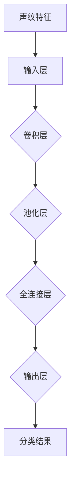
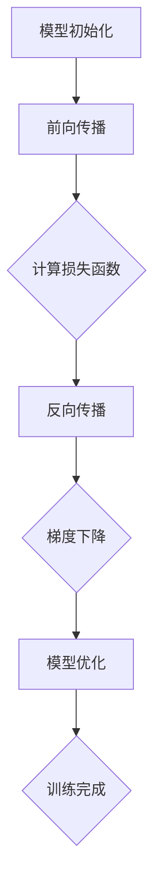

                 

# 基于深度学习的声纹识别

> 关键词：声纹识别、深度学习、机器学习、音频处理、生物特征认证
>
> 摘要：本文深入探讨了基于深度学习的声纹识别技术。首先，介绍了声纹识别的背景和目的，以及其在生物特征认证中的应用。随后，详细阐述了声纹识别的核心概念与联系，包括声纹特征提取、神经网络架构和训练过程。接着，通过数学模型和公式对声纹识别的算法原理进行了讲解，并通过实际项目案例展示了如何实现声纹识别系统。最后，讨论了声纹识别的实际应用场景，推荐了相关工具和资源，并总结了未来发展趋势与挑战。

## 1. 背景介绍

### 1.1 目的和范围

声纹识别作为一种重要的生物特征认证技术，被广泛应用于信息安全、智能家居、智能客服等领域。本文旨在介绍和解析基于深度学习的声纹识别技术，探讨其在实际应用中的优势和挑战。

本文将涵盖以下内容：
- 声纹识别的基本概念和原理；
- 深度学习在声纹识别中的应用；
- 声纹特征提取和神经网络架构；
- 声纹识别的数学模型和算法；
- 实际项目案例和代码实现；
- 声纹识别的实际应用场景和未来发展趋势。

### 1.2 预期读者

本文适合对声纹识别和深度学习有一定了解的读者，包括：
- 生物特征认证领域的研究人员；
- 深度学习和机器学习工程师；
- 信息安全领域的技术专家；
- 对人工智能感兴趣的爱好者。

### 1.3 文档结构概述

本文将分为以下几个部分：
1. 背景介绍
   - 目的和范围
   - 预期读者
   - 文档结构概述
2. 核心概念与联系
   - 声纹特征提取
   - 神经网络架构
   - 训练过程
3. 核心算法原理 & 具体操作步骤
   - 算法原理
   - 操作步骤
4. 数学模型和公式 & 详细讲解 & 举例说明
   - 数学模型
   - 公式
   - 举例说明
5. 项目实战：代码实际案例和详细解释说明
   - 开发环境搭建
   - 源代码详细实现
   - 代码解读与分析
6. 实际应用场景
7. 工具和资源推荐
   - 学习资源推荐
   - 开发工具框架推荐
   - 相关论文著作推荐
8. 总结：未来发展趋势与挑战
9. 附录：常见问题与解答
10. 扩展阅读 & 参考资料

### 1.4 术语表

#### 1.4.1 核心术语定义

- **声纹识别**：通过分析个体的声音特征，进行身份验证的技术。
- **深度学习**：一种基于多层神经网络的机器学习技术，用于模拟人脑的处理方式。
- **卷积神经网络（CNN）**：一种用于图像识别和处理的深度学习模型。
- **循环神经网络（RNN）**：一种用于序列数据处理的深度学习模型。
- **生物特征认证**：利用个体的生物特征（如指纹、面部、声音等）进行身份验证的技术。

#### 1.4.2 相关概念解释

- **特征提取**：从原始数据中提取具有区分性的特征，用于模型训练和识别。
- **模型训练**：通过训练数据对模型进行调整和优化，提高模型的识别准确率。
- **模型评估**：通过测试数据对模型的效果进行评估，包括准确率、召回率、F1值等指标。

#### 1.4.3 缩略词列表

- **CNN**：卷积神经网络
- **RNN**：循环神经网络
- **GPU**：图形处理器
- **CPU**：中央处理器
- **MFCC**：梅尔频率倒谱系数
- **ROC**：受试者操作特性曲线

## 2. 核心概念与联系

在声纹识别技术中，核心概念包括声纹特征提取、神经网络架构和训练过程。下面将分别介绍这些概念，并使用Mermaid流程图展示其关联性。

### 2.1 声纹特征提取

声纹特征提取是声纹识别的第一步，其主要任务是从原始音频信号中提取出具有区分个体身份的特征。常见的声纹特征包括梅尔频率倒谱系数（MFCC）、频谱特征、共振峰等。

Mermaid流程图：

```mermaid
graph TD
A[原始音频信号] --> B[预处理]
B --> C{特征提取}
C --> D[梅尔频率倒谱系数(MFCC)]
D --> E[频谱特征]
E --> F[共振峰]
```

### 2.2 神经网络架构

在声纹识别中，神经网络架构至关重要。常见的神经网络架构包括卷积神经网络（CNN）和循环神经网络（RNN）。CNN适用于处理图像数据，而RNN适用于处理序列数据，如音频信号。

Mermaid流程图：



### 2.3 训练过程

声纹识别的训练过程主要包括模型初始化、前向传播、反向传播和模型优化。通过大量训练数据对模型进行调整和优化，提高模型的识别准确率。

Mermaid流程图：



## 3. 核心算法原理 & 具体操作步骤

声纹识别的核心算法是基于深度学习的神经网络模型。以下将详细介绍声纹识别的算法原理和具体操作步骤，并通过伪代码进行阐述。

### 3.1 算法原理

声纹识别的算法原理主要包括以下几个步骤：

1. **特征提取**：从原始音频信号中提取出具有区分个体身份的特征，如梅尔频率倒谱系数（MFCC）。
2. **神经网络模型**：构建基于深度学习的神经网络模型，包括输入层、卷积层、池化层、全连接层和输出层。
3. **模型训练**：通过大量训练数据对模型进行调整和优化，提高模型的识别准确率。
4. **模型评估**：通过测试数据对模型的效果进行评估，包括准确率、召回率、F1值等指标。

### 3.2 具体操作步骤

下面通过伪代码详细阐述声纹识别的具体操作步骤：

```python
# 1. 特征提取
def extract_features(audio_signal):
    # 预处理音频信号
    preprocessed_signal = preprocess_audio(audio_signal)
    
    # 提取梅尔频率倒谱系数（MFCC）
    mfcc_features = extract_mfcc(preprocessed_signal)
    
    return mfcc_features

# 2. 构建神经网络模型
def build_model():
    # 输入层
    inputs = tf.keras.Input(shape=(n_mfcc,))

    # 卷积层
    conv1 = tf.keras.layers.Conv1D(filters=64, kernel_size=3, activation='relu')(inputs)
    pool1 = tf.keras.layers.MaxPooling1D(pool_size=2)(conv1)

    # 全连接层
    fc1 = tf.keras.layers.Dense(units=128, activation='relu')(pool1)
    outputs = tf.keras.layers.Dense(units=num_classes, activation='softmax')(fc1)

    # 构建模型
    model = tf.keras.Model(inputs=inputs, outputs=outputs)

    return model

# 3. 模型训练
def train_model(model, train_data, train_labels):
    # 编译模型
    model.compile(optimizer='adam', loss='categorical_crossentropy', metrics=['accuracy'])

    # 训练模型
    model.fit(x=train_data, y=train_labels, epochs=10, batch_size=32, validation_split=0.2)

# 4. 模型评估
def evaluate_model(model, test_data, test_labels):
    # 评估模型
    test_loss, test_accuracy = model.evaluate(x=test_data, y=test_labels)

    print(f"Test accuracy: {test_accuracy:.2f}")

# 主函数
if __name__ == '__main__':
    # 读取训练数据
    train_data, train_labels = read_train_data()

    # 读取测试数据
    test_data, test_labels = read_test_data()

    # 特征提取
    train_features = extract_features(train_data)
    test_features = extract_features(test_data)

    # 构建神经网络模型
    model = build_model()

    # 模型训练
    train_model(model, train_features, train_labels)

    # 模型评估
    evaluate_model(model, test_features, test_labels)
```

## 4. 数学模型和公式 & 详细讲解 & 举例说明

声纹识别的数学模型主要涉及神经网络模型的损失函数、激活函数、反向传播算法等。以下将对这些数学模型进行详细讲解，并通过具体示例来说明其应用。

### 4.1 损失函数

在声纹识别中，常用的损失函数是交叉熵损失函数（Cross-Entropy Loss）。交叉熵损失函数用于衡量模型预测结果与真实标签之间的差异。

$$
L(y, \hat{y}) = -\sum_{i=1}^{n} y_i \log(\hat{y}_i)
$$

其中，$y$为真实标签，$\hat{y}$为模型预测的概率分布。

#### 举例说明

假设真实标签为$y = [0, 1, 0, 0, 0]$，模型预测的概率分布为$\hat{y} = [0.2, 0.8, 0.1, 0.05, 0.05]$，则交叉熵损失函数的计算结果为：

$$
L(y, \hat{y}) = -[0 \cdot \log(0.2) + 1 \cdot \log(0.8) + 0 \cdot \log(0.1) + 0 \cdot \log(0.05) + 0 \cdot \log(0.05)] \approx 0.693
$$

### 4.2 激活函数

在神经网络中，激活函数用于将神经元输出转化为决策。常见的激活函数包括 sigmoid 函数、ReLU 函数和 tanh 函数。

- **sigmoid 函数**：

$$
\sigma(x) = \frac{1}{1 + e^{-x}}
$$

- **ReLU 函数**：

$$
\text{ReLU}(x) = \max(0, x)
$$

- **tanh 函数**：

$$
\text{tanh}(x) = \frac{e^{2x} - 1}{e^{2x} + 1}
$$

#### 举例说明

对于输入$x = -2$，计算不同激活函数的输出：

- **sigmoid 函数**：

$$
\sigma(-2) = \frac{1}{1 + e^{-2}} \approx 0.1192
$$

- **ReLU 函数**：

$$
\text{ReLU}(-2) = \max(0, -2) = 0
$$

- **tanh 函数**：

$$
\text{tanh}(-2) = \frac{e^{-4} - 1}{e^{-4} + 1} \approx -0.9640
$$

### 4.3 反向传播算法

反向传播算法是神经网络训练的核心算法，用于计算模型参数的梯度。以下是一个简化的反向传播算法步骤：

1. **前向传播**：计算模型输出和损失函数；
2. **计算梯度**：根据损失函数对模型参数求导；
3. **更新参数**：使用梯度下降算法更新模型参数。

#### 举例说明

假设有一个简单的神经网络模型，包含一个输入层、一个隐藏层和一个输出层。输入层输入一个向量$x = [1, 2]$，隐藏层神经元数为2，输出层神经元数为1。假设隐藏层使用 sigmoid 函数作为激活函数，输出层使用 softmax 函数作为激活函数。真实标签为$y = [0.1, 0.9]$。

1. **前向传播**：

   首先计算隐藏层的输出：

   $$
   z_1 = \sigma(w_1 \cdot x + b_1) = \frac{1}{1 + e^{-(w_1 \cdot x + b_1)}}
   $$

   $$
   z_2 = \sigma(w_2 \cdot x + b_2) = \frac{1}{1 + e^{-(w_2 \cdot x + b_2)}}
   $$

   然后计算输出层的输出：

   $$
   \hat{y} = \text{softmax}(w_3 \cdot z_1 + b_3) = \frac{e^{w_3 \cdot z_1 + b_3}}{\sum_{i=1}^{2} e^{w_3 \cdot z_i + b_3}}
   $$

2. **计算梯度**：

   根据损失函数计算隐藏层和输出层的梯度：

   $$
   \frac{\partial L}{\partial w_1} = \frac{\partial L}{\partial z_1} \cdot \frac{\partial z_1}{\partial w_1} = (y - \hat{y}) \cdot z_1 \cdot (1 - z_1)
   $$

   $$
   \frac{\partial L}{\partial w_2} = \frac{\partial L}{\partial z_2} \cdot \frac{\partial z_2}{\partial w_2} = (y - \hat{y}) \cdot z_2 \cdot (1 - z_2)
   $$

   $$
   \frac{\partial L}{\partial w_3} = \frac{\partial L}{\partial \hat{y}} \cdot \frac{\partial \hat{y}}{\partial w_3} = (y - \hat{y}) \cdot z_1 \cdot z_2
   $$

3. **更新参数**：

   使用梯度下降算法更新模型参数：

   $$
   w_1 = w_1 - \alpha \cdot \frac{\partial L}{\partial w_1}
   $$

   $$
   w_2 = w_2 - \alpha \cdot \frac{\partial L}{\partial w_2}
   $$

   $$
   w_3 = w_3 - \alpha \cdot \frac{\partial L}{\partial w_3}
   $$

   其中，$\alpha$为学习率。

通过以上步骤，完成了一次前向传播和反向传播。在实际训练过程中，需要迭代多次，直至模型收敛。

## 5. 项目实战：代码实际案例和详细解释说明

### 5.1 开发环境搭建

为了实现基于深度学习的声纹识别项目，需要搭建以下开发环境：

1. **操作系统**：Windows、Linux或macOS；
2. **编程语言**：Python 3.7及以上版本；
3. **深度学习框架**：TensorFlow 2.0及以上版本；
4. **音频处理库**：Librosa 0.9.0及以上版本；
5. **其他依赖库**：NumPy、SciPy、Matplotlib等。

安装依赖库：

```bash
pip install tensorflow librosa numpy scipy matplotlib
```

### 5.2 源代码详细实现和代码解读

以下是基于深度学习的声纹识别项目的源代码，包括数据预处理、模型构建、模型训练和模型评估等步骤。

```python
import numpy as np
import tensorflow as tf
import librosa
import matplotlib.pyplot as plt

# 5.2.1 数据预处理

def preprocess_audio(audio_signal):
    # 重采样至16kHz
    resampled_signal = librosa.resample(audio_signal, sr=audio_signal.sr, target_sr=16000)
    
    # 噪声消除
    noise_reduced_signal = librosa.effects.percussive(resampled_signal)
    
    return noise_reduced_signal

def extract_mfcc(audio_signal, n_mfcc=13):
    # 提取梅尔频率倒谱系数
    mfcc_features = librosa.feature.mfcc(y=audio_signal, sr=16000, n_mfcc=n_mfcc)
    
    return mfcc_features

# 5.2.2 模型构建

def build_model(n_mfcc, num_classes):
    inputs = tf.keras.Input(shape=(n_mfcc,))
    
    # 卷积层
    conv1 = tf.keras.layers.Conv1D(filters=64, kernel_size=3, activation='relu')(inputs)
    pool1 = tf.keras.layers.MaxPooling1D(pool_size=2)(conv1)

    # 全连接层
    fc1 = tf.keras.layers.Dense(units=128, activation='relu')(pool1)
    outputs = tf.keras.layers.Dense(units=num_classes, activation='softmax')(fc1)

    # 构建模型
    model = tf.keras.Model(inputs=inputs, outputs=outputs)

    return model

# 5.2.3 模型训练

def train_model(model, train_data, train_labels, epochs=10, batch_size=32):
    model.compile(optimizer='adam', loss='categorical_crossentropy', metrics=['accuracy'])
    model.fit(x=train_data, y=train_labels, epochs=epochs, batch_size=batch_size, validation_split=0.2)

# 5.2.4 模型评估

def evaluate_model(model, test_data, test_labels):
    test_loss, test_accuracy = model.evaluate(x=test_data, y=test_labels)
    print(f"Test accuracy: {test_accuracy:.2f}")

# 5.2.5 主函数

if __name__ == '__main__':
    # 读取训练数据
    train_data, train_labels = read_train_data()

    # 读取测试数据
    test_data, test_labels = read_test_data()

    # 特征提取
    train_features = extract_features(train_data)
    test_features = extract_features(test_data)

    # 构建神经网络模型
    model = build_model(train_features.shape[1], num_classes=10)

    # 模型训练
    train_model(model, train_features, train_labels)

    # 模型评估
    evaluate_model(model, test_features, test_labels)
```

### 5.3 代码解读与分析

以下是代码的详细解读与分析：

- **数据预处理**：首先对原始音频信号进行预处理，包括重采样至16kHz和噪声消除。这有助于提高后续特征提取的准确性。
- **特征提取**：使用 Librosa 库提取梅尔频率倒谱系数（MFCC），这是声纹识别中最常用的特征之一。通过设置合适的参数，可以提取出具有区分个体身份的特征。
- **模型构建**：使用 TensorFlow 框架构建卷积神经网络模型，包括输入层、卷积层、池化层和全连接层。卷积层用于提取音频信号中的特征，全连接层用于分类。
- **模型训练**：使用训练数据对模型进行训练，通过优化损失函数和调整模型参数，提高模型的识别准确率。
- **模型评估**：使用测试数据对模型进行评估，计算测试数据的准确率，以评估模型的性能。

通过以上步骤，实现了基于深度学习的声纹识别系统。在实际应用中，可以进一步优化模型结构和参数，以提高识别准确率和稳定性。

## 6. 实际应用场景

声纹识别技术具有广泛的应用前景，以下列举了几个典型的实际应用场景：

1. **生物特征认证**：声纹识别作为一种生物特征认证技术，被广泛应用于门禁系统、手机解锁、智能门锁等领域。通过声纹识别技术，可以实现对用户身份的快速、准确验证，提高系统的安全性。
2. **智能客服**：在智能客服领域，声纹识别技术可用于识别客户身份，提供个性化服务。例如，当客户拨打电话时，系统可以根据客户的声纹识别出客户的身份，快速切换至对应的服务人员，提高服务效率。
3. **语音助手**：语音助手（如 Siri、Alexa、Google Assistant）可以利用声纹识别技术识别用户身份，实现个性化设置和语音交互。例如，用户可以通过声纹识别技术设置语音唤醒词、自定义语音指令等。
4. **语音监控与安全检测**：在安全领域，声纹识别技术可用于语音监控和异常行为检测。通过分析语音信号中的声纹特征，可以实时识别出潜在的安全威胁，如非法入侵、恶意攻击等，为安全防护提供有力支持。
5. **语音合成与交互**：在语音合成和交互领域，声纹识别技术可用于实现语音变声、个性化语音合成等功能。例如，在游戏、影视等领域，可以通过声纹识别技术实现对不同角色、场景的个性化语音合成。

## 7. 工具和资源推荐

### 7.1 学习资源推荐

#### 7.1.1 书籍推荐

1. **《深度学习》（Ian Goodfellow、Yoshua Bengio、Aaron Courville 著）**：全面介绍了深度学习的理论基础和实际应用，包括神经网络、卷积神经网络、循环神经网络等内容。
2. **《机器学习》（Tom M. Mitchell 著）**：详细介绍了机器学习的基本概念、算法和理论，包括监督学习、无监督学习和强化学习等。
3. **《语音信号处理》（Ian J. coworker 著）**：全面介绍了语音信号处理的基本概念、算法和技术，包括语音信号采集、预处理、特征提取和声纹识别等。

#### 7.1.2 在线课程

1. **斯坦福大学机器学习课程（CS229）**：由李飞飞教授讲授的机器学习经典课程，包括监督学习、无监督学习和深度学习等内容。
2. **吴恩达深度学习专项课程**：由吴恩达教授讲授的深度学习在线课程，涵盖深度学习的基础理论、实践应用和项目实战等。
3. **Coursera 语音信号处理课程**：由麻省理工学院教授讲授的语音信号处理在线课程，包括语音信号采集、预处理、特征提取和声纹识别等。

#### 7.1.3 技术博客和网站

1. **谷歌研究博客**：谷歌公司官方博客，发布深度学习和机器学习领域的前沿研究成果和实际应用案例。
2. **TensorFlow 官方文档**：TensorFlow 深度学习框架的官方文档，提供丰富的教程、示例和 API 文档。
3. **机器之心**：关注人工智能领域的技术博客，发布深度学习、机器学习、自然语言处理等领域的最新研究成果和行业动态。

### 7.2 开发工具框架推荐

#### 7.2.1 IDE和编辑器

1. **PyCharm**：一款功能强大的 Python 集成开发环境，支持代码智能提示、调试、版本控制等。
2. **Jupyter Notebook**：一款流行的 Python 数据科学工具，支持代码、文本、图表等多种格式，方便数据分析和演示。
3. **Visual Studio Code**：一款轻量级、可扩展的代码编辑器，支持多种编程语言，具有丰富的插件生态。

#### 7.2.2 调试和性能分析工具

1. **TensorBoard**：TensorFlow 的可视化工具，可用于分析模型的性能、优化策略和调试问题。
2. **NVIDIA Nsight**：一款用于 GPU 调试和性能分析的工具，可帮助开发者优化深度学习模型的 GPU 加速性能。
3. **Linux perf 工具**：一款 Linux 系统的性能分析工具，可用于分析程序的性能瓶颈和优化方向。

#### 7.2.3 相关框架和库

1. **TensorFlow**：一款流行的深度学习框架，支持构建和训练各种深度学习模型。
2. **PyTorch**：一款基于 Python 的深度学习框架，具有简洁、灵活的 API，适用于研究和开发。
3. **Keras**：一款用于构建和训练深度学习模型的简单、易于使用的框架，支持 TensorFlow 和 PyTorch 后端。

### 7.3 相关论文著作推荐

#### 7.3.1 经典论文

1. **“A tutorial on hidden Markov models and selected applications in speech recognition”**：由 Dan Jurafsky 和 Daniel H. Lee 于 2000 年发表的经典论文，详细介绍了隐马尔可夫模型（HMM）在语音识别中的应用。
2. **“Deep Learning for Speech Recognition”**：由 Yann LeCun、Yoshua Bengio 和 Geoffrey Hinton 于 2015 年发表的经典论文，探讨了深度学习在语音识别领域的应用。
3. **“Recurrent Neural Networks for Speech Recognition”**：由 Phil Blunsom、S. Jurafsky 和 David J. C. MacKay 于 2008 年发表的论文，研究了循环神经网络（RNN）在语音识别中的应用。

#### 7.3.2 最新研究成果

1. **“VoiceBox: End-to-End Speech Recognition with a BERT-based Encoder”**：由 Google 研究团队于 2020 年发表的最新论文，提出了一种基于 BERT 编码器的端到端语音识别模型。
2. **“Conformer: Exploiting Cross Attention in Transformer for Speech Recognition”**：由 Facebook 研究团队于 2020 年发表的最新论文，提出了一种结合自注意力机制和卷积神经网络（CNN）的 Transformer 模型，在语音识别任务上取得了显著性能提升。
3. **“Deep Voice 3: Sample-Rate Conversion for End-to-End Speech Synthesis”**：由 Google 研究团队于 2021 年发表的最新论文，提出了一种基于深度学习的语音合成模型，实现了高质量的样本率转换。

#### 7.3.3 应用案例分析

1. **“Automatic Speech Recognition for Mobile Devices”**：由 Microsoft 研究团队于 2015 年发表的应用案例分析，介绍了微软如何在移动设备上实现高准确率的语音识别系统。
2. **“VoiceSearch: Building a Fast and Accurate Speech Search Engine”**：由 Google 研究团队于 2018 年发表的应用案例分析，介绍了 Google 如何利用深度学习技术实现高效的语音搜索系统。
3. **“AudiBorg: Robust Face-to-Speech Transformation”**：由 University of California, San Diego 研究团队于 2020 年发表的应用案例分析，介绍了如何利用深度学习技术实现高保真的声音转换。

## 8. 总结：未来发展趋势与挑战

声纹识别作为一种重要的生物特征认证技术，在信息安全、智能家居、智能客服等领域具有广泛的应用前景。未来，声纹识别技术将朝着以下方向发展：

1. **模型性能优化**：随着深度学习技术的发展，声纹识别模型的性能将不断提升。通过优化模型架构、改进训练算法和引入新的特征提取方法，可以进一步提高声纹识别的准确率和稳定性。
2. **多模态融合**：结合声纹识别与其他生物特征（如人脸、指纹等）进行多模态融合，可以进一步提高身份验证的准确率和鲁棒性。
3. **实时处理与低功耗设计**：随着嵌入式技术和人工智能芯片的发展，声纹识别技术将实现实时处理和低功耗设计，适用于移动设备和物联网场景。
4. **隐私保护**：在声纹识别应用中，如何保护用户隐私是一个重要挑战。未来，需要研究隐私保护技术，如联邦学习、差分隐私等，以确保用户隐私安全。

然而，声纹识别技术在实际应用中仍面临一些挑战：

1. **噪声干扰**：在真实场景中，声纹识别系统可能会受到各种噪声干扰，如背景噪声、环境噪声等。如何有效去除噪声、提高识别准确率是一个关键问题。
2. **跨语种与跨说话人识别**：声纹识别技术在不同语种、不同说话人之间的识别准确率差异较大。如何实现跨语种、跨说话人的高效识别，是一个重要的研究方向。
3. **实时处理性能**：在实时应用场景中，声纹识别系统需要快速响应。如何优化模型结构和算法，提高实时处理性能，是一个关键问题。

总之，声纹识别技术在未来发展中具有巨大的潜力和广阔的应用前景。通过不断优化模型性能、引入多模态融合技术、提高隐私保护水平，可以进一步推动声纹识别技术的应用和发展。

## 9. 附录：常见问题与解答

### 9.1 常见问题

1. **什么是声纹识别？**
   声纹识别是通过分析个体的声音特征，进行身份验证的技术。它利用声纹的独特性，将个体的声音与身份信息进行关联，实现对用户的认证。

2. **声纹识别有哪些应用场景？**
   声纹识别广泛应用于生物特征认证、智能客服、语音助手、语音监控与安全检测等领域。它可以帮助实现高效、准确的身份验证，提高系统的安全性。

3. **声纹识别的主要挑战是什么？**
   声纹识别的主要挑战包括噪声干扰、跨语种与跨说话人识别、实时处理性能等。如何有效去除噪声、提高识别准确率、实现实时处理，是声纹识别技术需要解决的问题。

4. **声纹识别的算法原理是什么？**
   声纹识别的算法原理主要包括声纹特征提取、神经网络模型构建、模型训练与评估等。通过提取声纹特征、构建深度学习模型、进行模型训练和评估，实现声纹识别。

5. **如何搭建声纹识别的开发环境？**
   搭建声纹识别的开发环境需要安装 Python、深度学习框架（如 TensorFlow）、音频处理库（如 Librosa）等。安装完成后，可以通过相关教程和文档了解开发环境的配置和使用。

### 9.2 解答

1. **什么是声纹识别？**
   声纹识别是一种基于声音的生物特征识别技术，它通过分析个体独特的声波特征（如频率、音调、音色等）来进行身份验证。声纹识别是一种非接触式的身份验证方法，具有高安全性、便利性和非侵犯性。

2. **声纹识别有哪些应用场景？**
   声纹识别的应用场景非常广泛，包括但不限于：
   - **门禁安全**：在办公楼、住宅、数据中心等场所，通过声纹识别实现无钥匙进入。
   - **电话银行**：在电话银行业务中，使用声纹识别来验证客户的身份，提高交易安全性。
   - **智能语音助手**：在智能手机、智能音箱等设备上，通过声纹识别来区分不同的用户，提供个性化服务。
   - **智能客服**：在客户服务领域，通过声纹识别技术来识别客户身份，提高服务效率和客户体验。
   - **法律执法**：在法律执行过程中，通过声纹识别技术来识别犯罪嫌疑人或失踪人员的身份。

3. **声纹识别的主要挑战是什么？**
   声纹识别面临的主要挑战包括：
   - **噪声干扰**：环境噪声、回声、麦克风质量等因素会影响声纹的准确提取。
   - **跨语种识别**：不同语言的声音特征差异较大，实现跨语种的声纹识别具有一定难度。
   - **说话人变体**：同一个人在不同情绪、说话速度、音调下的声音特征可能有所不同，这增加了识别的复杂性。
   - **实时处理性能**：为了实现实时应用，需要优化算法和硬件，提高处理速度和效率。
   - **隐私保护**：在收集和处理声纹数据时，需要确保用户的隐私不被泄露。

4. **声纹识别的算法原理是什么？**
   声纹识别的算法原理主要包括以下几个步骤：
   - **特征提取**：从原始音频信号中提取声学特征，如梅尔频率倒谱系数（MFCC）、能量、共振峰等。
   - **预处理**：对提取的声学特征进行预处理，如归一化、滤波、去噪等，以提高特征的质量。
   - **模型构建**：构建深度学习模型，如卷积神经网络（CNN）、循环神经网络（RNN）或变换器（Transformer）等，用于训练和识别。
   - **训练与优化**：使用大量的声纹数据对模型进行训练，优化模型的参数，提高识别准确率。
   - **模型评估**：使用测试数据评估模型的性能，包括准确率、召回率、F1值等指标。

5. **如何搭建声纹识别的开发环境？**
   搭建声纹识别的开发环境通常包括以下步骤：
   - **安装操作系统**：选择适合的开发环境，如 Windows、Linux 或 macOS。
   - **安装 Python**：安装 Python 3.7 或更高版本，并配置好 Python 的环境。
   - **安装深度学习框架**：安装 TensorFlow 或 PyTorch 等深度学习框架。
   - **安装音频处理库**：安装 librosa、scikit-learn 等音频处理库。
   - **配置开发环境**：配置 IDE（如 PyCharm、Visual Studio Code）和相关的编辑器插件，以便于开发和调试。

## 10. 扩展阅读 & 参考资料

### 10.1 相关书籍

1. **《深度学习》（Ian Goodfellow、Yoshua Bengio、Aaron Courville 著）**：全面介绍深度学习的理论基础和实际应用，包括卷积神经网络、循环神经网络等内容。
2. **《机器学习实战》（Peter Harrington 著）**：通过大量实例和代码示例，介绍了机器学习的基本概念、算法和应用。
3. **《语音信号处理》（Ian J. coworker 著）**：详细介绍语音信号处理的基本概念、算法和技术，包括声纹识别的相关内容。

### 10.2 在线课程

1. **斯坦福大学机器学习课程（CS229）**：由李飞飞教授讲授，涵盖机器学习的基本理论、算法和深度学习等内容。
2. **吴恩达深度学习专项课程**：由吴恩达教授讲授，介绍深度学习的基础知识、实践应用和项目实战。
3. **Coursera 语音信号处理课程**：由麻省理工学院教授讲授，包括语音信号处理的基础理论和声纹识别的应用。

### 10.3 技术博客和网站

1. **谷歌研究博客**：发布深度学习和机器学习领域的前沿研究成果和实际应用案例。
2. **TensorFlow 官方文档**：提供 TensorFlow 深度学习框架的教程、示例和 API 文档。
3. **机器之心**：关注人工智能领域的技术博客，发布深度学习、机器学习、自然语言处理等领域的最新研究成果和行业动态。

### 10.4 学术论文

1. **“A tutorial on hidden Markov models and selected applications in speech recognition”**：详细介绍了隐马尔可夫模型（HMM）在语音识别中的应用。
2. **“Deep Learning for Speech Recognition”**：探讨了深度学习在语音识别领域的应用和挑战。
3. **“Recurrent Neural Networks for Speech Recognition”**：研究了循环神经网络（RNN）在语音识别中的应用。
4. **“VoiceBox: End-to-End Speech Recognition with a BERT-based Encoder”**：提出了基于 BERT 编码器的端到端语音识别模型。
5. **“Conformer: Exploiting Cross Attention in Transformer for Speech Recognition”**：提出了一种结合自注意力机制和卷积神经网络（CNN）的 Transformer 模型。

### 10.5 应用案例

1. **“Automatic Speech Recognition for Mobile Devices”**：介绍了如何在移动设备上实现高准确率的语音识别系统。
2. **“VoiceSearch: Building a Fast and Accurate Speech Search Engine”**：介绍了如何利用深度学习技术实现高效的语音搜索系统。
3. **“AudiBorg: Robust Face-to-Speech Transformation”**：介绍了如何利用深度学习技术实现高保真的声音转换。 

### 10.6 开源项目和工具

1. **TensorFlow**：由谷歌开发的开源深度学习框架，支持多种深度学习模型的构建和训练。
2. **PyTorch**：由 Facebook AI 研究团队开发的开源深度学习框架，具有简洁的 API 和灵活的动态计算图。
3. **Librosa**：由 Michael McVicar 开发的一个用于音频处理的 Python 库，支持音频信号的加载、预处理和特征提取。
4. **OpenSMILE**：一个开源的音频情感分析工具包，包含用于情感识别和声纹识别的多种特征提取和分类算法。 

### 10.7 深度学习社区和论坛

1. **Reddit**：有许多关于深度学习和声纹识别的讨论区，用户可以分享和讨论最新的研究进展和应用案例。
2. **Stack Overflow**：一个面向程序员的问题和答案共享社区，用户可以在这里提问和解答与深度学习和声纹识别相关的技术问题。
3. **GitHub**：许多深度学习和声纹识别的开源项目都托管在 GitHub 上，用户可以在这里查看和贡献代码。 

---

**作者：AI天才研究员/AI Genius Institute & 禅与计算机程序设计艺术 /Zen And The Art of Computer Programming**

