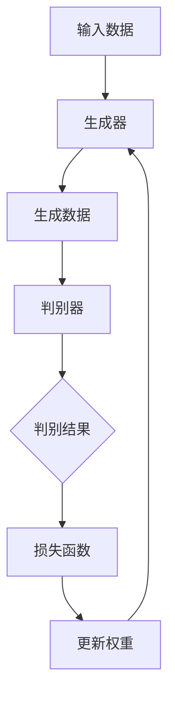
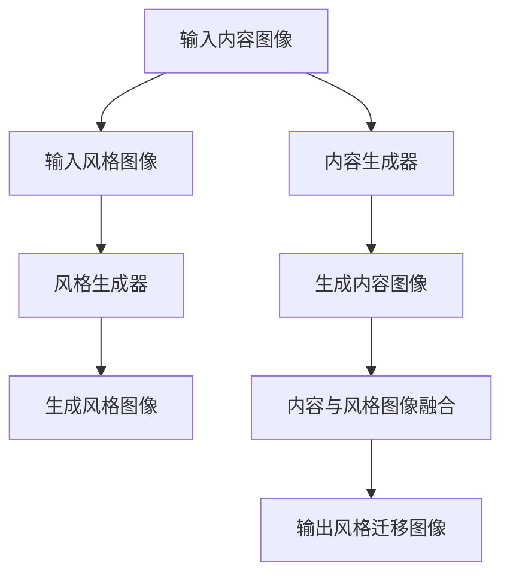
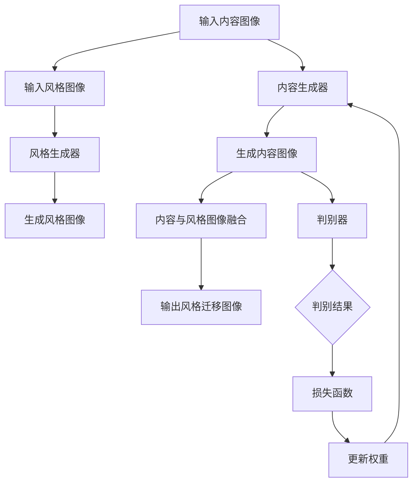

                 

# 基于生成对抗网络的图像风格迁移竞赛平台建设

## 关键词

- 生成对抗网络（GAN）
- 图像风格迁移
- 竞赛平台
- 算法优化
- 实践应用

## 摘要

本文旨在探讨如何构建一个基于生成对抗网络（GAN）的图像风格迁移竞赛平台。我们将从背景介绍、核心概念、算法原理、数学模型、实战案例、实际应用等多个方面展开分析，帮助读者全面了解图像风格迁移技术及其在竞赛平台中的应用。文章还将推荐相关学习资源和工具，为读者提供进一步探索和实践的机会。通过本文，读者将能够掌握图像风格迁移技术的基本原理，并了解如何将其应用于竞赛平台建设。

## 1. 背景介绍

### 1.1 目的和范围

本文的目的是探讨如何构建一个基于生成对抗网络（GAN）的图像风格迁移竞赛平台。该平台旨在为研究人员、开发者以及爱好者提供一个展示和交流图像风格迁移技术的平台，通过竞赛的形式推动算法的优化和创新。本文将涵盖以下内容：

1. 生成对抗网络（GAN）的基本原理及其在图像风格迁移中的应用。
2. 图像风格迁移竞赛平台的设计与实现。
3. 实际应用场景及挑战。
4. 相关学习资源和工具的推荐。

### 1.2 预期读者

本文的预期读者主要包括以下几类：

1. 计算机视觉和人工智能领域的科研人员、工程师。
2. 对图像风格迁移技术感兴趣的开发者和爱好者。
3. 想要构建和优化图像风格迁移算法的竞赛组织者。

### 1.3 文档结构概述

本文结构如下：

1. 背景介绍：介绍本文的目的、范围、预期读者及文档结构。
2. 核心概念与联系：阐述生成对抗网络（GAN）和图像风格迁移的基本概念及相互关系。
3. 核心算法原理 & 具体操作步骤：讲解生成对抗网络（GAN）在图像风格迁移中的具体实现。
4. 数学模型和公式 & 详细讲解 & 举例说明：介绍图像风格迁移中的数学模型和公式。
5. 项目实战：代码实际案例和详细解释说明。
6. 实际应用场景：探讨图像风格迁移竞赛平台在实际应用中的场景和挑战。
7. 工具和资源推荐：推荐学习资源和开发工具。
8. 总结：未来发展趋势与挑战。
9. 附录：常见问题与解答。
10. 扩展阅读 & 参考资料：提供进一步阅读和参考资料。

### 1.4 术语表

#### 1.4.1 核心术语定义

- **生成对抗网络（GAN）**：一种深度学习框架，由生成器和判别器组成，用于生成与真实数据相似的数据。
- **图像风格迁移**：将一种图像的样式应用到另一种图像上，使其具有目标图像的风格。
- **竞赛平台**：一个为参赛者提供展示和交流的平台，通常包括竞赛规则、评分机制、代码托管和共享等功能。

#### 1.4.2 相关概念解释

- **生成器（Generator）**：GAN中的生成器负责生成与真实数据相似的数据。
- **判别器（Discriminator）**：GAN中的判别器负责判断生成器生成的数据是否真实。
- **损失函数（Loss Function）**：衡量生成器和判别器之间差距的函数。

#### 1.4.3 缩略词列表

- GAN：生成对抗网络（Generative Adversarial Network）
- CNN：卷积神经网络（Convolutional Neural Network）
- GPU：图形处理单元（Graphics Processing Unit）
- CUDA：并行计算平台和编程模型（Compute Unified Device Architecture）

## 2. 核心概念与联系

在本节中，我们将深入探讨生成对抗网络（GAN）和图像风格迁移的核心概念及其相互关系。为了更好地理解这两个概念，我们将使用Mermaid流程图来展示它们之间的联系。

### 2.1. 生成对抗网络（GAN）

生成对抗网络（GAN）是一种基于深度学习的框架，由生成器和判别器组成。生成器的目的是生成与真实数据相似的数据，而判别器的目的是区分真实数据和生成数据。

以下是一个简单的Mermaid流程图，展示了生成对抗网络（GAN）的基本架构：

### 2.2. 图像风格迁移

图像风格迁移是一种将一种图像的样式应用到另一种图像上的技术。通常，我们使用生成对抗网络（GAN）来实现图像风格迁移。生成对抗网络（GAN）的生成器负责生成具有目标图像风格的图像。

以下是一个简单的Mermaid流程图，展示了图像风格迁移的基本流程：

### 2.3. 核心概念与联系

通过上述两个Mermaid流程图，我们可以看出生成对抗网络（GAN）和图像风格迁移之间的联系。生成对抗网络（GAN）的生成器和判别器用于生成具有目标图像风格的图像，而图像风格迁移的关键在于如何将内容图像和风格图像融合，生成具有目标图像风格的输出图像。

通过上述流程图，我们可以更好地理解生成对抗网络（GAN）和图像风格迁移之间的联系和核心概念。

## 3. 核心算法原理 & 具体操作步骤

### 3.1. 生成对抗网络（GAN）原理

生成对抗网络（GAN）由生成器和判别器组成。生成器的目的是生成与真实数据相似的数据，而判别器的目的是区分真实数据和生成数据。生成器和判别器之间进行对抗训练，最终达到一个平衡状态。

#### 3.1.1. 生成器

生成器的输入是一个随机的噪声向量 \( z \)，通过一个前向神经网络生成与真实数据相似的数据 \( x' \)：

\[ G(z) = x' \]

其中，\( G \) 是一个前向神经网络，通常采用卷积神经网络（CNN）来实现。

#### 3.1.2. 判别器

判别器的输入是真实数据 \( x \) 和生成器生成的数据 \( x' \)，其目的是判断输入数据是真实数据还是生成数据：

\[ D(x) \] 和 \( D(x') \)

判别器也是一个前向神经网络，通常采用卷积神经网络（CNN）来实现。

#### 3.1.3. 损失函数

生成对抗网络（GAN）的训练过程是一个对抗过程，生成器和判别器之间相互竞争。生成器试图生成更真实的数据，而判别器试图区分真实数据和生成数据。训练过程中使用以下两个损失函数：

1. **判别器损失函数**：用于衡量判别器对真实数据和生成数据的判断能力。

\[ L_D = -[\log D(x) + \log(1 - D(x'))] \]

2. **生成器损失函数**：用于衡量生成器生成数据的质量。

\[ L_G = -[\log D(x')] \]

#### 3.1.4. 训练过程

生成对抗网络（GAN）的训练过程分为以下步骤：

1. 初始化生成器 \( G \) 和判别器 \( D \) 的参数。
2. 从数据集 \( X \) 中随机采样一个真实数据 \( x \) 和一个随机噪声向量 \( z \)。
3. 使用生成器 \( G \) 生成生成数据 \( x' \)。
4. 使用判别器 \( D \) 对真实数据 \( x \) 和生成数据 \( x' \) 进行判断。
5. 计算判别器损失函数 \( L_D \) 和生成器损失函数 \( L_G \)。
6. 使用梯度下降算法更新生成器 \( G \) 和判别器 \( D \) 的参数。
7. 重复步骤 2-6，直到生成器 \( G \) 和判别器 \( D \) 达到平衡状态。

### 3.2. 图像风格迁移算法原理

图像风格迁移算法的核心思想是将目标图像的样式应用到内容图像上。生成对抗网络（GAN）是实现图像风格迁移的一种有效方法。

#### 3.2.1. 内容生成器

内容生成器 \( G_c \) 负责生成具有目标图像风格的内容图像。内容生成器通常采用两个分支结构，一个分支用于生成内容图像，另一个分支用于生成风格图像。输入包括内容图像 \( x \) 和风格图像 \( y \)：

\[ G_c(x, y) = x' \]

其中，\( x' \) 是生成的内容图像。

#### 3.2.2. 风格生成器

风格生成器 \( G_s \) 负责生成具有目标图像风格的风

