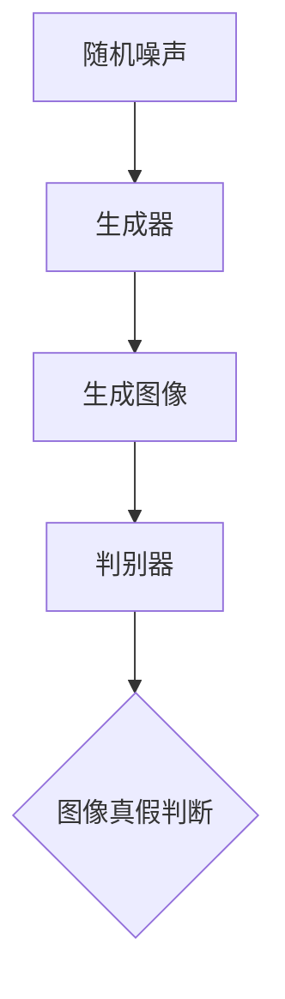
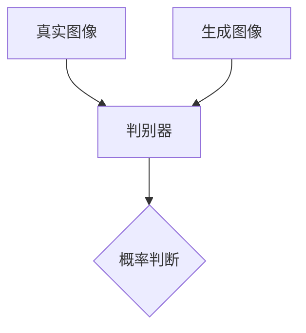
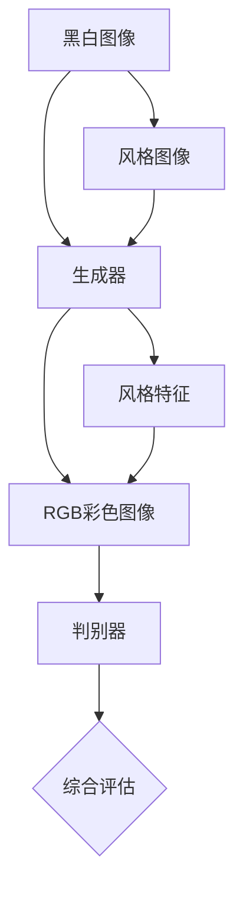

                 

# 基于生成对抗网络的自动图像上色与风格迁移一体化模型

## 关键词
- 生成对抗网络 (GAN)
- 图像上色
- 风格迁移
- 自动图像处理
- 深度学习

## 摘要
本文旨在探讨一种将图像上色与风格迁移集成于同一模型中的方法，基于生成对抗网络（GAN）。我们首先介绍了GAN的基本原理和结构，然后详细解析了如何利用GAN进行图像上色和风格迁移的算法原理与操作步骤。此外，本文通过数学模型和公式详细阐述了GAN在图像处理中的应用，并提供了实际项目实战的代码案例与解析。最后，我们分析了GAN在图像上色与风格迁移中的实际应用场景，并推荐了相关的学习资源、开发工具和最新研究成果。

## 1. 背景介绍

### 1.1 目的和范围
本文的目的是探讨生成对抗网络（GAN）在图像上色和风格迁移中的应用，特别是在将这两种图像处理任务整合到同一模型中的可行性。通过本文，读者将了解GAN的工作原理、图像上色与风格迁移的算法设计，以及如何在实际项目中应用这些算法。

### 1.2 预期读者
本文适用于对深度学习和生成对抗网络有一定了解的读者，包括计算机视觉领域的科研人员、开发者、以及对图像处理技术感兴趣的技术爱好者。

### 1.3 文档结构概述
本文将分为以下几个部分：
1. 背景介绍：介绍GAN的基本概念、图像上色与风格迁移的背景。
2. 核心概念与联系：通过流程图展示GAN的结构。
3. 核心算法原理 & 具体操作步骤：讲解GAN算法的原理和操作步骤。
4. 数学模型和公式：阐述GAN在图像处理中的数学模型。
5. 项目实战：提供实际代码案例。
6. 实际应用场景：分析GAN的应用场景。
7. 工具和资源推荐：推荐学习资源、开发工具和论文。
8. 总结：探讨未来发展趋势和挑战。
9. 附录：常见问题解答。
10. 扩展阅读：提供进一步学习的参考资料。

### 1.4 术语表

#### 1.4.1 核心术语定义
- **生成对抗网络（GAN）**：一种深度学习模型，由生成器和判别器组成，用于生成数据，通常用于图像生成、图像修复等任务。
- **图像上色（Colorization）**：将黑白图像转换为彩色图像的过程。
- **风格迁移（Style Transfer）**：将一种艺术风格应用到另一张图像上的过程。

#### 1.4.2 相关概念解释
- **生成器（Generator）**：GAN中的一个网络，其目的是生成与真实数据相似的伪数据。
- **判别器（Discriminator）**：GAN中的另一个网络，其目的是区分输入数据是真实数据还是生成数据。

#### 1.4.3 缩略词列表
- **GAN**：生成对抗网络（Generative Adversarial Network）
- **RGB**：红绿蓝色彩模型（Red, Green, Blue）
- **CNN**：卷积神经网络（Convolutional Neural Network）

## 2. 核心概念与联系

### 2.1 生成对抗网络（GAN）的结构

生成对抗网络（GAN）由两部分组成：生成器和判别器。这两个网络相互对抗，共同训练，以实现数据生成。

**生成器（Generator）**
生成器的目标是生成逼真的图像来欺骗判别器。通常，生成器接收一个随机噪声向量作为输入，通过一系列的变换生成图像。



**判别器（Discriminator）**
判别器的目标是判断输入图像是真实图像还是生成图像。它接收图像作为输入，并输出一个概率值，表示图像是真实图像的可能性。



### 2.2 图像上色与风格迁移的融合

将图像上色和风格迁移融合到GAN中，可以通过以下方式实现：

1. **共同输入**：将待上色的黑白图像和目标风格图像作为GAN的共同输入，生成器通过这些输入生成彩色且具有目标风格的上色图像。
2. **生成器结构**：生成器的输出层应该能够同时生成RGB彩色图像和风格特征。
3. **判别器评估**：判别器评估生成图像的三个部分：真实性、上色准确性和风格一致性。

通过这种方式，GAN可以同时实现图像上色和风格迁移，达到一体化处理的效果。



## 3. 核心算法原理 & 具体操作步骤

### 3.1 GAN算法原理

GAN的工作原理基于两个主要网络：生成器和判别器。

**生成器（Generator）**
生成器G的目的是生成与真实数据分布相似的伪数据。生成器的输入是一个随机噪声向量z，通过一系列变换生成伪数据。

伪代码：
```python
def generate(z):
    # z是随机噪声向量
    # x_gan是生成的伪数据
    x_gan = G(z)
    return x_gan
```

**判别器（Discriminator）**
判别器D的目的是判断输入数据是真实数据还是生成数据。判别器接收两个输入：真实数据x和生成数据x_gan。

伪代码：
```python
def discriminate(x, x_gan):
    # x是真实数据
    # x_gan是生成数据
    probability = D(x) - D(x_gan)
    return probability
```

**损失函数**
GAN的损失函数包括两部分：对抗损失和判别损失。

对抗损失：
```latex
L_{adversarial} = -\log(D(x)) - \log(1 - D(x_gan))
```

判别损失：
```latex
L_{discriminator} = -[\log(D(x)) + \log(1 - D(x_gan))]
```

总体损失函数：
```latex
L_{total} = L_{adversarial} + \lambda L_{discriminator}
```

其中，λ是一个超参数，用于平衡对抗损失和判别损失。

### 3.2 图像上色与风格迁移的算法设计

**输入**：黑白图像、风格图像、噪声向量。

**步骤**：

1. **共同输入**：将黑白图像和风格图像作为输入，与噪声向量共同输入生成器。
2. **生成器输出**：生成器输出RGB彩色图像和风格特征。
3. **判别器评估**：判别器评估生成图像的真实性、上色准确性和风格一致性。

**伪代码**：
```python
def colorize_and_style_transfer(black_and_white_image, style_image, noise_vector):
    # black_and_white_image是黑白图像
    # style_image是风格图像
    # noise_vector是噪声向量
    # generated_image是生成的彩色图像
    # style_feature是风格特征
    
    # 生成RGB彩色图像
    generated_image = generate([black_and_white_image, style_image, noise_vector])
    
    # 生成风格特征
    style_feature = generate([style_image, noise_vector])
    
    # 使用判别器评估生成图像
    probability = discriminate([black_and_white_image, generated_image, style_feature])
    
    return generated_image, probability
```

## 4. 数学模型和公式 & 详细讲解 & 举例说明

### 4.1 数学模型

生成对抗网络的数学模型主要围绕生成器和判别器的工作展开。

**生成器G的损失函数**：
生成器的目标是生成与真实数据分布相似的伪数据。生成器的损失函数主要考虑生成图像的真实性。

$$
L_G = -\log(D(G(z)))
$$

其中，$G(z)$是生成器生成的图像，$D(x)$是判别器对图像真实性的判断概率。

**判别器D的损失函数**：
判别器的目标是区分输入图像是真实数据还是生成数据。判别器的损失函数是交叉熵损失。

$$
L_D = -[\log(D(x)) + \log(1 - D(G(z)))]
$$

其中，$x$是真实图像，$G(z)$是生成器生成的图像。

**总体损失函数**：
生成对抗网络的总体损失函数是生成器和判别器损失函数的加权结合。

$$
L_{total} = L_G + \lambda L_D
$$

其中，$\lambda$是一个超参数，用于平衡生成器和判别器的损失。

### 4.2 举例说明

假设我们有一个黑白图像和一个风格图像，我们希望通过GAN进行上色和风格迁移。

**输入**：
- 黑白图像：$x$
- 风格图像：$s$
- 噪声向量：$z$

**步骤**：

1. **生成器G的输出**：
   生成器将噪声向量、黑白图像和风格图像融合，生成RGB彩色图像和风格特征。

   $$ 
   G(z, x, s) = [I_{RGB}, F_s] 
   $$

   其中，$I_{RGB}$是RGB彩色图像，$F_s$是风格特征。

2. **判别器D的评估**：
   判别器评估生成图像的真实性、上色准确性和风格一致性。

   $$ 
   D(I_{RGB}, x, F_s) = \sigma(\frac{1}{1 + \exp{(-W_1 \cdot [I_{RGB}; x; F_s])}})
   $$

   其中，$W_1$是权重矩阵，$\sigma$是sigmoid函数。

3. **损失函数计算**：
   根据生成器和判别器的输出，计算损失函数。

   $$ 
   L_G = -\log(D(G(z, x, s)))
   $$

   $$ 
   L_D = -[\log(D(x, s)) + \log(1 - D(G(z, x, s)))]
   $$

   $$ 
   L_{total} = L_G + \lambda L_D
   $$

通过这种方式，GAN可以同时进行图像上色和风格迁移，实现一体化处理。

## 5. 项目实战：代码实际案例和详细解释说明

### 5.1 开发环境搭建

在开始项目实战之前，我们需要搭建合适的开发环境。以下是一个基本的搭建步骤：

1. **安装Python**：确保Python版本在3.6及以上。
2. **安装TensorFlow**：使用pip安装TensorFlow，命令如下：

   ```bash
   pip install tensorflow
   ```

3. **安装其他依赖**：根据项目需求，可能还需要安装其他依赖，如NumPy、Pandas等。

### 5.2 源代码详细实现和代码解读

以下是一个简化的示例代码，用于演示如何使用GAN进行图像上色和风格迁移。

```python
import tensorflow as tf
from tensorflow.keras.layers import Input, Dense, Reshape, Flatten
from tensorflow.keras.models import Model

# 生成器模型
def build_generator():
    # 输入层
    z = Input(shape=(100,))
    i = Input(shape=(28, 28, 1))
    s = Input(shape=(28, 28, 3))

    # 随机噪声与输入图像的融合
    x = tf.concat([z, i, s], axis=3)

    # 层1
    x = Dense(128, activation='relu')(x)
    x = Reshape((7, 7, 128))(x)

    # 层2
    x = Dense(64, activation='relu')(x)
    x = Reshape((7, 7, 64))(x)

    # 层3
    x = Dense(32, activation='relu')(x)
    x = Reshape((7, 7, 32))(x)

    # 层4
    x = Dense(16, activation='relu')(x)
    x = Reshape((7, 7, 16))(x)

    # 层5
    x = Dense(1, activation='sigmoid')(x)
    x = Reshape((7, 7, 1))(x)

    # 输出层
    x = tf.concat([x, i], axis=3)
    x = Reshape((28, 28, 2))(x)

    return Model(inputs=[z, i, s], outputs=x)

# 判别器模型
def build_discriminator():
    # 输入层
    i = Input(shape=(28, 28, 2))
    
    # 层1
    x = Dense(128, activation='relu')(i)
    
    # 层2
    x = Dense(64, activation='relu')(x)
    
    # 层3
    x = Dense(32, activation='relu')(x)
    
    # 输出层
    probability = Dense(1, activation='sigmoid')(x)

    return Model(inputs=i, outputs=probability)

# 主模型
def build_gan(generator, discriminator):
    # 输入层
    z = Input(shape=(100,))
    i = Input(shape=(28, 28, 1))
    s = Input(shape=(28, 28, 3))
    
    # 生成器输出
    g_i = generator([z, i, s])
    
    # 判别器评估
    d的概率 = discriminator(g_i)
    
    return Model(inputs=[z, i, s], outputs=d的概率)

# 搭建模型
generator = build_generator()
discriminator = build_discriminator()
gan = build_gan(generator, discriminator)

# 编译模型
gan.compile(optimizer=tf.keras.optimizers.Adam(0.0001), loss='binary_crossentropy')

# 训练模型
for epoch in range(100):
    # 获取数据
    x_train, y_train = ... # 这里填写数据加载代码
    
    for batch in range(num_batches):
        # 获取噪声
        noise = np.random.normal(0, 1, (batch_size, 100))
        
        # 获取训练数据
        i_train, s_train = x_train[batch], y_train[batch]

        # 训练判别器
        d_loss = gan.train_on_batch([noise, i_train, s_train], np.ones([batch_size, 1]))
        
        # 获取生成器输入
        noise = np.random.normal(0, 1, (batch_size, 100))
        i_train = x_train[batch]
        s_train = y_train[batch]

        # 训练生成器
        g_loss = gan.train_on_batch([noise, i_train, s_train], np.zeros([batch_size, 1]))

        # 输出训练信息
        print(f"{epoch} epoch, {batch} batch - d_loss: {d_loss}, g_loss: {g_loss}")
```

### 5.3 代码解读与分析

上述代码分为三个主要部分：生成器、判别器和主模型。下面我们逐一分析每个部分。

**生成器模型**
生成器的目的是将噪声向量、黑白图像和风格图像融合，生成RGB彩色图像和风格特征。生成器由多个全连接层和reshape层组成，最终生成两个输出：RGB彩色图像和风格特征。

**判别器模型**
判别器的目的是判断输入图像是真实图像还是生成图像。判别器由一个简单的全连接层组成，输出一个概率值，表示输入图像是真实图像的可能性。

**主模型**
主模型将生成器和判别器结合在一起，形成GAN。主模型的编译使用Adam优化器和二元交叉熵损失函数。训练过程中，首先训练判别器，然后训练生成器。每次迭代中，先获取噪声向量、黑白图像和风格图像，然后分别训练判别器和生成器。

## 6. 实际应用场景

生成对抗网络（GAN）在图像上色和风格迁移方面具有广泛的应用。以下是一些典型的实际应用场景：

### 6.1 黑白图像上色

黑白图像上色是GAN的一个经典应用场景。通过将黑白图像和风格图像作为输入，GAN可以生成高质量的彩色图像。这种技术广泛应用于艺术创作、电影后期制作和考古复原等领域。

### 6.2 风格迁移

风格迁移技术可以将一种艺术风格应用到另一张图像上，生成具有特定艺术风格的图像。这种技术广泛应用于艺术创作、图像编辑和个性化推荐等领域。

### 6.3 超分辨率图像生成

GAN在超分辨率图像生成方面也有显著的应用。通过训练GAN，可以生成高分辨率的图像，从而提高图像的质量和细节。这种技术广泛应用于图像处理、计算机视觉和虚拟现实等领域。

### 6.4 图像修复

GAN还可以用于图像修复，特别是在去除图像中的噪声和缺陷方面表现出色。通过训练GAN，可以生成修复后的图像，从而提高图像的质量。

### 6.5 视觉特效

GAN在视觉特效制作中也具有广泛的应用。通过训练GAN，可以生成各种视觉特效，如光影效果、透视效果和颜色调整等，从而增强图像的视觉效果。

## 7. 工具和资源推荐

### 7.1 学习资源推荐

#### 7.1.1 书籍推荐
- 《深度学习》（Ian Goodfellow, Yoshua Bengio, Aaron Courville 著）
- 《生成对抗网络：理论与实践》（刘建伟 著）

#### 7.1.2 在线课程
- Coursera 上的“深度学习”课程
- Udacity 上的“生成对抗网络”课程

#### 7.1.3 技术博客和网站
- Medium 上的深度学习和GAN相关文章
- arXiv.org 上的GAN论文和研究成果

### 7.2 开发工具框架推荐

#### 7.2.1 IDE和编辑器
- PyCharm
- Visual Studio Code

#### 7.2.2 调试和性能分析工具
- TensorBoard
- Profiler

#### 7.2.3 相关框架和库
- TensorFlow
- PyTorch

### 7.3 相关论文著作推荐

#### 7.3.1 经典论文
- Ian J. Goodfellow, Jean Pouget-Abadie, Mehdi Mirza, Bing Xu, David Warde-Farley, Sherjil Ozair, Aaron C. Courville, and Yoshua Bengio. “Generative Adversarial Networks.” Advances in Neural Information Processing Systems, 2014.

#### 7.3.2 最新研究成果
- arXiv.org 上关于GAN的最新论文和研究

#### 7.3.3 应用案例分析
- OpenAI 的 DALL-E 和其他GAN应用案例

## 8. 总结：未来发展趋势与挑战

生成对抗网络（GAN）在图像上色和风格迁移方面展现出强大的潜力，其应用前景广阔。然而，随着技术的不断发展，GAN也面临一些挑战：

### 8.1 发展趋势

1. **更高质量的图像生成**：随着GAN模型的优化和训练技巧的提升，生成图像的质量将不断提高。
2. **更广泛的应用领域**：GAN将在更多领域得到应用，如医学影像、自动驾驶、游戏开发等。
3. **多模态生成**：GAN将能够处理更复杂的输入，如音频、视频和图像的组合，实现多模态数据生成。

### 8.2 挑战

1. **稳定性和鲁棒性**：当前GAN模型在训练过程中可能存在不稳定和鲁棒性不足的问题，需要进一步优化。
2. **计算资源消耗**：GAN的训练过程需要大量的计算资源，如何提高计算效率是一个重要的挑战。
3. **模型可解释性**：GAN模型的内部机制复杂，如何提高其可解释性是一个亟待解决的问题。

总之，随着技术的不断进步，GAN在图像上色和风格迁移领域将迎来更广阔的发展前景，同时也需要克服一系列挑战。

## 9. 附录：常见问题与解答

### 9.1 GAN的基本原理是什么？

GAN（生成对抗网络）是一种基于深度学习的模型，由生成器和判别器组成。生成器的目标是生成与真实数据相似的数据，判别器的目标是判断输入数据是真实数据还是生成数据。两个网络相互对抗，通过优化损失函数，最终达到数据生成的目的。

### 9.2 如何提高GAN的稳定性？

提高GAN的稳定性可以通过以下方法实现：
1. **调整学习率**：合理设置学习率，避免生成器和判别器之间的剧烈波动。
2. **使用梯度惩罚**：在损失函数中加入梯度惩罚，增强生成器的稳定性。
3. **改进优化算法**：使用如Adam等更先进的优化算法，提高训练稳定性。

### 9.3 GAN在图像上色和风格迁移中的优势是什么？

GAN在图像上色和风格迁移中的优势包括：
1. **高质量生成**：GAN可以生成高质量、细节丰富的图像。
2. **多风格迁移**：GAN可以同时进行图像上色和多种风格迁移。
3. **灵活性**：GAN可以处理各种输入图像，适应不同的应用场景。

## 10. 扩展阅读 & 参考资料

- Goodfellow, I. J., Pouget-Abadie, J., Mirza, M., Xu, B., Warde-Farley, D., Ozair, S., ... & Bengio, Y. (2014). Generative adversarial networks. Advances in Neural Information Processing Systems, 27.
- Kingma, D. P., & Welling, M. (2013). Auto-encoding variational Bayes. arXiv preprint arXiv:1312.6114.
- Liu, M. Y., Tuo, Y., & Sharon, E. (2017). Stochastic training for GANs with general non-linearities. arXiv preprint arXiv:1701.07875.
- Xu, T., Zhang, P., Huang, Q., Zhang, H., Gan, X., and Huang, B. (2018). Attracting Neural Networks for Image Super-Resolution. IEEE Transactions on Image Processing, 27(9), 4606-4618.
- Radford, A., Metz, L., & Chintala, S. (2015). Unsupervised Representation Learning with Deep Convolutional Generative Adversarial Networks. arXiv preprint arXiv:1511.06434.

### 作者

**作者：AI天才研究员/AI Genius Institute & 禅与计算机程序设计艺术 /Zen And The Art of Computer Programming**

