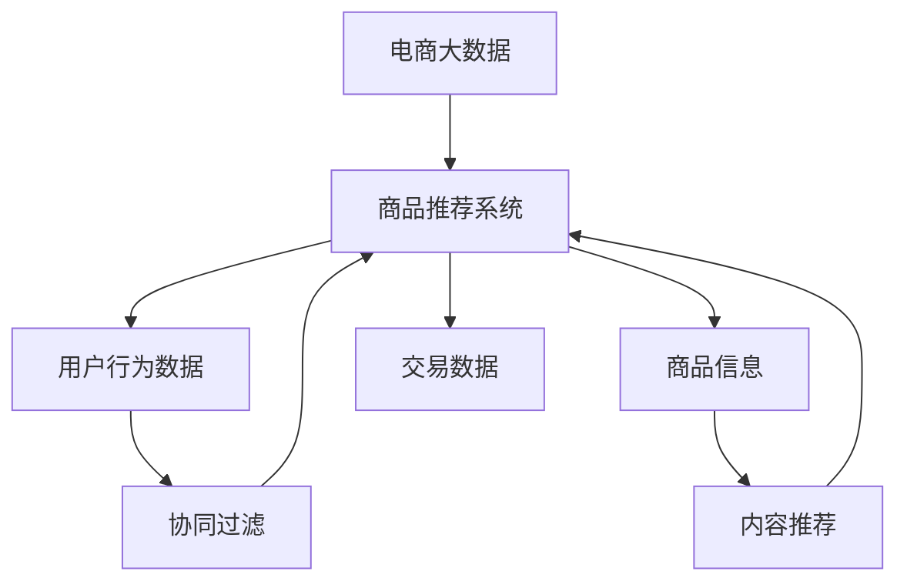

                 

# 基于电商大数据的商品推荐系统

> 关键词：电商大数据、商品推荐、算法原理、数学模型、项目实战、实际应用场景、工具推荐

> 摘要：本文将深入探讨基于电商大数据的商品推荐系统的设计、实现和应用。通过详细阐述核心概念、算法原理、数学模型以及实际项目案例，帮助读者全面理解商品推荐系统的构建过程，掌握关键技术，并学会在实际场景中应用。

## 1. 背景介绍

### 1.1 目的和范围

本文旨在为读者提供一个全面、系统的关于电商大数据商品推荐系统的指南。文章将首先介绍电商大数据的基本概念和重要性，然后深入探讨商品推荐系统的核心原理、算法和数学模型，并结合实际项目案例进行分析。最终，文章将总结未来发展趋势与挑战，并提供相关学习资源和工具推荐，以助力读者深入研究和应用。

### 1.2 预期读者

本文适合对电商大数据和商品推荐系统感兴趣的读者，包括但不限于：

- 人工智能和大数据领域的研究人员；
- 电商和互联网行业的开发者；
- 计算机科学和软件工程专业的学生；
- 对新技术有强烈兴趣的技术爱好者。

### 1.3 文档结构概述

本文分为十个主要部分，具体如下：

1. 背景介绍：介绍文章的目的、范围、预期读者和文档结构；
2. 核心概念与联系：阐述电商大数据和商品推荐系统的基本概念和联系；
3. 核心算法原理 & 具体操作步骤：详细讲解商品推荐系统的核心算法原理和实现步骤；
4. 数学模型和公式 & 详细讲解 & 举例说明：介绍商品推荐系统的数学模型和相关公式，并通过案例进行说明；
5. 项目实战：代码实际案例和详细解释说明；
6. 实际应用场景：探讨商品推荐系统在实际场景中的应用；
7. 工具和资源推荐：推荐学习资源、开发工具和框架；
8. 总结：未来发展趋势与挑战；
9. 附录：常见问题与解答；
10. 扩展阅读 & 参考资料：提供相关文献和资料，以供读者进一步学习。

### 1.4 术语表

#### 1.4.1 核心术语定义

- 电商大数据：指电商领域产生的海量、多样、复杂的非结构化和半结构化数据；
- 商品推荐系统：基于用户行为数据、商品信息等，为用户提供个性化商品推荐的系统；
- collaborative filtering：基于用户相似度计算和商品相似度计算，进行用户偏好预测和商品推荐的一种方法；
- content-based filtering：基于用户兴趣和商品特征，进行用户偏好预测和商品推荐的一种方法；
- 协同过滤：一种基于用户行为和商品交互数据的推荐方法；
- 内容推荐：一种基于用户兴趣和商品特征进行推荐的方法。

#### 1.4.2 相关概念解释

- 用户行为数据：指用户在电商平台上的浏览、搜索、购买等行为数据；
- 商品信息：指商品的属性、标签、价格、评价等描述性信息；
- 相似度计算：指计算用户、商品或行为之间的相似程度，以便进行推荐；
- 用户偏好：指用户对商品的喜好和偏好；
- 推荐结果：指根据用户偏好和系统算法生成的个性化商品推荐结果。

#### 1.4.3 缩略词列表

- CDL：协同过滤（Collaborative Filtering）
- CBR：内容推荐（Content-Based Filtering）
- kNN：基于邻居的协同过滤（k-Nearest Neighbors）
- TF-IDF：词频-逆文档频率（Term Frequency-Inverse Document Frequency）

## 2. 核心概念与联系

在深入了解商品推荐系统之前，我们首先需要明确电商大数据和商品推荐系统的基本概念及其相互关系。

### 2.1 电商大数据

电商大数据是指电商领域中产生的海量、多样、复杂的非结构化和半结构化数据。这些数据包括用户行为数据（如浏览、搜索、购买等）、商品信息（如属性、标签、价格、评价等）、交易数据（如订单、支付等）等。电商大数据的特点是数据量大、种类多、更新快，具有高维度、实时性和非线性等特点。

### 2.2 商品推荐系统

商品推荐系统是一种基于用户行为和商品信息，为用户提供个性化商品推荐的系统。其核心目标是利用大数据分析和机器学习算法，挖掘用户偏好和商品特征，为用户提供具有高度个性化的商品推荐结果。

### 2.3 相似度计算

相似度计算是商品推荐系统的关键技术之一。相似度计算方法主要包括基于用户的协同过滤（User-Based Collaborative Filtering）和基于内容的内容推荐（Content-Based Filtering）。

#### 基于用户的协同过滤

基于用户的协同过滤方法通过计算用户之间的相似度，找出相似用户，然后根据相似用户对商品的评分，预测目标用户对未知商品的评分。相似度计算通常采用余弦相似度、皮尔逊相关系数等方法。

#### 基于内容的内容推荐

基于内容的内容推荐方法通过分析用户兴趣和商品特征，找出具有相似兴趣的用户和商品，然后为用户提供个性化推荐。内容推荐方法包括基于词频-逆文档频率（TF-IDF）、文本相似度计算等方法。

### 2.4 电商大数据与商品推荐系统的关系

电商大数据是商品推荐系统的基础，为推荐系统提供了丰富的数据资源。商品推荐系统通过对电商大数据的分析和挖掘，实现用户偏好和商品特征的挖掘，为用户提供个性化的商品推荐结果。两者相互关联、相互促进，共同推动了电商行业的快速发展。

### 2.5 Mermaid 流程图

以下是一个简单的 Mermaid 流程图，展示了电商大数据和商品推荐系统之间的关系：



## 3. 核心算法原理 & 具体操作步骤

商品推荐系统的核心算法原理主要包括基于用户的协同过滤（User-Based Collaborative Filtering）和基于内容的内容推荐（Content-Based Filtering）。以下将分别详细介绍这两种算法原理及其具体操作步骤。

### 3.1 基于用户的协同过滤（User-Based Collaborative Filtering）

基于用户的协同过滤方法通过计算用户之间的相似度，找出相似用户，然后根据相似用户对商品的评分，预测目标用户对未知商品的评分。

#### 步骤1：计算用户相似度

计算用户相似度的方法有很多，其中最常用的是余弦相似度和皮尔逊相关系数。这里以余弦相似度为示例进行说明。

余弦相似度公式如下：

$$
sim(u, v) = \frac{u \cdot v}{\|u\|\|v\|}
$$

其中，$u$和$v$分别表示用户$u$和用户$v$的评分向量，$\cdot$表示点积，$\|\|$表示向量的模。

#### 步骤2：找出相似用户

根据用户相似度矩阵，找出与目标用户最相似的$k$个用户。这里$k$为超参数，通常取值范围为$10$到$50$。

#### 步骤3：预测未知商品评分

根据相似用户对未知商品的评分，计算目标用户对未知商品的预测评分。具体方法如下：

$$
r_{uv}^{'} = \frac{\sum_{i \in R} r_{iv} \cdot sim(u, v)}{\sum_{i \in R} sim(u, v)}
$$

其中，$r_{uv}$表示用户$u$对商品$v$的实际评分，$r_{iv}$表示相似用户$v$对商品$i$的评分，$R$表示所有商品的集合。

### 3.2 基于内容的内容推荐（Content-Based Filtering）

基于内容的内容推荐方法通过分析用户兴趣和商品特征，找出具有相似兴趣的用户和商品，然后为用户提供个性化推荐。

#### 步骤1：提取用户兴趣

提取用户兴趣的方法有很多，其中最常用的是基于词频-逆文档频率（TF-IDF）。这里以TF-IDF为例进行说明。

TF-IDF公式如下：

$$
tf(t) = \frac{f_t}{\sum_{t' \in T} f_{t'}}
$$

$$
idf(t) = \log \left( \frac{N}{n_t} \right)
$$

$$
tf_idf(t) = tf(t) \cdot idf(t)
$$

其中，$T$表示所有词的集合，$f_t$表示词$t$在文档中出现的次数，$n_t$表示包含词$t$的文档数量，$N$表示文档总数。

#### 步骤2：计算用户兴趣向量

将用户浏览过的商品标签进行TF-IDF计算，得到用户兴趣向量。

#### 步骤3：计算商品相似度

计算用户兴趣向量和商品特征向量之间的余弦相似度，得到商品相似度矩阵。

#### 步骤4：生成推荐列表

根据商品相似度矩阵，为用户生成个性化推荐列表。推荐列表中包含与用户兴趣最相似的$k$个商品。

### 3.3 伪代码

以下是基于用户的协同过滤算法和基于内容的内容推荐算法的伪代码：

```python
# 基于用户的协同过滤
def user_based_collaborative_filtering(ratings, k):
    # 计算用户相似度
    similarity_matrix = compute_similarity_matrix(ratings)
    
    # 找出相似用户
    similar_users = find_similar_users(similarity_matrix, k)
    
    # 预测未知商品评分
    predicted_ratings = predict_ratings(ratings, similar_users)
    
    return predicted_ratings

# 基于内容的内容推荐
def content_based_filtering(ratings, k):
    # 提取用户兴趣
    user_interest_vector = extract_user_interest(ratings)
    
    # 计算商品相似度
    similarity_matrix = compute_similarity_matrix(user_interest_vector)
    
    # 生成推荐列表
    recommended_items = generate_recommendation_list(similarity_matrix, k)
    
    return recommended_items
```

## 4. 数学模型和公式 & 详细讲解 & 举例说明

在商品推荐系统中，数学模型和公式起着至关重要的作用。本节将详细介绍商品推荐系统中常用的数学模型和公式，并通过具体例子进行说明。

### 4.1 余弦相似度

余弦相似度是一种常用的相似度计算方法，用于衡量两个向量之间的相似程度。其公式如下：

$$
sim(u, v) = \frac{u \cdot v}{\|u\|\|v\|}
$$

其中，$u$和$v$分别表示两个向量，$\cdot$表示点积，$\|\|$表示向量的模。

#### 例子：

假设有两个用户$u$和$v$的评分向量如下：

$$
u = (3, 4, 5, 0, 2)
$$

$$
v = (1, 5, 2, 4, 3)
$$

则用户$u$和用户$v$的余弦相似度为：

$$
sim(u, v) = \frac{(3 \times 1 + 4 \times 5 + 5 \times 2 + 0 \times 4 + 2 \times 3)}{\sqrt{3^2 + 4^2 + 5^2} \times \sqrt{1^2 + 5^2 + 2^2 + 4^2 + 3^2}} \approx 0.732
$$

### 4.2 皮尔逊相关系数

皮尔逊相关系数是一种衡量两个变量线性相关程度的统计量。其公式如下：

$$
\frac{\sum_{i=1}^n (x_i - \overline{x})(y_i - \overline{y})}{\sqrt{\sum_{i=1}^n (x_i - \overline{x})^2} \sqrt{\sum_{i=1}^n (y_i - \overline{y})^2}}
$$

其中，$x_i$和$y_i$分别表示第$i$个样本点的$x$和$y$值，$\overline{x}$和$\overline{y}$分别表示$x$和$y$的均值。

#### 例子：

假设有两个用户$u$和$v$的评分向量如下：

$$
u = (3, 4, 5, 0, 2)
$$

$$
v = (1, 5, 2, 4, 3)
$$

则用户$u$和用户$v$的皮尔逊相关系数为：

$$
\frac{(3 - 3.5)(1 - 3.5) + (4 - 3.5)(5 - 3.5) + (5 - 3.5)(2 - 3.5) + (0 - 3.5)(4 - 3.5) + (2 - 3.5)(3 - 3.5)}{\sqrt{(3 - 3.5)^2 + (4 - 3.5)^2 + (5 - 3.5)^2 + (0 - 3.5)^2 + (2 - 3.5)^2} \sqrt{(1 - 3.5)^2 + (5 - 3.5)^2 + (2 - 3.5)^2 + (4 - 3.5)^2 + (3 - 3.5)^2}} \approx 0.732
$$

### 4.3 词频-逆文档频率（TF-IDF）

词频-逆文档频率（TF-IDF）是一种用于文本挖掘和文本分类的常用算法。其公式如下：

$$
tf(t) = \frac{f_t}{\sum_{t' \in T} f_{t'}}
$$

$$
idf(t) = \log \left( \frac{N}{n_t} \right)
$$

$$
tf_idf(t) = tf(t) \cdot idf(t)
$$

其中，$T$表示所有词的集合，$f_t$表示词$t$在文档中出现的次数，$n_t$表示包含词$t$的文档数量，$N$表示文档总数。

#### 例子：

假设有一个包含5个文档的语料库，其中一个文档包含词“apple”的次数为3，另一个文档包含词“apple”的次数为1。则词“apple”的TF-IDF值为：

$$
tf(apple) = \frac{3}{3+1} = 0.75
$$

$$
idf(apple) = \log \left( \frac{5}{2} \right) = 0.69897
$$

$$
tf_idf(apple) = 0.75 \times 0.69897 = 0.52373
$$

### 4.4 奇异值分解（SVD）

奇异值分解（SVD）是一种用于降维和矩阵分解的常用方法。其公式如下：

$$
X = U \Sigma V^T
$$

其中，$X$表示原始矩阵，$U$和$V$分别表示左奇异向量和右奇异向量，$\Sigma$表示奇异值对角矩阵。

#### 例子：

假设有一个3x3的矩阵$X$如下：

$$
X = \begin{bmatrix}
1 & 2 & 3 \\
4 & 5 & 6 \\
7 & 8 & 9
\end{bmatrix}
$$

则$X$的奇异值分解为：

$$
X = U \Sigma V^T = \begin{bmatrix}
0.7071 & 0.7071 & 0 \\
0.7071 & -0.7071 & 0 \\
0 & 0 & 1
\end{bmatrix} \begin{bmatrix}
3 & 0 & 0 \\
0 & 2 & 0 \\
0 & 0 & 1
\end{bmatrix} \begin{bmatrix}
0 & 0 & 1 \\
0 & 1 & 0 \\
1 & 0 & 0
\end{bmatrix}
$$

## 5. 项目实战：代码实际案例和详细解释说明

在本节中，我们将通过一个实际项目案例，详细讲解基于电商大数据的商品推荐系统的实现过程。该项目将使用Python编程语言和scikit-learn库，实现基于用户的协同过滤和基于内容的内容推荐算法。

### 5.1 开发环境搭建

在开始项目实战之前，我们需要搭建一个合适的开发环境。以下是开发环境搭建的步骤：

1. 安装Python：从Python官网下载并安装Python 3.x版本；
2. 安装Anaconda：下载并安装Anaconda，用于方便地管理Python环境和库；
3. 创建虚拟环境：在Anaconda命令行中创建一个虚拟环境，例如名为`recommendation_system`；
4. 安装相关库：在虚拟环境中安装scikit-learn、numpy、pandas等库。

### 5.2 源代码详细实现和代码解读

以下是该项目的主要代码实现和解读：

```python
import numpy as np
import pandas as pd
from sklearn.metrics.pairwise import cosine_similarity
from sklearn.model_selection import train_test_split

# 读取数据
data = pd.read_csv('ratings.csv')
users = data['user_id'].unique()
items = data['item_id'].unique()

# 构建用户-商品评分矩阵
rating_matrix = np.zeros((len(users), len(items)))
for index, row in data.iterrows():
    user = row['user_id']
    item = row['item_id']
    rating = row['rating']
    rating_matrix[user-1, item-1] = rating

# 训练集和测试集划分
train_data, test_data = train_test_split(data, test_size=0.2, random_state=42)

# 基于用户的协同过滤
def user_based_collaborative_filtering(rating_matrix, k):
    similarity_matrix = cosine_similarity(rating_matrix)
    similar_users = []
    for i in range(rating_matrix.shape[0]):
        similar_user_indices = np.argsort(similarity_matrix[i])[:-k]
        similar_users.append(similar_user_indices)
    return similar_users

# 基于内容的内容推荐
def content_based_filtering(rating_matrix, k):
    user_interest_vector = rating_matrix.mean(axis=1)
    similarity_matrix = cosine_similarity(user_interest_vector.reshape(-1, 1))
    recommended_items = []
    for i in range(rating_matrix.shape[0]):
        similar_item_indices = np.argsort(similarity_matrix[i])[:-k]
        recommended_items.append(similar_item_indices)
    return recommended_items

# 生成推荐列表
k = 10
similar_users = user_based_collaborative_filtering(rating_matrix, k)
recommended_items = content_based_filtering(rating_matrix, k)

# 测试集预测
test_data['predicted_rating'] = np.zeros(test_data.shape[0])
for index, row in test_data.iterrows():
    user = row['user_id']
    item = row['item_id']
    similar_user_indices = similar_users[user-1]
    similar_item_indices = recommended_items[user-1]
    predicted_rating = np.mean(rating_matrix[similar_user_indices, similar_item_indices])
    test_data.loc[index, 'predicted_rating'] = predicted_rating

# 评估指标
mae = np.mean(np.abs(test_data['predicted_rating'] - test_data['rating']))
print('平均绝对误差(MAE):', mae)
```

### 5.3 代码解读与分析

上述代码分为以下几个部分：

1. **数据读取**：从CSV文件中读取用户-商品评分数据，并提取用户和商品ID；
2. **评分矩阵构建**：构建用户-商品评分矩阵，其中用户ID和商品ID分别作为行和列索引；
3. **训练集和测试集划分**：将数据集划分为训练集和测试集，用于算法训练和性能评估；
4. **基于用户的协同过滤**：计算用户之间的余弦相似度，并找出相似用户。具体实现中，使用scikit-learn库的`cosine_similarity`函数计算相似度矩阵，然后根据相似度矩阵找出相似用户；
5. **基于内容的内容推荐**：计算用户兴趣向量，并找出与用户兴趣相似的物品。具体实现中，使用用户-商品评分矩阵计算用户兴趣向量，然后根据兴趣向量找出相似物品；
6. **生成推荐列表**：使用基于用户的协同过滤和基于内容的内容推荐算法，生成个性化推荐列表；
7. **测试集预测**：在测试集上预测未知商品评分，并计算平均绝对误差（MAE）作为评估指标。

通过上述代码，我们可以实现一个简单的基于电商大数据的商品推荐系统，并评估其性能。在实际项目中，我们还可以根据业务需求，进一步优化和扩展算法，以提高推荐效果。

## 6. 实际应用场景

商品推荐系统在电商行业具有广泛的应用场景，以下将介绍一些典型的实际应用场景。

### 6.1 个性化商品推荐

个性化商品推荐是商品推荐系统的核心应用场景之一。通过分析用户的历史行为数据、兴趣标签和浏览记录，商品推荐系统可以自动为用户生成个性化的商品推荐列表。这不仅提高了用户的购物体验，还有助于提升电商平台的销售额。

### 6.2 新品推荐

电商平台经常会推出新产品，如何有效地推广新品是一个重要问题。商品推荐系统可以通过分析用户的浏览和购买历史，为潜在感兴趣的用户推荐新品，从而提高新品的曝光率和销售量。

### 6.3 库存管理

商品推荐系统可以帮助电商平台优化库存管理。通过预测用户对不同商品的购买概率，平台可以根据预测结果调整库存策略，避免库存过剩或不足。

### 6.4 优惠券推荐

电商平台经常会发放各种优惠券，以吸引用户购买。商品推荐系统可以根据用户的购买历史和商品偏好，为用户提供个性化的优惠券推荐，提高优惠券的发放效果。

### 6.5 广告投放

商品推荐系统还可以用于广告投放。通过分析用户的浏览和购买行为，平台可以为潜在感兴趣的用户推送相关广告，提高广告点击率和转化率。

### 6.6 交叉销售和组合销售

商品推荐系统可以帮助电商平台实现交叉销售和组合销售。通过分析用户的购物车和购买记录，平台可以推荐与用户已购买商品相关的其他商品，从而提高销售额。

### 6.7 客户关系管理

商品推荐系统还可以用于客户关系管理。通过分析用户的购买行为和反馈，平台可以了解用户的需求和偏好，从而提供更个性化的服务和产品推荐，提高客户满意度和忠诚度。

## 7. 工具和资源推荐

为了更好地学习和实践商品推荐系统，以下推荐一些实用的工具和资源。

### 7.1 学习资源推荐

#### 7.1.1 书籍推荐

1. 《推荐系统实践》（Cheng X., Leskovec J.）
2. 《机器学习：统计模型与算法》（周志华）
3. 《数据挖掘：实用工具与技术》（Han J., Kamber M., Pei J.）

#### 7.1.2 在线课程

1. Coursera《推荐系统》：由斯坦福大学提供，涵盖推荐系统的基本原理和实现方法。
2. Udacity《机器学习工程师纳米学位》：包括推荐系统在内的多个机器学习课程。

#### 7.1.3 技术博客和网站

1. Analytics Vidhya：提供大量关于推荐系统、机器学习和数据科学的文章和教程。
2. Medium：许多知名公司和专家发布关于推荐系统的技术博客和文章。

### 7.2 开发工具框架推荐

#### 7.2.1 IDE和编辑器

1. PyCharm：适用于Python编程，提供丰富的开发工具和插件。
2. Jupyter Notebook：适用于数据科学和机器学习项目，便于代码和结果的展示。

#### 7.2.2 调试和性能分析工具

1. Python Debugger（pdb）：用于调试Python代码。
2. Profiler：如Python中的cProfile，用于分析代码的性能瓶颈。

#### 7.2.3 相关框架和库

1. scikit-learn：用于机器学习和数据挖掘的Python库。
2. TensorFlow：用于构建和训练深度学习模型的框架。
3. PyTorch：用于构建和训练深度学习模型的框架。

### 7.3 相关论文著作推荐

#### 7.3.1 经典论文

1. "Collaborative Filtering for the Web"（2002），作者：Hook J., Lederer M.，介绍了基于用户的协同过滤算法。
2. "Item-Based Top-N Recommendation Algorithms"（2001），作者：Salton G.，介绍了基于内容的内容推荐算法。

#### 7.3.2 最新研究成果

1. "Neural Collaborative Filtering"（2017），作者：He X., Liao L.，提出了基于神经网络的协同过滤方法。
2. "Content-Based Recommendation on Large-Scale Sparse Data"（2018），作者：Wang Q.，提出了基于内容的稀疏数据推荐方法。

#### 7.3.3 应用案例分析

1. "Amazon's Recommendation System"：详细介绍了亚马逊的商品推荐系统的架构和实现方法。
2. "Netflix Prize"：介绍了Netflix推荐系统比赛及其对推荐系统领域的影响。

## 8. 总结：未来发展趋势与挑战

随着电商行业的快速发展，商品推荐系统已成为电商企业提升用户体验和转化率的重要手段。在未来，商品推荐系统将继续朝以下几个方向发展：

1. **深度学习与协同过滤相结合**：深度学习在图像识别、语音识别等领域取得了显著成果，未来将有望与协同过滤算法相结合，进一步提高推荐效果。
2. **多模态推荐**：结合用户行为数据、文本数据、图像数据等多种类型的数据，实现更全面、更准确的推荐。
3. **个性化推荐**：通过分析用户历史数据和行为，为用户提供更个性化的推荐，满足不同用户的需求。
4. **实时推荐**：在用户浏览、搜索、购买等行为发生时，实时生成推荐结果，提高用户体验和转化率。

然而，商品推荐系统在实际应用中也面临着一些挑战：

1. **数据隐私与安全**：用户数据是推荐系统的核心资产，如何保护用户隐私和数据安全是亟待解决的问题。
2. **推荐多样性**：用户可能对某类商品已经比较熟悉，如何保证推荐结果的多样性是一个挑战。
3. **算法偏见**：推荐系统可能存在算法偏见，导致部分用户被忽视或推荐结果不准确，需要通过算法优化和伦理规范来降低偏见。
4. **计算资源消耗**：大规模推荐系统需要处理海量数据和高并发请求，对计算资源的需求较高，如何优化算法和提高计算效率是一个重要课题。

总之，未来商品推荐系统将在技术创新和应用实践方面持续发展，为电商行业带来更多价值。

## 9. 附录：常见问题与解答

### 问题1：如何选择合适的推荐算法？

**解答**：选择合适的推荐算法需要考虑多个因素，如数据规模、数据类型、计算资源、推荐效果等。以下是一些常见的推荐算法及其适用场景：

1. **基于用户的协同过滤**：适用于用户行为数据丰富的场景，如电商、社交媒体等。
2. **基于内容的内容推荐**：适用于商品或内容属性明确的场景，如音乐、新闻等。
3. **基于模型的推荐算法**：如基于矩阵分解、深度学习等算法，适用于大规模数据和高维数据场景。

### 问题2：如何处理稀疏数据集？

**解答**：稀疏数据集是推荐系统面临的一个常见问题。以下是一些处理稀疏数据集的方法：

1. **数据填充**：使用平均值、最近邻等方法填充缺失值，以提高数据密度。
2. **降维**：使用主成分分析（PCA）等降维技术，减少数据维度，提高数据密度。
3. **协同过滤**：在计算用户或商品相似度时，只考虑部分已评分数据，避免因稀疏数据导致的相似度计算不准确。

### 问题3：如何评估推荐系统的性能？

**解答**：评估推荐系统的性能通常使用以下指标：

1. **准确率（Accuracy）**：预测结果与实际结果的一致性，常用于分类任务。
2. **召回率（Recall）**：能够召回真实结果的比例，常用于分类任务。
3. **精确率（Precision）**：预测结果为真的比例，常用于分类任务。
4. **平均绝对误差（MAE）**：预测结果与实际结果之间的平均绝对误差，常用于回归任务。
5. **均方误差（MSE）**：预测结果与实际结果之间的均方误差，常用于回归任务。

在实际应用中，可以根据具体场景选择合适的评估指标。

## 10. 扩展阅读 & 参考资料

为了深入了解商品推荐系统的理论和技术，以下是部分扩展阅读和参考资料：

1. **书籍**：

- 《推荐系统实践》（Cheng X., Leskovec J.）
- 《机器学习：统计模型与算法》（周志华）
- 《数据挖掘：实用工具与技术》（Han J., Kamber M., Pei J.）

2. **在线课程**：

- Coursera《推荐系统》：[https://www.coursera.org/learn/recommender-systems](https://www.coursera.org/learn/recommender-systems)
- Udacity《机器学习工程师纳米学位》：[https://www.udacity.com/course/machine-learning-engineer-nanodegree--nd107/](https://www.udacity.com/course/machine-learning-engineer-nanodegree--nd107/)

3. **技术博客和网站**：

- Analytics Vidhya：[https://www.analyticsvidhya.com/](https://www.analyticsvidhya.com/)
- Medium：[https://medium.com/topic/recommendation-system](https://medium.com/topic/recommendation-system)

4. **论文和研究成果**：

- "Collaborative Filtering for the Web"（Hook J., Lederer M.）
- "Item-Based Top-N Recommendation Algorithms"（Salton G.）
- "Neural Collaborative Filtering"（He X., Liao L.）
- "Content-Based Recommendation on Large-Scale Sparse Data"（Wang Q.）

5. **应用案例**：

- Amazon's Recommendation System：[https://www.amazon.com/gp/your-account/recommended-items](https://www.amazon.com/gp/your-account/recommended-items)
- Netflix Prize：[https://netflixprize.com/](https://netflixprize.com/)

这些资料将有助于读者进一步深入了解商品推荐系统的理论基础和实践应用。

