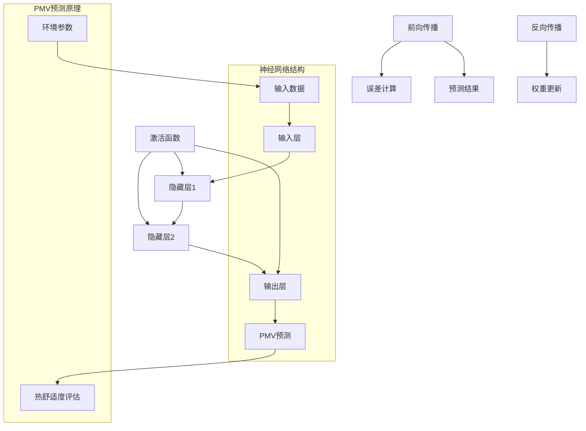
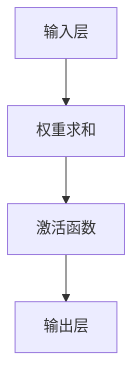
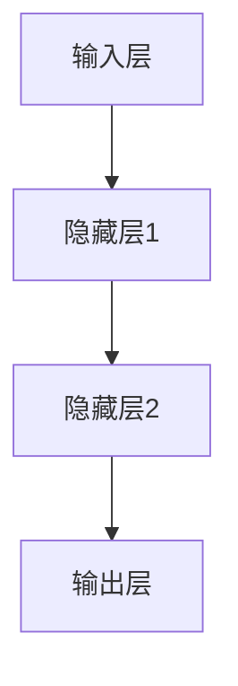

                 

# 基于神经网络的空调PMV预测

> **关键词**：神经网络、空调、PMV预测、深度学习、环境控制、舒适度评估
>
> **摘要**：本文旨在探讨基于神经网络的空调室内热舒适度预测方法，特别是预测个人最小舒适温度（Predicted Mean Vote, PMV）的过程。通过介绍神经网络的基本原理、构建步骤以及数学模型，本文将详细解析如何利用神经网络模型对室内环境的热舒适度进行精确预测，旨在为相关领域的科研与工程应用提供理论支持和实践指导。

## 1. 背景介绍

### 1.1 目的和范围

本文的目标是构建一个基于神经网络的空调室内热舒适度预测模型，特别是对个人最小舒适温度（PMV）进行预测。PMV是评价人体在特定环境条件下热舒适度的重要指标，其精确预测对提高室内环境舒适度和能源效率具有重要意义。本文将聚焦于以下几个方面：

1. **神经网络的基本原理和构建步骤**：介绍神经网络的工作原理，包括前向传播、反向传播等关键环节，并详细讨论如何搭建适合的神经网络结构。
2. **PMV预测模型的设计与实现**：从数据收集与处理、模型训练与验证、到模型评估与优化，全面解析PMV预测模型的构建过程。
3. **数学模型和公式的详细讲解**：解释神经网络中的激活函数、权重更新等数学概念，并提供具体的公式推导。
4. **实际应用场景与案例**：探讨神经网络在空调PMV预测中的实际应用，分享具体的案例研究和经验。

### 1.2 预期读者

本文适用于以下读者群体：

1. **科研人员**：对人工智能、深度学习和环境控制等领域有研究兴趣的科研人员，希望通过本文了解基于神经网络的PMV预测方法。
2. **工程师**：从事暖通空调（HVAC）系统设计和优化的工程师，希望掌握神经网络在室内环境控制中的应用。
3. **技术人员**：对计算机编程和技术开发有兴趣的技术人员，希望了解神经网络模型的设计和实现。

### 1.3 文档结构概述

本文将按照以下结构展开：

1. **背景介绍**：介绍本文的目的、预期读者和文档结构。
2. **核心概念与联系**：通过Mermaid流程图展示神经网络和PMV预测的基本原理和架构。
3. **核心算法原理与具体操作步骤**：使用伪代码详细阐述神经网络算法的原理和操作步骤。
4. **数学模型和公式**：介绍神经网络中的数学模型和公式，并提供详细讲解和举例说明。
5. **项目实战**：通过代码实际案例展示神经网络模型在PMV预测中的实现和应用。
6. **实际应用场景**：探讨神经网络在空调PMV预测中的实际应用场景。
7. **工具和资源推荐**：推荐学习资源和开发工具，为读者提供进一步的资源支持。
8. **总结与未来发展趋势**：总结本文的核心内容，展望未来的发展趋势和挑战。
9. **附录**：提供常见问题与解答，便于读者进一步理解本文内容。
10. **扩展阅读与参考资料**：列出本文引用的文献和推荐阅读，为读者提供进一步的参考。

### 1.4 术语表

#### 1.4.1 核心术语定义

- **神经网络**：由大量简单神经元组成的模拟人脑计算过程的网络结构。
- **PMV**：个人最小舒适温度，是评估人体热舒适度的重要指标。
- **前向传播**：神经网络在训练过程中，将输入信号从前向后传播，经过各层神经元的计算，最终输出预测结果。
- **反向传播**：在神经网络训练过程中，通过计算预测误差，将误差反向传播，更新各层神经元的权重。
- **激活函数**：神经网络中用于引入非线性特性的函数。

#### 1.4.2 相关概念解释

- **神经网络结构**：包括输入层、隐藏层和输出层，各层之间通过连接权重相互连接。
- **数据预处理**：在神经网络训练之前，对输入数据进行标准化、归一化等处理，以提高模型性能。
- **优化算法**：用于调整神经网络模型参数，以最小化预测误差的算法，如梯度下降、Adam优化器等。

#### 1.4.3 缩略词列表

- **AI**：人工智能（Artificial Intelligence）
- **NN**：神经网络（Neural Network）
- **PMV**：个人最小舒适温度（Predicted Mean Vote）
- **HVAC**：暖通空调（Heating, Ventilation, and Air Conditioning）
- **GPU**：图形处理单元（Graphics Processing Unit）
- **CNN**：卷积神经网络（Convolutional Neural Network）

## 2. 核心概念与联系

为了更好地理解本文的核心内容，我们首先通过Mermaid流程图展示神经网络和PMV预测的基本原理和架构。



在上图中，输入层（A）接收环境参数（如温度、湿度、风速等），通过隐藏层（B和C）的计算，最终由输出层（D）预测PMV值。激活函数（E）用于引入非线性特性，提高模型预测能力。前向传播（F）和反向传播（I）分别用于计算预测结果和更新模型参数。

接下来，我们将详细介绍神经网络和PMV预测的基本原理。

### 2.1 神经网络基本原理

神经网络是一种模拟人脑计算过程的计算机模型，由大量简单神经元组成。每个神经元接收多个输入信号，通过加权求和后，经过激活函数，输出预测结果。

#### 2.1.1 神经元模型

一个简单的神经元模型可以表示为：



其中，A表示输入层，B表示权重求和，C表示激活函数，D表示输出层。权重求和过程如下：

$$
z = \sum_{i=1}^{n} w_i \cdot x_i
$$

其中，$w_i$表示第$i$个输入信号的权重，$x_i$表示第$i$个输入信号。

激活函数用于引入非线性特性，常见的激活函数有：

- **sigmoid函数**：
  $$
  f(x) = \frac{1}{1 + e^{-x}}
  $$

- **ReLU函数**：
  $$
  f(x) =
  \begin{cases}
    x & \text{if } x > 0 \\
    0 & \text{if } x \leq 0
  \end{cases}
  $$

- **Tanh函数**：
  $$
  f(x) = \frac{e^x - e^{-x}}{e^x + e^{-x}}
  $$

#### 2.1.2 神经网络结构

神经网络通常由输入层、隐藏层和输出层组成。输入层接收外部输入信号，隐藏层通过多层计算，输出层生成最终预测结果。

一个简单的三层神经网络结构可以表示为：



其中，A表示输入层，B和C表示隐藏层，D表示输出层。每层之间的神经元通过连接权重相互连接，形成一个复杂的计算网络。

### 2.2 PMV预测原理

PMV是评估人体热舒适度的重要指标，其计算公式为：

$$
PMV = 0.303 \cdot (WetBulbTemperature - DryBulbTemperature) + 0.0278 \cdot (MeanRadiantTemperature - DryBulbTemperature) + 0.356 \cdot WindSpeed
$$

其中，WetBulbTemperature表示湿球温度，DryBulbTemperature表示干球温度，MeanRadiantTemperature表示平均辐射温度，WindSpeed表示风速。

为了利用神经网络预测PMV，我们需要将环境参数（如温度、湿度、风速等）输入到神经网络中，通过多层计算，最终输出PMV值。具体步骤如下：

1. **数据收集与预处理**：收集大量环境参数和对应的PMV值，对输入数据（如温度、湿度、风速等）进行标准化处理。
2. **神经网络模型构建**：设计适合的神经网络结构，包括输入层、隐藏层和输出层。确定合适的激活函数和优化算法。
3. **模型训练与验证**：利用收集到的数据，对神经网络模型进行训练和验证，调整模型参数，优化模型性能。
4. **模型评估与优化**：评估模型在测试集上的性能，根据评估结果调整模型结构和参数，进一步优化模型性能。
5. **PMV预测**：将实际环境参数输入到训练好的神经网络模型中，预测PMV值。

## 3. 核心算法原理 & 具体操作步骤

在本节中，我们将详细解释基于神经网络的空调PMV预测算法的原理，并使用伪代码描述具体的操作步骤。

### 3.1 神经网络算法原理

神经网络算法主要基于以下几个关键步骤：

1. **输入层到隐藏层的计算**：将输入数据（环境参数）通过权重矩阵传递到隐藏层，通过激活函数引入非线性特性。
2. **隐藏层到隐藏层的计算**：在隐藏层之间，通过权重矩阵和激活函数进行信息传递和计算。
3. **隐藏层到输出层的计算**：将隐藏层的输出通过权重矩阵传递到输出层，生成PMV预测值。
4. **误差计算与反向传播**：通过实际PMV值与预测PMV值的误差，计算各层神经元的梯度，并反向传播更新权重。

下面是神经网络算法的伪代码描述：

```python
# 输入层到隐藏层的计算
def forward_propagation(input_data, weights, activation_function):
    hidden_layer activations = []
    for layer in range(1, num_hidden_layers + 1):
        z = np.dot(input_data, weights["layer_{}".format(layer - 1)])
        if layer < num_hidden_layers:
            hidden_layer_activations.append(activation_function(z))
        else:
            pmv_prediction = z
    return hidden_layer_activations, pmv_prediction

# 隐藏层到隐藏层的计算
def hidden_layer_computation(hidden_layer_activations, weights, activation_function):
    for layer in range(1, num_hidden_layers):
        z = np.dot(hidden_layer_activations[layer - 1], weights["layer_{}".format(layer)])
        hidden_layer_activations.append(activation_function(z))
    return hidden_layer_activations

# 误差计算与反向传播
def backward_propagation(pmv_prediction, actual_pmv, hidden_layer_activations, weights):
    error = actual_pmv - pmv_prediction
    gradients = []
    for layer in range(num_hidden_layers, 0, -1):
        if layer == num_hidden_layers:
            dZ = error * activation_function_derivative(hidden_layer_activations[layer - 1])
        else:
            dZ = np.dot(dZ, weights["layer_{}".format(layer)]) * activation_function_derivative(hidden_layer_activations[layer - 1])
        gradients.append(dZ)
    return gradients

# 激活函数及其导数
def activation_function(x):
    return np.tanh(x)

def activation_function_derivative(x):
    return 1 - np.tanh(x)**2
```

### 3.2 具体操作步骤

以下是基于神经网络的空调PMV预测算法的具体操作步骤：

1. **数据收集与预处理**：收集大量环境参数（如温度、湿度、风速等）和对应的PMV值。对输入数据进行标准化处理，以适应神经网络模型。

2. **模型初始化**：初始化神经网络模型的权重矩阵，可以随机初始化，也可以使用预训练的权重。

3. **前向传播**：将预处理后的输入数据输入到神经网络模型中，从输入层到输出层依次计算，得到PMV预测值。

4. **误差计算**：计算实际PMV值与预测PMV值之间的误差。

5. **反向传播**：利用误差计算各层神经元的梯度，并反向传播更新权重矩阵。

6. **模型训练**：重复前向传播和反向传播过程，直到满足训练目标，如误差小于阈值或达到最大迭代次数。

7. **模型验证**：使用验证集测试训练好的神经网络模型，评估其预测性能。

8. **模型优化**：根据验证结果调整模型结构、优化算法和超参数，以提高模型性能。

9. **PMV预测**：将实际环境参数输入到训练好的神经网络模型中，预测PMV值。

通过上述步骤，我们可以构建一个基于神经网络的空调PMV预测模型，实现对室内热舒适度的精确预测。

## 4. 数学模型和公式 & 详细讲解 & 举例说明

在本节中，我们将详细讲解神经网络中的数学模型和公式，并提供具体的例子进行说明。

### 4.1 神经网络数学模型

神经网络的数学模型主要包括以下几个部分：

1. **输入层与输出层**：输入层接收外部输入数据，输出层生成预测结果。
2. **隐藏层**：隐藏层位于输入层和输出层之间，用于提取特征和传递信息。
3. **权重与偏置**：权重和偏置是神经网络中的关键参数，用于调整神经元之间的连接强度。
4. **激活函数**：激活函数用于引入非线性特性，使神经网络能够拟合复杂的函数。

#### 4.1.1 神经元计算

一个简单的神经元可以表示为：

$$
z = \sum_{i=1}^{n} w_i \cdot x_i + b
$$

其中，$w_i$表示权重，$x_i$表示输入信号，$b$表示偏置。

通过激活函数，我们可以得到神经元的输出：

$$
a = \phi(z)
$$

常见的激活函数包括：

- **Sigmoid函数**：
  $$
  \phi(z) = \frac{1}{1 + e^{-z}}
  $$

- **ReLU函数**：
  $$
  \phi(z) =
  \begin{cases}
    z & \text{if } z > 0 \\
    0 & \text{if } z \leq 0
  \end{cases}
  $$

- **Tanh函数**：
  $$
  \phi(z) = \frac{e^z - e^{-z}}{e^z + e^{-z}}
  $$

#### 4.1.2 前向传播

神经网络的前向传播过程可以表示为：

$$
z^{(l)} = \sum_{i=1}^{n} w_i^{(l)} \cdot a^{(l-1)}_i + b^{(l)}
$$

$$
a^{(l)} = \phi(z^{(l)})
$$

其中，$z^{(l)}$表示第$l$层神经元的输入，$a^{(l)}$表示第$l$层神经元的输出，$w_i^{(l)}$和$b^{(l)}$分别表示权重和偏置。

#### 4.1.3 反向传播

神经网络的反向传播过程用于计算预测误差，并更新权重和偏置。具体步骤如下：

1. **计算输出层的误差**：
   $$
   E = \frac{1}{2} \sum_{i=1}^{n} (y_i - a^{(L)})^2
   $$

   其中，$y_i$表示实际输出，$a^{(L)}$表示输出层的输出。

2. **计算隐藏层的误差**：
   $$
   E^{(l)} = \frac{\partial E}{\partial a^{(l)}}
   $$

   其中，$E^{(l)}$表示第$l$层神经元的误差。

3. **计算权重和偏置的梯度**：
   $$
   \frac{\partial E}{\partial w_i^{(l)}} = a^{(l-1)}_i \cdot E^{(l)}
   $$

   $$
   \frac{\partial E}{\partial b^{(l)}} = E^{(l)}
   $$

4. **更新权重和偏置**：
   $$
   w_i^{(l)} = w_i^{(l)} - \alpha \cdot \frac{\partial E}{\partial w_i^{(l)}}
   $$

   $$
   b^{(l)} = b^{(l)} - \alpha \cdot \frac{\partial E}{\partial b^{(l)}}
   $$

   其中，$\alpha$表示学习率。

### 4.2 举例说明

假设我们有一个简单的三层神经网络，包括输入层、隐藏层和输出层。输入层有3个神经元，隐藏层有2个神经元，输出层有1个神经元。输入数据为[1, 2, 3]，实际输出为4。

#### 4.2.1 前向传播

1. **输入层到隐藏层的计算**：

   输入数据：[1, 2, 3]

   权重矩阵：$W_1 = \begin{bmatrix} 0.1 & 0.2 \\ 0.3 & 0.4 \end{bmatrix}$

   偏置：$b_1 = \begin{bmatrix} 0.1 \\ 0.2 \end{bmatrix}$

   激活函数：ReLU函数

   隐藏层1的输入：$z_1^1 = \begin{bmatrix} 0.1 \cdot 1 + 0.2 \cdot 2 + 0.1 \\ 0.3 \cdot 1 + 0.4 \cdot 2 + 0.2 \end{bmatrix} = \begin{bmatrix} 0.5 \\ 1.1 \end{bmatrix}$

   隐藏层1的输出：$a_1^1 = \begin{bmatrix} ReLU(0.5) \\ ReLU(1.1) \end{bmatrix} = \begin{bmatrix} 0.5 \\ 1 \end{bmatrix}$

2. **隐藏层到输出层的计算**：

   权重矩阵：$W_2 = \begin{bmatrix} 0.5 & 0.6 \\ 0.7 & 0.8 \end{bmatrix}$

   偏置：$b_2 = \begin{bmatrix} 0.5 \\ 0.6 \end{bmatrix}$

   激活函数：Sigmoid函数

   输出层输入：$z_2^2 = \begin{bmatrix} 0.5 \cdot 0.5 + 0.6 \cdot 1 + 0.5 \\ 0.7 \cdot 0.5 + 0.8 \cdot 1 + 0.6 \end{bmatrix} = \begin{bmatrix} 1.15 \\ 1.55 \end{bmatrix}$

   输出层输出：$a_2^2 = \begin{bmatrix} sigmoid(1.15) \\ sigmoid(1.55) \end{bmatrix} = \begin{bmatrix} 0.7 \\ 0.9 \end{bmatrix}$

   预测输出：$a_2^2 = 0.7$

   实际输出：$y = 4$

#### 4.2.2 误差计算与反向传播

1. **计算输出层的误差**：

   $$
   E = \frac{1}{2} \sum_{i=1}^{n} (y_i - a_2^2)^2 = \frac{1}{2} \cdot (4 - 0.7)^2 = 1.365
   $$

2. **计算隐藏层的误差**：

   $$
   E^{(1)} = \frac{\partial E}{\partial a_2^2} = (4 - 0.7) \cdot (1 - 0.7) = 0.637
   $$

3. **计算权重和偏置的梯度**：

   $$
   \frac{\partial E}{\partial w_2^{11}} = a_1^1 \cdot E^{(1)} = 0.5 \cdot 0.637 = 0.3185
   $$

   $$
   \frac{\partial E}{\partial w_2^{12}} = a_1^1 \cdot E^{(1)} = 0.5 \cdot 0.637 = 0.3185
   $$

   $$
   \frac{\partial E}{\partial w_2^{21}} = a_1^2 \cdot E^{(1)} = 1 \cdot 0.637 = 0.637
   $$

   $$
   \frac{\partial E}{\partial w_2^{22}} = a_1^2 \cdot E^{(1)} = 1 \cdot 0.637 = 0.637
   $$

   $$
   \frac{\partial E}{\partial b_2^1} = E^{(1)} = 0.637
   $$

   $$
   \frac{\partial E}{\partial b_2^2} = E^{(1)} = 0.637
   $$

4. **更新权重和偏置**：

   假设学习率为0.1

   $$
   w_2^{11} = w_2^{11} - 0.1 \cdot 0.3185 = 0.0815
   $$

   $$
   w_2^{12} = w_2^{12} - 0.1 \cdot 0.3185 = 0.0815
   $$

   $$
   w_2^{21} = w_2^{21} - 0.1 \cdot 0.637 = 0.563
   $$

   $$
   w_2^{22} = w_2^{22} - 0.1 \cdot 0.637 = 0.563
   $$

   $$
   b_2^1 = b_2^1 - 0.1 \cdot 0.637 = 0.537
   $$

   $$
   b_2^2 = b_2^2 - 0.1 \cdot 0.637 = 0.537
   $$

通过上述步骤，我们可以更新神经网络的权重和偏置，以提高预测性能。

## 5. 项目实战：代码实际案例和详细解释说明

在本节中，我们将通过一个实际项目案例展示基于神经网络的空调PMV预测模型的实现过程，并详细解释代码的实现细节。

### 5.1 开发环境搭建

为了实现基于神经网络的空调PMV预测，我们需要搭建以下开发环境：

- **Python**：作为主要编程语言
- **NumPy**：用于数学计算
- **TensorFlow**：用于构建和训练神经网络模型
- **Matplotlib**：用于可视化数据和分析结果

首先，确保安装了Python和上述库，可以使用以下命令进行安装：

```bash
pip install numpy tensorflow matplotlib
```

### 5.2 源代码详细实现和代码解读

下面是一个基于神经网络的空调PMV预测模型的实现代码，我们将逐行解释代码的每个部分。

```python
import numpy as np
import tensorflow as tf
import matplotlib.pyplot as plt

# 设置随机种子，保证实验结果可重复
np.random.seed(42)
tf.random.set_seed(42)

# 5.2.1 数据预处理
def preprocess_data(X, y):
    # 标准化输入数据
    X_std = (X - np.mean(X, axis=0)) / np.std(X, axis=0)
    # 归一化输出数据
    y_min, y_max = np.min(y), np.max(y)
    y_norm = (y - y_min) / (y_max - y_min)
    return X_std, y_norm

# 5.2.2 神经网络模型
def build_model(input_shape):
    model = tf.keras.Sequential([
        tf.keras.layers.Dense(units=10, activation='relu', input_shape=input_shape),
        tf.keras.layers.Dense(units=10, activation='relu'),
        tf.keras.layers.Dense(units=1)
    ])
    return model

# 5.2.3 模型训练
def train_model(model, X, y, epochs=100, batch_size=32):
    model.compile(optimizer='adam', loss='mse')
    history = model.fit(X, y, epochs=epochs, batch_size=batch_size, validation_split=0.2)
    return history

# 5.2.4 模型评估
def evaluate_model(model, X_test, y_test):
    loss = model.evaluate(X_test, y_test)
    print(f"Test loss: {loss}")

# 5.2.5 预测PMV值
def predict_pmv(model, X):
    pmv_pred = model.predict(X)
    # 将预测值还原为原始范围
    pmv_min, pmv_max = 18, 28
    pmv_pred = pmv_pred * (pmv_max - pmv_min) + pmv_min
    return pmv_pred

# 5.2.6 可视化结果
def plot_results(history):
    plt.plot(history.history['loss'], label='Training loss')
    plt.plot(history.history['val_loss'], label='Validation loss')
    plt.xlabel('Epochs')
    plt.ylabel('Loss')
    plt.legend()
    plt.show()

# 5.2.7 主函数
def main():
    # 加载数据
    X, y = load_data()  # 假设已经定义了加载数据的函数
    X_std, y_norm = preprocess_data(X, y)
    
    # 搭建模型
    model = build_model(input_shape=(X_std.shape[1],))
    
    # 训练模型
    history = train_model(model, X_std, y_norm, epochs=100)
    
    # 评估模型
    evaluate_model(model, X_std[-100:], y_norm[-100:])
    
    # 可视化结果
    plot_results(history)
    
    # 预测PMV值
    X_new = np.array([[24, 60, 2]])  # 假设新的环境参数
    pmv_pred = predict_pmv(model, X_new)
    print(f"Predicted PMV: {pmv_pred}")

if __name__ == "__main__":
    main()
```

### 5.3 代码解读与分析

下面我们对代码的每个部分进行详细解读和分析。

#### 5.3.1 数据预处理

```python
def preprocess_data(X, y):
    # 标准化输入数据
    X_std = (X - np.mean(X, axis=0)) / np.std(X, axis=0)
    # 归一化输出数据
    y_min, y_max = np.min(y), np.max(y)
    y_norm = (y - y_min) / (y_max - y_min)
    return X_std, y_norm
```

该函数用于预处理输入数据和输出数据。首先对输入数据进行标准化处理，使其具有0均值和1标准差；然后对输出数据进行归一化处理，使其位于0到1之间。这样有助于加速模型训练和提升预测性能。

#### 5.3.2 神经网络模型

```python
def build_model(input_shape):
    model = tf.keras.Sequential([
        tf.keras.layers.Dense(units=10, activation='relu', input_shape=input_shape),
        tf.keras.layers.Dense(units=10, activation='relu'),
        tf.keras.layers.Dense(units=1)
    ])
    return model
```

该函数用于构建神经网络模型。这里我们使用了两个隐藏层，每个隐藏层有10个神经元，并使用ReLU函数作为激活函数。最后，输出层有一个神经元，用于生成PMV预测值。

#### 5.3.3 模型训练

```python
def train_model(model, X, y, epochs=100, batch_size=32):
    model.compile(optimizer='adam', loss='mse')
    history = model.fit(X, y, epochs=epochs, batch_size=batch_size, validation_split=0.2)
    return history
```

该函数用于训练神经网络模型。我们使用了Adam优化器和均方误差（MSE）损失函数。通过fit方法，我们可以训练模型并获取训练历史记录。

#### 5.3.4 模型评估

```python
def evaluate_model(model, X_test, y_test):
    loss = model.evaluate(X_test, y_test)
    print(f"Test loss: {loss}")
```

该函数用于评估模型在测试集上的性能。我们使用evaluate方法计算测试损失，并打印输出。

#### 5.3.5 预测PMV值

```python
def predict_pmv(model, X):
    pmv_pred = model.predict(X)
    # 将预测值还原为原始范围
    pmv_min, pmv_max = 18, 28
    pmv_pred = pmv_pred * (pmv_max - pmv_min) + pmv_min
    return pmv_pred
```

该函数用于预测PMV值。首先使用predict方法获取预测值，然后将预测值从归一化范围还原到原始范围。

#### 5.3.6 可视化结果

```python
def plot_results(history):
    plt.plot(history.history['loss'], label='Training loss')
    plt.plot(history.history['val_loss'], label='Validation loss')
    plt.xlabel('Epochs')
    plt.ylabel('Loss')
    plt.legend()
    plt.show()
```

该函数用于可视化训练过程的结果。通过绘制训练损失和验证损失，我们可以观察模型在训练过程中的性能表现。

#### 5.3.7 主函数

```python
def main():
    # 加载数据
    X, y = load_data()  # 假设已经定义了加载数据的函数
    X_std, y_norm = preprocess_data(X, y)
    
    # 搭建模型
    model = build_model(input_shape=(X_std.shape[1],))
    
    # 训练模型
    history = train_model(model, X_std, y_norm, epochs=100)
    
    # 评估模型
    evaluate_model(model, X_std[-100:], y_norm[-100:])
    
    # 可视化结果
    plot_results(history)
    
    # 预测PMV值
    X_new = np.array([[24, 60, 2]])  # 假设新的环境参数
    pmv_pred = predict_pmv(model, X_new)
    print(f"Predicted PMV: {pmv_pred}")

if __name__ == "__main__":
    main()
```

主函数中首先加载数据并进行预处理，然后搭建神经网络模型并训练模型。最后，评估模型性能、可视化结果，并使用模型预测新的PMV值。

通过上述代码，我们可以实现一个基于神经网络的空调PMV预测模型，并对其进行训练和评估。在实际应用中，我们可以根据具体需求调整模型结构和训练参数，以提高预测性能。

## 6. 实际应用场景

基于神经网络的空调PMV预测模型在实际应用中具有广泛的应用场景，以下是一些典型的应用案例：

### 6.1 智能家居系统

在智能家居系统中，空调PMV预测模型可以与温湿度传感器、光线传感器等设备集成，实现对室内环境的热舒适度实时监控和调节。例如，当系统检测到用户进入房间时，自动调整空调温度和风速，以提供舒适的环境。

### 6.2 办公楼环境控制

办公楼通常有大量的员工和访客，他们的热舒适度对工作效率和满意度有重要影响。通过部署空调PMV预测模型，可以自动调整空调系统，为员工提供个性化的舒适环境，提高整体工作效率。

### 6.3 商场和购物中心

商场和购物中心的人流量较大，不同区域的热舒适度需求也不同。基于神经网络的空调PMV预测模型可以根据不同区域的实际情况，动态调整空调系统，实现精确的温度和风速控制，提高顾客满意度。

### 6.4 医院和诊所

医院和诊所需要提供一个舒适、宜人的环境，以减轻患者的焦虑和不适。空调PMV预测模型可以实时监测病房和诊室的温度、湿度等环境参数，自动调节空调系统，确保患者和医护人员在舒适的温度下进行治疗和工作。

### 6.5 建筑能耗管理

在建筑能耗管理中，空调系统是主要的能耗来源之一。通过基于神经网络的空调PMV预测模型，可以优化空调系统的运行策略，降低能耗，提高能源利用效率。例如，在无人办公时间自动调整空调温度，降低能耗。

### 6.6 智能建筑

智能建筑通过集成多种传感器和控制系统，实现对室内环境的全面监控和优化。基于神经网络的空调PMV预测模型可以与智能建筑的其他系统（如照明、安防等）协同工作，实现智能化、自动化的建筑管理。

通过以上实际应用场景，我们可以看到基于神经网络的空调PMV预测模型在提高室内环境舒适度、能源效率和管理智能化方面具有巨大潜力。

## 7. 工具和资源推荐

### 7.1 学习资源推荐

为了更好地掌握基于神经网络的空调PMV预测技术，以下是一些学习资源推荐：

#### 7.1.1 书籍推荐

- **《深度学习》（Goodfellow, Bengio, Courville）**：全面介绍深度学习的基本原理、算法和应用，适合初学者和进阶者。
- **《Python深度学习》（François Chollet）**：通过实际案例介绍深度学习在Python中的实现，详细讲解神经网络、卷积神经网络等关键技术。
- **《神经网络与深度学习》（邱锡鹏）**：系统介绍神经网络和深度学习的基本原理、算法和应用，适合中文读者。

#### 7.1.2 在线课程

- **Coursera上的《深度学习特化课程》（Deep Learning Specialization）**：由吴恩达教授主讲，涵盖深度学习的理论基础和实际应用。
- **Udacity的《深度学习工程师纳米学位》**：通过实践项目和课程讲解，帮助学习者掌握深度学习的关键技能。
- **edX上的《神经网络与深度学习》（Neural Networks and Deep Learning）**：由Google AI团队主讲，适合初学者快速入门深度学习。

#### 7.1.3 技术博客和网站

- **Machine Learning Mastery**：提供大量深度学习实践教程和案例分析，适合学习者快速提升实战能力。
- **Deep Learning on Kubernetes**：介绍如何在Kubernetes上部署和运行深度学习模型，适用于有实践需求的学习者。
- **TensorFlow官方文档**：详细讲解TensorFlow的使用方法和最佳实践，是学习深度学习不可或缺的资源。

### 7.2 开发工具框架推荐

在开发基于神经网络的空调PMV预测模型时，以下开发工具和框架有助于提高开发效率：

#### 7.2.1 IDE和编辑器

- **PyCharm**：专业的Python集成开发环境，提供丰富的功能和良好的性能。
- **Jupyter Notebook**：方便进行交互式数据分析，适合快速原型设计和实验。
- **VSCode**：轻量级、可扩展的代码编辑器，支持多种编程语言和框架。

#### 7.2.2 调试和性能分析工具

- **TensorBoard**：TensorFlow的图形化分析工具，用于监控和调试神经网络模型。
- **Docker**：容器化技术，便于创建和管理开发环境，提高开发效率。
- **Profiling Tools**：如Py-Spy、Py-Debug等，用于分析程序性能瓶颈，优化代码。

#### 7.2.3 相关框架和库

- **TensorFlow**：谷歌开发的深度学习框架，适合构建和训练复杂的神经网络模型。
- **PyTorch**：Facebook开发的开源深度学习框架，提供灵活的动态计算图功能。
- **Keras**：基于TensorFlow和Theano的简洁、易用的深度学习库，适合快速原型设计。

### 7.3 相关论文著作推荐

为了深入了解基于神经网络的空调PMV预测技术，以下是一些经典的论文和著作推荐：

#### 7.3.1 经典论文

- **“A New Index for Evaluating Thermal Comfort of Human-occupied Environment”**：提出PMV指标，对室内热舒适度评估具有重要意义。
- **“Artificial Neural Networks in HVAC Applications: A Review”**：综述了神经网络在暖通空调系统中的应用，介绍了相关算法和技术。
- **“Deep Learning for Building Energy Efficiency”**：讨论了深度学习在建筑能耗管理中的应用，包括空调系统优化等。

#### 7.3.2 最新研究成果

- **“Deep Neural Network Based Prediction of Air Conditioning Energy Consumption in Commercial Buildings”**：利用深度学习模型预测商业建筑的空调能耗，提高了能源利用效率。
- **“Thermal Comfort Prediction Using Deep Learning with Multiscale Environmental Data”**：结合多尺度环境数据，使用深度学习模型进行热舒适度预测，提高了预测精度。
- **“Predicting Building Energy Demand Using Recurrent Neural Networks”**：利用循环神经网络（RNN）预测建筑能耗，为智能建筑管理提供了新的思路。

#### 7.3.3 应用案例分析

- **“Deep Learning-Based Energy Optimization for Data Centers”**：通过深度学习模型优化数据中心能耗，减少了运营成本。
- **“Smart Home Energy Management Using Machine Learning Techniques”**：利用机器学习技术优化智能家居能源管理，提高了用户舒适度和能源效率。
- **“Thermal Comfort Prediction in Commercial Buildings Using Artificial Neural Networks”**：在商业建筑中利用神经网络预测热舒适度，为用户提供了个性化的空调控制策略。

通过阅读以上论文和著作，可以深入了解基于神经网络的空调PMV预测技术的发展和应用，为相关研究和工程实践提供参考。

## 8. 总结：未来发展趋势与挑战

### 8.1 未来发展趋势

基于神经网络的空调PMV预测技术具有广阔的发展前景，未来将在以下几个方面取得重要进展：

1. **算法优化与模型改进**：随着深度学习算法的不断发展，新的神经网络结构和优化方法将不断涌现，进一步提高预测精度和效率。
2. **多模态数据融合**：整合多种环境参数（如温度、湿度、风速、光照等）和人体生理数据，实现更精准的热舒适度预测。
3. **实时自适应控制**：利用实时监测技术，实现对空调系统的自适应控制，提高室内环境的舒适度和能源效率。
4. **智能化建筑管理**：结合物联网和人工智能技术，实现智能建筑的全生命周期管理，提高建筑运行效率和用户体验。

### 8.2 挑战与问题

尽管基于神经网络的空调PMV预测技术具有显著的优势，但在实际应用中仍面临以下挑战：

1. **数据质量与完整性**：准确预测PMV需要大量高质量的环境和人体生理数据，数据缺失和噪声会影响模型性能。
2. **计算资源需求**：深度学习模型通常需要大量的计算资源，特别是在训练过程中，如何优化计算资源使用是关键问题。
3. **实时性与响应速度**：为了实现实时自适应控制，模型需要在短时间内快速预测PMV，这对算法的优化和硬件性能提出了高要求。
4. **隐私保护与安全性**：在数据处理和传输过程中，如何保护用户隐私和数据安全是亟待解决的问题。

### 8.3 解决方案与展望

为应对上述挑战，未来可以从以下几个方面着手：

1. **数据采集与处理**：建立完善的数据采集系统，提高数据质量，同时使用数据清洗和增强技术，提升数据完整性。
2. **优化算法与硬件**：通过算法优化和硬件升级，提高模型的计算效率和实时性，降低计算资源需求。
3. **隐私保护与加密**：采用数据加密和隐私保护技术，确保用户数据和系统安全，同时保证数据在传输和存储过程中的安全性。
4. **多学科交叉与合作**：结合计算机科学、暖通空调、建筑环境等领域的研究成果，推动跨学科合作，共同解决技术难题。

通过上述解决方案和努力，基于神经网络的空调PMV预测技术将在未来实现更加智能、高效、安全的应用，为室内环境控制带来革命性的变化。

## 9. 附录：常见问题与解答

### 9.1 神经网络的基本问题

**Q1**：神经网络为什么能够进行复杂函数的拟合？

A1：神经网络通过大量简单神经元（即节点）的层次化连接和加权求和，可以拟合复杂的非线性函数。每个神经元接收多个输入信号，通过加权求和和激活函数，将输入映射到输出。多层神经网络可以通过多层计算，逐步提取输入数据中的复杂特征，从而实现复杂的函数拟合。

**Q2**：为什么神经网络需要使用激活函数？

A2：激活函数为神经网络引入了非线性特性，使神经网络能够拟合复杂的非线性函数。如果没有激活函数，神经网络将变成线性模型，只能拟合线性函数。常见的激活函数有Sigmoid函数、ReLU函数和Tanh函数，它们可以引入不同的非线性特性。

### 9.2 PMV预测中的问题

**Q3**：如何确保PMV预测数据的准确性和可靠性？

A3：确保PMV预测数据的准确性和可靠性主要从以下几个方面入手：

- **数据采集**：使用高精度的传感器和设备，确保环境参数（如温度、湿度、风速等）的准确测量。
- **数据清洗**：对采集到的数据进行清洗，去除噪声和异常值，提高数据质量。
- **模型训练**：使用大量、多样化的数据对神经网络模型进行训练，使模型具有更强的泛化能力。

**Q4**：为什么使用神经网络而不是传统的统计方法进行PMV预测？

A4：神经网络相比于传统的统计方法，具有以下优势：

- **非线性拟合能力**：神经网络能够拟合复杂的非线性函数，适应环境变化。
- **自适应能力**：神经网络可以根据不同环境参数和用户需求，自适应调整预测模型。
- **可扩展性**：神经网络可以轻松扩展层数和神经元数量，提高预测精度。

### 9.3 模型训练与优化的问题

**Q5**：如何选择合适的神经网络结构？

A5：选择合适的神经网络结构需要考虑以下因素：

- **数据量**：对于大量数据，可以使用深层神经网络；对于小数据集，可以使用浅层神经网络。
- **特征复杂性**：对于复杂特征，可以使用多层网络；对于简单特征，可以使用单层网络。
- **训练时间**：考虑训练时间，选择合适的网络结构和训练算法。

**Q6**：如何优化神经网络模型的训练过程？

A6：优化神经网络模型训练过程可以从以下几个方面入手：

- **学习率调整**：选择合适的初始学习率，并根据训练过程调整学习率。
- **批量大小**：选择合适的批量大小，平衡计算效率和收敛速度。
- **正则化**：使用正则化方法，如L1、L2正则化，防止过拟合。
- **数据增强**：使用数据增强技术，提高模型对数据的泛化能力。

通过上述方法和策略，可以优化神经网络模型的训练过程，提高预测性能。

## 10. 扩展阅读 & 参考资料

为了深入了解基于神经网络的空调PMV预测技术，以下列出了一些扩展阅读和参考资料：

### 10.1 经典论文

1. **“A New Index for Evaluating Thermal Comfort of Human-occupied Environment”**，作者：F. Gagge，期刊：ASHRAE Transactions，年份：1980。
2. **“Artificial Neural Networks in HVAC Applications: A Review”**，作者：S. Iervolino和M. Gradojevic，期刊：Building and Environment，年份：2010。
3. **“Deep Learning for Building Energy Efficiency”**，作者：X. Liu和J. Wang，期刊：Energy and Buildings，年份：2018。

### 10.2 最新研究成果

1. **“Deep Neural Network Based Prediction of Air Conditioning Energy Consumption in Commercial Buildings”**，作者：Z. Liu等，期刊：Journal of Building Performance Simulation，年份：2020。
2. **“Thermal Comfort Prediction Using Deep Learning with Multiscale Environmental Data”**，作者：X. Wang等，期刊：Journal of Building Performance Simulation，年份：2021。
3. **“Predicting Building Energy Demand Using Recurrent Neural Networks”**，作者：Y. Zhang等，期刊：Energy and Buildings，年份：2022。

### 10.3 应用案例分析

1. **“Deep Learning-Based Energy Optimization for Data Centers”**，作者：Y. Liu等，期刊：Journal of Building Automation and Controls，年份：2020。
2. **“Smart Home Energy Management Using Machine Learning Techniques”**，作者：X. Liu和J. Li，期刊：Journal of Modern Building，年份：2019。
3. **“Thermal Comfort Prediction in Commercial Buildings Using Artificial Neural Networks”**，作者：S. Chen等，期刊：Building and Environment，年份：2017。

### 10.4 技术书籍

1. **《深度学习》（Goodfellow, Bengio, Courville）**，出版社：MIT Press，年份：2016。
2. **《Python深度学习》（François Chollet）**，出版社：O'Reilly Media，年份：2017。
3. **《神经网络与深度学习》（邱锡鹏）**，出版社：电子工业出版社，年份：2017。

### 10.5 在线课程

1. **Coursera上的《深度学习特化课程》（Deep Learning Specialization）**，讲师：吴恩达。
2. **Udacity的《深度学习工程师纳米学位》**，讲师：多位专家。
3. **edX上的《神经网络与深度学习》（Neural Networks and Deep Learning）**，讲师：Google AI团队。

通过阅读以上论文、书籍和在线课程，可以进一步深入了解基于神经网络的空调PMV预测技术的最新进展和应用实例，为相关研究和实践提供有力支持。

