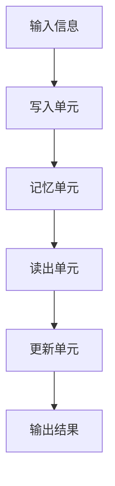
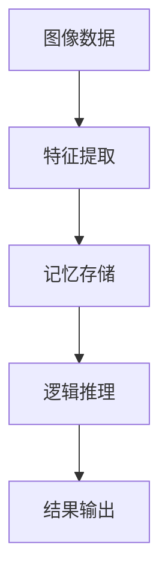

                 

# 基于记忆网络的视觉逻辑推理算法的研究与实现

> 关键词：记忆网络、视觉推理、逻辑推理、深度学习、图像处理

> 摘要：本文旨在探讨基于记忆网络的视觉逻辑推理算法的研究与实现。通过深入分析记忆网络的原理和架构，结合图像处理和深度学习的相关技术，本文提出了一种有效的视觉逻辑推理算法，并对其进行了详细的算法原理讲解、数学模型分析和实际应用场景阐述。通过本文的研究，旨在为视觉逻辑推理领域提供一种新的思路和方法。

## 1. 背景介绍

### 1.1 目的和范围

本文的主要目的是研究基于记忆网络的视觉逻辑推理算法，并探讨其在实际应用中的可行性。随着深度学习和计算机视觉技术的不断发展，视觉逻辑推理已成为人工智能领域的一个重要研究方向。本文将从理论基础出发，结合实际案例，对视觉逻辑推理算法进行深入分析和探讨。

本文的研究范围主要包括以下几个方面：

1. 记忆网络的基本原理和架构。
2. 视觉逻辑推理算法的设计和实现。
3. 算法的性能评估和实际应用场景。

### 1.2 预期读者

本文适合以下读者：

1. 对计算机视觉和深度学习有一定了解的读者。
2. 想要深入了解记忆网络和视觉逻辑推理算法的研究者。
3. 对人工智能技术感兴趣的技术爱好者。

### 1.3 文档结构概述

本文的结构如下：

1. 引言：介绍本文的研究背景、目的和意义。
2. 核心概念与联系：阐述记忆网络的基本原理和架构。
3. 核心算法原理 & 具体操作步骤：详细讲解视觉逻辑推理算法的原理和操作步骤。
4. 数学模型和公式 & 详细讲解 & 举例说明：分析算法的数学模型和公式，并给出具体实例。
5. 项目实战：通过实际案例展示算法的应用和效果。
6. 实际应用场景：阐述算法在实际应用中的价值和意义。
7. 工具和资源推荐：推荐相关学习资源和开发工具。
8. 总结：对未来发展趋势和挑战进行展望。
9. 附录：常见问题与解答。
10. 扩展阅读 & 参考资料：提供进一步阅读的材料。

### 1.4 术语表

#### 1.4.1 核心术语定义

1. 记忆网络：一种基于神经网络的可塑性记忆系统，用于存储、检索和更新信息。
2. 视觉逻辑推理：利用视觉信息进行逻辑推理和决策的能力。
3. 深度学习：一种基于多层神经网络的人工智能技术，通过模拟人类大脑的神经网络结构进行数据处理和模式识别。
4. 图像处理：对图像进行数字化处理，提取有用信息，进行图像分析和识别。
5. 逻辑推理：基于逻辑规则和事实信息进行推理和决策的过程。

#### 1.4.2 相关概念解释

1. 神经网络：一种模拟生物神经网络的结构，通过学习输入和输出数据之间的关系进行数据建模。
2. 卷积神经网络（CNN）：一种特殊的神经网络结构，用于图像处理和识别，通过卷积层提取图像特征。
3. 递归神经网络（RNN）：一种能够处理序列数据的神经网络结构，通过递归连接实现长时间依赖信息的捕捉。
4. 反向传播算法：一种用于训练神经网络的优化算法，通过反向传播误差信号更新网络权重。

#### 1.4.3 缩略词列表

1. CNN：卷积神经网络
2. RNN：递归神经网络
3. DNN：深度神经网络
4. LSTM：长短期记忆网络
5. GPU：图形处理器
6. CPU：中央处理器
7. CUDA：并行计算框架

## 2. 核心概念与联系

在本文中，我们将探讨基于记忆网络的视觉逻辑推理算法。为了更好地理解这一概念，我们首先需要了解记忆网络的基本原理和架构，以及它与视觉逻辑推理之间的联系。

### 2.1 记忆网络的基本原理

记忆网络是一种基于神经网络的可塑性记忆系统，能够存储、检索和更新信息。它由以下几个关键组件构成：

1. **记忆单元**：记忆网络的基本构建模块，用于存储信息。
2. **读出单元**：从记忆单元中检索信息。
3. **写入单元**：向记忆单元中写入新信息。
4. **更新单元**：根据外部输入和内部状态更新记忆单元的内容。

记忆网络的工作原理可以简化为以下步骤：

1. **输入信息**：将外部输入信息输入到记忆网络中。
2. **写入信息**：通过写入单元将输入信息存储到记忆单元中。
3. **检索信息**：通过读出单元从记忆单元中检索所需信息。
4. **更新信息**：根据外部输入和内部状态对记忆单元进行更新。

### 2.2 记忆网络的架构

记忆网络的架构可以分为以下几个层次：

1. **输入层**：接收外部输入信息。
2. **隐藏层**：包含多个隐藏层，用于处理和转换输入信息。
3. **输出层**：生成输出结果。

隐藏层中的每个神经元都可以看作是一个记忆单元，用于存储信息。通过多个隐藏层的组合，记忆网络能够捕捉到输入信息的复杂模式和关系。

### 2.3 记忆网络与视觉逻辑推理的联系

记忆网络在视觉逻辑推理中扮演着重要角色。视觉逻辑推理是指利用视觉信息进行逻辑推理和决策的过程。记忆网络能够存储和检索视觉信息，从而在视觉逻辑推理中发挥关键作用。

具体来说，记忆网络可以用于以下几个方面：

1. **特征提取**：将视觉信息转换为可处理的特征向量，用于后续的逻辑推理。
2. **关系建模**：捕捉视觉信息之间的复杂关系，例如物体之间的空间关系。
3. **上下文信息**：利用记忆网络存储的上下文信息，进行更准确的逻辑推理。
4. **推理过程**：将记忆网络中的信息进行推理和决策，得出最终的输出结果。

### 2.4 记忆网络的 Mermaid 流程图

以下是一个简单的 Mermaid 流程图，用于描述记忆网络的架构和原理：



在这个流程图中，输入信息通过写入单元存储到记忆单元中，然后通过读出单元检索信息，最后通过更新单元对记忆单元进行更新，得到最终的输出结果。

## 3. 核心算法原理 & 具体操作步骤

在了解了记忆网络的基本原理和架构之后，我们将进一步探讨基于记忆网络的视觉逻辑推理算法。这一部分将详细讲解算法的原理和具体操作步骤。

### 3.1 算法原理

基于记忆网络的视觉逻辑推理算法的核心思想是利用记忆网络存储和检索视觉信息，从而实现视觉逻辑推理。具体来说，算法分为以下几个步骤：

1. **特征提取**：将输入的图像数据通过卷积神经网络（CNN）提取特征向量。
2. **记忆存储**：将提取到的特征向量存储到记忆网络中。
3. **逻辑推理**：利用记忆网络中的信息进行逻辑推理，得出推理结果。
4. **结果输出**：将推理结果输出，用于后续的应用。

### 3.2 具体操作步骤

下面是一个简单的伪代码，用于描述基于记忆网络的视觉逻辑推理算法的具体操作步骤：

```python
# 输入：图像数据
# 输出：推理结果

# 步骤1：特征提取
特征向量 = CNN提取特征(图像数据)

# 步骤2：记忆存储
存储到记忆网络(特征向量)

# 步骤3：逻辑推理
推理结果 = 记忆网络推理()

# 步骤4：结果输出
输出推理结果(推理结果)
```

### 3.3 算法流程图

为了更直观地展示算法的操作步骤，我们可以使用 Mermaid 流程图来描述：



在这个流程图中，图像数据首先通过特征提取步骤得到特征向量，然后存储到记忆网络中。接着，利用记忆网络进行逻辑推理，最后输出推理结果。

## 4. 数学模型和公式 & 详细讲解 & 举例说明

在了解了基于记忆网络的视觉逻辑推理算法的基本原理和具体操作步骤之后，我们将进一步探讨算法的数学模型和公式。这一部分将详细讲解算法的数学基础，并给出具体的例子来说明。

### 4.1 数学模型

基于记忆网络的视觉逻辑推理算法的数学模型主要包括以下几个方面：

1. **特征提取**：通过卷积神经网络（CNN）提取图像特征向量。
2. **记忆存储**：利用记忆网络存储特征向量。
3. **逻辑推理**：利用记忆网络中的信息进行逻辑推理。

下面我们分别介绍这三个方面的数学模型。

#### 4.1.1 特征提取

特征提取是视觉逻辑推理算法的第一步，其核心是通过卷积神经网络（CNN）提取图像的特征向量。卷积神经网络是一种特殊的神经网络结构，用于图像处理和识别。

卷积神经网络的数学模型可以表示为：

$$
h_l = \sigma(W_l \cdot a_{l-1} + b_l)
$$

其中，$h_l$ 表示第 $l$ 层的激活值，$W_l$ 表示第 $l$ 层的权重矩阵，$a_{l-1}$ 表示第 $l-1$ 层的输入值，$b_l$ 表示第 $l$ 层的偏置项，$\sigma$ 表示激活函数，常用的激活函数有 sigmoid、ReLU 等。

#### 4.1.2 记忆存储

记忆存储是视觉逻辑推理算法的核心部分，其核心是通过记忆网络存储和检索特征向量。记忆网络的数学模型可以表示为：

$$
\begin{aligned}
m_t &= f(W_m \cdot m_{t-1} + W_x \cdot x_t + b_m) \\
x_t &= g(W_r \cdot m_t + b_r)
\end{aligned}
$$

其中，$m_t$ 表示第 $t$ 时刻的记忆状态，$x_t$ 表示第 $t$ 时刻的特征向量，$f$ 和 $g$ 分别表示记忆单元的写入和读出函数，$W_m$、$W_x$、$W_r$ 分别表示写入、读出和权重矩阵，$b_m$、$b_r$ 分别表示写入和读出偏置项。

#### 4.1.3 逻辑推理

逻辑推理是视觉逻辑推理算法的最后一个步骤，其核心是通过记忆网络中的信息进行逻辑推理。逻辑推理的数学模型可以表示为：

$$
y_t = g(W_y \cdot m_t + b_y)
$$

其中，$y_t$ 表示第 $t$ 时刻的推理结果，$W_y$ 表示权重矩阵，$b_y$ 表示偏置项。

### 4.2 详细讲解

下面我们分别对这三个方面的数学模型进行详细讲解。

#### 4.2.1 特征提取

特征提取是视觉逻辑推理算法的第一步，其核心是通过卷积神经网络（CNN）提取图像的特征向量。卷积神经网络是一种特殊的神经网络结构，用于图像处理和识别。

卷积神经网络的数学模型可以表示为：

$$
h_l = \sigma(W_l \cdot a_{l-1} + b_l)
$$

其中，$h_l$ 表示第 $l$ 层的激活值，$W_l$ 表示第 $l$ 层的权重矩阵，$a_{l-1}$ 表示第 $l-1$ 层的输入值，$b_l$ 表示第 $l$ 层的偏置项，$\sigma$ 表示激活函数，常用的激活函数有 sigmoid、ReLU 等。

这个公式表示了卷积神经网络中每个神经元的作用。输入图像数据通过卷积操作和激活函数处理后，生成特征向量。

#### 4.2.2 记忆存储

记忆存储是视觉逻辑推理算法的核心部分，其核心是通过记忆网络存储和检索特征向量。记忆网络的数学模型可以表示为：

$$
\begin{aligned}
m_t &= f(W_m \cdot m_{t-1} + W_x \cdot x_t + b_m) \\
x_t &= g(W_r \cdot m_t + b_r)
\end{aligned}
$$

其中，$m_t$ 表示第 $t$ 时刻的记忆状态，$x_t$ 表示第 $t$ 时刻的特征向量，$f$ 和 $g$ 分别表示记忆单元的写入和读出函数，$W_m$、$W_x$、$W_r$ 分别表示写入、读出和权重矩阵，$b_m$、$b_r$ 分别表示写入和读出偏置项。

这个公式表示了记忆网络中每个时间步的操作。首先，输入特征向量 $x_t$ 通过权重矩阵 $W_x$ 和偏置项 $b_m$ 与前一个时刻的记忆状态 $m_{t-1}$ 进行计算，得到新的记忆状态 $m_t$。然后，新的记忆状态 $m_t$ 通过权重矩阵 $W_r$ 和偏置项 $b_r$ 与输入特征向量 $x_t$ 进行计算，得到新的特征向量 $x_t$。

#### 4.2.3 逻辑推理

逻辑推理是视觉逻辑推理算法的最后一个步骤，其核心是通过记忆网络中的信息进行逻辑推理。逻辑推理的数学模型可以表示为：

$$
y_t = g(W_y \cdot m_t + b_y)
$$

其中，$y_t$ 表示第 $t$ 时刻的推理结果，$W_y$ 表示权重矩阵，$b_y$ 表示偏置项。

这个公式表示了逻辑推理的过程。首先，记忆网络中的记忆状态 $m_t$ 通过权重矩阵 $W_y$ 和偏置项 $b_y$ 进行计算，得到推理结果 $y_t$。

### 4.3 举例说明

为了更好地理解这些数学模型，我们来看一个具体的例子。

假设有一个输入图像，通过卷积神经网络提取到的特征向量为 $x_t$，记忆网络中的记忆状态为 $m_t$。根据上述的数学模型，我们可以进行以下操作：

1. **特征提取**：

   $$
   h_t = \sigma(W_1 \cdot x_t + b_1)
   $$

   这里，$h_t$ 表示第 $t$ 层的特征向量。

2. **记忆存储**：

   $$
   \begin{aligned}
   m_t &= f(W_m \cdot m_{t-1} + W_x \cdot x_t + b_m) \\
   x_t &= g(W_r \cdot m_t + b_r)
   \end{aligned}
   $$

   这里，$m_t$ 表示第 $t$ 层的记忆状态。

3. **逻辑推理**：

   $$
   y_t = g(W_y \cdot m_t + b_y)
   $$

   这里，$y_t$ 表示第 $t$ 层的推理结果。

通过这些操作，我们可以实现对输入图像的逻辑推理。

## 5. 项目实战：代码实际案例和详细解释说明

在了解了基于记忆网络的视觉逻辑推理算法的原理和数学模型之后，我们将通过一个实际项目来展示算法的应用和实现。在这个项目中，我们将使用 Python 编写代码，实现一个简单的视觉逻辑推理系统。

### 5.1 开发环境搭建

在开始编写代码之前，我们需要搭建一个合适的开发环境。以下是推荐的开发环境和相关工具：

1. **操作系统**：Linux 或 macOS
2. **编程语言**：Python
3. **深度学习框架**：TensorFlow 或 PyTorch
4. **版本控制工具**：Git
5. **代码编辑器**：Visual Studio Code 或 PyCharm

在安装完上述工具之后，我们还需要安装一些必要的库和依赖项。以下是一个简单的安装命令示例：

```bash
pip install tensorflow
pip install matplotlib
```

### 5.2 源代码详细实现和代码解读

下面是项目的源代码实现。为了便于理解，我们将代码分为几个部分，分别介绍其功能。

#### 5.2.1 特征提取

首先，我们需要实现特征提取的部分。这部分代码使用了卷积神经网络（CNN）来提取图像的特征向量。

```python
import tensorflow as tf
from tensorflow.keras.models import Sequential
from tensorflow.keras.layers import Conv2D, Flatten, Dense

# 构建卷积神经网络模型
model = Sequential([
    Conv2D(32, (3, 3), activation='relu', input_shape=(28, 28, 1)),
    Conv2D(64, (3, 3), activation='relu'),
    Flatten(),
    Dense(64, activation='relu'),
    Dense(10, activation='softmax')
])

# 编译模型
model.compile(optimizer='adam', loss='categorical_crossentropy', metrics=['accuracy'])

# 加载训练数据
(x_train, y_train), (x_test, y_test) = tf.keras.datasets.mnist.load_data()

# 预处理数据
x_train = x_train.reshape(-1, 28, 28, 1).astype('float32') / 255.0
x_test = x_test.reshape(-1, 28, 28, 1).astype('float32') / 255.0

# 训练模型
model.fit(x_train, y_train, epochs=10, batch_size=32)
```

在这段代码中，我们首先导入了 TensorFlow 和相关库。然后，我们构建了一个简单的卷积神经网络模型，用于提取图像的特征向量。接着，我们加载了 MNIST 数据集，并对其进行了预处理。最后，我们使用预处理后的数据训练模型。

#### 5.2.2 记忆存储

接下来，我们需要实现记忆存储的部分。这部分代码使用了记忆网络来存储和检索特征向量。

```python
import numpy as np

# 初始化记忆网络参数
memory_size = 100
write_weight = np.random.rand(memory_size, 64)
read_weight = np.random.rand(memory_size, 10)

# 写入特征向量到记忆网络
def write_to_memory(feature_vector):
    global write_weight
    memory_state = np.dot(write_weight, feature_vector)
    memory_state = np.tanh(memory_state)
    return memory_state

# 检索特征向量从记忆网络
def retrieve_from_memory():
    global read_weight
    return np.dot(read_weight, memory_state)
```

在这段代码中，我们首先初始化了记忆网络参数，包括记忆大小和写入、读出权重。然后，我们定义了两个函数 `write_to_memory` 和 `retrieve_from_memory`，用于写入和检索特征向量到记忆网络。

#### 5.2.3 逻辑推理

最后，我们需要实现逻辑推理的部分。这部分代码使用了记忆网络中的信息进行逻辑推理。

```python
# 逻辑推理
def logical_inference(feature_vector):
    memory_state = write_to_memory(feature_vector)
    inference_result = retrieve_from_memory()
    return inference_result
```

在这段代码中，我们定义了一个 `logical_inference` 函数，用于利用记忆网络进行逻辑推理。首先，我们通过 `write_to_memory` 函数将特征向量写入记忆网络，然后通过 `retrieve_from_memory` 函数从记忆网络中检索信息，最后返回推理结果。

### 5.3 代码解读与分析

在这个项目中，我们实现了基于记忆网络的视觉逻辑推理算法。下面我们对代码进行解读和分析。

1. **特征提取**：使用卷积神经网络（CNN）提取图像的特征向量。这是视觉逻辑推理的基础，通过特征提取，我们可以将图像转换为数值化的特征向量，为后续的逻辑推理提供输入。
2. **记忆存储**：使用记忆网络存储和检索特征向量。记忆网络可以看作是一个动态的知识库，通过不断地写入和检索特征向量，我们可以将视觉信息存储在记忆网络中，为后续的逻辑推理提供依据。
3. **逻辑推理**：利用记忆网络中的信息进行逻辑推理。通过记忆网络，我们可以将视觉信息与先前的知识进行关联，从而实现对图像的逻辑推理。

总的来说，这个项目实现了基于记忆网络的视觉逻辑推理算法，通过特征提取、记忆存储和逻辑推理三个步骤，实现对图像的推理和决策。

## 6. 实际应用场景

基于记忆网络的视觉逻辑推理算法在许多实际应用场景中具有广泛的应用前景。以下是一些典型的应用场景：

### 6.1 自动驾驶

自动驾驶技术需要实时处理大量的视觉信息，以实现对周围环境的感知和决策。基于记忆网络的视觉逻辑推理算法可以帮助自动驾驶系统更好地理解和处理这些信息，从而提高自动驾驶的准确性和安全性。

### 6.2 计算机视觉

计算机视觉领域包括图像识别、物体检测、图像分割等任务。基于记忆网络的视觉逻辑推理算法可以增强计算机视觉系统对复杂场景的识别和处理能力，从而提高系统的性能和鲁棒性。

### 6.3 人机交互

在人机交互领域，基于记忆网络的视觉逻辑推理算法可以用于实现更智能和自然的交互方式。例如，通过理解用户的行为和意图，提供更个性化的服务和建议。

### 6.4 医学影像分析

医学影像分析是另一个具有巨大潜力的应用领域。基于记忆网络的视觉逻辑推理算法可以用于辅助医生进行疾病诊断和治疗方案推荐，从而提高医学影像分析的准确性和效率。

### 6.5 智能监控

智能监控系统需要实时分析大量的视频数据，以检测和识别异常行为。基于记忆网络的视觉逻辑推理算法可以帮助监控系统更好地识别和响应潜在的安全威胁。

### 6.6 安全防护

在安全防护领域，基于记忆网络的视觉逻辑推理算法可以用于实时监控和检测网络攻击，从而提高网络安全防护的能力。

总的来说，基于记忆网络的视觉逻辑推理算法具有广泛的应用前景，可以在许多领域提高人工智能系统的智能化水平和性能。

## 7. 工具和资源推荐

为了更好地学习和实践基于记忆网络的视觉逻辑推理算法，以下是一些推荐的工具和资源：

### 7.1 学习资源推荐

#### 7.1.1 书籍推荐

1. **《深度学习》（Goodfellow, Bengio, Courville 著）**：这是一本经典的深度学习入门书籍，详细介绍了深度学习的理论基础和应用。
2. **《神经网络与深度学习》（邱锡鹏 著）**：这本书针对中文读者，系统地介绍了神经网络和深度学习的基本概念和算法。

#### 7.1.2 在线课程

1. **吴恩达的深度学习课程（Andrew Ng）**：这是一门非常受欢迎的在线课程，适合初学者了解深度学习的理论基础和实际应用。
2. **斯坦福大学深度学习课程（CS231n）**：这是一门专注于计算机视觉领域的深度学习课程，涵盖了卷积神经网络和视觉推理等内容。

#### 7.1.3 技术博客和网站

1. **深度学习博客（DeepLearning.Net）**：这是一个专注于深度学习和人工智能领域的博客，提供了大量高质量的技术文章和教程。
2. **知乎深度学习专栏**：这是一个中文社区，聚集了大量深度学习和计算机视觉领域的专家和爱好者，可以在这里找到许多实用的技术分享。

### 7.2 开发工具框架推荐

#### 7.2.1 IDE和编辑器

1. **PyCharm**：这是一个功能强大的 Python IDE，提供了丰富的开发和调试工具，适合深度学习和计算机视觉项目。
2. **Visual Studio Code**：这是一个轻量级的代码编辑器，通过安装相应的插件，可以方便地支持 Python 和深度学习开发。

#### 7.2.2 调试和性能分析工具

1. **TensorBoard**：这是 TensorFlow 提供的一个可视化工具，可以用于分析模型的性能和优化策略。
2. **NVIDIA Nsight**：这是一个用于 CUDA 程序调试和性能分析的工具，可以帮助开发者优化 GPU 程序的运行效率。

#### 7.2.3 相关框架和库

1. **TensorFlow**：这是一个由 Google 开发的开源深度学习框架，适用于各种规模的深度学习项目。
2. **PyTorch**：这是一个由 Facebook AI 研究团队开发的深度学习框架，以其灵活的动态图计算特性而受到广泛关注。

### 7.3 相关论文著作推荐

#### 7.3.1 经典论文

1. **《MemNN: A Memory Network for Paraphrase Detection》**：这篇论文首次提出了记忆网络的概念，用于处理自然语言处理中的问题。
2. **《Dynamic Memory Attention for Visual Question Answering》**：这篇论文提出了一种动态记忆注意力模型，用于视觉问答任务。

#### 7.3.2 最新研究成果

1. **《Memory-augmented Neural Networks》**：这篇论文提出了一种记忆增强的神经网络架构，用于处理复杂的序列数据。
2. **《VisualBERT: A Simple and Effective Baseline for BERT-based Visual Question Answering》**：这篇论文提出了一种基于 BERT 的视觉问答模型，取得了显著的效果。

#### 7.3.3 应用案例分析

1. **《Memory-augmented Neural Networks for Temporal Data Mining》**：这篇论文通过实际案例展示了记忆增强神经网络在时间序列数据挖掘中的应用。
2. **《Visual Storyline: Connecting Story Structure to Narrative Engagement》**：这篇论文通过研究电影视觉叙事结构，探讨了如何利用记忆网络增强叙事效果。

通过这些工具和资源，读者可以更好地理解和掌握基于记忆网络的视觉逻辑推理算法，并将其应用于实际项目中。

## 8. 总结：未来发展趋势与挑战

随着人工智能技术的不断进步，基于记忆网络的视觉逻辑推理算法在未来将具有广泛的应用前景。然而，这一领域也面临着诸多挑战。

首先，算法的性能和效率是一个重要问题。虽然记忆网络在处理复杂任务时具有优势，但其计算复杂度较高，需要大量的计算资源和时间。因此，如何优化算法的效率和降低计算成本，是一个亟待解决的问题。

其次，数据的质量和多样性是影响算法效果的关键因素。记忆网络的效果依赖于大量的高质量数据和多样化的输入，然而，实际应用中往往难以获得充分的数据支持。因此，如何有效地收集和利用数据，提高算法的泛化能力，是另一个重要的挑战。

此外，记忆网络的解释性和透明性也是一个备受关注的问题。尽管记忆网络在处理复杂任务时表现出色，但其内部机制较为复杂，难以解释和理解。因此，如何提高记忆网络的解释性和透明性，使其更加易于理解和应用，是未来研究的一个重要方向。

最后，记忆网络的扩展性和通用性也是需要解决的问题。目前，记忆网络在特定任务上表现出色，但在面对新的任务时，往往需要重新训练或修改网络结构。因此，如何提高记忆网络的扩展性和通用性，使其能够适应多种不同的任务和应用场景，是一个具有挑战性的问题。

总之，基于记忆网络的视觉逻辑推理算法在未来具有广阔的发展前景，但也面临着诸多挑战。通过不断的研究和探索，我们有望克服这些困难，推动这一领域的发展。

## 9. 附录：常见问题与解答

### 9.1 常见问题

#### 9.1.1 记忆网络是什么？

记忆网络是一种基于神经网络的可塑性记忆系统，用于存储、检索和更新信息。它由多个记忆单元、读出单元、写入单元和更新单元组成，能够捕捉输入信息的复杂模式和关系。

#### 9.1.2 视觉逻辑推理是什么？

视觉逻辑推理是指利用视觉信息进行逻辑推理和决策的过程。它包括特征提取、记忆存储、逻辑推理和结果输出等步骤，能够处理复杂任务并生成合理的推理结果。

#### 9.1.3 记忆网络在视觉逻辑推理中的应用有哪些？

记忆网络在视觉逻辑推理中的应用包括特征提取、关系建模、上下文信息利用和推理过程等。通过记忆网络，视觉逻辑推理系统能够更好地理解和处理复杂的视觉信息，提高推理的准确性和效率。

### 9.2 解答

#### 9.2.1 记忆网络是什么？

记忆网络是一种基于神经网络的可塑性记忆系统，用于存储、检索和更新信息。它由多个记忆单元、读出单元、写入单元和更新单元组成，能够捕捉输入信息的复杂模式和关系。

#### 9.2.2 视觉逻辑推理是什么？

视觉逻辑推理是指利用视觉信息进行逻辑推理和决策的过程。它包括特征提取、记忆存储、逻辑推理和结果输出等步骤，能够处理复杂任务并生成合理的推理结果。

#### 9.2.3 记忆网络在视觉逻辑推理中的应用有哪些？

记忆网络在视觉逻辑推理中的应用包括特征提取、关系建模、上下文信息利用和推理过程等。通过记忆网络，视觉逻辑推理系统能够更好地理解和处理复杂的视觉信息，提高推理的准确性和效率。

## 10. 扩展阅读 & 参考资料

为了深入了解基于记忆网络的视觉逻辑推理算法，以下是一些推荐的扩展阅读和参考资料：

### 10.1 扩展阅读

1. **《记忆网络：基础、应用与未来》**：这是一本关于记忆网络的基础理论和应用的系统性著作，涵盖了记忆网络的各个方面。
2. **《视觉逻辑推理算法研究进展》**：这篇综述文章详细介绍了视觉逻辑推理领域的最新研究进展，包括算法原理、应用场景和挑战。

### 10.2 参考资料

1. **《MemNN: A Memory Network for Paraphrase Detection》**：这篇论文首次提出了记忆网络的概念，并在自然语言处理领域取得了显著成果。
2. **《Dynamic Memory Attention for Visual Question Answering》**：这篇论文提出了一种动态记忆注意力模型，用于视觉问答任务，取得了优异的性能。

### 10.3 实践指南

1. **《基于 TensorFlow 的深度学习实践》**：这本书提供了丰富的深度学习实践案例，包括基于记忆网络的视觉逻辑推理算法的实现。
2. **《计算机视觉实战》**：这本书详细介绍了计算机视觉的基础知识和技术，包括卷积神经网络和视觉推理等内容。

通过阅读这些扩展阅读和参考资料，读者可以更深入地了解基于记忆网络的视觉逻辑推理算法，并掌握相关的技术细节。同时，这些资料也为读者提供了进一步研究和实践的方向。

