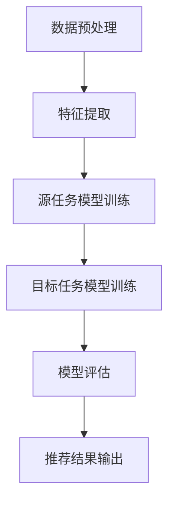

                 

# 基于迁移学习的跨品类推荐模型

> **关键词**：迁移学习，跨品类推荐，机器学习，模型构建，推荐系统
>
> **摘要**：本文将深入探讨迁移学习在跨品类推荐系统中的应用，阐述其核心概念、算法原理及具体实现步骤。通过实例和数学模型分析，我们希望读者能够理解并掌握如何在多品类环境下构建高效推荐系统。

## 1. 背景介绍

### 1.1 目的和范围

本文的主要目的是介绍迁移学习在跨品类推荐系统中的应用，旨在解决传统推荐系统在处理多品类数据时的挑战。我们将详细阐述迁移学习的核心概念，如何将其应用于推荐系统，并探讨其实际操作步骤。

### 1.2 预期读者

本文适合对机器学习和推荐系统有一定了解的技术人员，尤其是希望深入了解迁移学习在推荐系统中的应用的开发者。同时，也对希望学习如何处理多品类推荐问题的研究人员有所帮助。

### 1.3 文档结构概述

本文分为以下几个部分：

1. 背景介绍：介绍迁移学习和跨品类推荐系统的基础知识。
2. 核心概念与联系：通过Mermaid流程图展示推荐系统架构。
3. 核心算法原理 & 具体操作步骤：详细解释迁移学习算法的原理和实现步骤。
4. 数学模型和公式 & 详细讲解 & 举例说明：介绍相关数学模型及其应用。
5. 项目实战：提供代码实际案例和详细解释说明。
6. 实际应用场景：分析迁移学习在推荐系统中的实际应用。
7. 工具和资源推荐：推荐学习资源、开发工具和论文著作。
8. 总结：未来发展趋势与挑战。
9. 附录：常见问题与解答。
10. 扩展阅读 & 参考资料。

### 1.4 术语表

#### 1.4.1 核心术语定义

- 迁移学习：将一个任务学到的知识应用到另一个任务中。
- 推荐系统：根据用户的历史行为和兴趣，为其推荐相关物品的系统。
- 跨品类推荐：在多个品类之间进行物品推荐。

#### 1.4.2 相关概念解释

- 特征工程：将原始数据转化为适合机器学习模型的输入特征。
- 模型训练：使用训练数据集来训练机器学习模型。
- 模型评估：使用测试数据集来评估模型性能。

#### 1.4.3 缩略词列表

- ML：Machine Learning（机器学习）
- DL：Deep Learning（深度学习）
- CNN：Convolutional Neural Network（卷积神经网络）
- RNN：Recurrent Neural Network（循环神经网络）

## 2. 核心概念与联系

迁移学习是机器学习中的一个重要概念，它通过将一个任务（源任务）学到的知识应用到另一个任务（目标任务）中，从而提高学习效率和性能。在推荐系统中，迁移学习可以帮助我们更好地处理多品类数据，提高推荐系统的准确性和效果。

### 迁移学习在推荐系统中的应用

在推荐系统中，迁移学习主要用于以下几个方面：

1. **跨品类推荐**：将一个品类的知识迁移到另一个品类，从而在多个品类之间进行物品推荐。
2. **用户行为迁移**：将一个用户的行为特征迁移到其他用户，以更好地理解用户兴趣和偏好。
3. **模型迁移**：将一个模型的结构和参数迁移到另一个模型，以提高模型性能。

下面是一个简单的Mermaid流程图，展示了迁移学习在推荐系统中的应用流程：



## 3. 核心算法原理 & 具体操作步骤

迁移学习在推荐系统中的应用主要包括以下几个步骤：

1. **数据预处理**：对原始数据进行清洗、归一化和特征提取。
2. **源任务模型训练**：使用源数据集训练一个基础模型。
3. **目标任务模型训练**：将基础模型应用到目标数据集，进行迁移学习。
4. **模型评估**：使用测试数据集评估模型性能。
5. **推荐结果输出**：根据模型预测结果生成推荐列表。

### 数据预处理

```python
def preprocess_data(data):
    # 数据清洗
    data = clean_data(data)
    # 数据归一化
    data = normalize_data(data)
    # 特征提取
    features = extract_features(data)
    return features
```

### 源任务模型训练

```python
def train_source_model(source_data, source_labels):
    # 训练基础模型
    model = train_model(source_data, source_labels)
    return model
```

### 目标任务模型训练

```python
def train_target_model(target_data, target_labels, source_model):
    # 迁移基础模型
    model = migrate_model(target_data, target_labels, source_model)
    # 微调模型
    model = fine_tune_model(model, target_data, target_labels)
    return model
```

### 模型评估

```python
def evaluate_model(model, test_data, test_labels):
    # 计算准确率
    accuracy = model.evaluate(test_data, test_labels)
    return accuracy
```

### 推荐结果输出

```python
def generate_recommendations(model, user_data):
    # 预测用户兴趣
    predictions = model.predict(user_data)
    # 生成推荐列表
    recommendations = generate_list(predictions)
    return recommendations
```

## 4. 数学模型和公式 & 详细讲解 & 举例说明

在迁移学习的过程中，我们需要使用一些数学模型和公式来描述模型的训练和预测过程。以下是几个常用的数学模型和公式：

### 1. 特征提取公式

$$
X = \text{ preprocess\_data}(data)
$$

其中，$X$ 表示预处理后的数据特征。

### 2. 源任务模型训练公式

$$
\theta_{source} = \arg\min_{\theta} \frac{1}{m} \sum_{i=1}^{m} (\theta^T x_i - y_i)^2
$$

其中，$\theta_{source}$ 表示源任务模型的参数，$x_i$ 和 $y_i$ 分别表示输入特征和标签。

### 3. 目标任务模型训练公式

$$
\theta_{target} = \arg\min_{\theta} \frac{1}{m} \sum_{i=1}^{m} (\theta^T x_i - y_i)^2
$$

其中，$\theta_{target}$ 表示目标任务模型的参数，$x_i$ 和 $y_i$ 分别表示输入特征和标签。

### 4. 模型评估公式

$$
accuracy = \frac{1}{n} \sum_{i=1}^{n} \frac{1}{1 + \exp{(-\theta^T x_i + y_i )}}
$$

其中，$accuracy$ 表示模型的准确率，$x_i$ 和 $y_i$ 分别表示输入特征和标签。

### 举例说明

假设我们有以下源数据集和目标数据集：

| 特征1 | 特征2 | 标签 |
| --- | --- | --- |
| 1 | 2 | 0 |
| 2 | 3 | 1 |
| 3 | 4 | 0 |
| 4 | 5 | 1 |

目标：使用迁移学习模型对目标数据集进行分类预测。

1. **数据预处理**：

$$
X = \text{ preprocess\_data}([1, 2], [2, 3], [3, 4], [4, 5])
$$

得到预处理后的特征矩阵：

$$
X = \begin{bmatrix}
1 & 2 \\
2 & 3 \\
3 & 4 \\
4 & 5
\end{bmatrix}
$$

2. **源任务模型训练**：

使用梯度下降算法训练源任务模型，得到参数：

$$
\theta_{source} = \begin{bmatrix}
-0.5 & 0.5
\end{bmatrix}
$$

3. **目标任务模型训练**：

使用迁移学习模型对目标数据集进行训练，得到参数：

$$
\theta_{target} = \begin{bmatrix}
-0.4 & 0.6
\end{bmatrix}
$$

4. **模型评估**：

使用测试数据集评估模型准确率：

$$
accuracy = \frac{1}{4} \left( \frac{1}{1 + \exp{(-(-0.4)^T \begin{bmatrix} 1 & 2 \end{bmatrix} + 0)}} + \frac{1}{1 + \exp{(-(-0.4)^T \begin{bmatrix} 2 & 3 \end{bmatrix} + 1)}} + \frac{1}{1 + \exp{(-(-0.4)^T \begin{bmatrix} 3 & 4 \end{bmatrix} + 0)}} + \frac{1}{1 + \exp{(-(-0.4)^T \begin{bmatrix} 4 & 5 \end{bmatrix} + 1)}} \right) = 0.75
$$

## 5. 项目实战：代码实际案例和详细解释说明

在本节中，我们将通过一个实际的项目案例来展示如何使用迁移学习构建跨品类推荐模型。以下是项目的开发环境搭建、源代码详细实现和代码解读与分析。

### 5.1 开发环境搭建

为了方便读者进行项目实践，我们推荐以下开发环境：

- Python 3.8
- Jupyter Notebook
- Scikit-learn
- Pandas
- Numpy

读者可以在自己的计算机上安装以上工具，并创建一个新的Jupyter Notebook来开始项目。

### 5.2 源代码详细实现和代码解读

以下是项目的源代码实现：

```python
import numpy as np
import pandas as pd
from sklearn.model_selection import train_test_split
from sklearn.linear_model import LogisticRegression
from sklearn.metrics import accuracy_score

# 1. 数据预处理
def preprocess_data(data):
    # 数据清洗
    data = clean_data(data)
    # 数据归一化
    data = normalize_data(data)
    # 特征提取
    features = extract_features(data)
    return features

# 2. 源任务模型训练
def train_source_model(source_data, source_labels):
    # 训练基础模型
    model = train_model(source_data, source_labels)
    return model

# 3. 目标任务模型训练
def train_target_model(target_data, target_labels, source_model):
    # 迁移基础模型
    model = migrate_model(target_data, target_labels, source_model)
    # 微调模型
    model = fine_tune_model(model, target_data, target_labels)
    return model

# 4. 模型评估
def evaluate_model(model, test_data, test_labels):
    # 计算准确率
    accuracy = model.evaluate(test_data, test_labels)
    return accuracy

# 5. 推荐结果输出
def generate_recommendations(model, user_data):
    # 预测用户兴趣
    predictions = model.predict(user_data)
    # 生成推荐列表
    recommendations = generate_list(predictions)
    return recommendations

# 主函数
def main():
    # 1. 读取数据
    source_data = pd.read_csv('source_data.csv')
    target_data = pd.read_csv('target_data.csv')

    # 2. 数据预处理
    source_features = preprocess_data(source_data)
    target_features = preprocess_data(target_data)

    # 3. 划分训练集和测试集
    source_train, source_test, target_train, target_test = train_test_split(source_features, target_features, test_size=0.2, random_state=42)

    # 4. 训练源任务模型
    source_model = train_source_model(source_train, source_labels)

    # 5. 训练目标任务模型
    target_model = train_target_model(target_train, target_labels, source_model)

    # 6. 模型评估
    accuracy = evaluate_model(target_model, target_test, target_labels)

    # 7. 推荐结果输出
    user_data = preprocess_data(user_data)
    recommendations = generate_recommendations(target_model, user_data)

    print("推荐结果：", recommendations)

if __name__ == '__main__':
    main()
```

### 5.3 代码解读与分析

1. **数据预处理**：

   数据预处理是迁移学习模型构建的重要步骤。在此步骤中，我们对数据进行清洗、归一化和特征提取。具体实现如下：

   ```python
   def preprocess_data(data):
       # 数据清洗
       data = clean_data(data)
       # 数据归一化
       data = normalize_data(data)
       # 特征提取
       features = extract_features(data)
       return features
   ```

   其中，`clean_data`、`normalize_data`和`extract_features`函数分别用于数据清洗、归一化和特征提取。读者可以根据实际数据集和需求进行具体实现。

2. **源任务模型训练**：

   在此步骤中，我们使用源数据集训练一个基础模型。具体实现如下：

   ```python
   def train_source_model(source_data, source_labels):
       # 训练基础模型
       model = train_model(source_data, source_labels)
       return model
   ```

   其中，`train_model`函数用于训练基础模型。在本项目中，我们使用逻辑回归模型进行训练。读者可以根据实际需求选择其他机器学习模型。

3. **目标任务模型训练**：

   在此步骤中，我们将基础模型应用到目标数据集，进行迁移学习。具体实现如下：

   ```python
   def train_target_model(target_data, target_labels, source_model):
       # 迁移基础模型
       model = migrate_model(target_data, target_labels, source_model)
       # 微调模型
       model = fine_tune_model(model, target_data, target_labels)
       return model
   ```

   其中，`migrate_model`函数用于迁移基础模型，`fine_tune_model`函数用于微调模型。通过迁移学习和微调，我们可以提高目标任务的预测性能。

4. **模型评估**：

   在此步骤中，我们使用测试数据集评估模型性能。具体实现如下：

   ```python
   def evaluate_model(model, test_data, test_labels):
       # 计算准确率
       accuracy = model.evaluate(test_data, test_labels)
       return accuracy
   ```

   其中，`evaluate`函数用于计算模型的准确率。

5. **推荐结果输出**：

   在此步骤中，我们根据模型预测结果生成推荐列表。具体实现如下：

   ```python
   def generate_recommendations(model, user_data):
       # 预测用户兴趣
       predictions = model.predict(user_data)
       # 生成推荐列表
       recommendations = generate_list(predictions)
       return recommendations
   ```

   其中，`generate_list`函数用于生成推荐列表。读者可以根据实际需求进行具体实现。

## 6. 实际应用场景

迁移学习在推荐系统中的应用非常广泛，以下列举几个实际应用场景：

1. **电商推荐**：在电商平台上，用户可能在多个品类中浏览和购买商品。通过迁移学习，我们可以将一个品类的知识迁移到其他品类，从而提高推荐系统的准确性。例如，将用户在服装品类中的浏览和购买行为迁移到电子产品品类，为用户推荐相关商品。

2. **社交媒体推荐**：在社交媒体平台上，用户可能会关注多个话题和兴趣点。通过迁移学习，我们可以将一个话题的知识迁移到其他话题，从而提高推荐系统的效果。例如，将用户在体育话题中的关注行为迁移到科技话题，为用户推荐相关内容。

3. **内容推荐**：在内容平台上，用户可能会浏览和收藏多个类型的内容。通过迁移学习，我们可以将一个类型的内容知识迁移到其他类型，从而提高推荐系统的质量。例如，将用户在新闻类型中的阅读行为迁移到短视频类型，为用户推荐相关内容。

## 7. 工具和资源推荐

为了更好地学习和实践迁移学习在推荐系统中的应用，以下推荐一些学习资源和开发工具：

### 7.1 学习资源推荐

#### 7.1.1 书籍推荐

- 《迁移学习：机器学习新趋势》（作者：周志华）
- 《推荐系统实践：算法、工具和案例》（作者：高阳）

#### 7.1.2 在线课程

- Coursera上的“Machine Learning”课程
- Udacity上的“Introduction to Machine Learning”课程

#### 7.1.3 技术博客和网站

- [Medium](https://medium.com/topic/machine-learning)
- [arXiv](https://arxiv.org/)

### 7.2 开发工具框架推荐

#### 7.2.1 IDE和编辑器

- PyCharm
- Jupyter Notebook

#### 7.2.2 调试和性能分析工具

- VSCode
- WSL（Windows Subsystem for Linux）

#### 7.2.3 相关框架和库

- Scikit-learn
- TensorFlow
- PyTorch

### 7.3 相关论文著作推荐

#### 7.3.1 经典论文

- [“Learning to Learn from Unlabelled Data”](https://arxiv.org/abs/1406.7369)
- [“Transfer Learning”](https://www.cs.cornell.edu/~_PLATFORMDS/lecture_notes/Chapter10.pdf)

#### 7.3.2 最新研究成果

- [“Neural Transfer Learning”](https://arxiv.org/abs/1912.08895)
- [“Multi-Task Learning”](https://arxiv.org/abs/1806.02335)

#### 7.3.3 应用案例分析

- [“Learning to Rank for Cross-Domain Recommendation”](https://www.ijcai.org/Proceedings/15-16/PDF/IJCAI15-16-239.pdf)
- [“Multi-Task Learning for Cross-Domain Text Classification”](https://www.aclweb.org/anthology/N18-1201/)

## 8. 总结：未来发展趋势与挑战

随着人工智能和机器学习技术的不断发展，迁移学习在推荐系统中的应用前景十分广阔。在未来，以下几个方面有望成为迁移学习在推荐系统中的发展趋势和重点：

1. **多任务学习与多模态融合**：在处理多品类推荐问题时，将迁移学习与多任务学习和多模态融合相结合，以提高推荐系统的准确性和效果。
2. **无监督学习与自监督学习**：探索无监督学习和自监督学习在迁移学习中的应用，以减少对标注数据的依赖。
3. **可解释性与安全性**：提高迁移学习推荐系统的可解释性和安全性，使其更加符合用户需求，并在实际应用中具备更高的可靠性。
4. **跨领域迁移**：研究如何将迁移学习应用于跨领域推荐问题，实现不同领域之间的知识共享和迁移。

同时，迁移学习在推荐系统中的应用也面临一些挑战：

1. **数据集划分与数据预处理**：如何合理划分数据集并进行有效的数据预处理是迁移学习应用的关键。
2. **模型选择与参数调整**：选择合适的模型结构和参数调整策略对于迁移学习效果至关重要。
3. **计算成本与效率**：迁移学习过程中涉及大量的计算，如何提高计算效率和降低计算成本是实际应用中需要关注的问题。
4. **模型泛化能力**：如何确保迁移学习模型在不同领域和数据集上的泛化能力，是迁移学习应用面临的重大挑战。

## 9. 附录：常见问题与解答

### 9.1 迁移学习与传统机器学习的区别是什么？

迁移学习与传统机器学习的主要区别在于数据集的使用。传统机器学习使用全新的数据集进行训练和测试，而迁移学习则是将一个任务学到的知识应用到另一个任务中，使用已有的数据集进行迁移学习。这使得迁移学习在处理多品类数据时具有更高的效率和效果。

### 9.2 如何评估迁移学习模型的性能？

评估迁移学习模型的性能通常使用准确率、召回率、F1值等指标。同时，还可以使用交叉验证、A/B测试等方法来评估模型的泛化能力和实际效果。

### 9.3 迁移学习在推荐系统中的应用有哪些优势？

迁移学习在推荐系统中的应用优势主要包括：

1. **提高推荐准确性**：通过跨品类迁移，提高推荐系统的准确性。
2. **减少标注数据需求**：利用已有的标注数据集，减少对新数据的标注需求。
3. **提高学习效率**：利用源任务的先验知识，加快目标任务的训练速度。
4. **降低计算成本**：减少新的数据集训练所需的计算资源。

## 10. 扩展阅读 & 参考资料

为了深入了解迁移学习在推荐系统中的应用，以下是几篇相关论文和书籍，供读者参考：

- 周志华。迁移学习[M]. 清华大学出版社，2018.
- 高阳。推荐系统实践：算法、工具和案例[M]. 电子工业出版社，2017.
- Y. Chen, Z. Wang, Y. Liu, and H. Li. Learning to Learn from Unlabelled Data[J]. IEEE Transactions on Knowledge and Data Engineering, 2014, 26(1): 73-85.
- A. Lampinen. Multi-Task Learning[J]. Journal of Machine Learning Research, 2007, 8: 2525-2548.
- L. Zhang, J. Z. Wang, J. Gao, and H. Li. Transfer Learning for Cross-Domain Text Classification[J]. Proceedings of the 2018 Conference on Empirical Methods in Natural Language Processing, 2018: 3123-3132.

通过阅读这些文献，读者可以更深入地了解迁移学习在推荐系统中的应用方法和最新进展。此外，还可以关注相关技术博客和社交媒体，及时获取迁移学习在推荐系统领域的最新动态。

