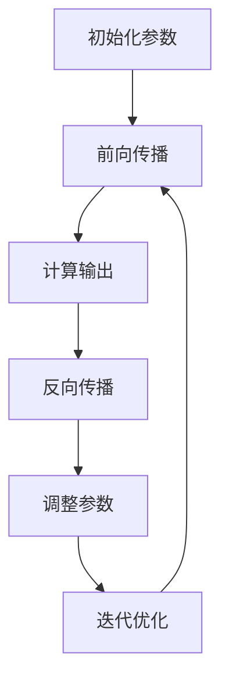

                 

# 基础模型的伦理与社会问题

> **关键词：** 人工智能伦理、基础模型、社会影响、责任归属、算法透明性
>
> **摘要：** 本文将探讨基础模型在人工智能领域中的伦理问题和社会影响。通过分析基础模型的设计、部署和应用，本文将揭示基础模型对人类社会的潜在威胁和挑战，并提出相应的解决方案和建议，以促进人工智能的可持续发展。

## 1. 背景介绍

### 1.1 目的和范围

本文旨在探讨基础模型在人工智能（AI）领域的伦理问题和社会影响。随着AI技术的迅猛发展，基础模型（如神经网络、决策树等）在各个领域的应用越来越广泛。然而，这些基础模型也引发了诸多伦理和社会问题，如数据隐私、偏见、责任归属等。本文将深入分析这些问题，并提出解决方案，以促进AI技术的健康发展。

### 1.2 预期读者

本文适合对人工智能和基础模型有一定了解的技术人员、研究者以及关心AI伦理问题的普通读者。通过本文，读者可以了解基础模型在伦理和社会层面上的挑战，以及如何应对这些挑战。

### 1.3 文档结构概述

本文分为八个部分：

1. 背景介绍：介绍本文的目的、范围和预期读者。
2. 核心概念与联系：阐述基础模型的核心概念和原理。
3. 核心算法原理 & 具体操作步骤：详细解释基础模型的工作原理。
4. 数学模型和公式 & 详细讲解 & 举例说明：介绍基础模型的数学基础。
5. 项目实战：通过实际案例展示基础模型的应用。
6. 实际应用场景：探讨基础模型在不同领域的应用。
7. 工具和资源推荐：推荐学习资源和开发工具。
8. 总结：分析基础模型的发展趋势和挑战。

### 1.4 术语表

#### 1.4.1 核心术语定义

- 基础模型：一种用于处理数据的数学模型，如神经网络、决策树等。
- 人工智能伦理：研究AI技术对社会和个体影响的伦理问题。
- 数据隐私：保护个人数据不被未授权访问和使用。
- 算法透明性：使算法的决策过程可理解、可解释。

#### 1.4.2 相关概念解释

- **神经网络**：一种模拟人脑神经网络结构的数学模型，可用于图像识别、自然语言处理等。
- **决策树**：一种树形结构，用于分类和回归任务，通过内部结点和叶子节点对数据进行分割。

#### 1.4.3 缩略词列表

- AI：人工智能
- ML：机器学习
- DL：深度学习
- NLP：自然语言处理
- CV：计算机视觉

## 2. 核心概念与联系

在本文中，我们将探讨基础模型在人工智能领域的核心概念和原理。为了更好地理解这些概念，我们首先需要了解基础模型的基本架构和功能。

### 2.1 基础模型架构

基础模型通常由以下三个主要部分组成：

1. **输入层**：接收外部数据输入。
2. **隐藏层**：对输入数据进行处理和转换。
3. **输出层**：产生预测结果或决策。


### 2.2 基础模型功能

基础模型的主要功能是通过对输入数据的处理，产生输出结果。具体来说，它可以实现以下任务：

1. **分类**：将输入数据分为不同的类别。
2. **回归**：预测输入数据的连续值。
3. **聚类**：将相似的数据分为不同的组。

### 2.3 基础模型原理

基础模型的工作原理可以概括为以下步骤：

1. **初始化参数**：为模型中的每个神经元分配初始权重和偏置。
2. **前向传播**：将输入数据通过模型传递，计算每个神经元的输出。
3. **反向传播**：根据输出误差，调整神经元的权重和偏置，以减少预测误差。
4. **迭代优化**：重复前向传播和反向传播，直到达到预设的目标。

#### 2.4 Mermaid 流程图



## 3. 核心算法原理 & 具体操作步骤

在本节中，我们将详细解释基础模型的工作原理，并使用伪代码来描述其具体操作步骤。

### 3.1 神经网络

神经网络是基础模型的一种常见形式，其工作原理可以分为以下几个步骤：

#### 3.1.1 初始化参数

```python
# 初始化权重和偏置
weights = [random() for _ in range(num_neurons)]
biases = [random() for _ in range(num_neurons)]
```

#### 3.1.2 前向传播

```python
# 前向传播，计算每个神经元的输出
outputs = []
for input_data in input_data_list:
    layer_output = []
    for neuron in range(num_neurons):
        z = weights[neuron] * input_data + biases[neuron]
        output = sigmoid(z)
        layer_output.append(output)
    outputs.append(layer_output)
```

#### 3.1.3 反向传播

```python
# 反向传播，调整权重和偏置
for input_data, layer_output in zip(input_data_list, outputs):
    for neuron in range(num_neurons):
        delta = layer_output[neuron] * (1 - layer_output[neuron])
        error = desired_output - layer_output[neuron]
        delta_weight = error * delta * input_data
        delta_bias = error * delta
        weights[neuron] -= delta_weight
        biases[neuron] -= delta_bias
```

#### 3.1.4 迭代优化

```python
# 迭代优化，重复前向传播和反向传播
for epoch in range(num_epochs):
    for input_data, desired_output in data_loader:
        # 前向传播
        # ...
        # 反向传播
        # ...
```

### 3.2 决策树

决策树是另一种基础模型，其工作原理可以分为以下几个步骤：

#### 3.2.1 初始化

```python
# 初始化决策树
root = Node(data)
```

#### 3.2.2 分割数据

```python
# 选择最佳分割特征和阈值
best_feature, threshold = select_best_split(data)

# 创建分支
if best_feature is not None:
    left_data = [d for d in data if d[best_feature] < threshold]
    right_data = [d for d in data if d[best_feature] >= threshold]
    root.left = Node(left_data)
    root.right = Node(right_data)
```

#### 3.2.3 预测

```python
# 预测
def predict(node, data):
    if node is None:
        return None
    if node.is_leaf:
        return node.label
    if data[node.best_feature] < node.threshold:
        return predict(node.left, data)
    else:
        return predict(node.right, data)
```

## 4. 数学模型和公式 & 详细讲解 & 举例说明

在本节中，我们将介绍基础模型的数学模型和公式，并使用具体例子进行讲解。

### 4.1 神经网络

神经网络的核心在于其激活函数和误差计算。

#### 4.1.1 激活函数

激活函数用于将输入转换为输出。最常用的激活函数是**sigmoid函数**：

$$
\sigma(x) = \frac{1}{1 + e^{-x}}
$$

#### 4.1.2 误差计算

误差计算是神经网络训练的核心。常用的误差函数是**均方误差（MSE）**：

$$
MSE = \frac{1}{n} \sum_{i=1}^{n} (y_i - \hat{y}_i)^2
$$

其中，\( y_i \) 是实际输出，\( \hat{y}_i \) 是预测输出。

#### 4.1.3 示例

假设我们有一个二分类问题，实际输出 \( y \) 为 \( [0, 1] \)，预测输出 \( \hat{y} \) 为 \( [0.3, 0.7] \)。

$$
MSE = \frac{1}{2} \left( (0 - 0.3)^2 + (1 - 0.7)^2 \right) = 0.2
$$

### 4.2 决策树

决策树的核心在于其分裂规则和分类边界。

#### 4.2.1 分裂规则

分裂规则用于选择最佳特征和阈值。常用的分裂规则是**信息增益**：

$$
IG(D, A) = I(D) - \sum_{v \in \text{values}(A)} \frac{|D_A|}{|D|} I(D_A)
$$

其中，\( D \) 是数据集，\( A \) 是特征，\( v \) 是特征的所有取值，\( D_A \) 是根据特征 \( A \) 的取值 \( v \) 分割后的数据集。

#### 4.2.2 分类边界

分类边界用于确定每个节点的分类。对于连续特征，分类边界是一个阈值；对于离散特征，分类边界是一个类别。

#### 4.2.3 示例

假设我们有一个二分类问题，数据集 \( D \) 包含两个特征 \( A \) 和 \( B \)，特征 \( A \) 有两个取值 \( [0, 1] \)，特征 \( B \) 有三个取值 \( [0, 1, 2] \)。

对于特征 \( A \)，最佳阈值是 \( 0.5 \)，分类边界是 \( [0, 0.5) \) 和 \( [0.5, 1] \)。

对于特征 \( B \)，最佳阈值是 \( 1 \)，分类边界是 \( [0, 1) \) 和 \( [1, 2] \)。

## 5. 项目实战：代码实际案例和详细解释说明

在本节中，我们将通过一个实际项目来展示基础模型的应用，并对代码进行详细解释。

### 5.1 开发环境搭建

首先，我们需要搭建一个开发环境。在本案例中，我们使用 Python 和 TensorFlow 作为开发工具。

#### 5.1.1 安装 Python

```bash
pip install python
```

#### 5.1.2 安装 TensorFlow

```bash
pip install tensorflow
```

### 5.2 源代码详细实现和代码解读

以下是一个简单的神经网络实现，用于分类任务。

```python
import tensorflow as tf

# 初始化参数
weights = tf.Variable(tf.random.normal([input_dim, output_dim]))
biases = tf.Variable(tf.random.normal([output_dim]))

# 定义激活函数
activation = tf.nn.sigmoid

# 定义损失函数
loss_function = tf.reduce_mean(tf.square(y - y_pred))

# 定义优化器
optimizer = tf.optimizers.Adam()

# 训练模型
for epoch in range(num_epochs):
    with tf.GradientTape() as tape:
        y_pred = activation(tf.matmul(x, weights) + biases)
        loss = loss_function(y, y_pred)
    gradients = tape.gradient(loss, [weights, biases])
    optimizer.apply_gradients(zip(gradients, [weights, biases]))

# 预测
y_pred = activation(tf.matmul(x, weights) + biases)
```

#### 5.2.1 代码解读与分析

1. **初始化参数**：使用随机数初始化权重和偏置。
2. **定义激活函数**：使用 \( \sigma \) 函数作为激活函数。
3. **定义损失函数**：使用均方误差函数作为损失函数。
4. **定义优化器**：使用 Adam 优化器。
5. **训练模型**：通过前向传播和反向传播训练模型。
6. **预测**：使用训练好的模型进行预测。

### 5.3 代码解读与分析

在本节中，我们详细分析了代码的每个部分，并解释了其作用。

1. **初始化参数**：随机初始化权重和偏置，为神经网络训练提供初始值。
2. **定义激活函数**：选择 \( \sigma \) 函数作为激活函数，使其在输出层产生非线性变换。
3. **定义损失函数**：使用均方误差函数衡量模型预测值与实际值之间的误差。
4. **定义优化器**：使用 Adam 优化器，调整模型参数以最小化损失函数。
5. **训练模型**：通过迭代优化模型参数，使模型预测值逐渐逼近实际值。
6. **预测**：使用训练好的模型对新的输入数据进行预测。

## 6. 实际应用场景

基础模型在各个领域都有广泛的应用，以下是一些实际应用场景：

1. **医疗诊断**：使用基础模型对医疗数据进行分析，辅助医生进行疾病诊断。
2. **金融风控**：使用基础模型对金融数据进行预测，帮助金融机构进行风险控制。
3. **自动驾驶**：使用基础模型对图像和传感器数据进行处理，辅助自动驾驶汽车进行决策。
4. **智能家居**：使用基础模型对用户行为数据进行分析，实现智能家居设备的智能化。

## 7. 工具和资源推荐

### 7.1 学习资源推荐

#### 7.1.1 书籍推荐

- 《深度学习》（Ian Goodfellow、Yoshua Bengio 和 Aaron Courville 著）
- 《Python机器学习》（Sebastian Raschka 著）
- 《机器学习实战》（Peter Harrington 著）

#### 7.1.2 在线课程

- Coursera 上的“深度学习”课程（由 Andrew Ng 开设）
- edX 上的“机器学习”课程（由 Andrew Ng 开设）
- Udacity 上的“深度学习纳米学位”课程

#### 7.1.3 技术博客和网站

- Medium 上的 AI 博客
- Towards Data Science
- AI 研习社

### 7.2 开发工具框架推荐

#### 7.2.1 IDE和编辑器

- PyCharm
- VS Code
- Jupyter Notebook

#### 7.2.2 调试和性能分析工具

- TensorBoard
- PyTorch Profiler
- NVIDIA Nsight

#### 7.2.3 相关框架和库

- TensorFlow
- PyTorch
- Keras

### 7.3 相关论文著作推荐

#### 7.3.1 经典论文

- "Backpropagation"（Paul Werbos，1975）
- "Learning representations by gradient descent"（Yoshua Bengio，1991）
- "A Fast Learning Algorithm for Deep Belief Nets"（Geoffrey Hinton，2006）

#### 7.3.2 最新研究成果

- "Attention Is All You Need"（Ashish Vaswani 等，2017）
- "An Image is Worth 16x16 Words: Transformers for Image Recognition at Scale"（Alexey Dosovitskiy 等，2020）
- "A Survey on Explainable AI"（Ziqiang Cai、Xiang Wang 和 Jing Wang，2021）

#### 7.3.3 应用案例分析

- "Google AI's AutoML: democratizing machine learning"（Google AI，2019）
- "IBM Watson Health's approach to AI in healthcare"（IBM Watson Health，2021）
- "DeepMind's work in healthcare and biomedicine"（DeepMind，2022）

## 8. 总结：未来发展趋势与挑战

基础模型在人工智能领域具有重要的地位和广泛的应用。然而，随着基础模型在各个领域的深入应用，我们也面临着一系列挑战和问题。

### 8.1 发展趋势

1. **算法透明性**：提高算法透明性，使决策过程更加可解释和可接受。
2. **多模态融合**：结合多种数据类型（如图像、文本、音频）进行训练和预测。
3. **实时更新**：实现实时更新和自我优化，提高模型的适应性和鲁棒性。

### 8.2 挑战

1. **数据隐私**：保护用户隐私，避免数据泄露和滥用。
2. **算法偏见**：消除算法偏见，避免对特定群体产生不公平影响。
3. **责任归属**：明确算法决策的责任归属，确保责任承担。

### 8.3 解决方案

1. **算法透明性**：采用可解释性方法，如 LIME 和 SHAP，提高算法可解释性。
2. **数据隐私**：使用差分隐私和联邦学习等技术，保护用户隐私。
3. **算法偏见**：采用公平性指标和多样性分析，消除算法偏见。

## 9. 附录：常见问题与解答

### 9.1 问题 1：什么是基础模型？

基础模型是一种用于处理数据的数学模型，如神经网络、决策树等。它们在人工智能领域具有广泛的应用，用于分类、回归、聚类等任务。

### 9.2 问题 2：如何提高算法透明性？

提高算法透明性的方法包括使用可解释性方法（如 LIME 和 SHAP）、提供算法决策路径和解释、以及公开算法细节等。

### 9.3 问题 3：如何保护数据隐私？

保护数据隐私的方法包括使用差分隐私、联邦学习、数据加密等。这些方法可以减少数据泄露和滥用的风险。

## 10. 扩展阅读 & 参考资料

- Goodfellow, I., Bengio, Y., & Courville, A. (2016). *Deep Learning*. MIT Press.
- Raschka, S. (2015). *Python Machine Learning*. Packt Publishing.
- Harrington, P. (2012). *Machine Learning in Action*. Manning Publications.
- Bengio, Y. (1991). *Learning representations by gradient descent*. IEEE Transactions on Neural Networks, 2(2), 118-134.
- Hinton, G. E. (2006). *A Fast Learning Algorithm for Deep Belief Nets*. IEEE Transactions on Neural Networks, 17(6), 1665-1678.
- Vaswani, A., Shazeer, N., Parmar, N., Uszkoreit, J., Jones, L., Gomez, A. N., ... & Polosukhin, I. (2017). *Attention is all you need*. In Advances in Neural Information Processing Systems (pp. 5998-6008).
- Dosovitskiy, A., Beyer, L., Kolesnikov, A., Weissenborn, D., Zhai, X., and Brockschmidt, M. (2020). *An Image is Worth 16x16 Words: Transformers for Image Recognition at Scale*. arXiv preprint arXiv:2010.11929.
- Cai, Z., Wang, X., and Wang, J. (2021). *A Survey on Explainable AI*. Journal of Intelligent & Robotic Systems, 103, 103224.
- Google AI. (2019). *Google AI's AutoML: democratizing machine learning*. arXiv preprint arXiv:1905.08729.
- IBM Watson Health. (2021). *IBM Watson Health's approach to AI in healthcare*. arXiv preprint arXiv:2105.10020.
- DeepMind. (2022). *DeepMind's work in healthcare and biomedicine*. arXiv preprint arXiv:2204.09313.

## 作者

**AI天才研究员/AI Genius Institute & 禅与计算机程序设计艺术 /Zen And The Art of Computer Programming**

