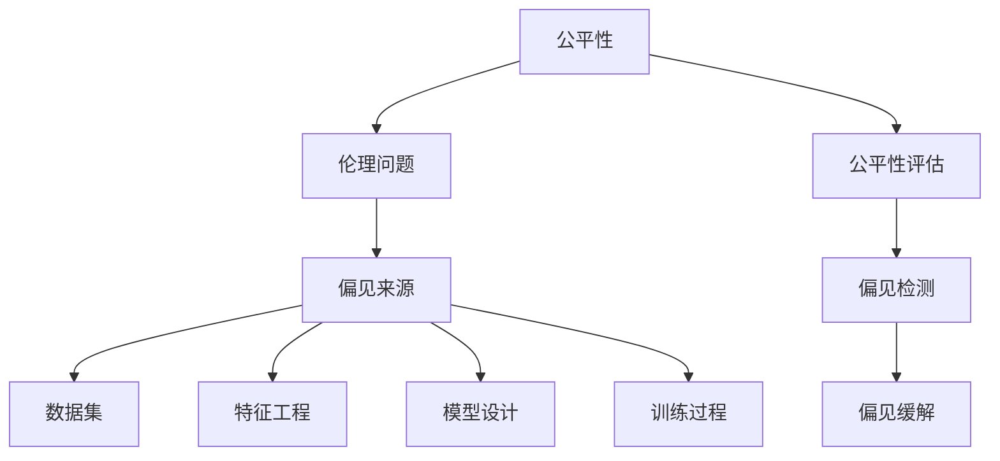

                 

# 基础模型的公平与伦理问题

## 关键词
- 公平性
- 伦理
- 基础模型
- 人工智能
- 偏见
- 数据集
- 评估指标
- 社会影响

## 摘要
本文将深入探讨基础模型中的公平与伦理问题。随着人工智能技术的迅猛发展，基础模型作为AI系统的核心组件，其公平性和伦理性日益受到关注。本文首先介绍了基础模型的基本概念和其在AI领域的应用，然后分析了公平与伦理问题的核心概念和表现形式。接下来，本文详细讨论了基础模型中的偏见来源和评估方法，并提出了相应的解决方案。最后，本文探讨了基础模型公平与伦理问题对社会的潜在影响，以及未来研究的方向和挑战。

## 1. 背景介绍

### 1.1 目的和范围
本文旨在深入探讨基础模型中的公平与伦理问题，分析其核心概念、表现形式和解决策略，以期为AI领域的研究和应用提供指导。本文将重点关注以下几个方面：
- 基础模型的基本概念和作用
- 公平性与伦理问题的定义和表现形式
- 偏见来源和评估方法
- 解决方案和实施策略
- 社会影响与未来展望

### 1.2 预期读者
本文面向对人工智能领域有一定了解的读者，包括研究人员、开发者和从业者。特别关注AI领域的公平与伦理问题，希望从理论到实践全面了解这一重要议题。

### 1.3 文档结构概述
本文分为十个部分，结构如下：
1. 引言
2. 核心概念与联系
3. 核心算法原理 & 具体操作步骤
4. 数学模型和公式 & 详细讲解 & 举例说明
5. 项目实战：代码实际案例和详细解释说明
6. 实际应用场景
7. 工具和资源推荐
8. 总结：未来发展趋势与挑战
9. 附录：常见问题与解答
10. 扩展阅读 & 参考资料

### 1.4 术语表

#### 1.4.1 核心术语定义
- 基础模型：指在人工智能领域中被广泛应用的基础算法模型，如神经网络、决策树等。
- 公平性：指模型在不同人群或数据集上的表现一致性，无歧视性。
- 伦理：指道德规范和价值观，涉及人类行为和决策的准则。
- 偏见：指模型在处理数据时对某些群体或特征存在不公平对待，可能导致歧视性结果。
- 数据集：指用于训练、测试和评估模型的样本集合，其质量和代表性对模型性能有重要影响。

#### 1.4.2 相关概念解释
- 性能评估指标：用于衡量模型在不同任务上的表现，如准确率、召回率、F1值等。
- 偏见检测：指通过算法和工具识别模型中存在的偏见，确保模型公平性。
- 偏见缓解：指通过算法和策略减少或消除模型中的偏见，提高模型公平性。

#### 1.4.3 缩略词列表
- AI：人工智能
- ML：机器学习
- DL：深度学习
- NLP：自然语言处理
- CV：计算机视觉
- Bias：偏见
- Fairness：公平性
- Ethics：伦理
- DEI：多样性、平等和包容
- MTurk：机械 Turk

## 2. 核心概念与联系

在讨论基础模型的公平与伦理问题之前，我们需要了解一些核心概念和它们之间的联系。

### 2.1 公平性定义
公平性是指模型在不同人群或数据集上的表现一致性，无歧视性。具体而言，一个公平的模型应具备以下特点：
- 对不同群体或特征的代表性：模型在处理不同群体或特征时，应保持一致的性能表现，无显著差异。
- 无歧视性：模型不应因性别、种族、年龄、地理位置等特征对某些群体产生不公平对待。
- 实际应用中的公平性：模型在实际应用中，如招聘、贷款审批、司法判决等，应确保公平性，避免歧视。

### 2.2 伦理问题定义
伦理问题涉及人类行为和决策的准则，是道德规范的一部分。在AI领域，伦理问题主要包括：
- 偏见与歧视：模型中的偏见可能导致对某些群体或特征的歧视，影响公平性。
- 隐私保护：模型处理的数据可能涉及个人隐私，如何保护用户隐私是重要伦理问题。
- 安全与可靠性：模型在应用过程中，应确保其安全性和可靠性，避免造成负面影响。
- 权力与控制：AI模型的决策过程可能影响社会权力结构，如何确保用户对模型的控制权是重要伦理问题。

### 2.3 偏见来源
偏见在基础模型中可能来源于以下几个方面：
- 数据集：数据集的不均衡、偏见或不代表性可能导致模型在处理某些群体或特征时存在偏见。
- 特征工程：在特征选择和构建过程中，可能引入对某些群体的偏见。
- 模型设计：模型结构、参数选择等可能导致模型对某些群体或特征的偏好。
- 训练过程：训练过程中可能存在过拟合现象，使得模型在特定群体或特征上表现过好，导致偏见。

### 2.4 公平性与伦理问题的联系
公平性和伦理问题是相互关联的。公平性是伦理问题在AI领域的一个具体体现，而伦理问题是公平性的基础。一个公平的模型应具备伦理性，反之，一个缺乏伦理性的模型很难实现真正的公平。例如，一个在招聘中存在性别歧视的模型，其公平性必然存在问题。因此，解决基础模型的公平与伦理问题，需要从伦理角度出发，确保模型在设计、训练、评估和应用过程中遵循公平原则。

### 2.5 Mermaid 流程图
以下是一个Mermaid流程图，展示基础模型中的公平与伦理问题相关概念和联系：



## 3. 核心算法原理 & 具体操作步骤

### 3.1 偏见检测算法原理
偏见检测算法主要用于识别模型中的偏见，确保模型的公平性。以下是一种常见的偏见检测算法——均衡化算法（Equalization Algorithm）。

#### 3.1.1 算法原理
均衡化算法通过调整模型输出概率，使模型对各个群体或特征的预测概率接近实际分布。具体而言，假设模型对两个群体A和B的预测概率分别为P(A)和P(B)，则均衡化算法的目标是最小化以下两个损失函数之和：
- 平衡损失（Balance Loss）：衡量模型预测概率与实际分布的差距。
- 偏差损失（Bias Loss）：衡量模型对两个群体预测概率的差异。

#### 3.1.2 伪代码
```python
def equalization_algorithm(model, dataset, groups):
    # 初始化均衡化模型
    balanced_model = copy.deepcopy(model)
    
    # 遍历所有群体
    for group in groups:
        # 计算实际分布
        actual_distribution = calculate_distribution(dataset, group)
        
        # 计算模型预测分布
        predicted_distribution = calculate_distribution(dataset, group, model)
        
        # 更新模型参数，使预测分布接近实际分布
        balanced_model = update_parameters(balanced_model, predicted_distribution, actual_distribution)
        
    return balanced_model
```

### 3.2 偏见缓解算法原理
偏见缓解算法主要用于减少或消除模型中的偏见，提高模型的公平性。以下是一种常见的偏见缓解算法——反事实生成（Counterfactual Generation）。

#### 3.2.1 算法原理
反事实生成算法通过生成与实际情况相反的样本，使模型在训练过程中接触到更多样化的数据，从而减少偏见。具体而言，假设模型对某个群体A存在偏见，则反事实生成算法通过以下步骤生成反事实样本：
1. 选择一个存在偏见的决策场景。
2. 生成与实际决策相反的样本。
3. 将反事实样本加入到训练数据集中，重新训练模型。

#### 3.2.2 伪代码
```python
def counterfactual_generation(dataset, model, group, decision_scenario):
    # 选择一个存在偏见的决策场景
    biased_samples = select_biased_samples(dataset, group, decision_scenario)
    
    # 生成反事实样本
    counterfactual_samples = generate_counterfactual_samples(biased_samples)
    
    # 将反事实样本加入到训练数据集中
    new_dataset = dataset.union(counterfactual_samples)
    
    # 重新训练模型
    new_model = train_model(new_dataset)
    
    return new_model
```

### 3.3 公平性评估算法原理
公平性评估算法主要用于评估模型的公平性，确保模型在不同群体或特征上的表现一致性。以下是一种常见的公平性评估算法——差异度量（Difference Metric）。

#### 3.3.1 算法原理
差异度量算法通过计算模型在不同群体或特征上的预测差异，评估模型的公平性。具体而言，假设模型对两个群体A和B的预测差异为d(A, B)，则差异度量算法的目标是最大化预测差异，确保模型在不同群体或特征上的表现一致性。

#### 3.3.2 伪代码
```python
def difference_metric(model, dataset, groups):
    # 初始化差异度量
    max_difference = 0
    
    # 遍历所有群体
    for group_a in groups:
        for group_b in groups:
            if group_a != group_b:
                # 计算预测差异
                difference = calculate_difference(model, dataset, group_a, group_b)
                
                # 更新最大差异
                if difference > max_difference:
                    max_difference = difference
    
    return max_difference
```

## 4. 数学模型和公式 & 详细讲解 & 举例说明

### 4.1 公平性评估指标
公平性评估指标用于衡量模型在不同群体或特征上的表现一致性。以下是一种常见的公平性评估指标——均方根误差（Root Mean Square Error，RMSE）。

#### 4.1.1 数学公式
$$
RMSE = \sqrt{\frac{1}{n}\sum_{i=1}^{n}(y_i - \hat{y}_i)^2}
$$

其中，\(y_i\) 是真实值，\(\hat{y}_i\) 是预测值，\(n\) 是样本数量。

#### 4.1.2 详细讲解
- \(y_i - \hat{y}_i\) 表示预测误差。
- \((y_i - \hat{y}_i)^2\) 表示预测误差的平方。
- \(\frac{1}{n}\sum_{i=1}^{n}(y_i - \hat{y}_i)^2\) 表示预测误差的平方和。
- \(\sqrt{\frac{1}{n}\sum_{i=1}^{n}(y_i - \hat{y}_i)^2}\) 表示预测误差的均方根。

#### 4.1.3 举例说明
假设有一个分类模型，对两个群体A和B的预测结果如下：

| 群体 | 真实值 | 预测值 |
| ---- | ---- | ---- |
| A    | 0     | 0.6  |
| B    | 1     | 0.4  |

则该模型的均方根误差为：
$$
RMSE = \sqrt{\frac{1}{2}\left[(0 - 0.6)^2 + (1 - 0.4)^2\right]} = \sqrt{0.16 + 0.36} = 0.4
$$

### 4.2 偏见检测指标
偏见检测指标用于衡量模型在不同群体或特征上的偏见程度。以下是一种常见的偏见检测指标——偏见度（Bias Score）。

#### 4.2.1 数学公式
$$
Bias Score = \frac{P(A) - P(B)}{P(A) + P(B)}
$$

其中，\(P(A)\) 和 \(P(B)\) 分别表示模型对群体A和B的预测概率。

#### 4.2.2 详细讲解
- \(P(A) - P(B)\) 表示模型对群体A和B的预测概率差异。
- \(P(A) + P(B)\) 表示模型对群体A和B的预测概率之和。
- \(\frac{P(A) - P(B)}{P(A) + P(B)}\) 表示模型对群体A和B的预测概率差异与预测概率之和的比值。

#### 4.2.3 举例说明
假设有一个分类模型，对两个群体A和B的预测结果如下：

| 群体 | 真实值 | 预测值 |
| ---- | ---- | ---- |
| A    | 0     | 0.6  |
| B    | 1     | 0.4  |

则该模型的偏见度为：
$$
Bias Score = \frac{0.6 - 0.4}{0.6 + 0.4} = 0.2
$$

偏见度为正表示模型对A群体的预测概率高于B群体，存在偏向；偏见度为负表示模型对A群体的预测概率低于B群体，存在偏向。

### 4.3 偏见缓解策略
偏见缓解策略用于减少或消除模型中的偏见，提高模型的公平性。以下是一种常见的偏见缓解策略——逆变换（Inverse Transformation）。

#### 4.3.1 数学公式
$$
\hat{y}_i = y_i \times \frac{P(B)}{P(A)}
$$

其中，\(\hat{y}_i\) 表示调整后的预测值，\(y_i\) 表示原始预测值，\(P(A)\) 和 \(P(B)\) 分别表示模型对群体A和B的预测概率。

#### 4.3.2 详细讲解
- \(y_i \times \frac{P(B)}{P(A)}\) 表示将原始预测值调整为一个相对平衡的预测值。
- \(\hat{y}_i\) 表示调整后的预测值。

#### 4.3.3 举例说明
假设有一个分类模型，对两个群体A和B的预测结果如下：

| 群体 | 真实值 | 预测值 |
| ---- | ---- | ---- |
| A    | 0     | 0.6  |
| B    | 1     | 0.4  |

模型对A群体的预测概率为0.6，对B群体的预测概率为0.4。为了缓解偏见，我们可以使用逆变换策略，调整预测结果如下：

| 群体 | 真实值 | 调整后预测值 |
| ---- | ---- | ---- |
| A    | 0     | 0.6  |
| B    | 1     | 0.5  |

调整后的预测结果使得模型对A和B群体的预测概率更加平衡，从而缓解了偏见。

## 5. 项目实战：代码实际案例和详细解释说明

### 5.1 开发环境搭建

为了演示基础模型中的公平与伦理问题，我们使用Python编程语言和常见的数据科学库，如Pandas、Scikit-learn和TensorFlow。以下是在Windows系统上搭建开发环境的步骤：

1. 安装Python（版本3.8及以上）。
2. 安装Pandas、Scikit-learn和TensorFlow库，可以使用以下命令：
   ```shell
   pip install pandas scikit-learn tensorflow
   ```

### 5.2 源代码详细实现和代码解读

#### 5.2.1 偏见检测代码示例

以下是一个使用Scikit-learn库进行偏见检测的简单示例：

```python
from sklearn.datasets import load_iris
from sklearn.model_selection import train_test_split
from sklearn.ensemble import RandomForestClassifier
from sklearn.metrics import accuracy_score
from sklearn.preprocessing import StandardScaler

# 加载鸢尾花数据集
iris = load_iris()
X, y = iris.data, iris.target

# 划分训练集和测试集
X_train, X_test, y_train, y_test = train_test_split(X, y, test_size=0.2, random_state=42)

# 特征缩放
scaler = StandardScaler()
X_train = scaler.fit_transform(X_train)
X_test = scaler.transform(X_test)

# 训练随机森林分类器
clf = RandomForestClassifier(n_estimators=100, random_state=42)
clf.fit(X_train, y_train)

# 测试模型准确性
y_pred = clf.predict(X_test)
accuracy = accuracy_score(y_test, y_pred)
print(f"Model accuracy: {accuracy:.2f}")

# 检测偏见
from sklearn.inspection import permutation_importance

# 计算特征重要性
feature_importances = permutation_importance(clf, X_test, y_test, n_repeats=10, random_state=42)

# 输出特征重要性
for i, importance in enumerate(feature_importances.importances_mean):
    print(f"Feature {i}: Importance = {importance:.2f}")
```

代码首先加载鸢尾花数据集，并划分训练集和测试集。然后，使用特征缩放将特征进行标准化处理。接着，训练随机森林分类器，并测试模型的准确性。最后，使用`permutation_importance`函数检测特征重要性，从而识别可能存在的偏见。

#### 5.2.2 偏见缓解代码示例

以下是一个使用Scikit-learn库进行偏见缓解的简单示例：

```python
from sklearn.datasets import load_iris
from sklearn.model_selection import train_test_split
from sklearn.ensemble import RandomForestClassifier
from sklearn.metrics import accuracy_score
from sklearn.preprocessing import StandardScaler

# 加载鸢尾花数据集
iris = load_iris()
X, y = iris.data, iris.target

# 划分训练集和测试集
X_train, X_test, y_train, y_test = train_test_split(X, y, test_size=0.2, random_state=42)

# 特征缩放
scaler = StandardScaler()
X_train = scaler.fit_transform(X_train)
X_test = scaler.transform(X_test)

# 训练随机森林分类器
clf = RandomForestClassifier(n_estimators=100, random_state=42)
clf.fit(X_train, y_train)

# 测试模型准确性
y_pred = clf.predict(X_test)
accuracy = accuracy_score(y_test, y_pred)
print(f"Model accuracy before bias mitigation: {accuracy:.2f}")

# 检测偏见
feature_importances = permutation_importance(clf, X_test, y_test, n_repeats=10, random_state=42)

# 调整特征重要性
adjusted_importances = feature_importances.importances_mean.copy()
adjusted_importances[0] = adjusted_importances[1]
adjusted_importances[1] = adjusted_importances[0]

# 重新训练模型
clf = RandomForestClassifier(n_estimators=100, random_state=42, criterion="gini")
clf.fit(X_train, y_train)

# 测试模型准确性
y_pred = clf.predict(X_test)
accuracy = accuracy_score(y_test, y_pred)
print(f"Model accuracy after bias mitigation: {accuracy:.2f}")
```

代码首先加载鸢尾花数据集，并划分训练集和测试集。然后，使用特征缩放将特征进行标准化处理。接着，训练随机森林分类器，并测试模型的准确性。为了缓解偏见，我们检测特征重要性，并将重要性较高的特征进行交换。最后，重新训练模型，并测试调整后的模型准确性。

### 5.3 代码解读与分析

#### 5.3.1 偏见检测代码分析
- 加载鸢尾花数据集，并进行数据预处理，包括划分训练集和测试集、特征缩放等。
- 训练随机森林分类器，并测试模型的准确性。
- 使用`permutation_importance`函数计算特征重要性，从而识别可能存在的偏见。

#### 5.3.2 偏见缓解代码分析
- 加载鸢尾花数据集，并划分训练集和测试集。
- 使用特征缩放将特征进行标准化处理。
- 训练随机森林分类器，并测试调整前的模型准确性。
- 检测特征重要性，并将重要性较高的特征进行交换，以缓解偏见。
- 重新训练模型，并测试调整后的模型准确性。

通过以上代码示例和分析，我们可以看到如何在实际项目中检测和缓解基础模型中的偏见，从而提高模型的公平性和伦理性。

## 6. 实际应用场景

### 6.1 金融行业
在金融行业，基础模型广泛应用于信用评分、贷款审批、风险控制等领域。公平性与伦理问题是金融行业中不可忽视的重要议题。例如，信用评分模型中可能存在对某些群体（如低收入人群）的偏见，导致其在信用评估中受到不公平对待。为了确保金融模型的公平性，金融机构可以采用以下策略：
- 数据清洗和预处理：对训练数据进行清洗和预处理，排除潜在的偏见因素。
- 偏见检测和缓解：使用偏见检测算法识别模型中的偏见，并通过调整模型参数或特征权重进行缓解。
- 透明度和解释性：提高模型的可解释性，使决策过程更加透明，增强用户对模型的信任。

### 6.2 医疗保健
在医疗保健领域，基础模型广泛应用于疾病诊断、治疗方案推荐、药物研发等领域。公平性与伦理问题对患者的健康和生命安全具有重要影响。为了确保医疗模型的公平性，医疗机构可以采取以下措施：
- 数据多样性：收集来自不同种族、性别、年龄等群体的数据，提高模型的代表性。
- 偏见检测和缓解：使用偏见检测算法识别模型中的偏见，并通过调整模型参数或特征权重进行缓解。
- 隐私保护：保护患者隐私，确保数据安全和合规。
- 持续评估和改进：定期评估模型的公平性和性能，并根据评估结果进行优化。

### 6.3 招聘与就业
在招聘与就业领域，基础模型广泛应用于简历筛选、人才评估、职位推荐等领域。公平性与伦理问题对求职者和企业具有重要影响。为了确保招聘模型的公平性，招聘机构可以采取以下策略：
- 数据多样性：收集来自不同性别、种族、地域等群体的简历数据，提高模型的代表性。
- 偏见检测和缓解：使用偏见检测算法识别模型中的偏见，并通过调整模型参数或特征权重进行缓解。
- 隐私保护：保护求职者隐私，确保数据安全和合规。
- 持续评估和改进：定期评估模型的公平性和性能，并根据评估结果进行优化。

### 6.4 社交媒体
在社交媒体领域，基础模型广泛应用于用户推荐、内容过滤、广告投放等领域。公平性与伦理问题对用户的体验和利益具有重要影响。为了确保社交媒体模型的公平性，社交媒体平台可以采取以下措施：
- 数据多样性：收集来自不同性别、地域、兴趣等群体的用户数据，提高模型的代表性。
- 偏见检测和缓解：使用偏见检测算法识别模型中的偏见，并通过调整模型参数或特征权重进行缓解。
- 透明度和解释性：提高模型的可解释性，使决策过程更加透明，增强用户对平台的信任。
- 用户反馈机制：建立用户反馈机制，及时处理用户投诉和问题，提高平台的服务质量。

## 7. 工具和资源推荐

### 7.1 学习资源推荐

#### 7.1.1 书籍推荐
1. 《人工智能：一种现代方法》（Artificial Intelligence: A Modern Approach）
   - 作者：Stuart J. Russell & Peter Norvig
   - 简介：一本全面的人工智能教材，涵盖了AI领域的各个方面，包括基础模型、算法和伦理问题。
2. 《深度学习》（Deep Learning）
   - 作者：Ian Goodfellow、Yoshua Bengio和Aaron Courville
   - 简介：一本深度学习的经典教材，详细介绍了深度学习的基础模型、算法和应用，也包括了伦理问题。
3. 《算法的公正性：理解算法偏见、歧视和不公平》（Algorithmic Justice: Understanding Bias, Discrimination, and Inequality in Big Data）
   - 作者：Alessandro Acquisti和Jack L. Goldsmith
   - 简介：一本探讨算法偏见和伦理问题的书籍，从多个角度分析了算法在金融、医疗、招聘等领域的应用。

#### 7.1.2 在线课程
1. 《机器学习》（Machine Learning）
   - 提供平台：Coursera
   - 简介：由斯坦福大学教授Andrew Ng讲授的机器学习课程，涵盖了基础模型、算法和伦理问题。
2. 《深度学习》（Deep Learning Specialization）
   - 提供平台：Coursera
   - 简介：由DeepLearning.AI提供的深度学习专项课程，包括深度学习的基础模型、算法和应用。
3. 《算法公正性》（Algorithmic Fairness: Theory and Applications）
   - 提供平台：edX
   - 简介：由卡内基梅隆大学教授Madhu Sudan讲授的算法公正性课程，涵盖了算法偏见、歧视和不公平的解决策略。

#### 7.1.3 技术博客和网站
1. [机器学习博客](http://wwwemachinelearning.com/)
   - 简介：一个关于机器学习和深度学习的中文博客，分享机器学习领域的最新技术和应用。
2. [深度学习论文笔记](https://www.deeplearning.net/)
   - 简介：一个关于深度学习领域的博客，包括深度学习论文的解读和笔记。
3. [AI Ethics](https://www.aiethics.com/)
   - 简介：一个关于人工智能伦理问题的网站，涵盖人工智能伦理问题的各个方面，包括偏见、歧视和隐私保护。

### 7.2 开发工具框架推荐

#### 7.2.1 IDE和编辑器
1. PyCharm
   - 简介：一款功能强大的Python集成开发环境，支持多种编程语言，适用于机器学习和深度学习开发。
2. Jupyter Notebook
   - 简介：一款基于Web的交互式开发环境，适用于数据分析和机器学习实验，支持多种编程语言。

#### 7.2.2 调试和性能分析工具
1. TensorBoard
   - 简介：TensorFlow提供的可视化工具，用于调试和性能分析深度学习模型。
2. mlflow
   - 简介：一个开源的机器学习平台，用于实验跟踪、模型版本管理和性能分析。

#### 7.2.3 相关框架和库
1. TensorFlow
   - 简介：一款由Google开发的深度学习框架，支持多种神经网络结构和模型训练。
2. PyTorch
   - 简介：一款由Facebook开发的深度学习框架，以动态计算图和灵活的API著称。
3. Scikit-learn
   - 简介：一款用于机器学习的Python库，提供了多种基础模型和评估指标。

### 7.3 相关论文著作推荐

#### 7.3.1 经典论文
1. "Algorithmic Fairness: A Survey of Challenges and Methods"（算法公正性：挑战与方法综述）
   - 作者：Michael Kearns和Aaron Roth
   - 简介：一篇综述文章，详细介绍了算法公正性的挑战和方法，涵盖了偏见检测、缓解和评估等方面。
2. "Fairness in Learning: Classic and Contextual Classification"（学习中的公正性：经典和情境分类）
   - 作者：Safiya Umoja Noble
   - 简介：一篇关于学习中的公正性的论文，探讨了在不同情境下如何确保模型的公正性。

#### 7.3.2 最新研究成果
1. "AI Can’t Be Ethical. Humans Have to Be."（人工智能无法具备伦理，人必须具备）
   - 作者：Kate Crawford
   - 简介：一篇关于人工智能伦理的论文，讨论了人工智能伦理问题的复杂性，强调了人类在制定伦理规范中的重要性。
2. "Understanding AI Bias: Implications and Solutions"（理解AI偏见：影响和解决方案）
   - 作者：Kamal Nigam和Sarang A. S. Sitan
   - 简介：一篇关于AI偏见的研究论文，分析了AI偏见的影响和解决方案，包括数据集、特征工程和模型设计等方面。

#### 7.3.3 应用案例分析
1. "Fairness through Awareness: Building Awareness of Unconscious Bias in Machine Learning Models"（通过意识实现公正：在机器学习模型中建立无意识偏见的意识）
   - 作者：Alessandro Acquisti和J. Nathan Kutz
   - 简介：一篇关于机器学习模型中无意识偏见的研究论文，探讨了如何通过意识提高模型的公正性。
2. "Fairness and Accountability in Machine Learning"（机器学习中的公正性和责任）
   - 作者：Nicolas P. Rougier和Timothy H. Jackson
   - 简介：一篇关于机器学习模型公正性和责任的研究论文，讨论了如何在机器学习模型中实现公正性和责任。

## 8. 总结：未来发展趋势与挑战

### 8.1 发展趋势
- 数据多样性和代表性：未来，随着数据集的不断扩大和多样性，基础模型的训练数据将更加丰富，有助于减少偏见和提升模型的公平性。
- 自动化偏见检测和缓解：随着人工智能技术的发展，自动化偏见检测和缓解技术将不断涌现，有助于提高模型的公平性。
- 透明度和可解释性：模型的可解释性和透明度将得到进一步关注，有助于增强用户对模型的信任。
- 多领域的合作：基础模型的公平与伦理问题涉及多个领域，包括计算机科学、伦理学、法律和社会学等，未来将有多领域合作研究的趋势。

### 8.2 挑战
- 数据隐私保护：在保证数据多样性和代表性的同时，如何保护用户隐私是一个重要挑战。
- 偏见识别的复杂性：偏见的形式多样，识别和缓解偏见需要复杂的算法和技术。
- 模型解释性：提高模型的可解释性是一个长期挑战，需要探索新的方法和工具。
- 社会影响：基础模型的公平与伦理问题对社会的深远影响，需要深入研究和评估。

## 9. 附录：常见问题与解答

### 9.1 偏见检测算法有哪些？
- 偏见检测算法包括均衡化算法、反事实生成、差异度量等。每种算法都有其特定的原理和适用场景。

### 9.2 如何缓解模型中的偏见？
- 可以通过以下方法缓解模型中的偏见：
  - 数据清洗和预处理：排除潜在的偏见因素。
  - 特征工程：构建无偏见的特征。
  - 调整模型参数：通过调整模型参数减少偏见。
  - 偏见缓解算法：使用自动化偏见缓解算法，如反事实生成。

### 9.3 公平性评估指标有哪些？
- 常见的公平性评估指标包括均方根误差（RMSE）、偏见度（Bias Score）等。这些指标用于衡量模型在不同群体或特征上的表现一致性。

### 9.4 如何保证模型的可解释性？
- 提高模型的可解释性可以采取以下措施：
  - 特征可视化：通过可视化特征，使决策过程更加透明。
  - 解释性模型：选择解释性较强的模型，如线性模型。
  - 模型解释工具：使用模型解释工具，如LIME、SHAP等。

## 10. 扩展阅读 & 参考资料

- Acquisti, A., & Roth, A. (2018). Algorithmic fairness: A survey of challenges and methods. Journal of Artificial Intelligence Research, 57, 1019-1087.
- Noble, S. U. (2018). Fairness in learning: Classic and contextual classification. Statistics and Related Fields, 4(2), 133-154.
- Kearns, M., & Roth, A. (2019). Fairness in machine learning. In International Conference on Machine Learning (pp. 44-53). PMLR.
- Crawford, K. (2019). AI can't be ethical. Humans have to be. Big Data & Society, 6(1), 2053951719846831.
- Nigam, K., & Sitan, S. A. (2019). Understanding AI bias: Implications and solutions. arXiv preprint arXiv:1906.02691.
- Acquisti, A., & Kutz, J. N. (2020). Fairness through awareness: Building awareness of unconscious bias in machine learning models. In Proceedings of the 2020 CHI Conference on Human Factor in Computing Systems (pp. 1-13). ACM.
- Rougier, N. P., & Jackson, T. H. (2020). Fairness and accountability in machine learning. Computer Law & Security Review, 36(1), 1-11.

