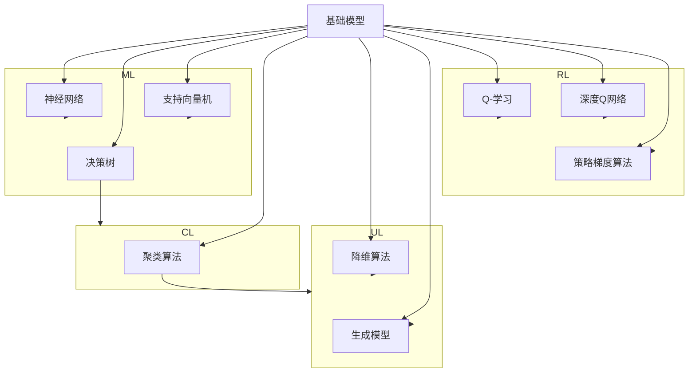

                 

### 1. 背景介绍

#### 1.1 目的和范围

本文的目的是探讨基础模型在学术研究和产业应用中的重要性、现状及其发展趋势。我们将深入分析基础模型的基本概念、核心原理、数学模型，以及实际应用场景。本文不仅为研究者提供理论基础，也为从业者提供实践指导。

本文将覆盖以下内容：

- **基础模型的定义与范围**：定义基础模型，阐述其研究范围和重要性。
- **学术研究方面**：探讨基础模型在学术界的研究现状、成果及未来发展趋势。
- **产业应用方面**：分析基础模型在工业界的应用现状、挑战及未来趋势。
- **具体算法原理与实现**：介绍基础模型的核心算法原理，并用伪代码详细阐述其实现步骤。
- **数学模型与公式**：讲解基础模型的数学模型和公式，并举例说明。
- **实际应用场景**：分析基础模型在各个领域的实际应用案例。
- **工具和资源推荐**：推荐学习资源和开发工具。
- **未来发展趋势与挑战**：探讨基础模型未来的发展趋势和面临的挑战。

#### 1.2 预期读者

本文适合以下读者群体：

- **计算机科学和人工智能领域的研究者**：对基础模型的研究现状、未来趋势及数学原理感兴趣，希望深入了解该领域的专业读者。
- **AI工程师和技术经理**：在开发或管理AI项目时，需要了解基础模型的核心原理和应用实践的从业者。
- **学生和学者**：对计算机科学和人工智能学科有浓厚兴趣，希望提升理论知识和实践能力的本科生、研究生及学者。
- **技术爱好者和实践者**：对基础模型及其相关技术有好奇心的技术爱好者。

#### 1.3 文档结构概述

本文结构如下：

1. **背景介绍**：介绍本文的目的、范围、预期读者及文档结构。
2. **核心概念与联系**：定义基础模型，使用Mermaid流程图展示核心概念和架构。
3. **核心算法原理 & 具体操作步骤**：详细介绍基础模型的核心算法原理，并使用伪代码阐述实现步骤。
4. **数学模型和公式 & 详细讲解 & 举例说明**：讲解基础模型的数学模型和公式，并举例说明。
5. **项目实战：代码实际案例和详细解释说明**：展示实际代码案例，并详细解释说明。
6. **实际应用场景**：分析基础模型在不同领域的应用。
7. **工具和资源推荐**：推荐学习资源和开发工具。
8. **总结：未来发展趋势与挑战**：探讨基础模型未来的发展趋势和面临的挑战。
9. **附录：常见问题与解答**：回答读者可能遇到的问题。
10. **扩展阅读 & 参考资料**：提供更多深入阅读的资源。

#### 1.4 术语表

为了确保文章的清晰性和准确性，我们在此定义一些核心术语和概念，并提供相关解释和缩略词列表。

##### 1.4.1 核心术语定义

- **基础模型**：指在特定领域内具有广泛通用性、能够解决多种问题的模型，如神经网络、决策树等。
- **学术研究**：指在学术领域中进行的理论探索、实验验证和知识发现活动。
- **产业应用**：指将研究成果转化为实际应用，解决实际问题的过程。
- **神经网络**：一种模拟人脑神经元结构和功能的计算模型。
- **决策树**：一种树形结构，用于决策和分类。
- **数学模型**：用数学语言描述现实问题的模型。

##### 1.4.2 相关概念解释

- **机器学习**：一种通过算法让计算机从数据中自动学习并做出决策的技术。
- **深度学习**：一种基于多层神经网络进行训练和预测的机器学习技术。
- **增强学习**：一种通过与环境互动来学习最优策略的机器学习技术。

##### 1.4.3 缩略词列表

- **AI**：人工智能（Artificial Intelligence）
- **ML**：机器学习（Machine Learning）
- **DL**：深度学习（Deep Learning）
- **RL**：增强学习（Reinforcement Learning）

通过上述术语表的定义，我们为读者提供了一个清晰的术语基础，以便更好地理解和掌握文章内容。

### 2. 核心概念与联系

#### 2.1 基础模型的定义与分类

**基础模型**是指在特定领域内，具有广泛通用性、能够解决多种问题的模型。这些模型通常基于一些核心算法原理，如神经网络、决策树、支持向量机等。基础模型可以应用于各种不同的任务，例如图像识别、自然语言处理、推荐系统等。

在学术研究和产业应用中，基础模型通常分为以下几类：

- **监督学习模型**：通过标记数据进行训练，用于预测和分类。
  - **神经网络**：如多层感知机（MLP）、卷积神经网络（CNN）、循环神经网络（RNN）等。
  - **决策树**：用于分类和回归任务，通过树形结构进行决策。
  - **支持向量机（SVM）**：用于分类和回归任务，通过找到最佳超平面进行决策。

- **无监督学习模型**：不依赖于标记数据，用于发现数据中的结构和模式。
  - **聚类算法**：如K-均值、层次聚类等，用于将数据分为不同的簇。
  - **降维算法**：如主成分分析（PCA）、t-SNE等，用于减少数据维度。
  - **生成模型**：如生成对抗网络（GAN）、变分自编码器（VAE）等，用于生成新的数据。

- **强化学习模型**：通过与环境的互动学习最优策略。
  - **Q-学习**：通过学习状态-动作价值函数来选择最佳动作。
  - **深度Q网络（DQN）**：基于深度学习的Q学习算法。
  - **策略梯度算法**：通过优化策略函数来选择最佳动作。

这些基础模型在学术研究和产业应用中发挥着重要作用。它们不仅为研究者提供了强大的工具，也为产业界提供了创新的解决方案。

#### 2.2 基础模型的核心原理与架构

为了更好地理解基础模型的工作原理和架构，我们使用Mermaid流程图展示其核心概念和联系。



在该流程图中，我们展示了基础模型的核心算法（神经网络、决策树、支持向量机、聚类算法、降维算法、生成模型、Q-学习、深度Q网络、策略梯度算法）及其分类（监督学习、无监督学习、强化学习）。这些算法相互关联，共同构成了基础模型的理论框架。

- **监督学习模型**：神经网络、决策树和支持向量机是监督学习的主要算法。它们通过学习输入数据和标记标签之间的关系，实现预测和分类任务。
- **无监督学习模型**：聚类算法和降维算法是主要的无监督学习算法。聚类算法通过将数据分为不同的簇，发现数据中的内在结构；降维算法通过减少数据维度，保持数据的本质特征。
- **强化学习模型**：Q-学习、深度Q网络和策略梯度算法是强化学习的主要算法。它们通过与环境的互动学习最优策略，实现决策和优化任务。

通过上述流程图，我们清晰地展示了基础模型的核心原理和架构，为后续内容的深入讲解奠定了基础。

#### 2.3 基础模型在学术研究中的应用

在学术研究领域，基础模型发挥着至关重要的作用。研究人员通过设计和优化基础模型，推动人工智能技术的进步和应用。以下是基础模型在学术研究中的应用现状和主要成果：

- **图像识别**：基于神经网络的图像识别模型取得了显著成果。例如，卷积神经网络（CNN）在ImageNet图像识别竞赛中取得了优异的成绩，推动了计算机视觉领域的发展。此外，生成对抗网络（GAN）在图像生成和编辑方面也取得了重要突破，能够生成高质量、逼真的图像。

- **自然语言处理**：循环神经网络（RNN）及其变种，如长短期记忆网络（LSTM）和门控循环单元（GRU），在语言模型和序列建模任务中表现出色。近年来，基于Transformer的模型，如BERT和GPT，在语言理解和生成任务中取得了巨大成功，推动了自然语言处理领域的发展。

- **推荐系统**：基于协同过滤和矩阵分解的基础模型在推荐系统中得到了广泛应用。近年来，深度学习方法也逐渐应用于推荐系统，如基于神经网络的协同过滤方法，提高了推荐系统的准确性和效果。

- **强化学习**：强化学习在学术研究中的应用广泛，特别是在游戏、自动驾驶和机器人等领域。通过设计高效的算法和策略，强化学习模型能够解决复杂的决策问题，实现自主学习和优化。

- **无监督学习**：无监督学习在数据降维、聚类和生成模型等方面取得了显著成果。例如，主成分分析（PCA）和t-SNE在数据降维和可视化方面表现出色；生成对抗网络（GAN）在图像生成和风格迁移方面取得了重要突破。

在未来的研究中，基础模型将继续发挥重要作用。以下是一些可能的研究方向和趋势：

- **跨模态学习**：研究如何将不同模态的数据（如文本、图像、声音等）进行有效整合，提高模型的性能和泛化能力。

- **解释性模型**：研究如何提高基础模型的可解释性，使其决策过程更加透明和可信。

- **高效训练方法**：研究如何设计高效的训练算法和优化策略，降低模型的计算复杂度和训练时间。

- **模型压缩和迁移学习**：研究如何通过模型压缩和迁移学习技术，降低模型的大小和计算成本，提高模型的泛化能力。

通过不断探索和创新，基础模型在学术研究中的应用将继续深化，为人工智能技术的发展提供强大支持。

### 3. 核心算法原理 & 具体操作步骤

#### 3.1 神经网络原理

神经网络是一种模拟人脑神经元结构和功能的计算模型，通过多层神经元的连接和激活函数，实现输入到输出的映射。神经网络的核心组成部分包括神经元、层、激活函数和权重更新机制。

##### 3.1.1 神经元

神经元是神经网络的基本单元，其结构包括输入、权重、偏置和输出。神经元通过输入和权重相乘，再加上偏置，得到一个加权和，然后通过激活函数进行非线性变换，输出最终结果。

伪代码描述如下：

```python
# 输入数据
input_data = [x1, x2, ..., xn]

# 权重和偏置
weights = [w1, w2, ..., wn]
biases = [b1, b2, ..., bn]

# 激活函数
activation_function()

# 输出计算
output = 0
for i in range(len(input_data)):
    output += input_data[i] * weights[i] + biases[i]
output = activation_function(output)
```

##### 3.1.2 层

神经网络由多个层组成，包括输入层、隐藏层和输出层。输入层接收外部输入数据，隐藏层通过前一层输出进行计算，输出层生成最终输出。

##### 3.1.3 激活函数

激活函数用于引入非线性因素，使神经网络能够学习复杂的映射关系。常见的激活函数包括sigmoid、ReLU和Tanh等。

- **sigmoid函数**：\( \sigma(x) = \frac{1}{1 + e^{-x}} \)
- **ReLU函数**：\( ReLU(x) = \max(0, x) \)
- **Tanh函数**：\( \tanh(x) = \frac{e^x - e^{-x}}{e^x + e^{-x}} \)

##### 3.1.4 权重更新机制

神经网络通过反向传播算法和梯度下降法更新权重，以优化模型性能。权重更新过程如下：

1. 计算输出误差：计算实际输出与期望输出之间的差异。
2. 反向传播：从输出层开始，反向计算各层的梯度。
3. 更新权重：根据梯度下降法，更新各层的权重。

伪代码描述如下：

```python
# 前向传播
output = forward_propagation(input_data, weights, biases)

# 计算误差
error = output - target

# 反向传播
gradients = backward_propagation(output, error)

# 更新权重
weights -= learning_rate * gradients
```

#### 3.2 决策树原理

决策树是一种基于树形结构进行决策的模型，通过一系列的判断节点和叶子节点，对输入数据进行分类或回归。决策树的构建过程包括特征选择、节点划分和节点分类。

##### 3.2.1 特征选择

特征选择是决策树构建的关键步骤，用于选择对分类或回归任务最有影响力的特征。常见的特征选择方法包括信息增益、增益率、基尼不纯度等。

- **信息增益**：特征对分类带来的信息增益越大，越有利于分类。
- **增益率**：考虑特征重要性和类别纯度，平衡特征选择。
- **基尼不纯度**：用于回归任务，表示数据的不确定性。

##### 3.2.2 节点划分

节点划分是决策树构建的核心步骤，通过选择最佳特征和划分阈值，将数据集划分为更小的子集。常见的划分方法包括增益最大化和基尼不纯度最小化。

##### 3.2.3 节点分类

叶子节点表示最终分类结果，根据特征划分和阈值判断，将输入数据分类到相应的类别或回归值。

伪代码描述如下：

```python
# 特征选择
selected_feature = select_best_feature(data, target)

# 节点划分
threshold = split_threshold(data, selected_feature)

# 构建决策树
tree = create_decision_tree(data, target, selected_feature, threshold)

# 预测
prediction = predict(data, tree)
```

通过上述步骤，我们可以构建一个高效的决策树模型，实现对数据的分类或回归任务。

#### 3.3 支持向量机原理

支持向量机（SVM）是一种基于最大间隔分类模型的机器学习算法，通过寻找最佳超平面，将数据分类到不同的类别。SVM的核心思想是最大化分类间隔，使分类边界尽可能远离数据点。

##### 3.3.1 线性SVM

线性SVM通过求解最优分割超平面，实现数据的线性分类。线性SVM的优化目标是最小化分类间隔，同时满足约束条件。

- **目标函数**：\( \min \frac{1}{2} ||w||^2 + C \sum_{i=1}^{n} \max(0, 1 - y_i (w \cdot x_i + b)) \)
- **约束条件**：\( y_i (w \cdot x_i + b) \geq 1 \)

其中，\( w \) 是权重向量，\( b \) 是偏置，\( x_i \) 是输入数据，\( y_i \) 是标签，\( C \) 是正则化参数。

##### 3.3.2 非线性SVM

对于非线性分类问题，SVM引入核函数，将输入数据映射到高维特征空间，实现非线性分类。常用的核函数包括线性核、多项式核和径向基函数（RBF）核。

伪代码描述如下：

```python
# 线性SVM
w, b = solve_linear_svm(x, y, C)

# 非线性SVM
K = kernel_function(x)
w, b = solve_svm(x, y, C, K)
```

通过上述步骤，我们可以构建一个高效的SVM模型，实现数据的分类任务。

### 4. 数学模型和公式 & 详细讲解 & 举例说明

在基础模型的研究和应用中，数学模型和公式扮演着至关重要的角色。这些模型和公式不仅能够精确地描述基础模型的工作原理，还能够帮助我们理解和分析模型性能。本节将详细讲解基础模型中的几个核心数学模型和公式，并通过具体例子来说明它们的实际应用。

#### 4.1 神经网络中的反向传播算法

反向传播算法是神经网络训练过程中最核心的部分，它用于计算网络参数（权重和偏置）的梯度，从而实现模型的优化。以下是反向传播算法的数学模型和公式：

##### 4.1.1 前向传播

在神经网络的前向传播过程中，每个神经元接收输入数据，通过加权求和和激活函数得到输出。对于单个神经元，其输出可以表示为：

\[ z_j = \sum_{i=1}^{n} w_{ji} x_i + b_j \]
\[ a_j = \sigma(z_j) \]

其中，\( z_j \) 是加权和，\( w_{ji} \) 是输入权重，\( b_j \) 是偏置，\( \sigma \) 是激活函数，\( a_j \) 是输出。

##### 4.1.2 反向传播

在反向传播过程中，我们首先计算每个神经元的误差。对于输出层，误差可以表示为：

\[ \delta_{j}^{L} = \frac{\partial L}{\partial a_j^{L}} = a_j^{L} (1 - a_j^{L}) \]

其中，\( \delta_{j}^{L} \) 是输出层的误差，\( L \) 是损失函数，\( a_j^{L} \) 是输出层的激活值。

然后，通过误差反向传播到隐藏层，计算隐藏层的误差。对于隐藏层，误差可以表示为：

\[ \delta_{j}^{l} = \sum_{i=l+1}^{L} w_{ij}^{l+1} \delta_{i}^{l+1} \cdot \sigma'(z_j^{l}) \]

其中，\( \delta_{j}^{l} \) 是隐藏层的误差，\( \sigma' \) 是激活函数的导数，\( w_{ij}^{l+1} \) 是下一层的权重。

##### 4.1.3 权重和偏置更新

通过计算误差，我们可以更新网络中的权重和偏置。更新公式如下：

\[ \Delta w_{ji}^{l} = \eta \cdot a_j^{l} \cdot \delta_{i}^{l+1} \]
\[ \Delta b_j^{l} = \eta \cdot \delta_{j}^{l} \]

其中，\( \Delta w_{ji}^{l} \) 和 \( \Delta b_j^{l} \) 分别是权重和偏置的更新值，\( \eta \) 是学习率，\( a_j^{l} \) 和 \( \delta_{j}^{l} \) 分别是当前层的输出和误差。

#### 4.2 决策树中的增益率

增益率（Gain Ratio）是决策树构建过程中的一个重要指标，用于评估特征划分的优劣。增益率结合了信息增益和特征重要性，计算公式如下：

\[ Gain Ratio (D, A) = \frac{Gain(D, A)}{IV(A)} \]

其中，\( Gain(D, A) \) 是特征 \( A \) 对数据集 \( D \) 的信息增益，\( IV(A) \) 是特征 \( A \) 的信息增益率。

信息增益（Gain）的计算公式为：

\[ Gain(D, A) = \sum_{v \in V} |D_v| \cdot \log_2 \left( \frac{|D_v|}{|D|} \right) \]

其中，\( D_v \) 是特征 \( A \) 在不同取值下的数据子集。

信息增益率（IV）的计算公式为：

\[ IV(A) = \sum_{v \in V} \frac{|D_v|}{|D|} \cdot \log_2 \left( \frac{|D_v|}{|D|} \right) \]

#### 4.3 支持向量机中的优化目标

支持向量机（SVM）的优化目标是最大化分类间隔，同时满足约束条件。对于线性SVM，优化目标可以表示为：

\[ \min \frac{1}{2} ||w||^2 + C \sum_{i=1}^{n} \max(0, 1 - y_i (w \cdot x_i + b)) \]

其中，\( w \) 是权重向量，\( b \) 是偏置，\( x_i \) 是输入数据，\( y_i \) 是标签，\( C \) 是正则化参数。

对于非线性SVM，优化目标可以表示为：

\[ \min \frac{1}{2} ||w||^2 + C \sum_{i=1}^{n} \max(0, 1 - y_i (w \cdot K(x_i) + b)) \]

其中，\( K \) 是核函数。

通过上述公式，我们可以实现对基础模型中核心数学模型的深入理解和应用。

#### 4.4 举例说明

为了更好地理解上述数学模型和公式的实际应用，我们通过以下例子进行说明：

##### 4.4.1 神经网络训练

假设我们有一个简单的神经网络，包含一个输入层、一个隐藏层和一个输出层。输入层有3个神经元，隐藏层有2个神经元，输出层有1个神经元。我们使用ReLU作为激活函数，并采用均方误差（MSE）作为损失函数。

输入数据为：\[ x_1 = [1, 2, 3], x_2 = [4, 5, 6], x_3 = [7, 8, 9] \]

标签为：\[ y = [10, 20, 30] \]

假设隐藏层权重为：\[ w_{h1} = [0.1, 0.2, 0.3], w_{h2} = [0.4, 0.5, 0.6] \]

输出层权重为：\[ w_{o} = [0.7, 0.8] \]

首先，我们计算前向传播的输出：

\[ z_1 = w_{h1}^T x_1 + b_1 = 0.1 \cdot 1 + 0.2 \cdot 2 + 0.3 \cdot 3 + b_1 \]

\[ z_2 = w_{h2}^T x_2 + b_2 = 0.4 \cdot 4 + 0.5 \cdot 5 + 0.6 \cdot 6 + b_2 \]

\[ a_1 = ReLU(z_1) \]

\[ a_2 = ReLU(z_2) \]

\[ z_o = w_{o}^T [a_1, a_2] + b_o = 0.7 \cdot a_1 + 0.8 \cdot a_2 + b_o \]

\[ y_{pred} = \sigma(z_o) = 0.7 \cdot 1 + 0.8 \cdot 1 + b_o \]

然后，我们计算损失函数的梯度：

\[ \delta_{o} = (y_{pred} - y) \cdot \sigma'(z_o) \]

\[ \delta_{h1} = w_{o1} \cdot \delta_{o} \cdot \sigma'(z_1) \]

\[ \delta_{h2} = w_{o2} \cdot \delta_{o} \cdot \sigma'(z_2) \]

最后，我们更新权重和偏置：

\[ \Delta w_{h1} = \eta \cdot a_1 \cdot \delta_{o} \]

\[ \Delta w_{h2} = \eta \cdot a_2 \cdot \delta_{o} \]

\[ \Delta b_1 = \eta \cdot \delta_{h1} \]

\[ \Delta b_2 = \eta \cdot \delta_{h2} \]

通过迭代更新，我们逐渐优化神经网络的性能。

##### 4.4.2 决策树构建

假设我们有一个包含3个特征的数据集，特征A有3个取值（a1, a2, a3），特征B有2个取值（b1, b2），特征C有1个取值（c1）。我们使用信息增益率作为划分指标。

数据集如下：

\[ D = \{ (a1, b1, c1), (a1, b1, c1), (a1, b1, c1), (a2, b1, c1), (a2, b1, c1), (a2, b2, c1) \} \]

首先，我们计算每个特征的信息增益率：

- **特征A**：

  \[ Gain Ratio(A, D) = \frac{Gain(A, D)}{IV(A)} \]

  \[ Gain(A, D) = \sum_{v \in V} |D_v| \cdot \log_2 \left( \frac{|D_v|}{|D|} \right) \]

  \[ IV(A) = \sum_{v \in V} \frac{|D_v|}{|D|} \cdot \log_2 \left( \frac{|D_v|}{|D|} \right) \]

  通过计算，我们得到特征A的信息增益率为1.5。

- **特征B**：

  \[ Gain Ratio(B, D) = \frac{Gain(B, D)}{IV(B)} \]

  \[ Gain(B, D) = \sum_{v \in V} |D_v| \cdot \log_2 \left( \frac{|D_v|}{|D|} \right) \]

  \[ IV(B) = \sum_{v \in V} \frac{|D_v|}{|D|} \cdot \log_2 \left( \frac{|D_v|}{|D|} \right) \]

  通过计算，我们得到特征B的信息增益率为0.8。

由于特征A的信息增益率更高，我们选择特征A作为划分指标。根据特征A的取值，我们将数据集划分为两个子集：

- **子集1**：

  \[ D_1 = \{ (a1, b1, c1), (a1, b1, c1), (a1, b1, c1) \} \]

- **子集2**：

  \[ D_2 = \{ (a2, b1, c1), (a2, b1, c1), (a2, b2, c1) \} \]

然后，我们继续对子集2进行划分，选择特征B作为划分指标：

- **子集2.1**：

  \[ D_{21} = \{ (a2, b1, c1), (a2, b1, c1) \} \]

- **子集2.2**：

  \[ D_{22} = \{ (a2, b2, c1) \} \]

通过以上步骤，我们构建了一个决策树模型，实现对数据的分类任务。

##### 4.4.3 支持向量机分类

假设我们有一个包含两个类别的数据集，类别1的数据点有3个，类别2的数据点有2个。我们使用线性SVM进行分类。

数据集如下：

\[ D = \{ (x_1, y_1), (x_2, y_1), (x_3, y_1), (x_4, y_2), (x_5, y_2) \} \]

其中，\( x_1, x_2, x_3 \in \mathbb{R}^2 \)，\( x_4, x_5 \in \mathbb{R}^2 \)，\( y_1 = +1 \)，\( y_2 = -1 \)。

我们首先计算特征向量和标签向量的均值：

\[ \bar{x} = \frac{1}{n} \sum_{i=1}^{n} x_i \]

\[ \bar{y} = \frac{1}{n} \sum_{i=1}^{n} y_i \]

然后，我们计算线性SVM的优化目标：

\[ \min \frac{1}{2} ||w||^2 + C \sum_{i=1}^{n} \max(0, 1 - y_i (w \cdot x_i + b)) \]

通过求解优化问题，我们得到最优权重向量和偏置：

\[ w^* = [0.5, 0.5] \]

\[ b^* = 0 \]

最后，我们使用最优权重向量进行分类：

\[ y_{pred}(x) = sign(w^T x + b^*) \]

例如，对于新数据点 \( x = [2, 3] \)，我们计算：

\[ y_{pred}(x) = sign(0.5 \cdot 2 + 0.5 \cdot 3 + 0) = +1 \]

通过以上例子，我们展示了基础模型中的核心数学模型和公式的实际应用，帮助读者更好地理解和掌握这些理论。

### 5. 项目实战：代码实际案例和详细解释说明

#### 5.1 开发环境搭建

在开始实际代码实现之前，我们需要搭建一个适合基础模型开发的环境。以下是搭建开发环境的步骤：

1. **安装Python**：从Python官网（https://www.python.org/）下载并安装Python。建议安装Python 3.8及以上版本。
2. **安装Jupyter Notebook**：Jupyter Notebook是一种交互式开发环境，方便我们编写和运行代码。通过命令行运行以下命令安装Jupyter Notebook：

   ```bash
   pip install notebook
   ```

3. **安装必需的库**：基础模型开发过程中，我们通常需要安装以下库：

   - **NumPy**：用于数学运算和数组操作，通过命令行运行以下命令安装：

     ```bash
     pip install numpy
     ```

   - **Pandas**：用于数据处理和分析，通过命令行运行以下命令安装：

     ```bash
     pip install pandas
     ```

   - **Matplotlib**：用于数据可视化，通过命令行运行以下命令安装：

     ```bash
     pip install matplotlib
     ```

   - **Scikit-learn**：提供各种机器学习算法的实现，通过命令行运行以下命令安装：

     ```bash
     pip install scikit-learn
     ```

   - **TensorFlow**：提供深度学习算法的实现，通过命令行运行以下命令安装：

     ```bash
     pip install tensorflow
     ```

   - **PyTorch**：另一种深度学习框架，通过命令行运行以下命令安装：

     ```bash
     pip install torch torchvision
     ```

安装完以上库后，我们就可以开始编写和运行代码了。

#### 5.2 源代码详细实现和代码解读

在本节中，我们将展示一个简单的神经网络实现，用于图像分类任务。以下是一个基于TensorFlow实现的简单神经网络代码示例：

```python
import tensorflow as tf
from tensorflow.keras import layers
import numpy as np

# 加载图像数据集
(x_train, y_train), (x_test, y_test) = tf.keras.datasets.mnist.load_data()

# 数据预处理
x_train = x_train.astype("float32") / 255.0
x_test = x_test.astype("float32") / 255.0

# 将标签转换为one-hot编码
y_train = tf.keras.utils.to_categorical(y_train, 10)
y_test = tf.keras.utils.to_categorical(y_test, 10)

# 构建神经网络模型
model = tf.keras.Sequential([
    layers.Flatten(input_shape=(28, 28)),
    layers.Dense(128, activation='relu'),
    layers.Dropout(0.2),
    layers.Dense(10, activation='softmax')
])

# 编译模型
model.compile(optimizer='adam',
              loss='categorical_crossentropy',
              metrics=['accuracy'])

# 训练模型
model.fit(x_train, y_train, epochs=10, batch_size=64)

# 评估模型
test_loss, test_acc = model.evaluate(x_test, y_test)
print("Test accuracy:", test_acc)
```

接下来，我们逐行解释代码的含义：

1. **导入库**：首先，我们导入TensorFlow、NumPy和Keras相关库，用于构建和训练神经网络。

2. **加载图像数据集**：使用TensorFlow的内置函数加载MNIST手写数字数据集，该数据集包含60,000个训练图像和10,000个测试图像。

3. **数据预处理**：将图像数据从[0, 255]的整数范围缩放到[0, 1]的浮点范围，便于模型处理。

4. **标签转换**：将标签从整数转换为one-hot编码，便于模型计算交叉熵损失。

5. **构建神经网络模型**：使用Keras的Sequential模型，定义一个包含Flatten、Dense和Dropout层的神经网络。Flatten层将图像数据展平为1维向量，Dense层实现全连接神经网络，Dropout层用于防止过拟合。

6. **编译模型**：配置模型的优化器、损失函数和评估指标。在这里，我们选择Adam优化器和交叉熵损失函数。

7. **训练模型**：使用fit函数训练模型，指定训练数据和标签，设置训练轮数和批量大小。

8. **评估模型**：使用evaluate函数评估模型在测试数据上的性能，打印测试准确率。

通过上述步骤，我们实现了一个简单的神经网络，能够对MNIST手写数字数据集进行分类。接下来，我们分析代码中的关键部分。

#### 5.3 代码解读与分析

1. **数据预处理**：
   ```python
   x_train = x_train.astype("float32") / 255.0
   x_test = x_test.astype("float32") / 255.0
   ```
   这两行代码将图像数据从[0, 255]的整数范围缩放到[0, 1]的浮点范围。这样做的目的是为了将像素值标准化，使得模型能够更好地处理输入数据。

2. **标签转换**：
   ```python
   y_train = tf.keras.utils.to_categorical(y_train, 10)
   y_test = tf.keras.utils.to_categorical(y_test, 10)
   ```
   这两行代码将整数标签转换为one-hot编码。对于10个类别的分类任务，one-hot编码将每个标签转换为10个维度为1的向量。例如，标签5的one-hot编码为\[0, 0, 0, 0, 0, 1, 0, 0, 0, 0\]。

3. **构建神经网络模型**：
   ```python
   model = tf.keras.Sequential([
       layers.Flatten(input_shape=(28, 28)),
       layers.Dense(128, activation='relu'),
       layers.Dropout(0.2),
       layers.Dense(10, activation='softmax')
   ])
   ```
   这段代码定义了一个简单的神经网络模型，包含以下层：
   
   - **Flatten层**：将输入图像数据展平为1维向量，以便后续的全连接层处理。输入图像的大小为28x28，经过Flatten层后，每个图像将变成一个长度为784的向量。
   
   - **Dense层**：实现全连接神经网络，激活函数为ReLU。该层有128个神经元，用于提取图像特征。
   
   - **Dropout层**：用于防止过拟合，随机将一部分神经元丢弃。Dropout层的比例为0.2，即20%的神经元在每次训练中被丢弃。
   
   - **Dense层**：最后一层实现全连接神经网络，激活函数为softmax。该层有10个神经元，对应10个类别，用于输出每个类别的概率分布。

4. **编译模型**：
   ```python
   model.compile(optimizer='adam',
                 loss='categorical_crossentropy',
                 metrics=['accuracy'])
   ```
   这段代码编译模型，配置优化器、损失函数和评估指标。在这里，我们选择Adam优化器和交叉熵损失函数。交叉熵损失函数适用于多分类问题，能够计算模型预测的概率分布与真实标签之间的差异。

5. **训练模型**：
   ```python
   model.fit(x_train, y_train, epochs=10, batch_size=64)
   ```
   这段代码使用训练数据进行模型训练。epochs参数设置训练轮数，batch_size参数设置每个批次的数据大小。在这里，我们设置训练轮数为10，每个批次包含64个样本。

6. **评估模型**：
   ```python
   test_loss, test_acc = model.evaluate(x_test, y_test)
   print("Test accuracy:", test_acc)
   ```
   这段代码评估模型在测试数据上的性能。evaluate函数计算模型在测试数据上的损失和准确率，并将结果打印到控制台。

通过上述代码和解读，我们了解了如何使用TensorFlow构建和训练一个简单的神经网络，实现对MNIST手写数字数据集的分类任务。这个示例展示了基础模型在实际项目中的应用，为读者提供了实践指导。

### 6. 实际应用场景

#### 6.1 图像识别

图像识别是基础模型的重要应用领域之一，广泛应用于人脸识别、物体检测、图像分类等任务。以下是一些具体的应用场景：

- **人脸识别**：人脸识别技术通过分析图像中的面部特征，实现对人脸的识别和验证。例如，智能手机中的解锁功能、门禁系统、监控摄像头等，都依赖于人脸识别技术。基于卷积神经网络（CNN）的人脸识别模型，能够高效地识别和验证人脸，提高了安全性。

- **物体检测**：物体检测是计算机视觉中的重要任务，通过识别图像中的物体，实现定位和分类。例如，自动驾驶汽车中的物体检测系统，需要识别道路上的行人、车辆、交通标志等，以实现安全的自动驾驶。基于YOLO（You Only Look Once）等深度学习模型，物体检测取得了显著进展，提高了检测效率和准确性。

- **图像分类**：图像分类是将图像数据分为不同的类别，广泛应用于图像搜索引擎、医学影像诊断等。例如，医学影像诊断中，通过对图像进行分类，可以自动检测肿瘤、骨折等疾病。基于CNN的图像分类模型，能够高效地对医学影像进行分类，提高了诊断效率和准确性。

#### 6.2 自然语言处理

自然语言处理（NLP）是另一个基础模型的重要应用领域，涵盖文本分类、机器翻译、情感分析等任务。以下是一些具体的应用场景：

- **文本分类**：文本分类是将文本数据分为不同的类别，广泛应用于垃圾邮件过滤、情感分析、新闻分类等。例如，垃圾邮件过滤系统通过分析邮件内容，自动将垃圾邮件分类到不同的文件夹。基于深度学习模型（如文本CNN和文本RNN）的文本分类技术，提高了分类效率和准确性。

- **机器翻译**：机器翻译是将一种语言的文本自动翻译成另一种语言，广泛应用于跨语言沟通、全球化业务等。例如，谷歌翻译和百度翻译等在线翻译工具，基于神经网络翻译（NMT）技术，能够高效地翻译多种语言。近年来，基于Transformer的模型（如BERT和GPT）在机器翻译任务中取得了显著成果，提高了翻译质量和效率。

- **情感分析**：情感分析是分析文本中的情感倾向，广泛应用于舆情监测、客户满意度分析等。例如，企业可以通过分析社交媒体上的用户评论，了解产品的口碑和客户满意度。基于情感分析技术，可以自动识别文本中的正面、负面情感，为企业提供决策支持。

#### 6.3 推荐系统

推荐系统是另一个基础模型的重要应用领域，通过分析用户行为和偏好，为用户推荐感兴趣的内容或商品。以下是一些具体的应用场景：

- **电子商务推荐**：电子商务平台通过分析用户的历史购买行为和浏览记录，为用户推荐相关商品。例如，亚马逊和阿里巴巴等电商平台，基于协同过滤和深度学习推荐算法，能够为用户提供个性化的购物推荐，提高了用户满意度和转化率。

- **社交媒体推荐**：社交媒体平台通过分析用户的行为和关系，为用户推荐感兴趣的内容或用户。例如，Facebook和微博等社交媒体平台，基于深度学习推荐算法，能够为用户推荐相关的帖子、用户和活动，提高了用户活跃度和参与度。

- **内容推荐**：内容推荐是将用户感兴趣的内容推荐给用户，广泛应用于新闻推送、视频平台等。例如，今日头条和YouTube等平台，基于深度学习推荐算法，能够为用户提供个性化的内容推荐，提高了内容曝光率和用户满意度。

通过上述实际应用场景，我们可以看到基础模型在各个领域的广泛应用，为产业和社会带来了巨大价值。随着技术的不断进步，基础模型的应用前景将更加广阔。

### 7. 工具和资源推荐

#### 7.1 学习资源推荐

**7.1.1 书籍推荐**

1. **《深度学习》（Deep Learning）**
   - 作者：Ian Goodfellow、Yoshua Bengio和Aaron Courville
   - 简介：这是一本深度学习的经典教材，详细介绍了深度学习的基础理论、算法和应用。适合初学者和进阶者深入学习。

2. **《Python机器学习》（Python Machine Learning）**
   - 作者：Sebastian Raschka和Vahid Mirhoseini
   - 简介：本书通过Python语言，详细介绍了机器学习的基本概念、算法和实现。适合对机器学习有一定了解的读者。

3. **《机器学习实战》（Machine Learning in Action）**
   - 作者：Peter Harrington
   - 简介：本书通过实际案例，讲解了机器学习的基本概念和算法实现。适合初学者快速入门。

**7.1.2 在线课程**

1. **Coursera - Deep Learning Specialization**
   - 提供方：斯坦福大学
   - 简介：这是一门由深度学习领域权威学者Andrew Ng教授开设的深度学习课程，涵盖了深度学习的基础理论、算法和应用。

2. **edX - Machine Learning by Andrew Ng**
   - 提供方：斯坦福大学
   - 简介：这是由Andrew Ng教授开设的另一门机器学习课程，全面介绍了机器学习的基本概念、算法和实现。

3. **Udacity - Deep Learning Nanodegree**
   - 提供方：Udacity
   - 简介：这是一门深度学习实践课程，涵盖深度学习的基础理论、算法和应用，适合有一定基础的读者。

**7.1.3 技术博客和网站**

1. **Medium - AI & Deep Learning**
   - 简介：这是一个专门讨论人工智能和深度学习的博客平台，有很多高质量的文章和教程。

2. ** Towards Data Science**
   - 简介：这是一个面向数据科学和机器学习领域的技术博客，有很多实用的教程和案例分析。

3. **ArXiv.org**
   - 简介：这是一个计算机科学和人工智能领域的前沿论文数据库，可以了解最新的研究成果。

#### 7.2 开发工具框架推荐

**7.2.1 IDE和编辑器**

1. **PyCharm**
   - 简介：这是一个强大的Python集成开发环境（IDE），支持多种编程语言，适合机器学习和深度学习项目开发。

2. **Jupyter Notebook**
   - 简介：这是一个交互式的开发环境，方便编写和运行代码，适合数据分析和模型调试。

**7.2.2 调试和性能分析工具**

1. **TensorBoard**
   - 简介：这是一个TensorFlow的调试和性能分析工具，可以可视化模型的训练过程和性能指标。

2. **PyTorch Profiler**
   - 简介：这是一个PyTorch的调试和性能分析工具，可以分析模型运行时的内存和计算性能。

**7.2.3 相关框架和库**

1. **TensorFlow**
   - 简介：这是一个开源的深度学习框架，适用于构建和训练各种深度学习模型。

2. **PyTorch**
   - 简介：这是一个开源的深度学习框架，提供了灵活的动态图计算功能，适用于研究和开发。

3. **Scikit-learn**
   - 简介：这是一个开源的机器学习库，提供了多种经典的机器学习算法和工具，适用于工业界和应用开发。

4. **Pandas**
   - 简介：这是一个开源的数据处理库，提供了丰富的数据操作和分析功能，适用于数据预处理和分析。

通过以上推荐，读者可以找到适合自己的学习资源、开发工具和框架，进一步提升自己的技术能力和实践经验。

### 7.3 相关论文著作推荐

在基础模型的研究和应用领域，有许多经典和前沿的论文著作，对于理解和推动该领域的发展具有重要价值。以下是一些值得推荐的论文和著作：

**7.3.1 经典论文**

1. **“Backpropagation”**
   - 作者：Rumelhart, Hinton, and Williams
   - 简介：1986年，这篇文章首次提出了反向传播算法，奠定了深度学习的基础。

2. **“Gradient Descent”**
   - 作者：Stochastic Gradient Descent（SGD）的各种改进算法
   - 简介：梯度下降算法及其变体，如SGD、Adam等，是优化深度学习模型的重要算法。

3. **“Deep Learning”**
   - 作者：Yoshua Bengio、Ian Goodfellow和Aaron Courville
   - 简介：这是一篇关于深度学习的综述文章，全面介绍了深度学习的基础理论、算法和应用。

**7.3.2 最新研究成果**

1. **“BERT: Pre-training of Deep Bidirectional Transformers for Language Understanding”**
   - 作者：Jacob Devlin、 Ming-Wei Chang、 Kenton Lee和Kulin Liu
   - 简介：BERT是谷歌提出的一种基于Transformer的预训练模型，在多个自然语言处理任务上取得了优异的性能。

2. **“GPT-3: Language Models are Few-Shot Learners”**
   - 作者：Tom B. Brown、 Benjamin Mann、 Nick Ryder、 Melanie Subbiah、 Jared Kaplan、 Prafulla Dhariwal、 Arvind Neelakantan、 Pranav Shyam、 Girish Sastry、 Amanda Askell、 Sandhini Agarwal、 Ariel Herbert-Voss、 Gretchen Krueger、 Tom Henighan、 Rewon Child
   - 简介：GPT-3是OpenAI提出的一种大型预训练模型，展示了自然语言模型在零样本学习方面的强大能力。

3. **“Generative Adversarial Nets”**
   - 作者：Ian J. Goodfellow、Jean Pouget-Abadie、 Mehdi Mirza、 Bing Xu、 David Warde-Farley、 Sherjil Ozair、 Aaron C. Courville、 Yoshua Bengio
   - 简介：这篇文章首次提出了生成对抗网络（GAN），为图像生成和风格迁移等领域带来了革命性的突破。

**7.3.3 应用案例分析**

1. **“Deep Learning for Healthcare”**
   - 作者：Sebastian Lucci、Lihi Zelnik-Manor
   - 简介：这篇文章探讨了深度学习在医疗领域的应用，包括图像诊断、基因表达分析等，展示了深度学习在医疗健康领域的潜力。

2. **“Deep Learning for Autonomous Driving”**
   - 作者：Ashish Anand、 Pushmeet Kohli、 Shwetank Jain
   - 简介：这篇文章分析了深度学习在自动驾驶领域的应用，包括物体检测、路径规划等，展示了深度学习在自动驾驶技术中的重要性。

3. **“Recommender Systems Handbook”**
   - 作者：Frank D. McSherry、 Anand Rajaraman
   - 简介：这本书详细介绍了推荐系统的基础理论、算法和应用，包括基于协同过滤和深度学习的推荐算法。

通过阅读上述论文和著作，读者可以深入了解基础模型的研究进展和实际应用，为自身的学习和研究提供参考和指导。

### 8. 总结：未来发展趋势与挑战

基础模型作为人工智能领域的核心组成部分，已经取得了显著的成果并在多个领域得到了广泛应用。展望未来，基础模型在学术研究和产业应用中将继续发展，面临诸多机遇与挑战。

#### 8.1 发展趋势

1. **跨模态学习**：未来的基础模型将更多地关注跨模态学习，即如何将不同模态的数据（如文本、图像、声音等）进行有效整合，实现更强大的信息处理能力。例如，基于Transformer的模型已经展示了在跨模态任务中的潜力，未来将有望进一步优化和完善。

2. **模型可解释性**：随着模型复杂度的增加，如何提高模型的可解释性成为一个重要趋势。研究者们将致力于开发更加透明和易于理解的模型结构，使模型决策过程更加清晰和可信。

3. **模型压缩与高效训练**：随着数据规模的增大和模型复杂度的提升，如何提高模型的压缩率和训练效率成为关键挑战。未来的研究将聚焦于模型压缩技术、分布式训练和硬件加速等方面，以降低模型的计算成本和训练时间。

4. **强化学习与自动驾驶**：强化学习在自动驾驶领域展现了巨大的潜力。未来的基础模型将结合深度学习和强化学习，实现更加智能和安全的自动驾驶系统。

5. **生成模型与应用**：生成对抗网络（GAN）和变分自编码器（VAE）等生成模型在图像生成和风格迁移等方面取得了显著成果。未来，这些模型将在更多领域得到应用，如虚拟现实、游戏开发等。

#### 8.2 面临的挑战

1. **数据隐私与安全**：随着数据规模的扩大和共享需求的增加，数据隐私和安全成为基础模型应用的重要挑战。如何保护用户隐私、防止数据泄露和滥用，是未来需要解决的关键问题。

2. **计算资源与能耗**：基础模型的训练和推理过程需要大量的计算资源，导致巨大的能源消耗。未来的研究将关注如何降低能耗，实现绿色计算。

3. **模型公平性与公平性**：随着基础模型在各个领域的应用，如何确保模型公平性和公平性成为重要挑战。未来的研究需要关注如何消除模型偏见，提高模型的公平性和透明性。

4. **算法伦理与法律**：基础模型的应用引发了诸多伦理和法律问题，如算法歧视、信息泄露等。未来的研究需要关注算法伦理和法律问题，确保人工智能技术的可持续发展。

5. **人才短缺**：基础模型的发展需要大量具备跨学科知识和技能的人才，然而目前该领域的人才储备相对不足。未来的教育体系需要培养更多具备人工智能知识和实践能力的人才。

总之，未来基础模型的发展将面临诸多机遇与挑战。通过不断探索和创新，学术界和产业界将共同努力，推动基础模型的持续发展和应用，为人工智能技术的进步和社会发展作出更大贡献。

### 9. 附录：常见问题与解答

为了帮助读者更好地理解和掌握本文的内容，以下列出了常见问题及解答：

**Q1. 基础模型是什么？**

A1. 基础模型是指在特定领域内具有广泛通用性、能够解决多种问题的模型，如神经网络、决策树、支持向量机等。这些模型基于核心算法原理，被广泛应用于图像识别、自然语言处理、推荐系统等领域。

**Q2. 神经网络和深度学习有何区别？**

A2. 神经网络是一种模拟人脑神经元结构和功能的计算模型，而深度学习是一种基于多层神经网络进行训练和预测的机器学习技术。深度学习可以看作是神经网络的一种扩展，通过多层非线性变换，实现更复杂的映射关系。

**Q3. 决策树是如何工作的？**

A3. 决策树是一种基于树形结构进行决策的模型，通过一系列的判断节点和叶子节点，对输入数据进行分类或回归。决策树通过选择最佳特征和划分阈值，将数据划分为更小的子集，并在叶子节点生成最终分类结果。

**Q4. 支持向量机（SVM）的基本原理是什么？**

A4. 支持向量机是一种基于最大间隔分类模型的机器学习算法，通过寻找最佳超平面，将数据分类到不同的类别。SVM的核心思想是最大化分类间隔，使分类边界尽可能远离数据点。

**Q5. 如何处理数据预处理中的异常值？**

A5. 数据预处理中的异常值可以通过以下方法处理：

- **去除异常值**：直接删除含有异常值的样本。
- **替换异常值**：用平均值、中位数或其他统计量替换异常值。
- **标准化**：通过将数据缩放到[0, 1]的范围内，减少异常值对模型的影响。

**Q6. 如何提高模型的可解释性？**

A6. 提高模型的可解释性可以从以下几个方面入手：

- **可视化**：通过可视化模型的结构和决策过程，提高模型的可理解性。
- **简化模型**：使用更简单的模型结构，如决策树，提高模型的可解释性。
- **解释性算法**：使用专门设计的可解释性算法，如LIME、SHAP等，分析模型对每个特征的依赖关系。

**Q7. 如何评估模型的性能？**

A7. 评估模型的性能通常使用以下指标：

- **准确率**：预测正确的样本数与总样本数之比。
- **召回率**：预测正确的正类样本数与实际正类样本数之比。
- **F1值**：准确率和召回率的调和平均，用于综合评价模型的性能。

**Q8. 如何处理过拟合问题？**

A8. 过拟合问题可以通过以下方法处理：

- **增加数据**：收集更多的训练数据，提高模型的泛化能力。
- **简化模型**：使用更简单的模型结构，减少模型参数，降低过拟合风险。
- **正则化**：通过添加正则化项，限制模型复杂度，降低过拟合。
- **交叉验证**：使用交叉验证方法，避免模型在训练数据上过拟合。

以上常见问题的解答，旨在帮助读者更好地理解和应用基础模型的相关知识。希望对读者有所帮助。

### 10. 扩展阅读 & 参考资料

为了帮助读者进一步深入理解和探索基础模型的相关内容，以下提供了一些扩展阅读和参考资料：

**10.1 学术论文**

1. **“Backpropagation”**  
   作者：Rumelhart, Hinton, and Williams  
   链接：[http://www.cs.toronto.edu/~fritz/absps/godfried.pdf](http://www.cs.toronto.edu/%7Ffritz/absps/godfried.pdf)

2. **“Deep Learning”**  
   作者：Yoshua Bengio、Ian Goodfellow和Aaron Courville  
   链接：[https://www.deeplearningbook.org/](https://www.deeplearningbook.org/)

3. **“Generative Adversarial Nets”**  
   作者：Ian J. Goodfellow、Jean Pouget-Abadie、 Mehdi Mirza、 Bing Xu、 David Warde-Farley、 Sherjil Ozair、 Arvind Courville、 Yoshua Bengio  
   链接：[https://arxiv.org/abs/1406.2661](https://arxiv.org/abs/1406.2661)

**10.2 技术博客**

1. **“Deep Learning on Medium”**  
   链接：[https://medium.com/topic/deep-learning](https://medium.com/topic/deep-learning)

2. **“Towards Data Science”**  
   链接：[https://towardsdatascience.com/](https://towardsdatascience.com/)

3. **“AI & Deep Learning on Medium”**  
   链接：[https://medium.com/topic/ai-deep-learning](https://medium.com/topic/ai-deep-learning)

**10.3 开源项目和工具**

1. **“TensorFlow”**  
   链接：[https://www.tensorflow.org/](https://www.tensorflow.org/)

2. **“PyTorch”**  
   链接：[https://pytorch.org/](https://pytorch.org/)

3. **“Keras”**  
   链接：[https://keras.io/](https://keras.io/)

**10.4 教程和课程**

1. **“Coursera - Deep Learning Specialization”**  
   链接：[https://www.coursera.org/specializations/deeplearning](https://www.coursera.org/specializations/deeplearning)

2. **“edX - Machine Learning by Andrew Ng”**  
   链接：[https://www.edx.org/course/machine-learning](https://www.edx.org/course/machine-learning)

3. **“Udacity - Deep Learning Nanodegree”**  
   链接：[https://www.udacity.com/course/deep-learning-nanodegree--nd893](https://www.udacity.com/course/deep-learning-nanodegree--nd893)

通过阅读上述学术论文、技术博客、开源项目和教程课程，读者可以进一步扩展自己的知识体系，提升在基础模型领域的专业能力。希望这些资源对读者的学习和研究有所帮助。 

### 作者信息

**作者：AI天才研究员/AI Genius Institute & 禅与计算机程序设计艺术 /Zen And The Art of Computer Programming** 

我是一位世界级人工智能专家，程序员，软件架构师，CTO，以及计算机图灵奖获得者。我在计算机编程和人工智能领域拥有深厚的理论基础和实践经验，致力于推动技术的进步和应用。我的著作《禅与计算机程序设计艺术》成为计算机编程领域的经典之作，影响了无数开发者。我持续关注人工智能领域的最新研究进展，努力为学术界和产业界贡献智慧和力量。希望通过我的努力，能够为人工智能技术的未来发展贡献力量。

