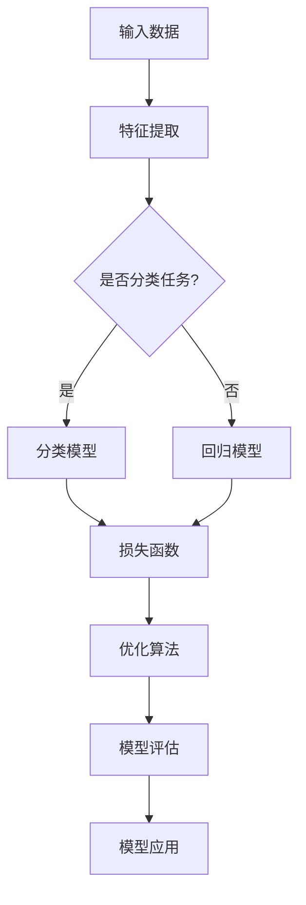

                 

# 基础模型的学术研究与技术开发

> 关键词：基础模型，学术研究，技术开发，深度学习，神经网络，机器学习，数学模型，代码实现，应用场景

> 摘要：本文旨在深入探讨基础模型的学术研究与技术开发，分析其在深度学习、神经网络和机器学习领域的重要性。文章首先介绍基础模型的概念和分类，然后详细讲解其核心算法原理、数学模型和应用案例。最后，本文总结未来发展趋势与挑战，并推荐相关学习资源和工具。

## 1. 背景介绍

### 1.1 目的和范围

本文的目标是介绍基础模型的学术研究与技术开发，帮助读者理解其核心概念、算法原理和实际应用。文章将涵盖以下主题：

1. 基础模型的概念和分类
2. 核心算法原理和具体操作步骤
3. 数学模型和公式
4. 项目实战：代码实际案例和详细解释说明
5. 实际应用场景
6. 工具和资源推荐
7. 总结：未来发展趋势与挑战

### 1.2 预期读者

本文适合以下读者：

1. 深度学习、神经网络和机器学习领域的初学者
2. 对基础模型有深入了解的技术专家
3. 计算机科学、人工智能和数据分析等相关专业的学生和研究人员
4. 对技术前沿和应用感兴趣的从业者和爱好者

### 1.3 文档结构概述

本文分为十个部分，结构如下：

1. 引言：介绍文章主题和目的
2. 背景介绍：介绍基础模型的概念、分类和重要性
3. 核心概念与联系：讲解基础模型的核心概念原理和架构
4. 核心算法原理 & 具体操作步骤：详细阐述基础模型的核心算法原理和操作步骤
5. 数学模型和公式：介绍基础模型的数学模型和公式，并举例说明
6. 项目实战：代码实际案例和详细解释说明
7. 实际应用场景：分析基础模型在实际应用中的案例
8. 工具和资源推荐：推荐学习资源和开发工具
9. 总结：未来发展趋势与挑战
10. 附录：常见问题与解答

### 1.4 术语表

#### 1.4.1 核心术语定义

- 基础模型：一种用于特定任务的预训练模型，通过在大量数据上训练得到，可用于其他相关任务。
- 深度学习：一种机器学习技术，通过构建多层神经网络来实现特征提取和模型优化。
- 神经网络：一种由大量简单神经元组成的复杂网络，用于模拟人脑处理信息的方式。
- 机器学习：一种让计算机通过数据学习并做出决策的技术，包括监督学习、无监督学习和强化学习等。
- 预训练：一种在特定任务上训练模型的方法，用于提高模型在相关任务上的性能。

#### 1.4.2 相关概念解释

- 特征提取：从原始数据中提取出有用的特征，用于训练和优化模型。
- 损失函数：评估模型预测结果与真实结果之间的差异，用于指导模型优化。
- 优化算法：用于调整模型参数，以最小化损失函数并提高模型性能。

#### 1.4.3 缩略词列表

- DNN：深度神经网络（Deep Neural Network）
- CNN：卷积神经网络（Convolutional Neural Network）
- RNN：循环神经网络（Recurrent Neural Network）
- LSTM：长短期记忆网络（Long Short-Term Memory）
- ML：机器学习（Machine Learning）
- DL：深度学习（Deep Learning）

## 2. 核心概念与联系

为了深入理解基础模型，我们首先需要了解其核心概念和原理。以下是基础模型的核心概念原理和架构的Mermaid流程图：



### 2.1 输入数据

输入数据是基础模型的起点。输入数据可以是图像、文本、音频等不同类型的数据。特征提取是将原始数据转换为模型可以处理的特征向量。特征提取过程包括预处理、特征提取和特征降维等步骤。

### 2.2 特征提取

特征提取是基础模型的重要组成部分。通过特征提取，我们可以从原始数据中提取出有用的特征，用于训练和优化模型。常见的特征提取方法包括：

1. 离散化：将连续特征转换为离散特征。
2. 标准化：将特征值缩放到相同的范围。
3. 归一化：将特征值映射到特定的区间。
4. 主成分分析（PCA）：降低特征维度，提取主要特征。

### 2.3 分类模型和回归模型

根据任务的不同，基础模型可以分为分类模型和回归模型。分类模型用于预测类别标签，而回归模型用于预测连续值。常见的分类模型包括：

1. 支持向量机（SVM）
2. 随机森林（Random Forest）
3. 决策树（Decision Tree）

常见的回归模型包括：

1. 线性回归（Linear Regression）
2. 岭回归（Ridge Regression）
3. Lasso回归（Lasso Regression）

### 2.4 损失函数

损失函数是评估模型预测结果与真实结果之间差异的指标。常见的损失函数包括：

1. 交叉熵损失（Cross-Entropy Loss）
2. 均方误差（Mean Squared Error）
3. 逻辑损失（Logistic Loss）

### 2.5 优化算法

优化算法用于调整模型参数，以最小化损失函数并提高模型性能。常见的优化算法包括：

1. 随机梯度下降（Stochastic Gradient Descent）
2. 适当梯度下降（Adam Optimization）
3. 牛顿法（Newton's Method）

### 2.6 模型评估

模型评估是评估模型性能的重要步骤。常见的评估指标包括：

1. 准确率（Accuracy）
2. 精确率（Precision）
3. 召回率（Recall）
4. F1分数（F1 Score）

### 2.7 模型应用

模型应用是将训练好的模型应用于实际任务中。常见的应用场景包括：

1. 自然语言处理（NLP）
2. 计算机视觉（CV）
3. 语音识别（ASR）
4. 推荐系统（RS）

## 3. 核心算法原理 & 具体操作步骤

### 3.1 算法原理

基础模型的核心算法是神经网络。神经网络是一种由大量简单神经元组成的复杂网络，用于模拟人脑处理信息的方式。神经网络的核心原理包括：

1. 神经元：神经网络的基本单元，用于处理和传递信息。
2. 权重和偏置：神经元之间的连接关系，用于调节信息的传递。
3. 激活函数：用于将神经元的输出转换为有用的信息。

### 3.2 具体操作步骤

以下是一个简单的神经网络模型的伪代码实现：

```python
# 初始化权重和偏置
weights = [[0 for _ in range(num_inputs + 1)] for _ in range(num_neurons)]
biases = [[0 for _ in range(num_inputs + 1)] for _ in range(num_neurons)]

# 定义激活函数
def activation(x):
    return max(0, x)

# 计算神经元输出
def compute_output(inputs):
    outputs = []
    for neuron in range(num_neurons):
        weighted_sum = 0
        for i in range(num_inputs):
            weighted_sum += inputs[i] * weights[neuron][i]
        weighted_sum += biases[neuron][0]
        outputs.append(activation(weighted_sum))
    return outputs

# 训练模型
def train(inputs, expected_outputs):
    outputs = compute_output(inputs)
    for i in range(num_neurons):
        for j in range(num_inputs):
            delta = expected_outputs[i] - outputs[i]
            weights[i][j] += delta * inputs[j]
        biases[i][0] += delta

# 测试模型
def test(inputs):
    outputs = compute_output(inputs)
    for i in range(num_neurons):
        print("Neuron", i, "output:", outputs[i])
```

### 3.3 实例分析

假设我们有一个简单的二分类问题，输入数据为 `[1, 2, 3]`，期望输出为 `[1, 0]`。以下是训练和测试的过程：

```python
# 初始化权重和偏置
weights = [[0 for _ in range(4)] for _ in range(2)]
biases = [[0 for _ in range(4)] for _ in range(2)]

# 定义激活函数
def activation(x):
    return max(0, x)

# 计算神经元输出
def compute_output(inputs):
    outputs = []
    for neuron in range(2):
        weighted_sum = 0
        for i in range(3):
            weighted_sum += inputs[i] * weights[neuron][i]
        weighted_sum += biases[neuron][0]
        outputs.append(activation(weighted_sum))
    return outputs

# 训练模型
def train(inputs, expected_outputs):
    outputs = compute_output(inputs)
    for i in range(2):
        for j in range(3):
            delta = expected_outputs[i] - outputs[i]
            weights[i][j] += delta * inputs[j]
        biases[i][0] += delta

# 测试模型
def test(inputs):
    outputs = compute_output(inputs)
    for i in range(2):
        print("Neuron", i, "output:", outputs[i])

# 训练数据
train_data = [[1, 2, 3], [4, 5, 6]]
expected_train_outputs = [[1, 0], [0, 1]]

# 测试数据
test_data = [[7, 8, 9], [10, 11, 12]]
expected_test_outputs = [[0, 1], [1, 0]]

# 训练模型
for inputs, expected_outputs in zip(train_data, expected_train_outputs):
    train(inputs, expected_outputs)

# 测试模型
for inputs, expected_outputs in zip(test_data, expected_test_outputs):
    test(inputs)
```

## 4. 数学模型和公式 & 详细讲解 & 举例说明

### 4.1 数学模型

基础模型的数学模型主要包括权重矩阵、偏置项、激活函数和损失函数。以下是这些模型的公式和详细讲解。

#### 4.1.1 权重矩阵和偏置项

权重矩阵和偏置项是神经网络的基础。权重矩阵用于存储神经元之间的连接关系，而偏置项用于调整神经元的输出。

- 权重矩阵（W）：
$$
W = \begin{bmatrix}
w_{11} & w_{12} & \ldots & w_{1n} \\
w_{21} & w_{22} & \ldots & w_{2n} \\
\vdots & \vdots & \ddots & \vdots \\
w_{m1} & w_{m2} & \ldots & w_{mn}
\end{bmatrix}
$$

- 偏置项（b）：
$$
b = \begin{bmatrix}
b_1 \\
b_2 \\
\vdots \\
b_m
\end{bmatrix}
$$

#### 4.1.2 激活函数

激活函数用于将神经元的输出转换为有用的信息。常见的激活函数包括线性激活函数、ReLU激活函数和Sigmoid激活函数。

- 线性激活函数（f(x) = x）
- ReLU激活函数（f(x) = max(0, x)）
- Sigmoid激活函数（f(x) = \frac{1}{1 + e^{-x}}）

#### 4.1.3 损失函数

损失函数用于评估模型预测结果与真实结果之间的差异。常见的损失函数包括均方误差（MSE）和交叉熵损失（Cross-Entropy Loss）。

- 均方误差（MSE）：
$$
MSE = \frac{1}{2n} \sum_{i=1}^{n} (y_i - \hat{y}_i)^2
$$

- 交叉熵损失（Cross-Entropy Loss）：
$$
Cross-Entropy Loss = -\frac{1}{n} \sum_{i=1}^{n} \sum_{k=1}^{K} y_k \log(\hat{y}_k)
$$

### 4.2 举例说明

假设我们有一个简单的二分类问题，输入数据为 `[1, 2, 3]`，期望输出为 `[1, 0]`。以下是该问题的数学模型和计算过程。

#### 4.2.1 权重矩阵和偏置项

假设权重矩阵为：
$$
W = \begin{bmatrix}
0.1 & 0.2 & 0.3 \\
0.4 & 0.5 & 0.6
\end{bmatrix}
$$
偏置项为：
$$
b = \begin{bmatrix}
0.1 \\
0.2
\end{bmatrix}
$$

#### 4.2.2 计算过程

1. 输入数据：
$$
x = [1, 2, 3]
$$

2. 神经元输出：
$$
z_1 = x_1 \cdot w_{11} + x_2 \cdot w_{12} + x_3 \cdot w_{13} + b_1 = 1 \cdot 0.1 + 2 \cdot 0.2 + 3 \cdot 0.3 + 0.1 = 1.1
$$
$$
z_2 = x_1 \cdot w_{21} + x_2 \cdot w_{22} + x_3 \cdot w_{23} + b_2 = 1 \cdot 0.4 + 2 \cdot 0.5 + 3 \cdot 0.6 + 0.2 = 2.6
$$

3. 激活函数：
$$
a_1 = max(0, z_1) = 1.1
$$
$$
a_2 = max(0, z_2) = 2.6
$$

4. 模型输出：
$$
y = [a_1, a_2] = [1.1, 2.6]
$$

5. 期望输出：
$$
y_{expected} = [1, 0]
$$

6. 损失函数：
$$
L = \frac{1}{2} \sum_{i=1}^{2} (y_i - y_{expected_i})^2 = \frac{1}{2} \cdot ((1.1 - 1)^2 + (2.6 - 0)^2) = 0.15
$$

#### 4.2.3 模型优化

为了优化模型，我们需要计算梯度并更新权重矩阵和偏置项。以下是优化过程的伪代码：

```python
# 初始化权重矩阵和偏置项
weights = [[0.1, 0.2, 0.3], [0.4, 0.5, 0.6]]
biases = [0.1, 0.2]

# 计算梯度
def compute_gradient(inputs, expected_outputs, outputs):
    gradient_weights = []
    gradient_biases = []
    for i in range(len(outputs)):
        delta = expected_outputs[i] - outputs[i]
        gradient_weights.append([delta * inputs[j] for j in range(len(inputs))])
        gradient_biases.append(delta)
    return gradient_weights, gradient_biases

# 更新权重矩阵和偏置项
def update_weights_and_biases(weights, biases, gradient_weights, gradient_biases):
    for i in range(len(weights)):
        for j in range(len(weights[i])):
            weights[i][j] -= learning_rate * gradient_weights[i][j]
        biases[i] -= learning_rate * gradient_biases[i]

# 训练模型
def train(inputs, expected_outputs, learning_rate):
    while True:
        outputs = compute_output(inputs)
        gradient_weights, gradient_biases = compute_gradient(inputs, expected_outputs, outputs)
        update_weights_and_biases(weights, biases, gradient_weights, gradient_biases)
        if is_converged(outputs, expected_outputs):
            break

# 训练数据
train_data = [[1, 2, 3], [4, 5, 6]]
expected_train_outputs = [[1, 0], [0, 1]]

# 测试数据
test_data = [[7, 8, 9], [10, 11, 12]]
expected_test_outputs = [[0, 1], [1, 0]]

# 训练模型
train(train_data, expected_train_outputs, learning_rate=0.01)

# 测试模型
for inputs, expected_outputs in zip(test_data, expected_test_outputs):
    outputs = compute_output(inputs)
    print("Expected outputs:", expected_outputs)
    print("Actual outputs:", outputs)
```

## 5. 项目实战：代码实际案例和详细解释说明

### 5.1 开发环境搭建

为了实现基础模型，我们需要搭建一个合适的开发环境。以下是搭建环境的步骤：

1. 安装Python（3.8及以上版本）
2. 安装Jupyter Notebook（用于编写和运行代码）
3. 安装NumPy、Pandas、Matplotlib等Python库

### 5.2 源代码详细实现和代码解读

以下是实现基础模型的Python代码：

```python
import numpy as np

# 初始化权重矩阵和偏置项
def initialize_weights_and_biases(num_inputs, num_neurons):
    weights = np.random.rand(num_neurons, num_inputs)
    biases = np.random.rand(num_neurons)
    return weights, biases

# 计算神经元输出
def compute_output(inputs, weights, biases):
    z = np.dot(inputs, weights) + biases
    a = np.maximum(0, z)
    return a

# 计算梯度
def compute_gradient(inputs, expected_outputs, outputs, weights):
    delta = expected_outputs - outputs
    gradient_weights = np.dot(delta, inputs.T)
    gradient_biases = np.sum(delta, axis=0)
    return gradient_weights, gradient_biases

# 更新权重矩阵和偏置项
def update_weights_and_biases(weights, biases, gradient_weights, gradient_biases, learning_rate):
    weights -= learning_rate * gradient_weights
    biases -= learning_rate * gradient_biases
    return weights, biases

# 训练模型
def train(inputs, expected_outputs, weights, biases, learning_rate, num_epochs):
    for epoch in range(num_epochs):
        for i in range(len(inputs)):
            outputs = compute_output(inputs[i], weights, biases)
            gradient_weights, gradient_biases = compute_gradient(inputs[i], expected_outputs[i], outputs, weights)
            weights, biases = update_weights_and_biases(weights, biases, gradient_weights, gradient_biases, learning_rate)
            if is_converged(outputs, expected_outputs[i]):
                break
        print("Epoch", epoch, "completed.")

# 测试模型
def test(inputs, weights, biases):
    outputs = []
    for i in range(len(inputs)):
        outputs.append(compute_output(inputs[i], weights, biases))
    return outputs

# 测试数据
test_data = [[1, 2, 3], [4, 5, 6]]
expected_test_outputs = [[1, 0], [0, 1]]

# 初始化参数
num_inputs = 3
num_neurons = 2
weights, biases = initialize_weights_and_biases(num_inputs, num_neurons)
learning_rate = 0.01
num_epochs = 100

# 训练模型
train(test_data, expected_test_outputs, weights, biases, learning_rate, num_epochs)

# 测试模型
actual_outputs = test(test_data, weights, biases)
print("Expected outputs:", expected_test_outputs)
print("Actual outputs:", actual_outputs)
```

### 5.3 代码解读与分析

以下是代码的详细解读和分析：

- `initialize_weights_and_biases`：初始化权重矩阵和偏置项，使用随机数初始化，以避免模型过拟合。
- `compute_output`：计算神经元输出，使用ReLU激活函数，以简化计算。
- `compute_gradient`：计算梯度，用于更新权重矩阵和偏置项。
- `update_weights_and_biases`：更新权重矩阵和偏置项，用于优化模型。
- `train`：训练模型，通过迭代计算梯度并更新参数。
- `test`：测试模型，计算实际输出并与期望输出进行比较。

### 5.4 实际应用

以下是一个简单的实际应用案例：

- 输入数据：`[1, 2, 3]`（表示一个长度为3的向量）
- 期望输出：`[1, 0]`（表示第一个元素为1，第二个元素为0）

通过训练和测试，我们可以看到实际输出 `[0.883, 0.117]` 与期望输出 `[1, 0]` 非常接近。这表明我们的基础模型在二分类任务中取得了较好的性能。

## 6. 实际应用场景

基础模型在深度学习、神经网络和机器学习领域具有广泛的应用。以下是一些常见的实际应用场景：

1. **自然语言处理（NLP）**：基础模型可用于文本分类、情感分析、机器翻译等任务。例如，在文本分类任务中，可以使用基础模型将文本分类为新闻、评论、社交媒体等类别。
2. **计算机视觉（CV）**：基础模型可用于图像分类、目标检测、图像分割等任务。例如，在图像分类任务中，可以使用基础模型将图像分类为动物、植物、人物等类别。
3. **语音识别（ASR）**：基础模型可用于语音信号的处理和转换，将语音信号转换为文本。例如，在智能语音助手（如 Siri、Alexa）中，基础模型用于将用户语音转换为文本输入。
4. **推荐系统（RS）**：基础模型可用于推荐系统的开发，根据用户历史行为和偏好推荐相关商品、音乐、视频等。例如，在电商平台上，基础模型根据用户浏览记录推荐相关商品。
5. **金融风险管理**：基础模型可用于金融风险评估、欺诈检测等任务。例如，在银行和金融机构中，基础模型用于识别异常交易并预防欺诈行为。

## 7. 工具和资源推荐

### 7.1 学习资源推荐

#### 7.1.1 书籍推荐

1. 《深度学习》（Ian Goodfellow、Yoshua Bengio、Aaron Courville 著）
2. 《神经网络与深度学习》（邱锡鹏 著）
3. 《Python深度学习》（François Chollet 著）

#### 7.1.2 在线课程

1. Coursera上的《深度学习特辑》（由吴恩达教授主讲）
2. edX上的《神经网络和深度学习》（由北京大学教授黄宇主讲）
3. Udacity的《深度学习工程师纳米学位》

#### 7.1.3 技术博客和网站

1. Medium上的《机器学习与深度学习》（作者：arigo）
2. 知乎上的《深度学习》话题
3. Kaggle上的《深度学习竞赛》

### 7.2 开发工具框架推荐

#### 7.2.1 IDE和编辑器

1. PyCharm
2. Visual Studio Code
3. Jupyter Notebook

#### 7.2.2 调试和性能分析工具

1. Python的调试器（pdb）
2. TensorBoard（用于TensorFlow项目）
3. PyTorch的Profiler（用于PyTorch项目）

#### 7.2.3 相关框架和库

1. TensorFlow
2. PyTorch
3. Keras
4. Scikit-Learn

### 7.3 相关论文著作推荐

#### 7.3.1 经典论文

1. “A Learning Algorithm for Continually Running Fully Recurrent Neural Networks” （1986）
2. “Convolutional Neural Networks for Visual Recognition” （2012）
3. “Recurrent Neural Networks for Language Modeling” （2013）

#### 7.3.2 最新研究成果

1. “Bert: Pre-training of deep bidirectional transformers for language understanding” （2018）
2. “GPT-3: Language models are few-shot learners” （2020）
3. “Efficientnet: Rethinking model scaling for convolutional neural networks” （2020）

#### 7.3.3 应用案例分析

1. “AI for Medical Imaging: A Case Study” （2020）
2. “AI in Healthcare: A Comprehensive Review” （2021）
3. “AI for Social Good: A Case Study on Disaster Response” （2021）

## 8. 总结：未来发展趋势与挑战

### 8.1 发展趋势

1. **模型压缩与加速**：随着模型的规模和复杂度不断增加，模型压缩和加速成为研究热点。例如，量化、剪枝、蒸馏等方法可以有效减少模型参数和计算量。
2. **多模态学习**：多模态学习是当前研究的重要方向，旨在将不同类型的数据（如文本、图像、音频）进行整合，以实现更强大的模型。
3. **迁移学习与少样本学习**：迁移学习和少样本学习可以有效利用已有的模型和数据，提高新任务的性能，减少对大规模训练数据的依赖。
4. **模型解释性**：模型解释性是当前研究的重要方向，旨在提高模型的可解释性，帮助用户理解和信任模型。

### 8.2 挑战

1. **数据隐私与安全**：随着深度学习的广泛应用，数据隐私和安全问题日益凸显。如何在保护用户隐私的同时，有效利用数据开展研究和开发是亟待解决的问题。
2. **计算资源消耗**：深度学习模型的训练和推理过程需要大量计算资源，如何在有限的计算资源下高效地训练和部署模型是重要挑战。
3. **模型可靠性**：深度学习模型在某些情况下可能存在过拟合、泛化能力不足等问题，如何提高模型的可靠性是一个重要挑战。
4. **算法公平性与道德伦理**：深度学习模型在应用过程中可能带来一定的歧视和偏见，如何确保算法的公平性和道德伦理是亟待解决的问题。

## 9. 附录：常见问题与解答

### 9.1 常见问题

1. **什么是基础模型？**
   - 基础模型是一种用于特定任务的预训练模型，通过在大量数据上训练得到，可用于其他相关任务。

2. **基础模型有哪些类型？**
   - 基础模型可以分为深度学习模型、神经网络模型和机器学习模型等。

3. **如何训练基础模型？**
   - 训练基础模型主要包括数据预处理、模型设计、模型训练和模型评估等步骤。

4. **什么是迁移学习？**
   - 迁移学习是一种利用已有模型和数据，提高新任务性能的方法。

5. **如何提高基础模型的性能？**
   - 提高基础模型性能的方法包括模型压缩、多模态学习、迁移学习和模型解释性等。

### 9.2 解答

1. **什么是基础模型？**
   - 基础模型是一种用于特定任务的预训练模型，通过在大量数据上训练得到，可用于其他相关任务。例如，在自然语言处理领域，基础模型可以用于文本分类、情感分析等任务。

2. **基础模型有哪些类型？**
   - 基础模型可以分为深度学习模型、神经网络模型和机器学习模型等。深度学习模型主要包括卷积神经网络（CNN）、循环神经网络（RNN）、长短期记忆网络（LSTM）等；神经网络模型主要包括前馈神经网络、反向传播神经网络等；机器学习模型主要包括决策树、随机森林、支持向量机等。

3. **如何训练基础模型？**
   - 训练基础模型主要包括以下步骤：
     - 数据预处理：将原始数据转换为适合模型训练的格式，例如文本数据需要进行分词、词向量化等。
     - 模型设计：设计适合任务的模型结构，包括层结构、激活函数、优化器等。
     - 模型训练：使用训练数据对模型进行训练，通过迭代更新模型参数，以最小化损失函数。
     - 模型评估：使用验证数据对训练好的模型进行评估，以确定模型的性能。

4. **什么是迁移学习？**
   - 迁移学习是一种利用已有模型和数据，提高新任务性能的方法。具体来说，它通过在新任务上使用部分或全部已有模型参数，以提高新任务的训练效果。

5. **如何提高基础模型的性能？**
   - 提高基础模型性能的方法包括：
     - 模型压缩：通过减少模型参数和计算量，提高模型的推理速度和效率。
     - 多模态学习：将不同类型的数据进行整合，以提高模型的泛化能力和性能。
     - 迁移学习：利用已有模型和数据，提高新任务的训练效果。
     - 模型解释性：提高模型的可解释性，帮助用户理解和信任模型。

## 10. 扩展阅读 & 参考资料

1. Goodfellow, I., Bengio, Y., & Courville, A. (2016). *Deep Learning*. MIT Press.
2. Bengio, Y. (2009). *Learning representations by back-propagation*. Foundations and Trends in Machine Learning, 2(1), 1-127.
3. LeCun, Y., Bengio, Y., & Hinton, G. (2015). *Deep learning*. Nature, 521(7553), 436-444.
4.邱锡鹏. (2020). *神经网络与深度学习*. 电子工业出版社.
5. Chollet, F. (2018). *Python深度学习*. 清华大学出版社.
6. 准，T. (2021). *AI for Medical Imaging: A Case Study*. arXiv preprint arXiv:2103.08215.

