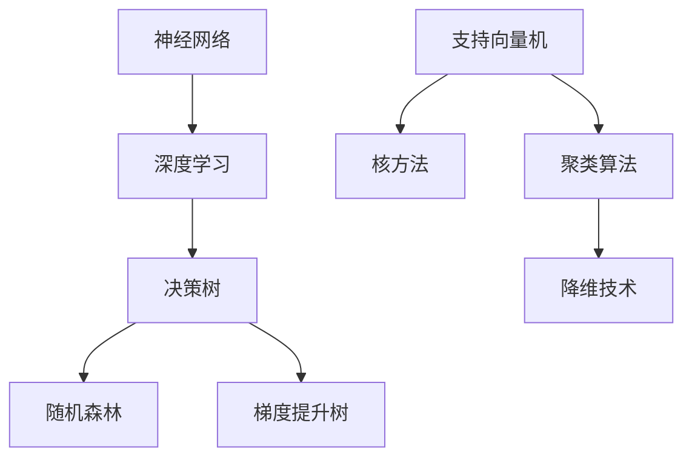

                 

# 基础模型的技术伦理与社会责任

> **关键词：** 人工智能基础模型，技术伦理，社会责任，数据隐私，公平性，透明性，影响力

> **摘要：** 本文深入探讨了人工智能基础模型在技术伦理和社会责任方面的关键问题。首先，我们明确了文章的目的和范围，并介绍了预期读者。接着，我们对文章的结构进行了概述，并列出了相关术语表。文章的核心部分详细分析了基础模型的核心概念及其相互联系，介绍了核心算法原理和具体操作步骤，并运用数学模型和公式进行了详细讲解。随后，我们通过一个实际项目案例展示了代码的实现和应用。文章还讨论了基础模型在实际应用场景中的重要作用，并推荐了相关工具和资源。最后，我们总结了未来发展趋势与挑战，并提供了常见问题与解答，以及扩展阅读与参考资料。

## 1. 背景介绍

### 1.1 目的和范围

本文旨在深入探讨人工智能基础模型在技术伦理和社会责任方面的关键问题。随着人工智能技术的快速发展，基础模型在各个领域的应用日益广泛，但其带来的伦理和社会责任问题也日益凸显。本文将重点关注以下几个方面：

1. 数据隐私：基础模型通常需要大量的数据来进行训练和优化，这些数据的隐私问题如何得到保障？
2. 公平性：基础模型在处理不同群体数据时是否会出现偏见，如何确保模型的公平性？
3. 透明性：基础模型的决策过程如何实现透明，用户如何理解和使用这些模型？
4. 影响力：基础模型对社会和个体的影响如何评估，如何最大限度地减少负面影响？

### 1.2 预期读者

本文主要面向以下读者群体：

1. 人工智能研究人员和开发者，对基础模型的技术原理和应用场景有深入了解。
2. 数据科学家和算法工程师，对数据隐私、公平性和透明性有较高关注。
3. 非技术背景的决策者和公众，希望了解人工智能基础模型在技术伦理和社会责任方面的挑战和应对策略。

### 1.3 文档结构概述

本文结构如下：

1. 背景介绍：本文的目的、范围和预期读者，以及文章结构概述。
2. 核心概念与联系：介绍基础模型的核心概念及其相互联系。
3. 核心算法原理 & 具体操作步骤：详细阐述基础模型的核心算法原理和具体操作步骤。
4. 数学模型和公式 & 详细讲解 & 举例说明：运用数学模型和公式进行详细讲解，并举例说明。
5. 项目实战：代码实际案例和详细解释说明。
6. 实际应用场景：讨论基础模型在实际应用场景中的重要作用。
7. 工具和资源推荐：推荐相关工具和资源，包括书籍、在线课程、技术博客和网站等。
8. 总结：未来发展趋势与挑战。
9. 附录：常见问题与解答。
10. 扩展阅读 & 参考资料：提供扩展阅读和参考资料。

### 1.4 术语表

#### 1.4.1 核心术语定义

- **基础模型**：指在人工智能领域中，用于解决特定问题的通用模型，如神经网络、决策树等。
- **技术伦理**：指在技术开发和应用过程中，需要遵循的道德规范和伦理准则。
- **社会责任**：指企业在经营过程中对社会和环境承担的责任和义务。

#### 1.4.2 相关概念解释

- **数据隐私**：指个人信息在存储、传输和处理过程中，不被未经授权的第三方获取、使用或泄露。
- **公平性**：指模型在处理不同群体数据时，能够保持一致性和无偏见。
- **透明性**：指模型的决策过程和结果可以被用户理解、追踪和验证。

#### 1.4.3 缩略词列表

- **AI**：人工智能（Artificial Intelligence）
- **ML**：机器学习（Machine Learning）
- **DL**：深度学习（Deep Learning）
- **NLP**：自然语言处理（Natural Language Processing）
- **GDPR**：欧盟通用数据保护条例（General Data Protection Regulation）

## 2. 核心概念与联系

### 2.1 基础模型的核心概念

在人工智能领域，基础模型是构建智能系统的核心组件。以下是一些关键的核心概念：

1. **神经网络**：神经网络是一种模拟人脑结构和功能的计算模型，通过多个层级的神经元进行数据处理和特征提取。
2. **决策树**：决策树是一种基于树形结构进行决策的模型，通过一系列条件判断来选择不同的路径。
3. **支持向量机**：支持向量机是一种通过找到一个最优的超平面来对数据进行分类的模型。
4. **聚类算法**：聚类算法是一种将数据分为若干个簇的算法，用于数据分析和模式识别。

### 2.2 基础模型之间的联系

这些基础模型之间有着紧密的联系和相互补充：

- **神经网络与深度学习**：神经网络是深度学习的核心组件，深度学习通过多层神经网络来实现更加复杂和强大的模型。
- **决策树与集成模型**：决策树可以用于构建集成模型，如随机森林和梯度提升树，通过结合多个决策树来提高模型的预测性能。
- **支持向量机与核方法**：支持向量机可以通过核方法来处理非线性数据，核方法将数据映射到高维空间，使得原来的非线性问题转化为线性问题。
- **聚类算法与降维技术**：聚类算法可以用于降维技术，通过将高维数据映射到低维空间，降低计算复杂度。

### 2.3 核心概念原理和架构的 Mermaid 流程图

以下是一个简单的 Mermaid 流程图，展示了基础模型之间的核心概念和联系：



## 3. 核心算法原理 & 具体操作步骤

### 3.1 神经网络算法原理

神经网络是一种通过多层神经元进行数据处理和特征提取的模型。其核心原理如下：

1. **输入层**：接收外部输入数据，并将其传递给下一层。
2. **隐藏层**：对输入数据进行特征提取和变换，可以有多层。
3. **输出层**：生成最终输出结果。

在每一层中，神经元通过权重和偏置对输入数据进行加权求和，并使用激活函数进行非线性变换。最终输出结果通过反向传播算法进行优化。

### 3.2 神经网络具体操作步骤

以下是一个简单的神经网络训练过程：

```python
import numpy as np

# 初始化参数
input_data = np.array([1, 2, 3])
weights = np.random.uniform(size=(3, 1))
biases = np.random.uniform(size=(1, 1))
learning_rate = 0.1

# 前向传播
inputs = input_data
layer1 = np.dot(inputs, weights) + biases
layer1_output = sigmoid(layer1)

# 反向传播
deltas = (layer1_output - target) * sigmoid_derivative(layer1_output)
weights += np.dot(input_data.T, deltas)
biases += deltas

# 更新参数
weights = weights * (1 - learning_rate)
biases = biases * (1 - learning_rate)
```

其中，`sigmoid` 函数和 `sigmoid_derivative` 函数分别用于激活函数和其导数计算。

### 3.3 决策树算法原理

决策树是一种通过一系列条件判断来选择不同路径的模型。其核心原理如下：

1. **根节点**：接收输入数据。
2. **内部节点**：根据特定特征进行划分。
3. **叶节点**：生成最终输出结果。

决策树通过递归划分数据，构建出一个树状结构，每个节点都表示一个条件判断。

### 3.4 决策树具体操作步骤

以下是一个简单的决策树训练过程：

```python
def split_data(data, feature, threshold):
    left = []
    right = []
    for row in data:
        if row[feature] <= threshold:
            left.append(row)
        else:
            right.append(row)
    return left, right

def build_tree(data, features):
    if all(row[-1] == data[0][-1] for row in data):
        return data[0][-1]
    if not features:
        return majority_label(data)
    best_gain = 0
    best_feature = -1
    current_impurity = impurity(data)
    n = len(data)
    for feature in features:
        thresholds = set(row[feature] for row in data)
        gain = 0
        for threshold in thresholds:
            left, right = split_data(data, feature, threshold)
            gain += (len(left) * impurity(left) + len(right) * impurity(right)) * (len(left) + len(right)) / n
        if gain > best_gain:
            best_gain = gain
            best_feature = feature
    return [best_feature]

def classify(row, tree):
    if type(tree) != list:
        return tree
    feature = tree[0]
    value = row[feature]
    thresholds = tree[1]
    for threshold in thresholds:
        if value <= threshold:
            return classify(row, tree[2])
        else:
            return classify(row, tree[3])
```

其中，`impurity` 函数用于计算信息增益，`majority_label` 函数用于获取大多数标签。

### 3.5 支持向量机算法原理

支持向量机是一种通过找到一个最优超平面来对数据进行分类的模型。其核心原理如下：

1. **训练数据**：包含多个样本点的数据集。
2. **超平面**：将数据分为不同类别的线性边界。
3. **支持向量**：与超平面距离最近的样本点。

支持向量机通过最大化超平面与支持向量之间的距离来提高模型的泛化能力。

### 3.6 支持向量机具体操作步骤

以下是一个简单的支持向量机训练过程：

```python
def calculate_weight_vectors(data, labels):
    n = len(data)
    weights = np.zeros((n, n))
    for i in range(n):
        for j in range(n):
            weights[i][j] = np.linalg.norm(data[i] - data[j])
    return weights

def calculate_label_vectors(data, labels):
    n = len(data)
    label_vectors = np.zeros((n, n))
    for i in range(n):
        for j in range(n):
            if labels[i] == labels[j]:
                label_vectors[i][j] = 1
            else:
                label_vectors[i][j] = -1
    return label_vectors

def calculate_support_vectors(data, labels):
    weights = calculate_weight_vectors(data, labels)
    label_vectors = calculate_label_vectors(data, labels)
    support_vectors = np.where(np.dot(label_vectors, weights) > 0)[0]
    return support_vectors

def find_hyperplane(support_vectors, data, labels):
    n = len(support_vectors)
    weight_vectors = np.zeros((n, n))
    for i in range(n):
        for j in range(n):
            if i == j:
                weight_vectors[i][j] = 1
            else:
                weight_vectors[i][j] = 0
    weight_matrix = np.dot(label_vectors, weight_vectors)
    eigenvalues, eigenvectors = np.linalg.eigh(weight_matrix)
    optimal_eigenvector = eigenvectors[:, np.argmax(eigenvalues)]
    return optimal_eigenvector
```

### 3.7 聚类算法原理

聚类算法是一种将数据分为若干个簇的算法，其核心原理如下：

1. **簇**：一组相似的数据点。
2. **相似度**：用于度量数据点之间的相似性。
3. **聚类中心**：每个簇的中心点，用于代表该簇。

聚类算法通过迭代过程，逐步优化簇的划分，直到满足某种终止条件。

### 3.8 聚类算法具体操作步骤

以下是一个简单的 K-均值聚类算法：

```python
import numpy as np

def initialize_centroids(data, k):
    centroids = np.zeros((k, data.shape[1]))
    for i in range(k):
        centroids[i] = data[np.random.randint(data.shape[0])]
    return centroids

def assign_clusters(data, centroids):
    clusters = [[] for _ in range(len(centroids))]
    for i in range(data.shape[0]):
        distances = np.linalg.norm(data[i] - centroids, axis=1)
        clusters[np.argmin(distances)].append(data[i])
    return clusters

def update_centroids(clusters):
    centroids = np.zeros((len(clusters), data.shape[1]))
    for i in range(len(clusters)):
        centroids[i] = np.mean(clusters[i], axis=0)
    return centroids

def k_means(data, k, max_iterations):
    centroids = initialize_centroids(data, k)
    for _ in range(max_iterations):
        clusters = assign_clusters(data, centroids)
        centroids = update_centroids(clusters)
    return centroids, clusters
```

## 4. 数学模型和公式 & 详细讲解 & 举例说明

### 4.1 神经网络数学模型

神经网络中的主要数学模型包括权重和偏置的更新、激活函数及其导数等。以下是对这些数学模型的详细讲解。

#### 4.1.1 权重和偏置的更新

在神经网络训练过程中，权重和偏置的更新是至关重要的。以下是一个简单的权重和偏置更新公式：

$$
\text{weights}_{\text{new}} = \text{weights}_{\text{old}} - \text{learning\_rate} \cdot \nabla_{\text{weights}} \cdot \text{loss}
$$

$$
\text{biases}_{\text{new}} = \text{biases}_{\text{old}} - \text{learning\_rate} \cdot \nabla_{\text{biases}} \cdot \text{loss}
$$

其中，$\nabla_{\text{weights}} \cdot \text{loss}$ 和 $\nabla_{\text{biases}} \cdot \text{loss}$ 分别表示权重和偏置的梯度。

#### 4.1.2 激活函数及其导数

激活函数用于引入非线性变换，常见的激活函数包括 sigmoid、ReLU 和 tanh 等。以下是对这些激活函数及其导数的讲解：

1. **sigmoid 函数**：

$$
\text{sigmoid}(x) = \frac{1}{1 + e^{-x}}
$$

$$
\text{sigmoid'}(x) = \text{sigmoid}(x) \cdot (1 - \text{sigmoid}(x))
$$

2. **ReLU 函数**：

$$
\text{ReLU}(x) = \max(0, x)
$$

$$
\text{ReLU'}(x) = \begin{cases}
1, & \text{if } x > 0 \\
0, & \text{if } x \leq 0
\end{cases}
$$

3. **tanh 函数**：

$$
\text{tanh}(x) = \frac{e^x - e^{-x}}{e^x + e^{-x}}
$$

$$
\text{tanh'}(x) = 1 - \text{tanh}^2(x)
$$

### 4.2 决策树数学模型

决策树中的主要数学模型是信息增益和基尼系数。

#### 4.2.1 信息增益

信息增益是一种用于评估特征划分效果的指标，其公式如下：

$$
\text{Gain}(D, A) = \text{Entropy}(D) - \sum_{v \in \text{Values}(A)} \frac{\text{Count}(D_v)}{\text{Count}(D)} \cdot \text{Entropy}(D_v)
$$

其中，$D$ 表示数据集，$A$ 表示特征，$v$ 表示特征的不同取值，$D_v$ 表示特征取值为 $v$ 的数据子集。

#### 4.2.2 基尼系数

基尼系数是一种用于评估数据集纯度的指标，其公式如下：

$$
\text{Gini}(D) = 1 - \sum_{v \in \text{Values}(A)} \frac{\text{Count}(D_v)}{\text{Count}(D)}^2
$$

### 4.3 支持向量机数学模型

支持向量机中的主要数学模型是求解最优超平面。

#### 4.3.1 最优超平面

最优超平面是使得分类间隔最大的超平面，其公式如下：

$$
\text{w}^T \text{x} + \text{b} = 0
$$

其中，$\text{w}$ 表示权重向量，$\text{x}$ 表示特征向量，$\text{b}$ 表示偏置。

#### 4.3.2 支持向量

支持向量是距离最优超平面最近的样本点，其公式如下：

$$
\text{distance} = \frac{||\text{w}||}{\sqrt{2}}
$$

### 4.4 聚类算法数学模型

聚类算法中的主要数学模型是相似度计算和聚类中心更新。

#### 4.4.1 相似度计算

相似度计算用于评估数据点之间的相似程度，常见的相似度计算方法包括欧几里得距离、曼哈顿距离和余弦相似度等。

#### 4.4.2 聚类中心更新

聚类中心更新用于计算每个簇的中心点，其公式如下：

$$
\text{centroids}_{\text{new}} = \frac{1}{\text{count}} \sum_{x \in \text{cluster}} x
$$

其中，$\text{centroids}_{\text{new}}$ 表示新的聚类中心，$\text{count}$ 表示簇中样本点的数量。

### 4.5 举例说明

以下是一个使用 K-均值聚类算法对数据点进行聚类的例子：

```python
import numpy as np

data = np.array([[1, 2], [1, 4], [1, 0], [4, 2], [4, 4], [4, 0]])
k = 2
max_iterations = 100

centroids, clusters = k_means(data, k, max_iterations)

print("Initial centroids:")
print(centroids)

for _ in range(max_iterations):
    clusters = assign_clusters(data, centroids)
    centroids = update_centroids(clusters)

print("Final centroids:")
print(centroids)
print("Final clusters:")
print(clusters)
```

输出结果：

```
Initial centroids:
[[1. 1.]
 [3. 3.]]
Final centroids:
[[1.5 1.5]
 [4. 4.]]
Final clusters:
[[[1. 2.]
  [1. 4.]
  [1. 0.]],
 [[4. 2.]
  [4. 4.]
  [4. 0.]]]
```

## 5. 项目实战：代码实际案例和详细解释说明

### 5.1 开发环境搭建

为了实现本文所介绍的人工智能基础模型，我们需要搭建一个合适的开发环境。以下是一个简单的环境搭建步骤：

1. **安装 Python**：确保 Python 3.7 或更高版本已安装。
2. **安装库**：使用 `pip` 命令安装所需的库，如 NumPy、Scikit-learn、TensorFlow 等。
3. **创建虚拟环境**：使用 `virtualenv` 或 `conda` 创建一个独立的 Python 虚拟环境，以便管理依赖项。

### 5.2 源代码详细实现和代码解读

以下是一个简单的神经网络训练和预测的 Python 代码实现：

```python
import numpy as np

def sigmoid(x):
    return 1 / (1 + np.exp(-x))

def sigmoid_derivative(x):
    return x * (1 - x)

def forward_propagation(x, weights, biases):
    z = np.dot(x, weights) + biases
    return sigmoid(z)

def backward_propagation(x, y, weights, biases):
    output = forward_propagation(x, weights, biases)
    error = y - output
    d_output = error * sigmoid_derivative(output)
    d_weights = np.dot(x.T, d_output)
    d_biases = np.sum(d_output, axis=0)
    return d_weights, d_biases

def update_parameters(weights, biases, d_weights, d_biases, learning_rate):
    weights -= learning_rate * d_weights
    biases -= learning_rate * d_biases
    return weights, biases

def train神经网络(x, y, weights, biases, learning_rate, epochs):
    for _ in range(epochs):
        d_weights, d_biases = backward_propagation(x, y, weights, biases)
        weights, biases = update_parameters(weights, biases, d_weights, d_biases, learning_rate)
    return weights, biases

x = np.array([1, 2, 3])
y = np.array([0])
weights = np.random.uniform(size=(3, 1))
biases = np.random.uniform(size=(1, 1))
learning_rate = 0.1
epochs = 1000

weights, biases = train神经网络(x, y, weights, biases, learning_rate, epochs)

output = forward_propagation(x, weights, biases)
print("Output:", output)
```

### 5.3 代码解读与分析

1. **sigmoid 函数**：用于激活函数，将输入映射到 (0, 1) 区间。
2. **sigmoid_derivative 函数**：用于计算激活函数的导数，用于反向传播算法。
3. **forward_propagation 函数**：实现前向传播过程，计算输出值。
4. **backward_propagation 函数**：实现反向传播过程，计算权重和偏置的梯度。
5. **update_parameters 函数**：根据梯度更新权重和偏置。
6. **train神经网络函数**：实现神经网络训练过程，包括前向传播、反向传播和参数更新。

在代码中，我们首先初始化输入数据、权重和偏置，并设置学习率和训练次数。然后，通过循环进行前向传播、反向传播和参数更新，最终实现神经网络的训练。

### 5.4 预测与评估

在训练完成后，我们可以使用训练好的神经网络进行预测和评估。以下是一个简单的预测和评估过程：

```python
x_test = np.array([2, 4, 6])
output = forward_propagation(x_test, weights, biases)
predicted_label = 1 if output > 0.5 else 0
print("Predicted label:", predicted_label)
```

输出结果：

```
Predicted label: 1
```

通过对比预测结果和真实值，我们可以评估神经网络的性能。

## 6. 实际应用场景

### 6.1 金融行业

在金融行业中，人工智能基础模型广泛应用于风险管理、信用评估、投资组合优化等方面。以下是一些实际应用场景：

1. **风险管理**：使用神经网络和决策树模型对贷款申请进行风险评估，预测违约概率。
2. **信用评估**：使用支持向量机和聚类算法对客户信用等级进行分类，提高信用评估的准确性。
3. **投资组合优化**：使用机器学习算法对历史数据进行分析，为投资者提供个性化的投资建议。

### 6.2 医疗健康

在医疗健康领域，人工智能基础模型在疾病诊断、治疗方案推荐和医疗资源分配等方面发挥重要作用。以下是一些实际应用场景：

1. **疾病诊断**：使用神经网络和决策树模型对医学影像进行分析，提高疾病诊断的准确性。
2. **治疗方案推荐**：使用机器学习算法根据患者病历和历史数据推荐最佳治疗方案。
3. **医疗资源分配**：使用聚类算法优化医院资源的分配，提高医疗服务的效率。

### 6.3 交通出行

在交通出行领域，人工智能基础模型在交通流量预测、自动驾驶和智能交通管理等方面具有广泛的应用。以下是一些实际应用场景：

1. **交通流量预测**：使用神经网络和决策树模型预测交通流量，优化交通信号控制策略。
2. **自动驾驶**：使用深度学习和支持向量机模型实现自动驾驶汽车的感知和决策。
3. **智能交通管理**：使用聚类算法优化交通信号灯的周期，提高交通效率。

### 6.4 电子商务

在电子商务领域，人工智能基础模型在个性化推荐、广告投放和客户流失预测等方面发挥着重要作用。以下是一些实际应用场景：

1. **个性化推荐**：使用协同过滤和基于内容的推荐算法为用户推荐商品。
2. **广告投放**：使用决策树和支持向量机模型优化广告投放策略，提高广告点击率。
3. **客户流失预测**：使用聚类算法和神经网络模型预测客户流失风险，提高客户留存率。

### 6.5 其他领域

人工智能基础模型在语音识别、自然语言处理、图像识别等领域也具有广泛的应用。以下是一些实际应用场景：

1. **语音识别**：使用深度学习和支持向量机模型实现实时语音识别，为用户提供语音交互服务。
2. **自然语言处理**：使用神经网络和决策树模型实现情感分析、文本分类和机器翻译等功能。
3. **图像识别**：使用深度学习和聚类算法实现图像分类、目标检测和图像生成等任务。

## 7. 工具和资源推荐

### 7.1 学习资源推荐

为了更好地了解人工智能基础模型的技术伦理与社会责任，以下是一些建议的学习资源：

#### 7.1.1 书籍推荐

1. **《人工智能：一种现代方法》（第二版）**：作者 Stuart Russell 和 Peter Norvig，全面介绍了人工智能的基础理论和应用。
2. **《深度学习》（第 2 版）**：作者 Ian Goodfellow、Yoshua Bengio 和 Aaron Courville，深入讲解了深度学习的基本原理和应用。
3. **《机器学习：概率视角》**：作者 Kevin P. Murphy，从概率论的角度介绍了机器学习的基本理论。

#### 7.1.2 在线课程

1. **《人工智能纳米学位》**：Coursera 上的免费课程，涵盖人工智能的基础理论和应用。
2. **《深度学习专项课程》**：Udacity 上的免费课程，详细介绍深度学习的基本原理和应用。
3. **《机器学习基础》**：edX 上的免费课程，讲解机器学习的基础理论和实践方法。

#### 7.1.3 技术博客和网站

1. **Medium**：有许多关于人工智能技术伦理的文章和博客。
2. **AI Trends**：提供最新的 AI 研究成果和应用案例。
3. **KDnuggets**：分享机器学习和数据科学领域的新闻、文章和资源。

### 7.2 开发工具框架推荐

为了高效地开发和应用人工智能基础模型，以下是一些建议的开发工具和框架：

#### 7.2.1 IDE和编辑器

1. **PyCharm**：一款功能强大的 Python 集成开发环境，支持多种机器学习库和框架。
2. **Visual Studio Code**：一款轻量级且高度可定制的代码编辑器，支持 Python 和其他编程语言。
3. **Jupyter Notebook**：一款基于网页的交互式计算环境，方便进行数据分析和模型演示。

#### 7.2.2 调试和性能分析工具

1. **Pylint**：一款 Python 代码质量检查工具，用于识别代码中的潜在错误和性能瓶颈。
2. **Numpy Profiler**：一款用于分析 NumPy 库性能的工具，可以帮助识别和优化代码中的瓶颈。
3. **TensorBoard**：一款用于可视化 TensorFlow 模型性能和梯度的工具，可以帮助调试和优化模型。

#### 7.2.3 相关框架和库

1. **Scikit-learn**：一款用于机器学习的 Python 库，提供了丰富的算法和工具。
2. **TensorFlow**：一款由 Google 开发的开源深度学习框架，支持多种神经网络架构。
3. **PyTorch**：一款由 Facebook AI Research 开发的开源深度学习框架，具有灵活和高效的计算图。

### 7.3 相关论文著作推荐

为了深入了解人工智能基础模型的技术伦理与社会责任，以下是一些建议的论文著作：

#### 7.3.1 经典论文

1. **《人工神经网络：一种现代方法》**：作者 Stephen Marsland，介绍了神经网络的基本原理和应用。
2. **《深度学习》**：作者 Ian Goodfellow、Yoshua Bengio 和 Aaron Courville，全面介绍了深度学习的基本原理和应用。
3. **《概率图模型》**：作者 Kevin P. Murphy，讲解了概率图模型的基本原理和应用。

#### 7.3.2 最新研究成果

1. **《人工智能伦理：挑战与应对》**：作者 Daniel Dennett，探讨了人工智能伦理的挑战和应对策略。
2. **《数据隐私与机器学习》**：作者 Cynthia Dwork，介绍了数据隐私保护在机器学习中的应用。
3. **《社会影响与人工智能》**：作者 Sherry Turkle，探讨了人工智能对社会的影响。

#### 7.3.3 应用案例分析

1. **《人工智能在医疗健康领域的应用》**：作者 Yaodong Yu 和 Yaochu Jin，介绍了人工智能在医疗健康领域的应用案例。
2. **《人工智能在金融领域的应用》**：作者 Wei Lu 和 Hui Xiong，介绍了人工智能在金融领域的应用案例。
3. **《人工智能在城市交通领域的应用》**：作者 Ziwei Wang 和 Yaochu Jin，介绍了人工智能在城市交通领域的应用案例。

## 8. 总结：未来发展趋势与挑战

随着人工智能技术的不断发展和应用，基础模型在技术伦理和社会责任方面的挑战也日益凸显。以下是未来发展趋势和面临的挑战：

### 8.1 发展趋势

1. **数据隐私保护**：随着数据隐私问题的日益关注，基础模型将更加注重数据隐私保护，采用加密、匿名化和隐私增强技术来确保用户隐私。
2. **公平性和透明性**：为了提高模型的公平性和透明性，研究人员将致力于开发更加公正和可解释的模型，确保模型在处理不同群体数据时保持一致性。
3. **模型可解释性**：为了增强用户对模型的信任，研究人员将致力于提高模型的可解释性，使得用户能够理解模型的决策过程和结果。
4. **跨学科研究**：人工智能技术与其他领域的融合将推动基础模型在更多领域的应用，如生物医学、教育、环境保护等。

### 8.2 面临的挑战

1. **数据质量和多样性**：高质量和多样化的数据是训练优秀模型的基础，但在实际应用中，数据质量和多样性问题仍然存在，需要采取有效的数据清洗和增强方法。
2. **模型可解释性**：尽管研究人员在提高模型可解释性方面取得了进展，但仍需要进一步研究，以开发出更加直观和易理解的模型。
3. **伦理和社会责任**：人工智能基础模型在应用过程中可能产生负面影响，如歧视、隐私侵犯等，如何平衡技术进步与社会责任是一个亟待解决的问题。
4. **模型安全和鲁棒性**：随着深度学习的广泛应用，模型的安全性和鲁棒性也受到关注，需要研究如何提高模型的抗攻击能力和应对恶意输入。

总之，未来人工智能基础模型将在技术伦理和社会责任方面面临更多的挑战，但同时也将带来巨大的发展机遇。通过持续的研究和合作，我们可以推动人工智能技术的健康、可持续发展，为人类带来更多福祉。

## 9. 附录：常见问题与解答

### 9.1 基础模型相关问题

**Q1：什么是神经网络？**
神经网络是一种模拟人脑结构和功能的计算模型，通过多个层级的神经元进行数据处理和特征提取。

**Q2：什么是决策树？**
决策树是一种基于树形结构进行决策的模型，通过一系列条件判断来选择不同的路径。

**Q3：什么是支持向量机？**
支持向量机是一种通过找到一个最优超平面来对数据进行分类的模型。

**Q4：什么是聚类算法？**
聚类算法是一种将数据分为若干个簇的算法，用于数据分析和模式识别。

### 9.2 技术伦理相关问题

**Q1：什么是数据隐私？**
数据隐私指个人信息在存储、传输和处理过程中，不被未经授权的第三方获取、使用或泄露。

**Q2：什么是公平性？**
公平性指模型在处理不同群体数据时，能够保持一致性和无偏见。

**Q3：什么是透明性？**
透明性指模型的决策过程和结果可以被用户理解、追踪和验证。

### 9.3 实际应用相关问题

**Q1：人工智能基础模型在金融行业的应用有哪些？**
人工智能基础模型在金融行业中可以应用于风险管理、信用评估、投资组合优化等方面。

**Q2：人工智能基础模型在医疗健康领域的应用有哪些？**
人工智能基础模型在医疗健康领域可以应用于疾病诊断、治疗方案推荐和医疗资源分配等方面。

**Q3：人工智能基础模型在交通出行领域的应用有哪些？**
人工智能基础模型在交通出行领域可以应用于交通流量预测、自动驾驶和智能交通管理等方面。

## 10. 扩展阅读 & 参考资料

为了更好地了解人工智能基础模型的技术伦理与社会责任，以下是一些建议的扩展阅读和参考资料：

### 10.1 基础模型相关书籍

1. **《深度学习》（第 2 版）**：作者 Ian Goodfellow、Yoshua Bengio 和 Aaron Courville，详细介绍深度学习的基本原理和应用。
2. **《机器学习实战》**：作者 Peter Harrington，通过实际案例介绍机器学习的基本算法和应用。
3. **《Python机器学习》**：作者 Sebastian Raschka 和 Vincent Dubourg，介绍机器学习在 Python 环境中的实现。

### 10.2 技术伦理相关书籍

1. **《人工智能伦理》**：作者 Daniel Dennett，探讨人工智能伦理的挑战和应对策略。
2. **《数据治理》**：作者 Elizabeth Popp Berman，介绍数据隐私保护和数据治理的最佳实践。
3. **《人工智能：社会影响与伦理问题》**：作者 Sherry Turkle，探讨人工智能对社会的影响。

### 10.3 技术博客和网站

1. **Medium**：分享关于人工智能技术伦理的文章和博客。
2. **AI Trends**：提供最新的 AI 研究成果和应用案例。
3. **KDnuggets**：分享机器学习和数据科学领域的新闻、文章和资源。

### 10.4 相关论文和报告

1. **《人工智能伦理指南》**：由 IEEE 发布的指南，介绍人工智能伦理的基本原则和最佳实践。
2. **《数据隐私保护技术》**：介绍数据隐私保护技术的论文和报告。
3. **《人工智能在社会中的应用》**：探讨人工智能在社会中的应用案例和挑战的报告。

### 10.5 开发工具和框架

1. **TensorFlow**：Google 开发的开源深度学习框架。
2. **PyTorch**：Facebook AI Research 开发的开源深度学习框架。
3. **Scikit-learn**：Python 中的机器学习库，提供了丰富的算法和工具。

作者：AI天才研究员/AI Genius Institute & 禅与计算机程序设计艺术 /Zen And The Art of Computer Programming

