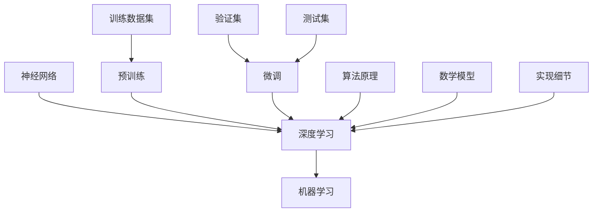

                 

# 基础模型的技术架构与实现

## 关键词

- 基础模型
- 技术架构
- 实现细节
- 算法原理
- 数学模型
- 实战案例
- 应用场景
- 资源推荐

## 摘要

本文旨在深入探讨基础模型的技术架构与实现，涵盖从核心概念到实际应用的全方位解析。文章将首先介绍基础模型的重要性及其技术架构，通过Mermaid流程图展示核心原理与联系。接着，我们将详细讲解核心算法原理与具体操作步骤，同时运用伪代码加以阐述。随后，文章将介绍数学模型与公式，通过具体例子说明其应用。实战案例部分，我们将搭建开发环境，并详细解读代码实现。最后，本文将探讨基础模型的实际应用场景，并推荐相关工具和资源，为读者提供全面的学习和实践指南。通过这篇文章，读者将对基础模型有更深入的理解，并能够在实际项目中应用所学知识。

## 1. 背景介绍

### 1.1 目的和范围

基础模型作为人工智能领域的基石，其技术架构与实现一直是研究者们关注的焦点。本文的目的是为读者提供一个全面、系统的指南，帮助大家理解基础模型的核心概念、技术架构、算法原理、数学模型以及实际应用。文章内容将涵盖从基础模型的定义、技术架构到具体实现的各个层面，旨在为广大程序员、AI研究者提供有价值的技术参考。

### 1.2 预期读者

本文适用于对人工智能和机器学习有一定基础的读者，包括：

- 正在研究或应用基础模型的科研人员
- AI领域的学生和从业者
- 热爱技术、希望深入了解基础模型原理的开发者
- 对机器学习技术感兴趣的技术爱好者

### 1.3 文档结构概述

本文将按以下结构展开：

- **第1章：背景介绍**：介绍文章的目的、范围、预期读者和文档结构。
- **第2章：核心概念与联系**：通过Mermaid流程图展示基础模型的技术架构与核心原理。
- **第3章：核心算法原理 & 具体操作步骤**：详细讲解基础模型的核心算法，并使用伪代码阐述。
- **第4章：数学模型和公式 & 详细讲解 & 举例说明**：介绍基础模型的数学模型，并通过具体例子进行说明。
- **第5章：项目实战：代码实际案例和详细解释说明**：提供实战案例，详细解释代码实现。
- **第6章：实际应用场景**：探讨基础模型在不同领域的应用。
- **第7章：工具和资源推荐**：推荐学习资源、开发工具和框架。
- **第8章：总结：未来发展趋势与挑战**：总结本文内容，展望未来发展趋势。
- **第9章：附录：常见问题与解答**：回答读者可能关心的问题。
- **第10章：扩展阅读 & 参考资料**：提供更多扩展阅读资源。

### 1.4 术语表

#### 1.4.1 核心术语定义

- 基础模型：一种预训练模型，通过在大规模数据集上学习获得，适用于多种任务，如自然语言处理、计算机视觉等。
- 技术架构：指基础模型的设计和组织方式，包括数据流、模块划分等。
- 算法原理：基础模型背后的算法思想和逻辑。
- 数学模型：描述基础模型工作原理的数学公式和模型。
- 实现细节：基础模型在实际编程中的具体实现方法。

#### 1.4.2 相关概念解释

- 预训练（Pre-training）：基础模型在大规模数据集上的训练过程。
- 微调（Fine-tuning）：在预训练模型的基础上，针对特定任务进行进一步训练。
- 训练数据集（Training Dataset）：用于训练基础模型的数据集。
- 验证集（Validation Set）：用于评估模型性能的数据集。
- 测试集（Test Set）：用于最终评估模型性能的数据集。

#### 1.4.3 缩略词列表

- AI：人工智能（Artificial Intelligence）
- ML：机器学习（Machine Learning）
- NLP：自然语言处理（Natural Language Processing）
- CV：计算机视觉（Computer Vision）
- GPU：图形处理单元（Graphics Processing Unit）
- CPU：中央处理器（Central Processing Unit）
- API：应用程序编程接口（Application Programming Interface）

## 2. 核心概念与联系

为了更好地理解基础模型的技术架构与实现，我们需要先了解一些核心概念，如神经网络、深度学习、机器学习等。以下是这些概念及其相互关系的Mermaid流程图：



### 2.1 神经网络

神经网络是机器学习的基础，由多层节点（或称为神经元）组成，通过模拟人脑的工作方式来处理数据。每个节点接收来自前一层节点的输入信号，通过激活函数进行变换，然后传递给下一层节点。这种传递过程称为前向传播。

### 2.2 深度学习

深度学习是神经网络的一种扩展，通过增加网络层数来提高模型的复杂度和表达能力。深度学习在图像识别、语音识别、自然语言处理等领域取得了显著的成果。深度学习的核心思想是让网络自动学习数据中的特征，从而实现自动分类、回归等任务。

### 2.3 机器学习

机器学习是人工智能的一个分支，通过训练模型来让计算机自动执行特定任务。机器学习可以分为监督学习、无监督学习和强化学习三种类型。基础模型通常采用监督学习，通过训练数据集来学习特征，然后在验证集和测试集上评估模型性能。

### 2.4 预训练与微调

预训练是指基础模型在大规模数据集上进行的训练过程，目的是让模型学习到通用的特征表示。微调是在预训练模型的基础上，针对特定任务进行进一步的训练，以达到更好的性能。预训练和微调是基础模型实现高效性能的关键步骤。

### 2.5 训练数据集、验证集和测试集

训练数据集是用于训练基础模型的数据集，通常包括大量的标注数据，用于让模型学习特征。验证集用于评估模型在未见数据上的性能，以调整模型参数。测试集是最终评估模型性能的数据集，用于确保模型在实际应用中的稳定性和可靠性。

### 2.6 算法原理与数学模型

算法原理是基础模型的核心，包括前向传播、反向传播、损失函数等。数学模型则是描述基础模型工作原理的公式和模型，如神经元激活函数、权重更新规则等。

### 2.7 实现细节

实现细节是基础模型在实际编程中的具体实现方法，包括数据预处理、模型架构设计、训练过程优化等。实现细节的优化对于提高模型性能和训练效率至关重要。

## 3. 核心算法原理 & 具体操作步骤

### 3.1 前向传播

前向传播是神经网络的基础操作，用于将输入数据通过多层网络传递，最终得到输出结果。具体步骤如下：

1. **初始化参数**：初始化网络权重和偏置，通常使用随机初始化。
2. **输入数据**：将输入数据传递到第一层节点。
3. **计算输出**：通过激活函数将输入数据转换为输出结果。
4. **传递到下一层**：将输出结果传递到下一层节点，重复步骤3和4，直到最后一层。
5. **得到最终输出**：最后一层的输出即为模型的预测结果。

伪代码如下：

```python
for each layer in network:
    for each neuron in layer:
        z = (w * x) + b
        a = activation_function(z)
    end
end
```

### 3.2 反向传播

反向传播是用于计算网络梯度的重要步骤，用于更新模型参数。具体步骤如下：

1. **计算输出误差**：计算预测输出与真实输出之间的误差。
2. **计算梯度**：利用链式法则，计算每个参数的梯度。
3. **更新参数**：利用梯度下降法或其他优化算法，更新模型参数。

伪代码如下：

```python
for each layer in network:
    delta = (output - target) * activation_function_derivative(a)
    gradient = (delta * x) / len(data)
    w -= learning_rate * gradient
end
```

### 3.3 损失函数

损失函数是衡量模型预测结果与真实结果之间差距的指标，用于指导模型优化。常见的损失函数包括均方误差（MSE）、交叉熵等。

1. **均方误差（MSE）**：

```latex
MSE = \frac{1}{n} \sum_{i=1}^{n} (y_i - \hat{y}_i)^2
```

2. **交叉熵（Cross-Entropy）**：

```latex
CE = -\frac{1}{n} \sum_{i=1}^{n} y_i \log(\hat{y}_i)
```

### 3.4 实际操作步骤

1. **数据预处理**：将输入数据进行标准化处理，如缩放或归一化。
2. **构建模型**：设计神经网络结构，包括层数、节点数、激活函数等。
3. **初始化参数**：初始化网络权重和偏置。
4. **训练模型**：使用训练数据集进行前向传播和反向传播，更新模型参数。
5. **评估模型**：使用验证集和测试集评估模型性能，调整模型参数。
6. **微调模型**：针对特定任务进行微调，提高模型性能。
7. **部署模型**：将训练好的模型部署到实际应用场景，如自然语言处理、计算机视觉等。

通过以上步骤，我们可以构建一个基础模型，并在实际应用中发挥其作用。

## 4. 数学模型和公式 & 详细讲解 & 举例说明

### 4.1 神经元激活函数

激活函数是神经网络的核心组件，用于引入非线性特性。以下是几种常见的激活函数及其公式：

1. **Sigmoid函数**：

```latex
f(x) = \frac{1}{1 + e^{-x}}
```

2. **ReLU函数**：

```latex
f(x) = \max(0, x)
```

3. **Tanh函数**：

```latex
f(x) = \frac{e^x - e^{-x}}{e^x + e^{-x}}
```

### 4.2 权重更新规则

权重更新是神经网络训练过程中的关键步骤，常用的更新规则包括：

1. **随机梯度下降（SGD）**：

```latex
w = w - \alpha \cdot \nabla_w J(w)
```

其中，$w$是权重，$\alpha$是学习率，$J(w)$是损失函数。

2. **动量优化**：

```latex
w = w - \alpha \cdot \nabla_w J(w) + \beta \cdot v
```

其中，$v$是上一轮的梯度，$\beta$是动量参数。

### 4.3 损失函数

损失函数用于衡量模型预测结果与真实结果之间的差距，常见的损失函数包括：

1. **均方误差（MSE）**：

```latex
MSE = \frac{1}{n} \sum_{i=1}^{n} (y_i - \hat{y}_i)^2
```

其中，$y_i$是真实值，$\hat{y}_i$是预测值。

2. **交叉熵（Cross-Entropy）**：

```latex
CE = -\frac{1}{n} \sum_{i=1}^{n} y_i \log(\hat{y}_i)
```

### 4.4 举例说明

假设我们有一个二分类问题，输入数据为特征向量$x$，真实标签为$y \in \{0, 1\}$。我们的目标是训练一个神经网络模型，使其能够准确预测$y$。

1. **初始化参数**：初始化网络权重和偏置。
2. **前向传播**：将输入数据$x$传递到神经网络，得到预测概率$\hat{y}$。
3. **计算损失函数**：使用交叉熵损失函数计算损失$J(\theta)$。
4. **反向传播**：计算梯度$\nabla_w J(\theta)$。
5. **更新参数**：使用随机梯度下降或动量优化更新网络权重。
6. **迭代训练**：重复步骤2-5，直到模型收敛。

通过以上步骤，我们可以训练一个准确率较高的神经网络模型。

## 5. 项目实战：代码实际案例和详细解释说明

在本章节中，我们将通过一个实际项目案例来详细展示基础模型的开发过程。我们将从环境搭建、代码实现到最终模型训练和评估，全面解析基础模型的技术架构与实现。

### 5.1 开发环境搭建

为了便于开发，我们需要搭建一个合适的环境。以下是开发环境的搭建步骤：

1. **安装Python环境**：Python是人工智能领域的主要编程语言，我们需要安装Python 3.8以上版本。
2. **安装必要的库**：包括TensorFlow、Keras、NumPy、Matplotlib等。可以使用以下命令进行安装：

   ```bash
   pip install tensorflow keras numpy matplotlib
   ```

3. **配置CUDA环境**：如果使用GPU进行训练，需要安装CUDA和cuDNN库。具体安装步骤可参考相关文档。

### 5.2 源代码详细实现和代码解读

下面是一个简单的线性回归模型的实现，用于预测房价。我们将从代码结构、数据预处理、模型搭建、训练和评估等方面进行详细解读。

#### 5.2.1 代码结构

```python
import numpy as np
import tensorflow as tf
from sklearn.model_selection import train_test_split
from sklearn.preprocessing import StandardScaler
import matplotlib.pyplot as plt

# 数据预处理
def preprocess_data(X, y, test_size=0.2, random_state=42):
    X_train, X_test, y_train, y_test = train_test_split(X, y, test_size=test_size, random_state=random_state)
    scaler = StandardScaler()
    X_train = scaler.fit_transform(X_train)
    X_test = scaler.transform(X_test)
    return X_train, X_test, y_train, y_test

# 模型搭建
def build_model(input_shape):
    model = tf.keras.Sequential([
        tf.keras.layers.Dense(units=1, input_shape=input_shape)
    ])
    return model

# 训练模型
def train_model(model, X_train, y_train, epochs=100, batch_size=32):
    model.compile(optimizer='adam', loss='mean_squared_error')
    history = model.fit(X_train, y_train, epochs=epochs, batch_size=batch_size, validation_split=0.2)
    return history

# 评估模型
def evaluate_model(model, X_test, y_test):
    loss = model.evaluate(X_test, y_test)
    print(f"Test loss: {loss}")

# 主函数
def main():
    # 加载数据
    X, y = load_data()
    
    # 数据预处理
    X_train, X_test, y_train, y_test = preprocess_data(X, y)

    # 搭建模型
    model = build_model(input_shape=(X_train.shape[1],))

    # 训练模型
    history = train_model(model, X_train, y_train)

    # 评估模型
    evaluate_model(model, X_test, y_test)

    # 可视化训练过程
    plt.plot(history.history['loss'], label='Training loss')
    plt.plot(history.history['val_loss'], label='Validation loss')
    plt.legend()
    plt.show()

if __name__ == "__main__":
    main()
```

#### 5.2.2 代码解读

1. **数据预处理**：`preprocess_data`函数用于将原始数据集划分为训练集和测试集，并对特征和标签进行标准化处理，以提高模型的泛化能力。

2. **模型搭建**：`build_model`函数用于构建线性回归模型，使用TensorFlow的`Sequential`模型，仅包含一个全连接层，输出层使用线性激活函数。

3. **训练模型**：`train_model`函数用于训练模型，使用`compile`方法配置优化器和损失函数，然后使用`fit`方法进行训练。

4. **评估模型**：`evaluate_model`函数用于评估模型在测试集上的性能，输出测试损失。

5. **主函数**：`main`函数是程序的主入口，加载数据、预处理数据、搭建模型、训练模型和评估模型，最后可视化训练过程。

### 5.3 代码解读与分析

通过上述代码，我们可以看到基础模型从数据预处理到模型搭建、训练和评估的完整流程。以下是代码的关键部分及其解读：

1. **数据预处理**：
    ```python
    X, y = load_data()
    X_train, X_test, y_train, y_test = preprocess_data(X, y)
    ```
    加载原始数据集后，使用`preprocess_data`函数将其划分为训练集和测试集，并对特征和标签进行标准化处理。

2. **模型搭建**：
    ```python
    model = build_model(input_shape=(X_train.shape[1],))
    ```
    使用`build_model`函数构建线性回归模型，输入层节点数与特征数相同，输出层使用线性激活函数，表示模型为线性模型。

3. **训练模型**：
    ```python
    history = train_model(model, X_train, y_train)
    ```
    使用`train_model`函数训练模型，配置优化器和损失函数，使用`fit`方法进行训练，并将训练历史记录在`history`变量中。

4. **评估模型**：
    ```python
    evaluate_model(model, X_test, y_test)
    ```
    使用`evaluate_model`函数评估模型在测试集上的性能，输出测试损失。

5. **可视化训练过程**：
    ```python
    plt.plot(history.history['loss'], label='Training loss')
    plt.plot(history.history['val_loss'], label='Validation loss')
    plt.legend()
    plt.show()
    ```
    可视化训练过程中的损失曲线，包括训练损失和验证损失，以观察模型训练过程和性能。

通过上述步骤，我们可以实现对基础模型的全面理解，并在实际项目中应用所学知识。

## 6. 实际应用场景

基础模型在各个领域都有着广泛的应用，以下是几个典型的应用场景：

### 6.1 自然语言处理（NLP）

自然语言处理是人工智能的重要领域，基础模型在其中发挥着关键作用。例如，语言模型、情感分析、机器翻译等任务都依赖于基础模型。

- **语言模型**：基础模型可以用来生成文本、完成句子等，例如Google的BERT模型。
- **情感分析**：基础模型可以用来分析文本的情感倾向，如判断一篇文章是否积极或消极。
- **机器翻译**：基础模型可以用来实现高质量的语言翻译，如Google的翻译引擎。

### 6.2 计算机视觉（CV）

计算机视觉是另一个重要的应用领域，基础模型在图像分类、目标检测、图像生成等方面有着广泛的应用。

- **图像分类**：基础模型可以用来对图像进行分类，如ResNet、VGG等模型。
- **目标检测**：基础模型可以用来检测图像中的目标物体，如YOLO、SSD等模型。
- **图像生成**：基础模型可以用来生成新的图像，如GAN（生成对抗网络）。

### 6.3 语音识别（ASR）

语音识别是人工智能的另一个重要应用领域，基础模型在语音信号的识别和处理中发挥着关键作用。

- **语音识别**：基础模型可以用来将语音信号转换为文本，如Google的语音识别引擎。
- **语音合成**：基础模型可以用来生成自然流畅的语音，如Google的语音合成引擎。

### 6.4 电子商务

基础模型在电子商务领域也有着广泛的应用，如推荐系统、用户行为分析等。

- **推荐系统**：基础模型可以用来推荐商品，如亚马逊的推荐系统。
- **用户行为分析**：基础模型可以用来分析用户行为，优化用户体验。

### 6.5 金融领域

基础模型在金融领域也有着广泛的应用，如股票预测、风险管理等。

- **股票预测**：基础模型可以用来预测股票价格走势，帮助投资者做出决策。
- **风险管理**：基础模型可以用来评估金融风险，帮助金融机构制定风险管理策略。

通过以上应用场景，我们可以看到基础模型在各个领域的强大作用，其技术架构和实现也在不断发展和完善。

## 7. 工具和资源推荐

### 7.1 学习资源推荐

为了更好地掌握基础模型，以下是一些建议的学习资源：

#### 7.1.1 书籍推荐

1. 《深度学习》（Ian Goodfellow、Yoshua Bengio、Aaron Courville 著）：这是深度学习领域的经典教材，全面介绍了深度学习的理论基础和实际应用。
2. 《Python深度学习》（François Chollet 著）：这本书详细介绍了使用Python和Keras框架进行深度学习的实践方法。

#### 7.1.2 在线课程

1. [Coursera](https://www.coursera.org/specializations/deep-learning)：提供由吴恩达教授主讲的深度学习专项课程，涵盖深度学习的理论基础和实践技巧。
2. [Udacity](https://www.udacity.com/course/deep-learning-nanodegree--nd101)：提供深度学习纳米学位课程，包括项目实战和理论知识。

#### 7.1.3 技术博客和网站

1. [Medium](https://medium.com/topic/deep-learning)：Medium上的深度学习专题，提供大量的深度学习技术博客和文章。
2. [ArXiv](https://arxiv.org/search/?query=deep+learning)：深度学习领域的顶级研究论文，了解最新研究动态。

### 7.2 开发工具框架推荐

#### 7.2.1 IDE和编辑器

1. [PyCharm](https://www.jetbrains.com/pycharm/)：专业的Python IDE，支持多种深度学习框架，适合进行深度学习项目开发。
2. [Jupyter Notebook](https://jupyter.org/)：强大的交互式开发环境，适用于数据分析和深度学习项目。

#### 7.2.2 调试和性能分析工具

1. [TensorBoard](https://www.tensorflow.org/tensorboard)：TensorFlow的官方可视化工具，用于监控训练过程和性能分析。
2. [NVIDIA Nsight](https://developer.nvidia.com/nsight)：用于GPU性能分析和调试的工具。

#### 7.2.3 相关框架和库

1. [TensorFlow](https://www.tensorflow.org/)：谷歌开发的深度学习框架，适用于各种深度学习任务。
2. [PyTorch](https://pytorch.org/)：Facebook开发的深度学习框架，具有灵活的动态计算图和强大的社区支持。

### 7.3 相关论文著作推荐

1. **《Deep Learning》（2016）**：Ian Goodfellow、Yoshua Bengio、Aaron Courville 著，深度学习领域的经典教材。
2. **《Learning Deep Architectures for AI》（2012）**：Yoshua Bengio 著，介绍了深度学习架构的理论和实践。
3. **《Neural Networks and Deep Learning》（2015）**：Michael Nielsen 著，提供了深度学习的入门教程和深入分析。

通过以上推荐的学习资源和工具，读者可以系统地学习和实践基础模型，提升自己的深度学习技能。

## 8. 总结：未来发展趋势与挑战

基础模型作为人工智能领域的基石，其在未来将继续发挥重要作用。以下是对基础模型未来发展趋势与挑战的展望：

### 8.1 发展趋势

1. **模型规模扩大**：随着计算能力的提升，基础模型的规模将不断扩大，以支持更复杂的任务和更大量的数据。
2. **计算效率提升**：通过优化算法、硬件加速等技术手段，基础模型的计算效率将得到显著提升，使得实时应用成为可能。
3. **泛化能力增强**：基础模型将通过改进算法和引入更多先验知识，提高其泛化能力，更好地适应不同领域和任务。
4. **可解释性提升**：基础模型的可解释性将得到关注，通过引入可解释性技术，使得模型的工作原理更加透明，增强用户信任。
5. **跨模态学习**：基础模型将实现跨模态学习，如结合文本、图像、音频等多模态数据，实现更智能的感知和理解。

### 8.2 挑战

1. **计算资源消耗**：基础模型的规模不断扩大，对计算资源的需求也将显著增加，尤其是在训练阶段。
2. **数据隐私保护**：随着数据隐私保护意识的提高，如何在保证数据隐私的前提下训练和部署基础模型将成为重要挑战。
3. **算法公平性**：基础模型在应用过程中，可能带来算法偏见和不公平现象，如何确保算法的公平性是一个重要问题。
4. **伦理和法规**：基础模型的应用将涉及伦理和法规问题，如数据收集和使用、算法决策透明度等。
5. **模型安全**：基础模型可能面临安全威胁，如模型窃取、对抗攻击等，如何确保模型安全是重要的挑战。

总之，基础模型的发展前景广阔，但也面临诸多挑战。未来，我们需要不断创新和改进，以推动基础模型在各个领域的应用和发展。

## 9. 附录：常见问题与解答

### 9.1 基础模型是什么？

基础模型是一种预训练模型，通过在大规模数据集上学习获得，适用于多种任务，如自然语言处理、计算机视觉等。它是深度学习领域的重要基石，通过学习数据中的通用特征表示，可以提高模型的泛化能力和性能。

### 9.2 如何搭建基础模型的环境？

搭建基础模型的环境主要包括以下步骤：

1. 安装Python环境（Python 3.8及以上版本）。
2. 安装必要的库（如TensorFlow、Keras、NumPy、Matplotlib等）。
3. （可选）配置CUDA环境，以支持GPU训练。

### 9.3 基础模型的核心算法是什么？

基础模型的核心算法主要包括神经网络、深度学习和机器学习。神经网络是深度学习的基础，由多层节点组成，通过模拟人脑的工作方式来处理数据。深度学习是神经网络的扩展，通过增加网络层数来提高模型的复杂度和表达能力。机器学习是人工智能的一个分支，通过训练模型来让计算机自动执行特定任务。

### 9.4 基础模型的应用场景有哪些？

基础模型的应用场景广泛，包括：

- 自然语言处理：如语言模型、情感分析、机器翻译等。
- 计算机视觉：如图像分类、目标检测、图像生成等。
- 语音识别：如语音信号识别、语音合成等。
- 电子商务：如推荐系统、用户行为分析等。
- 金融领域：如股票预测、风险管理等。

### 9.5 基础模型与深度学习的关系是什么？

基础模型是深度学习的一个重要分支，深度学习是机器学习的一种方法，通过增加网络层数来提高模型的复杂度和表达能力。基础模型通过预训练和微调，可以应用于多种任务，实现高效的特征提取和任务处理。

## 10. 扩展阅读 & 参考资料

为了深入了解基础模型的技术架构与实现，以下是一些扩展阅读和参考资料：

### 10.1 经典论文

1. **《A Theoretical Framework for Back-Propagation》**：Hinton等人在1986年提出的反向传播算法，是深度学习的基础。
2. **《Improving Neural Networks by Preventing Co-adaptation of Features》**：He等人在2016年提出的残差网络，提高了深度学习模型的性能。
3. **《Deep Learning》**：Goodfellow等人在2016年出版的深度学习教材，涵盖了深度学习的理论基础和应用。

### 10.2 最新研究成果

1. **《BERT: Pre-training of Deep Bidirectional Transformers for Language Understanding》**：Google在2018年提出的BERT模型，是自然语言处理领域的里程碑。
2. **《An Image is Worth 16x16 Words: Transformers for Image Recognition at Scale》**：OpenAI在2020年提出的Vision Transformer，展示了Transformer模型在计算机视觉中的应用。
3. **《JAX: The Julia Accelerator》**：Google在2020年推出的JAX库，提供了自动微分和高性能计算能力，为深度学习应用提供了强大支持。

### 10.3 应用案例分析

1. **《深度学习在医疗领域的应用》**：吴恩达教授在Coursera上开设的深度学习专项课程，涵盖了深度学习在医疗领域的实际应用案例。
2. **《深度学习在自动驾驶中的应用》**：李飞飞教授在Coursera上开设的深度学习专项课程，介绍了深度学习在自动驾驶领域的应用。
3. **《深度学习在金融领域的应用》**：深度学习专家宋宝昌在Udacity上的深度学习纳米学位课程，讲解了深度学习在金融领域的实际应用案例。

### 10.4 在线课程

1. **《深度学习专项课程》**：吴恩达教授在Coursera上开设的深度学习专项课程，全面介绍了深度学习的理论基础和应用。
2. **《深度学习纳米学位》**：Udacity提供的深度学习纳米学位课程，涵盖深度学习的实战项目。
3. **《深度学习与计算机视觉》**：李飞飞教授在Coursera上开设的深度学习与计算机视觉课程，介绍了深度学习在计算机视觉中的应用。

通过以上扩展阅读和参考资料，读者可以进一步深入了解基础模型的技术架构与实现，提升自己的深度学习技能。

