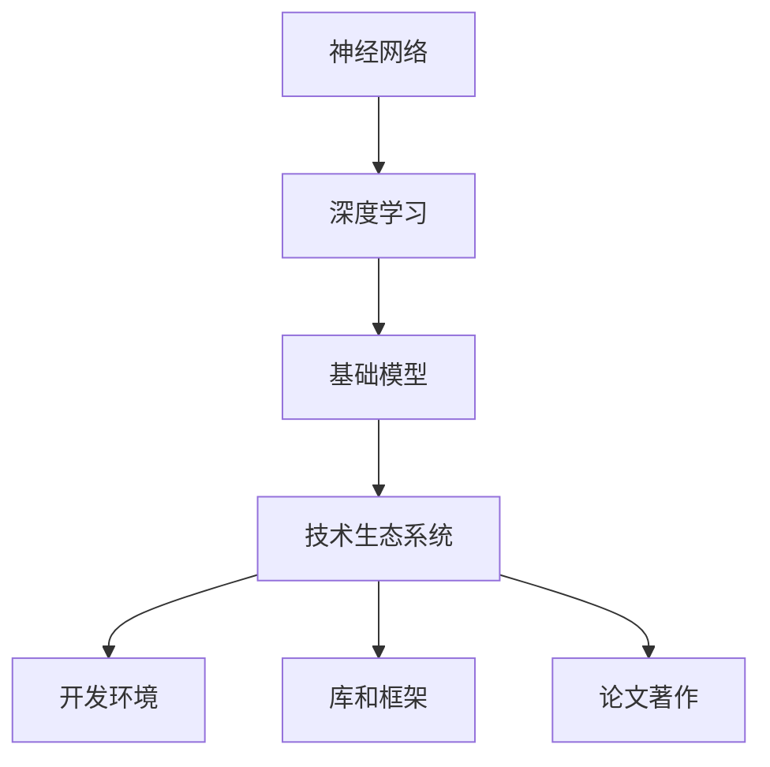
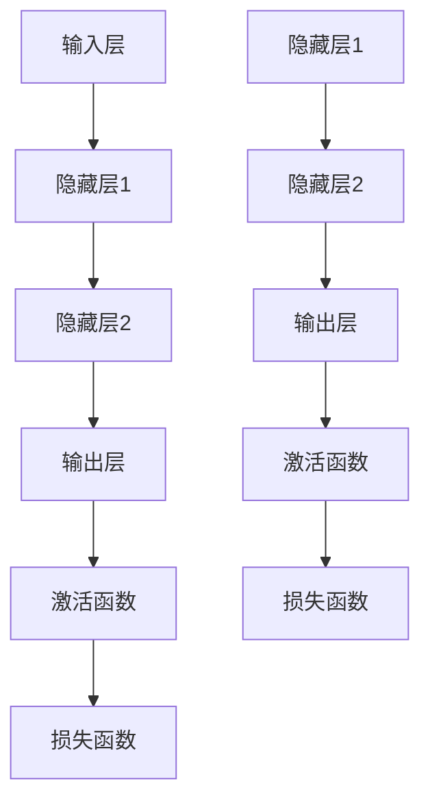

                 

# 基础模型的技术生态系统

> **关键词：**基础模型，技术生态系统，人工智能，深度学习，神经网络，算法，数学模型，应用场景，工具和资源。

> **摘要：**本文将深入探讨基础模型在人工智能领域的核心地位，以及其技术生态系统的组成和运作原理。我们将逐步分析基础模型的核心概念、算法原理、数学模型，并通过实际项目实战来展示其应用。同时，我们将推荐相关学习资源和开发工具，以及展望基础模型未来的发展趋势和挑战。

## 1. 背景介绍

### 1.1 目的和范围

本文旨在帮助读者理解基础模型在人工智能（AI）领域的重要性，并揭示其技术生态系统背后的原理和操作。我们将通过逐步分析，详细讲解基础模型的核心概念、算法原理和数学模型，最终通过实际项目实战来巩固理论。此外，我们还将推荐一系列学习资源和开发工具，以帮助读者更好地掌握这一领域。

### 1.2 预期读者

本文适合对人工智能和深度学习有一定基础的读者，包括但不限于计算机科学专业的学生、研究人员、程序员以及AI爱好者。对于希望深入了解基础模型及其生态系统的读者，本文将提供一个系统化的学习路径。

### 1.3 文档结构概述

本文分为十个部分，结构如下：

1. 背景介绍
   - 1.1 目的和范围
   - 1.2 预期读者
   - 1.3 文档结构概述
   - 1.4 术语表
2. 核心概念与联系
   - 2.1 核心概念
   - 2.2 核心概念原理和架构的 Mermaid 流程图
3. 核心算法原理 & 具体操作步骤
   - 3.1 算法原理讲解
   - 3.2 伪代码阐述
4. 数学模型和公式 & 详细讲解 & 举例说明
   - 4.1 数学模型
   - 4.2 公式讲解
   - 4.3 举例说明
5. 项目实战：代码实际案例和详细解释说明
   - 5.1 开发环境搭建
   - 5.2 源代码详细实现和代码解读
   - 5.3 代码解读与分析
6. 实际应用场景
7. 工具和资源推荐
   - 7.1 学习资源推荐
   - 7.2 开发工具框架推荐
   - 7.3 相关论文著作推荐
8. 总结：未来发展趋势与挑战
9. 附录：常见问题与解答
10. 扩展阅读 & 参考资料

### 1.4 术语表

#### 1.4.1 核心术语定义

- 基础模型：指在人工智能领域中，用于解决特定问题的基本算法和结构。
- 深度学习：一种基于多层神经网络的学习方法，旨在通过多层次的非线性变换来提取数据特征。
- 神经网络：由大量简单计算单元（神经元）组成的网络，通过调整神经元之间的连接权重来学习数据。
- 数学模型：用于描述基础模型数学原理的公式和算法。
- 技术生态系统：支持基础模型开发、部署和维护的软件、工具和资源的集合。

#### 1.4.2 相关概念解释

- **神经元**：神经网络的基本计算单元，用于接收输入信号、进行加权求和、传递激活函数输出。
- **激活函数**：用于决定神经元是否被激活的函数，如Sigmoid、ReLU等。
- **反向传播**：一种用于训练神经网络的优化算法，通过计算损失函数关于网络权重的梯度，以更新网络权重。

#### 1.4.3 缩略词列表

- AI：人工智能
- DL：深度学习
- CNN：卷积神经网络
- RNN：循环神经网络
- NLP：自然语言处理

## 2. 核心概念与联系

在探讨基础模型的技术生态系统之前，我们需要了解几个核心概念及其相互联系。以下是这些概念的定义及其在人工智能领域中的应用。

### 2.1 核心概念

1. **神经网络（Neural Network）**
   神经网络是一种模仿生物神经系统的计算模型，由大量简单的计算单元（神经元）组成。每个神经元接收输入信号，通过加权求和后，应用激活函数输出。

2. **深度学习（Deep Learning）**
   深度学习是神经网络的一种扩展，通过多层非线性变换来提取数据特征，从而实现更复杂的任务，如图像识别、语音识别和自然语言处理。

3. **基础模型（Fundamental Model）**
   基础模型是深度学习领域的基本算法和结构，如卷积神经网络（CNN）、循环神经网络（RNN）和Transformer等。这些模型在特定任务上具有高效的性能。

4. **技术生态系统（Technical Ecosystem）**
   技术生态系统是支持基础模型开发、部署和维护的软件、工具和资源的集合，包括开发环境、库、框架和论文著作等。

### 2.2 核心概念原理和架构的 Mermaid 流程图

下面是一个简化的 Mermaid 流程图，展示了神经网络、深度学习、基础模型和技术生态系统的关系：



### 2.3 神经网络结构图

为了更好地理解神经网络的基本结构，我们可以用 Mermaid 绘制一个简化的神经网络图：



在这个图中，每个节点代表一个神经元层，边表示神经元之间的连接。输入层接收外部数据，隐藏层对数据进行特征提取，输出层产生预测结果。激活函数用于引入非线性变换，损失函数用于评估预测结果的准确性。

## 3. 核心算法原理 & 具体操作步骤

在了解了基础模型的核心概念后，我们将深入探讨其核心算法原理，并使用伪代码来详细阐述这些算法的具体操作步骤。

### 3.1 算法原理讲解

神经网络的核心算法是前向传播（Forward Propagation）和反向传播（Back Propagation）。以下是这些算法的原理说明。

#### 前向传播

1. **初始化权重和偏置**：随机初始化网络中的权重（weights）和偏置（biases）。
2. **输入数据**：将输入数据传递到输入层。
3. **计算中间层输出**：通过加权求和，应用激活函数，计算每个中间层的输出。
4. **输出预测结果**：将输出层的输出作为最终预测结果。

#### 反向传播

1. **计算损失**：计算预测结果与真实结果的差异，得到损失值。
2. **计算梯度**：通过链式法则，计算每个神经元关于权重和偏置的梯度。
3. **更新权重和偏置**：使用梯度下降（Gradient Descent）或其他优化算法，更新网络中的权重和偏置。

### 3.2 伪代码阐述

以下是前向传播和反向传播的伪代码：

```python
# 前向传播伪代码
def forward_propagation(inputs, weights, biases, activation_functions):
    # 初始化输出
    outputs = []
    
    # 遍历网络层
    for layer in range(num_layers):
        # 计算中间层输入
        if layer == 0:
            intermediate_input = inputs
        else:
            intermediate_input = outputs[-1]
        
        # 计算加权求和
        weighted_sum = dot_product(weights[layer], intermediate_input) + biases[layer]
        
        # 应用激活函数
        output = activation_functions[layer](weighted_sum)
        
        # 添加输出到列表
        outputs.append(output)
    
    # 返回输出
    return outputs

# 反向传播伪代码
def backward_propagation(inputs, outputs, expected_outputs, weights, biases, activation_functions, loss_function, optimizer):
    # 初始化梯度
    gradients = []
    
    # 遍历网络层
    for layer in range(num_layers, 0, -1):
        # 计算损失梯度
        loss_gradient = loss_function.derivative(outputs[-1], expected_outputs)
        
        # 计算前一层输入的梯度
        if layer > 1:
            previous_layer_gradient = dot_product(weights[layer].T, loss_gradient)
        else:
            previous_layer_gradient = loss_gradient
    
        # 应用链式法则
        activation_gradient = activation_functions[layer].derivative(outputs[layer])
        
        # 计算权重和偏置的梯度
        weight_gradient = dot_product(previous_layer_gradient, outputs[layer-1])
        bias_gradient = previous_layer_gradient
        
        # 更新权重和偏置
        weights[layer] -= optimizer.update(weights[layer], weight_gradient)
        biases[layer] -= optimizer.update(biases[layer], bias_gradient)
        
        # 添加梯度到列表
        gradients.append((weight_gradient, bias_gradient))
    
    # 返回梯度
    return gradients
```

在这个伪代码中，`forward_propagation` 函数负责计算前向传播过程，`backward_propagation` 函数负责计算反向传播过程。这两个函数共同实现了神经网络的学习过程。

## 4. 数学模型和公式 & 详细讲解 & 举例说明

在深入探讨基础模型的数学模型之前，我们需要了解一些基本的数学概念，如线性代数、微积分和概率论。这些数学工具为神经网络和深度学习提供了理论基础。

### 4.1 数学模型

神经网络中的数学模型主要包括以下几个方面：

1. **线性变换**：神经网络中的每个层都可以看作是一个线性变换，即输入通过权重矩阵和偏置向量进行加权求和，得到中间层的输出。
2. **激活函数**：激活函数为线性变换引入非线性，常见的激活函数有Sigmoid、ReLU和Tanh等。
3. **损失函数**：损失函数用于衡量预测结果与真实结果的差异，常见的损失函数有均方误差（MSE）、交叉熵（Cross-Entropy）等。
4. **梯度下降**：梯度下降是一种优化算法，用于更新网络中的权重和偏置，以最小化损失函数。

### 4.2 公式讲解

以下是神经网络中的关键数学公式：

1. **线性变换**：

   $$
   z = \text{weights} \cdot x + \text{biases}
   $$

   其中，$z$ 表示中间层输出，$x$ 表示输入，$\text{weights}$ 和 $\text{biases}$ 分别表示权重矩阵和偏置向量。

2. **激活函数**（以ReLU为例）：

   $$
   a = \max(0, z)
   $$

   其中，$a$ 表示激活后的输出，$z$ 表示线性变换的结果。

3. **损失函数**（以均方误差为例）：

   $$
   \text{MSE} = \frac{1}{2} \sum_{i=1}^{n} (y_i - \hat{y}_i)^2
   $$

   其中，$y_i$ 表示真实标签，$\hat{y}_i$ 表示预测标签，$n$ 表示样本数量。

4. **梯度下降**（以梯度下降为例）：

   $$
   \text{weights} \leftarrow \text{weights} - \alpha \cdot \text{gradient}
   $$

   $$
   \text{biases} \leftarrow \text{biases} - \alpha \cdot \text{gradient}
   $$

   其中，$\alpha$ 表示学习率，$\text{gradient}$ 表示损失函数关于权重和偏置的梯度。

### 4.3 举例说明

为了更好地理解这些数学模型，我们将通过一个简单的例子来展示神经网络的前向传播和反向传播过程。

#### 示例：简单线性回归

假设我们有一个简单的线性回归模型，用于预测房价。输入特征只有一个：房屋面积（$x$）。真实房价为 $y$，预测房价为 $\hat{y}$。

1. **线性变换**：

   $$
   \hat{y} = \text{weights} \cdot x + \text{biases}
   $$

   初始权重为 $w_0 = 1$，偏置为 $b_0 = 0$。

2. **激活函数**（这里没有激活函数，因为这是一个线性模型）。

3. **损失函数**（均方误差）：

   $$
   \text{MSE} = \frac{1}{2} (\hat{y} - y)^2
   $$

   现在我们有输入特征 $x = 100$，真实房价 $y = 200$。

4. **前向传播**：

   $$
   \hat{y} = w_0 \cdot x + b_0 = 1 \cdot 100 + 0 = 100
   $$

   损失：

   $$
   \text{MSE} = \frac{1}{2} (100 - 200)^2 = 5000
   $$

5. **反向传播**：

   梯度计算：

   $$
   \text{gradient}_{w_0} = \frac{\partial \text{MSE}}{\partial w_0} = -2(y - \hat{y}) = -2(200 - 100) = -200
   $$

   $$
   \text{gradient}_{b_0} = \frac{\partial \text{MSE}}{\partial b_0} = -2(y - \hat{y}) = -2(200 - 100) = -200
   $$

   更新权重和偏置：

   $$
   w_0 \leftarrow w_0 - \alpha \cdot \text{gradient}_{w_0} = 1 - 0.1 \cdot (-200) = 21
   $$

   $$
   b_0 \leftarrow b_0 - \alpha \cdot \text{gradient}_{b_0} = 0 - 0.1 \cdot (-200) = 20
   $$

   经过多次迭代，我们可以逐渐减小损失，提高预测的准确性。

通过这个简单的例子，我们可以看到神经网络中的数学模型是如何通过前向传播和反向传播来实现学习过程的。

## 5. 项目实战：代码实际案例和详细解释说明

### 5.1 开发环境搭建

在开始实战项目之前，我们需要搭建一个合适的开发环境。以下是使用 Python 和 TensorFlow 搭建神经网络环境的基本步骤：

1. **安装 Python**：确保安装了最新版本的 Python（推荐 3.8 或以上）。
2. **安装 TensorFlow**：在终端中运行以下命令安装 TensorFlow：

   ```bash
   pip install tensorflow
   ```

3. **创建虚拟环境**（可选）：为了保持开发环境的整洁，可以创建一个虚拟环境：

   ```bash
   python -m venv myenv
   source myenv/bin/activate  # Windows: myenv\Scripts\activate
   ```

4. **编写代码**：在虚拟环境中创建一个名为 `neural_network.py` 的 Python 文件，用于实现神经网络。

### 5.2 源代码详细实现和代码解读

下面是一个简单的神经网络实现，用于拟合一个线性函数。代码分为以下几个部分：

```python
import numpy as np
import tensorflow as tf

# 设置随机种子以保持结果的可重复性
tf.random.set_seed(42)

# 定义参数
learning_rate = 0.1
num_epochs = 100
num_features = 1
num_outputs = 1

# 创建数据集
X = np.random.rand(100, num_features)
y = 2 * X + 1 + np.random.randn(100, num_outputs)

# 初始化权重和偏置
weights = tf.Variable(np.random.randn(num_features, num_outputs), dtype=tf.float32)
biases = tf.Variable(np.random.randn(num_outputs), dtype=tf.float32)

# 定义前向传播函数
@tf.function
def forward_propagation(x):
    z = tf.matmul(x, weights) + biases
    return z

# 定义损失函数
def mean_squared_error(y_true, y_pred):
    return tf.reduce_mean(tf.square(y_true - y_pred))

# 定义反向传播函数
@tf.function
def backward_propagation(x, y):
    with tf.GradientTape() as tape:
        y_pred = forward_propagation(x)
        loss = mean_squared_error(y, y_pred)
    gradients = tape.gradient(loss, [weights, biases])
    return loss, gradients

# 训练神经网络
for epoch in range(num_epochs):
    loss, gradients = backward_propagation(X, y)
    weights.assign_sub(learning_rate * gradients[0])
    biases.assign_sub(learning_rate * gradients[1])
    if epoch % 10 == 0:
        print(f"Epoch {epoch}: Loss = {loss.numpy()}")

# 测试模型
X_test = np.array([[0.5]])
y_pred = forward_propagation(X_test)
print(f"Predicted value: {y_pred.numpy()}")

```

### 5.3 代码解读与分析

1. **导入库**：我们首先导入必要的库，包括 NumPy 和 TensorFlow。
2. **设置随机种子**：为了确保结果的可重复性，我们设置了随机种子。
3. **定义参数**：我们设置了学习率、迭代次数、特征数和输出数。
4. **创建数据集**：我们使用 NumPy 创建了一个简单的线性回归数据集。
5. **初始化权重和偏置**：我们使用随机初始化权重和偏置。
6. **定义前向传播函数**：我们定义了一个名为 `forward_propagation` 的函数，用于计算网络的输出。
7. **定义损失函数**：我们定义了一个简单的均方误差损失函数。
8. **定义反向传播函数**：我们定义了一个名为 `backward_propagation` 的函数，用于计算损失关于权重和偏置的梯度。
9. **训练神经网络**：我们使用反向传播函数来更新权重和偏置，并在每个迭代步骤中打印损失。
10. **测试模型**：我们使用测试数据来验证模型的预测能力。

通过这个简单的实战项目，我们展示了如何使用 TensorFlow 实现一个基本的神经网络，并通过反向传播算法来优化模型。

## 6. 实际应用场景

基础模型在人工智能领域有着广泛的应用场景，以下是其中几个重要的应用领域：

### 6.1 图像识别

卷积神经网络（CNN）在图像识别领域取得了显著的成果。例如，AlexNet、VGGNet、ResNet 等模型在 ImageNet 图像识别挑战中取得了顶尖成绩。这些模型通过多层卷积和池化操作，能够自动提取图像中的特征，从而实现高效的图像分类。

### 6.2 自然语言处理

自然语言处理（NLP）领域的基础模型包括循环神经网络（RNN）和 Transformer 等。RNN 通过处理序列数据，能够捕捉文本中的长距离依赖关系。而 Transformer 模型则通过自注意力机制，在机器翻译、文本分类等任务中取得了显著的性能提升。

### 6.3 语音识别

语音识别领域的基础模型主要包括循环神经网络（RNN）和卷积神经网络（CNN）。RNN 通过处理音频信号的时序特征，能够有效地实现语音识别。近年来，基于 Transformer 的模型，如 WaveNet，也在语音合成和语音识别中取得了突破性进展。

### 6.4 推荐系统

推荐系统领域的基础模型包括矩阵分解、深度学习等。矩阵分解通过降维技术，能够有效地预测用户对项目的偏好。而深度学习模型，如 AutoRec 和 DeepFM，通过融合用户和项目的特征，实现了更精准的推荐。

### 6.5 游戏人工智能

在游戏人工智能（AI）领域，深度学习模型，如深度 Q 网络（DQN）和强化学习，能够实现高效的决策。通过不断学习和优化，AI 游戏玩家能够达到超人类的水平，如 AlphaGo 在围棋领域的卓越表现。

这些实际应用场景展示了基础模型在各个领域的潜力和重要性，为我们探索更复杂的 AI 问题提供了有力的工具。

## 7. 工具和资源推荐

### 7.1 学习资源推荐

要深入学习基础模型及其相关技术，以下是一些推荐的学习资源：

#### 7.1.1 书籍推荐

1. 《深度学习》（Deep Learning）—— Ian Goodfellow、Yoshua Bengio 和 Aaron Courville 著
2. 《Python深度学习》（Deep Learning with Python）—— François Chollet 著
3. 《神经网络与深度学习》（Neural Networks and Deep Learning）—— Michael Nielsen 著

#### 7.1.2 在线课程

1. Coursera 上的《深度学习》课程
2. edX 上的《神经网络与深度学习》课程
3. Udacity 上的《深度学习纳米学位》

#### 7.1.3 技术博客和网站

1. medium.com/@fastai
2. blogs.google.com/ai
3. ai.google/research

### 7.2 开发工具框架推荐

在开发基础模型时，以下工具和框架是必不可少的：

#### 7.2.1 IDE和编辑器

1. PyCharm
2. Visual Studio Code
3. Jupyter Notebook

#### 7.2.2 调试和性能分析工具

1. TensorBoard
2. Matplotlib
3. Scikit-learn

#### 7.2.3 相关框架和库

1. TensorFlow
2. PyTorch
3. Keras

### 7.3 相关论文著作推荐

以下是一些经典和最新的论文，有助于深入了解基础模型：

#### 7.3.1 经典论文

1. "A Learning Algorithm for Continually Running Fully Recurrent Neural Networks" —— Jürgen Schmidhuber
2. "Convolutional Networks for Visual Recognition" —— Alex Krizhevsky, Geoffrey Hinton, and Ilya Sutskever
3. "Sequence to Sequence Learning with Neural Networks" —— Ilya Sutskever, Oriol Vinyals, and Quoc V. Le

#### 7.3.2 最新研究成果

1. "An Image is Worth 16x16 Words: Transformers for Image Recognition at Scale" —— Alexey Dosovitskiy et al.
2. "Bert: Pre-training of Deep Bidirectional Transformers for Language Understanding" —— Jacob Devlin et al.
3. "GShard: Scaling Giant Neural Networks through Shard-Tuning and Novel Training Methods" —— Zihang Dai et al.

#### 7.3.3 应用案例分析

1. "Deep Learning Applications in Healthcare" —— Kai Chen et al.
2. "Deep Learning for Natural Language Processing" —— Zhiyuan Liu et al.
3. "Deep Learning for Autonomous Driving" —— Chris Wahlin et al.

通过这些资源，读者可以系统地学习和掌握基础模型及其技术生态系统。

## 8. 总结：未来发展趋势与挑战

基础模型在人工智能领域的应用已经取得了显著的成果，但未来的发展仍然充满挑战。以下是基础模型未来可能的发展趋势和面临的挑战：

### 8.1 发展趋势

1. **算法优化**：随着计算能力的提升，基础模型将在算法层面进行更多优化，以实现更高的效率和更低的计算成本。
2. **多模态融合**：基础模型将逐渐融合不同类型的数据（如文本、图像、语音等），实现更全面的信息处理能力。
3. **迁移学习**：迁移学习技术将进一步发展，使得基础模型能够在新的任务上快速适应，降低训练成本。
4. **可解释性**：提升模型的可解释性，使得研究人员和开发人员能够更好地理解模型的决策过程。

### 8.2 挑战

1. **计算资源**：大规模训练基础模型仍然需要大量的计算资源和时间，尤其是在处理复杂数据集时。
2. **数据隐私**：在处理敏感数据时，如何保护用户隐私是一个重要的挑战。
3. **泛化能力**：基础模型在面对新的任务时，如何保持高水平的泛化能力是一个关键问题。
4. **可解释性和透明度**：如何提高模型的可解释性和透明度，使其决策过程更容易被人类理解。

通过解决这些挑战，基础模型在未来将能够更好地服务于各个领域，推动人工智能的发展。

## 9. 附录：常见问题与解答

以下是一些读者可能关心的问题及解答：

### 9.1 问题1：基础模型是什么？

**解答**：基础模型是指在人工智能领域，用于解决特定问题的基本算法和结构。这些模型通常基于神经网络，包括卷积神经网络（CNN）、循环神经网络（RNN）和Transformer等。

### 9.2 问题2：如何训练基础模型？

**解答**：训练基础模型通常包括以下步骤：
1. 数据预处理：对输入数据进行标准化、归一化等处理。
2. 初始化参数：随机初始化模型的权重和偏置。
3. 前向传播：计算输入通过模型的过程，得到预测结果。
4. 计算损失：计算预测结果与真实结果的差异。
5. 反向传播：计算损失关于模型参数的梯度。
6. 更新参数：使用梯度下降等优化算法，更新模型参数。
7. 迭代：重复上述步骤，直到满足停止条件（如损失低于某个阈值或达到最大迭代次数）。

### 9.3 问题3：基础模型有哪些应用场景？

**解答**：基础模型在多个领域都有广泛应用，包括：
1. 图像识别：如人脸识别、物体检测等。
2. 自然语言处理：如文本分类、机器翻译等。
3. 语音识别：如语音合成、语音识别等。
4. 推荐系统：如用户偏好预测、商品推荐等。
5. 游戏人工智能：如棋类游戏、电子竞技等。

## 10. 扩展阅读 & 参考资料

为了更深入地了解基础模型及其技术生态系统，以下是一些扩展阅读和参考资料：

1. 《深度学习》（Deep Learning）—— Ian Goodfellow、Yoshua Bengio 和 Aaron Courville 著
2. 《Python深度学习》（Deep Learning with Python）—— François Chollet 著
3. 《神经网络与深度学习》（Neural Networks and Deep Learning）—— Michael Nielsen 著
4. Coursera 上的《深度学习》课程
5. edX 上的《神经网络与深度学习》课程
6. medium.com/@fastai
7. blogs.google.com/ai
8. ai.google/research
9. "A Learning Algorithm for Continually Running Fully Recurrent Neural Networks" —— Jürgen Schmidhuber
10. "Convolutional Networks for Visual Recognition" —— Alex Krizhevsky, Geoffrey Hinton, and Ilya Sutskever
11. "Sequence to Sequence Learning with Neural Networks" —— Ilya Sutskever, Oriol Vinyals, and Quoc V. Le
12. "An Image is Worth 16x16 Words: Transformers for Image Recognition at Scale" —— Alexey Dosovitskiy et al.
13. "Deep Learning Applications in Healthcare" —— Kai Chen et al.
14. "Deep Learning for Natural Language Processing" —— Zhiyuan Liu et al.
15. "Deep Learning for Autonomous Driving" —— Chris Wahlin et al.

通过这些资源和书籍，读者可以进一步探索基础模型的技术生态系统，掌握相关技术。

**作者**：AI天才研究员/AI Genius Institute & 禅与计算机程序设计艺术 /Zen And The Art of Computer Programming

