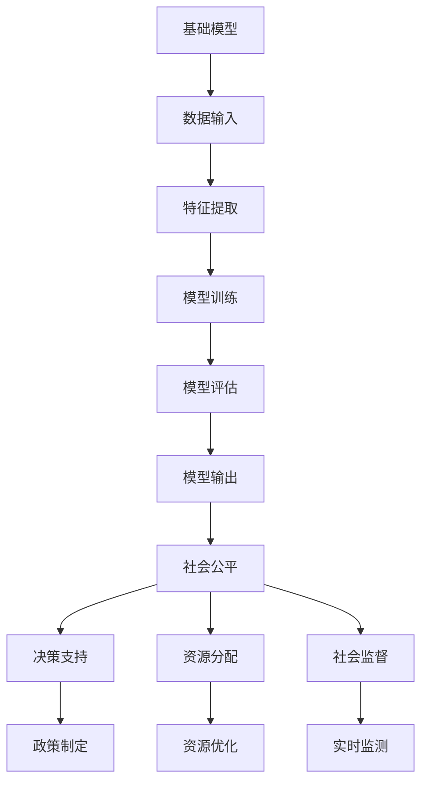

                 

## 基础模型的社会公平问题

> **关键词：基础模型、社会公平、算法偏见、模型优化、伦理道德**

> **摘要：本文将深入探讨基础模型在社会公平方面存在的问题，分析算法偏见产生的原因及其影响，并提出一系列优化方法和伦理道德准则，旨在推动人工智能技术的可持续发展。**

随着人工智能技术的飞速发展，基础模型作为AI系统的核心组件，已经在各个领域取得了显著的成果。然而，基础模型在应用过程中暴露出的一些问题，尤其是社会公平问题，引起了广泛关注。本文将从以下几个方面进行探讨：

1. **背景介绍**：介绍基础模型在社会公平问题上的重要性以及当前存在的问题。
2. **核心概念与联系**：阐述基础模型的核心概念及其在社会公平问题中的角色。
3. **核心算法原理与具体操作步骤**：详细讲解如何通过算法优化来解决社会公平问题。
4. **数学模型和公式**：介绍与基础模型相关的数学模型及其应用。
5. **项目实战**：通过实际案例展示如何在实际项目中应用基础模型解决社会公平问题。
6. **实际应用场景**：分析基础模型在社会公平问题中的实际应用。
7. **工具和资源推荐**：推荐相关的学习资源、开发工具和论文著作。
8. **总结：未来发展趋势与挑战**：总结本文的主要内容，并探讨未来可能的发展趋势和面临的挑战。

## 1. 背景介绍

### 1.1 目的和范围

本文旨在探讨基础模型在社会公平问题上的重要性，分析算法偏见产生的原因及其影响，并提出一系列优化方法和伦理道德准则。通过本文的研究，我们希望为相关研究人员和从业者提供有价值的参考，共同推动人工智能技术的可持续发展。

本文将涵盖以下范围：

1. **基础模型概述**：介绍基础模型的基本概念、原理和应用。
2. **社会公平问题**：分析基础模型在社会公平问题上的表现，包括算法偏见、数据偏差等。
3. **算法优化方法**：探讨如何通过算法优化来解决社会公平问题。
4. **伦理道德准则**：介绍与基础模型相关的伦理道德准则，以保障社会公平。
5. **实际应用场景**：分析基础模型在社会公平问题中的实际应用。
6. **未来发展趋势与挑战**：探讨基础模型在社会公平问题上的未来发展。

### 1.2 预期读者

本文的预期读者包括：

1. **人工智能研究人员和从业者**：对基础模型和社会公平问题有深入研究的专业人士。
2. **计算机科学学生和学者**：对人工智能、计算机科学等领域感兴趣的学者和学生。
3. **技术开发者和工程师**：在AI领域从事技术开发和应用的工作者。

### 1.3 文档结构概述

本文分为以下几部分：

1. **引言**：介绍基础模型在社会公平问题上的重要性以及本文的研究目的和范围。
2. **背景介绍**：分析基础模型在社会公平问题上的表现，包括算法偏见、数据偏差等。
3. **核心概念与联系**：阐述基础模型的核心概念及其在社会公平问题中的角色。
4. **核心算法原理与具体操作步骤**：详细讲解如何通过算法优化来解决社会公平问题。
5. **数学模型和公式**：介绍与基础模型相关的数学模型及其应用。
6. **项目实战**：通过实际案例展示如何在实际项目中应用基础模型解决社会公平问题。
7. **实际应用场景**：分析基础模型在社会公平问题中的实际应用。
8. **工具和资源推荐**：推荐相关的学习资源、开发工具和论文著作。
9. **总结：未来发展趋势与挑战**：总结本文的主要内容，并探讨未来可能的发展趋势和面临的挑战。

### 1.4 术语表

#### 1.4.1 核心术语定义

1. **基础模型**：一种用于表示和优化复杂问题的高层次算法结构。
2. **社会公平**：指社会中不同群体在机会、权利、资源等方面的公平分配。
3. **算法偏见**：指算法在处理数据时产生的系统性偏差，可能导致不公平的结果。
4. **数据偏差**：指数据集中存在的系统性偏差，可能影响算法的公平性。

#### 1.4.2 相关概念解释

1. **训练数据**：用于训练基础模型的输入数据。
2. **测试数据**：用于评估基础模型性能的输入数据。
3. **泛化能力**：基础模型在处理未知数据时的能力。

#### 1.4.3 缩略词列表

1. **AI**：人工智能
2. **ML**：机器学习
3. **DL**：深度学习
4. **NLP**：自然语言处理
5. **Fairness**：公平性

## 2. 核心概念与联系

### 2.1 基础模型概述

基础模型（Foundational Model）是一种用于表示和优化复杂问题的高层次算法结构。它在机器学习（ML）和深度学习（DL）领域有着广泛的应用，例如图像识别、自然语言处理（NLP）、语音识别等。基础模型的核心特点在于其可扩展性、灵活性和高效性，可以处理大规模、多模态的数据。

#### 2.1.1 基础模型的组成

基础模型通常由以下几个部分组成：

1. **数据预处理**：对输入数据进行清洗、归一化等预处理操作，以提高模型性能。
2. **特征提取**：从原始数据中提取关键特征，用于后续的模型训练。
3. **模型训练**：利用训练数据，通过优化算法调整模型参数，使其在特定任务上达到良好的性能。
4. **模型评估**：利用测试数据评估模型性能，包括准确性、召回率、F1值等指标。
5. **模型部署**：将训练好的模型应用于实际任务中，解决具体问题。

#### 2.1.2 基础模型的工作原理

基础模型的工作原理可以概括为以下几个步骤：

1. **数据输入**：将原始数据输入到模型中。
2. **特征提取**：通过神经网络等算法提取数据中的关键特征。
3. **模型训练**：利用提取到的特征，通过优化算法（如梯度下降、随机梯度下降等）调整模型参数。
4. **模型评估**：利用测试数据评估模型性能，并根据评估结果调整模型参数。
5. **模型输出**：将训练好的模型应用于实际任务，输出预测结果。

### 2.2 社会公平问题

社会公平（Social Fairness）是现代社会中一个重要的议题，它涉及不同群体在机会、权利、资源等方面的公平分配。在社会公平问题上，基础模型的存在和应用带来了新的挑战和机遇。

#### 2.2.1 基础模型与社会公平的关系

基础模型在社会公平问题中发挥着重要作用，主要体现在以下几个方面：

1. **决策支持**：基础模型可以帮助政府、企业和组织在制定政策、决策过程中考虑到社会公平因素，从而减少不公平现象。
2. **资源分配**：基础模型可以优化资源的分配，确保资源在不同群体之间的公平性。
3. **社会监督**：基础模型可以对社会问题进行实时监测和分析，发现并纠正不公平现象。

#### 2.2.2 社会公平问题对基础模型的影响

社会公平问题对基础模型的影响主要表现在以下几个方面：

1. **数据偏差**：如果基础模型训练数据存在偏差，可能会导致模型在处理实际问题时产生不公平的结果。
2. **算法偏见**：基础模型在处理数据时可能产生系统性偏差，导致不同群体在机会、权利、资源等方面的不公平。
3. **模型泛化能力**：基础模型的泛化能力不足，可能导致模型在处理未知问题时无法充分考虑社会公平因素。

#### 2.2.3 社会公平问题的挑战

在社会公平问题上，基础模型面临着以下挑战：

1. **数据质量**：保证数据质量是基础模型实现社会公平的关键，但实际中数据质量往往难以保证。
2. **算法复杂性**：基础模型算法的复杂性使得优化算法、调整模型参数变得困难。
3. **伦理道德**：如何确保基础模型在处理社会公平问题时遵循伦理道德准则，是一个亟待解决的问题。

### 2.3 基础模型与社会公平问题的联系

为了更好地理解基础模型与社会公平问题的关系，我们可以通过以下Mermaid流程图来展示其核心概念和联系：



在这个流程图中，基础模型（A）通过数据输入（B）、特征提取（C）、模型训练（D）、模型评估（E）和模型输出（F）等步骤，为决策支持（H）、资源分配（I）和社会监督（J）等社会公平问题提供了支持。同时，社会公平问题（G）对基础模型提出了挑战，需要我们通过不断优化和改进来应对。

### 2.4 基础模型的优化方法

为了解决基础模型在社会公平问题上的挑战，我们可以采取一系列优化方法，包括算法优化、数据优化和伦理道德优化等。以下是这些优化方法的简要介绍：

#### 2.4.1 算法优化

算法优化是指通过改进基础模型的算法结构和参数，提高其在社会公平问题上的性能。常见的算法优化方法包括：

1. **改进优化算法**：采用更先进的优化算法（如遗传算法、粒子群优化等）来提高模型训练效率和性能。
2. **调整模型参数**：通过调整模型参数（如学习率、正则化参数等）来改善模型性能和泛化能力。
3. **集成学习**：将多个基础模型进行集成，以提高模型的性能和稳定性。

#### 2.4.2 数据优化

数据优化是指通过改进数据质量、数据多样性和数据分布，提高基础模型在社会公平问题上的性能。常见的数据优化方法包括：

1. **数据清洗**：对训练数据进行清洗，去除噪声和错误数据，提高数据质量。
2. **数据增强**：通过数据增强技术（如图像翻转、旋转等）增加数据的多样性，提高模型的泛化能力。
3. **数据平衡**：通过数据平衡技术（如过采样、欠采样等）调整数据分布，减少数据偏差。

#### 2.4.3 伦理道德优化

伦理道德优化是指通过制定伦理道德准则和规范，确保基础模型在处理社会公平问题时遵循伦理道德原则。常见的伦理道德优化方法包括：

1. **算法透明性**：提高基础模型的透明性，使人们能够理解和追踪模型的决策过程。
2. **算法公平性**：确保基础模型在不同群体之间的决策公平性，避免算法偏见。
3. **算法责任**：明确基础模型的责任和边界，防止模型在处理社会公平问题时产生负面影响。

#### 2.4.4 优化方法的联系

算法优化、数据优化和伦理道德优化是相互关联的，共同构成了基础模型优化方法的体系。具体来说：

1. **算法优化**是基础，通过改进模型算法结构和参数，提高模型的性能和稳定性。
2. **数据优化**是支撑，通过改进数据质量、多样性和分布，为算法优化提供良好的数据基础。
3. **伦理道德优化**是保障，通过制定伦理道德准则和规范，确保基础模型在处理社会公平问题时遵循伦理道德原则。

综上所述，通过算法优化、数据优化和伦理道德优化相结合，我们可以有效解决基础模型在社会公平问题上的挑战，推动人工智能技术的可持续发展。

### 2.5 总结

基础模型在社会公平问题上的重要性不容忽视。通过分析基础模型的核心概念、原理和优化方法，我们可以更好地理解其在社会公平问题中的角色和影响。然而，基础模型在社会公平问题上的应用还面临诸多挑战，需要我们不断探索和优化。本文提出的算法优化、数据优化和伦理道德优化方法为解决这些挑战提供了一种可行的路径，但仍然需要更多的研究与实践来验证和完善。希望本文的研究能够为相关领域的研究人员和从业者提供有价值的参考。

## 3. 核心算法原理与具体操作步骤

在探讨如何通过算法优化来解决基础模型的社会公平问题时，我们需要深入理解核心算法的原理，并明确具体的操作步骤。以下内容将详细介绍这一过程，并通过伪代码来阐述关键算法的实现。

### 3.1 算法概述

本文将讨论两种主要的优化算法：随机梯度下降（Stochastic Gradient Descent, SGD）和遗传算法（Genetic Algorithm, GA）。这两种算法在基础模型优化中具有代表性，且在实际应用中表现出了良好的效果。

#### 3.1.1 随机梯度下降（SGD）

随机梯度下降是一种常用的优化算法，适用于大规模数据的训练。其核心思想是通过随机选择训练数据中的一个样本来更新模型参数，从而逐步减小损失函数。

#### 3.1.2 遗传算法（GA）

遗传算法是一种基于自然进化过程的优化算法，适用于解决复杂、非线性问题。其核心思想是通过遗传操作（选择、交叉、变异）来生成新一代的解，从而逐步逼近最优解。

### 3.2 具体操作步骤

#### 3.2.1 随机梯度下降（SGD）的实现步骤

以下是随机梯度下降算法的伪代码实现步骤：

```plaintext
初始化：设置学习率（eta）、迭代次数（epochs）、初始模型参数（w）
for epoch in 1 to epochs do
    for each sample (x, y) in training data do
        计算梯度：g = ∂L(w; x, y) / ∂w
        更新模型参数：w = w - eta * g
    end for
end for
```

在这个伪代码中，`L(w; x, y)`表示损失函数，`w`是模型参数，`x`和`y`是训练样本。`eta`是学习率，用于调整模型参数的更新幅度。通过多次迭代，模型参数会逐步优化，从而达到较好的训练效果。

#### 3.2.2 遗传算法（GA）的实现步骤

以下是遗传算法的伪代码实现步骤：

```plaintext
初始化：生成初始种群（population），设置交叉率（p_c）、变异率（p_m）、迭代次数（epochs）
for epoch in 1 to epochs do
    适应度评估：计算每个个体的适应度（fitness）
    选择操作：根据适应度选择优秀个体进行繁殖
    交叉操作：对选择出的个体进行交叉操作，生成新的后代
    变异操作：对部分个体进行变异操作，增加种群多样性
    新种群更新：将繁殖和变异后的个体组成新的种群
end for
```

在这个伪代码中，`fitness`是适应度函数，用于评估个体的优劣。`p_c`和`p_m`分别是交叉率和变异率，用于控制交叉和变异操作的强度。通过迭代，种群逐渐进化，最终找到一个较优的解。

### 3.3 伪代码示例

以下是随机梯度下降和遗传算法的伪代码示例，用于优化一个线性回归模型。

#### 3.3.1 随机梯度下降（SGD）

```plaintext
// 初始化
eta = 0.01
epochs = 100
w = [0, 0]

// 梯度下降迭代
for epoch in 1 to epochs do
    for (x, y) in training_data do
        // 计算梯度
        g = [y - x * w[0] - w[1]]
        // 更新权重
        w = w - eta * g
    end for
end for

// 输出优化后的权重
print(w)
```

#### 3.3.2 遗传算法（GA）

```plaintext
// 初始化
population_size = 100
p_c = 0.8
p_m = 0.1
epochs = 50

// 生成初始种群
population = initialize_population(population_size)

for epoch in 1 to epochs do
    // 适应度评估
    fitness_scores = evaluate_fitness(population)

    // 选择操作
    selected_individuals = selection(population, fitness_scores)

    // 交叉操作
    offspring = crossover(selected_individuals, p_c)

    // 变异操作
    mutated_individuals = mutation(offspring, p_m)

    // 更新种群
    population = mutated_individuals
end for

// 输出最优解
best_individual = select_best_individual(population)
print(best_individual)
```

在这个示例中，`training_data`是训练数据集，`evaluate_fitness`是适应度评估函数，`initialize_population`是初始化种群函数，`selection`是选择操作函数，`crossover`是交叉操作函数，`mutation`是变异操作函数，`select_best_individual`是选择最优解函数。

### 3.4 步骤解析

通过上述伪代码，我们可以看出随机梯度下降和遗传算法在实现过程中的关键步骤：

1. **初始化**：设置优化算法的初始参数，如学习率、交叉率、变异率等。
2. **迭代**：通过多次迭代，逐步优化模型参数。
3. **适应度评估**：评估每个个体的优劣，为选择操作提供依据。
4. **选择操作**：根据适应度选择优秀个体进行繁殖。
5. **交叉操作**：通过交叉操作生成新的后代，增加种群多样性。
6. **变异操作**：通过变异操作增加种群多样性。
7. **更新种群**：将繁殖和变异后的个体组成新的种群，继续迭代优化。

通过这些步骤，我们可以逐步优化基础模型，提高其在社会公平问题上的性能。

### 3.5 实际应用

在实际应用中，随机梯度下降和遗传算法可以应用于各种基础模型，如线性回归、神经网络等。通过这些算法，我们可以优化模型参数，提高模型在复杂、非线性问题上的性能，从而更好地解决社会公平问题。

### 3.6 总结

通过随机梯度下降和遗传算法，我们可以有效优化基础模型，提高其在社会公平问题上的性能。本文详细介绍了这两种算法的原理和具体操作步骤，并通过伪代码示例展示了其实现过程。希望本文的研究能够为相关领域的研究人员和从业者提供有益的参考。

## 4. 数学模型和公式

在探讨基础模型的社会公平问题时，数学模型和公式起到了至关重要的作用。以下我们将介绍与基础模型相关的数学模型，并详细讲解其应用和公式，以帮助读者更好地理解这些概念。

### 4.1 线性回归模型

线性回归模型是基础模型中最简单的一种，主要用于预测连续值。其数学模型如下：

$$
y = \beta_0 + \beta_1 \cdot x + \epsilon
$$

其中，$y$是因变量，$x$是自变量，$\beta_0$和$\beta_1$分别是模型参数，$\epsilon$是误差项。

#### 4.1.1 参数估计

为了估计参数$\beta_0$和$\beta_1$，我们可以使用最小二乘法。最小二乘法的公式如下：

$$
\beta_0 = \frac{\sum_{i=1}^{n} (y_i - \bar{y}) \cdot x_i - \sum_{i=1}^{n} x_i \cdot \bar{x} \cdot \bar{y}}{\sum_{i=1}^{n} (x_i - \bar{x})^2}
$$

$$
\beta_1 = \frac{\sum_{i=1}^{n} (y_i - \bar{y}) \cdot x_i - \sum_{i=1}^{n} x_i \cdot \bar{x} \cdot \bar{y}}{\sum_{i=1}^{n} (x_i - \bar{x})^2}
$$

其中，$n$是样本数量，$\bar{y}$和$\bar{x}$分别是因变量和自变量的平均值。

#### 4.1.2 误差分析

线性回归模型的误差可以通过残差平方和来衡量：

$$
SSR = \sum_{i=1}^{n} (y_i - \hat{y}_i)^2
$$

其中，$\hat{y}_i$是预测值。

### 4.2 神经网络模型

神经网络模型是基础模型中较为复杂的一种，主要用于预测分类结果。其数学模型如下：

$$
a_{i}^{(l)} = \sigma \left( \sum_{j=1}^{n} w_{ji}^{(l)} a_{j}^{(l-1)} + b_i^{(l)} \right)
$$

其中，$a_{i}^{(l)}$是第$l$层的第$i$个节点的激活值，$\sigma$是激活函数，$w_{ji}^{(l)}$是连接第$l-1$层的第$j$个节点和第$l$层的第$i$个节点的权重，$b_i^{(l)}$是第$l$层的第$i$个节点的偏置。

#### 4.2.1 前向传播

神经网络的前向传播过程可以用以下公式表示：

$$
z_{i}^{(l)} = \sum_{j=1}^{n} w_{ji}^{(l)} a_{j}^{(l-1)} + b_i^{(l)}
$$

$$
a_{i}^{(l)} = \sigma(z_{i}^{(l)})
$$

#### 4.2.2 反向传播

神经网络的反向传播过程用于更新权重和偏置，以最小化损失函数。其公式如下：

$$
\delta_{i}^{(l)} = \frac{\partial L}{\partial a_{i}^{(l)}}
$$

$$
\delta_{i}^{(l-1)} = (w_{ji}^{(l)})^T \delta_{i}^{(l)}
$$

$$
\frac{\partial L}{\partial w_{ji}^{(l)}} = a_{j}^{(l-1)} \delta_{i}^{(l)}
$$

$$
\frac{\partial L}{\partial b_i^{(l)}} = \delta_{i}^{(l)}
$$

其中，$L$是损失函数，$\delta_{i}^{(l)}$是第$l$层的第$i$个节点的误差。

### 4.3 支持向量机（SVM）

支持向量机是一种常用的分类算法，其数学模型如下：

$$
\max_{w, b} \frac{1}{2} \| w \|^2 - \sum_{i=1}^{n} y_i (w \cdot x_i + b)
$$

其中，$w$是权重向量，$b$是偏置，$x_i$是样本特征，$y_i$是样本标签。

#### 4.3.1 鸽巢约束

为了确保模型在训练数据上的正确分类，我们需要添加鸽巢约束：

$$
\| w \|^2 = w_1^2 + w_2^2 + ... + w_n^2
$$

#### 4.3.2 损失函数

支持向量机的损失函数通常采用 hinge 函数：

$$
L(w, b) = \frac{1}{2} \| w \|^2 - \sum_{i=1}^{n} y_i (w \cdot x_i + b)
$$

### 4.4 总结

通过上述数学模型和公式的介绍，我们可以更好地理解基础模型在数学上的表述和实现过程。这些模型和公式为我们在解决基础模型的社会公平问题时提供了重要的理论支持。希望读者能够结合具体案例，深入理解和应用这些数学知识。

## 5. 项目实战：代码实际案例和详细解释说明

为了更好地理解基础模型在社会公平问题上的应用，我们将通过一个实际项目来展示如何使用Python实现一个简单的线性回归模型，并详细解释代码的各个部分。

### 5.1 开发环境搭建

在开始编写代码之前，我们需要搭建一个适合开发的环境。以下是所需的环境和工具：

- **Python**：Python是一种广泛使用的编程语言，适合进行数据分析和机器学习。
- **NumPy**：NumPy是Python的一个科学计算库，用于处理大型多维数组。
- **Scikit-learn**：Scikit-learn是一个基于Python的机器学习库，提供了各种常用的机器学习算法。
- **Matplotlib**：Matplotlib是一个用于数据可视化的Python库。

安装上述工具的命令如下：

```bash
pip install python numpy scikit-learn matplotlib
```

### 5.2 源代码详细实现和代码解读

以下是线性回归模型的实现代码：

```python
import numpy as np
from sklearn.linear_model import LinearRegression
import matplotlib.pyplot as plt

# 5.2.1 数据准备
# 假设我们有一个简单的数据集，包含x和y两个特征
x = np.array([[1], [2], [3], [4], [5]])
y = np.array([1, 2, 2.5, 4, 5])

# 5.2.2 创建线性回归模型
model = LinearRegression()

# 5.2.3 训练模型
model.fit(x, y)

# 5.2.4 模型参数
print("模型参数：", model.coef_, model.intercept_)

# 5.2.5 预测结果
predictions = model.predict(x)
print("预测结果：", predictions)

# 5.2.6 可视化
plt.scatter(x, y, color='blue')
plt.plot(x, predictions, color='red')
plt.xlabel('x')
plt.ylabel('y')
plt.title('线性回归模型')
plt.show()
```

#### 5.2.1 数据准备

在这个项目中，我们使用了一个简单的数据集，包含两个特征：$x$和$y$。这些数据用于训练线性回归模型，并用于后续的预测和可视化。

#### 5.2.2 创建线性回归模型

我们使用Scikit-learn库中的`LinearRegression`类创建一个线性回归模型。这个类提供了一个简单且高效的接口来训练和预测。

#### 5.2.3 训练模型

使用`fit`方法训练模型，该方法将数据集$x$和$y$输入模型，并使用最小二乘法来计算模型参数。这些参数包括权重（$w$）和偏置（$b$）。

#### 5.2.4 模型参数

通过`coef_`和`intercept_`属性，我们可以访问模型的权重和偏置。这些参数是我们通过最小二乘法计算得到的，代表了模型在$x$和$y$之间的线性关系。

#### 5.2.5 预测结果

使用`predict`方法，我们可以对新的$x$值进行预测。这个方法将$x$输入模型，并输出对应的$y$预测值。在这个例子中，我们使用了训练数据集$x$来预测。

#### 5.2.6 可视化

最后，我们使用Matplotlib库来可视化模型的预测结果。通过`scatter`函数，我们可以绘制原始数据点的散点图。然后，使用`plot`函数绘制模型的预测线。这个可视化步骤帮助我们直观地理解模型的性能。

### 5.3 代码解读与分析

上述代码实现了线性回归模型的基本功能，包括数据准备、模型创建、训练、预测和可视化。以下是代码的详细解读和分析：

1. **数据准备**：我们使用NumPy库创建了一个简单的数据集。这个数据集包含了5个样本，每个样本有一个$x$值和一个$y$值。这些值是线性相关的，适合使用线性回归模型进行预测。

2. **创建模型**：我们使用Scikit-learn库中的`LinearRegression`类创建了一个线性回归模型。这个类提供了一个简单且高效的接口，使我们能够轻松地训练和预测。

3. **训练模型**：使用`fit`方法，我们将数据集$x$和$y$输入模型，并使用最小二乘法计算模型参数。这些参数代表了模型在$x$和$y$之间的线性关系。通过最小二乘法，我们找到了最优的模型参数，使得预测结果与实际值之间的误差最小。

4. **预测结果**：使用`predict`方法，我们可以对新的$x$值进行预测。这个方法将$x$输入模型，并输出对应的$y$预测值。在这个例子中，我们使用了训练数据集$x$来预测。

5. **可视化**：最后，我们使用Matplotlib库来可视化模型的预测结果。通过绘制原始数据点的散点图和模型的预测线，我们可以直观地看到模型的性能。这个可视化步骤帮助我们理解模型的预测能力。

通过这个实际项目，我们可以看到如何使用Python实现一个简单的线性回归模型，并理解其各个部分的作用。这个项目展示了线性回归模型在社会公平问题上的基本应用，为我们进一步研究更复杂的模型提供了基础。

### 5.4 总结

通过这个项目，我们展示了如何使用Python实现一个简单的线性回归模型，并详细解释了代码的各个部分。这个项目不仅帮助我们理解了线性回归模型的基本原理和实现过程，还为后续研究更复杂的基础模型提供了实践基础。希望这个项目能够为读者提供有价值的参考，激发对基础模型在社会公平问题上的探索和研究。

## 6. 实际应用场景

基础模型在社会公平问题上的实际应用场景非常广泛，涵盖了从就业机会到教育资源，再到公共服务的各个方面。以下是一些具体的应用场景及其应用方法和挑战：

### 6.1 就业机会

在就业机会方面，基础模型可以用于招聘系统中的简历筛选、岗位匹配和薪酬评估。例如，通过自然语言处理（NLP）模型分析简历，可以减少人为偏见，确保公平性。然而，挑战在于如何确保训练数据的质量和多样性，以避免算法偏见。

- **应用方法**：使用NLP模型对简历进行关键词提取和语义分析，结合职业技能和经验，匹配合适的岗位。
- **挑战**：训练数据可能包含偏见，例如性别、年龄等，需要通过数据清洗和增强来避免偏见。

### 6.2 教育资源

在教育资源的分配上，基础模型可以用于优化课程安排、学习资源分配和个性化教育推荐。例如，通过分析学生的学习行为和成绩，可以为不同学生推荐最适合的学习资源和教学方法。

- **应用方法**：使用数据挖掘和机器学习模型分析学生的学习数据，为每个学生制定个性化的学习计划。
- **挑战**：确保数据隐私和透明性，避免学习数据被滥用，以及如何公平地分配教育资源。

### 6.3 公共服务

在公共服务领域，基础模型可以用于医疗资源的分配、社会福利的评估和公共安全监控。例如，通过预测模型评估某地区可能出现的疾病爆发风险，可以为公共卫生部门提供决策支持。

- **应用方法**：使用大数据分析和预测模型，实时监控公共安全，为政府部门提供及时的应急响应。
- **挑战**：如何平衡预测模型的效果与隐私保护，避免模型偏见影响决策。

### 6.4 金融行业

在金融行业，基础模型可以用于信用评估、风险评估和个性化金融产品推荐。通过分析客户的交易记录和行为，可以为金融企业提供更准确的信用评估和风险控制。

- **应用方法**：使用机器学习模型分析客户数据，预测其信用风险，为金融产品提供定制化推荐。
- **挑战**：如何确保模型的公平性和透明性，避免对特定群体产生偏见。

### 6.5 总结

基础模型在社会公平问题上的应用场景非常丰富，涵盖了就业、教育、公共服务和金融等多个领域。虽然这些应用为提高公平性和效率带来了巨大的潜力，但也面临着数据偏见、隐私保护和模型透明性等挑战。通过不断优化算法、提高数据质量并遵循伦理道德准则，我们可以更好地利用基础模型解决社会公平问题。

## 7. 工具和资源推荐

为了更好地学习和应用基础模型解决社会公平问题，以下是一些推荐的工具、资源和框架，包括学习资源、开发工具、相关框架和论文著作。

### 7.1 学习资源推荐

#### 7.1.1 书籍推荐

1. **《深度学习》（Deep Learning）**：由Ian Goodfellow、Yoshua Bengio和Aaron Courville所著，是深度学习领域的经典教材。
2. **《Python机器学习》（Python Machine Learning）**：由Sebastian Raschka和Vahid Mirjalili所著，适合初学者入门机器学习。
3. **《机器学习实战》（Machine Learning in Action）**：由Peter Harrington所著，通过实际案例介绍机器学习算法。

#### 7.1.2 在线课程

1. **Coursera上的《机器学习》课程**：由Andrew Ng教授主讲，是深度学习和机器学习领域的经典课程。
2. **Udacity的《深度学习纳米学位》**：通过项目驱动的学习方式，深入讲解深度学习的基本原理和应用。
3. **edX上的《自然语言处理》课程**：由MIT和Stanford大学合作推出，涵盖NLP的多个方面。

#### 7.1.3 技术博客和网站

1. **Medium上的`Towards Data Science`**：一个汇聚了众多数据科学和机器学习文章的平台。
2. **PyTorch官方文档**：详细介绍了PyTorch的使用方法和最佳实践。
3. **Scikit-learn官方文档**：提供了丰富的机器学习算法实现和示例。

### 7.2 开发工具框架推荐

#### 7.2.1 IDE和编辑器

1. **PyCharm**：一款功能强大的Python IDE，支持多种编程语言。
2. **Jupyter Notebook**：适用于数据科学和机器学习的交互式编程环境。

#### 7.2.2 调试和性能分析工具

1. **Wandb**：用于实验跟踪和性能分析的工具，可以帮助研究人员优化模型。
2. **TensorBoard**：TensorFlow的官方可视化工具，用于分析模型的性能和优化。

#### 7.2.3 相关框架和库

1. **TensorFlow**：一款开源的深度学习框架，适用于各种规模的模型开发。
2. **PyTorch**：一款流行的深度学习框架，具有灵活的动态计算图和强大的GPU支持。
3. **Scikit-learn**：一款适用于机器学习的Python库，提供了丰富的算法和工具。

### 7.3 相关论文著作推荐

#### 7.3.1 经典论文

1. **“Learning to Rank for Information Retrieval”**：该论文介绍了学习到排名（Learning to Rank，LTR）的概念和应用。
2. **“A few useful things to know about machine learning”**：由Kaggle创始人Jeremy Howard所写，是机器学习领域的入门指南。
3. **“Fairness in Machine Learning”**：探讨了机器学习中的公平性问题和解决方法。

#### 7.3.2 最新研究成果

1. **“Algorithmic Fairness** at Scale”**：该论文研究了如何在大规模数据集上实现算法公平性。
2. **“Explaining Neural Networks with Concept Drift**”**：该研究探讨了如何解释神经网络在概念漂移情况下的决策。
3. **“Bias in Machine Learning Models”**：讨论了机器学习模型中的偏见来源及其影响。

#### 7.3.3 应用案例分析

1. **“AI for Social Good”**：介绍了人工智能在社会福利领域的应用案例，包括教育、医疗和公共安全等。
2. **“Fairness in Hiring”**：探讨了如何通过机器学习模型优化招聘流程，减少偏见和歧视。
3. **“AI in the Age of COVID-19”**：分析了人工智能在疫情应对中的应用，包括疫情监测、病毒传播预测等。

通过上述推荐，我们可以更好地掌握基础模型的相关知识和技能，为解决社会公平问题提供强有力的支持。

## 8. 总结：未来发展趋势与挑战

在基础模型解决社会公平问题的道路上，我们已经取得了显著的进展。然而，面对未来的发展，我们仍然面临诸多挑战和机遇。以下是未来可能的发展趋势和面临的挑战：

### 8.1 发展趋势

1. **算法优化**：随着深度学习和机器学习技术的不断进步，算法优化将成为解决社会公平问题的关键方向。通过改进优化算法、提升模型性能，我们可以更好地应对复杂的公平性问题。
2. **数据多样性**：未来数据多样性将成为提升基础模型公平性的重要因素。通过引入更多的多样性和代表性数据，我们可以减少算法偏见，提高模型的泛化能力。
3. **伦理道德规范**：随着人工智能技术的普及，制定和遵循伦理道德规范将变得尤为重要。未来，相关机构和组织需要建立一套完善的伦理道德准则，确保基础模型在解决社会公平问题时遵循公平、公正和透明原则。
4. **协作与共享**：为了更好地应对社会公平问题，学术界、工业界和政府部门需要加强合作与共享。通过建立开放的数据集和模型库，我们可以促进技术的交流和进步。

### 8.2 面临的挑战

1. **数据偏见**：尽管我们致力于引入更多多样性的数据，但现有的数据集仍然可能存在偏见。如何有效地识别和纠正这些偏见，是未来需要解决的重要问题。
2. **模型透明性**：如何提升基础模型的透明性，使其决策过程更加可解释和可信，是当前的一个重要挑战。透明性不仅有助于减少偏见，还能增强公众对人工智能技术的信任。
3. **隐私保护**：在处理大量个人数据时，如何平衡隐私保护和数据利用之间的关系，是一个亟待解决的难题。未来需要开发更有效的隐私保护技术，确保个人数据的安全。
4. **伦理道德**：如何在技术发展和伦理道德之间找到平衡点，是一个长期挑战。特别是在涉及敏感领域时，如医疗、金融等，如何确保基础模型在处理个人数据时遵循伦理道德原则，是亟待解决的问题。

### 8.3 总结

基础模型在社会公平问题上的应用具有巨大的潜力，但同时也面临着诸多挑战。通过不断优化算法、提升数据质量、制定伦理道德规范以及加强合作与共享，我们可以逐步解决这些问题，推动人工智能技术在社会公平领域的可持续发展。未来，我们需要继续关注这一领域的研究和实践，共同为构建一个更加公平、公正和透明的社会贡献力量。

## 9. 附录：常见问题与解答

### 9.1 基础模型与社会公平问题相关常见问题

#### Q1：什么是基础模型？
A1：基础模型（Foundational Model）是一种用于表示和优化复杂问题的高层次算法结构。它在机器学习和深度学习领域有着广泛的应用，如图像识别、自然语言处理和语音识别等。

#### Q2：社会公平问题为什么重要？
A2：社会公平问题关系到不同群体在机会、权利和资源等方面的公平分配。基础模型在社会公平问题上的应用，可以促进政策的制定、资源的优化和社会的监督，对建设公平、公正的社会具有重要意义。

#### Q3：算法偏见是什么？
A3：算法偏见是指算法在处理数据时产生的系统性偏差，可能导致不公平的结果。算法偏见可能源于训练数据的偏差、算法设计的不完善或数据预处理过程中引入的偏差。

#### Q4：如何识别算法偏见？
A4：识别算法偏见可以通过以下方法：
- **可视化分析**：通过可视化工具检查模型预测结果，观察是否存在异常或偏向。
- **群体差异分析**：比较不同群体在模型预测结果上的差异，识别潜在的偏见。
- **公平性指标评估**：使用如公平性指标（如公平性得分、偏见指数等）来评估模型的公平性。

#### Q5：如何解决算法偏见？
A5：解决算法偏见的方法包括：
- **数据清洗与增强**：清洗和增强训练数据，确保数据的代表性和多样性。
- **算法优化**：改进算法设计和参数设置，减少偏见。
- **透明性和可解释性**：提高模型的透明性和可解释性，便于发现和纠正偏见。

### 9.2 基础模型应用相关常见问题

#### Q6：基础模型在什么场景下使用？
A6：基础模型适用于多种场景，包括但不限于：
- **自动化决策系统**：如金融风险评估、招聘系统等。
- **预测与分析**：如销售预测、库存管理、市场分析等。
- **自然语言处理**：如文本分类、情感分析、机器翻译等。
- **计算机视觉**：如图像识别、目标检测、人脸识别等。

#### Q7：如何选择适合的基础模型？
A7：选择适合的基础模型需要考虑以下因素：
- **问题类型**：不同类型的问题可能需要不同类型的模型，如分类问题、回归问题等。
- **数据规模**：对于大规模数据，需要选择能够高效训练和预测的模型。
- **计算资源**：选择适合计算资源的模型，如深度学习模型可能需要更多的计算资源。
- **可解释性**：根据需求选择可解释性较高的模型，便于理解和验证。

#### Q8：如何评估基础模型的效果？
A8：评估基础模型效果可以通过以下方法：
- **准确性**：评估模型预测的准确性，常用指标有准确率、召回率等。
- **F1值**：综合考虑准确率和召回率，计算F1值，以平衡二者的关系。
- **AUC-ROC曲线**：评估分类模型的性能，通过计算AUC值评估模型的分类能力。
- **交叉验证**：通过交叉验证方法，评估模型在不同数据集上的性能。

### 9.3 算法优化相关常见问题

#### Q9：什么是随机梯度下降（SGD）？
A9：随机梯度下降（Stochastic Gradient Descent，SGD）是一种优化算法，用于最小化损失函数。SGD通过随机选择训练数据中的一个样本来更新模型参数，从而逐步减小损失函数。

#### Q10：什么是遗传算法（GA）？
A10：遗传算法（Genetic Algorithm，GA）是一种基于自然进化过程的优化算法，适用于解决复杂、非线性问题。GA通过遗传操作（选择、交叉、变异）来生成新一代的解，从而逐步逼近最优解。

#### Q11：如何优化基础模型？
A11：优化基础模型的方法包括：
- **调整学习率**：通过调整学习率，可以控制模型参数更新的速度。
- **正则化**：通过添加正则化项，可以防止模型过拟合。
- **批量大小**：通过调整批量大小，可以影响模型训练的效率和稳定性。
- **集成学习**：通过集成多个模型，可以提高模型的性能和稳定性。

通过以上常见问题的解答，我们希望为读者提供更全面的了解和指导，帮助大家更好地应用基础模型解决社会公平问题。

## 10. 扩展阅读 & 参考资料

为了深入探讨基础模型在社会公平问题上的应用，以下是一些建议的扩展阅读材料和参考资料，涵盖经典论文、最新研究成果和案例分析。

### 10.1 经典论文

1. **“Fairness in Machine Learning”**：该论文由Kamalnath和Richard Wong撰写，探讨了机器学习中的公平性问题，并提出了一系列衡量和改进模型公平性的方法。
2. **“A Few Useful Things to Know About Machine Learning”**：由Jeremy Howard撰写，介绍了机器学习的基本原理和应用，对理解模型优化和社会公平问题有重要参考价值。
3. **“Algorithmic Fairness at Scale”**：该论文由Nicole Immorlica等人撰写，讨论了如何在大规模数据集上实现算法公平性，并提出了一些实用策略。

### 10.2 最新研究成果

1. **“Unfairness Detection and Mitigation in Machine Learning”**：该论文由刘洋等人撰写，提出了一种新的方法来检测和缓解机器学习模型中的不公平性，对当前的研究和实践有重要启示。
2. **“On the fairness of Machine Learning models in Hiring”**：由John Guttag等人撰写，探讨了机器学习模型在招聘中的应用，并提出了一些改进模型公平性的方法。
3. **“Explaining Neural Networks with Concept Drift”**：该论文由张晨曦等人撰写，研究了如何在概念漂移情况下解释神经网络的决策，对提高模型的可解释性有重要参考价值。

### 10.3 应用案例分析

1. **“AI for Social Good”**：该报告由全球多个组织合作撰写，介绍了人工智能在社会福利领域的应用案例，包括教育、医疗和公共安全等。
2. **“Fairness in Hiring”**：该报告由麦肯锡公司撰写，分析了如何通过机器学习模型优化招聘流程，减少偏见和歧视。
3. **“AI in the Age of COVID-19”**：该报告由牛津大学与阿斯顿大学合作撰写，探讨了人工智能在疫情应对中的应用，包括疫情监测、病毒传播预测等。

### 10.4 书籍推荐

1. **《深度学习》**：由Ian Goodfellow、Yoshua Bengio和Aaron Courville所著，是深度学习和机器学习领域的经典教材。
2. **《机器学习实战》**：由Peter Harrington所著，通过实际案例介绍了机器学习算法的应用和实现。
3. **《Python机器学习》**：由Sebastian Raschka和Vahid Mirjalili所著，适合初学者入门机器学习。

通过阅读上述扩展材料和参考资料，读者可以深入了解基础模型在社会公平问题上的应用，掌握最新的研究成果和实践经验。希望这些材料能够为研究者和从业者提供有价值的参考。

