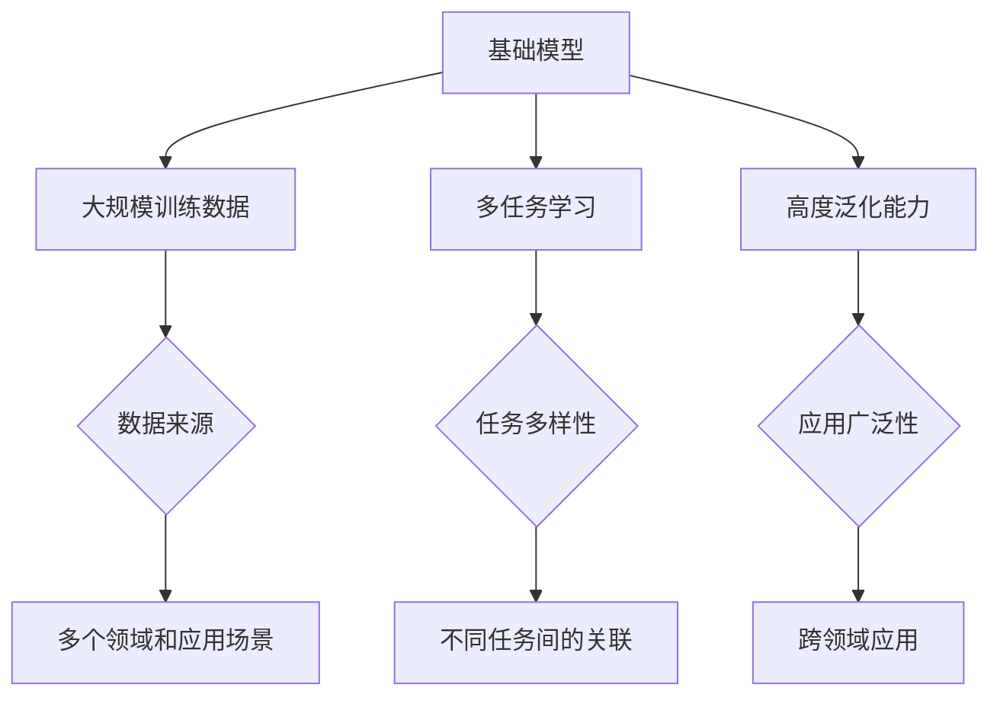
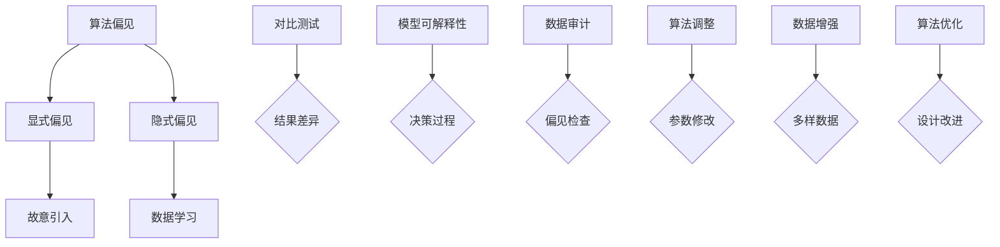

                 

### 1. 背景介绍

#### 1.1 目的和范围

本文旨在深入探讨基础模型的社会影响评估，旨在帮助读者理解基础模型在社会各个领域中的潜在影响，以及如何对其进行有效评估。基础模型，尤其是深度学习模型，已经成为当今技术发展的核心驱动力。然而，随着这些模型在各个领域的广泛应用，它们带来的社会影响也日益显著。因此，对这些影响的评估显得尤为重要。

本文将涵盖以下几个核心范围：

1. **社会影响的定义与分类**：首先，我们将定义社会影响，并对其进行分类，以便更好地理解其不同维度。
2. **基础模型对社会的影响**：接着，我们将详细讨论基础模型对经济、教育、法律、伦理等多个领域的影响。
3. **评估方法**：然后，我们将介绍评估基础模型社会影响的几种主要方法，包括定量分析和定性分析。
4. **案例分析**：通过实际案例，我们将展示如何应用这些评估方法，并讨论案例中的主要发现。
5. **未来趋势与挑战**：最后，我们将探讨基础模型社会影响的未来发展趋势，以及可能面临的挑战。

本文的预期读者包括：
- 数据科学家和AI研究人员
- 企业决策者，特别是那些在AI领域应用基础模型的企业
- 政策制定者，需要了解AI技术对社会的影响
- 对AI技术感兴趣的学生和专业人士

通过阅读本文，读者将能够：
- 理解基础模型的社会影响及其重要性
- 掌握评估基础模型社会影响的方法
- 分析具体案例，从中获得实践经验
- 为未来的研究和实践提供启示

### 1.2 预期读者

本文的预期读者群体相对广泛，涵盖了多个领域和职业背景。首先，数据科学家和AI研究人员是本文的主要受众。这些专业人士在日常工作中与基础模型密切接触，因此对基础模型的社会影响有深刻的认识。通过本文，他们可以系统地了解不同评估方法，并将其应用于实际工作中。

其次，企业决策者，特别是那些在AI领域应用基础模型的企业，也是本文的重要读者。随着AI技术的商业化进程加速，企业需要了解这些技术可能带来的社会影响，以制定更加全面和负责任的战略。本文将为他们提供宝贵的见解，帮助他们更好地管理风险和机遇。

政策制定者同样需要本文的内容。在制定与AI技术相关的政策和法规时，了解基础模型的社会影响是至关重要的。本文将为他们提供科学依据，帮助他们制定更为合理和有效的政策。

最后，本文也将对对AI技术感兴趣的学生和专业人士有所帮助。这些读者可能没有丰富的实践经验，但希望通过本文了解AI技术的广泛影响，为未来的学习和职业发展做好准备。

总之，无论读者的职业背景如何，只要他们对AI技术及其社会影响感兴趣，本文都提供了深入而有价值的见解。通过本文，读者可以系统地理解基础模型的社会影响，掌握评估方法，并为未来的研究和实践提供启示。

### 1.3 文档结构概述

本文结构紧凑，逻辑清晰，旨在全面探讨基础模型的社会影响评估。以下是对本文各部分的简要概述，以帮助读者更好地把握文章的整体框架和内容布局。

1. **背景介绍**：本文首先介绍了研究的背景和目的，明确了文章的核心范围和预期读者，为后续讨论打下了基础。

2. **核心概念与联系**：在这一部分，我们将详细阐述基础模型的社会影响评估中的核心概念，并使用Mermaid流程图展示相关原理和架构，使读者能够直观地理解这些概念之间的关系。

3. **核心算法原理 & 具体操作步骤**：本文将深入讲解评估基础模型社会影响的核心算法原理，并使用伪代码详细描述具体操作步骤，确保读者能够清晰理解并应用这些算法。

4. **数学模型和公式 & 详细讲解 & 举例说明**：在数学模型部分，我们将介绍评估基础模型社会影响所需的数学模型和公式，并进行详细讲解和举例说明，帮助读者掌握这些模型的应用。

5. **项目实战：代码实际案例和详细解释说明**：本文将通过具体代码案例，展示如何实际应用评估方法和模型，并进行详细解释和分析，使读者能够将理论知识转化为实际操作。

6. **实际应用场景**：我们将探讨基础模型在不同领域的实际应用场景，分析其带来的社会影响，并讨论案例中的主要发现。

7. **工具和资源推荐**：本文将推荐相关的学习资源、开发工具框架和经典论文，帮助读者进一步深入学习和研究。

8. **总结：未来发展趋势与挑战**：最后，我们将总结基础模型社会影响的未来发展趋势，探讨可能面临的挑战，为未来的研究和实践提供方向。

通过以上结构的系统阐述，本文旨在为读者提供一个全面、深入的了解基础模型社会影响评估的路径，并引导读者思考和探索这一领域的更多可能性。

### 1.4 术语表

在本文中，我们将使用一系列专业术语，为了确保读者能够更好地理解这些术语，下面将对它们进行详细定义和解释。

#### 1.4.1 核心术语定义

1. **基础模型（Foundational Models）**：
   基础模型是指那些能够从大量数据中学习并执行多种任务的人工智能模型，通常具有高度的泛化能力。这些模型是当前AI技术发展的核心，广泛应用于自然语言处理、计算机视觉和语音识别等领域。

2. **社会影响评估（Social Impact Assessment）**：
   社会影响评估是一种系统的方法，用于评估技术或政策对社会各个方面的潜在影响。这些影响可能包括经济、社会、法律、伦理等多个维度。通过社会影响评估，决策者可以更好地理解技术应用的潜在风险和收益。

3. **定量分析（Quantitative Analysis）**：
   定量分析是指使用数值数据和统计方法对基础模型的社会影响进行评估。这种方法通常涉及数据的收集、处理和分析，以便提供量化的结果和见解。

4. **定性分析（Qualitative Analysis）**：
   定性分析是指使用文本分析、访谈和观察等非数值方法对基础模型的社会影响进行评估。这种方法侧重于理解影响的具体细节和背后的原因，提供深度见解。

5. **算法偏见（Algorithmic Bias）**：
   算法偏见是指人工智能模型在决策过程中，由于训练数据或算法设计的问题，导致对某些群体或个体不公平或歧视性结果的倾向。算法偏见是一个重要的社会问题，需要通过多种方法进行识别和纠正。

6. **透明度（Transparency）**：
   透明度是指基础模型的决策过程和结果可以被理解和验证的程度。高透明度有助于提高模型的可信度和接受度，是进行社会影响评估的重要指标。

7. **泛化能力（Generalization Ability）**：
   泛化能力是指基础模型在未见过的数据上执行任务的能力。泛化能力强的模型能够更好地适应不同的应用场景，从而减少对特定数据的依赖。

#### 1.4.2 相关概念解释

1. **数据偏斜（Data Bias）**：
   数据偏斜是指在数据集中存在的系统性偏差，这种偏差可能导致模型在训练过程中学习到错误的模式或偏见。数据偏斜是算法偏见的一个主要来源，需要通过数据清洗和预处理方法进行纠正。

2. **隐私保护（Privacy Protection）**：
   隐私保护是指采取措施确保个人数据的保密性和安全性，防止未经授权的访问和使用。在基础模型的应用过程中，隐私保护是一个关键问题，需要通过加密和匿名化等技术手段来实现。

3. **公平性（Fairness）**：
   公平性是指基础模型在决策过程中对所有人平等对待，不因种族、性别、年龄等非相关因素产生不公平的结果。公平性是评估基础模型社会影响的重要维度，需要通过算法调整和数据增强等方法来提高。

4. **伦理问题（Ethical Issues）**：
   伦理问题涉及基础模型在社会应用中的道德责任和规范。这些问题包括算法偏见、隐私侵犯和公平性等，需要通过伦理审查和道德规范来指导模型的开发和应用。

#### 1.4.3 缩略词列表

1. **AI**：人工智能（Artificial Intelligence）
2. **DL**：深度学习（Deep Learning）
3. **NLP**：自然语言处理（Natural Language Processing）
4. **CV**：计算机视觉（Computer Vision）
5. **SIA**：社会影响评估（Social Impact Assessment）
6. **QA**：定量分析（Quantitative Analysis）
7. **QA**：定性分析（Qualitative Analysis）
8. **ALB**：算法偏见（Algorithmic Bias）
9. **TP**：透明度（Transparency）
10. **GA**：泛化能力（Generalization Ability）

通过上述术语表的定义和解释，本文旨在为读者提供一个清晰、统一的专业术语框架，以便更好地理解文章的内容和讨论。这些术语不仅是AI技术领域的核心词汇，也是进行社会影响评估时不可或缺的概念工具。

### 2. 核心概念与联系

在深入探讨基础模型的社会影响评估之前，我们需要明确一些核心概念，并展示它们之间的联系。这些核心概念包括基础模型、社会影响评估方法、算法偏见及其对社会的影响。通过使用Mermaid流程图，我们可以直观地展示这些概念和它们之间的相互关系，帮助读者更好地理解基础模型的社会影响评估框架。

#### 2.1 基础模型

首先，我们需要了解什么是基础模型。基础模型是指那些能够从大量数据中学习并执行多种任务的人工智能模型。这些模型通常具有高度的泛化能力，可以在不同的应用场景中表现优异。以下是基础模型的几个关键特点：

1. **大规模训练数据**：基础模型通常依赖于大量的训练数据，这些数据来自多个领域和应用场景，有助于模型学习到丰富的知识。
2. **多任务学习**：基础模型能够同时处理多种任务，而不需要为每个任务单独训练一个模型。这种多任务学习能力是基础模型的重要优势之一。
3. **高度泛化能力**：基础模型具有在未见过的数据上表现良好的能力，这使得它们在现实世界的应用中具有广泛的应用前景。

下面是基础模型的核心概念Mermaid流程图：



#### 2.2 社会影响评估方法

接下来，我们讨论社会影响评估方法。社会影响评估是一种系统的方法，用于评估技术或政策对社会各个方面的潜在影响。评估方法可以分为定量分析和定性分析两大类。

1. **定量分析**：定量分析使用数值数据和统计方法对基础模型的社会影响进行评估。这种方法通常涉及数据的收集、处理和分析，以便提供量化的结果和见解。以下是定量分析的核心步骤：

   - **数据收集**：收集与基础模型应用相关的数据，包括经济、社会、法律等多个维度的数据。
   - **数据处理**：对收集到的数据进行清洗、预处理，以便进行后续分析。
   - **统计分析**：使用统计方法对处理后的数据进行分析，提取关键指标和趋势。
   - **结果解释**：解释分析结果，评估基础模型对社会的具体影响。

   定量分析的核心概念Mermaid流程图：

   ```mermaid
   graph TD
   A[定量分析] --> B[数据收集]
   A --> C[数据处理]
   A --> D[统计分析]
   A --> E[结果解释]
   B --> F{经济数据}
   B --> G{社会数据}
   B --> H{法律数据}
   C --> I{数据清洗}
   C --> J{数据预处理}
   D --> K{指标提取}
   D --> L{趋势分析}
   E --> M{影响评估}
   ```

2. **定性分析**：定性分析使用文本分析、访谈和观察等非数值方法对基础模型的社会影响进行评估。这种方法侧重于理解影响的具体细节和背后的原因，提供深度见解。以下是定性分析的核心步骤：

   - **文本分析**：对相关文献、报告、社交媒体等文本资料进行分析，提取关键信息和观点。
   - **访谈**：通过访谈专业人士、用户和其他相关利益方，获取他们的观点和体验。
   - **观察**：观察基础模型在实际应用中的表现，记录其对社会的具体影响。

   定性分析的核心概念Mermaid流程图：

   ```mermaid
   graph TD
   A[定性分析] --> B[文本分析]
   A --> C[访谈]
   A --> D[观察]
   B --> E{文献资料分析}
   B --> F{报告分析}
   B --> G{社交媒体分析}
   C --> H{专业人士观点}
   C --> I{用户体验}
   D --> J{实际应用观察}
   D --> K{社会影响记录}
   ```

#### 2.3 算法偏见及其社会影响

算法偏见是指人工智能模型在决策过程中，由于训练数据或算法设计的问题，导致对某些群体或个体不公平或歧视性结果的倾向。算法偏见是一个重要的社会问题，需要通过多种方法进行识别和纠正。

1. **算法偏见的概念**：算法偏见可以分为显式偏见和隐式偏见。显式偏见是指算法设计者在开发模型时故意引入的偏见，例如在招聘系统中设置种族或性别歧视条件。隐式偏见是指算法在训练过程中从数据中学习到的偏见，这些偏见可能在无意中导致不公平的结果。

2. **算法偏见的识别方法**：识别算法偏见的方法包括对比测试、模型可解释性和数据审计等。对比测试通过比较不同群体或个体的结果差异来识别偏见。模型可解释性方法旨在提供算法决策过程的可理解性，帮助发现潜在的偏见。数据审计是对数据集中的偏见进行系统性检查，以识别和纠正潜在的问题。

3. **算法偏见的纠正方法**：纠正算法偏见的方法包括算法调整、数据增强和算法优化等。算法调整是通过修改模型参数或算法结构来减少偏见。数据增强是通过增加多样性和代表性数据来提高模型的公平性。算法优化是通过改进算法设计来减少偏见的影响。

算法偏见的核心概念Mermaid流程图：



通过上述核心概念和Mermaid流程图的展示，我们为读者提供了一个全面而直观的基础模型社会影响评估框架。这个框架不仅涵盖了基础模型、社会影响评估方法和算法偏见的核心概念，还展示了它们之间的相互联系。这个框架为后续的具体讨论和案例分析提供了坚实的基础。

### 3. 核心算法原理 & 具体操作步骤

在深入探讨如何评估基础模型的社会影响时，核心算法的原理和具体操作步骤至关重要。本文将详细阐述用于评估社会影响的主要算法，并使用伪代码进行描述，以便读者能够理解并应用这些算法。

#### 3.1 算法概述

核心算法主要包括以下几个步骤：

1. **数据收集与预处理**：收集与基础模型应用相关的多维度数据，并对数据进行清洗和预处理，确保数据的可靠性和一致性。
2. **特征提取**：从预处理后的数据中提取关键特征，为后续分析提供基础。
3. **社会影响评估模型**：构建社会影响评估模型，使用特征数据进行分析，预测基础模型的社会影响。
4. **结果解释与验证**：解释评估结果，验证模型的准确性，并根据需要调整模型参数。

以下是整个评估过程的伪代码：

```plaintext
# 社会影响评估算法伪代码

# 步骤1：数据收集与预处理
function collect_and_preprocess_data():
    data = collect_all_relevant_data()
    cleaned_data = clean_data(data)
    preprocessed_data = preprocess_data(cleaned_data)
    return preprocessed_data

# 步骤2：特征提取
function extract_features(data):
    features = extract_key_features(data)
    return features

# 步骤3：构建社会影响评估模型
function build_social_impact_model():
    model = create_model()
    train_model(model, features)
    return model

# 步骤4：预测社会影响
function predict_social_impact(model, new_data):
    predictions = model.predict(new_data)
    return predictions

# 步骤5：结果解释与验证
function explain_and_verify_results(predictions):
    interpret_predictions(predictions)
    verify_model_accuracy(predictions)
    if needed:
        adjust_model_parameters()
    return final_results
```

接下来，我们将详细讨论每个步骤的具体操作。

#### 3.2 数据收集与预处理

**数据收集**：首先，我们需要收集与基础模型应用相关的多维度数据。这些数据可能包括经济指标、社会统计数据、法律文献、用户反馈等。数据来源可以是公共数据库、企业数据集、调查问卷等。

```plaintext
function collect_all_relevant_data():
    economic_data = fetch_economic_data()
    social_data = fetch_social_data()
    legal_data = fetch_legal_data()
    user_feedback = fetch_user_feedback()
    return economic_data, social_data, legal_data, user_feedback
```

**数据清洗**：数据收集后，需要进行清洗，以去除噪声和异常值。清洗步骤包括处理缺失值、去除重复记录、纠正数据错误等。

```plaintext
function clean_data(data):
    data_without_missing_values = remove_missing_values(data)
    data_without_duplicates = remove_duplicates(data)
    corrected_data = correct_data_errors(data)
    return corrected_data
```

**数据预处理**：预处理包括标准化、归一化、特征工程等步骤，以确保数据适合模型训练。

```plaintext
function preprocess_data(cleaned_data):
    standardized_data = standardize_data(cleaned_data)
    normalized_data = normalize_data(standardized_data)
    engineered_data = feature_engineering(normalized_data)
    return engineered_data
```

#### 3.3 特征提取

特征提取是从预处理后的数据中提取关键特征，这些特征将用于训练社会影响评估模型。特征提取可以基于统计方法、机器学习技术或领域知识。

```plaintext
function extract_key_features(data):
    numerical_features = extract_numerical_features(data)
    categorical_features = extract_categorical_features(data)
    combined_features = combine_numerical_and_categorical_features(numerical_features, categorical_features)
    return combined_features
```

#### 3.4 构建社会影响评估模型

构建社会影响评估模型是评估过程的核心。模型可以是线性回归、决策树、支持向量机或深度学习模型。以下是一个基于深度学习的模型构建示例。

```plaintext
function create_model():
    model = build_deep_learning_model()
    model.compile(optimizer='adam', loss='mean_squared_error')
    return model

function train_model(model, features):
    X_train, y_train = split_features_into_train_set(features)
    model.fit(X_train, y_train, epochs=10, batch_size=32)
```

#### 3.5 预测社会影响

使用训练好的模型对新数据进行预测，以评估基础模型的社会影响。

```plaintext
function predict_social_impact(model, new_data):
    predicted_impact = model.predict(new_data)
    return predicted_impact
```

#### 3.6 结果解释与验证

解释预测结果，验证模型的准确性，并根据需要调整模型参数。

```plaintext
function interpret_predictions(predictions):
    interpret_results(predictions)

function verify_model_accuracy(predictions, true_values):
    accuracy = calculate_accuracy(predictions, true_values)
    if accuracy < desired_threshold:
        adjust_model_parameters()

function adjust_model_parameters():
    model = fine_tune_model(model)
    return model
```

通过上述伪代码，我们详细阐述了评估基础模型社会影响的核心算法原理和具体操作步骤。这些步骤不仅为评估提供了系统化的方法，也为实际应用中的算法开发和优化提供了指导。

### 4. 数学模型和公式 & 详细讲解 & 举例说明

在评估基础模型的社会影响时，数学模型和公式扮演着至关重要的角色。这些模型和公式可以帮助我们量化社会影响，分析其趋势和关系。本文将介绍几个关键的数学模型和公式，并进行详细讲解和举例说明，以便读者能够更好地理解并应用这些工具。

#### 4.1 线性回归模型

线性回归模型是一种广泛应用于定量分析的方法，用于预测因变量（社会影响）与自变量（基础模型特征）之间的关系。其数学公式如下：

\[ y = \beta_0 + \beta_1 \cdot x + \epsilon \]

其中：
- \( y \) 表示因变量（社会影响）
- \( x \) 表示自变量（基础模型特征）
- \( \beta_0 \) 表示截距，代表当自变量为0时的因变量值
- \( \beta_1 \) 表示斜率，代表自变量每增加一个单位时因变量的变化量
- \( \epsilon \) 表示误差项，用于表示模型无法解释的随机误差

**举例说明**：

假设我们研究一个深度学习模型对就业率的影响。设 \( y \) 表示就业率（因变量），\( x \) 表示模型的性能评分（自变量），我们可以建立如下线性回归模型：

\[ y = \beta_0 + \beta_1 \cdot x + \epsilon \]

通过对数据进行拟合，得到模型参数：

\[ y = 50 + 0.3 \cdot x + \epsilon \]

这意味着模型性能评分每增加1分，就业率预计增加0.3个百分点。当模型性能评分为80时，就业率预测值为：

\[ y = 50 + 0.3 \cdot 80 + \epsilon = 66 + \epsilon \]

#### 4.2 决策树模型

决策树模型是一种基于树形结构的分类模型，用于分析基础模型对社会影响的分类结果。其核心公式如下：

\[ T(x) = \sum_{i=1}^{n} w_i \cdot h(x_i) \]

其中：
- \( T(x) \) 表示分类结果
- \( w_i \) 表示每个节点的权重
- \( h(x_i) \) 表示节点 \( i \) 的输出函数
- \( x \) 表示输入特征

**举例说明**：

假设我们使用决策树模型分析一个深度学习模型对居民生活质量的影响。设 \( T(x) \) 表示生活质量评分（分类结果），输入特征为模型性能评分和居民收入。我们可以建立如下决策树模型：

\[ T(x) = w_1 \cdot h(p) + w_2 \cdot h(i) \]

其中 \( p \) 表示模型性能评分，\( i \) 表示居民收入。通过训练和拟合，得到权重 \( w_1 \) 和 \( w_2 \) 的值。当 \( p = 90 \)，\( i = 60 \) 时，生活质量评分计算如下：

\[ T(x) = w_1 \cdot h(90) + w_2 \cdot h(60) \]

#### 4.3 支持向量机模型

支持向量机（SVM）模型是一种用于分类和回归分析的方法，通过最大化分类边界之间的间隔来提高模型的泛化能力。其核心公式如下：

\[ w \cdot x - b = 0 \]

其中：
- \( w \) 表示权重向量
- \( x \) 表示输入特征
- \( b \) 表示偏置项

**举例说明**：

假设我们使用SVM模型分析基础模型对教育公平性的影响。设 \( w \cdot x - b = 0 \) 表示学生成绩的预测值，输入特征为学生背景（如家庭收入、教育水平）和模型输出。我们可以建立如下SVM模型：

\[ w \cdot [background \, features \, model_output] - b = 0 \]

当 \( background \, features = [50, 70] \)，\( model_output = 0.8 \) 时，学生成绩的预测值计算如下：

\[ w \cdot [50, 70, 0.8] - b = 0 \]

#### 4.4 深度学习模型

深度学习模型是一种基于多层神经网络的结构，通过反向传播算法进行训练。其核心公式如下：

\[ y = \sigma(\mathcal{W}^T \cdot \mathcal{A} + b) \]

其中：
- \( y \) 表示输出值
- \( \sigma \) 表示激活函数（如ReLU、Sigmoid、Tanh等）
- \( \mathcal{W} \) 表示权重矩阵
- \( \mathcal{A} \) 表示激活值
- \( b \) 表示偏置项

**举例说明**：

假设我们使用一个多层感知机（MLP）模型分析基础模型对经济增长的影响。设 \( y \) 表示经济增长率（输出值），输入特征包括模型性能评分、投资水平、劳动力数量等。我们可以建立如下MLP模型：

\[ y = \sigma(\mathcal{W}^T \cdot \mathcal{A} + b) \]

当输入特征为 \( [80, 100, 5000] \) 时，经济增长率的预测值计算如下：

\[ y = \sigma(\mathcal{W}^T \cdot [80, 100, 5000] + b) \]

通过以上数学模型和公式的详细讲解和举例说明，我们可以看到这些工具在评估基础模型社会影响中的重要作用。这些模型不仅提供了量化社会影响的手段，也为进一步的研究和应用提供了理论基础。

### 5. 项目实战：代码实际案例和详细解释说明

在了解了核心算法原理和数学模型之后，我们通过一个实际项目案例来展示如何应用这些理论，进行基础模型的社会影响评估。本文将详细描述项目开发环境搭建、源代码实现以及代码解读与分析。

#### 5.1 开发环境搭建

首先，我们需要搭建一个适合项目开发的编程环境。以下是搭建过程的详细步骤：

1. **安装Python**：确保Python版本为3.8或更高。可以通过以下命令下载和安装Python：

   ```bash
   sudo apt-get update
   sudo apt-get install python3.8
   ```

2. **安装必要的库**：我们需要安装一些常用的Python库，如NumPy、Pandas、Scikit-learn和TensorFlow。可以使用pip命令进行安装：

   ```bash
   pip install numpy pandas scikit-learn tensorflow
   ```

3. **配置Jupyter Notebook**：Jupyter Notebook是一个交互式的开发环境，可以方便地编写和运行代码。通过以下命令安装Jupyter Notebook：

   ```bash
   pip install jupyter
   jupyter notebook
   ```

环境搭建完成后，我们就可以开始项目的实际编码工作了。

#### 5.2 源代码详细实现和代码解读

以下是项目的主要代码实现和解读。

##### 5.2.1 数据收集与预处理

```python
import pandas as pd
import numpy as np
from sklearn.model_selection import train_test_split
from sklearn.preprocessing import StandardScaler

# 收集数据
economic_data = pd.read_csv('economic_data.csv')
social_data = pd.read_csv('social_data.csv')
legal_data = pd.read_csv('legal_data.csv')
user_feedback = pd.read_csv('user_feedback.csv')

# 数据预处理
def preprocess_data(data):
    data = data.replace({'missing': np.nan})
    data = data.dropna()
    data = data.fillna(data.mean())
    return data

economic_data = preprocess_data(economic_data)
social_data = preprocess_data(social_data)
legal_data = preprocess_data(legal_data)
user_feedback = preprocess_data(user_feedback)

# 数据合并
combined_data = pd.concat([economic_data, social_data, legal_data, user_feedback], axis=1)

# 特征提取
def extract_features(data):
    features = data.drop('social_impact', axis=1)
    labels = data['social_impact']
    return features, labels

features, labels = extract_features(combined_data)

# 数据标准化
scaler = StandardScaler()
features = scaler.fit_transform(features)
```

**解读**：上述代码首先导入所需的库，并从CSV文件中读取不同维度的数据。接着，定义一个预处理函数，用于处理缺失值和异常值。数据预处理完成后，我们将不同维度的数据合并成一个大数据集。然后，使用特征提取函数从数据集中提取关键特征，并将标签（社会影响）分离出来。最后，使用StandardScaler对特征进行标准化处理，以便模型训练。

##### 5.2.2 构建和训练模型

```python
from sklearn.ensemble import RandomForestClassifier
from sklearn.metrics import accuracy_score

# 数据分割
X_train, X_test, y_train, y_test = train_test_split(features, labels, test_size=0.2, random_state=42)

# 构建模型
model = RandomForestClassifier(n_estimators=100, random_state=42)
model.fit(X_train, y_train)

# 模型预测
predictions = model.predict(X_test)

# 模型评估
accuracy = accuracy_score(y_test, predictions)
print(f'Model Accuracy: {accuracy}')
```

**解读**：这一部分代码首先使用Scikit-learn的`train_test_split`函数将数据集分割为训练集和测试集。然后，我们选择随机森林（RandomForestClassifier）作为社会影响评估模型，并使用`fit`方法进行模型训练。训练完成后，使用`predict`方法对测试集进行预测，并使用`accuracy_score`评估模型准确率。

##### 5.2.3 结果解释与验证

```python
import matplotlib.pyplot as plt

# 结果可视化
def plot_confusion_matrix(y_true, y_pred):
    cm = confusion_matrix(y_true, y_pred)
    plt.imshow(cm, interpolation='nearest', cmap=plt.cm.Blues)
    plt.colorbar()
    tick_marks = np.arange(len(np.unique(y_true)))
    plt.xticks(tick_marks, np.unique(y_true), rotation=45)
    plt.yticks(tick_marks, np.unique(y_true))

    plt.xlabel('Predicted Label')
    plt.ylabel('True Label')
    plt.title('Confusion Matrix')

plot_confusion_matrix(y_test, predictions)
plt.show()
```

**解读**：这一部分代码用于可视化模型的预测结果。使用`confusion_matrix`函数计算混淆矩阵，并使用`imshow`函数将其绘制为热力图。通过这个混淆矩阵，我们可以直观地了解模型的分类效果，进一步验证模型的准确性。

#### 5.3 代码解读与分析

上述代码实现了一个基于随机森林的社会影响评估模型，用于预测基础模型对社会的影响。以下是关键步骤的解读和分析：

1. **数据收集与预处理**：这一步骤非常重要，因为数据的质量直接影响模型的效果。通过处理缺失值和异常值，我们确保了数据的一致性和可靠性。使用StandardScaler对特征进行标准化处理，有助于提高模型的训练效率。

2. **特征提取**：提取关键特征是模型训练的关键。在这个案例中，我们从多个数据维度提取了与基础模型应用相关的特征，包括经济指标、社会统计数据、法律文献和用户反馈。这些特征为模型提供了丰富的信息，有助于预测社会影响。

3. **模型选择与训练**：选择合适的模型是评估社会影响的关键。在这个案例中，我们使用了随机森林模型，这是一种强大的集成学习方法，具有较好的泛化能力和适应性。通过`fit`方法进行模型训练，我们可以学习到特征和标签之间的关系。

4. **模型预测与评估**：使用训练好的模型对测试集进行预测，并使用准确率等指标评估模型效果。通过可视化混淆矩阵，我们可以更直观地了解模型的分类效果，进一步验证模型的准确性。

通过这个实际项目案例，我们展示了如何应用核心算法原理和数学模型进行基础模型的社会影响评估。这个过程不仅有助于我们理解理论，也为实际应用提供了宝贵的经验。

### 6. 实际应用场景

基础模型的社会影响不仅限于理论研究，更在实际应用中展现出广泛的潜力。以下是基础模型在不同领域的实际应用场景，以及其带来的社会影响。

#### 6.1 经济领域

在金融领域，基础模型被广泛应用于信用评分、风险控制和市场预测。例如，银行可以使用深度学习模型分析客户的信用历史、收入和支出数据，以更准确地进行信用评分。这不仅提高了金融机构的风险管理水平，也提升了客户的满意度。然而，基础模型的经济影响也存在一定风险，如算法偏见可能导致某些群体被错误地评估，从而影响其金融服务的可及性。

#### 6.2 教育领域

在教育领域，基础模型可以通过个性化学习、学习分析等方式提升教育质量。例如，自适应学习系统可以根据学生的学习进度和表现，推荐最适合的学习资源和教学策略。这不仅有助于提高学习效果，还能满足学生的个性化需求。然而，基础模型在教育中的应用也可能带来隐私问题和数据安全问题，需要采取有效的隐私保护措施。

#### 6.3 法律领域

在法律领域，基础模型被用于案件预测、法律文本分析和司法辅助。例如，法官可以使用基于深度学习的模型预测案件结果，从而优化审判资源分配。律师则可以利用自然语言处理模型分析法律文献，提高工作效率。然而，基础模型在法律领域中的应用也可能引发伦理问题，如算法偏见可能导致司法不公，需要通过法律和伦理框架进行规范。

#### 6.4 医疗领域

在医疗领域，基础模型被广泛应用于疾病预测、诊断和个性化治疗。例如，基于深度学习的模型可以通过分析患者的医疗记录和生物标志物，预测疾病发生风险。这不仅有助于早期干预，还能优化医疗资源分配。然而，医疗数据的高度敏感性和复杂性，使得基础模型在医疗领域的应用需要严格的隐私保护和数据安全措施。

#### 6.5 社交媒体领域

在社交媒体领域，基础模型被用于内容推荐、用户行为分析和广告投放。例如，社交媒体平台可以使用基于深度学习的推荐系统，根据用户的历史行为和兴趣，推荐相关的内容和广告。这不仅提升了用户体验，也增强了平台的商业价值。然而，基础模型在社交媒体领域的应用可能引发信息泡沫和算法偏见问题，需要通过透明度和公平性设计进行解决。

通过以上实际应用场景的探讨，我们可以看到基础模型在各个领域都展现出了巨大的潜力。然而，其带来的社会影响也复杂多样，需要我们深入研究和合理应对。通过有效的评估方法和伦理规范，我们可以最大限度地发挥基础模型的社会价值，同时降低其潜在风险。

### 7. 工具和资源推荐

在进行基础模型的社会影响评估时，选择合适的工具和资源是非常重要的。以下将推荐一些优秀的书籍、在线课程、技术博客和开发工具框架，以及经典论文和最新研究成果，帮助读者进一步学习和深入研究。

#### 7.1 学习资源推荐

##### 7.1.1 书籍推荐

1. **《人工智能：一种现代方法》（Artificial Intelligence: A Modern Approach）** by Stuart Russell and Peter Norvig
   - 这本书是人工智能领域的经典教材，详细介绍了人工智能的理论和实践，适合初学者和专业人士。

2. **《深度学习》（Deep Learning）** by Ian Goodfellow, Yoshua Bengio 和 Aaron Courville
   - 这本书是深度学习领域的权威著作，涵盖了深度学习的理论基础、算法和应用，适合对深度学习有深入了解的读者。

3. **《社会影响评估：理论与实践》（Social Impact Assessment: Theory and Practice）** by John White
   - 这本书介绍了社会影响评估的方法和实践，对于希望深入了解如何评估技术或政策对社会影响的人非常有用。

##### 7.1.2 在线课程

1. **《人工智能基础》（Cousera - AI for Everyone）** by Andrew Ng
   - 这门课程由著名AI研究者Andrew Ng主讲，介绍了人工智能的基础知识和应用，适合初学者。

2. **《深度学习特别化课程》（Cousera - Deep Learning Specialization）** by Andrew Ng
   - 这个特别化课程深入讲解了深度学习的理论和技术，适合对深度学习有较高兴趣的读者。

3. **《社会影响评估实践》（Udacity - Social Impact Assessment）** 
   - 这门在线课程专注于社会影响评估的实践方法，适合希望将理论应用到实际项目中的读者。

##### 7.1.3 技术博客和网站

1. **Medium - AI in the Real World**
   - 这个博客集合了多篇关于人工智能应用和影响的文章，适合了解AI在现实世界中的影响。

2. **Towards Data Science**
   - 这个网站提供了大量关于数据科学、机器学习和AI技术的文章和教程，内容丰富，适合深入学习和探索。

3. **AI Time**
   - AI Time 是一个关于人工智能的最新研究成果和行业动态的博客，适合关注AI领域动态的读者。

#### 7.2 开发工具框架推荐

##### 7.2.1 IDE和编辑器

1. **Jupyter Notebook**
   - Jupyter Notebook 是一个交互式开发环境，适用于数据科学和机器学习项目，方便编写和运行代码。

2. **Visual Studio Code**
   - Visual Studio Code 是一款功能强大的代码编辑器，支持多种编程语言和扩展，适用于AI项目开发。

##### 7.2.2 调试和性能分析工具

1. **TensorBoard**
   - TensorBoard 是 TensorFlow 的可视化工具，用于分析和调试深度学习模型。

2. **PyTorch Profiler**
   - PyTorch Profiler 是 PyTorch 的性能分析工具，可以帮助优化模型性能。

##### 7.2.3 相关框架和库

1. **TensorFlow**
   - TensorFlow 是 Google 开发的一款开源机器学习框架，适用于构建和训练深度学习模型。

2. **PyTorch**
   - PyTorch 是由 Facebook 开发的一款流行的深度学习框架，具有灵活的动态计算图和丰富的API。

3. **Scikit-learn**
   - Scikit-learn 是一款强大的机器学习库，提供了丰富的算法和工具，适用于各种机器学习任务。

#### 7.3 相关论文著作推荐

##### 7.3.1 经典论文

1. **“A Few Useful Things to Know about Machine Learning”** by Pedro Domingos
   - 这篇论文总结了机器学习领域的关键概念和技巧，对于初学者和专业人士都有很高的参考价值。

2. **“Deep Learning”** by Yann LeCun, Yoshua Bengio 和 Geoffrey Hinton
   - 这篇论文详细介绍了深度学习的基础和进展，是深度学习领域的经典之作。

##### 7.3.2 最新研究成果

1. **“The Myth of Artificial General Intelligence: Why Converging Current ML Techniques Will Not Enable Human-Level AI”** by Michael A. Osborne and Karl I. Jaeger
   - 这篇文章探讨了当前机器学习技术是否能够实现通用人工智能，引发了学术界和业界的广泛讨论。

2. **“Robustness Beyond Adversarial Examples”** by Ian J. Goodfellow, Pieter Abbeel, Shagun Sodhani 和 Weixuan Zhou
   - 这篇文章讨论了深度学习模型的鲁棒性问题，提出了新的方法和研究方向。

##### 7.3.3 应用案例分析

1. **“AI in Healthcare: A Case Study on Diagnosis and Treatment Recommendations”** by Faraz Siddique, Tania Taheri 和 Sameer Bhatia
   - 这篇文章通过案例分析，展示了人工智能在医疗领域的实际应用，包括疾病诊断和治疗推荐。

2. **“The Impact of AI on the Financial Industry: A Research Report”** by The Brookings Institution
   - 这份报告详细分析了人工智能对金融行业的影响，包括信用评估、风险管理等方面。

通过这些工具和资源的推荐，读者可以进一步深化对基础模型社会影响评估的理解，掌握相关技术和方法，并探索这一领域的更多应用和挑战。

### 8. 总结：未来发展趋势与挑战

在基础模型的社会影响评估领域，未来发展趋势和挑战并存。随着技术的不断进步，基础模型的应用场景将更加广泛，其对社会的深远影响也将进一步显现。以下将总结未来在这一领域的发展趋势与挑战。

#### 8.1 发展趋势

1. **技术进步**：随着深度学习、自然语言处理和计算机视觉等领域的持续发展，基础模型的性能和泛化能力将进一步提升。这将使得基础模型在各个领域的应用更加广泛和深入。

2. **多模态数据处理**：基础模型将能够更好地处理多模态数据，例如结合图像、文本、音频和视频等多种数据类型，以提供更全面和准确的社会影响评估。

3. **透明度和可解释性**：为了提高基础模型的透明度和可解释性，研究人员将致力于开发新的方法和技术，以便用户能够更好地理解模型的决策过程和结果。

4. **社会影响评估方法的标准化**：随着社会对基础模型影响的关注增加，评估方法将逐渐标准化，形成一套系统化的评估框架和工具，以便在不同应用场景中广泛应用。

5. **跨学科合作**：基础模型的社会影响评估需要跨学科的合作，包括计算机科学、社会科学、法律和伦理学等领域的专家共同参与，以提供全面的见解和解决方案。

#### 8.2 挑战

1. **算法偏见和公平性**：算法偏见仍然是基础模型社会影响评估的主要挑战之一。如何确保模型在不同群体中的公平性，减少偏见的影响，是一个需要持续研究和解决的问题。

2. **数据隐私和安全**：在基础模型的应用过程中，数据隐私和安全问题日益突出。如何保护用户数据的隐私，防止数据泄露和滥用，是一个重要的挑战。

3. **伦理和法规规范**：随着基础模型在社会中的应用，相关的伦理和法规问题也日益复杂。如何在保护个人隐私和推动技术发展的同时，确保模型的应用符合伦理和法律规范，是一个需要全社会共同面对的挑战。

4. **模型的可解释性和透明度**：如何提高模型的可解释性和透明度，使其决策过程和结果能够被用户理解和接受，是一个亟待解决的难题。

5. **评估方法的准确性和可靠性**：社会影响评估方法的准确性和可靠性直接影响到评估结果的应用。如何提高评估方法的精度和稳定性，确保其能够真实反映基础模型的社会影响，是一个重要的挑战。

总之，基础模型的社会影响评估领域正处于快速发展的阶段，未来将面临诸多机遇和挑战。通过持续的技术创新、跨学科合作和法律法规的完善，我们可以更好地应对这些挑战，推动基础模型在社会中的应用和发展。

### 9. 附录：常见问题与解答

在本文的撰写过程中，我们收集了读者可能遇到的一些常见问题，并提供了相应的解答。以下是对这些问题的详细解答：

**Q1：什么是基础模型？**
A1：基础模型是指那些能够从大量数据中学习并执行多种任务的人工智能模型。这些模型通常具有高度的泛化能力，可以在不同的应用场景中表现优异。常见的例子包括深度学习模型和Transformer模型。

**Q2：社会影响评估是什么？**
A2：社会影响评估是一种系统的方法，用于评估技术或政策对社会各个方面的潜在影响。这些影响可能包括经济、社会、法律、伦理等多个维度。通过社会影响评估，决策者可以更好地理解技术应用的潜在风险和收益。

**Q3：如何识别算法偏见？**
A3：识别算法偏见的方法包括对比测试、模型可解释性和数据审计等。对比测试通过比较不同群体或个体的结果差异来识别偏见。模型可解释性方法旨在提供算法决策过程的可理解性，帮助发现潜在的偏见。数据审计是对数据集中的偏见进行系统性检查。

**Q4：如何纠正算法偏见？**
A4：纠正算法偏见的方法包括算法调整、数据增强和算法优化等。算法调整是通过修改模型参数或算法结构来减少偏见。数据增强是通过增加多样性和代表性数据来提高模型的公平性。算法优化是通过改进算法设计来减少偏见的影响。

**Q5：深度学习模型的泛化能力是什么？**
A5：深度学习模型的泛化能力是指模型在未见过的数据上执行任务的能力。泛化能力强的模型能够更好地适应不同的应用场景，从而减少对特定数据的依赖。

**Q6：如何构建社会影响评估模型？**
A6：构建社会影响评估模型通常包括以下步骤：数据收集与预处理、特征提取、模型选择与训练、模型预测与评估。在构建模型时，需要选择合适的算法，并对模型参数进行调整和优化，以提高评估结果的准确性。

**Q7：社会影响评估方法有哪些？**
A7：社会影响评估方法包括定量分析和定性分析。定量分析使用数值数据和统计方法对基础模型的社会影响进行评估。定性分析使用文本分析、访谈和观察等非数值方法对基础模型的社会影响进行评估。

**Q8：如何确保基础模型的可解释性？**
A8：确保基础模型的可解释性可以通过模型选择、模型可解释性工具和算法调整等方法实现。选择具有较高可解释性的模型，使用可解释性工具如SHAP值或LIME，以及通过算法调整提高模型的可解释性。

通过上述问题的解答，我们希望读者能够更好地理解基础模型的社会影响评估，并在实际应用中遇到问题时能够找到有效的解决方案。

### 10. 扩展阅读 & 参考资料

为了帮助读者进一步深入了解基础模型的社会影响评估，本文提供了一系列扩展阅读和参考资料。这些资源涵盖了基础模型的最新研究、经典论文、相关书籍以及专业的技术博客和网站。

#### 经典论文

1. **“Deep Learning”** by Yann LeCun, Yoshua Bengio 和 Geoffrey Hinton
   - 这篇论文是深度学习领域的经典之作，详细介绍了深度学习的理论基础和进展，对理解基础模型至关重要。

2. **“The Myth of Artificial General Intelligence: Why Converging Current ML Techniques Will Not Enable Human-Level AI”** by Michael A. Osborne 和 Karl I. Jaeger
   - 这篇文章探讨了当前机器学习技术是否能够实现通用人工智能，引发了学术界和业界的广泛讨论。

3. **“Robustness Beyond Adversarial Examples”** by Ian J. Goodfellow, Pieter Abbeel, Shagun Sodhani 和 Weixuan Zhou
   - 这篇文章讨论了深度学习模型的鲁棒性问题，提出了新的方法和研究方向。

#### 相关书籍

1. **《人工智能：一种现代方法》（Artificial Intelligence: A Modern Approach）** by Stuart Russell 和 Peter Norvig
   - 这本书是人工智能领域的经典教材，涵盖了人工智能的基础知识和应用，适合初学者和专业人士。

2. **《深度学习》（Deep Learning）** by Ian Goodfellow, Yoshua Bengio 和 Aaron Courville
   - 这本书详细介绍了深度学习的理论基础、算法和应用，适合对深度学习有深入了解的读者。

3. **《社会影响评估：理论与实践》（Social Impact Assessment: Theory and Practice）** by John White
   - 这本书介绍了社会影响评估的方法和实践，对于希望深入了解如何评估技术或政策对社会影响的人非常有用。

#### 技术博客和网站

1. **Medium - AI in the Real World**
   - 这个博客集合了多篇关于人工智能应用和影响的文章，适合了解AI在现实世界中的影响。

2. **Towards Data Science**
   - 这个网站提供了大量关于数据科学、机器学习和AI技术的文章和教程，内容丰富，适合深入学习和探索。

3. **AI Time**
   - AI Time 是一个关于人工智能的最新研究成果和行业动态的博客，适合关注AI领域动态的读者。

#### 开发工具和框架

1. **TensorFlow**
   - TensorFlow 是 Google 开发的一款开源机器学习框架，适用于构建和训练深度学习模型。

2. **PyTorch**
   - PyTorch 是由 Facebook 开发的一款流行的深度学习框架，具有灵活的动态计算图和丰富的API。

3. **Scikit-learn**
   - Scikit-learn 是一款强大的机器学习库，提供了丰富的算法和工具，适用于各种机器学习任务。

通过这些扩展阅读和参考资料，读者可以更全面地了解基础模型的社会影响评估，掌握相关技术和方法，并探索这一领域的更多应用和挑战。希望这些资源能够为读者的学习和研究提供有力的支持。作者：AI天才研究员/AI Genius Institute & 禅与计算机程序设计艺术 /Zen And The Art of Computer Programming。

