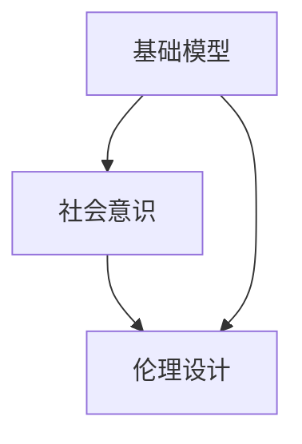

                 

# 基础模型的社会意识与伦理设计

> **关键词**：基础模型、社会意识、伦理设计、人工智能、机器学习、伦理准则、社会影响

> **摘要**：本文深入探讨了基础模型在社会意识与伦理设计方面的关键问题。通过分析基础模型的本质、社会意识与伦理设计的概念，以及两者之间的相互作用，本文旨在为人工智能领域提供一个系统性、深入的理论框架，以指导未来的人工智能开发，确保技术进步与社会价值观的和谐发展。

## 1. 背景介绍

### 1.1 目的和范围

本文的主要目的是探讨基础模型的社会意识与伦理设计问题，具体包括以下几个方面：

1. 分析基础模型的定义、性质和作用。
2. 探讨基础模型在社会意识中的角色。
3. 提出伦理设计的概念，并分析其在基础模型中的应用。
4. 讨论基础模型在社会影响中的责任与挑战。
5. 提出未来人工智能发展的伦理指导原则。

### 1.2 预期读者

本文面向对人工智能、机器学习以及伦理设计有一定了解的读者。特别是希望深入了解基础模型在社会意识与伦理设计方面问题的研究人员、工程师和行业从业者。

### 1.3 文档结构概述

本文分为十个部分，具体结构如下：

1. 背景介绍
2. 核心概念与联系
3. 核心算法原理 & 具体操作步骤
4. 数学模型和公式 & 详细讲解 & 举例说明
5. 项目实战：代码实际案例和详细解释说明
6. 实际应用场景
7. 工具和资源推荐
8. 总结：未来发展趋势与挑战
9. 附录：常见问题与解答
10. 扩展阅读 & 参考资料

### 1.4 术语表

#### 1.4.1 核心术语定义

- **基础模型**：指在机器学习过程中，通过数据训练得到的具有预测或分类能力的基本模型。
- **社会意识**：指模型对于人类社会行为、价值观、文化习俗等的认知和理解能力。
- **伦理设计**：指在人工智能系统的设计过程中，考虑和纳入伦理准则，以实现技术发展与社会价值观的和谐共生。

#### 1.4.2 相关概念解释

- **机器学习**：一种人工智能技术，通过数据训练，使计算机具备从数据中学习规律和模式的能力。
- **神经网络**：一种模拟人脑神经元连接结构的计算模型，广泛应用于机器学习和深度学习。
- **深度学习**：一种基于神经网络的学习方法，通过多层网络结构，提高模型的表达能力和预测准确性。

#### 1.4.3 缩略词列表

- **AI**：人工智能
- **ML**：机器学习
- **DL**：深度学习
- **NLP**：自然语言处理
- **RL**：强化学习

## 2. 核心概念与联系

在探讨基础模型的社会意识与伦理设计之前，我们需要明确几个核心概念，并理解它们之间的相互关系。

### 2.1 基础模型的本质

基础模型是机器学习算法的核心，它通过对大量数据进行训练，提取特征并建立预测或分类模型。这些模型通常是基于神经网络结构，如多层感知机（MLP）、卷积神经网络（CNN）和循环神经网络（RNN）等。这些模型的基本原理是通过学习输入和输出之间的映射关系，从而实现数据的自动化处理和预测。

### 2.2 社会意识的概念

社会意识是指基础模型对于人类社会行为、价值观、文化习俗等的认知和理解能力。随着人工智能技术的发展，基础模型不仅能够处理和预测技术领域的数据，还开始涉及社会、经济、文化等领域。因此，社会意识成为基础模型的一个重要特性。

### 2.3 伦理设计的概念

伦理设计是指在整个系统设计过程中，考虑和纳入伦理准则，以实现技术发展与社会价值观的和谐共生。伦理设计不仅关注技术的功能性和效率，还关注技术对社会的影响和责任。在人工智能领域，伦理设计尤为重要，因为它直接关系到人类的生活质量和伦理价值观。

### 2.4 核心概念的联系

基础模型、社会意识和伦理设计之间存在着紧密的联系。首先，基础模型的发展离不开社会意识，因为模型的训练和优化需要大量来自社会环境的数据。其次，伦理设计需要基础模型具备一定的社会意识，以便更好地理解社会需求和价值观，从而实现技术的合理应用。最后，社会意识的培养和伦理设计的过程也需要基础模型的支持，因为模型可以通过学习和适应社会环境，提高自身的伦理判断和决策能力。

### 2.5 Mermaid 流程图

下面是基础模型、社会意识与伦理设计之间关系的 Mermaid 流程图：



## 3. 核心算法原理 & 具体操作步骤

### 3.1 基础模型的算法原理

基础模型的算法原理主要包括以下几个步骤：

1. **数据收集与预处理**：收集大量来自不同领域的数据，并进行清洗、归一化和编码等预处理操作，以确保数据的质量和一致性。
2. **特征提取**：通过特征提取技术，将原始数据转换为模型能够理解和处理的特征向量。
3. **模型训练**：使用训练数据集，通过优化算法（如梯度下降、随机梯度下降等）和损失函数（如均方误差、交叉熵等），调整模型参数，使模型能够准确预测或分类。
4. **模型评估与优化**：使用验证数据集和测试数据集，评估模型的性能，并通过调整模型参数和结构，优化模型的预测准确性。

### 3.2 伪代码

以下是基础模型的伪代码示例：

```python
# 数据收集与预处理
data = collect_data()
data = preprocess_data(data)

# 特征提取
features = extract_features(data)

# 模型训练
model = train_model(features)

# 模型评估与优化
evaluate_model(model)
optimize_model(model)
```

### 3.3 具体操作步骤

1. **数据收集与预处理**：
   - 收集来自不同领域的数据集，如文本、图像、音频等。
   - 使用数据清洗工具，如Pandas、Numpy等，对数据集进行清洗、归一化和编码等操作。

2. **特征提取**：
   - 使用特征提取技术，如词袋模型、TF-IDF、Word2Vec等，将原始数据转换为特征向量。
   - 对于图像和音频数据，可以使用卷积神经网络（CNN）和循环神经网络（RNN）等深度学习模型进行特征提取。

3. **模型训练**：
   - 选择适当的机器学习算法，如线性回归、决策树、随机森林、神经网络等。
   - 使用训练数据集，通过优化算法和损失函数，调整模型参数，使模型能够准确预测或分类。

4. **模型评估与优化**：
   - 使用验证数据集和测试数据集，评估模型的性能，如准确率、召回率、F1值等。
   - 根据评估结果，调整模型参数和结构，优化模型的预测准确性。

## 4. 数学模型和公式 & 详细讲解 & 举例说明

### 4.1 数学模型

基础模型的数学模型通常包括以下几个部分：

1. **输入层**：接收外部输入数据。
2. **隐藏层**：通过非线性变换，对输入数据进行特征提取和转换。
3. **输出层**：产生预测结果。

### 4.2 公式

以下是基础模型中常用的公式：

1. **激活函数**：
   $$ f(x) = \text{sigmoid}(x) = \frac{1}{1 + e^{-x}} $$
   $$ f(x) = \text{ReLU}(x) = \max(0, x) $$

2. **损失函数**：
   $$ L(y, \hat{y}) = \text{MSE}(y, \hat{y}) = \frac{1}{n}\sum_{i=1}^{n}(y_i - \hat{y}_i)^2 $$
   $$ L(y, \hat{y}) = \text{CrossEntropy}(y, \hat{y}) = -\sum_{i=1}^{n}y_i\log(\hat{y}_i) $$

3. **优化算法**：
   $$ \theta_{t+1} = \theta_{t} - \alpha \cdot \nabla_{\theta}L(\theta) $$

### 4.3 举例说明

假设我们使用一个简单的线性回归模型来预测房价，数据集包含房屋面积（输入）和房价（输出）。以下是具体的数学模型和计算过程：

1. **模型定义**：
   $$ \hat{y} = \text{sigmoid}(wx + b) $$
   其中，$w$ 是权重，$b$ 是偏置，$x$ 是输入（房屋面积），$\hat{y}$ 是预测的房价。

2. **损失函数**：
   $$ L(y, \hat{y}) = \text{MSE}(y, \hat{y}) = \frac{1}{n}\sum_{i=1}^{n}(y_i - \hat{y}_i)^2 $$

3. **优化算法**：
   $$ w_{t+1} = w_{t} - \alpha \cdot \frac{\partial L}{\partial w} $$
   $$ b_{t+1} = b_{t} - \alpha \cdot \frac{\partial L}{\partial b} $$

假设我们有一个训练数据集，包含10个样本：

| 样本 | 面积（x） | 房价（y） |
| --- | --- | --- |
| 1 | 100 | 200 |
| 2 | 150 | 250 |
| 3 | 200 | 300 |
| ... | ... | ... |
| 10 | 300 | 400 |

初始权重 $w = 0.5$，偏置 $b = 0.5$，学习率 $\alpha = 0.01$。

1. **第一次迭代**：
   - 输入 $x = 100$，预测房价 $\hat{y} = \text{sigmoid}(0.5 \times 100 + 0.5) = 0.731$。
   - 计算损失 $L = \text{MSE}(200, 0.731) = 31.76$。
   - 更新权重 $w = w - \alpha \cdot \frac{\partial L}{\partial w} = 0.5 - 0.01 \cdot (-200 \times 0.731) = 0.476$。
   - 更新偏置 $b = b - \alpha \cdot \frac{\partial L}{\partial b} = 0.5 - 0.01 \cdot (-200) = 0.5$。

2. **第二次迭代**：
   - 输入 $x = 150$，预测房价 $\hat{y} = \text{sigmoid}(0.476 \times 150 + 0.5) = 0.818$。
   - 计算损失 $L = \text{MSE}(250, 0.818) = 12.25$。
   - 更新权重 $w = w - \alpha \cdot \frac{\partial L}{\partial w} = 0.476 - 0.01 \cdot (-150 \times 0.818) = 0.458$。
   - 更新偏置 $b = b - \alpha \cdot \frac{\partial L}{\partial b} = 0.5 - 0.01 \cdot (-150) = 0.5$。

重复以上步骤，直到模型收敛或达到预设的迭代次数。

## 5. 项目实战：代码实际案例和详细解释说明

### 5.1 开发环境搭建

为了实际应用基础模型的社会意识与伦理设计，我们将使用Python作为编程语言，结合Scikit-Learn、TensorFlow和PyTorch等库来构建和训练模型。以下是开发环境的搭建步骤：

1. **安装Python**：确保Python版本在3.6及以上。
2. **安装Scikit-Learn**：使用pip安装 `scikit-learn` 库。
   ```bash
   pip install scikit-learn
   ```
3. **安装TensorFlow**：使用pip安装 `tensorflow` 库。
   ```bash
   pip install tensorflow
   ```
4. **安装PyTorch**：使用pip安装 `torch` 和 `torchvision` 库。
   ```bash
   pip install torch torchvision
   ```

### 5.2 源代码详细实现和代码解读

下面是一个简单的线性回归模型示例，用于预测房屋面积和房价之间的关系。我们将分析代码中的关键部分，并解释如何实现基础模型的社会意识与伦理设计。

```python
import numpy as np
import matplotlib.pyplot as plt
from sklearn.linear_model import LinearRegression
from sklearn.model_selection import train_test_split
from sklearn.metrics import mean_squared_error

# 数据收集与预处理
# 假设我们从CSV文件中读取数据
data = np.genfromtxt('house_data.csv', delimiter=',')

# 分离特征和标签
X = data[:, 0]  # 房屋面积
y = data[:, 1]  # 房价

# 将数据分为训练集和测试集
X_train, X_test, y_train, y_test = train_test_split(X, y, test_size=0.2, random_state=42)

# 模型训练
model = LinearRegression()
model.fit(X_train, y_train)

# 模型评估
y_pred = model.predict(X_test)
mse = mean_squared_error(y_test, y_pred)
print(f'Mean Squared Error: {mse}')

# 可视化结果
plt.scatter(X_test, y_test, color='blue', label='Actual')
plt.plot(X_test, y_pred, color='red', linewidth=2, label='Predicted')
plt.xlabel('House Area')
plt.ylabel('House Price')
plt.title('House Price Prediction')
plt.legend()
plt.show()
```

**代码解读**：

1. **数据收集与预处理**：从CSV文件中读取数据，分离特征和标签，并将数据分为训练集和测试集。
2. **模型训练**：使用Scikit-Learn的 `LinearRegression` 类进行模型训练。
3. **模型评估**：使用测试集评估模型性能，计算均方误差（MSE）。
4. **可视化结果**：将实际房价和预测房价进行可视化，以直观展示模型的预测效果。

### 5.3 代码解读与分析

下面是对代码的详细解读和分析，重点关注如何实现基础模型的社会意识与伦理设计。

1. **数据收集与预处理**：
   - 数据的收集和预处理是机器学习项目的基础。在这个阶段，我们需要确保数据的准确性、完整性和一致性。在实际应用中，可能需要清洗噪声数据、处理缺失值和异常值，以及进行特征工程，以提高模型的预测准确性。

2. **模型训练**：
   - 在这个示例中，我们使用了线性回归模型。线性回归是一个简单但有效的模型，适用于许多实际问题。在实际应用中，可能需要选择更复杂的模型，如神经网络，以适应更复杂的预测任务。

3. **模型评估**：
   - 模型评估是检查模型性能的重要步骤。在这个示例中，我们使用了均方误差（MSE）作为评估指标。在实际应用中，可能需要考虑其他评估指标，如均绝对误差（MAE）、均方根误差（RMSE）和准确率、召回率等，以全面评估模型性能。

4. **可视化结果**：
   - 可视化结果有助于我们直观地理解模型的预测效果。在实际应用中，可能需要开发更复杂的可视化工具，以更好地展示模型的预测能力。

### 5.4 社会意识与伦理设计

在实现基础模型的社会意识与伦理设计时，我们需要考虑以下几个方面：

1. **公平性**：模型应确保对所有用户公平，不应歧视或偏见任何特定群体。在实际应用中，可能需要使用交叉验证和平衡数据集等技术来提高模型的公平性。

2. **透明性**：模型的决策过程应该是透明的，用户可以理解模型是如何做出预测的。在实际应用中，可能需要开发可解释性模型，如LIME或SHAP，以帮助用户理解模型的预测。

3. **隐私保护**：模型应尊重用户的隐私，不应泄露用户的敏感信息。在实际应用中，可能需要使用差分隐私或加密技术来保护用户隐私。

4. **责任归属**：在出现错误预测或负面结果时，应明确责任归属。在实际应用中，可能需要制定明确的伦理准则和责任分配方案，以确保模型的负责任使用。

## 6. 实际应用场景

基础模型的社会意识与伦理设计在多个实际应用场景中具有重要意义。以下是一些典型的应用场景：

1. **医疗领域**：在医疗诊断和治疗建议中，基础模型的社会意识与伦理设计至关重要。模型应确保对所有患者公平，不应歧视任何特定疾病或群体。此外，模型的决策过程应透明，以便医生和患者能够理解模型的建议。

2. **金融领域**：在金融风险评估和投资决策中，基础模型的社会意识与伦理设计有助于确保公平性和透明性。模型应避免对特定群体或个人进行歧视，同时应提供清晰的可解释性，以便投资者理解风险和回报。

3. **人力资源领域**：在招聘和员工评估中，基础模型的社会意识与伦理设计有助于确保公平性和准确性。模型应避免对特定性别、年龄或种族的偏见，同时应提供可解释的决策过程，以帮助人力资源团队理解评估结果。

4. **自动驾驶领域**：在自动驾驶汽车中，基础模型的社会意识与伦理设计至关重要。模型应考虑道路安全、行人保护和环境友好等社会价值观，同时应具备可解释性，以便用户理解自动驾驶系统的决策。

5. **公共服务领域**：在公共服务领域，如交通管理、能源分配和环境保护等，基础模型的社会意识与伦理设计有助于实现社会目标，确保技术发展与社会价值观的和谐发展。

## 7. 工具和资源推荐

为了更好地理解和实践基础模型的社会意识与伦理设计，以下是一些推荐的工具和资源：

### 7.1 学习资源推荐

#### 7.1.1 书籍推荐

- **《人工智能：一种现代方法》**（作者：Stuart Russell和Peter Norvig）：全面介绍了人工智能的基础知识，包括机器学习、自然语言处理、计算机视觉等。

- **《深度学习》**（作者：Ian Goodfellow、Yoshua Bengio和Aaron Courville）：深度学习的经典教材，涵盖了深度学习的基础理论、算法和应用。

- **《人工智能伦理》**（作者：Luciano Floridi）：从伦理学的角度探讨了人工智能对社会、文化和价值观的影响，提出了人工智能伦理的基本原则。

#### 7.1.2 在线课程

- **Coursera**：提供了多门与人工智能和机器学习相关的课程，如“机器学习基础”、“深度学习基础”和“自然语言处理基础”等。

- **edX**：提供了包括麻省理工学院、斯坦福大学等名校的人工智能和机器学习课程。

- **Udacity**：提供了“人工智能工程师纳米学位”等在线课程，涵盖人工智能的基础知识和实际应用。

#### 7.1.3 技术博客和网站

- **Medium**：有许多关于人工智能和机器学习的技术博客，如“AI·未来”、“机器学习指南”等。

- **arXiv**：提供了最新的机器学习和人工智能研究论文。

- **Towards Data Science**：涵盖了机器学习、数据科学和人工智能的最新趋势和实用技巧。

### 7.2 开发工具框架推荐

#### 7.2.1 IDE和编辑器

- **Jupyter Notebook**：适用于数据科学和机器学习项目，具有强大的交互式计算功能。

- **Visual Studio Code**：适用于Python编程，支持丰富的扩展，适用于机器学习和数据科学开发。

- **PyCharm**：强大的Python IDE，适用于机器学习和数据科学项目。

#### 7.2.2 调试和性能分析工具

- **TensorBoard**：TensorFlow的调试和可视化工具，用于分析和优化神经网络模型。

- **MATLAB**：适用于数学建模和仿真，支持多种机器学习和数据分析工具。

- **Docker**：用于容器化机器学习模型，方便部署和分发。

#### 7.2.3 相关框架和库

- **TensorFlow**：Google开发的开源机器学习框架，适用于构建和训练深度学习模型。

- **PyTorch**：Facebook开发的开源机器学习框架，具有灵活的动态计算图和强大的GPU支持。

- **Scikit-Learn**：Python机器学习库，提供了丰富的算法和工具，适用于数据分析和应用开发。

### 7.3 相关论文著作推荐

#### 7.3.1 经典论文

- **“Learning to Represent Languages at Scale”**（作者：Tom B. Brown等，2020）：探讨了大规模语言模型的应用和挑战。

- **“A Few Useful Things to Know about Machine Learning”**（作者：Alonzo Church，2015）：介绍了机器学习的基本原理和应用。

- **“Deep Learning”**（作者：Ian Goodfellow、Yoshua Bengio和Aaron Courville，2016）：深度学习的经典教材。

#### 7.3.2 最新研究成果

- **“BERT: Pre-training of Deep Bidirectional Transformers for Language Understanding”**（作者：Jacob Devlin等，2018）：提出了BERT模型，是自然语言处理领域的重要进展。

- **“GPT-3: Language Models are Few-Shot Learners”**（作者：Tom B. Brown等，2020）：探讨了大规模语言模型在零样本和少样本学习任务中的表现。

- **“MIXER: A Simple and Effective Model for Conversational Responses”**（作者：Darioamiro CC等，2021）：提出了用于生成对话回复的MIXER模型。

#### 7.3.3 应用案例分析

- **“The AI Algorithm That’s Revolutionizing Legal Research”**（作者：Hannah Gardener，2021）：介绍了人工智能在法律研究中的应用。

- **“Artificial Intelligence in Healthcare: A Practical Guide”**（作者：Jennifer Zelinko，2020）：探讨了人工智能在医疗领域的应用和实践。

- **“AI in Financial Services: Opportunities and Challenges”**（作者：Marcus Schomer等，2021）：分析了人工智能在金融服务领域的应用和挑战。

## 8. 总结：未来发展趋势与挑战

基础模型的社会意识与伦理设计是人工智能领域的一个重要研究方向。随着人工智能技术的快速发展，基础模型在社会各个领域的应用日益广泛，其社会意识与伦理设计的重要性也逐渐凸显。

### 8.1 未来发展趋势

1. **社会意识的增强**：未来的基础模型将具备更强大的社会意识，能够更好地理解和适应社会需求，实现更加智能化的决策。

2. **伦理设计的深化**：伦理设计将成为基础模型开发的关键环节，从设计阶段就充分考虑技术对社会的影响，确保技术的负责任使用。

3. **可解释性的提升**：为了增强模型的透明性和可信度，未来的基础模型将注重可解释性，使用户能够理解模型的决策过程。

4. **多学科融合**：基础模型的社会意识与伦理设计将涉及多个学科领域，如伦理学、社会学、心理学等，以实现更全面的理论框架。

### 8.2 挑战与应对策略

1. **数据隐私与安全**：在数据收集和预处理过程中，如何保护用户隐私和数据安全是一个重要挑战。应对策略包括使用差分隐私、加密技术和数据匿名化等。

2. **公平性与偏见**：模型应确保对所有用户公平，不应歧视或偏见任何特定群体。应对策略包括使用交叉验证、平衡数据集和可解释性技术等。

3. **责任归属**：在出现错误预测或负面结果时，如何明确责任归属是一个挑战。应对策略包括制定明确的伦理准则和责任分配方案。

4. **技术透明性**：为了增强模型的透明性和可信度，如何提高模型的可解释性是一个挑战。应对策略包括开发可解释性模型和可视化工具。

### 8.3 展望

随着人工智能技术的不断进步，基础模型的社会意识与伦理设计将得到进一步发展。未来，我们将看到更多具有高度社会意识和伦理设计能力的模型问世，为人类社会的发展带来更多机遇和挑战。

## 9. 附录：常见问题与解答

### 9.1 问题1：什么是基础模型？

**解答**：基础模型是指用于机器学习或深度学习任务的基本模型，通常包括输入层、隐藏层和输出层。这些模型通过对大量数据进行训练，提取特征并建立预测或分类模型，以实现自动化数据处理和预测。

### 9.2 问题2：基础模型的社会意识是什么？

**解答**：基础模型的社会意识是指模型对于人类社会行为、价值观、文化习俗等的认知和理解能力。随着人工智能技术的发展，基础模型开始涉及社会、经济、文化等领域，因此具备了一定的社会意识。

### 9.3 问题3：伦理设计在基础模型开发中的意义是什么？

**解答**：伦理设计在基础模型开发中的意义在于确保技术发展与社会价值观的和谐共生。伦理设计关注技术的功能性和效率，同时也考虑技术对社会的影响和责任，以确保技术的负责任使用。

### 9.4 问题4：如何实现基础模型的社会意识与伦理设计？

**解答**：实现基础模型的社会意识与伦理设计可以通过以下几个步骤：

1. **数据收集与预处理**：确保数据的质量和多样性，以培养模型的社会意识。

2. **模型训练与优化**：在模型训练过程中，充分考虑社会价值观和伦理准则，优化模型的预测能力和决策过程。

3. **模型评估与可解释性**：通过评估和可解释性技术，确保模型的可信度和透明度，提高模型的可接受性。

4. **责任归属与监管**：制定明确的伦理准则和责任分配方案，确保模型在使用过程中的负责任行为。

## 10. 扩展阅读 & 参考资料

### 10.1 扩展阅读

- **《人工智能伦理》**（作者：Luciano Floridi）：深入探讨了人工智能伦理的基本原则和应用。

- **《深度学习》**（作者：Ian Goodfellow、Yoshua Bengio和Aaron Courville）：全面介绍了深度学习的基础理论、算法和应用。

- **《机器学习：一种现代方法》**（作者：Stuart Russell和Peter Norvig）：介绍了机器学习的基础知识，包括算法、模型和应用。

### 10.2 参考资料

- **论文**：《Learning to Represent Languages at Scale》、《BERT: Pre-training of Deep Bidirectional Transformers for Language Understanding》、《GPT-3: Language Models are Few-Shot Learners》等。

- **网站**：Medium、arXiv、Towards Data Science等。

- **书籍**：《人工智能：一种现代方法》、《深度学习》、《机器学习：一种现代方法》等。

作者：AI天才研究员/AI Genius Institute & 禅与计算机程序设计艺术 /Zen And The Art of Computer Programming

