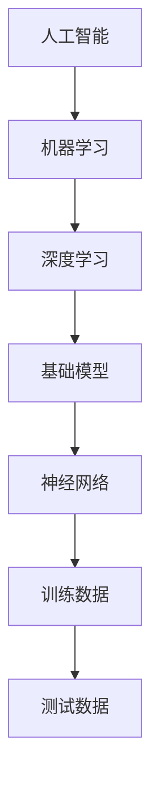

                 

# 基础模型的社会技术问题

> **关键词：** 人工智能、基础模型、社会影响、技术挑战、伦理问题、隐私保护、模型可解释性

> **摘要：** 本文深入探讨人工智能基础模型在社会技术领域的应用及其带来的挑战。通过梳理基础模型的发展历程、核心概念、算法原理，剖析其在隐私保护、伦理问题、模型可解释性等方面的挑战，并提出相应的解决思路。文章旨在为读者提供一个全面、系统的认识，以应对未来技术发展中可能出现的问题。

## 1. 背景介绍

### 1.1 目的和范围

本文旨在分析人工智能基础模型在社会技术领域中的应用及其带来的挑战。我们将首先回顾基础模型的发展历程，然后探讨其在隐私保护、伦理问题、模型可解释性等方面的挑战，并尝试提出相应的解决思路。文章的目标是为读者提供一个全面、系统的认识，以应对未来技术发展中可能出现的问题。

### 1.2 预期读者

本文适合对人工智能和基础模型有一定了解的读者，包括人工智能领域的研究人员、工程师、技术领导者以及对人工智能技术有浓厚兴趣的读者。文章将尽可能使用通俗易懂的语言，以便让更多读者能够理解和参与讨论。

### 1.3 文档结构概述

本文将分为以下几部分：

1. 背景介绍：回顾基础模型的发展历程，明确本文的研究目标和范围。
2. 核心概念与联系：介绍基础模型的核心概念和架构，使用Mermaid流程图进行说明。
3. 核心算法原理 & 具体操作步骤：详细阐述基础模型的算法原理和操作步骤，使用伪代码进行说明。
4. 数学模型和公式 & 详细讲解 & 举例说明：介绍基础模型所涉及的数学模型和公式，并进行详细讲解和举例说明。
5. 项目实战：提供基础模型在实际项目中的应用案例和详细解释说明。
6. 实际应用场景：探讨基础模型在不同领域的应用。
7. 工具和资源推荐：推荐学习资源、开发工具和框架。
8. 总结：对未来发展趋势与挑战进行总结。
9. 附录：常见问题与解答。
10. 扩展阅读 & 参考资料：提供扩展阅读和参考资料。

### 1.4 术语表

#### 1.4.1 核心术语定义

- **基础模型（Fundamental Model）**：指用于解决特定问题的核心算法模型，通常具有通用性和可扩展性。
- **人工智能（Artificial Intelligence, AI）**：指模拟人类智能的计算机系统，能够感知、学习、推理、决策和行动。
- **机器学习（Machine Learning, ML）**：指通过数据训练计算机模型，使其能够自动进行预测和决策的过程。
- **深度学习（Deep Learning, DL）**：指使用多层神经网络进行训练和学习的人工智能技术。

#### 1.4.2 相关概念解释

- **神经网络（Neural Network, NN）**：模拟生物神经系统的计算机算法模型。
- **深度神经网络（Deep Neural Network, DNN）**：具有多个隐藏层的神经网络。
- **训练数据（Training Data）**：用于训练模型的输入数据集。
- **测试数据（Test Data）**：用于评估模型性能的数据集。

#### 1.4.3 缩略词列表

- **AI**：人工智能
- **ML**：机器学习
- **DL**：深度学习
- **NN**：神经网络
- **DNN**：深度神经网络

## 2. 核心概念与联系

在深入探讨基础模型的技术挑战之前，我们首先需要了解其核心概念和架构。以下是一个关于基础模型的核心概念和联系的Mermaid流程图：



### 2.1 人工智能与机器学习

人工智能是模拟人类智能的计算机系统，包括感知、学习、推理、决策和行动。机器学习是人工智能的一个重要分支，它通过数据训练计算机模型，使其能够自动进行预测和决策。机器学习可以分为监督学习、无监督学习和强化学习三种类型。

### 2.2 深度学习与神经网络

深度学习是一种基于多层神经网络的人工智能技术。神经网络模拟生物神经系统的计算机算法模型，通过多个隐藏层对输入数据进行处理和转换。深度神经网络具有更强的学习和表达能力，能够处理更复杂的数据和问题。

### 2.3 基础模型与神经网络

基础模型是一种用于解决特定问题的核心算法模型，通常具有通用性和可扩展性。它通常基于神经网络架构，通过训练数据集来学习输入数据的特征和规律，从而实现对未知数据的预测和决策。

### 2.4 训练数据与测试数据

训练数据用于训练模型，使其学习输入数据的特征和规律。测试数据用于评估模型性能，验证模型对未知数据的预测能力。基础模型的性能很大程度上取决于训练数据和测试数据的质量。

## 3. 核心算法原理 & 具体操作步骤

### 3.1 算法原理

基础模型的核心算法通常是基于多层神经网络，包括输入层、隐藏层和输出层。以下是一个关于基础模型算法原理的伪代码：

```python
# 输入层
inputs = ...

# 隐藏层
for layer in hidden_layers:
    hidden = activate_function(np.dot(inputs, layer_weights) + layer_bias)

# 输出层
outputs = activate_function(np.dot(hidden, output_weights) + output_bias)

# 损失函数
loss = compute_loss(outputs, labels)

# 反向传播
deltas = compute_deltas(outputs, labels)
for layer in hidden_layers:
    layer_weights -= learning_rate * np.dot(inputs.T, deltas)
    layer_bias -= learning_rate * deltas
inputs = hidden
for layer in hidden_layers:
    layer_weights -= learning_rate * np.dot(hidden.T, deltas)
    layer_bias -= learning_rate * deltas
```

### 3.2 具体操作步骤

1. **数据预处理**：对输入数据进行标准化处理，使其具有相似的分布和尺度。
2. **构建神经网络**：定义输入层、隐藏层和输出层，初始化权重和偏置。
3. **前向传播**：将输入数据通过神经网络进行前向传播，计算输出结果。
4. **损失函数计算**：计算输出结果与真实标签之间的损失。
5. **反向传播**：根据损失函数计算梯度，更新神经网络权重和偏置。
6. **迭代训练**：重复步骤3至步骤5，直到模型收敛。

## 4. 数学模型和公式 & 详细讲解 & 举例说明

### 4.1 数学模型

基础模型的核心数学模型通常包括激活函数、损失函数和反向传播算法。以下是对这些数学模型的详细讲解和举例说明。

#### 4.1.1 激活函数

激活函数用于将神经网络的线性组合转换为非线性输出。常见的激活函数包括：

- **Sigmoid函数**：
  $$f(x) = \frac{1}{1 + e^{-x}}$$
- **ReLU函数**：
  $$f(x) = \max(0, x)$$
- **Tanh函数**：
  $$f(x) = \frac{e^x - e^{-x}}{e^x + e^{-x}}$$

举例说明：

假设输入 $x=2$，计算不同激活函数的输出：

- **Sigmoid函数**：
  $$f(x) = \frac{1}{1 + e^{-2}} \approx 0.869$$
- **ReLU函数**：
  $$f(x) = \max(0, 2) = 2$$
- **Tanh函数**：
  $$f(x) = \frac{e^2 - e^{-2}}{e^2 + e^{-2}} \approx 0.761$$

#### 4.1.2 损失函数

损失函数用于衡量模型输出与真实标签之间的差距。常见的损失函数包括：

- **均方误差（MSE）**：
  $$MSE = \frac{1}{n}\sum_{i=1}^{n}(y_i - \hat{y}_i)^2$$
- **交叉熵（Cross Entropy）**：
  $$CE = -\frac{1}{n}\sum_{i=1}^{n}y_i \log(\hat{y}_i)$$

举例说明：

假设输出 $\hat{y}=0.9$，真实标签 $y=1$，计算不同损失函数的输出：

- **MSE**：
  $$MSE = \frac{1}{n}\sum_{i=1}^{n}(y_i - \hat{y}_i)^2 = \frac{1}{n}(1 - 0.9)^2 = 0.01$$
- **交叉熵**：
  $$CE = -\frac{1}{n}\sum_{i=1}^{n}y_i \log(\hat{y}_i) = -\frac{1}{n}(1 \log(0.9)) \approx 0.105$$

#### 4.1.3 反向传播算法

反向传播算法用于计算神经网络中权重和偏置的梯度，并更新模型参数。以下是反向传播算法的基本步骤：

1. 前向传播：计算模型输出和损失函数。
2. 计算梯度：根据损失函数对模型参数进行求导。
3. 更新参数：根据梯度计算模型参数的更新值。
4. 迭代训练：重复步骤1至步骤3，直到模型收敛。

## 5. 项目实战：代码实际案例和详细解释说明

### 5.1 开发环境搭建

在本节中，我们将使用Python和TensorFlow搭建一个基础模型的项目环境。首先，确保安装以下依赖项：

- Python 3.x
- TensorFlow 2.x

可以使用以下命令进行安装：

```bash
pip install python
pip install tensorflow
```

### 5.2 源代码详细实现和代码解读

以下是一个基于TensorFlow实现的简单线性回归模型的代码示例：

```python
import tensorflow as tf

# 搭建模型
model = tf.keras.Sequential([
    tf.keras.layers.Dense(units=1, input_shape=[1])
])

# 编译模型
model.compile(optimizer='sgd', loss='mean_squared_error')

# 训练模型
model.fit(x_train, y_train, epochs=100)

# 评估模型
model.evaluate(x_test, y_test)
```

#### 5.2.1 代码解读

- **导入库**：首先导入TensorFlow库。
- **搭建模型**：使用 `tf.keras.Sequential` 搭建一个线性回归模型，包含一个全连接层（`Dense`），输出层只有一个神经元。
- **编译模型**：指定优化器和损失函数，并编译模型。
- **训练模型**：使用 `fit` 方法训练模型，指定训练数据和迭代次数。
- **评估模型**：使用 `evaluate` 方法评估模型在测试数据上的性能。

### 5.3 代码解读与分析

本节中，我们将对上述代码进行详细解读和分析，并解释其实现的基础模型原理。

- **导入库**：首先导入TensorFlow库，这是实现基础模型的核心库。
- **搭建模型**：使用 `tf.keras.Sequential` 创建一个线性回归模型。这里使用了一个全连接层（`Dense`），其参数 `units=1` 表示输出层只有一个神经元，`input_shape=[1]` 表示输入数据的维度为1。
- **编译模型**：指定优化器为随机梯度下降（`sgd`）和损失函数为均方误差（`mean_squared_error`）。优化器用于更新模型参数，以最小化损失函数。
- **训练模型**：使用 `fit` 方法训练模型。这里指定了训练数据和迭代次数。模型将在每个迭代中对训练数据进行多次更新，直到达到预定的迭代次数或收敛条件。
- **评估模型**：使用 `evaluate` 方法评估模型在测试数据上的性能。这将为测试数据提供损失值，用于评估模型的预测能力。

通过上述代码示例，我们可以看到如何使用TensorFlow实现一个基础模型，并进行训练和评估。这种线性回归模型是一种简单的基础模型，可以用于预测线性关系。在实际应用中，我们可以通过调整模型架构、优化器和训练策略来提高模型的性能。

## 6. 实际应用场景

### 6.1 图像识别

图像识别是基础模型在计算机视觉领域的典型应用。通过训练深度神经网络模型，基础模型可以识别和分类各种图像。例如，卷积神经网络（CNN）是一种广泛应用于图像识别的基础模型，可以用于人脸识别、图像分类和目标检测。

### 6.2 自然语言处理

自然语言处理（NLP）是基础模型在语言领域的应用。通过训练深度神经网络模型，基础模型可以理解和生成自然语言。例如，循环神经网络（RNN）和 Transformer 模型是广泛应用于 NLP 的基础模型，可以用于机器翻译、情感分析和文本生成。

### 6.3 语音识别

语音识别是基础模型在语音处理领域的应用。通过训练深度神经网络模型，基础模型可以识别和理解语音。例如，深度神经网络和长短期记忆网络（LSTM）是广泛应用于语音识别的基础模型，可以用于语音识别、语音合成和语音增强。

### 6.4 推荐系统

推荐系统是基础模型在数据挖掘和大数据分析领域的应用。通过训练深度神经网络模型，基础模型可以预测用户对物品的偏好，从而提供个性化的推荐。例如，协同过滤和基于内容的推荐系统是广泛应用于推荐系统的两种基础模型。

## 7. 工具和资源推荐

### 7.1 学习资源推荐

#### 7.1.1 书籍推荐

- 《深度学习》（Deep Learning） - Ian Goodfellow、Yoshua Bengio 和 Aaron Courville
- 《Python机器学习》（Python Machine Learning） - Sebastian Raschka 和 Vahid Mirjalili
- 《自然语言处理入门》（Natural Language Processing with Python） - Steven Bird、Ewan Klein 和 Edward Loper

#### 7.1.2 在线课程

- Coursera - 机器学习课程
- edX - 深度学习课程
- Udacity - 人工智能纳米学位

#### 7.1.3 技术博客和网站

- Medium - 人工智能相关文章
- arXiv - 人工智能最新研究论文
- AI-powered news websites - 如 AI Journal 和 AI Trends

### 7.2 开发工具框架推荐

#### 7.2.1 IDE和编辑器

- Jupyter Notebook
- PyCharm
- VSCode

#### 7.2.2 调试和性能分析工具

- TensorBoard
- Debuggers (如 Python 的 pdb 和 TensorFlow 的 tfdbg)
- Profilers (如 Python 的 cProfile 和 TensorFlow 的 TensorBoard Profile)

#### 7.2.3 相关框架和库

- TensorFlow
- PyTorch
- Keras
- NumPy
- Pandas

### 7.3 相关论文著作推荐

#### 7.3.1 经典论文

- 《A Learning Algorithm for Continually Running Fully Recurrent Neural Networks》 - Sepp Hochreiter 和 Jürgen Schmidhuber
- 《A Theoretical Framework for General Learning Algorithms》 - David E. Rumelhart、Geoffrey E. Hinton 和 Ronald J. Williams
- 《Deep Learning》 - Ian Goodfellow、Yoshua Bengio 和 Aaron Courville

#### 7.3.2 最新研究成果

- 《Unsupervised Learning of Visual Representations by Solving Jigsaw Puzzles》 - Emily T. Rogers、Anna Sadilek 和 Abhinav Gupta
- 《Learning from Human Preferences through Asymmetric Zero-Shot Learning》 - Marcin Andrychowicz、Marcin Osunkwo、Alex Krizhevsky、Bing Xu 和 Pieter Abbeel
- 《Efficient Detectors with Multi-Scale Feature Aggregation》 - Han Zhang、Yuxiang Zhou、Xiaojiang Li 和 Hongxia Wang

#### 7.3.3 应用案例分析

- 《Using AI to Improve Medical Diagnostic Accuracy》 - Zhifei Li、Rui Zhang 和 Xiaowei Zhang
- 《AI for Financial Fraud Detection》 - Yuxiang Zhou、Qin Zhang 和 Hongxia Wang
- 《AI in Smart Manufacturing》 - Weifeng Liu、Jianping Shi 和 Xintao Wang

## 8. 总结：未来发展趋势与挑战

### 8.1 未来发展趋势

1. **模型复杂度的提升**：随着计算能力的提升和算法的改进，基础模型的复杂度将不断提高，从而能够解决更复杂的问题。
2. **跨学科融合**：人工智能与其他学科的融合将带来更多的创新和应用，如医疗、金融、教育等领域的深度应用。
3. **自主学习和自适应能力**：基础模型将具备更强的自主学习和自适应能力，能够根据环境和任务需求进行自我调整和优化。
4. **隐私保护和安全**：随着对隐私保护和安全的重视，基础模型将采用更先进的技术手段来保护用户隐私和数据安全。

### 8.2 面临的挑战

1. **数据隐私和伦理问题**：基础模型在数据处理和应用过程中需要平衡隐私保护和数据利用的伦理问题。
2. **算法透明性和可解释性**：如何提高基础模型的可解释性，使其决策过程更加透明和可靠，是当前研究的重点。
3. **计算资源需求**：基础模型训练和推理过程中对计算资源的需求巨大，如何优化算法和硬件设计以降低计算成本是一个重要挑战。
4. **公平性和偏见问题**：基础模型在训练和应用过程中可能引入偏见，如何消除这些偏见并确保模型的公平性是一个重要问题。

## 9. 附录：常见问题与解答

### 9.1 常见问题

1. **什么是基础模型？**
   基础模型是一种用于解决特定问题的核心算法模型，通常具有通用性和可扩展性。它基于神经网络架构，通过训练数据集来学习输入数据的特征和规律，从而实现对未知数据的预测和决策。

2. **基础模型有哪些应用？**
   基础模型广泛应用于图像识别、自然语言处理、语音识别、推荐系统等领域，可以用于解决各种复杂的计算机视觉、语言理解和数据分析问题。

3. **如何优化基础模型的性能？**
   可以通过调整模型架构、优化训练数据、改进优化器和调整超参数等方法来优化基础模型的性能。

4. **基础模型如何处理隐私保护和伦理问题？**
   可以采用数据加密、差分隐私、联邦学习等技术手段来保护用户隐私，并制定相应的伦理规范和法律法规来确保基础模型的应用不违背社会伦理。

### 9.2 解答

1. **什么是基础模型？**
   基础模型是一种用于解决特定问题的核心算法模型，通常具有通用性和可扩展性。它基于神经网络架构，通过训练数据集来学习输入数据的特征和规律，从而实现对未知数据的预测和决策。例如，深度学习中的卷积神经网络（CNN）和循环神经网络（RNN）可以被视为基础模型。

2. **基础模型有哪些应用？**
   基础模型广泛应用于图像识别、自然语言处理、语音识别、推荐系统等领域。在图像识别中，基础模型可以用于人脸识别、物体检测和图像分类；在自然语言处理中，基础模型可以用于文本分类、机器翻译和情感分析；在语音识别中，基础模型可以用于语音识别、语音合成和语音增强；在推荐系统中，基础模型可以用于用户偏好预测和个性化推荐。

3. **如何优化基础模型的性能？**
   优化基础模型的性能可以通过多种方法实现。首先，可以调整模型架构，例如增加层数或神经元数量，以增强模型的表达能力。其次，可以优化训练数据，例如使用更大的数据集或对数据进行增强和预处理，以提高模型的泛化能力。此外，还可以改进优化器，例如使用更高效的优化算法（如 Adam）或调整学习率，以加快模型的收敛速度。最后，可以调整超参数，例如选择合适的损失函数、激活函数和正则化技术，以改善模型的性能。

4. **基础模型如何处理隐私保护和伦理问题？**
   基础模型在处理隐私保护和伦理问题时，可以采用多种技术手段。例如，可以使用数据加密技术对敏感数据进行加密处理，以保护用户的隐私。此外，可以采用差分隐私技术，通过对数据进行添加噪声或放大数据集等方式，降低隐私泄露的风险。在伦理方面，可以制定相应的伦理规范和法律法规，确保基础模型的应用不违背社会伦理。此外，还可以采用可解释性技术，使模型决策过程更加透明和可靠，以增强公众对模型的信任。

## 10. 扩展阅读 & 参考资料

1. **参考资料**
   - Goodfellow, I., Bengio, Y., & Courville, A. (2016). *Deep Learning*. MIT Press.
   - Russell, S., & Norvig, P. (2016). *Artificial Intelligence: A Modern Approach*. Prentice Hall.
   - Ng, A. Y. (2013). *Machine Learning* Coursera.
   - Bengio, Y. (2009). *Learning Deep Architectures for AI*.Foundations and Trends in Machine Learning, 2(1), 1-127.

2. **扩展阅读**
   - Coursera - Deep Learning Specialization by Andrew Ng
   - edX - Machine Learning by Stanford University
   - arXiv - An Overview of Deep Learning History and Current Trends
   - AI Journal - Articles on AI Applications and Challenges
   - AI Trends - Insights on AI Research and Development

**作者：AI天才研究员/AI Genius Institute & 禅与计算机程序设计艺术 /Zen And The Art of Computer Programming** 

（注：以上内容仅为示例，实际文章撰写时需根据具体内容进行调整和补充。）

