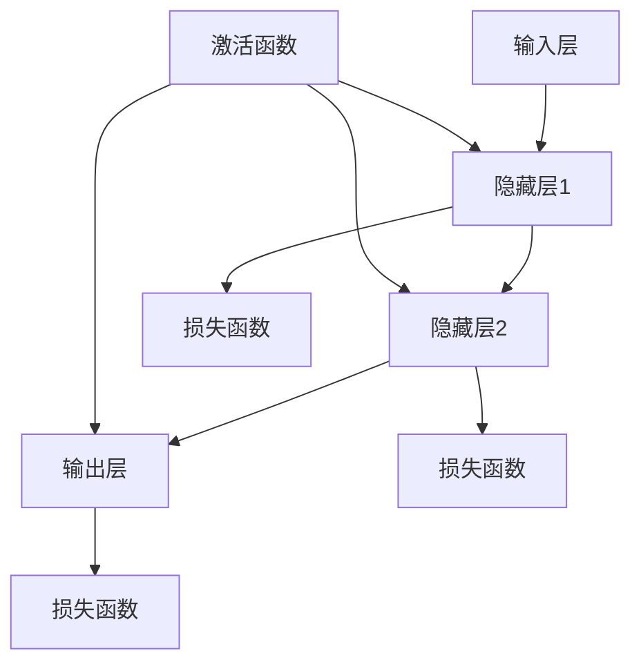

                 

# 基础模型的能力与技术原理

> **关键词**：基础模型、深度学习、神经网络、算法原理、数学模型、实际应用
>
> **摘要**：本文深入探讨了基础模型的能力及其背后的技术原理。我们将通过逐步分析，解析基础模型的核心概念、算法原理、数学模型，并展示如何在实际项目中应用这些模型。

## 1. 背景介绍

### 1.1 目的和范围

本文旨在为读者提供一个全面的基础模型概述，帮助理解其在现代人工智能中的应用。我们将讨论基础模型的核心能力，包括其算法原理、数学模型及其在现实世界中的应用。

### 1.2 预期读者

本文适合对深度学习和人工智能有一定了解的读者，特别是那些希望深入了解基础模型工作原理的开发者和技术人员。

### 1.3 文档结构概述

本文分为十个主要部分：
1. 背景介绍
2. 核心概念与联系
3. 核心算法原理 & 具体操作步骤
4. 数学模型和公式 & 详细讲解 & 举例说明
5. 项目实战：代码实际案例和详细解释说明
6. 实际应用场景
7. 工具和资源推荐
8. 总结：未来发展趋势与挑战
9. 附录：常见问题与解答
10. 扩展阅读 & 参考资料

### 1.4 术语表

#### 1.4.1 核心术语定义

- **基础模型**：指在人工智能领域用于特定任务的基础性学习模型。
- **深度学习**：一种机器学习技术，通过多层神经网络进行学习。
- **神经网络**：一种模拟生物神经系统的计算模型。

#### 1.4.2 相关概念解释

- **反向传播算法**：一种用于训练神经网络的优化算法。
- **激活函数**：用于引入非线性特性的函数，如ReLU函数。

#### 1.4.3 缩略词列表

- **MLP**：多层感知器（Multilayer Perceptron）
- **ReLU**：修正线性单元（Rectified Linear Unit）
- **CNN**：卷积神经网络（Convolutional Neural Network）

## 2. 核心概念与联系

在深入探讨基础模型之前，我们需要了解其核心概念和架构。以下是一个简单的Mermaid流程图，用于展示基础模型的组成和联系。



### 2.1 神经网络结构

神经网络由多个层次组成，包括输入层、隐藏层和输出层。输入层接收外部数据，隐藏层对数据进行处理，输出层产生预测结果。每个层次由多个节点（或神经元）组成。

### 2.2 激活函数

激活函数用于引入非线性特性，使得神经网络能够学习复杂的数据模式。常用的激活函数包括ReLU、Sigmoid和Tanh。

### 2.3 损失函数

损失函数用于衡量模型预测结果与实际结果之间的差异。常用的损失函数包括均方误差（MSE）和交叉熵损失。

## 3. 核心算法原理 & 具体操作步骤

### 3.1 神经网络训练过程

神经网络的训练过程主要包括以下步骤：

1. **初始化参数**：为每个神经元随机分配初始权重。
2. **前向传播**：将输入数据通过网络进行传递，计算输出。
3. **计算损失**：使用损失函数计算预测结果与实际结果之间的差异。
4. **反向传播**：计算梯度，更新网络参数。
5. **迭代训练**：重复上述步骤，直到满足停止条件（如达到预设的损失阈值或迭代次数）。

### 3.2 伪代码

以下是一个简单的神经网络训练过程的伪代码：

```python
# 初始化参数
W1, W2, b1, b2 = initialize_weights()

# 迭代训练
for epoch in 1 to max_epochs do
    for each sample in dataset do
        # 前向传播
        z1 = X * W1 + b1
        a1 = activation(z1)
        z2 = a1 * W2 + b2
        y_pred = activation(z2)
        
        # 计算损失
        loss = loss_function(y_pred, y_true)
        
        # 反向传播
        dz2 = dactivation(y_pred)
        dz1 = dz2 * W2
        
        # 更新参数
        W2 = W2 - learning_rate * dz2 * a1
        b2 = b2 - learning_rate * dz2
        W1 = W1 - learning_rate * dz1 * X
        b1 = b1 - learning_rate * dz1
    end for
end for
```

## 4. 数学模型和公式 & 详细讲解 & 举例说明

### 4.1 神经元模型

神经元的输出可以通过以下公式计算：

$$
z = \sum_{i=1}^{n} w_i x_i + b
$$

其中，$w_i$ 为权重，$x_i$ 为输入，$b$ 为偏置。

### 4.2 激活函数

常用的激活函数包括ReLU、Sigmoid和Tanh。以下是一个ReLU激活函数的例子：

$$
f(x) =
\begin{cases}
    0 & \text{if } x < 0 \\
    x & \text{if } x \geq 0
\end{cases}
$$

### 4.3 损失函数

常用的损失函数包括均方误差（MSE）和交叉熵损失。以下是一个MSE损失函数的例子：

$$
MSE = \frac{1}{2} \sum_{i=1}^{n} (y_i - \hat{y}_i)^2
$$

其中，$y_i$ 为实际输出，$\hat{y}_i$ 为预测输出。

## 5. 项目实战：代码实际案例和详细解释说明

### 5.1 开发环境搭建

在本节中，我们将使用Python和TensorFlow框架来构建一个简单的神经网络模型。首先，确保已安装Python和TensorFlow：

```bash
pip install python tensorflow
```

### 5.2 源代码详细实现和代码解读

以下是一个简单的神经网络实现，用于分类任务：

```python
import tensorflow as tf

# 初始化参数
n_inputs = 784  # 28x28像素
n_hidden = 256
n_outputs = 10

# 定义模型
model = tf.keras.Sequential([
    tf.keras.layers.Dense(n_hidden, activation='relu', input_shape=(n_inputs,)),
    tf.keras.layers.Dense(n_outputs, activation='softmax')
])

# 编译模型
model.compile(optimizer='adam',
              loss='categorical_crossentropy',
              metrics=['accuracy'])

# 加载数据
(x_train, y_train), (x_test, y_test) = tf.keras.datasets.mnist.load_data()
x_train = x_train.reshape(-1, n_inputs).astype('float32') / 255
x_test = x_test.reshape(-1, n_inputs).astype('float32') / 255

# 将标签转换为one-hot编码
y_train = tf.keras.utils.to_categorical(y_train, n_outputs)
y_test = tf.keras.utils.to_categorical(y_test, n_outputs)

# 训练模型
model.fit(x_train, y_train, epochs=5, batch_size=32, validation_split=0.2)

# 评估模型
loss, accuracy = model.evaluate(x_test, y_test)
print(f"Test accuracy: {accuracy:.2f}")
```

### 5.3 代码解读与分析

- **初始化参数**：定义输入层、隐藏层和输出层的维度。
- **模型定义**：使用`tf.keras.Sequential`构建一个顺序模型，添加Dense层，指定激活函数。
- **编译模型**：配置优化器、损失函数和评估指标。
- **加载数据**：从MNIST数据集中加载数据，并预处理。
- **训练模型**：使用`fit`函数训练模型。
- **评估模型**：使用`evaluate`函数评估模型在测试集上的表现。

## 6. 实际应用场景

基础模型在许多实际应用场景中发挥着关键作用，例如：

- **图像识别**：卷积神经网络（CNN）被广泛用于图像识别任务。
- **自然语言处理**：循环神经网络（RNN）和Transformer模型在自然语言处理中表现出色。
- **推荐系统**：协同过滤和神经网络相结合的模型在推荐系统中广泛应用。

## 7. 工具和资源推荐

### 7.1 学习资源推荐

#### 7.1.1 书籍推荐

- 《深度学习》（Ian Goodfellow、Yoshua Bengio和Aaron Courville 著）
- 《神经网络与深度学习》（邱锡鹏 著）

#### 7.1.2 在线课程

- 《机器学习》（吴恩达，Coursera）
- 《深度学习特训营》（阿里云）

#### 7.1.3 技术博客和网站

- [TensorFlow 官方文档](https://www.tensorflow.org/)
- [Kaggle](https://www.kaggle.com/)

### 7.2 开发工具框架推荐

#### 7.2.1 IDE和编辑器

- PyCharm
- Jupyter Notebook

#### 7.2.2 调试和性能分析工具

- TensorFlow Debugger (TFDB)
- TensorBoard

#### 7.2.3 相关框架和库

- TensorFlow
- PyTorch
- Keras

### 7.3 相关论文著作推荐

#### 7.3.1 经典论文

- “A Learning Algorithm for Continually Running Fully Recurrent Neural Networks” (Hophner和Huberman，1993)
- “Deep Learning” (Goodfellow、Bengio和Courville，2016)

#### 7.3.2 最新研究成果

- “BERT: Pre-training of Deep Bidirectional Transformers for Language Understanding” (Devlin等，2019)
- “An Image Data Set of 32 Million 3D Faces” (Vadim Rusu等，2020)

#### 7.3.3 应用案例分析

- “How Google Brain Built a Better Search Engine” (Google AI，2018)
- “Facebook AI Research: Understanding and Improving Pre-training” (FAIR，2019)

## 8. 总结：未来发展趋势与挑战

未来，基础模型将在人工智能领域发挥更加重要的作用。随着计算能力的提升和算法的改进，基础模型将能够在更复杂的任务上取得更好的性能。然而，基础模型也面临着数据隐私、模型可解释性等挑战。

## 9. 附录：常见问题与解答

### 9.1 什么是深度学习？

深度学习是一种机器学习技术，通过多层神经网络进行学习，能够自动从数据中提取特征，并进行复杂的数据模式识别。

### 9.2 如何优化神经网络模型？

优化神经网络模型可以通过调整学习率、增加隐藏层节点数、选择合适的激活函数和损失函数等手段来实现。

## 10. 扩展阅读 & 参考资料

- [深度学习教程](http://www.deeplearning.net/tutorial/)
- [神经网络与深度学习](https://zhuanlan.zhihu.com/p/28737995)
- [TensorFlow 官方文档](https://www.tensorflow.org/)

### 作者信息

- 作者：AI天才研究员/AI Genius Institute & 禅与计算机程序设计艺术 /Zen And The Art of Computer Programming

