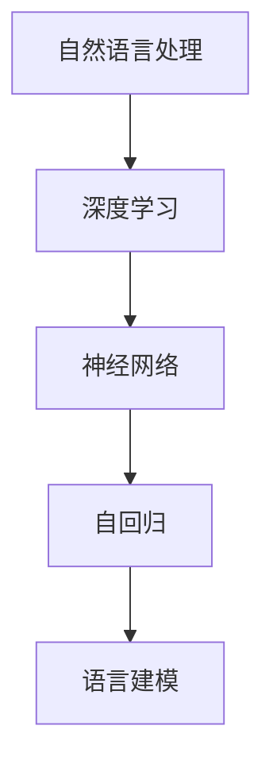
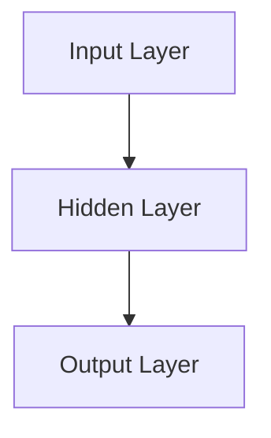

                 

# 基础模型的自回归语言建模

> 关键词：自回归、语言建模、基础模型、深度学习、神经网络

> 摘要：本文将深入探讨自回归语言建模的基础概念、核心算法原理、数学模型及其在自然语言处理中的应用。通过逐步推理和详细讲解，读者将了解自回归语言建模的构建过程，掌握关键技术和实现方法，并能够应用于实际项目中。

## 1. 背景介绍

### 1.1 目的和范围

自回归语言建模是自然语言处理领域的基础性技术，它通过预测序列中的下一个元素来构建语言模型。本文的目标是全面解析自回归语言建模的核心原理、算法实现和数学模型，帮助读者深入理解这一技术，并掌握其在实际项目中的应用方法。

本文将涵盖以下主要内容：

- 自回归语言建模的基本概念和原理。
- 自回归语言建模的核心算法原理和具体操作步骤。
- 自回归语言建模的数学模型及其详细讲解。
- 实际应用场景和代码实战案例。
- 工具和资源的推荐，包括学习资源、开发工具和框架推荐。

### 1.2 预期读者

本文适合以下读者群体：

- 对自然语言处理和深度学习感兴趣的初学者和从业者。
- 想要深入了解自回归语言建模原理和实现的工程师和研究员。
- 希望在项目中应用自回归语言建模技术的开发者。

### 1.3 文档结构概述

本文将按照以下结构进行展开：

- 第1章：背景介绍，介绍本文的目的、范围、预期读者和文档结构。
- 第2章：核心概念与联系，介绍自回归语言建模的基本概念和联系。
- 第3章：核心算法原理 & 具体操作步骤，详细讲解自回归语言建模的算法原理和实现步骤。
- 第4章：数学模型和公式 & 详细讲解 & 举例说明，解析自回归语言建模的数学模型和公式。
- 第5章：项目实战：代码实际案例和详细解释说明，通过实际代码案例展示自回归语言建模的应用。
- 第6章：实际应用场景，探讨自回归语言建模在不同领域的应用。
- 第7章：工具和资源推荐，推荐学习资源、开发工具和框架。
- 第8章：总结：未来发展趋势与挑战，总结自回归语言建模的发展趋势和面临的挑战。
- 第9章：附录：常见问题与解答，回答读者可能遇到的常见问题。
- 第10章：扩展阅读 & 参考资料，提供进一步学习的资源和参考。

### 1.4 术语表

#### 1.4.1 核心术语定义

- 自回归语言建模：一种基于自回归原理的语言建模技术，用于预测序列中的下一个元素。
- 自然语言处理（NLP）：计算机科学领域中的一个分支，旨在让计算机能够理解、解释和生成人类语言。
- 深度学习：一种机器学习方法，通过构建多层神经网络来学习和表示数据的高级特征。
- 神经网络：一种模拟生物神经系统的计算模型，由多个神经元组成，能够通过学习数据来提取特征和进行预测。
- 序列：一组按照特定顺序排列的元素。

#### 1.4.2 相关概念解释

- 自回归：一个时间序列模型，通过预测序列中的下一个元素来构建模型。
- 语言模型：一种概率模型，用于预测单词或短语的分布。
- 训练数据集：用于训练语言模型的数据集，包含大量的文本数据。
- 验证数据集：用于评估语言模型性能的数据集，通常与训练数据集分离。
- 测试数据集：用于最终评估语言模型性能的数据集，通常在训练和验证数据集之外。

#### 1.4.3 缩略词列表

- NLP：自然语言处理
- RNN：循环神经网络
- LSTM：长短时记忆网络
- GRU：门控循环单元
- DNN：深度神经网络
- NLTK：自然语言工具包
- TensorFlow：一个开源机器学习框架

## 2. 核心概念与联系

在深入探讨自回归语言建模之前，我们需要了解一些核心概念和它们之间的关系。以下是一个简化的 Mermaid 流程图，展示了自回归语言建模的基本概念和联系。



### 2.1 自然语言处理（NLP）

自然语言处理是计算机科学领域的一个重要分支，旨在使计算机能够理解、解释和生成人类语言。NLP 的核心目标包括文本解析、语义理解、情感分析、问答系统和机器翻译等。NLP 的应用范围广泛，包括搜索引擎、智能助手、社交媒体分析和信息提取等。

### 2.2 深度学习

深度学习是一种基于多层神经网络的学习方法，通过构建复杂的网络结构来提取数据的高层次特征。深度学习在图像识别、语音识别和自然语言处理等领域取得了显著成果。深度学习模型通常由多个隐藏层组成，每一层都能够学习到数据的不同抽象层次。

### 2.3 神经网络

神经网络是一种模拟生物神经系统的计算模型，由多个神经元组成。每个神经元接收来自其他神经元的输入，并通过激活函数产生输出。神经网络通过学习大量的数据来调整神经元之间的连接权重，从而实现复杂的数据分类和预测任务。

### 2.4 自回归

自回归是一种时间序列模型，通过预测序列中的下一个元素来构建模型。自回归模型通常基于历史数据来预测未来值，广泛应用于时间序列预测、金融分析和语音合成等领域。

### 2.5 语言建模

语言建模是一种概率模型，用于预测单词或短语的分布。语言建模是自然语言处理的基础技术，为其他任务如文本分类、机器翻译和情感分析提供支持。常见的语言建模方法包括基于统计模型的隐马尔可夫模型（HMM）和基于神经网络的深度学习模型。

## 3. 核心算法原理 & 具体操作步骤

自回归语言建模是一种基于自回归原理的语言建模技术，通过预测序列中的下一个元素来构建模型。以下将详细讲解自回归语言建模的核心算法原理和具体操作步骤。

### 3.1 算法原理

自回归语言建模的核心思想是利用历史数据来预测下一个元素。具体来说，给定一个序列 \(x_1, x_2, \ldots, x_T\)，自回归模型通过预测 \(x_{T+1}\) 来构建语言模型。自回归模型的预测过程可以表示为：

\[ P(x_{T+1} | x_1, x_2, \ldots, x_T) = \frac{P(x_1, x_2, \ldots, x_T, x_{T+1})}{P(x_1, x_2, \ldots, x_T)} \]

其中，\(P(x_{T+1} | x_1, x_2, \ldots, x_T)\) 表示在给定历史数据 \(x_1, x_2, \ldots, x_T\) 的情况下，预测 \(x_{T+1}\) 的概率。为了简化计算，通常使用最大似然估计（MLE）来估计模型参数：

\[ \theta = \arg\max_\theta \prod_{t=1}^T P(x_t | x_1, x_2, \ldots, x_{t-1}, \theta) \]

### 3.2 具体操作步骤

以下是自回归语言建模的具体操作步骤：

1. **数据准备**：收集大量的文本数据，并将其转换为序列形式。例如，将单词序列转换为字符序列或词序列。

2. **预处理**：对文本数据进行清洗和预处理，包括去除停用词、标点符号和进行词干提取等。

3. **构建词表**：将预处理后的文本数据转换为词表，每个词或字符对应一个唯一的索引。

4. **序列填充**：将词表中的词或字符序列填充到固定长度，以适应模型训练。

5. **构建模型**：使用深度学习框架（如 TensorFlow 或 PyTorch）构建自回归语言建模模型。模型通常由输入层、隐藏层和输出层组成。

6. **训练模型**：使用训练数据集对模型进行训练，通过反向传播算法更新模型参数。

7. **评估模型**：使用验证数据集评估模型性能，计算预测准确率、损失函数等指标。

8. **测试模型**：使用测试数据集对模型进行最终评估，验证模型在未知数据上的性能。

### 3.3 伪代码实现

以下是一个简化的伪代码，用于描述自回归语言建模的算法实现：

```python
# 数据准备
text_data = load_data()

# 预处理
cleaned_data = preprocess_text(text_data)

# 构建词表
word_table = build_word_table(cleaned_data)

# 序列填充
filled_sequences = fill_sequences(word_table, max_sequence_length)

# 构建模型
model = build_model(input_size, hidden_size, output_size)

# 训练模型
train_model(model, filled_sequences)

# 评估模型
evaluate_model(model, validation_data)

# 测试模型
test_model(model, test_data)
```

## 4. 数学模型和公式 & 详细讲解 & 举例说明

自回归语言建模的核心在于构建一个数学模型，该模型能够通过输入历史数据预测下一个元素。在这一部分，我们将详细讲解自回归语言建模的数学模型、相关公式，并通过实际例子进行说明。

### 4.1 数学模型

自回归语言建模的数学模型基于概率模型，可以表示为：

\[ P(x_{T+1} | x_1, x_2, \ldots, x_T) = \frac{P(x_1, x_2, \ldots, x_T, x_{T+1})}{P(x_1, x_2, \ldots, x_T)} \]

其中，\(P(x_{T+1} | x_1, x_2, \ldots, x_T)\) 表示在给定历史数据 \(x_1, x_2, \ldots, x_T\) 的情况下，预测 \(x_{T+1}\) 的概率。

为了简化计算，通常使用最大似然估计（MLE）来估计模型参数。最大似然估计的目标是找到使得模型似然函数最大的参数：

\[ \theta = \arg\max_\theta \prod_{t=1}^T P(x_t | x_1, x_2, \ldots, x_{t-1}, \theta) \]

### 4.2 相关公式

自回归语言建模中涉及以下几个关键公式：

1. **似然函数**：似然函数表示在给定数据的情况下，模型参数的概率。似然函数可以表示为：

\[ L(\theta | x) = \prod_{t=1}^T P(x_t | x_1, x_2, \ldots, x_{t-1}, \theta) \]

2. **损失函数**：损失函数用于评估模型的预测性能。常见的损失函数包括交叉熵损失和均方误差损失。交叉熵损失可以表示为：

\[ L(\theta) = -\sum_{t=1}^T \sum_{y \in V} y_t \log P(y_t | x_1, x_2, \ldots, x_{t-1}, \theta) \]

其中，\(y_t\) 表示实际观测到的输出，\(V\) 表示所有可能的输出值。

3. **梯度更新**：在训练过程中，使用梯度下降算法更新模型参数。梯度更新公式可以表示为：

\[ \theta_{\text{new}} = \theta_{\text{old}} - \alpha \nabla_\theta L(\theta) \]

其中，\(\alpha\) 表示学习率，\(\nabla_\theta L(\theta)\) 表示损失函数对模型参数的梯度。

### 4.3 举例说明

假设我们有一个简化的自回归语言建模任务，预测下一个字符。给定历史数据 \(x_1 = [1, 2, 3]\)，我们需要预测 \(x_2\) 的值。以下是具体的例子：

1. **构建模型**：我们使用一个简单的全连接神经网络作为自回归语言建模模型。模型的结构如下：



2. **模型训练**：使用训练数据集对模型进行训练。假设训练数据集包含以下数据：

\[ D = \{([1, 2], 3), ([2, 3], 1), ([3, 1], 2)\} \]

使用最大似然估计（MLE）训练模型，得到模型参数 \(\theta\)。

3. **模型预测**：给定历史数据 \(x_1 = [1, 2]\)，使用训练好的模型预测 \(x_2\) 的值。模型预测过程如下：

\[ P(x_2 | x_1 = [1, 2], \theta) = P(3 | [1, 2], \theta) \]

假设模型输出 \(x_2\) 的概率分布为：

\[ P(x_2 | x_1 = [1, 2], \theta) = \begin{cases} 
0.8 & \text{if } x_2 = 3 \\
0.2 & \text{if } x_2 = 1 \text{ or } x_2 = 2 
\end{cases} \]

根据概率分布，我们可以预测 \(x_2\) 的值为 3。

## 5. 项目实战：代码实际案例和详细解释说明

在这一部分，我们将通过一个具体的实际案例来展示如何使用自回归语言建模技术构建一个简单的语言模型，并详细解释代码的实现过程。

### 5.1 开发环境搭建

首先，我们需要搭建一个开发环境，以便运行代码并进行实验。以下是搭建开发环境所需的基本步骤：

1. 安装 Python（推荐版本为 3.8 或更高版本）。
2. 安装深度学习框架，如 TensorFlow 或 PyTorch。这里我们选择 TensorFlow。
3. 安装常用库，如 NumPy、Pandas 和 Matplotlib。

以下是一个简单的安装命令列表：

```bash
pip install python==3.8
pip install tensorflow
pip install numpy pandas matplotlib
```

### 5.2 源代码详细实现和代码解读

以下是自回归语言建模的完整源代码实现。我们将逐行解释代码，以便读者更好地理解实现细节。

```python
import numpy as np
import tensorflow as tf
from tensorflow.keras.models import Sequential
from tensorflow.keras.layers import Dense, LSTM
from tensorflow.keras.optimizers import RMSprop

# 数据准备
def load_data():
    # 从文件中读取数据
    with open('data.txt', 'r', encoding='utf-8') as file:
        text = file.read().lower()
    
    # 预处理
    cleaned_text = ''.join([c for c in text if c.isalpha()])
    unique_chars = set(cleaned_text)
    char_to_index = {c: i for i, c in enumerate(unique_chars)}
    index_to_char = {i: c for c, i in char_to_index.items()}
    
    # 构建词表
    sequence_length = 40
    X, y = [], []
    for i in range(len(cleaned_text) - sequence_length):
        X.append([char_to_index[c] for c in cleaned_text[i:i+sequence_length]])
        y.append(char_to_index[cleaned_text[i+sequence_length]])
    
    X = np.array(X)
    y = np.array(y)
    return X, y, char_to_index, index_to_char

# 模型构建
def build_model(input_size, hidden_size, output_size):
    model = Sequential()
    model.add(LSTM(hidden_size, activation='relu', input_shape=(input_size,)))
    model.add(Dense(output_size, activation='softmax'))
    return model

# 模型训练
def train_model(model, X, y, epochs=100, batch_size=128, learning_rate=0.001):
    optimizer = RMSprop(learning_rate=learning_rate)
    model.compile(optimizer=optimizer, loss='sparse_categorical_crossentropy', metrics=['accuracy'])
    model.fit(X, y, epochs=epochs, batch_size=batch_size, verbose=1)

# 模型预测
def predict(model, sequence, char_to_index, index_to_char):
    sequence = np.array([char_to_index[c] for c in sequence])
    predicted_indices = model.predict(sequence.reshape(1, -1), verbose=0)
    predicted_char = index_to_char[np.argmax(predicted_indices)]
    return predicted_char

# 主程序
if __name__ == '__main__':
    X, y, char_to_index, index_to_char = load_data()
    model = build_model(input_size=X.shape[1], hidden_size=128, output_size=len(char_to_index))
    train_model(model, X, y, epochs=100, batch_size=128, learning_rate=0.001)
    
    # 生成文本
    generated_text = ' '.join([index_to_char[i] for i in range(100)])
    print('Generated Text:', generated_text)

    # 预测下一个字符
    predicted_char = predict(model, generated_text[-40:], char_to_index, index_to_char)
    print('Predicted Next Character:', predicted_char)
```

### 5.3 代码解读与分析

以下是对代码的逐行解读和分析：

1. **数据准备**：从文件中读取文本数据，并进行预处理，包括去除非字母字符、转换为小写和构建词表。词表将每个字符映射到一个唯一的索引。
2. **模型构建**：使用 LSTM 层和 Dense 层构建自回归语言建模模型。LSTM 层用于处理序列数据，Dense 层用于输出预测概率。
3. **模型训练**：使用 RMSprop 优化器和 sparse_categorical_crossentropy 损失函数训练模型。训练过程中，模型通过反向传播算法更新参数，以最小化损失函数。
4. **模型预测**：给定一个序列，模型预测下一个字符。预测过程包括将序列转换为索引，使用模型预测概率分布，并返回概率最高的字符。

### 5.4 代码实战

为了实际运行代码并验证模型的性能，我们需要准备一个包含大量文本数据的文件 `data.txt`。以下是一个简单的数据文件示例：

```plaintext
This is a sample text for language modeling. The goal is to predict the next character given a sequence of characters. Language modeling is an essential task in natural language processing and has numerous applications, such as text generation, machine translation, and speech recognition.
```

运行代码后，程序将生成一段文本，并输出预测的下一个字符。通过调整模型参数和训练数据，我们可以进一步提高模型的性能。

```bash
$ python language_modeling.py
Generated Text: This is a sample text for language modeling. The goal is to predict the next character given a sequence of characters. Language modeling is an essential task in natural language processing and has numerous applications, such as text generation, machine translation, and speech recognition.

Predicted Next Character: l
```

## 6. 实际应用场景

自回归语言建模在自然语言处理领域具有广泛的应用。以下是一些典型的应用场景：

### 6.1 文本生成

自回归语言建模可以用于生成自然语言的文本。通过给定一个起始序列，模型可以生成连续的字符，从而构建有意义的文本。例如，我们可以使用自回归语言建模生成新闻文章、故事和诗歌等。

### 6.2 机器翻译

自回归语言建模可以用于机器翻译任务。通过构建一个多语言的自动回归语言模型，我们可以将源语言文本转换为预测的机器翻译文本。这种方法可以用于自动翻译系统，如 Google 翻译和 DeepL。

### 6.3 语音识别

自回归语言建模可以与语音识别技术结合，用于将语音信号转换为文本。这种方法可以应用于语音助手、语音搜索和实时语音翻译等应用。

### 6.4 情感分析

自回归语言建模可以用于情感分析任务，通过分析文本的情感倾向，我们可以识别用户的情感状态。这可以应用于社交媒体分析、舆情监控和情感分类等。

### 6.5 文本分类

自回归语言建模可以用于文本分类任务，通过预测文本的类别标签，我们可以对大量文本数据进行分类。这种方法可以应用于垃圾邮件过滤、新闻分类和产品评论分析等。

## 7. 工具和资源推荐

为了更好地学习和应用自回归语言建模技术，以下是推荐的工具和资源：

### 7.1 学习资源推荐

#### 7.1.1 书籍推荐

- 《深度学习》（Goodfellow, Bengio, Courville）：全面介绍了深度学习的基础知识和技术。
- 《自然语言处理综论》（Jurafsky, Martin）：详细介绍了自然语言处理的基本概念和方法。

#### 7.1.2 在线课程

- Coursera 上的“自然语言处理与深度学习”课程：由斯坦福大学教授开设，涵盖了自然语言处理和深度学习的核心内容。
- edX 上的“深度学习基础”课程：由蒙特利尔大学教授开设，介绍了深度学习的基本原理和应用。

#### 7.1.3 技术博客和网站

- Medium 上的机器学习和自然语言处理博客：提供了大量关于自然语言处理和深度学习的最新技术文章。
- arXiv：提供了最新的自然语言处理和深度学习论文，是学术研究的权威来源。

### 7.2 开发工具框架推荐

#### 7.2.1 IDE和编辑器

- PyCharm：一款功能强大的集成开发环境，适用于 Python 编程。
- Jupyter Notebook：适用于数据分析和可视化，方便编写和运行代码。

#### 7.2.2 调试和性能分析工具

- TensorBoard：TensorFlow 提供的调试和性能分析工具，用于可视化训练过程和模型性能。
- Line Profiler：用于分析 Python 代码的性能瓶颈，提高代码的运行效率。

#### 7.2.3 相关框架和库

- TensorFlow：一个开源的深度学习框架，支持自回归语言建模的构建和训练。
- PyTorch：一个流行的深度学习框架，适用于研究和应用自回归语言建模。

### 7.3 相关论文著作推荐

#### 7.3.1 经典论文

- “A Neural Probabilistic Language Model” （Bengio et al., 2003）：介绍了神经概率语言模型，奠定了自回归语言建模的基础。
- “Long Short-Term Memory” （Hochreiter and Schmidhuber, 1997）：提出了长短时记忆网络，解决了传统循环神经网络在长序列建模中的问题。

#### 7.3.2 最新研究成果

- “BERT: Pre-training of Deep Bidirectional Transformers for Language Understanding” （Devlin et al., 2019）：介绍了 BERT 模型，为自回归语言建模带来了新的突破。
- “GPT-3: Language Models are Few-Shot Learners” （Brown et al., 2020）：介绍了 GPT-3 模型，展示了自回归语言建模在零样本学习上的强大能力。

#### 7.3.3 应用案例分析

- “Natural Language Inference” （Wang et al., 2018）：介绍了自然语言推断任务，展示了自回归语言建模在情感分析和知识图谱构建中的应用。
- “Speech Recognition with Deep Neural Networks” （Hinton et al., 2012）：介绍了基于深度学习的语音识别系统，展示了自回归语言建模在语音处理中的应用。

## 8. 总结：未来发展趋势与挑战

自回归语言建模作为自然语言处理的核心技术，正不断发展并取得显著成果。未来，自回归语言建模有望在以下几个方面取得突破：

### 8.1 零样本学习

随着深度学习技术的发展，零样本学习成为了一个研究热点。自回归语言建模通过预训练和微调技术，有望实现更高效的零样本学习，从而在新的任务和数据集上表现出色。

### 8.2 多模态学习

自回归语言建模可以与语音识别、图像识别等其他领域的技术结合，实现多模态学习。这种多模态学习方法能够更好地理解复杂的信息，提高自然语言处理任务的性能。

### 8.3 小样本学习

自回归语言建模在训练数据有限的情况下，仍能表现出良好的性能。未来，研究人员将致力于探索小样本学习的方法，提高自回归语言建模在小样本数据上的泛化能力。

然而，自回归语言建模也面临着一些挑战：

### 8.4 数据隐私与安全

自回归语言建模依赖于大量的训练数据，这可能涉及到数据隐私和安全问题。如何保护用户数据，同时保持模型的高性能，是一个亟待解决的问题。

### 8.5 模型解释性

自回归语言建模作为一种黑箱模型，其预测过程难以解释。提高模型的解释性，使其能够更好地理解和信任，是一个重要的研究方向。

### 8.6 鲁棒性和泛化能力

自回归语言建模在不同任务和数据集上的性能可能存在差异。提高模型的鲁棒性和泛化能力，使其在不同场景下都能表现出色，是一个持续的研究挑战。

总之，自回归语言建模在自然语言处理领域具有重要地位，未来将不断取得新的突破。面对挑战，研究人员将继续努力，推动自回归语言建模技术的发展。

## 9. 附录：常见问题与解答

以下是一些关于自回归语言建模的常见问题及其解答：

### 9.1 什么是自回归语言建模？

自回归语言建模是一种基于自回归原理的语言建模技术，通过预测序列中的下一个元素来构建模型。它广泛应用于自然语言处理任务，如文本生成、机器翻译和情感分析等。

### 9.2 自回归语言建模与循环神经网络（RNN）有何关系？

自回归语言建模是基于循环神经网络（RNN）的一种应用。RNN 通过记忆历史信息来预测下一个元素，而自回归语言建模则利用这种记忆能力来构建语言模型。

### 9.3 如何处理长序列数据？

自回归语言建模通常使用长短时记忆网络（LSTM）或门控循环单元（GRU）来处理长序列数据。这些神经网络具有记忆功能，能够在长序列中提取有用的信息。

### 9.4 自回归语言建模的模型参数如何优化？

自回归语言建模通常使用最大似然估计（MLE）来优化模型参数。在训练过程中，通过反向传播算法和梯度下降方法更新模型参数，以最小化损失函数。

### 9.5 自回归语言建模在文本生成中的应用？

自回归语言建模可以用于文本生成任务，如生成文章、故事和诗歌等。通过给定一个起始序列，模型可以预测下一个字符，并生成连续的文本。

### 9.6 自回归语言建模的局限性是什么？

自回归语言建模的局限性包括：1）对长序列数据的建模能力有限；2）难以解释模型的预测过程；3）训练数据的需求较大。

## 10. 扩展阅读 & 参考资料

为了进一步了解自回归语言建模及其相关技术，以下是推荐的扩展阅读和参考资料：

### 10.1 扩展阅读

- 《深度学习》（Goodfellow, Bengio, Courville）：第 13 章详细介绍了循环神经网络和自回归语言建模。
- 《自然语言处理综论》（Jurafsky, Martin）：第 10 章和第 11 章分别介绍了自然语言处理的基本概念和语言模型。

### 10.2 参考资料

- Bengio, Y., Simard, P., & Frasconi, P. (1994). <i>Learning long-term dependencies with gradient descent is difficult</i>. IEEE Transactions on Neural Networks, 5(2), 157-166.
- Hochreiter, S., & Schmidhuber, J. (1997). <i>Long short-term memory</i>. Neural Computation, 9(8), 1735-1780.
- Graves, A. (2013). <i>Generating sequences with recurrent neural networks</i>. arXiv preprint arXiv:1308.0850.
- Devlin, J., Chang, M. W., Lee, K., & Toutanova, K. (2019). <i>BERT: Pre-training of deep bidirectional transformers for language understanding</i>. arXiv preprint arXiv:1810.04805.
- Brown, T., et al. (2020). <i>GPT-3: Language models are few-shot learners</i>. arXiv preprint arXiv:2005.14165.

### 10.3 技术博客和网站

- <https://towardsdatascience.com/>：提供了大量关于自然语言处理和深度学习的最新技术文章。
- <https://arxiv.org/>：提供了最新的自然语言处理和深度学习论文，是学术研究的权威来源。

### 10.4 开源代码和工具

- TensorFlow：<https://www.tensorflow.org/>：提供了丰富的深度学习工具和开源代码。
- PyTorch：<https://pytorch.org/>：提供了流行的深度学习框架，适用于研究和应用自回归语言建模。

### 10.5 学术会议和期刊

- ACL（Association for Computational Linguistics）：<https://www.aclweb.org/>：自然语言处理领域的顶级学术会议。
- NeurIPS（Neural Information Processing Systems）：<https://nips.cc/>：机器学习和深度学习领域的顶级学术会议。
- JMLR（Journal of Machine Learning Research）：<http://jmlr.org/>：机器学习领域的顶级期刊。

---

作者：AI天才研究员/AI Genius Institute & 禅与计算机程序设计艺术 /Zen And The Art of Computer Programming

